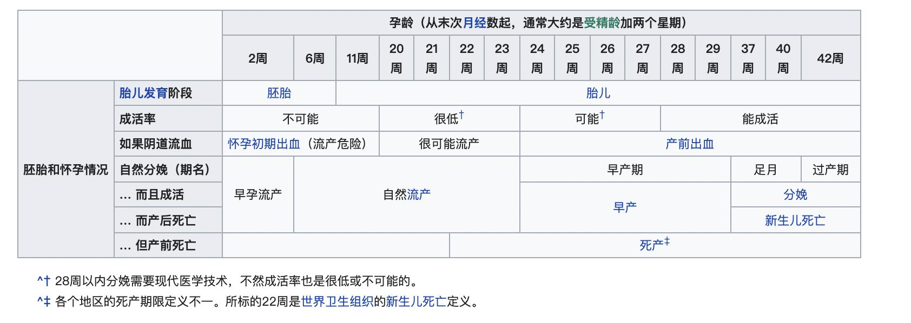

[TOC]

# 生育指南

## 备孕

### 不良因子

备孕需要避免以下一些不良因子：

1. 高龄生育
2. 身体慢/急性疾病
3. 过大压力
4. 睡眠不足
5. 营养不足（叶酸缺乏）
6. 热盆浴，桑拿以及紧身衣服
7. 自行车座（待确认）
8. 激烈运动（待确认）
9. 放射物和化学物质
10. 电磁辐射
11. 治疗高血压，溃疡，癌症，心脏病，肠炎，病毒感染的药物（待确认）
12. 饮酒
13. 吸烟
14. 电磁辐射
15. 寄生虫感染
16. 可卡因

### 产前检查

- 血常规

  可尽早发现是否贫血，以免给宝宝生长发育带来影响。

- 尿常规

  怀孕后肾脏负担加重，检查肾脏是否存在问题，以免造成严重后果。

- 粪常规

  检查有没有寄生虫，如果有尽早发现有可能导致流产和胎儿畸形。

- 肝功能

  母亲如果是病毒性肝炎患者，怀孕有可能导致胎儿早产或死亡，肝炎病毒也会传播给孩子。

- 妇科检查

  检查有没有可能导致胎儿流产和早产的危险。

- 染色体检查

  可以尽早地发现一些遗传疾病和不孕症。

- 体格检查

  对身体和生育能力进行一次综合评估。

- 其他

  TORCH检查，口腔检查...

## 孕期

妊娠（gestation）/怀孕（pregnancy），是指胚胎或胎儿在女性体内孕育成长的过程。

### 孕龄

- 第一期（受精当周开始第1～12周）

  受精后形成的受精卵会经输卵管向下移动，接触子宫内层着床，并开始发育成胎儿与胎盘；此阶段流产的风险最高。

- 第二期（受精当周开始第13～28周）

  此阶段可能会感受到胎儿活动。第28周时，如果接受高品质的医疗照护，大于90%的胎儿可在子宫外存活。

- 第三期（受精当周开始第29～40周）

  胎儿开始具备母体外存活能力。

孕龄的计算方式：

| 计算孕龄方式                                                 | 离散程度（2个标准差） |
| ------------------------------------------------------------ | --------------------- |
| 体外人工受精时，自取卵或共同培养（co-incubation）的日期计算，再加14天 | $\pm1$天              |
| 以诱导排卵时间来估计排卵日，再加14天                         | $\pm3$天              |
| 自人工受精起计算，再加14天                                   | $\pm3$天              |
| 自已知明确的性交日起计算，再加14天                           | $\pm3$天              |
| 以基础体温计算的排卵日为准，再加14天                         | $\pm4$天              |
| 前三个月的理学检查                                           | $\pm2$周              |
| 前四至六个月的理学检查                                       | $\pm4$周              |
| 前三个月的产科超音波摄影（顶臀长）                           | 估计时间的$\pm8$%     |
| 第四至六个月的产科超音波摄影（头周长，股骨长度）             | 估计时间的$\pm8$%     |
| 第七至九个月的产科超音波摄影（头周长，股骨长度）             | 估计时间的$\pm8$%     |

### 历程

1. 受精

   在妊娠开始前卵子要先遇到精子而产生作用；成熟的卵子从卵巢排出，与第一个精子结合后，引发精子产生**顶体反应**(acrosomal reaction，顶体由溶酶体改变而成，位于精子前方，精子释出体内的水解酵素穿过卵子的透明带，融合成合子，把细胞核内的单倍体注入次级卵母细胞；注入后，卵子便启动皮质反应以阻止其他精子进入卵子，并且刺激钙离子传递讯号引发卵子激活，两者的单倍体结合产生新的双倍体)。

2. 着床

   妊娠是胚胎在子宫内膜着床开始，在授精后第七天发生。胚胎着床之后，母体黄体素浓度会维持在排卵后的浓度(5ng/ml)，雌激素也会维持在高浓度。

3. 怀孕初期

   一般从闭经6周开始，约12周前后自然消息，此段时间会出现早孕反应：择孕，食欲不振，轻度恶心呕吐(害喜)，头晕，倦怠等症状。**在早晨起来后吃饼干或面食可减轻症状，饼干膨化吸收胃酸，面食碱性可中和胃酸，补充维生素B6可减轻孕吐反应**

4. 怀孕中期

   胎盘会分泌大量黄体素，母体的黄体素会高达100~200ng/ml；同时分泌催乳素，增加母体的血糖与血脂浓度，最后导致胎儿的营养摄取增加；黄体素与催乳素共同作用，促使乳腺充分发育。

5. 怀孕晚期

   体重增加的最后阶段，胎儿定期活动，可能会导致腰酸背痛和膀胱无力等症状，此时孕妇的腹部中线会出现深色的妊娠线。

### 营养补充

| 养分               | 建议每日摄取量（RDA）(多加>=RDA)        | 最大摄入量     | 备注                                                         |
| ------------------ | --------------------------------------- | -------------- | ------------------------------------------------------------ |
| 热量               | 第三孕期每天增加200kcal（840KJ）        | 建议每日摄取量 |                                                              |
| 蛋白质             | 每天多加6g                              | 每天51g        |                                                              |
| 硫胺（维生素B1）   | 与身体的能量需求增加；每天增加0.5mg     | 每天1.5mg      | 孕妇及小儿因发育关系需要较多。乳母1.8mg；缺乏能导致婴儿先天性脚气病 |
| 核黄素（维生素B2） | 细胞生长；多加0.3mg                     | 每天1.4mg      | 孕妇及小儿因发育关系需要较多。乳母1.6mg；                    |
| 烟酸（维生素B3）   | 不需要补充。定期补充/在饮食摄取量足够。 | 建议每日摄取量 |                                                              |
| 维生素C            | 每天补充身体存储量；多加70mg            | 每天100mg      | 中，晚期孕妇乳母130mg                                        |
| 维生素D            | 每天补充血浆的维生素10微克              | 建议每日摄取量 | 协助钙，磷的吸收与运用                                       |
| 钙                 | 不需要补充                              | 建议每日摄取量 | 构成骨骼和牙齿的主要成分                                     |
| 铁                 | 每天多加3mg                             | 建议每日摄取量 |                                                              |
| 镁，锌，铜         | 正常摄入和补充                          | 建议每日摄取量 |                                                              |
| 碘                 | 每天多加100微克                         | 每天250微克    |                                                              |

### 不良因子

1. 吸烟

   - 流产风险增加1倍；
   - 过度活跃症风险由4.6%上升为16.5%；
   - 哮喘与体重过低的风险增加。

2. 饮酒

   - 导致胎儿酒精综合症风险上升；

3. 可卡因

   - 导致儿童缺陷和血管收缩，影响器官血液流量，导致妊娠并发症，胎盘剥离和早产。

4. 电离辐射

   X光，CT扫描，PET-CT扫描放射治疗等都是利用电离辐射的穿透性，对孕妇有影响，要权衡利弊；

5. 电磁辐射

   - 怀孕1~3月：胎儿处于胚胎期，胎膜，胎盘正在形成中，电磁辐射会使细胞的脱氧核糖核酸；
   - 怀孕4~5月：胎儿处于大脑形成期，电磁辐射能引起营养缺乏和脑缺氧，从而影响锌和钙吸收的速度，容易造成胎儿智力低下，大脑缺氧，低能和痴呆等；
   - 怀孕6~10月：胎儿处于成长期，电磁辐射影响血循环和微循环，造成胎儿整体营养不良和缺氧，破坏胎儿生物酶的活性，胎儿对微量元素吸收数组，影响胎儿的免疫功能，造成出生后婴儿体弱多病。

   联合国原子符合效应科学委员会和国际放射防止委员会指出：胚胎和胎儿组织特别容易受辐射损伤：

   1. 植入前期受照射导致胚胎死亡；
   2. 器官形成期受照射主要造成发育中胎儿器官畸形；
   3. 胎儿发育期照射主要损伤中枢神经系统，表现为脑缺氧和智力低下。

### 并发症

| 疾病               | 描述                                         | 预防措施                                                     | 治疗措施 |
| ------------------ | -------------------------------------------- | ------------------------------------------------------------ | -------- |
| 葡萄胎             |                                              | - 做好避孕，有过葡萄胎史的，应该严格做好避孕，等到HCG值正常后再考虑备孕问题 - 避免高龄怀孕 |          |
| 宫外孕             |                                              |                                                              |          |
| 贫血               |                                              |                                                              |          |
| 背痛               |                                              |                                                              |          |
| 腕隧道症候群       | 在大约21%到62%孕妇中出现，起因多为水肿       |                                                              |          |
| 便秘               | 肠道活动减少和黄体素上升，会导致大量吸收水分 |                                                              |          |
| 水肿               |                                              |                                                              |          |
| 环型韧带疼痛       |                                              |                                                              |          |
| 胃食管反流病和恶心 |                                              |                                                              |          |
| 盆骨疼痛           |                                              |                                                              |          |

## 分娩

### 早产

在20～37周之间出生，称为早产；可能会造成如脑性麻痹等健康风险，如果在39周以前分娩，除非有其他情况，否则不建议人工引产或刨腹产。

### 足月妊娠

第37周作为早产和足月妊娠的分界线

- 早期足月产（第37～38周）
- 足月产（第39～40周）
- 过月产（第41周）

### 过期妊娠

怀孕大于41周以上称为过期妊娠

### 并发症

TODO

## 产后护理

### 并发症

TODO

## 费用

### 生育费用

TODO

### 生育保险

#### 生育医疗费用

| 项目                      | 广州 |
| ------------------------- | ---- |
| 产前检查                  |      |
| 顺产                      |      |
| 难产(含刨宫产)            |      |
| 多胎分娩                  |      |
| 流产/引产 (门诊和住院) |      |
| 领取条件                  |      |

#### 生育津贴

生育津贴由生育保险基金按照参保人生育或者计算公式：$生育津贴=单位上年度职工月平均工资\div30\times规定的假期天数$

- 规定的假期天数按广州最低标准计算

TODO

## 参考

### 外部链接

- [电磁辐射对胎儿的影响分阶段解析](http://www.chinacses.org/shjd/hjjk/dcfs/201606/t20160629_634115.shtml#:~:text=%E7%94%B5%E7%A3%81%E8%BE%90%E5%B0%84%E8%83%BD%E7%9B%B4%E6%8E%A5%E5%BD%B1%E5%93%8D,%E6%B0%A7%E3%80%81%E4%BD%8E%E8%83%BD%E5%92%8C%E7%97%B4%E5%91%86%E7%AD%89%E3%80%82)
- [维基百科-妊娠](https://en.wikipedia.org/wiki/Pregnancy)
- [维基百科-产前诊断](https://zh.wikipedia.org/wiki/%E7%94%A2%E5%89%8D%E8%A8%BA%E6%96%B7)
- [维基百科-孕龄](https://zh.wikipedia.org/wiki/%E5%AD%95%E9%BD%A1)
- [百度百科-备孕](https://baike.baidu.com/item/%E5%A4%87%E5%AD%95)
- [辛苦怀胎几个月，孩子竟变成水泡，这中间到底发生了什么？](https://xw.qq.com/partner/vivoscreen/20190604A03JQW00?vivoRcdMark=1)
- [电脑辐射对孕妇的影响](https://baike.pcbaby.com.cn/qzbd/9013.html)

### 参考文献

[1] TODO
