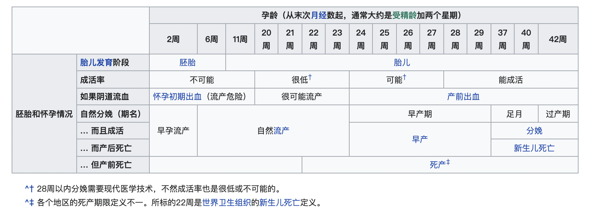

[TOC]

# 生育

## 备孕

### 不良因子

备孕需要避免以下一些不良因子：

1. 高龄生育
2. 身体慢/急性疾病
3. 过大压力
4. 睡眠不足
5. 营养不足（叶酸缺乏）
6. 热盆浴，桑拿以及紧身衣服
7. 自行车座（待确认）
8. 激烈运动（待确认）
9. 放射物和化学物质
10. 治疗高血压，溃疡，癌症，心脏病，肠炎，病毒感染的药物（待确认）
11. 烟酒
12. 手机/电脑辐射
13. 寄生虫感染

### 产前检查

- 血常规

  可尽早发现是否贫血，以免给宝宝生长发育带来影响。

- 尿常规

  怀孕后肾脏负担加重，检查肾脏是否存在问题，以免造成严重后果。

- 粪常规

  检查有没有寄生虫，如果有尽早发现有可能导致流产和胎儿畸形。

- 肝功能

  母亲如果是病毒性肝炎患者，怀孕有可能导致胎儿早产或死亡，肝炎病毒也会传播给孩子。

- 妇科检查

  检查有没有可能导致胎儿流产和早产的危险。

- 染色体检查

  可以尽早地发现一些遗传疾病和不孕症。

- 体格检查

  对身体和生育能力进行一次综合评估。

- 其他

  TORCH检查，口腔检查...

## 孕期

妊娠（gestation）/怀孕（）

### 孕龄

- 第一期（受精当周开始第1～12周）

  受精后形成的受精卵会经输卵管向下移动，接触子宫内层着床，并开始发育成胎儿与胎盘；此阶段流产的风险最高。

- 第二期（受精当周开始第13～28周）

  此阶段可能会感受到胎儿活动。第28周时，如果接受高品质的医疗照护，大于90%的胎儿可在子宫外存活。

- 第三期（受精当周开始第29～40周）

  胎儿开始具备母体外存活能力。

孕龄的计算方式：

TODO

### 历程

1. 受精
2. 着床
3. 怀孕初期
4. 怀孕中期
5. 怀孕晚期

### 营养补充

| 养分               | 建议每日摄取量（RDA）(多加>=RDA)        | 最大摄入量     | 备注                                                         |
| ------------------ | --------------------------------------- | -------------- | ------------------------------------------------------------ |
| 热量               | 第三孕期每天增加200kcal（840KJ）        | 建议每日摄取量 |                                                              |
| 蛋白质             | 每天多加6g                              | 每天51g        |                                                              |
| 硫胺（维生素B1）   | 与身体的能量需求增加；每天增加0.5mg     | 每天1.5mg      | 孕妇及小儿因发育关系需要较多。乳母1.8mg；缺乏能导致婴儿先天性脚气病 |
| 核黄素（维生素B2） | 细胞生长；多加0.3mg                     | 每天1.4mg      | 孕妇及小儿因发育关系需要较多。乳母1.6mg；                    |
| 烟酸（维生素B3）   | 不需要补充。定期补充/在饮食摄取量足够。 | 建议每日摄取量 |                                                              |
| 维生素C            | 每天补充身体存储量；多加70mg            | 每天100mg      | 中，晚期孕妇乳母130mg                                        |
| 维生素D            | 每天补充血浆的维生素10微克              | 建议每日摄取量 | 协助钙，磷的吸收与运用                                       |
| 钙                 | 不需要补充                              | 建议每日摄取量 | 构成骨骼和牙齿的主要成分                                     |
| 铁                 | 每天多加3mg                             | 建议每日摄取量 |                                                              |
| 镁，锌，铜         | 正常摄入和补充                          | 建议每日摄取量 |                                                              |
| 碘                 | 每天多加100微克                         | 每天250微克    |                                                              |

### 不良因子

- 精神药物
- 药物治疗

### 并发症

| -                  | 说明 | 预防措施                                                     | 治疗措施 |
| ------------------ | ---- | ------------------------------------------------------------ | -------- |
| 葡萄胎             |      | - 做好避孕，有过葡萄胎史的，应该严格做好避孕，等到HCG值正常后再考虑备孕问题 - 避免高龄怀孕 |          |
| 宫外孕             |      |                                                              |          |
| 贫血               |      |                                                              |          |
| 背痛               |      |                                                              |          |
| 腕隧道症候群       |      |                                                              |          |
| 便秘               |      |                                                              |          |
| 水肿               |      |                                                              |          |
| 环型韧带疼痛       |      |                                                              |          |
| 胃食管反流病和恶心 |      |                                                              |          |

## 分娩

### 早产

在20～37周之间出生，称为早产；可能会造成如脑性麻痹等健康风险，如果在39周以前分娩，除非有其他情况，否则不建议人工引产或刨腹产。

### 足月妊娠

第37周作为早产和足月妊娠的分界线

- 早期足月产（第37～38周）
- 足月产（第39～40周）
- 过月产（第41周）

### 过期妊娠

怀孕大于41周以上称为过期妊娠

### 并发症

TODO

## 产后护理

### 并发症

TODO

## 参考

### 外部链接

- [维基百科-妊娠](https://en.wikipedia.org/wiki/Pregnancy)
- [维基百科-产前诊断](https://zh.wikipedia.org/wiki/%E7%94%A2%E5%89%8D%E8%A8%BA%E6%96%B7)
- [维基百科-孕龄](https://zh.wikipedia.org/wiki/%E5%AD%95%E9%BD%A1)
- [百度百科-备孕](https://baike.baidu.com/item/%E5%A4%87%E5%AD%95)
- [辛苦怀胎几个月，孩子竟变成水泡，这中间到底发生了什么？](https://xw.qq.com/partner/vivoscreen/20190604A03JQW00?vivoRcdMark=1)

### 参考文献

[1] TODO
