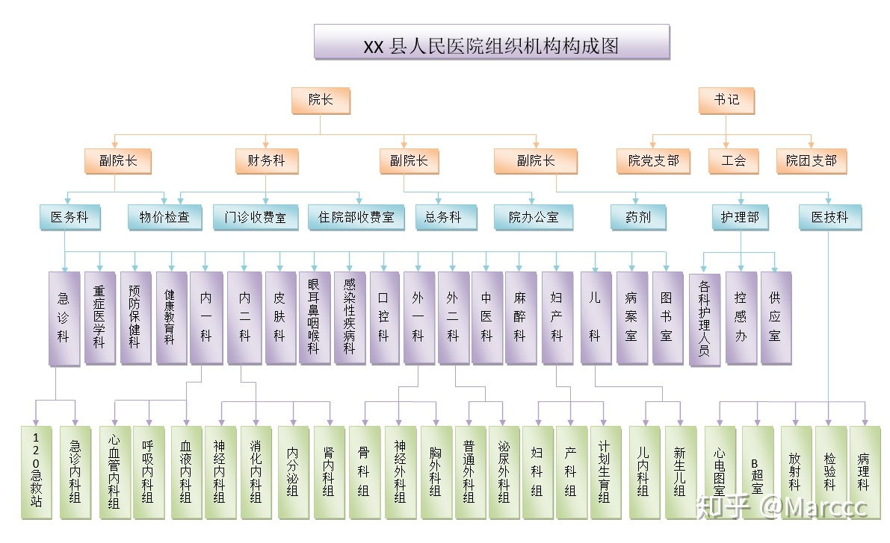

# 医学分类

[TOC]

## 中国常用医院科室分类

- 急诊科

  感染、腹部创伤、腹痛、急腹症、呼吸衰竭、急性呼吸窘迫综合征、心衰、休克、一氧化碳中毒、多器官功能不全

- 内科

  - 呼吸内科

    间质性肺疾病、肺气肿、肺癌、肺炎、小儿肺炎、气管疾病、气胸、尘肺、哮喘、小儿哮喘、呼吸衰竭、肺水肿、肺心病、支气管炎、小儿支气管炎、扁桃体炎、头痛、流感、感冒、小儿感冒、肺栓塞、胸膜疾病、肺脓肿、发烧、小儿咳嗽、高原反应、胸腔积液、胸膜炎、肺结核、肺部疾病、呼吸系统疾病、睡眠呼吸暂停综合征、花粉症、急性呼吸窘迫综合征

  - 消化内科

    胃十二指肠疾病、胃炎、结肠癌、结肠炎、阑尾炎、胃癌、胃溃疡、肠梗阻、肠炎、肠胃炎、胃下垂、肠痉挛、直肠癌、直肠肛管疾病、肠易激综合症、胆囊炎、胆结石、胆囊息肉、胆道肿瘤、胆系疾病、食道癌、食管疾病、消化不良、反流性食管炎、腹膜炎、肝病、肝炎、乙肝、肝癌、肝硬化、酒精肝、肝腹水、脂肪肝、肝囊肿、胰腺癌、门静脉高压症、消化道出血、胰腺疾病、胰腺炎、黄疸、布卡综合症、结核性腹膜炎、腹泻、小儿腹泻、细菌性痢疾、肠疾病、肠系膜缺血性疾病、便秘、消化系统疾病

  - 神经内科

    小儿脑瘫、脑血栓、脑出血、脑水肿、脑血管病、小儿癫痫、癫痫、脑萎缩、脑积水、脑电图、脑炎、脑膜炎、脑震荡、帕金森、脑供血不足、颅脑先天畸形、巨脑回、偏瘫、截瘫、痴呆、失眠、晕厥、三叉神经痛、失语、周围神经病损、内耳眩晕、头晕、神经衰弱、耳聋、神经炎、耳鸣、头痛、植物神经疾病、植物神经紊乱、神经官能症、面肌痉挛、面瘫、抽动症、重症肌无力、肌病、惊厥、发作性睡病、佩梅病、神经遗传性疾病、脑脓肿、视神经病、失明、脑器质性精神障碍、神经系统副肿瘤、小儿肌营养不良、脑寄生虫病、运动神经元病、脊髓空洞症、脊髓灰质炎、智力障碍、中枢神经系统疾病、尿失禁、中枢神经脱髓鞘、锥体外系疾病、脊髓小脑变性症、神经介入、神经皮肤综合症

  - 心血管内科

    冠心病、动脉粥样硬化、高血压、先天性心脏病、小儿先天性心脏病、高血脂、三高症、心衰、心律失常、小儿心律失常、心脏瓣膜性疾病、心肌病、心脏病、心肌炎、小儿心肌炎、风湿性心脏病、肺栓塞、肺水肿、肺心病、主动脉瘤、心脏介入、肾动脉狭窄、晕厥、高血压肾病、休克、心脏起搏器植入术、下肢静脉血栓、心包积液、心包炎、心脏神经官能症

  - 肾病内科

    肾病、小儿肾病、肾病综合症、高血压肾病、糖尿病肾病、肾积水、小儿肾积水、肾结核、肾囊肿、肾动脉狭窄、紫癜性肾炎、小儿紫癜性肾炎、肾炎、肾盂肾炎、间质性肾炎、尿毒症、IGA 肾病、肾下垂、继发性肾脏疾病、溶血尿毒综合征、肾功能衰竭、尿路感染、泌尿系结石、狼疮性肾炎、肾上腺疾病、肾结石

  - 血液内科

    血液病、白血病、骨髓纤维化、骨髓移植、多发性骨髓瘤、贫血、小儿血液肿瘤、白细胞减少症、粒细胞缺乏症、嗜酸性粒细胞增多症、血友病、凝血功能障碍、血小板减少性紫癜、脾功能亢进、再生障碍性贫血、骨髓增生性疾病、黄疸、放射病、鼻出血、溶血尿毒综合征、骨髓异常增生综合征、淋巴管疾病、淋巴瘤、过敏性紫癜

  - 老年病内科

    呼吸衰竭、老年病、高血压、脑萎缩、脑血栓、动脉粥样硬化、心律失常、心衰、冠心病、脑供血不足、肾功能衰竭、头晕、消化不良、肺心病、脑血管病、呼吸系统疾病、痴呆、便秘、心脏病、帕金森症

  - 免疫内科

    风湿病、风湿性心脏病、类风湿性关节炎、红斑狼疮、过敏性紫癜、结节病、强直性脊柱炎、小儿类风湿病、狼疮性肾炎、多发性肌炎、血管炎、周围血管病、反应性关节炎、结节性红斑、成人斯蒂尔病、干燥综合征、发烧、痛风、结缔组织病、原发性免疫缺陷病、嗜酸性粒细胞增多症

  - 感染内科

    乙肝、肝炎、肝硬化、百日咳、胸膜炎、发烧、感染、细菌性痢疾、败血症

  - 变态反应科

    哮喘、过敏、过敏性鼻炎、皮肤过敏、花粉症、多形红斑

  - 内分泌科

    糖尿病、糖尿病肾病、糖尿病视网膜病变、糖尿病足、骨质疏松、甲状腺疾病、甲亢、甲状腺功能减退、甲状腺炎、甲状腺瘤、痛风、高血脂、水电与酸碱平衡、内分泌失调、内分泌疾病、肥胖症、三高症、遗传代谢病、苯丙酮尿症、甲状旁腺功能减退症

- 外科

  - 普通外科

    肠梗阻、肠疾病、肠痉挛、结肠癌、直肠癌、结肠炎、阑尾炎、胆道肿瘤、胆结石、胆囊息肉、胆系疾病、胆囊炎、腹膜疾病、腹膜炎、腹膜肿瘤、肝癌、肝病、肝腹水、肝囊肿、酒精肝、痔疮、肛裂、肛瘘、肛周脓肿、直肠肛管疾病、甲亢、甲减、甲状腺瘤、甲状腺炎、甲状腺疾病、周围血管病、丹毒、淋巴结炎、静脉曲张、淋巴管疾病、乳腺炎、乳腺增生、乳腺癌、乳腺肿瘤、乳腺疾病、胃十二指肠疾病、胃下垂、胃炎、胃穿孔、乳腺纤维瘤、胰腺癌、胰腺疾病、胰腺炎、胃溃疡、胃癌、腹痛、肾结石、软组织肿瘤、体表肿瘤、坏死性

    筋膜炎、急腹症、发烧、破伤风、甲沟炎、反流性食管炎、消化道出血、腹膜后肿瘤、腹腔镜手术、冻伤、烧伤、肝移植、脾切除手术、脾功能亢进、咬螫伤、消化系统疾病、肠系膜缺血性疾病、肠粘连、颈部疾病、腹部创伤、疝气

  - 神经外科

    室管膜瘤、颅底肿瘤、颅脑损伤、颅脑先天畸形、脑部肿瘤、脑垂体瘤、胶质瘤、脑积水、小儿脑积水、脑水肿、脑出血、脑血栓、癫痫、帕金森、脊柱裂、脑血管病、脊髓空洞症、截瘫、脊柱脊髓损伤、尿失禁、脊髓血管畸形、椎管内疾病、胆脂瘤、失语、失明、神经介入、三叉神经痛、脑寄生虫病、周围神经病损、锥体外系疾病、脑脓肿、神经转移性肿瘤、中枢神经外胚层肿瘤

  - 胸外科

    肺癌、肺部疾病、肺脓肿、肺气肿、肺水肿、气管疾病、胸膜疾病、食道癌、食管疾病、胸壁疾病、呼吸系统疾病、胸腔积液、气胸、血胸、小儿漏斗胸、纵隔疾病、膈肌疾病、胸部创伤

  - 泌尿外科

    膀胱癌、膀胱炎、前列腺增生、前列腺炎、附睾炎、精索静脉曲张、鞘膜积液、男性病、男性不育、泌尿系结石、肾结石、尿路感染、尿路刺激征、包茎、包皮过长、肾病、肾移植、肾炎、肾下垂、肾囊肿、肾盂肾炎、肾功能衰竭、泌尿系肿瘤、前列腺癌、肾积水、腺性膀胱炎、尿失禁、肾上腺疾病、小儿尿道下裂、小儿肾积水、泌尿系梗阻性疾病、先天性泌尿系畸形、泌尿系疾病、男性生殖器畸形、泌尿生殖系损伤

  - 心血管外科

    冠心病、心脏搭桥、心律失常、先天性心脏病、主动脉瘤、心脏瓣膜性疾病、心脏粘液瘤、心脏病、小儿先天性心脏病、心肌病

  - 乳腺外科

    乳腺纤维瘤、乳腺癌、乳腺疾病、乳腺肿瘤、乳腺增生、乳房整形

  - 肝胆外科

    胆道肿瘤、胆结石、胆囊息肉、胆囊炎、胆系疾病、肝癌、肝病、肝腹水、肝囊肿、脾功能亢进、肝移植、肝硬化、肝脏介入、酒精肝、布卡综合症、消化系统疾病、腹腔镜手术、肝血管瘤、门静脉高压症

  - 器官移植

    肝移植、肝硬化、肾移植

  - 肛肠外科

    肛裂、肛瘘、痔疮、肛周脓肿、直肠癌、肠梗阻、肠痉挛、肠粘连、结肠癌、结肠炎、肠疾病、便秘、直肠肛管疾病、肠系膜缺血性疾病

  - 烧伤科

  - 骨科

    骨折、小儿骨折、骨质增生、股骨头坏死、骨坏死、骨癌、骨肿瘤、骨感染病、骨髓炎、骨关节病、骨缺损、韧带损伤、关节损伤、运动创伤、关节炎、骨结核病、骨延长、手部创伤、断肢再植、风湿病、骨软骨病、滑膜炎、肋软骨炎、佝偻病、关节镜、颈椎病、脊柱脊髓损伤、脊柱侧弯、脊柱裂、斜颈、肩周炎、腰椎间盘突出、腰部疾病、腰痛、髂骨致密性骨炎、周围神经病损、截瘫、类风湿性关节炎、强直性脊柱炎、骨质疏松、椎管内疾病、神经卡压综合征、骨纤维结构不良、腱鞘炎、人工关节置换术、先天性骨与关节畸形、先天性足畸形、先天性膝关节畸形、小儿先天髋关节畸形、骨膜炎

  - 血管外科

    主动脉瘤、周围血管病、静脉曲张、静脉炎、丹毒、血管瘤、四肢血管损伤、血管炎、下肢静脉血栓、布卡综合症、整形外科

  - 整形外科

    皮肤整形、眼部整形、鼻部整形、耳部整形、唇部整形、毛发整形、除皱、乳房整形、体形雕塑、变性手术、烧伤、痣、性器官整形、下颌整形

  - 颅底外科

    鼻肿瘤、颅底肿瘤

  - 微创外科

    腹腔镜手术

  - 头颈外科

    甲状腺疾病、颈部疾病

- 妇产科

  - 妇科

    子宫颈息肉、子宫内膜息肉、不孕不育、多囊卵巢综合征、妇科检查、妇科病、妇科炎症、宫颈炎、附件炎、阴道炎、白带异常、外阴瘙痒、子宫肌瘤、宫颈癌、宫颈癌前病变、妇科肿瘤、输卵管堵塞、子宫腺肌症、子宫内膜癌、子宫内膜异位症、宫颈锥切术、宫外孕、人流、习惯性流产、孕前检查、异常妊娠、腹腔镜手术、子宫畸形、月经失调、痛经、宫腔镜、尿路刺激征、闭经、女性生殖器官创伤、功能性子宫出血、特纳综合征、更年期综合症、植物神经紊乱、畸胎瘤、卵巢囊肿、葡萄胎、腹痛、外阴色素减退病、女性生殖器畸形

  - 产科

    产前检查、分娩、分娩期并发症、异常分娩、肺栓塞、产褥疾病、异常妊娠、妊娠合并症、妊娠高血压综合症、剖腹产

  - 计划生育

  - 妇幼保健

  - 妇科内分泌

    闭经、更年期综合症、习惯性流产、月经失调、不孕不育、多囊卵巢综合征

  - 妇产科-计生

    计划生育、孕前检查

  - 产前检查科

    产前检查

  - 遗传咨询科

    神经皮肤综合症、先天愚型、血友病、产前检查

- 男科

  泌尿系疾病、包茎、包皮龟头炎、包皮过长、附睾炎、男性病、男性不育、前列腺炎、前列腺增生、鞘膜积液、精索静脉曲张、男性生殖器畸形

- 儿科

  小儿脑瘫、小儿肺炎、小儿支气管炎、小儿鼻炎、惊厥、小儿癫痫、小儿感冒、小儿先天性心脏病、小儿湿疹、疝气、小儿骨折、小儿咳嗽、小儿心肌炎、小儿心律失常、斜颈、儿童牙病、小儿哮喘、小儿脑积水、小儿血液肿瘤、巨脑回畸形、儿童保健、小儿肾病、小儿肾积水、小儿类风湿病、佝偻病、发育迟缓、小儿腹泻、小儿多动症、小儿尿道下裂、性早熟、智力障碍、小儿斜视、抽动症、小儿紫癜性肾炎、肠痉挛、幼儿急疹、小儿弱视、小儿漏斗胸、小儿腺样体肥大、脑发育不良、苯丙酮尿症、遗传代谢病、神经皮肤综合症、特纳综合征、重症肌无力、婴儿喂养、先天愚型、新生儿疾病、小儿肌营养不良、营养缺乏症、新生儿溶血、新生儿肺炎、新生儿黄疸、小儿肾母细胞瘤、小儿遗尿、郎格汉斯细胞增生症、小儿先天髋关节畸形、中枢神经外胚层肿瘤、囟门发育不良

  - 儿科综合
  - 小儿内科
  - 小儿外科
  - 新生儿科
  - 儿童营养保健科

- 五官科

  - 耳鼻喉科

    鼻炎、小儿鼻炎、过敏性鼻炎、鼻窦炎、鼻疾病、鼻咽癌、鼻肿瘤、鼻部整形、鼻出血、鼻息肉、耳部损伤、耳部整形、耳部肿瘤、耳疾病、中耳炎、耳聋、耳鸣、内耳眩晕、头晕、鼓膜穿孔、外耳炎、胆脂瘤、喉炎、口吃、花粉症、声带息肉、声带小结、咽部肿瘤、咽炎、咽疾病、舌疾病、喉疾病、鼓膜内陷、扁桃体炎、小儿腺样体肥大、睡眠呼吸暂停综合征、鼻外伤

  - 眼科

    白内障、玻璃体病、玻璃体混浊、干眼症、巩膜葡萄肿、角膜病、角膜炎、角膜移植、结膜病、结膜炎、近视、近视眼手术、屈光不正、泪器病、麦粒肿、青光眼、小儿弱视、小儿斜视、失明、视神经病、视网膜病、视网膜脱落、眼底病、沙眼、眼外伤、眼部疾病、眼部整形、眼肿瘤、眼睑病、眼眶炎症、视神经萎缩、巩膜炎、葡萄膜病、霰粒肿、糖尿病视网膜病变、眼球震颤

  - 口腔科

    牙体病、牙周病、牙周炎、牙颌畸形、口腔修复、儿童牙病、牙齿种植、口腔粘膜病、口腔溃疡、唇腭裂、阻生齿、拔牙、造釉细胞瘤、下颌整形、涎腺疾病、颞下颌关节病、唇系带异常矫正、牙痛、唇部整形、腮腺炎、口腔颌面部损伤、口腔颌面部肿瘤

- 肿瘤科

  多发性骨髓瘤、白血病、淋巴瘤、肺癌、胰腺癌、食道癌、胃癌、胆道肿瘤、肝脏介入、肝癌、妇科肿瘤、宫颈癌、畸胎瘤、卵巢囊肿、子宫内膜癌、葡萄胎、乳腺癌、乳腺肿瘤、腹膜肿瘤、神经转移性肿瘤、甲状腺瘤、结肠癌、体表肿瘤、腹膜后肿瘤、皮肤肿瘤、血管瘤、软组织肿瘤、眼肿瘤、造釉细胞瘤、口腔颌面部肿瘤、咽部肿瘤、泌尿系肿瘤、膀胱癌、中枢神经外胚层肿瘤、周围神经系统肿瘤、骨癌、骨肿瘤、神经母细胞瘤、神经皮肤综合症、小儿肾母细胞瘤、颅底肿瘤、脑部肿瘤、肿瘤、化疗、放疗、肺淋巴管平滑肌瘤

  - 肿瘤内科
  - 肿瘤外科
  - 肿瘤妇科
  - 骨肿瘤科
  - 放疗科
  - 肿瘤康复科
  - 肿瘤综合科

- 皮肤性病科

  - 皮肤科

    小儿湿疹、湿疹、硬皮病、带状疱疹、脱发、痤疮、黄褐斑、白癜风、单纯疱疹、毛囊炎、皮肤过敏、过敏、银屑病、白色糠疹、酒渣鼻、多形红斑、皮肤瘙痒、扁平疣、玫瑰糠疹、扁平苔癣、雀斑、假性湿疣、红皮病、血管炎、灰指甲、皮肤病、体表肿瘤、鱼鳞病、皮肤整形、皮肤黑变病、皮肤肿瘤、荨麻疹、过敏性紫癜、遗传性皮肤病、动物性皮肤病、脂溢性皮炎、臭汗症、色素性紫癜、包皮龟头炎、外阴色素减退病、接触性皮炎、皮炎、日光性皮炎、结节性红斑、大疱性皮肤病、药物性皮炎、神经性皮炎、感染性皮肤病、物理性皮肤病、营养与代谢障碍、除皱、脚气、鸡眼、疥疮、疣、多汗症、癣、痣

  - 性病科

    艾滋病、传染性软疣、尖锐湿疣、梅毒、生殖器疱疹、淋病、性病

- 中医科

  白癜风、银屑病、痤疮、脱发、小儿咳嗽、便秘、面瘫、消化不良、冠心病、脑血栓 妇科病、前列腺炎、阴虚、失眠

  - 中医全科
  - 中医内科
  - 中医外科
  - 中医妇科
  - 中医儿科
  - 中医保健科
  - 针灸按摩科
  - 中医骨伤科
  - 中医肿瘤科

- 传染科

  乙肝、肝炎、肝硬化、肝腹水、肝病、百日咳、非典、风疹、霍乱、黄疸、疟疾、蠕虫病、腮腺炎、伤寒、鼠疫、天花、细菌性痢疾、猩红热、胸膜炎、血吸虫病、狂犬病、麻疹、手足口病、呼吸道传染病、虫媒传染病、流行性乙型脑炎、动物源性传染病、口蹄病、水痘、麻风、艾滋病

  - 肝病科
  - 艾滋病科
  - 结核病
  - 寄生虫

- 精神心理科

  - 精神科

    情感障碍、人格障碍、性心理障碍、身心疾病、神经衰弱、强迫症、抑郁症、躁狂症、躁郁症、焦虑症、恐惧症、自闭症、应激障碍、肠易激综合症、脑器质性精神障碍、植物神经紊乱、精神分裂症、口吃、心身疾病

  - 心理咨询科

    焦虑症、情感障碍、人格障碍、心身疾病、神经官能症、自闭症、性心理障碍、抑郁症、植物神经紊乱、应激障碍、心理障碍

- 整形美容科

- 营养科

  营养不良、营养缺乏症

- 生殖中心

  不孕不育、男性病、男性不育、输卵管堵塞、习惯性流产

- 麻醉医学科

  - 麻醉科
  - 疼痛科

- 医学影像科

  - 核医学科
  - 放射科
  - 超声科

- 康复医学科

  脑血管病、脑出血、脑血栓、小儿脑瘫、脑萎缩、周围神经病损、肩周炎、腰痛、颈椎病、腰部疾病、偏瘫

- 介入医学科

  主动脉瘤、肝脏介入、脑血管病、神经介入、肾动脉狭窄、心律失常、心脏起搏器植入术、冠心病、小儿先天性心脏病、心脏病

- 结核病科

  肺结核、骨结核病、结核性腹膜炎、肾结核

- 运动医学科

  韧带损伤、关节损伤、运动创伤

- 疼痛科

  疼痛科、头痛、疼痛、腰痛、三叉神经痛

- 预防保健科

  亚健康、体检

- 医学影像学科

  超声诊断、放射诊断、核医学

- 其他科室

  - 药剂科、护理科、体检科、检验科、全科、设备科

例，医院科室设置架构图：

## 中国三甲医院科室分类

- 临床科室
  - 急诊科
  - 内科
    - 心血管
    - 消化
    - 呼吸
    - 血液
    - 神经内科
    - 肾内
    - 内分泌
  - 外科
    - 普外
    - 心胸外科
    - 神经外科
    - 泌尿外科
    - 骨科
  - 妇产科
    - 妇科
    - 产科
    - 计划生育
  - 儿科
    - 儿内
    - 新生儿
  - 中医科
  - 耳鼻喉科
  - 口腔科
  - 眼科
  - 皮肤科
  - 麻醉科
  - 康复科
  - 预防保健科
- 医技科室
  - 药剂科
  - 检验科
  - 放射科
  - 手术室
  - 病理科
  - 输血科
  - 核医学科
  - 理疗科（可与康复科合设）
  - 消毒供应室
  - 病案室
  - 营养部
  - 相应的临床功能检查室

## 常见的医学专科(维基百科)

|       医学专科       | 作为次专科时的主科 | 病患年龄 | 偏诊断或治疗 | 外科或内科系 | 基于器官或技术 |
| :------------------: | :----------------: | :------: | :----------: | :----------: | :------------: |
|      过敏免疫科      |     内科、儿科     | 各年龄层 |   两者皆有   |    内科系    |      器官      |
|      青少年医学      |    儿科、家医科    |   儿科   |   两者皆有   |    内科系    |      技术      |
|        麻醉科        |       家医科       | 各年龄层 |     治疗     |   两者皆有   |    两者皆有    |
|       航空医学       |       家医科       | 各年龄层 |   两者皆有   |   两者皆非   |    两者皆有    |
|        心脏科        |        内科        |   成人   |     治疗     |    内科系    |      器官      |
|       心胸外科       |      普通外科      |   成人   |     治疗     |    外科系    |      器官      |
| 儿童与青少年精神医学 |      精神医学      |   儿科   |     治疗     |    内科系    |      技术      |
|    临床神经生理学    |      神经内科      | 各年龄层 |     诊断     |    内科系    |    两者皆有    |
|     结肠直肠外科     |      普通外科      | 各年龄层 |   两者皆有   |    外科系    |      器官      |
|        皮肤科        |         无         | 各年龄层 |     治疗     |    内科系    |      器官      |
|       急诊医学       |       家医科       | 各年龄层 |   两者皆有   |   两者皆有   |    两者皆有    |
|       内分泌学       |        内科        |   成人   |     治疗     |    内科系    |      器官      |
|       胃肠病学       |        内科        |   成人   |     治疗     |    内科系    |      器官      |
|       普通外科       |         无         |   成人   |     治疗     |    外科系    |      技术      |
|      家庭医学科      |         无         | 各年龄层 |   两者皆有   |   两者皆有   |     跨领域     |
|       老年医学       |    内科、家医科    |   老年   |     治疗     |    内科系    |     跨领域     |
|        妇产科        |         无         | 各年龄层 |     治疗     |    外科系    |      器官      |
|        感染科        |     儿科、内科     | 各年龄层 |   两者皆有   |    内科系    |    两者皆非    |
|         内科         |         无         |   成人   |     治疗     |    内科系    |    两者皆非    |
|      介入放射学      |       放射科       | 各年龄层 |   两者皆有   |    不确定    |     跨领域     |
|       新生儿学       |        儿科        |  新生儿  |     治疗     |    内科系    |    两者皆非    |
|        肾脏科        |        内科        | 各年龄层 |     治疗     |    内科系    |      器官      |
|       神经内科       |        内科        | 各年龄层 |     治疗     |    内科系    |      器官      |
|       神经外科       |        外科        | 各年龄层 |     治疗     |    外科系    |      器官      |
|        核医学        |         无         | 各年龄层 |   两者皆有   |    内科系    |      技术      |
|       职业医学       |    家医科、内科    |   成人   |     治疗     |    内科系    |     跨领域     |
|        眼科学        |         无         | 各年龄层 |     治疗     |    外科系    |      器官      |
|         骨科         |         无         | 各年龄层 |     治疗     |    外科系    |      器官      |
|     口腔颌面外科     |         无         | 各年龄层 |     治疗     |    外科系    |      器官      |
|      耳鼻喉科学      |         无         | 各年龄层 |     治疗     |    外科系    |      器官      |
|       安宁照护       | 家医科、内科、儿科 | 各年龄层 |   两者皆有   |   两者皆非   |    两者皆非    |
|        病理学        |         无         | 各年龄层 |     诊断     |   两者皆非   |      技术      |
|         儿科         |         无         |   儿科   |     治疗     |    内科系    |       无       |
|    小儿过敏免疫科    |        儿科        |   儿科   |     治疗     |    内科系    |      器官      |
|      小儿心脏科      |        儿科        |   儿科   |     治疗     |    内科系    |      器官      |
|     小儿内分泌科     |        儿科        |   儿科   |     治疗     |    内科系    |      器官      |
|      小儿肠胃科      |        儿科        |   儿科   |     治疗     |    内科系    |      器官      |
|    小儿血液肿瘤科    |        儿科        |   儿科   |     治疗     |    内科系    |      器官      |
|      小儿感染科      |        儿科        |   儿科   |     治疗     |    内科系    |      器官      |
|      小儿肾脏科      |        儿科        |   儿科   |     治疗     |    内科系    |      器官      |
|      小儿胸腔科      |        儿科        |   儿科   |     治疗     |    内科系    |      器官      |
|      小儿风湿科      |        儿科        |   儿科   |     治疗     |    内科系    |      器官      |
|       小儿外科       |      普通外科      |   儿科   |     治疗     |    外科系    |      器官      |
|       康复医学       |         无         | 各年龄层 |     治疗     |    内科系    |     跨领域     |
| 整形外科与[重建外科  |      普通外科      | 各年龄层 |     治疗     |    外科系    |      器官      |
|       胸腔医学       |        内科        |   成人   |     治疗     |    内科系    |      器官      |
|       精神医学       |         无         | 各年龄层 |   两者皆有   |    内科系    |      技术      |
|       公共卫生       |       家医科       | 各年龄层 |   两者皆非   |   两者皆非   |      技术      |
|      放射肿瘤科      |         无         | 各年龄层 |     治疗     |   两者皆非   |      技术      |
|      影像诊断学      |         无         | 各年龄层 |   两者皆有   |    内科系    |      技术      |
|       运动医学       |       家医科       | 各年龄层 |   两者皆有   |   两者皆非   |     跨领域     |
|      神经放射学      |       放射科       | 各年龄层 |   两者皆有   |    内科系    |    两者皆有    |
|       泌尿外科       |         无         | 各年龄层 |     治疗     |    外科系    |      器官      |
|       血管外科       |      普通外科      | 各年龄层 |     治疗     |    外科系    |      器官      |

## 参考

- [知识普及：医院的科室设置架构图及分类](https://zhuanlan.zhihu.com/p/144192472)
- [维基百科-医学专科](https://zh.wikipedia.org/wiki/%E9%86%AB%E5%AD%B8%E5%B0%88%E7%A7%91)
- [百度百科-三级甲等医院](https://baike.baidu.com/item/%E4%B8%89%E7%BA%A7%E7%94%B2%E7%AD%89%E5%8C%BB%E9%99%A2/3829503?fr=aladdin#3)

