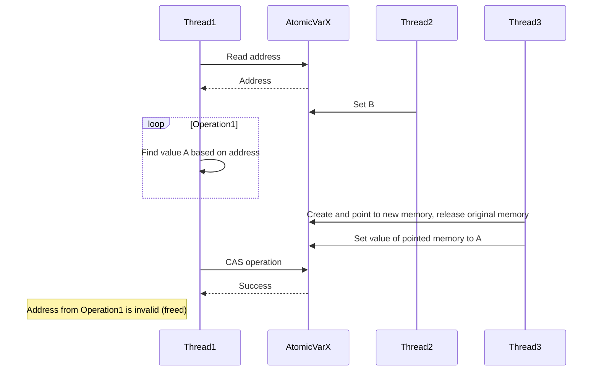

English | [中文版](concurrency_zh.md)

# C++ Concurrency Programming

[TOC]

## std::thread

### Creating Threads

Use `std::thread` to create thread objects. The function object provided at creation is copied into the storage of the newly created thread and called from there.

Example:

```c++
// Old way
std::thread my_thread(background_task());
// Modern way to create a thread
std::thread my_thread{background_task()};
```

### Waiting for Thread Completion

Call `join()` to wait for a thread to finish. You can only call `join()` once for a given thread. After calling `join()`, the `std::thread` object is no longer joinable, and `joinable()` will return `false`.

**Note: To prevent exceptions from being thrown after a thread starts but before `join()` is called, there are two ways to guard against this:**

1. Use `try/catch` to catch exceptions

	 ```c++
	 std::thread t(my_func);
	 try
	 {
	 	...
	 }
	 catch(...)
	 {
	 	t.join();
	 	throw;
	 }
	 t.join();
	 ```

2. Use RAII syntax

	 ```c++
	 class thread_guard
	 {
		 std::thread& t;
	 public:
		 explicit thread_guard(std::thread& t_) : t(t_) {}
		 // ...existing code...
	 };
	 std::thread t(...);
	 thread_guard g(t);
	 ```

### Detaching Threads

Calling `detach()` on a `std::thread` object lets the thread run in the background (after detaching, there is no direct way to communicate with it).

Example:

```c++
std::thread t(...);
t.detach();
```

### Passing Arguments to Thread Functions

Arguments are copied by default into the internal storage; when passing references as arguments, the referenced value is copied. There are two ways to avoid this:

1. Use `std::ref` to wrap referenced arguments.

	 Example:

	 ```c++
	 void f(...);
	 std::thread t(f, std::ref(...))
	 ```

2. Use smart pointers like `std::unique_ptr` to restrict ownership, and use `std::move` to transfer ownership.

	 Example:

	 ```c++
	 void f(std::unique_ptr<...>);
	 std::unique_ptr<...> p(new ...);
	 std::thread t(f, std::move(p));
	 ```

### Transferring Thread Ownership

`std::thread` supports move semantics. Use `std::move` to transfer thread ownership out of a function.

Example:

```c++
void f(std::thread t);
std::thread t(...);
f(std::move(t));
```

### Choosing Thread Count at Runtime

`std::thread::hardware_concurrency()` is used to determine the number of threads that can truly run concurrently on the executing system.

Example:

```c++
unsigned long const hardware_threads = std::thread::hardware_concurrency();
```

### Identifying Threads

Thread identifiers are of type `std::thread::id`, and can be obtained in two ways:

- By calling `get_id()` on the associated `std::thread` object.
- Returned when the thread is constructed.


## std::mutex

`std::mutex` is used to protect shared data in multithreaded scenarios.

Example:

```c++
#include <mutex>
std::mutex m;
void f()
{
	m.lock();
	...
	m.unlock();
}
```

### RAII Mechanism

`std::lock_guard` is an RAII-based mutex wrapper. By creating a `lock_guard` object in a scope, the mutex is automatically released when leaving the scope, preventing issues from forgetting to unlock.

Example:

```c++
#include <mutex>
std::mutex mu;
void f()
{
		std::lock_guard<std::mutex> lock(mu);
		...
}
```

**Note: `std::lock_guard` is not copyable.**

### How to Avoid Deadlocks

- Lock and unlock in the same order.
- Avoid nested locks as much as possible.
- Use lock hierarchy.
- Avoid calling user-provided code while holding a lock.

### Transferring Lock Ownership

If the source is an rvalue, ownership transfer is automatic; for lvalues, transfer must be explicit to avoid accidental transfer from a variable.

```c++
std::unique_lock<std::mutex> get_lock()
{
	extern std::mutex m;
	std::unique_lock<std::mutex> lk(some_mutex);
	...
	return lk;
}
void process_data()
{
	std::unique_lock<std::mutex> lk(get_lock());
	...
}
```

### Using `boost::shared_mutex` to Protect Rarely Updated Data Structures

```c++
#include <mutex>
#include <boost/thread/shared_mutex.hpp>

mutable boost::shared_mutex sm;
boost::shared_lock<boost::shared_mutex> lk(sm); // Shared, read-only access
```

### Recursive Locks

**Recursive locks are not recommended.**


## std::atomic

### Atomic Operations

`std::atomic` provides atomic operations to ensure no "data races" occur during concurrent data access. `std::memory_order` can be used to control memory access order between threads:

| Operation Type                        | Category                                                      |
| -------------------------------------- | ------------------------------------------------------------- |
| Store operation                        | `memory_order_relaxed`<br>`memory_order_release`<br>`memory_order_seq_cst` |
| Load operation                         | `memory_order_relaxed`<br>`memory_order_consume`<br>`memory_order_acquire`<br>`memory_order_seq_cst` |
| Read-modify-write operation            | `memory_order_relaxed`<br>`memory_order_consume`<br>`memory_order_acquire`<br>`memory_order_release`<br>`memory_order_acq_rel`<br>`memory_order_seq_cst` |

| Supported C Data Type   | Corresponding atomic type |
| ----------------------- | ------------------------ |
| bool                    | atomic_bool              |
| char                    | atomic_char              |
| signed char             | atomic_schar             |
| unsigned char           | atomic_uchar             |
| short                   | atomic_short             |
| unsigned long           | atomic_ulong             |
| long long               | atomic_llong             |
| unsigned long long      | atomic_ullong            |
| wchar_t                 | atomic_wchar_t           |
| char16_t                | atomic_char16_t          |
| char32_t                | atomic_char32_t          |
| intmax_t                | atomic_intmax_t          |
| uintmax_t               | atomic_uintmax_t         |
| int_leastN_t            | atomic_int_leastN_t      |
| uint_leastN_t           | atomic_uint_leastN_t     |
| int_fastN_t             | atomic_int_fastN_t       |
| uint_fastN_t            | atomic_uint_fastN_t      |
| intptr_t                | atomic_uint_fastN_t      |
| uintptr_t               | atomic_intptr_t          |
| size_t                  | atomic_size_t            |
| ptrdiff_t               | atomic_ptrdiff_t         |

| Member Function                                         | Description                                                  |
| ------------------------------------------------------- | ------------------------------------------------------------ |
| `operator=`                                             | Store value in atomic object.                                |
| `is_lock_free`                                          | Check if atomic object is lock-free.                         |
| `store`                                                 | Atomically replace value of atomic object with non-atomic value. |
| `load`                                                  | Atomically get value of atomic object.                       |
| `operator T`                                            | Load value from atomic object.                               |
| `exchange`                                              | Atomically replace value and get previous value.              |
| `compare_exchange_weak`<br>`compare_exchange_strong`    | Atomically compare atomic object with non-atomic parameter, exchange if equal, load if not. |

**Note:**

1. `std::atomic` cannot be copy-constructed or copy-assigned.

#### CAS

`CAS (compare and swap)` atomically compares the atomic object with a non-atomic parameter. If equal, it swaps; if not, it loads.

- `compare_exchange_weak`: weak CAS (may occasionally fail spuriously, higher performance).
- `compare_exchange_strong`: strong CAS.

Example:

```c++
TODO
```

#### Pointer Arithmetic

`std::atomic<T*>` provides `fetch_add()` and `fetch_sub()` operations, which are read-modify-write operations. They can have any memory order tag and be part of a release sequence. The specified order cannot be in operator form, as necessary information cannot be provided: these forms have memory_order_seq_cst semantics.

```c++
class F{};
F f[5];
std::atomic<F*> p(f);
F* x=p.fetch_add(2); // p += 2, returns original value
assert(p.load()==&f[2]);
```

### Lock-free Boolean Atomic Type

For `std::atomic_flag` (lock-free boolean atomic type), the object must be initialized with `ATOMIC_FLAG_INIT`. Once initialized, you can only:

- Destroy
- Clear
- Set and test previous value (`test_and_set`)

```c++
// Spinlock mutex using std::atomic_flag:
class spinlock_mutex
{
	std::atomic_flag flag;
public:
	spinlock_mutex():
		flag(ATOMIC_FLAG_INIT)
	{}
	void lock()
	{
		while(flag.test_and_set(std::memory_order_acquire));
	}
	void unlock()
	{
		flag.clear(std::memory_order_release);
	}
};
```

### Specifying Memory Order

`std::memory_order` is used to specify memory access order. Include `<atomic>`.

| std::memory_order      | Description                                                  |
| ---------------------- | ------------------------------------------------------------ |
| `memory_order_relaxed` | Relaxed: no synchronization or ordering constraints, only atomicity. |
| `memory_order_consume` | Consume: load operations with this order, dependent reads/writes in current thread cannot be reordered before this load. Writes to data-dependent variables released by other threads become visible. Mostly affects compiler optimization. |
| `memory_order_acquire` | Acquire: load operations with this order, reads/writes in current thread cannot be reordered before this load. All writes released by other threads to the same atomic variable become visible. |
| `memory_order_release` | Release: store operations with this order, reads/writes in current thread cannot be reordered after this store. All writes in current thread become visible to other threads acquiring the same atomic variable. |
| `memory_order_acq_rel` | Acquire-release: read-modify-write operations with this order are both acquire and release. Reads/writes in current thread cannot be reordered before or after this store. All writes released by other threads to the same atomic variable become visible before the modification, and the modification becomes visible to other threads acquiring the same atomic variable. |
| `memory_order_seq_cst` | Sequentially consistent: load operations are acquire, store operations are release, read-modify-write operations are both, and all threads observe modifications in the same order. |

Example:

```c++
#include <atomic>
#include <thread>
#include <functional>
#include <iostream>

int main(int argc, char* argv[])
{
		// std::memory_order_relaxed
		std::atomic<int>x = {0};
		std::atomic<int>y = {0};
		auto fn1 = std::bind([&]() {
				auto tmp1 = x.load(std::memory_order_relaxed);
				// ...existing code...
				}
		});
		std::vector<std::thread> pool;
		for (auto i = 0; i < 100; ++i) {
				pool.emplace_back(fn1);
		}
		for (auto& t : pool) {
				t.join();
		}
		std::cout << "x = " << x << std::endl; // x = 0
		std::cout << "y = " << y << std::endl; // y = 0

		// std::memory_order_release--std::memory_order_acquire
		std::atomic<int>z = {0};
		auto fn2_1 = std::bind([&]() {
				z.store(1, std::memory_order_release);
		});
		auto fn2_2 = std::bind([&]() {
				while (!(z.load(std::memory_order_acquire))) {
						// ...existing code...
				z.store(2);
		});
		std::thread t2_2(fn2_2);
		std::thread t2_1(fn2_1);
		std::cout << "z = " << z << std::endl; // z = 2

		// std::memory_order_release--std::memory_order_acq_rel--std::memory_order_acquire
		std::atomic<int>m = {0};
		auto fn3_1 = std::bind([&]() {
				m.store(1, std::memory_order_release);
		});
		auto fn3_2 = std::bind([&]() {
				int expected = 1;
				// ...existing code...
				}
		});
		auto fn3_3 = std::bind([&]() {
				while (m.load(std::memory_order_acquire) != 2) {
						// ...existing code...
				m.store(3);
		});
		std::thread t3_3(fn3_3);
		std::thread t3_1(fn3_1);
		std::thread t3_2(fn3_2);
		t3_3.join();
		t3_1.join();
		t3_2.join();
		std::cout << "m = " << m << std::endl; // m = 3

		// std::memory_order_release -- std::memory_order_consume
		std::atomic<int>n = {0};
		auto fn4_1 = std::bind([&]() {
				n.store(1, std::memory_order_release);
		});
		auto fn4_2 = std::bind([&]() {
				int tmp = 0;
				// ...existing code...
				std::cout << "n = " << tmp << std::endl; // n = 1
		});
		std::thread t4_1(fn4_1);
		std::thread t4_2(fn4_2);
		t4_1.join();
		t4_2.join();

		// std::memory_order_seq_cst
		std::atomic<bool>c1 = {false};
		std::atomic<bool>c2 = {false};
		std::atomic<int>c3 = {0};
		auto fn5_1 = std::bind([&]() {
				c1.store(1, std::memory_order_seq_cst);
		});
		auto fn5_2 = std::bind([&]() {
				c2.store(1, std::memory_order_seq_cst);
		});
		auto fn5_3 = std::bind([&]() {
				while (!c1.load(std::memory_order_seq_cst)) {/* ...existing code... */}
		});
		auto fn5_4 = std::bind([&]() {
				while (!c2.load(std::memory_order_seq_cst)) {/* ...existing code... */}
		});
		std::thread t5_1(fn5_1);
		std::thread t5_2(fn5_2);
		std::thread t5_3(fn5_3);
		std::thread t5_4(fn5_4);
		t5_1.join();
		t5_2.join();
		t5_3.join();
		t5_4.join();
		std::cout << "c3 = " << c3 << std::endl; // c3 = 2
}
```

### Fences

`std::atomic_thread_fence` can order free operations. Example:

```c++
#include <atomic>
#include <thread>

std::atomic<bool> x, y;
std::atomic<int> z;
void write_x_then_y()
{
		x.store(true, std::memory_order_relaxed);
		std::atomic_thread_fence(std::memory_order_release); // release fence
		y.store(true, std::memory_order_relaxed);
}
void read_y_then_x()
{
		while(!y.load(std::memory_order_relaxed));
		std::atomic_thread_fence(std::memory_order_acquire); // acquire fence
		if (x.load(std::memory_order_relaxed))
				++z;
}
int main()
{
		x=false;
		y=false;
		z=0;
		std::thread a(write_x_then_y);
		std::thread b(read_y_then_x);
		a.join();
		b.join();
		assert(z.load() != 0);
}
```


## std::future

The class template `std::future` provides a mechanism to access the result of asynchronous operations. The referenced shared state cannot be shared with any other asynchronous return object:

1. Return a `std::future` object via asynchronous operations (`std::async`, `std::packaged_task`, or `std::promise`).
2. When the asynchronous operation completes, use `std::future` to get the result.

```c++
#include <iostream>
#include <future>
#include <thread>

int main(int argc, char* argv[])
{
		// Return future via promise-future channel
		std::promise<int> p;
		std::future<int> f1 = p.get_future();
		std::thread([&p] {p.set_value_at_thread_exit(1);}).detach();
		f1.wait();
		std::cout << "wait for promise:" << f1.get() << std::endl;

		// Return future via async
		std::future<int> f2 = std::async(std::launch::async, []() {
				return 2;
		});
		f2.wait();
		std::cout << "wait for async:" << f2.get() << std::endl;

		// Return future via packaged_task
		std::packaged_task<int()> task([]() {
				return 3;
		}); // wrap
		std::future<int> f3 = task.get_future();
		std::thread(std::move(task)).detach();
		f3.wait();
		std::cout << "wait for packaged_task:" << f3.get() << std::endl;
}

```

### Asynchronous Execution

`std::async` (asynchronous function execution) is used to implement asynchronous operations and returns a `std::future` holding the result. To use `std::async`, include `<future>`.

`std::launch` provides invocation policies for `std::async`:

| std::launch             | Description                                                  |
| ----------------------- | ------------------------------------------------------------ |
| `std::launch::async`    | Asynchronous evaluation: starts a new thread to call the function, synchronizes its return value with the shared state. |
| `std::launch::deferred` | Deferred evaluation: the function is called when the shared state is accessed (via get), and the call is deferred until the returned `std::future`'s shared state is accessed. |

Example:

```c++
#include <iostream>
#include <future>

int main(int argc, char* argv[])
{
		int i = 1;
		auto f1 = std::async([](int& n)->int {
				std::cout << "n = " << n << std::endl;
				return n * 2; // n = 2
		}, std::ref(i));
		i++;
		f1.wait();
		i++;
		std::cout << "i:" << i << ", f1:" << f1.get() << std::endl;

		i = 1;
		auto f2 = std::async(std::launch::deferred, [](int& n)->int{
				std::cout << "n = " << n << std::endl;
				return n * 2; // n = 3
		}, std::ref(i));
		i++;
		f2.wait();
		i++;
		std::cout << "i:" << i << ", f2:" << f2.get() << std::endl;

		i = 1;
		auto f3 = std::async(std::launch::async, [](int& n)->int{
				std::cout << "n = " << n << std::endl;
				return n * 2; // n = 2
		}, std::ref(i));
		i++;
		f3.wait();
		i++;
		std::cout << "i:" << i << ", f3:" << f3.get() << std::endl;
}
```

### One-time Value Passing Between Threads

The template class `std::promise` in C++11 provides storage for a value or exception. Used with `std::future`, it is used to pass a value between threads (**one-time**).

**Note: `std::promise` should only be used once.**

Example:

```c++
#include <iostream>
#include <future>
#include <chrono>

int main(int argc, char* argv[])
{
		// Produce value
		std::promise<int> p;
		std::future<int> f = p.get_future();
		std::thread t1(std::bind([](std::promise<int>& p) {
				std::this_thread::sleep_for(std::chrono::milliseconds(1000));
				// ...existing code...
				//        p.set_value(2); // Error, std::promise can only be used once
		}, std::move(p)));

		// Receive value
		std::thread t2(std::bind([](std::future<int>& f) {
				std::cout << "recv :" << f.get();
				//        std::cout << "recv :" << f.get(); // Error, std::promise can only be used once
		}, std::move(f)));

		t1.join();
		t2.join();

		t1.join();
		t2.join();
}
```

### Asynchronous Function Wrapping

The class template `std::packaged_task` wraps any callable target (function, lambda, bind expression, or other function object) for asynchronous invocation. Its return value or thrown exception is stored in a shared state accessible via a `std::future` object.

`std::packaged_task` binds a `future` to a function or callable object. When the `std::packaged_task` object is called, it calls the associated function or callable object and makes the `future` ready, storing the return value as associated data.

**Note: If you need to start an asynchronous task, prefer `async` over `packaged_task`.**

Example:

```c++
#include <iostream>
#include <future>

int fn(int a)
{
		return a + 2;
}

int main(int argc, char* argv[])
{
		// lambda
		std::packaged_task<int(int)>task1([](int a)->int {
				return a + 1;
		});
		auto f1 = task1.get_future();
		task1(1);
		std::cout << "lambda :" << f1.get() << std::endl;

		// bind
		std::packaged_task<int(int)>task2(std::bind(fn, std::placeholders::_1));
		auto f2 = task2.get_future();
		task2(1);
		std::cout << "bind :" << f2.get() << std::endl;

		// thread
		std::packaged_task<int(int)>task3(fn);
		auto f3 = task3.get_future();
		std::thread t(std::move(task3), 2);
		t.join();
		std::cout << "thread :" << f3.get() << std::endl;

		return a.exec();
}
```


## std::condition_variable

`std::condition_variable` is used to synchronize threads by blocking one or more threads until another thread notifies the condition variable (most common use: message queue).

| Function           | Description                                                  |
| ------------------ | ------------------------------------------------------------ |
| `wait`             | Block current thread until condition variable is notified.    |
| `wait_for`         | Block current thread until notified or timeout.              |
| `wait_until`       | Block current thread until notified or until a time point.   |
| `notify_one`       | Notify one waiting thread.                                   |
| `notify_all`       | Notify all waiting threads.                                  |
| `native_handle`    | Return native handle.                                        |

**Note:**

1. `std::condition_variable` and `std::condition_variable_any` cannot be copied or assigned.
2. They only provide the condition variable; locking must be done via mutex/atomic.
3. After calling `wait()`, `wait_for()`, or `wait_until()`, the current thread is blocked **and the mutex is unlocked**.

Example, timed condition variable:

```c++
#include <condition_variable>
#include <mutex>
#include <chrono>

std::condition_variable cv;
std::mutex m;

auto const timeout=std::chrono::steady_clock::now()+std::chrono::milliseconds(500);
std::unique_lock<std::mutex> lk(m);
if(cv.wait_until(lk, timeout)==std::cv_status::timeout)
		break;
```

### With std::mutex

```c++
#include <mutex>
#include <condition_variable>

// Since locking a mutex is a mutable operation, the mutex object must be marked mutable
mutable std::mutex m;
std::condition_variable cond;
void f1()
{
	std::lock_guard<std::mutex> lk(m);
	...
	cond.notify_one();
}
void f2()
{
	std::lock_guard<std::mutex> lk(m);
	...
	cond.wait(lk, []{ ... });
}
```

### With std::packaged_task

`std::packaged_task<>` binds a `future` to a function or callable object. When the `std::packaged_task<>` object is called, it calls the associated function or callable object and makes the `future` ready, storing the return value as associated data.

```c++
#include <mutex>
#include <future>
#include <thread>

std::mutex m;
std::deque<std::packaged_task<void()> > tasks;
std::packaged_task<void()> task;

void f1()
{
	while (1) {
		std::lock_guard<std::mutex> lk(m);
	}
}
f1();

template<typename Func>
std::future<void> f2(Func f)
{
	std::packaged_task<void()> task(f);        // new task
	std::future<void> res=task.get_future(); // get future from task
	std::lock_guard<std::mutex> lk(m);
	tasks.push_back(std::move(task));
	return res;
}
```

### std::condition_variable_any

Can work with anything that can be composed into a mutex-like object. This function is more general but has a performance cost; prefer `std::condition_variable` unless necessary.


## Lock-free Concurrency

By using `std::atomic` (atomic operations), lock-free concurrency can be achieved for maximum concurrency.

### Pros and Cons

| Pros                                              | Cons                                                        |
| ------------------------------------------------- | ----------------------------------------------------------- |
| 1. Maximum concurrency.<br>2. Increased robustness.| 1. Code is more complex, especially with memory order.<br>2. Requires hardware support. |

### Design Guidelines

1. Use `std::memory_order_seq_cst` as a prototype.

2. Use lock-free memory reclamation:

	 The biggest problem with lock-free code is memory management. When other threads reference objects, they cannot be deleted. Three ways to ensure safe memory reclamation:

	 - Wait until no threads are accessing the data structure, then delete all pending objects.
	 - Use hazard pointers to determine if a thread is accessing a specific object.
	 - Reference counting: only delete objects when there are no significant references.

	 Another method is to recycle nodes and only release them when the data structure is destroyed. Since nodes are reused, memory never becomes invalid, avoiding undefined behavior, but this can lead to the [ABA problem](#ABA-problem).

3. Beware of the ABA problem

	 The [ABA problem](#ABA-problem) is something all compare-and-swap-based algorithms must guard against.

4. Identify busy-wait loops and help other threads.

### ABA Problem



1. Thread1 reads an atomic variable x and finds its value is A.
2. Thread1 performs some operations based on this value, such as dereferencing it (if it's a pointer) or looking up something.
3. Thread1 is blocked by the OS.
4. Thread2 performs some operations on x, changing its value to B.
5. Thread3 changes the value associated with A, so the value held by Thread1 is no longer valid. This change can be significant, such as freeing the memory it points to or changing related values.
6. Thread3 changes x back to A based on the new value. If this is a pointer, it could be a new object at the same address as the previous one.
7. Thread1 resumes and performs a compare-and-swap operation on x, comparing with A. The CAS succeeds (because the value is indeed A), but this A is wrong. The value read in step 2 is no longer valid, but Thread1 doesn't know and may corrupt the data structure.

### Lock-free Thread-safe Queue

```c++
template<typename T>
class lock_free_queue
{
private:
	struct node;
	struct counted_node_ptr
	{
		int external_count;
		node* ptr;
	};
	std::atomic<counted_node_ptr> head;
	std::atomic<counted_node_ptr> tail;
	struct node_counter
	{
		unsigned internal_count=30;
		unsigned external_counters=2;
	};
	struct node
	{
		std::atomic<T*> data;
		// ...existing code...
		}
	};
  
	node* pop_head()
	{
		node* const old_head = head.load();
		// ...existing code...
		return old_head;
	};
  
	static void increase_external_count(std::atomic<counted_node_ptr>& counter,
																			counted_node_ptr& old_counter)
	{
		counted_node_ptr new_counter;
		// ...existing code...
		old_counter.external_count = new_counter.external_count;
	};
  
	static void free_external_counter(counted_node_ptr &old_node_ptr)
	{
		node* const ptr = old_node_ptr.ptr;
		// ...existing code...
		}
	};
  
	void set_new_tail(counted_node_ptr &old_tail,
										counted_node_ptr const &new_tail)
	{
		node* const current_tail_ptr = old_tail.ptr;
	}
  
public:
	lock_free_queue() : head(new node), tail(head.load()) {}
	lock_free_queue(const lock_free_queue& other) = delete;
	lock_free_queue& operator=(const lock_free_queue& other) = delete;
	~lock_free_queue()
	{
		while(node* const old_head = head.load())
		// ...existing code...
		}
	}
	std::unique_ptr<T> pop()
	{
		counted_node_ptr old_head = head.load(std::memory_order_relaxed);
		// ...existing code...
		}
	}
	void push(T new_value)
	{
		std::unique_ptr<T> new_data(new T(new_value));
		// ...existing code...
		}
	}
};
```

#### Third-party Implementations

- Zeromq
- boost.lockfree.queue/boost.lockfree.spsc_queue

### Lock-free Thread-safe Stack

```c++
unsigned const max_hazard_pointers=100;
struct hazard_pointer
{
	std::atomic<std::thread::id> id;
	std::atomic<void*> pointer;
};
hazard_pointer hazard_pointers[max_hazard_pointers];

class hp_owner
{
	hazard_pointer* hp;
public:
	hp_owner(hp_owner const&)=delete;
	hp_owner operator=(hp_owner const&)=delete;
	hp_owner() : hp(nullptr)
	{
		for (unsigned i = 0; i < max_hazard_pointers; ++i)
		// ...existing code...
		}
	}
	std::atomic<void*>& get_pointer()
	{
		return hp->pointer;
	}
	~hp_owner()
	{
		hp->pointer.store(nullptr);
		hp->id.store(std::thread::id());
	}
}

template<typename T>
class lock_free_stack
{
private:
	struct node;
	struct counted_node_ptr
	{
		int external_count;
		node* ptr;
	};
	struct node
	{
		std::shared_ptr<T> data;
		// ...existing code...
		node(T const& data_) : data(std::make_shared<T>(data_)) {}
	};
  
	std::atomic<counted_node_ptr> head;
	std::atomic<unsigned> thread_in_pop;
	std::atomic<node*> to_be_deleted;
	std::atomic<data_to_reclaim*> nodes_to_reclaim;
  
	void try_reclaim(node* old_head);
	static void delete_nodes(node* nodes)
	{
		while(nodes)
		// ...existing code...
		}
	}
	void increase_head_count(counted_node_ptr& old_counter)
	{
		counted_node_ptr new_counter;
		// ...existing code...
		old_counter.external_count = new_counter.external_count;
	}
	void try_reclaim(node* old_head)
	{
		if (threads_in_pop == 1)
		// ...existing code...
		}
	}
	void chain_pending_nodes(node* nodes)
	{
		node* last = nodes;
		// ...existing code...
		chain_pending_nodes(nodes, last);
	}
public:
	~lock_free_stack()
	// ...existing code...
	}
};
```

#### Third-party Implementations

- boost.lockfree.stack


## Concurrency Experience

### Library Comparison

| Feature                    | Java                                                        | POSIX C                                                      | Boost threads                                                | C++11                                                        |
| -------------------------- | ----------------------------------------------------------- | ------------------------------------------------------------ | ------------------------------------------------------------ | ------------------------------------------------------------ |
| Start thread               | `java.lang.thread` class                                    | `pthread_t` type and related API:<br>  - `pthread_create()`<br>  - `pthread_detach()`<br>  - `pthread_join()` | `boost::thread` class and member functions                   | `std::thread` class and member functions                     |
| Mutex                      | synchronized block                                          | `pthread_mutex_t` type and related API:<br>  - `pthread_mutex_lock()`<br>  - `pthread_mutex_unlock()` | `boost::mutex` class and member functions:<br>  - `boost::lock_guard<>`<br>  - `boost::unique_lock<>` | `std::mutex` class and member functions,<br>`std::lock_guard<>` and<br>`std::unique_lock<>` |
| Monitor/Wait               | `java.lang.Object`'s `wait()` and `notify()` in synchronized block | `pthread_cond_t` type and related API:<br>  -`pthread_wait()`<br>  -`pthread_cond_timed_wait()` | `boost::condition_variable` and<br>`boost::condition_variable_any`<br>classes and member functions | `std::condition_variable`<br>`std::condition_variable_any` classes and member functions |
| Atomic ops & memory model  | volatile variables, in `java.util.concurrent.atomic`        | Not available                                                 | Not available                                                | `std::atomic_xxx` types<br>`std::atomic<>` class template<br>`std::atomic_thread_fence()` function |
| Thread-safe containers     | Containers in `java.util.concurrent`                       | Not available                                                 | Not available                                                | Not available                                                |
| future                     | `java.util.concurrent.future` interface and related classes | Not available                                                 | - `boost::unique_future<>`<br>- `boost::shared_future<>`     | `std::future<>`,<br>`std::shared_future<>`,<br>`std::atomic_future<>` |
| Thread pool                | `java.util.concurrent.ThreadPoolExecutor`                   | Not available                                                 | Not available                                                | Not available                                                |
| Thread interruption        | `java.lang.Thread`'s `interrupt()` method                  | `pthread_cancel()`                                            | `boost::thread`'s `interrupt()` member function              | Not available                                                |

### Performance Analysis

Factors affecting concurrent code performance:

- Number of processors

	The number of processors affects concurrent code performance. On Linux, use `std::thread::hardware_concurrency()` to get the maximum number of simultaneously running threads supported by hardware.

- Data races

	// ...existing code...
	- **Cache ping-pong:** Data is passed between processor caches. If a processor is suspended waiting for cache, it cannot work, severely affecting performance.

- False sharing

	**False sharing:** When a thread modifies its data, the cache line's ownership must transfer to its processor. If another thread's data is on the same cache line, the line must transfer again. The cache line is shared, but the data is not. In short, data accessed by one thread is too close to another's, causing problems.

- Oversubscription and excessive context switching

	Frequent task switching causes performance loss.

### Locating Concurrency Bugs

```mermaid
graph TD
		start(Start)
		// ...existing code...
		t2 -.No.->finish
```


## Examples

### Concurrent std::for_each

```c++
template <typename Iterator, typename Func>
void parallel_for_each(Iterator first, Iterator last, Func f)
{
		unsigned long const length = std::distance(first, last);
		// ...existing code...
		}
}
```

### Concurrent std::find

```c++
template<typename Iterator, typename MatchType>
Iterator parallel_find_impl(Iterator first, Iterator last, MatchType match,
														std::atomic<bool>& done)
{
		try {// ...existing code...}
}
template <typename Iterator, typename MatchType>
Iterator parallel_find(Iterator first, Iterator last, MatchType match)
{
		std::atomic<bool> done{false};
		return parallel_find_impl(first, last, match, done);
}
```

### Thread Pool Implementation

```c++
TODO
```


## Summary

1. Use `join()` to join (wait for) threads, use `detach()` to detach (not wait).

2. Ensure `std::thread` objects call `join()` or `detach()` before destruction. If an exception is thrown after the thread starts but before `join()`, the call to `join()` may be skipped.

3. You can pass arguments to thread functions by:

	 // ...existing code...
	 - Use `std::move` to transfer ownership.

4. Get thread identifier `std::thread::id` by:

	 // ...existing code...
	 - Returned when the thread is constructed.

5. Use RAII mutex: `std::lock_guard<std::mutex> guard(mutex_obj)`

6. Wait for other threads to finish by:

	 - Using condition variables `std::condition_variable` and `std::condition_variable_any`.

7. Use `std::future` to return a value from a thread once.

8. Use `std::atomic` (atomic operations) to improve concurrency efficiency.

9. Lock-free programming guidelines:

	 // ...existing code...
	 - Identify busy-wait loops and help other threads.

10. **Amdahl's law:** $P=\frac{1}{f_s + \frac{1 - f_s}{N}}$
		- $P$: performance
		// ...existing code...
		- $N$: number of processors


## References

[1] Anthony Williams. C++ Concurrency in Action. 1ED

[2] [C++ Concurrency In Action](http://shouce.jb51.net/cpp_concurrency_in_action/)

[3] [cppreference.com](https://en.cppreference.com/)

[4] [Interview Question -- How to Design a Thread Pool](https://segmentfault.com/a/1190000040631931)

[5] [C++ Standard Library Thread Safety Discussion](https://en.cppreference.com/w/cpp/container#Thread_safety)
