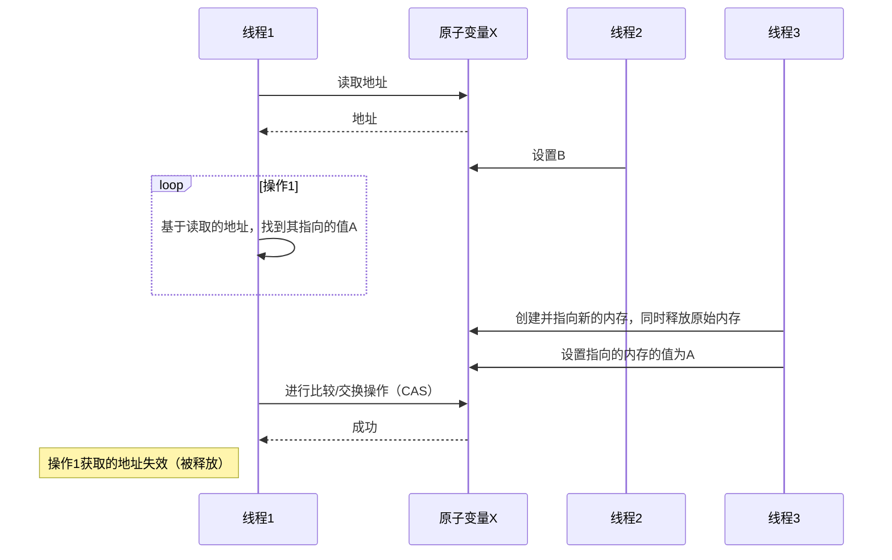
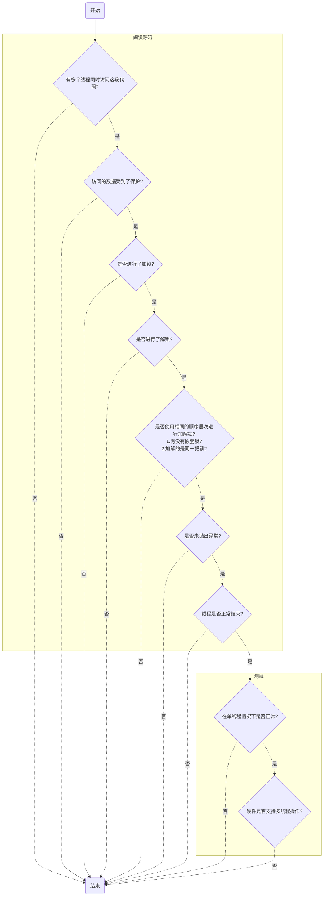

[English](concurrency.md) | 中文版

# C++并发编程

[TOC]

## std::thread

### 创建线程

使用`std::thread`创建线程对象，创建时所提供的函数对象被复制（copied）到属于新创建的执行线程的存储器中，并从那里调用。

用例：

```c++
// 老式的方法
std::thread my_thread(background_task());
// 新式创建线程的方法
std::thread my_thread{background_task()};
```

### 等待线程完成

通过调用`join()`来等待线程完成，只能对一个给定的线程调用一次`join()`，一旦调用`join()`，此`std::thread`对象不再是可连接的，并且`joinable()`将返回`false`。

**注意：为了防止`std::thread`对象在线程开始之后，在调用`join()`之前引发异常，有2种方法预防这个问题：**

1. 用`try/catch`捕获异常

   ```c++
   std::thread t(my_func);
   try
   {
   	...
   }
   catch(...)
   {
   	t.join();
   	throw;
   }
   t.join();
   ```

2. 用RAII语法

   ```c++
   class thread_guard
   {
     std::thread& t;
   public:
     explicit thread_guard(std::thread& t_) : t(t_) {}
     ~thread_guard()
     {
       if(t.joinable())
       {
         t.join();
       }
     }
     ...
   };
   std::thread t(...);
   thread_guard g(t);
   ```

### 线程分离

在`std::thread`对象上调用`detach()`会把线程丢在后台运行（后台运行后，没有直接的方法与之通信）。

用例：

```c++
std::thread t(...);
t.detach();
```

### 线程函数传参

参数会以默认的方式被复制（copied）到内部存储空间；当传递引用来作为参数时，会自行复制引用指向的值，有以下2个办法来避免：

1. 使用`std::ref`来包装被引用的参数。

   用例：

   ```c++
   void f(...);
   std::thread t(f, std::ref(...))
   ```

2. 使用智能指针`std::unique_ptr`来限制所有权，使用`std::move`来转移所有权。

   用例：

   ```c++
   void f(std::unique_ptr<...>);
   std::unique_ptr<...> p(new ...);
   std::thread t(f, std::move(p));
   ```

### 转移线程函数所有权

`std::thread`支持移动，调用`std::move`可以将线程的所有权从一个函数中被转移出来。

用例：

```c++
void f(std::thread t);
std::thread t(...);
f(std::move(t));
```

### 在运行时选择线程数量

`std::thread::hardware_currency()`用来计算给定程序执行时能够真正并发运行的线程数量

用例：

```c++
unsigned long const hardware_threads = std::thread::hardware_concurrency();
```

### 标识线程

线程标识符是`std::thread::id`类型，有2种获取方式：

- 通过从与之相关联的`std::thread`对象中调用`get_id()`获得。
- 线程构建时返回。


## std::mutex

`std::mutex`用于提供对多线程共享数据的保护。

用例：

```c++
#include <mutext>
std::mutex m;
void f()
{
  m.lock();
  ...
  m.unlock();
}
```

### RAII机制

`std::lock_guard`是基于RAII机制的`mutex`包装器，通过在作用域中创建`lock_guard`对象，当离开作用域时自动释放mutex，从而防止因忘记解锁的而产生问题。

用例：

```c++
#include <mutext>
std::mutex mu;
void f()
{
    std::lock_guard<std::mutex> lock(mu);
    ...
}
```

**注意：`std::lock_guard`类不可复制**

### 如何避免死锁

- 使用相同的顺序锁定和解锁。
- 尽量避免嵌套锁。
- 使用锁层次。
- 在持有锁时，避免调用用户提供的代码。

### 转移锁的所有权

如果源为右值，则所有权转移是自动的，而对于左值，所有权转移必须是显式完成，以避免从变量中意外的转移了所有权。

```c++
std::unique_lock<std::mutex> get_lock()
{
  extern std::mutex m;
  std::unique_lock<std::mutex> lk(some_mutex);
  ...
  return lk;
}
void process_data()
{
  std::unique_lock<std::mutex> lk(get_lock());
  ...
}
```

### 使用`boost::share_mutex`保护很少更新的数据结构

```c++
#include <mutex>
#include <boost/thread/shared_mutex.hpp>

mutable boost::shared_mutex sm;
boost::shared_lock<boost::shared_mutex> lk(sm); // 提供共享，只读访问
```

### 递归锁

**不推荐使用递归锁。**


## std::atomic

### 原子操作

`std::atomic`原子操作，用于保证并发访问数据时不会发生"数据竞争"，可以通过`std::memory_order`决定不同线程之间同步内存访问顺序：

| 操作类型                            | 分类                                                         |
| ----------------------------------- | ------------------------------------------------------------ |
| 存储（store）操作                   | `memory_order_relaxed`<br>`memory_order_release`<br>`memory_order_seq_cst` |
| 载入（load）操作                    | `memory_order_relaxed`<br>`memory_order_consume`<br>`memory_order_acquire`<br>`memory_order_seq_cst` |
| 读-修改-写（read-modify-write）操作 | `memory_order_relaxed`<br>`memory_order_consume`<br>`memory_order_acquire`<br>`memory_order_release`<br>`memory_order_acq_rel`<br>`memory_order_seq_cst` |

| 支持的C数据类型    | 对应的atomic数据类型 |
| ------------------ | -------------------- |
| bool               | atomic_bool          |
| char               | atomic_char          |
| signed char        | atomic_schar         |
| unsigned char      | atomic_uchar         |
| short              | atomic_short         |
| unsigned long      | atomic_ulong         |
| long long          | atomic_llong         |
| unsigned long long | atomic_ullong        |
| wchar_t            | atomic_wchar_t       |
| char16_t           | atomic_char16_t      |
| char32_t           | atomic_char32_t      |
| intmax_t           | atomic_intmax_t      |
| uintmax_t          | atomic_uintmax_t     |
| int_leastN_t       | atomic_int_leastN_t  |
| uint_leastN_t      | atomic_uint_leastN_t |
| int_fastN_t        | atomic_int_fastN_t   |
| uint_fastN_t       | atomic_uint_fastN_t  |
| intptr_t           | atomic_uint_fastN_t  |
| uintptr_t          | atomic_intptr_t      |
| size_t             | atomic_size_t        |
| ptrdiff_t          | atomic_ptrdiff_t     |

| 成员函数                                             | 说明                                                         |
| ---------------------------------------------------- | ------------------------------------------------------------ |
| `operator=`                                          | 将值存储于原子对象。                                         |
| `is_lock_free`                                       | 检查原子对象是否免锁。                                       |
| `store`                                              | 原子地以非原子对象替换原子对象的值。                         |
| `load`                                               | 原子地获得原子对象的值。                                     |
| `operator T`                                         | 从原子对象加载值。                                           |
| `exchange`                                           | 原子地替换原子对象的值并获得它先前持有的值。                 |
| `compare_exchange_weak`<br>`compare_exchange_strong` | 原子地比较原子对象与非原子参数的值，若相等则进行交换，不相等则进行加载。 |

**注意：**

1. `std::atomic`不能拷贝构造和拷贝赋值。

#### CAS

`CAS(compare and swap)`，原子地比较原子对象与非原子参数的值。若相等则进行交换，不相等则进行加载。

- `compare_excahge_weak` 弱CAS操作（允许偶然出乎意料的返回，性能更高）。

- `compare_exchange_strong` 强CAS操作。

例：

```c++
TODO
```

#### 指针运算

`std::atomic<T*>`提供`fetch_add()`和`fetch_sub()`操作，它们都是读-改-写操作，它们可以拥有任意的内存顺序标签，以及加入到一个释放序列中。指定的语序不可能是操作符的形式，因为没办法提供必要的信息：这些形式都具有memory_order_seq_cst语义。

```c++
class F{};
F f[5];
std::atomic<F*> p(f);
F* x=p.fetch_add(2); // p加2，并返回原始值
assert(p.load()==&f[2]);
```

### 无锁布尔原子类型

对于`std::atomic_flag`(无锁布尔原子类型)，对象类型必须用`ATOMIC_FLAG_INIT`初始化，一旦标识初始化完成，你只能对它做三件事：

- 销毁
- 清除（clear）
- 设置并查询其先前的值（`test_and_set`）

```c++
// 使用std::atomic_flag的自旋锁互斥实现：
class spinlock_mutex
{
  std::atomic_flag flag;
public:
  spinlock_mutex():
  	flag(ATOMIC_FLAG_INIT)
  {}
  void lock()
  {
    while(flag.test_and_set(std::memory_order_acquire));
  }
  void unlock()
  {
    flag.clear(std::memory_order_release);
  }
};
```

### 指定内存访问顺序

`std::memory_order`用于指定内存访问顺序，需要包含头文件`<atomic>`。

| std::memory_order      | 说明                                                         |
| ---------------------- | ------------------------------------------------------------ |
| `memory_order_relaxed` | 宽松操作：没有同步或顺序制约，进对此操作要求原子性。         |
| `memory_order_consume` | 消费操作：有此内存顺序的加载操作，在其影响的内存位置进行消费操作，当前线程中依赖于当前加载的该值的读或写不能被重排到此加载前。其它释放同一原子变量的线程的对数据依赖变量的写入，为当前线程所可见。在大多数平台上，这只影响到编译器优化。 |
| `memory_order_acquire` | 获得操作：有此内存顺序的加载操作，在其影响的内存位置进行获得操作；当前线程中读/写不能被重排到此加载前。其它释放同一原子变量的线程的所有写入，能为当前线程所见。 |
| `memory_order_release` | 释放操作：有此内存顺序的存储操作进行释放操作；当前线程中的读/写不能被重排到此存储后。当前线程的所有写入，可见于获得该同一原子变量的其它线程，并且对该原子变量的带依赖写入变得对于其它消费同一原子对象的线程可见。 |
| `memory_order_acq_rel` | 请求中继操作：带此内存顺序的读修改写操作即是获得操作又是释放操作。当前线程的读或写内存不能被重排到此存储前或后。所有释放同一原子变量的线程的写入可见于修改之前，而且修改可见于其它获得同一原子变量de |
| `memory_order_seq_cst` | 序列一致操作：有此内存顺序的加载操作进行获得操作，存储操作进行释放操作，而读修改写操作进行获得操作和释放操作，再加上存在一个单独全序，其中所有线程以同一顺序观测到所有修改。 |

例：

```c++
#include <atomic>
#include <thread>
#include <functional>
#include <iostream>

int main(int argc, char* argv[])
{
    // std::memory_order_relaxed 宽松
    std::atomic<int>x = {0};
    std::atomic<int>y = {0};
    auto fn1 = std::bind([&]() {
        auto tmp1 = x.load(std::memory_order_relaxed);
        if (tmp1 == 42) {
            y.store(tmp1, std::memory_order_relaxed);
        }

        auto tmp2 = y.load(std::memory_order_relaxed);
        if (tmp2 == 42) {
            x.store(42, std::memory_order_relaxed);
        }
    });
    std::vector<std::thread> pool;
    for (auto i = 0; i < 100; ++i) {
        pool.emplace_back(fn1);
    }
    for (auto& t : pool) {
        t.join();
    }
    std::cout << "x = " << x << std::endl; // x = 0
    std::cout << "y = " << y << std::endl; // y = 0

    // std::memory_order_release--std::memory_order_acquire 释放--获得
    std::atomic<int>z = {0};
    auto fn2_1 = std::bind([&]() {
        z.store(1, std::memory_order_release);
    });
    auto fn2_2 = std::bind([&]() {
        while (!(z.load(std::memory_order_acquire))) {
            continue;
        }
        z.store(2);
    });
    std::thread t2_2(fn2_2);
    std::thread t2_1(fn2_1);
    std::cout << "z = " << z << std::endl; // z = 2

    // std::memory_order_release--std::memory_order_acq_rel--std::memory_order_acquire
    // 释放--中继--获得
    std::atomic<int>m = {0};
    auto fn3_1 = std::bind([&]() {
        m.store(1, std::memory_order_release);
    });
    auto fn3_2 = std::bind([&]() {
        int expected = 1;
        while (!m.compare_exchange_strong(expected, 2, std::memory_order_acq_rel)) {
            continue;
        }
    });
    auto fn3_3 = std::bind([&]() {
        while (m.load(std::memory_order_acquire) != 2) {
            continue;
        }
        m.store(3);
    });
    std::thread t3_3(fn3_3);
    std::thread t3_1(fn3_1);
    std::thread t3_2(fn3_2);
    t3_3.join();
    t3_1.join();
    t3_2.join();
    std::cout << "m = " << m << std::endl; // m = 3

    // std::memory_order_release -- std::memory_order_consume 释放 -- 消费
    std::atomic<int>n = {0};
    auto fn4_1 = std::bind([&]() {
        n.store(1, std::memory_order_release);
    });
    auto fn4_2 = std::bind([&]() {
        int tmp = 0;
        while (!(tmp = n.load(std::memory_order_consume))) {
            continue;
        }
        std::cout << "n = " << tmp << std::endl; // n = 1
    });
    std::thread t4_1(fn4_1);
    std::thread t4_2(fn4_2);
    t4_1.join();
    t4_2.join();

    // std::memory_order_seq_cst 序列一致
    std::atomic<bool>c1 = {false};
    std::atomic<bool>c2 = {false};
    std::atomic<int>c3 = {0};
    auto fn5_1 = std::bind([&]() {
        c1.store(1, std::memory_order_seq_cst);
    });
    auto fn5_2 = std::bind([&]() {
        c2.store(1, std::memory_order_seq_cst);
    });
    auto fn5_3 = std::bind([&]() {
        while (!c1.load(std::memory_order_seq_cst)) {
            continue;
        }
        if (c2.load(std::memory_order_seq_cst)) {
            ++c3;
        }
    });
    auto fn5_4 = std::bind([&]() {
        while (!c2.load(std::memory_order_seq_cst)) {
            continue;
        }
        if (c1.load(std::memory_order_seq_cst)) {
            ++c3;
        }
    });
    std::thread t5_1(fn5_1);
    std::thread t5_2(fn5_2);
    std::thread t5_3(fn5_3);
    std::thread t5_4(fn5_4);
    t5_1.join();
    t5_2.join();
    t5_3.join();
    t5_4.join();
    std::cout << "c3 = " << c3 << std::endl; // c3 = 2
}
```

### 栅栏

`std::atomic_thread_fence（栅栏）`可以让自由操作变得有序。例：

```c++
#include <atomic>
#include <thread>

std::atomic<bool> x, y;
std::atomic<int> z;
void write_x_then_y()
{
    x.store(true, std::memory_order_relaxed);
    std::atomic_thread_fence(std::memory_order_release); // 释放栅栏
    y.store(true, std::memory_order_relaxed);
}
void read_y_then_x()
{
    while(!y.load(std::memory_order_relaxed));
    std::atomic_thread_fence(std::memory_order_acquire); // 获取栅栏
    if (x.load(std::memory_order_relaxed))
        ++z;
}
int main()
{
    x=false;
    y=false;
    z=0;
    std::thread a(write_x_then_y);
    std::thread b(read_y_then_x);
    a.join();
    b.join();
    assert(z.load() != 0);
}
```


## std::future

类模板`std::future`提供访问异步操作结果的机制，所引用的共享状态不能与任何其它异步返回的对象共享：

1. 通过异步操作（`std::async`, `std::packaged_task`或`std::promise`）返回一个`std::future`对象。
2. 当异步操作完成后，通过`std::future`获取异步操作返回的值。

```c++
#include <iostream>
#include <future>
#include <thread>

int main(int argc, char* argv[])
{
    // 通过promise-future通道，返回future
    std::promise<int> p;
    std::future<int> f1 = p.get_future();
    std::thread([&p] {p.set_value_at_thread_exit(1);}).detach();
    f1.wait();
    std::cout << "wait for promise:" << f1.get() << std::endl;

    // 通过async返回future
    std::future<int> f2 = std::async(std::launch::async, []() {
        return 2;
    });
    f2.wait();
    std::cout << "wait for async:" << f2.get() << std::endl;

    // 通过package_task返回future
    std::packaged_task<int()> task([]() {
        return 3;
    }); // 包装
    std::future<int> f3 = task.get_future();
    std::thread(std::move(task)).detach();
    f3.wait();
    std::cout << "wait for packaged_task:" << f3.get() << std::endl;
}

```

### 异步运行

`std::async`(异步运行函数）用于实现异步操作，并返回最终保有该函数调用结果的`std::future`，若使用`std::async`需要引用头文件`#include <future>`。

`std::launch`为`std::async`提供调用策略：

| std::launch             | 说明                                                         |
| ----------------------- | ------------------------------------------------------------ |
| `std::launch::asnyc`    | 异步求值，启动一个新的线程调用函数，该函数由新线程异步调用，并且将其返回值与共享状态的访问点同步。 |
| `std::launch::deferred` | 延迟求值，在访问共享状态时(调用get函数)，该函数才被调用，对函数的调用将推迟到返回的`std::future`的共享状态被访问时触发。 |

例：

```c++
#include <iostream>
#include <future>

int main(int argc, char* argv[])
{
    int i = 1;
    auto f1 = std::async([](int& n)->int {
        std::cout << "n = " << n << std::endl;
        return n * 2; // n = 2
    }, std::ref(i));
    i++;
    f1.wait();
    i++;
    std::cout << "i:" << i << ", f1:" << f1.get() << std::endl;

    i = 1;
    auto f2 = std::async(std::launch::deferred, [](int& n)->int{
        std::cout << "n = " << n << std::endl;
        return n * 2; // n = 3
    }, std::ref(i));
    i++;
    f2.wait();
    i++;
    std::cout << "i:" << i << ", f2:" << f2.get() << std::endl;

    i = 1;
    auto f3 = std::async(std::launch::async, [](int& n)->int{
        std::cout << "n = " << n << std::endl;
        return n * 2; // n = 2
    }, std::ref(i));
    i++;
    f3.wait();
    i++;
    std::cout << "i:" << i << ", f3:" << f3.get() << std::endl;
}
```

### 线程间一次性值传递

C++11中的模板类`std::promise`提供对值或异常的存储，通过与`std::future`配合，用于在线程之间传递值（**一次性**）。

**注意：`std::promise`只应当使用一次。**

例：

```c++
#include <iostream>
#include <future>
#include <chrono>

int main(int argc, char* argv[])
{
    // 产生值
    std::promise<int> p;
    std::future<int> f = p.get_future();
    std::thread t1(std::bind([](std::promise<int>& p) {
        std::this_thread::sleep_for(std::chrono::milliseconds(1000));
        p.set_value(1);
        //        p.set_value(2); // 报错，std::promise只能用一次
    }, std::move(p)));

    // 接收值
    std::thread t2(std::bind([](std::future<int>& f) {
        std::cout << "recv :" << f.get();
        //        std::cout << "recv :" << f.get(); // 报错，std::promise只能用一次
    }, std::move(f)));

    t1.join();
    t2.join();

    t1.join();
    t2.join();
}
```

### 异步函数封装

类模板`std::packaged_task`包装任何可调用目标（函数，lambda，bind表达式或其它函数对象），使能异步调用它。其返回值或所抛异常被存储于能通过`std::future`对象访问的共享状态中。

`std::packaged_task`将一个`future`绑定到一个函数或可调用对象上。当`std::packaged_task`对象被调用时，他就调用相关联的函数或可调用对象，并且让`future`就绪，将返回值作为关联数据存储。

**注意：如果需要开启异步任务，推荐使用async而不是package_task。**

例：

```c++
#include <iostream>
#include <future>

int fn(int a)
{
    return a + 2;
}

int main(int argc, char* argv[])
{
    // lambda
    std::packaged_task<int(int)>task1([](int a)->int {
        return a + 1;
    });
    auto f1 = task1.get_future();
    task1(1);
    std::cout << "lambda :" << f1.get() << std::endl;

    // bind
    std::packaged_task<int(int)>task2(std::bind(fn, std::placeholders::_1));
    auto f2 = task2.get_future();
    task2(1);
    std::cout << "bind :" << f2.get() << std::endl;

    // thread
    std::packaged_task<int(int)>task3(fn);
    auto f3 = task3.get_future();
    std::thread t(std::move(task3), 2);
    t.join();
    std::cout << "thread :" << f3.get() << std::endl;

    return a.exec();
}
```


## std::condition_variable

`std::condition_variable`（条件变量）用于同步线程，通过阻塞一个或多个线程，直到另一个线程通知`condition_variable`时解除阻塞（最常见的应用场景：消息队列）。

| 函数            | 说明                                                     |
| --------------- | -------------------------------------------------------- |
| `wait`          | 阻塞当前线程，直到条件变量被唤醒。                       |
| `wait_for`      | 阻塞当前线程，直到条件变量被唤醒，或到指定时限时长后。   |
| `wait_until`    | 阻塞当前线程，直到条件变量被唤醒，或直到抵达执行时间点。 |
| `notify_one`    | 通知一个等待的线程。                                     |
| `notify_all`    | 通知所有等待的线程。                                     |
| `native_handle` | 返回原生句柄。                                           |

**注意：**

1. `std::condition_variable`和`std::condition_variable_any`对象本身均不可拷贝和赋值。
2. `std::condition_variable`和`std::condition_variable_any`只负责条件变量，加锁需要通过mutex/atomic。
3. 调用`wait()`，`wait_for()`，`wait_until()`函数后，内部会阻止当前线程运行，**并解锁互斥量**。

例，超时条件变量：

```c++
#include <condition_variable>
#include <mutex>
#include <chrono>

std::condtion_variable cv;
std::mutex m;

auto const timeout=std::chrono::steady_clock::now()+std::chrono::milliseconds(500);
std::unique_lock<std::mutex> lk(m);
if(cv.wait_until(lk, timeout)==std::cv_status::timeout)
	break;
```

### 与std::mutex配合

```c++
#include <mutex>
#include <condition_variable>

// 由于锁定互斥元是一种可变的操作，故互斥元对象必须标记为mutable
mutable std::mutex m;
std::condition_variable cond;
void f1()
{
  std::lock_guard<std::mutex> lk(m);
  ...
  cond.notify_one();
}
void f2()
{
  std::lock_guard<std::mutex> lk(m);
  ...
  cond.wait(lk, []{ ... });
}
```

### 与std::packaged_task配合

`std::packaged_task<>`将一个`future`绑定到一个函数或可调用对象上。当`std::packaged_task<>`对象被调用时，他就调用相关联的函数或可调用对象，并且让`future`就绪，将返回值作为关联数据存储。

```c++
#include <mutex>
#include <future>
#include <thread>

std::mutex m;
std::deque<std::packaged_task<void()> > tasks;
std::packaged_task<void()> task;

void f1()
{
  while (1) {
  	std::lock_guard<std::mutex> lk(m);
		task=std::move(tasks.front());
		tasks.pop_front();
		task();
  }
}
f1();

template<typename Func>
std::future<void> f2(Func f)
{
  std::packaged_task<void()> task(f); 		 // 新建任务
  std::future<void> res=task.get_future(); // 从任务中获取future
  std::lock_guard<std::mutex> lk(m);
  tasks.push_back(std::move(task));
  return res;
}
```

### std::condition_variable_any

可以与复合成为类似互斥元的最低标准的任何东西一起工作，此函数更加普遍，但是有性能代价；除非必要，应该首选`std::condition_variable`。


## 无锁并发

通过使用`std::atomic`（原子操作）实现无锁并发，实现了代码最大程度的并发。

### 优缺点

| 优点                                                   | 缺点                                                         |
| ------------------------------------------------------ | ------------------------------------------------------------ |
| 1.可以实现最大程度的并发。<br>2.可以增强程序的健壮性。 | 1.代码编写比较复杂，尤其是涉及到内存访问顺序。<br>2.需要硬件支持。 |

### 设计准则

1. 使用`std::memory_order_seq_cst`作为原型。

2. 使用无锁内存回收模式：

   无锁代码最大的问题之一就是管理内存，当别的线程引用对象的时候就不能删除它们。以下三种方法来确保可以安全回收内存：

   - 等待知道没有线程访问该数据结构，并且删除所有等待删除的对象。
   - 使用风险指针来确定线程正在访问一个特定的对象。
   - 引用计数对象，只有直到没有显著的引用时才删除它们。

   另一个方法就是回收节点，并且当数据结构被销毁的时候才完全释放它们。因为节点是重复使用的，内存永远不会失效，这样避免未定义行为的困难就不存在了，但是会引来[ABA问题](#ABA问题)。

3. 当心ABA问题

   [ABA问题](#ABA问题)是任何基于`比较/交换`的算法都必须提防的问题，使用时需注意。

4. 识别忙于等待的循环以及辅助其它线程。

### ABA问题



1. 线程1读取一个原子变量x，并且发现它的值为A。
2. 线程1基于这个值执行了一些操作，例如解引用它（如果它是指针的话）或者做一些查找操作。
3. 线程1被操作系统阻塞了。
4. 线程2在x上执行了一些操作，将它的值改为B。
5. 线程3更改了与值A相关的值，因此线程1持有的数值就不再有效了。这个变化有可能很大，如释放它所指向的内存或者改变相关的值一样。
6. 线程3基于新值将x的值改回A。如果这是一个指针，那么就可能是一个新的对象，此对象刚好与先前的对象使用了相同的地址。
7. 线程1重新取得x，并在x上执行比较/交换操作，与A进行比较。比较/交换操作成功了（因为值确实是A），但是这个A的值是错误的。第二步中读取的值不再有效，但是线程1并不知道，并且将破坏数据机构。

### 无锁线程安全队列

```c++
template<typename T>
class lock_free_queue
{
private:
  struct node;
  struct counted_node_ptr
  {
    int external_count;
    node* ptr;
  }
  std::atomic<counted_node_ptr> head;
  std::atomic<counted_node_ptr> tail;
  struct node_counter
  {
    unsigned internal_count=30;
    unsigned external_counters=2;
  };
  struct node
  {
    std::atomic<T*> data;
    std::atomic<node_counter> count;
    std::atomic<counted_node_ptr> next;
    
    void release_ref()
    {
    	node_counter old_counter = count.load(std::memory_order_relaxed);
      node_counter new_counter;
      do
      {
        new_counter = old_counter;
        --new_counter.internal_count;
      }
      while (!count.compare_exchange_strong(old_counter, new_counter,
                                            std::memory_order_acquire,
                                            std::memory_order_relaxed));
      if (!new_counter.internal_count && 
          !new_counter.external_counters)
      {
        delete this;
      }
    };
    
    node()
    {
      node_counter new_count;
      new_count.internal_count = 0;
      new_count.external_counters = 2;
      count.store(new_count);
      
      next.ptr = nullptr;
      next.external_count = 0;
    }
  };
  
  node* pop_head()
  {
    node* const old_head = head.load();
    if (old_head == tail.load())
    {
      return nullptr;
    }
    head.store(old_head->next);
    return old_head;
  };
  
  static void increase_external_count(std::atomic<counted_node_ptr>& counter,
                                      counted_node_ptr& old_counter)
  {
    counted_node_ptr new_counter;
    do
    {
      new_counter = old_counter;
      ++new_counter.external_count;
    }
    while (!counter.compare_exchange_strong(old_counter, new_counter, 
           	std::memory_order_acquire, std::memory_order_relaxed));
    old_counter.external_count = new_counter.external_count;
  };
  
  static void free_external_counter(counted_node_ptr &old_node_ptr)
  {
    node* const ptr = old_node_ptr.ptr;
    int const count_increase = old_node_ptr.external_count - 2;
    node_counter old_counter = ptr->count.load(std::memory_order_relaxed);
    node_counter new_counter;
    do
    {
      new_counter = old_counter;
      --new_counter.external_counters;
      new_counter.internal_count += count_increase; // 更新值
    }
    while (!ptr->count.compare_exchange_strong(
    			 old_counter, new_counter,
    		   std::memory_order_acquire, std::memory_order_relaxed));
    if (!new_counter.internal_count && !new_counter.external_counters) // 此节点没有引用，删除
    {
      delete ptr;
    }
  };
  
  void set_new_tail(counted_node_ptr &old_tail,
                    counted_node_ptr const &new_tail)
  {
  	node* const current_tail_ptr = old_tail.ptr;
    while (!tail.compare_exchange_weak(old_tail, new_tail) &&
           old_tail.ptr == current_tail_ptr);
    if (old_tail.ptr == current_tail_ptr)
      free_external_counter(old_tail);
    else
      current_tail_ptr->release_ref();
  }
  
public:
  lodk_free_queue() : head(new node), tail(head.load()) {}
  lock_free_queue(const lock_free_queue& other) = delete;
  lock_free_queue& operator=(const lock_free_queue& other) = delete;
  ~lock_free_queue()
  {
    while(node* const old_head = head.load())
    {
      head.store(old_head->next);
      delete old_head;
    }
  }
  std::unique_ptr<T> pop()
  {
    counted_node_ptr old_head = head.load(std::memory_order_relaxed);
    for (;;)
    {
      increase_external_count(head, old_head);
      node* const ptr = old_head.ptr;
      if (ptr == tail.load().ptr)
      {
        return std::unique_ptr<T>();
      }
      counted_node_ptr next = ptr->next.load();
      if (head.compare_exchange_strong(old_head, ptr->next))
      {
        T* const res = ptr->data.exchange(nullptr);
        free_external_counter(old_head);
        return std::unique_ptr<T>(res);
      }
      ptr->release_ref();
    }
  }
  void push(T new_value)
  {
    std::unique_ptr<T> new_data(new T(new_value));
    counted_node_ptr new_next;
    new_next.ptr = new node;
    new_next.external_count = 1;
    for (;;)
    {
      increase_external_count(tail, old_tail);
      T* old_data = nullptr;
      if (old_tail.ptr->data.compare_exchange_strong(
      			old_data, new_data.get())) // 解引用原子指针
      {
        couted_node_ptr old_next = {0};
        if (!old_tail.ptr->next.compare_exchange_strong(old_next, new_next))
        {
          delete new_next.ptr;
          new_next = old_next;
        }
        set_new_tail(old_tail, new_next);
        new_data.release();
        break;
      }
      else
      {
        counted_node_ptr old_next={0};
        if (old_tail.ptr->next.compare_exchange_strong(old_next, new_next)) {
          old_next = new_next;
          new_next.ptr = new node;
        }
        set_new_tail(old_tail, old_next); // 真正的更新
      }
    }
  }
};
```

#### 第三方实现

- Zeromq
- boost.lockfree.queue/boost.lockfree.spsc_queue

### 无锁线程安全栈

```c++
unsigned const max_hazard_pointers=100;
struct hazard_pointer
{
  std::atomic<std::thread::id> id;
  std::atomic<void*> pointer;
};
hazard_pointer hazard_pointers[max_hazard_pointers];

class hp_owner
{
  hazard_pointer* hp;
public:
  hp_owner(hp_owner const&)=delete;
  hp_owner operator=(hp_owner const&)=delete;
  hp_owner() : hp(nullptr)
  {
    for (unsigned i = 0; i < max_hazard_pointers; ++i)
    {
      std::thread::id old_id;
      if(hazard_pointers[i].id.compare_exchange_strong( // 试着获取风险指针的所有权
        old_id, std::this_thread::get_id())){
        hp = &hazard_pointers[i];
        break;
      }
    }
    if (!hp)
    {
      throw std::runtime_error("No hazard pointers available");
    }
  }
  std::atomic<void*>& get_pointer()
  {
    return hp->pointer;
  }
  ~hp_owner()
  {
    hp->pointer.store(nullptr);
    hp->id.store(std::thread::id());
  }
}

template<typename T>
class lock_free_stack
{
private:
  struct node;
  struct counted_node_ptr
  {
    int external_count;
    node* ptr;
  };
  struct node
  {
    std::shared_ptr<T> data;
    node* next;
    
    node(T const& data_) : data(std::make_shared<T>(data_)) {}
  };
  
  std::atomic<counted_node_ptr> head;
  std::atomic<unsigned> thread_in_pop;
  std::atomic<node*> to_be_deleted;
  std::atomic<data_to_reclaim*> nodes_to_reclaim;
  
  void try_reclaim(node* old_head);
  static void delete_nodes(node* nodes)
  {
    while(nodes)
    {
      node* next = nodes->next;
      delte nodes;
      nodes = next;
    }
  }
  void increase_head_count(counted_node_ptr& old_counter)
  {
    counted_node_ptr new_counter;
    do
    {
      new_counter = old_counter;
      ++new_counter.external_count;
    }
    while (!head.compare_exchange_strong(old_counter, new_counter, 
                                         std::memory_order_acquire,
                                         std::memory_order_relaxed));
    old_counter.external_count = new_counter.external_count;
  }
  void try_reclaim(node* old_head)
  {
    if (threads_in_pop == 1)
    {
      node* nodes_to_delete = to_be_deleted.exchange(nullptr); // 列出将要被删除的节点清单
      if (!--threads_in_pop)
      {
        delete_nodes(nodes_to_delete);
      }
      else if (nodes_to_delete)
      {
        chain_pending_nodes(nodes_to_delete);
      }
      delete old_head;
    }
    else
    {
      chain_pending_node(old_head);
      --threads_in_pop;
    }
  }
  void chain_pending_nodes(node* nodes)
  {
    node* last = nodes;
    while (node* const next = last->next) // 跟随下一个指针，链至末尾
    {
      last = next;
    }
    chain_pending_nodes(nodes, last);
  }
  void chain_pending_nodes(node* first, node* last)
  {
    last->next = to_be_deleted;
    while (!to_be_deleted.compare_exchange_weak(last->next, first)); // 循环以保证last->next正确
  }
  void chain_pending_node(node* n)
  {
    chain_pending_nodes(n, n);
  }
  std::atomic<void*>& get_hazard_pointer_for_current_thread()
  {
    thread_local static hp_owner hazard; // 每个线程都有自己的风险指针
    return hazard.get_pointer();
  }
  bool outstanding_hazard_pointers_for(void* p)
  {
    for(unsigned i=0; i<maz_hazard_pointers; ++i)
    {
      if(hazard_pointers[i].pointer.load() == p)
      {
        return true;
      }
    }
    return false;
  }
  void add_to_reclaim_list(data_to_reclaim* node)
	{
  	node->next = nodes_to_reclaim.load();
  	while (!nodes_to_reclaim.compare_exchange_weak(node->next, node));
	}
	template<typename T>
	void reclaim_later(T* data)
	{
  	add_to_reclaim_list(new data_to_reclaim(data));
	}
	void delete_nodes_with_no_hazards()
	{
  	data_to_reclaim* current=nodes_to_reclaim.exchange(nullptr);
  	while(current)
    {
    	data_to_reclaim* const next = current->next;
    	if (!outstanding_hazard_pointers_for(current->data))
    	{
      	delete current;
    	}
    	else
    	{
      	add_to_reclaim_list(current);
    	}
    	current = next;
  	}
	}
  template<typename T>
	void do_delete(void* p)
	{
  	delete static_cast<T*>(p);
	}
  
	struct data_to_reclaim
	{
  	void* data;
  	std::function<void(void*)> deleter;
  	data_to_reclaim* next;
  
  	template<typename T>
  	data_to_reclaim(T* p) : data(p), deleter(&do_delete<T>), next(0) {}
  	~data_to_reclaim()
  	{
    	deleter(data);
  	}
	};
public:
  ~lock_free_stack()
  {
    while(pop());
  }
  void push(T const& data)
  {
    counted_node_ptr new_node; // 创建节点
    new_node.ptr = new node(data);
    new_node.external_count = 1;
    new_node.ptr->next = head.load(std::memory_order_relaxed); // 将next指针指向head
    while(!head.compare_exchange_weak(new_node->next, new_node,
                                      std::memory_order_release,
                                      std::memory_order_relaxed)); // 将head指向新节点
  }
  std::shared_ptr<T> pop()
  {
    counted_node_ptr old_head = head.load(std::memory_order_relaxed);
    for (;;)
    {
      increase_head_count(old_head);
      node* const ptr = old_head.ptr;
      if (!ptr)
      {
        return std::shared_ptr<T>();
      }
      if (head.compare_exchange_strong(old_head, ptr->next, std::memory_order_relaxed))
      {
        std::shared_ptr<T> res;
        res.swap(ptr->data);
        int const count_increase = old_head.external_count - 2;
        if (ptr->internal_count.fetch_add(count_increase,
                                         std::memory_order_release)==-count_increase)
        {
          delete ptr;
        }
        return res;
      }
      else if(ptr->internal_count.fetch_add(-1, std::memory_order_relaxed) == 1)
      {
        ptr->internal_count.load(std::memory_order_acquire);
        delete ptr;
      }
    }
  }
};
```

#### 第三方实现

- boost.lockfree.stack


## 并发经验

### 并发库比较

| 功能                       | Java                                                         | POSIX C                                                      | Boost threads                                                | C++11                                                        |
| -------------------------- | ------------------------------------------------------------ | ------------------------------------------------------------ | ------------------------------------------------------------ | ------------------------------------------------------------ |
| 启动线程                   | `java.lang.thread`类                                         | `pthread_t`类型和相关`API`函数：<br>  - `pthread_create()`<br>  - `pthread_detach()`<br>  - `pthread_join()` | `boost::thread`类与成员函数                                  | `std::thread`类与成员函数                                    |
| 互斥                       | synchronized块                                               | `pthread_mutex_t`类型和相关`API`函数：<br>  - `pthread_mutex_lock()`<br>  - `pthread_mutex_unlock()` | `boost::mutex`类与成员函数：<br>  - `boost::locak_guard<>`<br>  - `boost::unique_lock<>`模板 | `std::mutex`类与成员函数，<br>`std::lock_guard<>`和<br>`std::unique_lock<>`模板 |
| 监控/等待预期              | `java.lang.Object`类的`wait()`和`notify()`方法，在synchronized块内使用 | `pthread_cond_t`类型与相关`API`函数：<br>  -`pthread_wait()`<br>  -`pthread_cond_timed_wait()` | `boost::condition_variable`和<br>`boost::condition_variable_any`<br>类与成员函数 | `std::condition_variable`<br>`std::condition_variable_any`类与成员函数 |
| 原子操作与并发感知内存模型 | volatile变量，位于`java.util.concurrent.atomic`包中          | 不可用                                                       | 不可用                                                       | `std::atomic_xxx`类型<br>`std::atomic<>`类模板<br>`std::atomic_thread_fence()`函数 |
| 线程安全容器               | `java.util.concurrent`包中的容器                             | 不可用                                                       | 不可用                                                       | 不可用                                                       |
| future                     | `java.util.concurrent.future`接口及相关类                    | 不可用                                                       | - `boost::unique_future<>`<br>- `boost::shared_future<>`类模板 | `std::future<>`,<br>`std::shared future<>`和<br>`std::atomic future<>`类模板 |
| 线程池                     | `java.util.concurrent.ThreadPoolExecutor`类                  | 不可用                                                       | 不可用                                                       | 不可用                                                       |
| 线程中断                   | `java.lang.Thread`的`interrupt()`方法                        | `pthread_cancel()`                                           | `boost::thread`类的`interrupt()`成员函数                     | 不可用                                                       |

### 性能分析

影响代码并发性能的原因：

- 处理器数量

  处理器数量会影响到并发代码的性能，在linux下可以使用函数`std::thread::hardwarre_concurrency()`来获取硬件支持的最大同时运行的线程数量。

- 数据竞争

  处理器发生数据竞争会显著的影响到并发的性能，数据竞争分为以下几种：

  - **高竞争(high contention)：**一个处理器已经准备好更新这个值，但是另一个处理器已经在做了，这就要等待另一个处理器更新，并且这个改动已经传播完成。
  - **低竞争(low contention)：**处理器很少需要互相等待。
  - **乒乓缓存(cacheping-pong)：**数据在各处理器的缓存间来回传递，如果处理器因为需要等待缓存而被挂起，在这个时间里处理器无法工作，严重影响程序的性能。

- 假共享

  **假共享(false sharing)：**一个线程在更改其访问的数据时，缓存线的所有权需要转移到其所在的处理器，而另一个线程所需的数据可能也在这个缓存线上，当它访问时缓存线又要再次转移。这个缓存线是两者共享的，然而其中的数据并不共享。通俗地说就是是一个线程访问的数据与另一个线程的靠的太近而导致的问题。

- 过度订阅和过多的任务切换

  频繁地切换任务会导致性能损失。

### 定位并发错误




## 示例

### 并发版本的std::for_each

```c++
template <typename Iterator, typename Func>
void parallel_for_each(Iterator first, Iterator last, Func f)
{
    unsigned long const length = std::distance(first, last);
    if (!length) {
        return;
    }
    unsigned long const min_per_threads = 25;
    if (length < (2 * min_per_threads)) {
        std::for_each(first, last, f);
    } else {
        Iterator const mid_point = first + length / 2;
        std::future<void> first_half = std::async(&parallel_for_each<Iterator, Func>,
                                       first, mid_point, f);
        parallel_for_each(mid_point, last, f);
        first_half.get();
    }
}
```

### 并发版本的std::find

```c++
template<typename Iterator, typename MatchType>
Iterator parallel_find_impl(Iterator first, Iterator last, MatchType match,
                            std::atomic<bool>& done)
{
    try {
        unsigned long const length = std::distance(first, last);
        unsigned long const min_per_thread = 25;
        if (length < (2 * min_per_thread)) {
            for (; (first != last) && !done.load(); ++first) {
                if (*first == match) {
                    done = true;
                    return first;
                }
            }
            return last;
        } else {
            Iterator const mid_point = first + (length / 2);
            std::future<Iterator> async_result =
                std::async(&parallel_find_impl<Iterator, MatchType>, mid_point, last, match, std::ref(done));
            Iterator const direct_result = parallel_find_impl(first, mid_point, match, done);
            return (direct_result == mid_point) ? async_result.get() : direct_result;
        }
    } catch (_exception e) {
        done = true;
        throw;
    }
}
template <typename Iterator, typename MatchType>
Iterator parallel_find(Iterator first, Iterator last, MatchType match)
{
    std::atomic<bool> done{false};
    return parallel_find_impl(first, last, match, done);
}
```

### 线程池的实现

```c++
TODO
```


## 总结

1. 用`join()`来加入线程（等待），用`detach()`来分离线程（不等）。

2. 要确保`std::thread`对象被销毁前已经调用`join()`或`detach()`，如果在线程开始之后在调用`join()`之前引发异常，对`join()`的调用就容易被跳过。

3. 可以使用以下方法来给线程函数传递参数：

   - 使用`std::ref`包装。
   - 使用`std::move`来转移所有权。

4. 通过一下方法来获取线程标识符`std::thread::id`:

   - 通过从与之相关联的`std::thread`对象中调用`get_id()`获得。
   - 线程构建时返回。

5. 基于RAII机制的互斥元用法：`std::lock_guard<std::mutex> guard(mutex_obj)`

6. 可以通过以下方法来等待其他线程完成：

   - 使用条件变量`std::condition_variable`和`std::condition_variable_any`。

7. 使用`std::future`来一次性地从线程中返回参数。

8. 使用`std::atomic`（原子操作）以提升并发代码的效率。

9. 无锁编程准则：

   - 使用`std::memory_order_seq_cst`作为原型。
   - 使用无锁内存回收模式。
   - 当心ABA问题。
   - 识别忙于等待的循环以及辅助其它线程。

10. **阿姆达尔定律(Amdahl's law)：**$P=\frac{1}{f_s + \frac{1 - f_s}{N}}$
    - $P$: 性能
    - $f_s$: "串行部分"
    - $N$: 处理器个数


## 参考

[1] Anthony Williams.C++并发编程实战.1ED

[2] [C++ Concurrency In Action](http://shouce.jb51.net/cpp_concurrency_in_action/)

[3] [cppreference.com](https://zh.cppreference.com/)

[4] [面试题 -- 如何设计一个线程池](https://segmentfault.com/a/1190000040631931)

[5] [C++ 标准库线程安全讨论](https://en.cppreference.com/w/cpp/container#Thread_safety)
