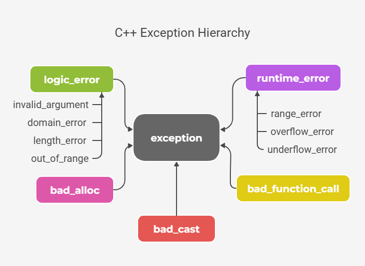

# C++ Exception

[TOC]


## Exception

An exception is an unexpected event that disrupts program flow, often from invalid operations like out-of-range access.



Standard exceptions are the set of classes that represent different types of common exceptions.

### Overflow Error

| Type                          | What Happens                                               | Detection                            | Severity            |
| :---------------------------- | :--------------------------------------------------------- | :----------------------------------- | :------------------ |
| **Signed integer overflow**   | Undefined Behavior (wrap-around common but not guaranteed) | None                                 | Critical (UB)       |
| **Unsigned integer overflow** | Wraps modulo $2^n$ (defined behavior)                      | None                                 | Moderate            |
| **Floating-point overflow**   | Results in ±infinity                                       | `std::isinf()`                       | Moderate            |
| **Buffer overflow**           | Writes past array bounds                                   | None (may crash or corrupt)          | Critical (security) |
| **Stack overflow**            | Exceeds stack size                                         | Stack overflow exception (sometimes) | Critical (crash)    |

#### Integer Overflow

```c++
// environment: macos aarch64
int x = INT_MAX; // 2,147,483,647
x = x + 1; // -2,147,483,648; ⚠️Undefined behavior: wraps around to INT_MIN
```

#### Unsigned Integer Overflow

```c++
// environment: macos aarch64    
unsigned int u = UINT_MAX; // 4,294,967,295
u = u + 1; // ⚠️ become 0
```

#### Floating-point Overflow

```c++
float f = FLT_MAX;  // 3.402823e+38
f = f * 2.0f;       // ⚠️ inf. Overflow: becomes infinity

float small = FLT_MIN;  	 // ~1.175e-38
small = small / 10000.0f;  // ⚠️ May become subnormal or 0
```

#### Buffer Overflow

```c++
char buf1[1] = {'a'};
char buf2[2] = {'b', 'c'};
strcpy(buf1, buf2); // ❌ Buffer overflow: buf1 can only hold 1 character + null terminator, but buf2 has 2 characters + null terminator
```

#### Stack Overflow

```c++
void fun() { fun(); } // ❌ Infinite recursion → stack overflow
char buf[100000000];  // ❌ Large local array on stack (typically 1-8MB limit)
```

#### Runtime Detection Techniques

```c++
template<typename T>
bool safe_add(T a, T b, T& result)
{
    if (a > 0 && b > 0 && a > std::numeric_limits<T>::max() - b) return false;
    if (a < 0 && b < 0 && a < std::numeric_limits<T>::min() - b) return false;

    result = a + b;
    return true;
}

template<typename T>
bool safe_sub(T a, T b, T& result)
{
    if (b > 0 && a < std::numeric_limits<T>::min() + b) return false;
    if (b < 0 && a > std::numeric_limits<T>::max() + b) return false;

    result = a - b;
    return true;
}

template<typename T>
bool safe_mul(T a, T b, T& result)
{
    if (a > 0 && b > 0 && a > std::numeric_limits<T>::max() / b) return false;
    if (a > 0 && b < 0 && b < std::numeric_limits<T>::min() / a) return false;
    if (a < 0 && b > 0 && a < std::numeric_limits<T>::min() / b) return false;
    if (a < 0 && b < 0 && a < std::numeric_limits<T>::max() / b) return false;

    result = a * b;
    return true;
}

template<typename T>
bool safe_div(T a, T b, T& result)
{
    if (b == 0) return false;
    if (a == std::numeric_limits<T>::min() && b == -1) return false;

    result = a / b;
    return true;
}

bool safe_strcpy(char* dest, const char* src, const size_t dest_size) 
{
    size_t src_len = strlen(src);
    if (src_len >= dest_size)
        return false;

    strcpy(dest, src);
    return true;
}
```

#### Compile-Time Prevention

1. Enable compiler warnings
   - GCC/Clang: `-Wconversion -Woverflow -Wstrict-overflow`
   - MSVC: `/W4 /analyze`
2. Use safe functions/containers (`strncpy`, `snprintf`, `std::vector`)
3. Enable Compiler protections: stack canaries (`/GS` in MSVC, `-fstack-protector` in GCC)
4. Enable ASLR (Address Space Layout Randomization)
5. Enable DEP/NX (Data Execution Prevention)

---


## Exception Handling

Exception handling in C++ is a mechanism to detect and manage runtime errors. Instead of terminating the program abruptly when an error occurs, C++ allows you to throw exceptions and catch them for graceful handling.

### try-catch block

C++ provides an inbuilt feature for handling exceptions using `try` and `catch block`

```c++
try {
  // code
} catch (ExceptionType e) {
  // exception handling code
}
```

### Throwing Exceptions

Throwing an exception means returning some kind of value that represents the exception from the `try block`.

```c++
try {
  throw val
} catch (ExceptionType e) {
  // exception handling code
}
```

There are three types of values that can be thrown as an exception:

- Built-in Types

  ```c++
  try {
    throw -1;
  } catch (int e) {
    ...
  }
  ```

- Standard Exceptions

  ```c++
  try {
    std::vector<int> v{1, 2, 3};
    v.at(10);
  } catch (std::out_of_range e) {
    ...
  }
  ```

- Custom Exceptions

  ```c++
  #include <exception>
  
  class my_exception : public std::exception
  {
  public:
    my_exception() {}
    const char* what() const noexcept override
    {
      return "my self exception";
    }
  };
  
  try {
    throw my_exception();
  } catch (my_exception& e) {
    ...
  }
  ```

### Catching Exceptions

```c++
// Catching Single Exception
catch (ExceptionType e) {...}
```

```c++
// Catching Multiple Exceptions
try {         
    ...
} catch (ExceptionType1 e) {   
    // executed when exception is of ExceptionType1
} catch (ExceptionType2 e) {   
    // executed when exception is of ExceptionType2
} catch (...) {
    // executed when no matching catch is found
}
```

#### Catch By Value

Catching exceptions by value creates a new copy of the thrown object in the catch block. Generally, the exceptions objects are not very large so there is not much overhead of creating copies.

```c++
try {
  throw std::runtime_error("I AM HERE");
} catch (std::runtime_error e) {
  ...
}
```

#### Catch By Reference

Catch by reference method just pass the reference to the exception thrown instead of creating a copy. The main advantage of this method is in catching polymorphic exception types and reduce the copy overhead.

```c++
try {
  throw std::runtime_error("I AM HERE");
} catch (std::exception& e) { // polymorphic exception type (not need explicit define std::runtime_error)
  ...
}
```

### Exception Propagation

Exception propagation tells us how the exception travels in the call stack:

- When an exception is thrown, execution of the current block is immediately terminated and all the resources allocated are automatically deallocated (except dynamic resources allocated using new).
- The stack unwinding occurs as the thrown exception propagates through the call stack to look for the matching catch block.
- When the corresponding catch block is found, exception is caught and handled. If not caught, the program terminates.

### Nested Try Catch Blocks

In C++, try-catch blocks can be defined inside another try or catch blocks:

```c++
try {
  ...
  try {
    ...
  } catch (eType e) {}
} catch (eType e) {}
```

### Exception Specification

C++ provides exception specifications to specify that the given function may or may not throw an exception. In modern C++, there are two types of exception specifications:

1. **noexcept**: Tells that the given function is guaranteed to not throw an exception.
2. **noexcept(false)**: Tells that the given function may throw an exception. (It is default behaviour in case no exception specification is used).

```c++
void func1(int a) noexcept {}
void func2(int b) noexcept(false) {}
```

### Notice

1. Don't use exceptions for regular control flow. Only use them for exceptional situations (errors).
2. Catch exceptions by reference whenever possible to avoid copying overhead and enable polymorphic selection.
3. Alwasy catch exceptions by reference to a constant to avoid accidental modification.
4. Catching generic exceptions using `catch(...)` does not provide information about exception type, so better to catch specific exceptions to handle errors appropriately.
5. Failing to catch exceptions can cause the program to terminate unexpectedly. Always ensure exceptions are caught and handled properly to maintain stability.
6. Not releasing resources (e.g., memory, file handles) after an exception can led to resource leaks. Use proper cleanup mechanisms such as RAII or finally blocks.

---


## Reference

[1] [Exception Handling in C++](https://www.geeksforgeeks.org/cpp/exception-handling-c/)
