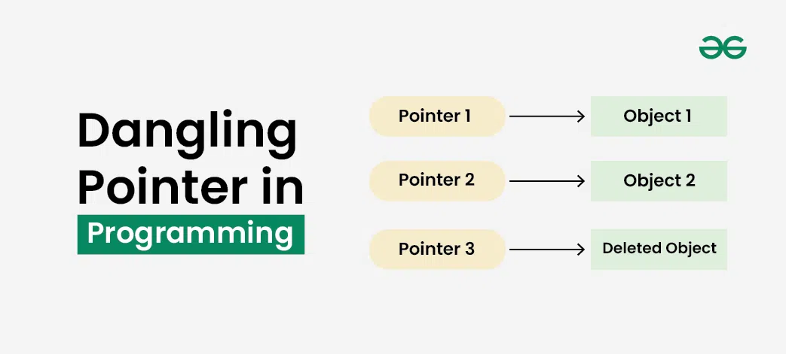

English | [中文版](feature_zh.md)

# C++ Features

[TOC]


## new

### new operator

The **new operator** is an **operator** and **cannot be overloaded**. If `A` is a class, then `A* a = new A;` actually performs the following three steps:

1. Calls `operator new` to allocate enough memory, equivalent to `operator new(sizeof(A))`;
2. Calls the constructor to create the class object, `A::A()`;
3. Returns the corresponding pointer.

In fact, memory allocation is done by `operator new(size_t)`. If class `A` overloads `operator new`, then `A::operator new(size_t)` is called; otherwise, the global  `::operator new(size_t)` is called (provided by C++ by default).

### operator new

`operator new` is a **function** and has three forms (the first two only allocate memory and do not call constructors, which is different from the new operator):

- `void* operator new (std::size_t size) throw (std::bad_alloc);`

	(can be overloaded). Allocates `size` bytes and aligns memory for the object type. On success, returns a non-null pointer to the first address; on failure, throws `bad_alloc`.

- `void* operator new (std::size_t size, const std::nothrow_t& nothrow_constant) throw();`

	(can be overloaded). Does not throw on allocation failure and instead returns `NULL`.

- `void* operator new (std::size_t size, void* ptr) throw();`

	(cannot be overloaded). This is the placement new version, defined in `#include <new>`. It does not allocate memory.

```c++
A* a = new A;                 // calls the first form
A* a = new(std::nothrow) A;   // calls the second form
new (p) A();                  // calls the third form

// After placement new, A::A() is also called at p.
// p may point to dynamic heap memory or stack buffer memory.
```

### placement new

Placement new is an overloaded form of `operator new`. It allows constructing a new object in memory that has already been allocated (stack or heap).

Using the new operator requires searching heap space large enough for allocation, which can be slow and may fail due to insufficient memory. Placement new addresses this by constructing objects in a pre-prepared memory buffer without allocation search. Allocation time is constant, and memory-shortage exceptions during runtime can be avoided.

Benefits of placement new:

- Suitable for applications with strict timing constraints that should not be interrupted.
- Preallocated memory can be reused repeatedly, reducing memory fragmentation.

Usage:

1. Pre-allocate a buffer

	 ````c++
	 // You can use heap space or stack space:
	 class MyClass { ... };
	 char* buf = new char[N * sizeof(MyClass) + sizeof(int)];
	 // or: char buf[N * sizeof(MyClass) + sizeof(int)];
	````

2. Construct object

	 ```c++
	 MyClass* pClass = new(buf) MyClass;
	```

3. Destroy object

	 Once finished, you must explicitly call the destructor. The memory is not released at this point and can be reused:

	 ```c++
	 pClass->~MyClass();
	 ```

4. Release memory

	 If the buffer is in heap memory, call `delete[] buf`; if it is on the stack, memory is released automatically at scope end.

**Notes:**

- According to the C++ standard, `placement operator new[]` needs an implementation-defined amount of extra storage to save the array size. Therefore, allocate extra `sizeof(int)` bytes.
- The `new` in step 2 is placement new: it does not allocate memory, it only calls the constructor and returns a pointer into already allocated memory. Therefore, do not call `delete` for deallocation there; call the destructor explicitly.
- Include `new.h` (or modern `<new>`) before using placement new.

[Top](#C++ Features)

---


## explicit

In C++, the `explicit` keyword is used for constructors that can be called with one argument. It marks that constructor as explicit rather than implicit.

Example of automatic conversion:

```c++
#include "stdafx.h"
#include <string>
#include <iostream>
using namespace std;

class BOOK {
private:
		string _bookISBN;
		float _price;

public:
		bool isSameISBN(const BOOK& other) {
				return other._bookISBN == _bookISBN;
		}

		BOOK(string ISBN, float price = 0.0f)
				: _bookISBN(ISBN), _price(price) {}
};

int main() {
		BOOK A("A-A-A");
		BOOK B("B-B-B");

		cout << A.isSameISBN(B) << endl;

		// implicit conversion: string -> BOOK
		cout << A.isSameISBN(string("A-A-A")) << endl;

		// explicit temporary object
		cout << A.isSameISBN(BOOK("A-A-A")) << endl;
}
```

Implicit class-type conversion can be risky: a temporary object may be created and discarded immediately.

You can suppress such conversions using `explicit`:

```c++
explicit BOOK(string ISBN, float price = 0.0f)
	: _bookISBN(ISBN), _price(price) {}
```

`explicit` can only appear on constructor declarations inside the class. Then, implicit construction is disallowed, and conversion errors will be reported.

### Explicit and implicit declarations

Implicit declaration:

```c++
class CxString {
public:
	char* _pstr;
	int _size;
	CxString(int size) {
		_size = size;
		_pstr = (char*)malloc(size + 1);
		memset(_pstr, 0, size + 1);
	}
	CxString(const char* p) {
		int size = strlen(p);
		_pstr = (char*)malloc(size + 1);
		strcpy(_pstr, p);
		_size = strlen(_pstr);
	}
};

CxString string1(24);      // OK
CxString string2 = 10;     // OK: implicit conversion
CxString string4("aaaa"); // OK
CxString string5 = "bbb";  // OK
CxString string6 = 'c';    // OK: calls CxString(int)
```

If a constructor can be called with one argument, the compiler provides implicit conversion from that argument type to the class type.

Using `explicit`:

```c++
class CxString {
public:
	char* _pstr;
	int _size;
	explicit CxString(int size) {
		_size = size;
	}
	CxString(const char* p) {
	}
};

CxString string1(24);      // OK
CxString string2 = 10;     // Error: implicit conversion disabled
CxString string4("aaaa"); // OK
CxString string6 = 'c';    // Error
```

`explicit` is meaningful not only for single-parameter constructors, but also when other parameters have defaults:

```c++
class CxString {
public:
		int _age;
		int _size;
		explicit CxString(int age, int size = 0) {
				_age = age;
				_size = size;
		}
		CxString(const char* p) {}
};
```

### Notes

1. “Callable with one argument” does not mean “has exactly one parameter”.
2. Unless you explicitly want implicit conversion, mark such constructors as `explicit`.
3. `explicit` applies to constructor declarations inside class definitions.

[Top](#C++ Features)

---


## const

`const` improves robustness and reduces programming mistakes.

### Basic usage

```c++
const int a = 100;
int const b = 100;
```

Pointers and references with `const` are common in function parameters:

```c++
int c = 1;
const int* pc = &c;
const int* pa = &a;
int* const pb = &c;
```

`const` on the left of `*` qualifies the pointed value; on the right qualifies the pointer itself.

Reference forms:

```c++
int const& r1 = b;
const int& r2 = b;
```

`int& const` is invalid because references cannot be reseated.

### constexpr

`constexpr` is a feature added in C++11. The main idea is a performance improvement of programs by doing computations at compile time rather than run time.

```c++
const expr int mul(int x, int y) { return x * y; }
int main(void)
{
    constexpr int x = mul(10, 20);
    return 0;
}
```

Common Use Cases:

- Compile-time hashing

  ```c++
  constexpr uint32_t hash(const char* str) 
  {
    uint32_t h = 0;
    while (*str) { h = h * 31 + *str++; }
    return h;
  }
  ```

- Template metaprogramming replacement

  ```c++
  template<int N>
  struct Factorial
  {
    static constexpr int value = N * Factorial<N-1>::value;
  };
  ```

- Lookup tables at compile time

  ```c++
  constexpr auto fun()
  {
    std::array<int, 10> arr{};
    for (int i = 0; i < 10; ++i)
      arr[i] = i * i;
    return arr;
  }
  
  constexpr auto val = fun(); // Computed at compile time
  ```

### The Dual Nature of constexpr Functions

If a constexpr function is called with non-constant arguments, It falls back to runtime evaluation (unless consteval). For example:

```c++
constexpr int fun(int x) { return x * x; }

// Case 1: Called with constant expression → Compile-time evaluation
constexpr int compile_time = square(5);     // ✅ Evaluated at compile time

// Case 2: Called with runtime value → Runtime evaluation
int runtime_value = 5;
int runtime_result = square(runtime_value);  // ✅ Evaluated at runtime
```

We can use `if constexpr` for performance optimization. For example:

```c++
constexpr int process(int value, bool mode) {
    if constexpr (mode) {
        return value * 100;  // Compile-time branch
    } else {
        return value;         // Runtime branch
    }
}

// Or with regular if (works in both contexts)
constexpr int smart_process(int value) {
    if (value > 1000) {
        return value / 2;     // Branch determined at runtime if value is runtime
    } else {
        return value * 2;
    }
}
```

We can use `consteval` (C++ 20) forces compile-time evaluation. For example:

```c++
consteval int fun(int x) { return x * x; }
int main()
{
  constexpr int a = fun(5);     // ✅ OK
  
  int n = 10;
  int b = fun(n); // ❌ Error! Must be compile-time
}
```

### Notes

1. Pay attention when combining `const` and references.

    ```c++
     const int a = 1;
     const int& ref1 = a;
     const int& ref2 = 1;
    ```

2. Casting away `const` may cause undefined behavior.

    ```c++
     const int i = 1;
     *(const_cast<int*>(&i)) = 2;
    ```

3. `const` objects/references/pointers cannot appear as assignable lvalues.

4. `const` objects cannot bind to non-const references.

5. A const reference may bind to non-const objects, but cannot modify them.

6. Pointer-to-const and pointer-to-non-const are different types.

7. Assignment between pointers must respect const-qualification rules.

8. Return value constness rules differ for built-ins/pointers versus user-defined types.

9. Const objects call only const member functions; overload resolution picks the const/non-const overload accordingly.

10. A constructor that is declared with a constexpr specifier is a **constexpr constructor** also constexpr can be used in the making of constructors and objects.

     ```c++
     class point
     {
     	int x, y;
     public:
       constexpr point(int a, int b) : x{a}, y{b} {}
       constexpr int get_x() const { return x; }
     };
     constexpr Point p(3, 4);    // ✅ Compile-time object
     constexpr int x = p.getX(); // ✅ 3 (compile-time)
     ```

11. A constexpr constructor is implicitly inline.

12. Restrictions on constructors that **can** use constexpr:

        - No virtual base class.
        - Each parameter should be literal.
        - It is not a tray block function.

13. constexpr function evaluation **can** be compile-time

      ```c++
      constexpr int d = hello(); // ❌ Error: Compile error if not constant
      ```

14. `constexpr` functions **can** be recursive

     ```c++
     constexpr int fun(int n) { return n <= 1 ? 1 : n * fun(n - 1); }
     constexpr int n = fun(100);     // ✅ Usually OK
     constexpr int n = fun(100000);  // ❌ May exceed compiler limit
     
     constexpr int* bad_recursion() {
         return new int(n);  // ❌ Cannot use new in constexpr
     }
     ```

     There are some important limitations

     - Depth Limits
     - No Dynamic Memory in Recursion

15. constexpr **must** be initialized with a constant expression

       ```c++
      constexpr int invalid;        // ❌ Error: uninitialized
       ```

16. **Cannot** use `static` variables inside `constexpr` functions.

       ```c++
       constexpr int example()
       {
         static int counter = 0; // ❌ Error: static variable not allowed
         return ++counter;
       }
       ```

       `constexpr` functions must produce the same result for the same inputs at compile time. Static variables maintain state between calls, which would make the function's output depend on hidden state and the number of previous calls - impossible to evaluate at compile time.

17. **Cannot** use `dynamic_cast`, `typeid`, `new/delete` with `constexpr`.

        ```c++
        constexpr int fun()
        {
          int* p = new int(42); // ❌ No dynamic allocation
          delete p; 					  // ❌ No deallocation
          
          Base* b = new Derived();
          Derived* d = dynamic_cast<Derived*>(b); // ❌ No dynamic_cast
          
          if (typeid(*b) == typeid(Derived)) {}   // ❌ No typeid
          
          return 1;
        }
        ```
        
        - `new/delete` involve runtime heap allocation, which the compiler cannot do at compile time.
        - `dynamic_cast` requires RTTI(Run-Time Type Information) and polymorphic class hierarchies that only exist at runtime.
        - `typeid` similarly depends on runtime type information.

18. ~~**Cannot** have `try/catch` blocks (before C++20)~~

       ```c++
       constexpr int divide(int a, int b)
       {
         try{ // ❌ Error before C++20
           if (b == 0) throw 0;
           return a / b;
         } catch(...) {
           return 0;
         }
       }
       ```

       Before C++20, exception handling machinery was considered run-time only. C++20 relaxed this, allowing `try/catch` but with limitations (can't actually throw at compile time--will trigger compile error).

19. I/O operations **not allowed** `constexpr`.

       ```c++
       constexpr void example()
       {
         std::cout << "hello\n"; // ❌ Error: I/O not constexpr
         printf("World\n");      // ❌ Error: I/O not constexpr
       }
       ```

       I/O operations interact with external systems (console, files, network) that don't exist at compile time. The compiler would have no way to "output" something during compilation.

20. **Non-constexpr** library functions can't be called

       ```c++
       int hello() { return 1; }
       constexpr int fun1() { return hello(); } // ❌ Error: calling non-constexpr function
       constexpr int fun2() { return 3; } 			 // OK
       ```

21. In C++11, a constexpr function should contain **only** one return statement. C++14 allows **more than** one statement.

      ```c++
      // C++11 style
      constexpr int fun(int n) {
        return 1; // only single return statement
      }
      ```

      ```c++
      // >= C++14 style
      constexpr int fun(int n) {
        int a = n;
        return a;
      }
      ```

 22. A constexpr function should refer **only** to constant global variables.

     ```c++
     // ❌ Wrong: Non-constant global variable
     int global_counter = 100;  // Not constexpr
     constexpr int multiply(int x) {
         return x * global_counter;  // ❌ Error: global_counter not constant
     }
     
     // ✅ Correct: Constant global variable
     constexpr int CONSTANT_VALUE = 100;
     constexpr int multiply(int x) {
         return x * CONSTANT_VALUE;  // ✅ OK - CONSTANT_VALUE is constexpr
     }
     ```

 23. ~~In C++11, prefix increment(`++v`) was not allowed in a constexpr function, but this restriction has been removed in C++14 and above.~~

     ```c++
     // C++11 - ❌ NOT allowed
     constexpr int increment(int x) {
         ++x; // ❌ Error: increment operator not allowed in constexpr
         return x;
     }
     
     // C++14+ - ✅ Allowed
     constexpr int increment(int x) {
         ++x; // ✅ OK - prefix increment
         return x;
     }
     ```

[Top](#C++ Features)

---


## volatile

`volatile` indicates that a variable may be changed by factors unknown to the compiler, such as hardware, operating system, or other threads. Accesses to volatile objects are not optimized away.

When reading a volatile variable, data is fetched from memory each time:

```c++
volatile int i = 10;
int a = i;
...
int b = i;
```

`volatile` can qualify pointed objects:

```c++
const char* cpch;
volatile char* vpch;
```

### volatile in multithreading

```c++
volatile BOOL bStop = FALSE;
```

Thread 1:

```c++
while(!bStop) { ... }
bStop = FALSE;
return;
```

Thread 2:

```c++
bStop = TRUE;
while(bStop);
```

### Notes

1. Basic-type conversion to volatile is allowed under standard qualification rules.
2. User-defined types can also be qualified with `volatile`.
3. For volatile-qualified class objects, accessible operations are restricted by qualifiers similarly to const propagation.

[Top](#C++ Features)

---


## virtual

### Virtual functions

Default arguments of virtual functions are statically bound:

```c++
#include <iostream>
using namespace std;
class Base {
public:
	virtual void fun(int x = 0) { cout << "Base::fun(), x = " << x << endl; }
};
class Derived : public Base {
public:
	virtual void fun(int x) { cout << "Derived::fun(), x = " << x << endl; }
};
int main(void) {
	Derived d1;
	Base* bp = &d1;
	bp->fun();
	return 0;
}
```

Output:

```sh
Derived::fun(), x = 0
```

### Pure virtual functions

```c++
virtual func() = 0;
```

Purpose:

1. Requires derived classes to provide implementations.
2. Makes the base class abstract and non-instantiable.

### Abstract classes

An abstract class can have constructors and destructors:

```c++
class Base {
protected:
		int x;
public:
		virtual void fun() = 0;
		Base(int i) { x = i; }
		virtual ~Base() = 0;
};
Base::~Base() { cout << "~Base()" << endl; }

class Derived : public Base {
		int y;
public:
		Derived(int i, int j) : Base(i) { y = j; }
		~Derived() { cout << "~Derived()" << endl; }
		void fun() { cout << "x = " << x << ", y = " << y << endl; }
};
```

### Notes

1. Calling virtual functions from constructors/destructors is valid syntax but generally discouraged.
2. These cannot be virtual: constructors, static member functions, friend functions, and non-member ordinary functions.
3. If deleting derived objects through base pointers is possible, the base destructor should be virtual.
4. Virtual functions can be private; access rules still apply.

[Top](#C++ Features)

---


## static

`static` is a common C/C++ specifier that controls storage duration and visibility.

`static` places objects in static storage rather than stack storage. Static data members exist from program start.

### Uses

- **Static local variables** (Inside a function): initialized once and live until program termination

  ```c++
// Meyers Singleton Pattern (function-local static)
  Foo& Instance()
  {
    static Foo inst;
    return inst;
  }
  ```
  
  Use case: memoization, singleton instance getter, tracking call counts.

- **Static global variables** (At file scope): visible only within the current translation unit; Cannot be accessed from other files

  ```c++
  // file1.cpp
  static int hidden = 42; 	  // Only visible in file1.cpp
  void fun() { hidden = 10; } // OK
  ```

  ```c++
  // file2.cpp
  extern int hidden; // Error! Cannot access static global from other file
  ```

  Best Practice: Use anonymous namespaces in modern C++ files for implementation details that should be private to that translation unit. Reserve `static` for inside functions or classes.

  ```c++
  // file1.cpp
  namespace {
    int hidden = 42; // Only visible in file1.cpp
    void fun() { hidden = 10; } // OK
  }
  ```

  ```c++
  // file2.cpp - CANNOT access anything from file1.cpp's anonymous namespace
  ```

- **Static Member Variables** (Inside a class)

  1. Shared across all objects of the class.
  2. Must be defined outside the class (in .cpp file).
  3. Can be accessed without creating an object.

  ```c++
  class MyClass
  {
  	inline static int count = 0; // C++17: define directly
  };
  ```

- **Static Member Functions** (Inside a class)

  1. Can only access static members (no `this` pointer).
  2. Can be called without an object.

  ```c++
  class MyClass
  {
  public:
    	static int fun() { return 1; }
  };
  int ret = MyClass::fun(); // No object needed
  ```

  Common uses: Factory methods, utility functions, the singleton pattern.

### Notes

- Do not define static data members inside class declarations only; provide a definition in a source file.
- Do not define non-inline static data members in headers in a way that causes multiple definitions.
- Non-static member functions cannot be called via the class name directly.
- Static member functions cannot access non-static members directly.
- Static member variables must be defined and initialized before use.

[Top](#C++ Features)

---


## namespace

Namespaces help avoid name conflicts in large projects by placing declarations into named scopes.

### Usage

1. Named namespace

	 ```c++
	 namespace Q {
			 ...
	 }
	```

2. Inline namespace (C++11)

	 ```c++
	 inline namespace Q {
			 ...
	 }
	```

3. Anonymous namespace

	 ```c++
	 namespace { int i; }
	```

4. Namespace alias

	 ```c++
	 namespace fbz = foo::bar::baz;
	```

5. Same class names in different namespaces can coexist.

### Notes

1. Avoid `using namespace` at the global scope in headers.

[Top](#C++ Features)

---


## union

A union is a special class type that can hold only one **non-static** data member at a time. Members share the same memory. Union size equals its largest member.

Characteristics:

1. Default access control is `public`.
2. Member functions are allowed (including constructors/destructors).
3. Reference-type members are not allowed.
4. Cannot derive from other classes and cannot be a base class.
5. Virtual functions are not allowed.
6. Members of anonymous unions are directly accessible in scope.
7. Anonymous unions cannot contain protected/private members.
8. Global anonymous unions must be `static`.

Example:

```c++
union u {
		u() : i(1), s("abc") {};
		int i;
		string s;
};

static union {
		int i;
		string s;
};
```

[Top](#C++ Features)

---


## Pointers

### Pointer to const

A pointer to const points to an object that cannot be modified through that pointer, but the pointer itself can point elsewhere.

```c++
const int* p;
int const* p;
```

### Const pointer

A const pointer is itself constant and cannot be reseated, but the pointed value can be modified.

```c++
int a;
int* const b = &a;
```

### Const pointer to const

```c++
const int a = 25;
const int* const b = &a;
```

### Pointer vs reference

- A pointer stores an address; a reference is an alias.
- References do not require explicit dereference; pointers do.
- References are initialized once and cannot be changed; pointers can be reassigned.
- References cannot be null; pointers can.
- `sizeof(reference)` is object size; `sizeof(pointer)` is pointer size.
- Pointers may have multiple levels; references are single-level.
- Pointer arithmetic applies to pointers, not references.

### Smart pointers

A smart pointer is a stack-allocated object that wraps a raw pointer and automatically manages the lifetime of dynamically allocated memory.

For more detail, See: [STL#Smart Pointers](stl.md)

### Dangling Pointer



A dangling pointer is a very common occurrence that generally occurs when we use the `delete` to deallocate memory that was previously allocated and the pointer that was pointing to that memory still points to the same address.

Cases that leads to dangling pointer in C++:

- Deallocation of memory using delete or free().

  For example:

  ```c++
  #include <iostream>
  int main(void)
  {
      int* ptr = new int(5);
      delete ptr; // ptr is now a dangling pointer
      std::cout << "*ptr=" << *ptr << std::endl; // Undefined behavior: accessing a dangling pointer
      return 0;
  }
  ```

- Referencing the local variable of the function after it is executed.

  For example:

  ```c++
  #include <iostream>
  int* create_dangling_pointer()
  {
      int local_var = 10; // local variable on the stack
      return &local_var; // returning address of local variable (dangling pointer)
  }
  int main(void)
  {
      int* dangling_ptr = create_dangling_pointer(); // dangling_ptr now points to a local variable that has gone out of scope
      std::cout << "*dangling_ptr=" << *dangling_ptr << std::endl; // Undefined behavior: accessing a dangling pointer
      return 0;
  }
  ```

- Variable goes out of scope.

  For example:

  ```c++
  #include <iostream>
  int main(void)
  {
      int* ptr;
      {
          int local_var = 10; // local variable on the stack
          ptr = &local_var; // ptr now points to a local variable that will go out of scope
      }
      std::cout << "*ptr=" << *ptr << std::endl; // Undefined behavior: accessing a dangling pointer
      return 0;
  }
  ```

The list of methods using which we can prevent the dangling pointers:

1. Assign NULL or nullptr to the pointers that are not in use.

   For example:

   ```c++
   int* val = new int(11);
   delete val;
   val = nullptr;
   ```

2. Using smart pointers.

   For example:

   ```c++
   std::shared_ptr<std::string> get_smart_ptr()
   {
       return std::make_shared<std::string>("hello");
   }
   ```

3. Use dynamic memory allocation for the local variables that are to be returned.

   For example:

   ```c++
   int* get_ptr()
   {
       int* local_val = new int(42); // Allocate on the heap
       return local_val;
   }
   int main(void)
   {
       int* ptr = get_ptr();
       delete ptr; // manually deallocating it
       ptr = NULL; // setting ptr to null
   }
   ```

4. Using references instead of pointers

   ```c++
   int& get_ref()
   {
       static int local_val = 42;
       return local_val;
   }
   int main(void)
   {
       int& ref = get_reg();
   }
   ```

[Top](#C++ Features)

---


## lambda

A major C++11 feature is lambda expressions, which make defining anonymous functions convenient.

```c++
[captured external variables] (params) mutable-spec exception-spec -> return-type { ... }
```

### Value capture

Variables are captured by copy; modifications inside a lambda do not affect outer variables.

### Reference capture

Prefix with `&`; modifications inside a lambda do affect outer variables.

### Implicit capture

- `[=]` capture by value
- `[&]` capture by reference

### Mixed capture

| Capture form | Meaning |
| ------------ | ------- |
| `[]` | Capture nothing |
| `[name, ...]` | Capture listed variables by value |
| `[this]` | Capture `this` |
| `[=]` | Capture all by value |
| `[&]` | Capture all by reference |
| `[=, &x]` | Capture all by value, `x` by reference |
| `[&, x]` | Capture all by reference, `x` by value |

### mutable

If external variables are captured by value, they are read-only in a lambda by default. `mutable` allows modifying those captured copies.

### Parameter restrictions

1. No default arguments in the parameter list.
2. No variadic C-style parameters.
3. All parameters must have names.

[Top](#C++ Features)

---


## list-initialization

There are two ways to initialize class members:

- Member initializer list (`list-initialization`)
- Assignment in the constructor body
	1. initialization phase
	2. computation/assignment phase

Initializer lists are often used for performance and avoid extra default-construction for data-heavy classes.

Must-use cases for initializer lists:

- `const` data members
- reference data members
- class-type members without default constructors

### Initialization order

Members are initialized in the order they are **declared in the class**, not the order in the initializer list.

```c++
struct foo
{
	int i;
	int j;
	foo(int x) : j(x), i(j) // i is undefined
};
```

Even though `j` appears first in the initializer list, `i` is declared first and initialized first.

[Top](#C++ Features)

---


## override

If a derived class virtual function declaration uses `override`, it must override a base class function correctly; otherwise, compilation fails.

Example:

```c++
struct Base
{
		virtual void VNeumann(int g) = 0;
		virtual void DKnuth() const;
		void Print();
};
struct DerivedMid : public Base
{
};
struct DerivedTop : public DerivedMid
{
		void VNeumann(double g) override; // compile error: parameter mismatch
		void DKnuth() override;           // compile error: cv-qualifier mismatch
		void Print() override;            // compile error: base function not virtual
};
```

[Top](#C++ Features)

---


## final

Uses:

1. Disable inheritance

	 ```c++
	 class Base final
	 {
	 };

	 class Derive : public Base // error
	 {
	 };
	```

2. Disable overriding

	 ```c++
	 class Super
	 {
	 public:
			 Super();
			 virtual void SomeMethod() final;
	 };
	```

[Top](#C++ Features)

---


## =default and =delete

If you define constructors yourself, the compiler will not generate a default constructor for you automatically. Adding `=default` explicitly restores it.

Uses of `=delete`:

1. Explicitly disable a function;
2. Disable conversion constructors to avoid unwanted conversions.
3. Disable custom-class `new` behavior to prevent allocation on free store.

Any function can be deleted, including non-member and template functions. Example:

```c++
template <class charT, class traits = char_traits<charT> >
class basic_ios : public ios_base {
public:
		basic_ios(const basic_ios&) = delete;
		basic_ios& operator=(const basic_ios&) = delete;
};
```

```c++
class Widget {
public:
		template<typename T>
		void processPointer(T* ptr) { ... }
};
template<>
void Widget::processPointer<void>(void*) = delete;
```

[Top](#C++ Features)

---


## pragma

Pragma directive controls implementation-specific behavior of the compiler, such as disabling compiler warnings or changing alignment requirements. Any pragmatics that are not recognized are ignored.

### once

Specifies that the compiler includes the header file only once when compiling a source code file.

for example:

```c++
// abc.h
#pragme once
```

equal to:

```c++
#ifndef ABC_H
#define ABC_H
#endif // ABC_H
```

### pack

Specifies the packing alignment for structure, union, and class members.

```c++
#pragma pack( show )
#pragma pack( push [ , identifier ] [ , n ] )
#pragma pack( pop [ , { identifier | n } ] )
#pragma pack( [ n ] )
```

- `show`: (Optional) Displays the current byte value for packing alignment. The value is displayed by a warning message.
- `push`: (Optional) Pushes the current packing alignment value on the internal compiler stack, and sets the current packing alignment value to $n$. If $n$ isn't specified, the current packing alignment value is pushed.
- `pop`: (Optional) Removes the record from the top of the internal compiler stack.
- `identifier`: (Optional) When used with `push`, assigns a name to the record on the internal compiler stack. When used with `pop`, pops records off the internal stack until `identifier` is removed. If `identifier` isn't found on the internal stack, nothing is popped.
- `n`: (Optional) Specifies the value, in bytes, to be used for packing.

for example:

```c++
#pragma pack() // n = 8 (default)
#pragma pack(show) // C4810

#pragma pack(4) // n = 4
#pragma pack(show) // C4810

#pragma pack(push, r1, 16) // n = 16, push to stack
#pragma pack(show) // C4810

#pragma pack(pop, r1, 2) // n = 2, stack popped
#pragma pack(show) // C4810
```

alignment for example:

```c++
struct S 
{
  int i; // size 4
  short j; // size 2
  double k; // size 8
};

#pragma pack(2)
struct T 
{
  int i;
  short j;
  double k;
};

offsetof(S, i); // 0
offsetof(T, i); // 0

offsetof(S, j); // 4
offsetof(T, j); // 4

offsetof(S, k); // 8 (unalignment)
offsetof(T, k); // 6 (alignment)
```

### message

```c++
#pragma message( message-string )
```

for example:

```c++
#pragma message("hello world")
```

### warning

```c++
#pragma warning(
 warning-specifier : warning-number-list [ , justification : string-literal]
 [; warning-specifier : warning-number-list ... ] )

#pragma warning( push [ , n ] )

#pragma warning( pop )
```

- `warning-specifier`

  | warning-specifier | Meaning                                                      |
  | ----------------- | ------------------------------------------------------------ |
  | `1, 2, 3, 4`      | Apply the given level to specified warnings.                 |
  | `default`         | Reset warning behavior to its default value. Also turns on a specified warning that is off by default. The warning will be generated at its default, documented, level. |
  | `disable`         | Don't issue the specified warning messages. The optional `justification` property is allowed. |
  | `error`           | Report the specified warnings are errors.                    |
  | `once`            | Display the specified message(s) only one time.              |
  | `suppress`        | Pushes the current state of the pragmatic on the stack, disables the specified warning for the next line, and then pops the warning stack to that the pragma state is reset. |
  | `justification`   | Optional string describing the reason for disabling or suppressing the warning. |


for example:

```c++
#pragma warning(push)

#pragma warning(disable : 4507 4034; once: 4385; error : 164)

#pragma warning(disable: 4507, justification : "This warning is disabled")

#pragma warning(pop)
```

[Top](#C++ Features)

---


## decltype

The `decltype` type specifier yields the type of a specified expression.

```c++
decltype(expression)
```

- `expression`

for example:

```c++
int var;
const int&& fx();
struct A
{
  double x;
};
const A* a = new A();

decltype(fx()); 	// const int&&
decltype(var);  	// int
decltype(a->x); 	// double
decltype((a->x)); // const double& (The inner parentheses cause the statement to be evaluated as an expression instead of a member access. And because `a` is declared as a `const` pointer, the type is a reference to `const double`.)
```

### decltype vs auto

`decltype` and `auto`, for example:

```c++
// c++11
template<typename T, typename U>
auto f1(T&& t, U&& u) -> decltype(forward<T>(t) + forward<U>(u))
{ return forward<T>(t) + forward<U>(u); }

// c++14
template<typename T, typename U>
decltype(auto) f1(T&& t, U&& u)
{ return forward<T>(t) + forward<U>(u); }
```

[Top](#C++ Features)

---


## mutable

This keyword can only be applied to non-static, non-const, and non-reference data members of a class. If a data member is declared `mutable`, then it is legal to assign a value to this data member from a `const` member function.

for example:

```c++
class x
{
public:
  bool get_flag() const { m_count++; return m_flag; }
private:
  bool m_flag;
  mutable int m_count; // correct
}
```

[Top](#C++ Features)

---


## sizeof

The sizeof operator is a `unary`, `compile-time operator` in C++ used to determine the memory size (in bytes) of variables, data types, constants, as well as user-defined types such as structures, unions, and classes.

Syntax:

```c++
sizeof(expression)
```

- Paramerters (expression): The variable, data type, or expression whose size(in bytes) is to be determined.
- Return Type: Returns a value of type `size_t`, representing the size in bytes.

Examples:

```c++
#include <iostream>

int main(void)
{
    std::cout << "sizeof(int) = " << sizeof(int) << std::endl; // 4
    std::cout << "sizeof(char) = " << sizeof(char) << std::endl; // 1
    std::cout << "sizeof(float) = " << sizeof(float) << std::endl; // 4
    std::cout << "sizeof(double) = " << sizeof(double) << std::endl; // 8
    std::cout << "sizeof(long) = " << sizeof(long) << std::endl; // 8
    std::cout << "sizeof(long long) = " << sizeof(long long) << std::endl; // 8

    int a; float b; double c; char d;
    std::cout << "sizeof(a) = " << sizeof(a) << std::endl; // 4
    std::cout << "sizeof(b) = " << sizeof(b) << std::endl; // 4
    std::cout << "sizeof(c) = " << sizeof(c) << std::endl; // 8
    std::cout << "sizeof(d) = " << sizeof(d) << std::endl; // 1

    int arr[] = {1, 2, 3, 4, 5};
    std::cout << "sizeof(arr) = " << sizeof(arr) << std::endl; // 20, because arr is an array of 5 integers, and each integer is 4 bytes
    std::cout << "sizeof(arr[0]) = " << sizeof(arr[0]) << std::endl; // 4, because arr[0] is an integer, and each integer is 4 bytes
    std::cout << "sizeof(arr) / sizeof(arr[0]) = " << sizeof(arr) / sizeof(arr[0]) << std::endl; // 5
    
    class A
    {
        int a;
        float b;
        double c;
        char d;
    };
    std::cout << "sizeof(A) = " << sizeof(A) << std::endl; // 24, because of padding. The size of A is the sum of the sizes of its members (4 + 4 + 8 + 1 = 17), but it is padded to a multiple of the largest member (8), so it becomes 24.
    return 0;
}
```

[Top](#C++ Features)

---


## variadic arguments

### va_list

Accesses variable-argument lists.

```c++
type va_arg(
   va_list arg_ptr,
   type
);
void va_copy(
   va_list dest,
   va_list src
); // (ISO C99 and later)
void va_end(
   va_list arg_ptr
);
void va_start(
   va_list arg_ptr,
   prev_param
); // (ANSI C89 and later)
void va_start(
   arg_ptr
);  // (deprecated Pre-ANSI C89 standardization version)
```

- `type`: Type of argument to be retrieved.

- `arg_ptr`: Pointer to the list of arguments.

- `dest`: Pointer to the list of arguments to be initialized from `src`.

- `src`: Pointer to the initialized list of arguments to copy to `dest`.

- `pre_param`: Parameter that precedes the first optional argument.

- Return

  `va_arg` returns the current argument. `va_copy`, `va_start` and `va_end` don't return values.

`va_start` and `va_end` for example:

```c++
#include <stdarg.h>
void f(int i, ...)
{
  va_list argptr;
  va_start(argptr, i);
  if (i == 0)
    int n = va_arg(argptr, int); // 123
  else
    char* s = va_arg(argptr, char*); // NULL
  va_end(argptr);
}
int main()
{
  f(0, 123);
  f(1, NULL);
}
```

`va_copy` for example:

```c++
#include <stdarg.h>
#include <iostream>

int f(int first, ...)
{
  int count = 0;
  int i = first; // 2
  va_list marker;
  va_list copy;
  
  va_start(marker, first);
  va_copy(copy, marker);
  while(i != 0)
  {
    count += i; // 2, 5, 9
    i = va_arg(marker, int); // 3, 4, 0
  }
  va_end(marker);
  
  i = first; // 2
  while(i != 0)
  {
    count += i; // 9+3, 12+4
    i = va_arg(copy, int); // 3, 4, 0
  }
  va_end(copy);
  return count;
}

int main(void)
{
	auto n = f(2, 3, 4, 0); // 16
    return 0;
}
```

### initializer list

Provides access to an array of elements in which each member is of the specified type.

for example:

```c++
#include <initializer_list>
#include <iostream>

int main()
{
  std::initializer_list<int> il1{2, 3, 4, 5};
  std::initializer_list<int> il2(il1);

  // std::initializer_list is a shallow "view" type—it only stores a pointer to an array and a size.
  // Moving il2 to il3 just copies the pointer and size—it doesn't transfer ownership or invalidate il2.
  std::initializer_list<int> il3(std::move(il2)); 
  
  // il1 = 2 3 4 5
  std::cout << "il1 =";
  for (auto c : il1)
  	std::cout << " " << c;
  std::cout << std::endl;
  
  // il2 = 2 3 4 5
  std::cout << "il2 =";
  for (auto c : il2)
  	std::cout << " " << c;
  std::cout << std::endl;
  
  // il3 = 2 3 4 5
  std::cout << "il3 =";
  for (auto c : il3)
  	std::cout << " " << c;
  std::cout << std::endl;
}
```

### template expansion

A `variadic template` is a class or function template that supports an arbitrary number of arguments.

for example:

```c++
#include <iostream>

template <typename T> 
void print(const T& t) 
{
    std::cout << t << std::endl;
}

template <typename First, typename... Args>
void print(const First& first, const Args&... args)
{
    std::cout << first << ", ";
    print(args...);
}

template <typename... Args>
inline void print(const char *fmt, Args &&...args)
{
    std::cout << fmt << " ";
    ((std::cout << std::forward<Args>(args) << " "), ...); // recommand
    std::cout << std::endl;

    std::cout << fmt << " ";
    std::vector<int> vec{std::forward<Args>(args)...};  // not recommand(all args forced to convert int)
    for (auto v : vec)
        std::cout << v << " ";
    std::cout << std::endl;
}

int main(void)
{
    print(4, 5, 6); // 4, 5, 6
    print(1, "one", 2, "two", 3, "three"); // 1, one, 2, two, 3, three
    print("formatted output:", 10, 20, 30); // formatted output: 10 20 30 
                                            // formatted output: 10 20 30
}
```

[Top](#C++ Features)

---


## Data Types

### Trivial types

Trivial types are the "simplest" types in C++ and include:

- Scalar types: built-in types like `int`, `char`, `float`, `double`, and pointers(`T*`).
- Arrays of trivial types.
- Trivial class types (classes, structs, or unions).

A class or struct is a trivial class if it has: 

- No **virtual functions** or virtual base classes.
- All special member functions (default constructor, copy/move constructors, copy/move assignment operators, and destructor) are **compiler-provided** or explicitly **defaulted** , and all are trivial.
- All **non-static data members** and **base classes** are themselves of a trivial type.
- It can have different access specifiers for its members, unlike a standard-layout type. 

for example:

```c++
#include <type_traits>
#include <iostream>

class A
{
public:
  A() {}
};

class B
{
public:
  B() = default;
};

int main(void)
{
    std::cout << "A is trivial? " << std::is_trivial<A>::value << std::endl; // A is trivial? 0
    std::cout << "B is trivial? " << std::is_trivial<B>::value << std::endl; // B is trivial? 1
    return 0;
}
```

### Standard layout types

Standard layout types have these characteristics:

1. no virtual functions or virtual base classes;
2. all non-static data members have the same access control(`public`/`protected`/`private`);
3. all non-static members of class type are standard-layout;
4. any base classes are standard-layout;
5. has no base classes of the same type as the first non-static data member;
6. meets one of these conditions:
   - no non-static data member in the most-derived class and no more than one base class with non-static data members;
   - has no base clases with non-static data members.

for example:

```c++
#include <iostream>
#include <type_traits>

struct A{};     // standard layout
struct B : A    // not standard layout(rule5)
{
    A a;
    int i;
};
struct C : A    // standard layout
{
    int i;
    A a;
};

int main(void)
{
    std::cout << "A is standard layout: " << std::is_standard_layout<A>::value << std::endl; // A is standard layout: 1
    std::cout << "B is standard layout: " << std::is_standard_layout<B>::value << std::endl; // B is standard layout: 0
    std::cout << "C is standard layout: " << std::is_standard_layout<C>::value << std::endl; // C is standard layout: 1
    return 0;
}
```

### POD types

In C++ a POD (Plain Old Data) type is a class or structure designed to be compatible with C-style data structures, ensuring a predictable, contiguous memory layout and the absence of complex object-oriented features. 

A POD type is a type that is both trivial and has a standard layout. The specific characteristics include:

- No User-Defined Special Members;
- No Virtual Functions or Base Classes;
- Consistent Access Control;
- Contains only POD members (recursively);
- No Reference Members.

for example:

```c++
#include <iostream>
#include <type_traits>

class A
{
public:
  int x;
  double y;
};

int main(void)
{
  std::cout << "A is POD: " << std::is_pod<A>::value << std::endl; // A is POD: 1

  // std::is_pod<A>::value == std::is_trivial<A>::value && std::is_standard_layout<A>::value
  std::cout << "A is trivial: " << std::is_trivial<A>::value << std::endl; // A is trivial: 1
  std::cout << "A is standard layout: " << std::is_standard_layout<A>::value << std::endl; // A is standard layout: 1
  return 0;
}
```

---


## move semantics

Move semantics are a modern C++ feature that allows the transfer of ownership of a resource from one object to the next without making a copy. Some classesown resources such as heap memory, file handles, and so on.

### Benefit

Copying is expensive especially for big data. With move semantics we can transfer the resource from one object to another, leaving the first object in the "moved-from" state which means it's still a valid object but it no longer owns the original resource.

### Types of Expressions in C++

- Lvalue Reference(`T&`): A lvalue reference is a reference that refers to an existing object with a name and a stable location in memory.
- Rvalue Reference(`T&&`): An rvalue reference is a reference that can bind to temporary objects or values that are about to be destroyed.

### Move Semantics in STL Containers

STL containers like `std::vector` use move semantics to improve performance in two main cases:

1. During Reallocation

   When a container grows and needs more space, it reallocates memory transfers existing elements.

   If the element type supports move, the container moves elements instead of copying them - making reallocation faster.

2. When Inserting Elements

   Move semantics are also used when inserting elements:

   - `push_back(std::move(x))` - Moves an existing object into the container.
   - `emplace_back(args...)` - Constructs the object directly in-place, avoiding copies or moves.

### Example

```c++
std::string temp = "Alice";
names.push_back(std::move(temp));
names.emplace_back("Bob");
```

---


## References

[1] [C++ reference manual](https://en.cppreference.com)

[2] [C++11 feature #10: enable_shared_from_this](https://blog.csdn.net/caoshangpa/article/details/79392878)

[3] [C++11 Lambda Expressions](https://www.cnblogs.com/DswCnblog/p/5629165.html)

[4] [C++11 feature #6: list-initialization](https://blog.csdn.net/caoshangpa/article/details/79169930)

[5] [C++11 feature #7: bind and function](https://blog.csdn.net/caoshangpa/article/details/79173351)

[6] [cppreference.com - std::move](https://en.cppreference.com/w/cpp/utility/move)

[7] [Detailed explanation of local static variables](https://blog.csdn.net/zkangaroo/article/details/61202533)

[8] [C++ virtual keyword](https://blog.csdn.net/shuzfan/article/details/77165474)

[9] [Uses of static in C/C++: global and local variables](https://www.runoob.com/w3cnote/cpp-static-usage.html)

[10] [cppreference.com / Implementation-defined behavior control](https://en.cppreference.com/w/cpp/preprocessor/impl)

[11] [C++ Core Guidelines](http://isocpp.github.io/CppCoreGuidelines/CppCoreGuidelines?utm_source=wechat_session&utm_medium=social&utm_oi=974639756117843968#f7-for-general-use-take-t-or-t-arguments-rather-than-smart-pointers)

[12] [cppreference.com - union declaration](https://zh.cppreference.com/w/cpp/language/union)

[13] [JOINT STRIKE FIGHTER AIR VEHICLE C++ CONDING STANDARDS](res/JSF-AV-rules.pdf)

[14] [C language macro trick: unique anonymous variables](https://blog.csdn.net/weixin_32473663/article/details/117090245)

[15] [C++ variadic functions](https://blog.csdn.net/qq_32534441/article/details/103495144)

[16] [Microsoft/`warning` pragma](https://learn.microsoft.com/en-us/cpp/preprocessor/warning?view=msvc-170)

[17] [Microsoft/`decltype` (C++)](https://learn.microsoft.com/en-us/cpp/cpp/decltype-cpp?view=msvc-170)

[18] [Microsoft/Mutable Data Members (C++)](https://learn.microsoft.com/en-us/cpp/cpp/mutable-data-members-cpp?view=msvc-170)

[19] [Microsoft/initializer_list class](https://learn.microsoft.com/en-us/cpp/standard-library/initializer-list-class?view=msvc-170)

[20] [Microsoft/Trivial, standard-layout, POD, and literal types](https://learn.microsoft.com/en-us/cpp/cpp/trivial-standard-layout-and-pod-types?view=msvc-170)

[21] [Dangling Pointers in C++](https://www.geeksforgeeks.org/cpp/dangling-pointers-in-cpp/)

[22] [Understanding constexpr Specifier in C++](https://www.geeksforgeeks.org/cpp/understanding-constexper-specifier-in-cpp/)

[23] [C++ sizeof Operator](https://www.geeksforgeeks.org/cpp/cpp-sizeof-operator/)

[24] [static_cast in C++](https://www.geeksforgeeks.org/cpp/static_cast-in-cpp/)

