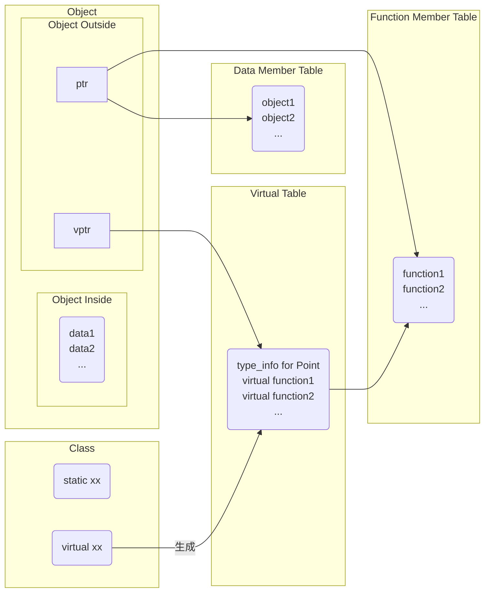
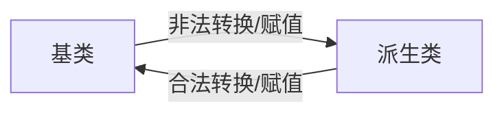

# C++对象

[TOC]

## 对象模型



- `type_info for Point` 定义类型，用来支持RTTI(Runtime Type Identification)；

### 对象空间

`class object`的内存大小计算公式为：$N + P + V$

- N `nonstatic data members`的内存大小；
- P  为内存对齐(alignment，将数值调整到某数的倍数；在32位计算机上，通常alignment为4bytes(32位)，以使`bus`的“运输量”达到最高效率)而填充的空间；
- V  为支持`virtual`而由内部产生的任何额外负担(`overhead`)

例：

```c++
class ZooAnimal {
public:
    ZooAnimal();
    virtual ~ZooAnimal();
    // ...
    virtual void rotate();

protected:
    int loc;
    String name;
};

class Bear : public ZooAnimal {
public:
    Bear();
    ~Bear();
    // ...
    void rotate();
    virtual void dance();
    // ...
protected:
    enum Dances { ... };

    Dances dances_known;
    int cell_block;
};

Bear b( "Yogi" );
Bear *pb = &b;
Bear &rb = *pb;
```


### 继承

派生类和基类的类型转换关系：



### 多态

c++以下列方法支持多态：

1. 经由一组隐式的转化操作。
2. 经由`virtual function`机制。
3. 经由`dynamic_cast`和`typeid`运算符


## 构造与析构

### 默认构造函数

1. 任何类如果没有定义默认的构造函数，编译器**不一定**会合成默认构造函数，只有当它认为你需要时，才给你合成；
2. 编译器合成出来的默认构造函数**不一定**会显式设置每一个数据成员的默认值；

以下为需要合成默认构造函数的情况：

1. 类成员中有成员是类对象，并且该成员的类含有默认构造函数；

   ```c++
   class Foo { public: Foo(), Foo( int ) ... };
   class Bar { public: Foo foo; char *str; };
   
   void foo_bar()
   {
       Bar bar; // Bar::foo必须在此处初始化
       if (str) {}
       ...
   }
   ```

2. 基类带有默认构造函数；

   ```c++
   TODO
   ```

3. 带有虚函数的类；

   ```c++
   class Widget {
   public:
       virtual void flip() = 0;
       ...
   };
   void flip( const Widget& widget ) { widget.flip(); }
   class Bell : public Widget{};
   class Whistle : public Widget{};
   void foo()
   {
       Bell b;
       Whistle w;
       flip( b );
       flip( w );
   }
   ```

4. 存在虚基类(有直接虚拟基类或继承链上有虚基类)；

   ```c++
   class X { public: int i; }
   class A : public virtual X { public: int j; };
   class B : public virtual X { public: double d; };
   class C : public A, public B { public: int k; };
   void foo( const A* pa ) { pa->i = 1024; }
   main()
   {
       foo( new A );
       foo( new C );
   }
   ```

### 复制构造函数


## 类型转换

### static_cast

静态转换，用于各种隐式转化；在编译期间处理，无运行时类型检查来保证安全性。

#### 用途

- 基类与子类的指针或引用的上行转换(安全)和下行转换(不安全)
- 基本数据类型之间的转换
- 空指针转换为目标类型的空指针
- 任何类型的表达式转化成void类型

### dynamic_cast

动态转换，只能用于含有虚函数的类；在运行期处理，带类型检查。

#### 用途

- 基类与子类的指针或引用的上行转换(安全)和下行转换(安全，带类型检查功能)
- 交叉转换(`B:A, D:A; dynamic_cast<D>(B)`)

### reinterpret_cast

#### 用途

- 指针与整数之间的转换

### const_cast

修改`const`和`volatile`属性

#### 用途

- 常量指针转非常量指针
- 常量引用转非常量引用


## 总结

1. new函数：先分配内存，再调用构造函数；delete函数：先调用析构函数，再释放内存；
2. 只有`nonstatic data member`是在object内部的，其他的都在外面
3. 每个类只要声明了`virtual function`就会存在一个虚表（多重继承和虚继承可能会有多个虚表），虚表保存了这个类`virtual function`的地址，这个类的每一个对象都有一个指向该虚表的指针(vptr)，vptr在`constructor`时被赋值。**每个声明virtual function的类都有一个虚表，它的每个实例都有一个指向虚表的指针**
4. 继承关系也可以被指定为`virtual`（共享），例：`class istream : virtual public ios { ... };`；在此情况下，基类不管在继承链中被派生多少次，它都永远只存在一个实例。
5. 虚拟继承会影响效率。
6. 一个`class object`的内存大小 = `nonstatic data member`的大小总和 + 由于`alignment`而填充的空间 + `virtual`产生的额外负担。
7. `cast`无法改变一个指针所指向的真正地址，只影响该地址的“解释方式”。
8. 用`base class object`给`drived class object`赋值，初始化或用类型转换将`base class`转化为`drived class`都是**非法的**；
9. 用`drived class object`给`base class object`赋值，初始化或用类型转换将`drived class object`转化为`base class object`是**可以的**；但是会发生切割。
10. `base class object pointer`**可以**指向`drived class object`；`drived class object point`**不可以**指向`base class object`，这是实现多态的基础条件。
11. 使用**类型转化**将`drived class object`转化为`base class object`**不会发生切割**；
12. explicit能够防止"单一参数的`constructor`"被当做一个`conversion`运算符。
13. 在编译器生成默认构造函数时，**不会**初始化类中的其他成员。
14. 一个`empty class object`的大小不为0，编译器会为其安插一个`char`，用来给这个类的任意两个`object`能够在内存中配置一个独一无二的地址；如果有`virtual function`，还会添加一个vptr来指向`virtual table`；
15. 一般越晚声明的`member`就在`class object`中越后（高）的位置，为了兼容c，`vptr`一般放在`class object`的后面。
16. `static member`放在`data segment`而**不在**`class object`中。
17. `virtual destructor`的作用是将基类的析构函数作为共享，防止内存泄漏。**不要把`virtual destructor`声明为`pure virtual destructor`。**
18. 在以下3种情况，编译器会调用复制构造函数：
    - 一个对象以值传递的方式传入函数体
    
    - 一个对象以值传递的方式从函数返回
    
    - 一个对象需要通过另一个对象进行初始化
    
19. `protected`继承会将`public`的member转化为`protected`

2. `private`继承会将public和protected的member转化为private
3. 面向对象的三大特征：多态(Polymorphism), 封装(Encapsulation)和继承(Inheritance)
4. 多态：同一操作作用于不同的对象，产生不同的结果。有以下分类：
   	- 编译时多态（重载）
   	- 运行时多态（虚函数）


## 参考

### 文献

TODO

### 外链

TODO
