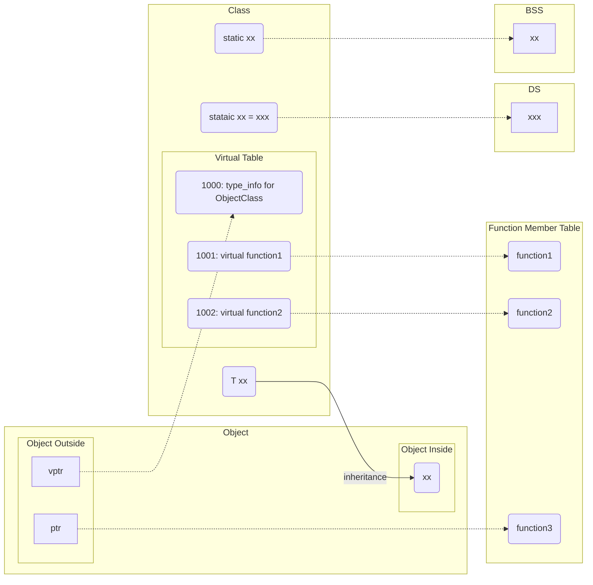
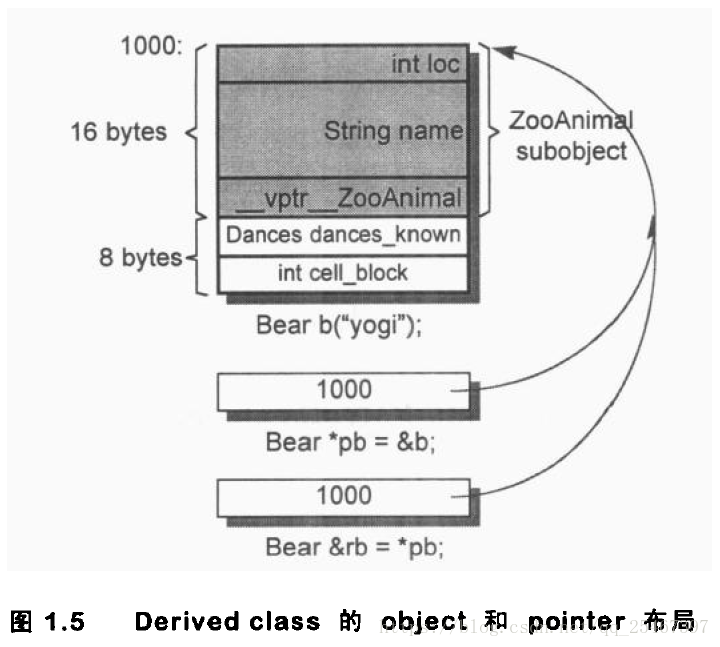
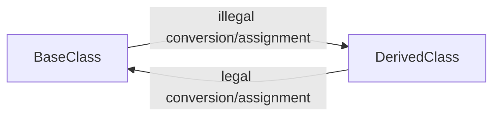
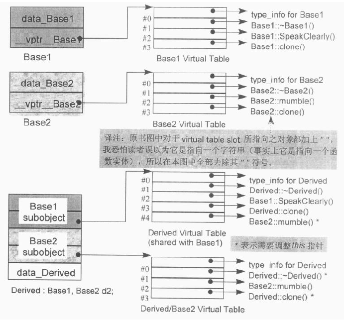
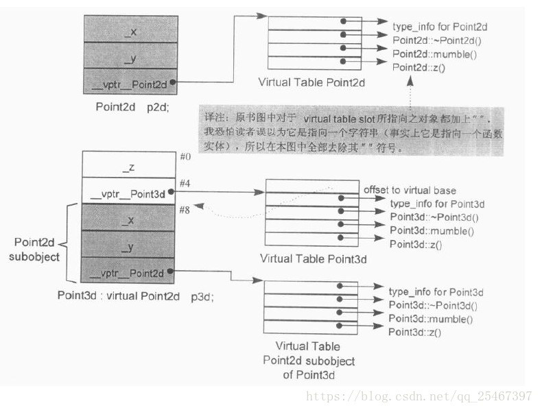

# C++ Objects

[TOC]


## Object Model


```mermaid
graph LR
	subgraph Class
		C1(static xx)
		C2(stataic xx = xxx)
		C3(T xx)
		
		subgraph Virtual Table
			V1(1000: type_info for ObjectClass)
			V2(1001: virtual function1)
			V3(1002: virtual function2)
		end
	end
	
	subgraph Object
		subgraph Object Inside
			O1(xx)
			C3 --inheritance--> O1
		end
		
		subgraph Object Outside
			ptr
			vptr -..->V1
		end
	end
	
	subgraph Function Member Table
		F1(function1)
		F2(function2)
		F3(function3)
		V2 -..-> F1
		V3 -..-> F2
		ptr -..-> F3
	end
	
	subgraph DS
			C2 -..-> xxx
	end
	
	subgraph BSS
			C1 -..-> xx
	end
```

- `type_info for ObjectClass` is the type of the class, which must be located at the first index of the virtual table to support RTTI (Runtime Type Identification);
- `class type` is a string or number representing the class type;
- `BSS` (Block Start By Symbol);
- `DS` (Data Segment);
- `Virtual Table` contains virtual function pointers;

### Data Member Layout

1. Static member variables are stored in `data segment`, independent of `class object`;

2. Non-static members are **stored directly in each class object**, so they can only be accessed through a class object (or `*this`);

3. To access a non-static member variable, the compiler adds the class object's address plus the data member's offset (offset), for example:

   ```c++
   &origin._y = 0.0;
   &origin + (&Point::_y - 1) // &Point::_y = offset + 1
   ```

4. C++ standard requires: members declared later have higher positions in the class object, not necessarily contiguous;

5. Taking the address of a `static member` yields **a pointer to that data type, not a pointer to a class member**;

6. Using virtual functions introduces the following overhead:

   - Introduces virtual table to store each declared virtual function, plus one slot at the beginning (to support RTTI);
   - Each class object introduces a vptr to provide runtime linking, allowing each class object to find the virtual function table;
   - Enhances constructor to initialize vptr pointing to the virtual table;
   - Enhances destructor to clear the pointer to the virtual table.

7. To maintain C language compatibility, vptr is usually placed at the end of the class object;

8. Each class has exactly one virtual table (vtable) containing addresses of virtual functions, and each object has a vptr (virtual table pointer) pointing to the vtable; for example: `ptr->normalize()` is internally converted to `(*ptr->vptr[1])(ptr)`;

9. The order of functions in the virtual function table follows the declaration order;

### Non-static Member Functions

The compiler internally converts member functions to non-member functions in the following process:

1. Add `this` pointer as the first parameter of the function

   If the member function is const, the type of `this` pointer is: `const className* const`; and access to each `nonstatic data member` is performed through the `this` pointer;

2. Function name mangling

   (name mangling), recoding the name according to the pattern `function name + parameter list + parameter types`, making it a unique name;

3. NRV optimization

   (Name Return Value), if there's a return value, add a reference type parameter to replace the return value;

Example:

```c++
Point setPoint(const Point& point);
```

Converted to:

```c++
void setPoint_crefpoint(const Point* this, const Point& point, Point& __result);
```

### Static Member Functions

Static members **do not have a `this` pointer**, with the following characteristics:

- Cannot directly access `nonstatic members` in the class;
- Cannot be declared as `const`, `volatile`, or `virtual`;
- Do not need to be called through a `class object`, can be called directly via `classname::` syntax.

If the address of a static member function is taken, the address type obtained is `"nonmember function pointer"` instead of `"class member function pointer"`;

Example, static function conversion:

```c++
static int Point3d::object_count() { return _object_count; }
```

Converted to:

```C++
int object_count__5Point3dSFV() { return _object_count_5Point3dSFV; }
```

Example, getting address of static member function:

```c++
&Point3d::object_count();
```

The type obtained is:

```c++
int(*)();
// not int(Point3d::*)();
```

### Virtual Member Functions

1. Taking the address of a virtual member function only yields an index value;

   ```c++
   class Point {
   public:
       virtual ~Point();
       float x();
       float y();
       virtual float z();
   }
   
   &Point::~Point(); // get index 1
   &Point::z();      // get index 2
   &Point::x();      // get function address in memory
   
   // call z() through function pointer
   float (Point::*pmf)() = &Point::z();
   Point* ptr;
   (ptr->*pmg)(); // internally converted to (*ptr->vptr[(int)pmf])(ptr);
   ```

### Inline Functions

**Inline functions are only a request to the compiler; the compiler itself decides whether to actually inline. Usually the compiler calculates the total number of operations like `assignments`, `function calls`, `virtual function calls` to decide whether to inline.**

Two general phases for handling `inline function`:

- Analyze the function definition to determine the function's `"instrinsic inline ability"`;
- Actual inline function expansion occurs at the call site.

Inline function expansion of formal arguments, example:

```c++
inline int min(int i, int j) { return i < j ? i : j; }
inline int bar() {
    int minval;
    int val1 = 1024;
    int val2 = 2048;
    minval = min(val1, val2);     // converted to minval = val1 < val2 ? val1 : val2;
    minval = min(1024, 2048);     // converted to minval = 1024;
    minval = min(foo(), bar()+1); // converted to int t1,t2; minval = (t1=foo()), (t2=bar()+1), t1<t2?t1:t2;
    return minval;
}
```

Inline function expansion of local variables, example:

```c++
inline int min(int i, int j) {
    int minval = i < j ? i : j;
    return minval;
}
inline int bar() {
    int minval;
    int val1 = 1024;
    int val2 = 2048;
    minval = min(val1, val2);     // converted to
                                  // int __min_lv_minval;
                                  // int minval = (__min_lv_minval = val1 < val2 ? val1 : val2), __min_lv_minval);
  
    return minval;
}
```

**If an inline function parameter has side effects or multiple calls, or the function has multiple local variables, this will produce temporary objects and result in extensive expanded code, causing program size to explode;** example:

```c++
int minval = min(val1, val2) + min(foo(), foo() + 1);
```

Expands to:

```c++
// temporary objects produced for local variables
int __min_lv_minval_00, __min_lv_minval_01;
// temporary variables produced for side effects
int t1, t2;
int minval = (__min_lv_minval_00 = val1 < val2 ? val1 : val2),
        __min_lv_minval_00)
        +
        ((__min_lv_minval_01=(t1=foo()), (t2=bar()+1),
        t1<t2?t1:t2),__min_lv_minval_00);
```

### Object Space Size

The memory size of a `class object` is calculated by the formula: $N + P + V$

- N: size of `nonstatic data members`;
- P: space filled due to memory alignment (adjusting values to multiples of certain numbers; on 32-bit computers, alignment is usually 4 bytes (32 bits) to maximize bus "transportation" efficiency);
- V: any additional overhead (`overhead`) produced internally to support `virtual`.

An empty class usually has a size of 1, because the compiler inserts a char to allow any two objects of the class to have unique addresses in memory.

Example:

```c++
class ZooAnimal {
public:
    ZooAnimal();
    virtual ~ZooAnimal();
    // ...
    virtual void rotate();

protected:
    int loc;
    String name;
};

class Bear : public ZooAnimal {
public:
    Bear();
    ~Bear();
    // ...
    void rotate();
    virtual void dance();
    // ...
protected:
    enum Dances { ... };

    Dances dances_known;
    int cell_block;
};

Bear b( "Yogi" );
Bear *pb = &b;
Bear &rb = *pb;
```




## Construction and Destruction

### new and delete Operators

1. **The process of the new operator is: first allocate memory, then call the constructor (built-in types are directly assigned). (If memory allocation fails, the memory still needs to be released.)**
2. **The process of the delete operator is: first call the destructor (built-in types do not have this step), then release memory.**

Example, new operation:

```c++
Point3d *origin = new Point3d;
```

Can be split into the following steps:

```c++
Point3d *origin;
if(origin = __new(sizeof(Point3d)))
    try {
        origin->Point3d::Point3d(origin);
    }
    catch(...) {
        __delete(origin)
        throw;
    }
}
```

Example, delete operation:

```c++
delete origin;
```

Can be split into the following steps:

```c++
if(origin != 0) {
    Point3d::~Point3d(origin);
    __delete(origin);
}
```

### Placement new

Placement Operator new is a predefined overloaded new operator with the following prototype:

```c++
void* operator new(size_t, void* p) { return p; }
```

Example:

```c++
Point2w* ptw2 = new(arena) Point2w;
```

Can be converted to:

```c++
Point2w* ptw2 = (Point2w*) arena;
ptw2->~Point2w();
if(ptw2 != 0) ptw2->Point2w::Point2w();
```

Generally, Placement Operator new does not support polymorphism; if the derived class is much larger than the base class, the derived class constructor will cause serious destruction;

### Default Constructor

1. Any class that does not define a default constructor, the compiler **does not necessarily** synthesize a default constructor; only when it deems you need one will it synthesize one for you;
2. The default constructor synthesized by the compiler **may not** explicitly assign default values to each data member;

The following are cases where a default constructor needs to be synthesized:

1. A class member that is a class object with a default constructor;

   ```c++
   class Foo { public: Foo(), Foo( int ) ... };
   class Bar { public: Foo foo; char *str; };
   void foo_bar()
   {
       Bar bar; // Bar::foo must be initialized here
       if (str) {}
       ...
   }
   ```
   
2. A base class with a default constructor;

   ```c++
   TODO
   ```

3. A class with virtual functions;

   ```c++
   class Widget {
   public:
       virtual void flip() = 0;
       ...
   };
   void flip( const Widget& widget ) { widget.flip(); }
   class Bell : public Widget{};
   class Whistle : public Widget{};
   void foo()
   {
       Bell b;
       Whistle w;
       flip( b );
       flip( w );
   }
   ```

4. Existence of virtual base class (has direct virtual base class or virtual base class in inheritance chain);

   ```c++
   class X { public: int i; }
   class A : public virtual X { public: int j; };
   class B : public virtual X { public: double d; };
   class C : public A, public B { public: int k; };
   void foo( const A* pa ) { pa->i = 1024; }
   main()
   {
       foo( new A );
       foo( new C );
   }
   ```

### Copy Constructor

The following cases will result in a default constructor:

1. Explicitly initialize an object;
2. When an object is passed as a parameter to a function;
3. When a function returns a non-reference class object;

If a class does not provide any copy constructor, the class internally uses `default memberwise initialization` to perform the copy construction;

The following cases do not exhibit `bitwise copy semantics`:

1. The class contains a member class object with a copy constructor;
2. Base class has a copy constructor;
3. The class has virtual functions;
4. Virtual base class exists (has direct virtual base class or virtual base class in inheritance chain).

### Default Constructor Parameters

If a constructor of a class has one or more default parameter values, for example:

```c++
class complex {
    complex(double = 0.0, double = 0.0);
}
```

Then when we write `complex array[10];`, the compiler ultimately needs to call:

```c++
vec_nex(&array, sizeof(complex), 10, &complex::complex, 0);
```

### Member Initialization List

The following cases must use a member initialization list (initialization list):

1. When initializing a reference member;
2. When initializing a const member;
3. When calling a base class constructor that has a set of parameters;
4. When calling a member class constructor that has a set of parameters.

**Note: The order of items in the list is determined by the declaration order of members in the class, not by the sorted order in the `initialization list`.**

### Memory Alignment

`#pragma pack(push)` TODO

`#pragma pack(pop)` TODO

TODO

### Inheritance

Type conversion relationship between derived and base classes:


```mermaid
graph LR
BaseClass   --illegal conversion/assignment--> DerivedClass
DerivedClass --legal conversion/assignment--> BaseClass
```

Example, memory layout of multiple inheritance:

```c++
class Base1 {
public:
    Base1();
    virtual ~Base1();
    virtual void speakClearly();
    virtual Base1 *clone() const;
protected:
    float data_Base1;
};

class Base2 {
public:
    Base2();
    virtual ~Base2();
    virtual void mumble();
    virtual Base2 *clone() const;
protected:
    float data_Base2;
};

class Derived : public Base1, public Base2 {
public:
    Derived();
    virtual ~Derived();
    virtual Derived *clone() const;
protected:
    float data_Derived;
};
```



Example, memory layout of virtual inheritance:

```c++
class Point2d {
public:
    Point2d(float x = 0.0, float y = 0.0);
    virtual ~Point2d();
    virtual void mumble();
    virtual float z();
protected:
    float _x, _y;
};

class Point3d : public virtual Point2d {
public:
    Point3d(float x = 0.0, float y = 0.0, float z = 0.0);
    ~Point3d();
    float z();
protected:
    float _z;
}
```



### Polymorphism

C++ supports polymorphism through the following mechanisms:

1. Through a set of implicit conversion operations;
2. Through the virtual function mechanism;
3. Through dynamic_cast and typeid operators.


## Type Conversion

### Type Casting Functions

| Type Casting Function | Description                                                  | Usage                                                        |
| -------------------- | ------------------------------------------------------------ | ------------------------------------------------------------ |
| static_cast          | Static conversion, used for various implicit conversions; handled at compile time with no runtime type checking for safety | + Upcasting (safe) and downcasting (unsafe) of base and derived class pointers or references<br>+ Conversion between basic data types<br>+ Conversion of any pointer to null pointer of target type<br>+ Conversion of any expression type to void type |
| dynamic_cast         | Dynamic conversion, only usable for classes with virtual functions; handled at runtime with type checking | + Upcasting (safe) and downcasting (safe with type checking) of base and derived class pointers or references<br>+ Cross conversion (`B:A, D:A; dynamic_cast<D>(B)`) |
| reinterpret_cast     |                                                              | + Conversion between pointers and integers                   |
| const_cast           | Modify `const` and `volatile` attributes                    | + Conversion of const pointer to non-const pointer<br>+ Conversion of const reference to non-const reference |

### Function Conversion Efficiency

1. `nonmember`, `static member`, and `nonstatic member` functions are converted to the same form, so the efficiency of all three is exactly the same;
2. Inline functions are greatly optimized for efficiency.


## Templates

TODO


## Others

### NRV Optimization

`NRV (Named Return Value) optimization` converts pass-by-value return functions to pass-by-reference return functions;

Example:

```c++
X bar()
{
    X xx;
    // ...process xx
    return xx;
}
```

Converted to:

```c++
void
bar( X &__result )
{
    // default constructor is called
    // c++ pseudo-code
    __result.X::X();
    // ...directly process __result
    return;
}
```

### Temporary Objects

The destruction of temporary objects occurs at the **last step in the process of evaluating a full-expression**; however, the following cases are exceptions:

1. Temporary objects with expression evaluation results should be saved until the object's initialization is complete;

   ```c++
   string proNameVersion = !verbose ? 0 : proName + progVersion;
   // the temporary object produced should be destroyed after the ?: expression evaluation, but proNameVersion's initialization needs the temporary object, so it should be preserved until the initialization completes
   ```

2. If **a temporary object binds to a reference**, the object will persist until the lifetime of the reference being initialized ends;

### RTTI

TODO

### CRTP

TODO


## Summary

1. new function: allocate memory first, then call constructor; delete function: call destructor first, then release memory;
2. Only `nonstatic data member` is inside the object, everything else is outside;
3. Any class that declares `virtual function` will have a virtual table (multiple inheritance and virtual inheritance may have multiple virtual tables), and the virtual table stores the addresses of `virtual function` of the class. Each object of this class has a pointer (vptr) pointing to the virtual table. The vptr is assigned during `constructor`. **Each class that declares virtual functions has a virtual table, and each of its instances has a pointer pointing to the virtual table.**
4. Inheritance relationships can also be specified as `virtual` (shared), e.g.: `class istream : virtual public ios { ... };`; in this case, no matter how many times the base class is derived in the inheritance chain, it always exists as only one instance.
5. Virtual inheritance affects efficiency.
6. The memory size of a `class object` = total size of `nonstatic data member` + space filled due to `alignment` + overhead produced by `virtual`.
7. `cast` cannot change the actual address that a pointer points to, it only affects the "interpretation method" of that address.
8. Assigning a `base class object` to a `derived class object`, initializing it, or using type conversion to convert `base class` to `derived class` is **illegal**;
9. Assigning a `derived class object` to a `base class object`, initializing it, or using type conversion to convert `derived class object` to `base class object` is **allowed**; but slicing occurs.
10. A `base class object pointer` **can** point to a `derived class object`; a `derived class object pointer` **cannot** point to a `base class object`. This is the fundamental condition for implementing polymorphism.
11. Using **type conversion** to convert `derived class object` to `base class object` **will not cause slicing**;
12. explicit can prevent a "single-parameter constructor" from being treated as a `conversion` operator.
13. When the compiler generates a default constructor, it **will not** initialize other members in the class.
14. An `empty class object` has a non-zero size; the compiler inserts a `char` to allow any two objects of the class to have unique addresses in memory; if there are `virtual function`, a vptr is also added to point to the `virtual table`;
15. Generally, members declared later are in higher positions in the `class object`, and for C compatibility, `vptr` is usually placed at the end of the `class object`.
16. `static member` is placed in the `data segment` and **not in** the `class object`.
17. The role of `virtual destructor` is to make the base class destructor shared, preventing memory leaks. **Do not declare `virtual destructor` as `pure virtual destructor`.**
18. In the following 3 cases, the compiler will call the copy constructor:
    - An object is passed by value into a function body

    - An object is returned by value from a function

    - An object needs to be initialized through another object
19. `protected` inheritance converts `public` members to `protected`
20. `private` inheritance converts public and protected members to `private`
21. The three major characteristics of object-oriented programming: polymorphism (Polymorphism), encapsulation (Encapsulation), and inheritance (Inheritance)
22. Polymorphism: the same operation acts on different objects, producing different results. It has the following classifications:
    - Compile-time polymorphism (overloading)
    - Runtime polymorphism (virtual functions)


## References

- [`#pragma pack(push) and #pragma pack(pop) and #pragma pack()`](https://blog.csdn.net/myyllove/article/details/84560893/)
- [First Exploration of C++ CRTP (Curiously Recurring Template Pattern)](https://blog.csdn.net/u011436427/article/details/125597908)
