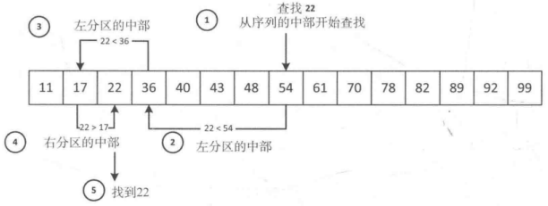
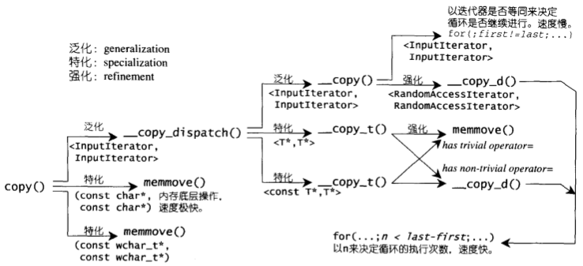
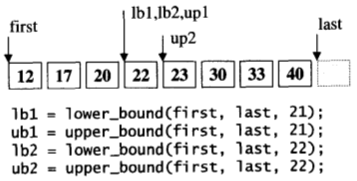
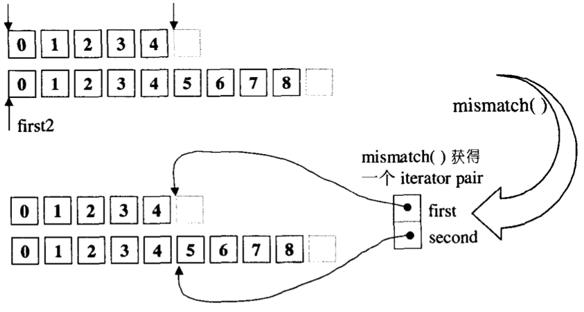
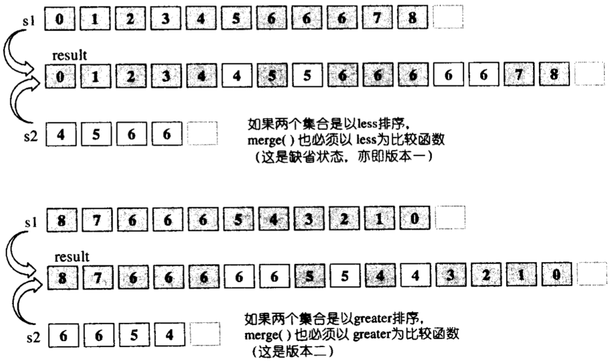
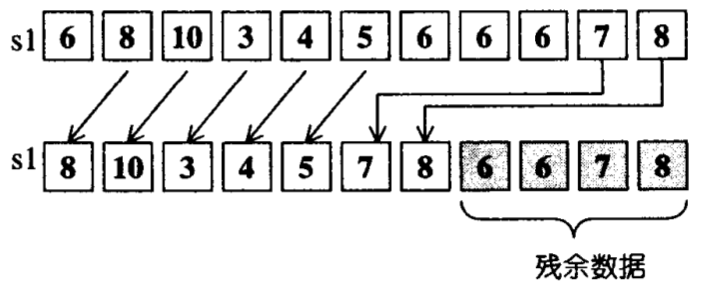
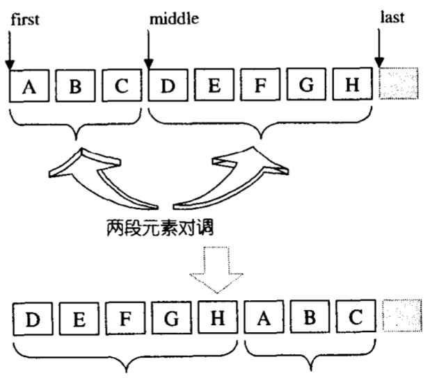
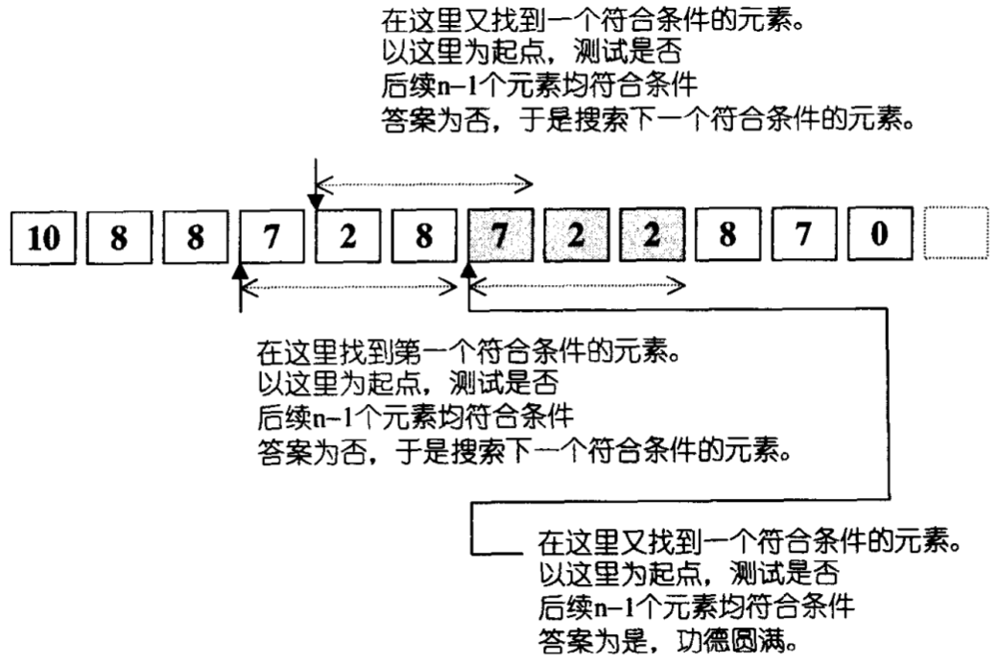
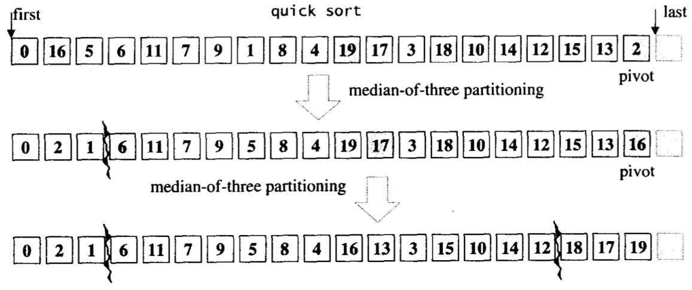
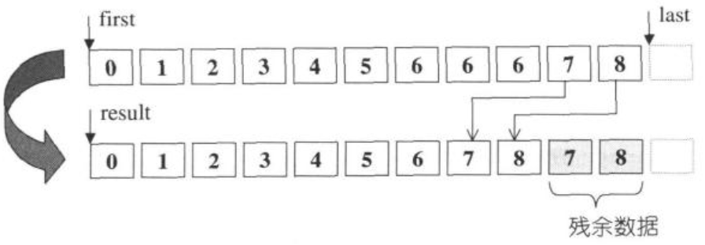

| 算法                     | 头文件 | 复杂度 | 描述/示意图/代码                                             |
| :----------------------- | ------ | ------ | ------------------------------------------------------------ |
| accumulate               |        |        | 元素累计。                                                   |
| adjacent_difference      |        |        | 计算相邻元素的差。                                           |
| adjacent_find            |        |        | 查找相邻而重复（或符合某条件）的元素。                       |
| binary_search            |        |        | 在已排序的范围内二分查找元素。  |
| copy                     |        |        | 将输入区间`[first,last)`内的元素复制到输出区间`[result,result+(last-first))`内。  |
| copy_backward            |        |        | 逆向复制                                                     |
| copy_n                   |        |        | 复制n个元素                                                  |
| count                    |        |        | 计数                                                         |
| count_if                 |        |        | 在特定条件下计数                                             |
| equal                    |        |        | 判断两个区间相等与否                                         |
| equal_range              |        |        | 试图在有序区间中寻找某值(返回一个上下限区间)                 |
| fill                     |        |        | 填充元素                                                     |
| fill_n                   |        |        | 填充元素，n次                                                |
| find                     |        |        | 循序查找                                                     |
| find_if                  |        |        | 循序查找符合特定条件者                                       |
| find_end                 |        |        | 查找某个子序列的最后一次出现点                               |
| find_first_of            |        |        | 查找某些元素的首次出现点                                     |
| for_each                 |        |        | 遍历并操作指定范围内的元素。  |
| generate                 |        |        | 以特定操作之运算结果填充特定区间内的元素                     |
| generate_n               |        |        | 以特定操作之运算结果填充特n个元素内容                        |
| includes                 |        |        | 是否涵盖于某序列之中                                         |
| inner_product            |        |        | 计算内积                                                     |
| inplace_merge            |        |        | 合并并就地替换(覆写上去)                                     |
| iota                     |        |        | 在某区间填入某指定值的递增序列                               |
| is_heap                  |        |        | 判断某区间是否为一个heap                                     |
| is_sorted                |        |        | 判断某区间是否已排序                                         |
| iter_swap                |        |        | 元素互换                                                     |
| lexicographical_compare  |        |        | 以字典顺序进行比较                                           |
| lower_bound              |        |        | 找到指定范围内的第一个不小于指定值的元素。  |
| make_heap                |        |        |                                                              |
| max                      |        |        | 取两个对象中的较大值                                         |
| max_element              |        |        | 取最大值所在位置                                             |
| merge                    |        |        | 合并两个序列                                                 |
| min                      |        |        | 取两个对象中的较小值                                         |
| min_element              |        |        | 取最小值所在位置                                             |
| mismatch                 |        |        | 平行比较两个序列，指出两者之间的第一个不匹配点，返回一对迭代器，分别指向两个序列中的不匹配点。  |
| merge                    |        |        | 将两个**有序**的集合合并起来，放置于另一段空间。  |
| next_permutation         |        |        | 获得的下一个排列组合                                         |
| nth_element              |        |        | 重新安排序列中的第n个元素的左右两端                          |
| partial_sort             |        |        | 局部排序                                                     |
| partial_sort_copy        |        |        | 局部排序并复制到他处                                         |
| partial_sum              |        |        | 局部求和                                                     |
| partition                |        |        | 分割                                                         |
| prev_permutation         |        |        | 获得前一个排列组合                                           |
| pop_heap                 |        |        |                                                              |
| power                    |        |        | 幂次方                                                       |
| push_heap                |        |        |                                                              |
| random_shuffle           |        |        | 将指定范围内的元素次序随机重排                               |
| random_sample            |        |        |                                                              |
| random_sample_n          |        |        |                                                              |
| remove                   |        |        | 移除指定范围内所有与value相等的元素  |
| remove_copy              |        |        |                                                              |
| remove_if                |        |        |                                                              |
| remove_copy_if           |        |        |                                                              |
| replace                  |        |        | 将指定范围内的所有old_value都以new_value取代                 |
| replace_copy             |        |        |                                                              |
| replace_copy_if          |        |        |                                                              |
| replace_if               |        |        |                                                              |
| reverse                  |        |        | 将序列中的元素在原容器中翻转                                 |
| reverse_copy             |        |        |                                                              |
| rotate                   |        |        | 将`[first,middle)`内的元素和`[middle,last)`内的元素互换。  |
| rotate_copy              |        |        |                                                              |
| search                   |        |        | 在序列一中查找与序列二完全匹配的子序列                       |
| search_n                 |        |        | 在指定的序列区间中查找连续n个符合条件的元素形成的子序列，返回指向该子序列起始处的迭代器。  |
| set_difference           |        |        |                                                              |
| set_intersection         |        |        |                                                              |
| set_symmetric_difference |        |        |                                                              |
| set_union                |        |        |                                                              |
| sort                     |        |        | 排序； - 数据量大时采用Quick Sort，分段式递归排序； - 数据量小于某个门槛时，改用Insertion Sort； - 如果递归层次过深，还会改用Heap Sort。 |
| sort_heap                |        |        |                                                              |
| stable_partition         |        |        |                                                              |
| stable_sort              |        |        |                                                              |
| swap                     |        |        |                                                              |
| swap_range               |        |        |                                                              |
| transform                |        |        |                                                              |
| unique                   |        |        | 移除重复的元素     |
| unique_copy              |        |        |                                                              |
| upper_bound              |        |        | 二分查找(binary search)法的一个版本，“查找可插入value的最后一个合适位置” |
| make_heap                |        |        |                                                              |
| pop_heap                 |        |        |                                                              |
| push_heap                |        |        |                                                              |
| sort_heap                |        |        |                                                              |

---