English | [中文版](stl_zh.md)

# STL

[TOC]


## Smart pointers

Smart pointers provide RAII ownership and reduce manual delete errors.

- `std::unique_ptr<T>`

  exclusive ownership, lightweight, movable but not copyable. Use for single ownership and custom deleters when needed.

- `std::shared_ptr<T>`

  reference‑counted shared ownership. Use `std::make_shared<T>(...)` to allocate a control block and object in one allocation (more efficient). Supports custom deleters and aliasing constructors (create a shared_ptr that shares ownership but points to a different object).

- `std::weak_ptr<T>`

  non‑owning observer of an object managed by shared_ptr. Use weak_ptr::lock() to obtain a temporary shared_ptr, and `expired()/use_count()` to check state.

Example (shared/weak):

```c++
#include <memory>
#include <string>
int main() {
	auto sp = std::make_shared<std::string>("hello");
	std::weak_ptr<std::string> wp = sp;
	if (auto locked = wp.lock()) // safe access
		; // *locked
}
```

### unique_ptr

`std::unique_ptr` was introduced in C++11 as a safe replacement for `std::auto_ptr`.

Key Characteristics:

- Exclusive ownership
- Cannot be copied
- Ownership can be transferred using `std::move()`
- Lightweight and efficient
- Supports custom deleters and arrays

Common Member Functions:

| Member        | Description                                                  |
| ------------- | ------------------------------------------------------------ |
| operator=     | assigns the unique_ptr                                       |
| operator*/->  | dereferences pointer to the managed object                   |
| operator[]    | provides indexed access to the managed array                 |
| operator bool | checks if there is an associated managed object              |
| release       | returns a pointer to the managed object and releases the ownership |
| reset         | replaces the managed object                                  |
| swap          | swaps the managed objects                                    |
| get           | returns a pointer to the managed object                      |
| get_deleter   | returns the deleter that is used for destruction of the managed object |

Example:

```c++
#include <iostream>
#include <memory>
class A{};
int main()
{
    std::unique_ptr<A> p1 = std::make_unique<A>();
    std::unique_ptr<A> p2 = std::move(p1);
}
```

Example:

```c++
#include <iostream>
#include <memory>

std::unique_ptr<std::string> create_string()
{
    return std::make_unique<std::string>("Hello, World!"); // Create a unique_ptr to a string
}
void use_string(std::unique_ptr<std::string> str_ptr)
{
    std::cout << "Using string value: " << *str_ptr << std::endl; // Use the string
}
int main(void)
{
    auto str = create_string();
    use_string(std::move(str));
    return 0;
}
```

### shared_ptr

`std::shared_ptr` wraps a dynamically allocated object and implements reference-counted ownership. It can be copied and assigned freely; when the reference count reaches zero, the managed object is destroyed.

Constructors and behaviors:

- `shared_ptr()`: constructs an empty `shared_ptr` that holds a null pointer.

- `shared_ptr(Y* p)`: takes ownership of pointer `p` (of type `Y*`) and sets the reference count to 1. `Y` must be convertible to the managed `T`.

  ```c++
  shared_ptr<int> sp(new int(10));
  ```

- `shared_ptr(shared_ptr const& r)`: copy constructor — obtains shared ownership from another `shared_ptr`, incrementing the reference count.

- `operator=`: assignment behaves like the copy constructor.

  ```c++
  shared_ptr<int> sp(new int(10));
  shared_ptr<int> sp2 = sp;
  ```

- `shared_ptr(Y* p, D d)`: like `shared_ptr(Y* p)` but uses a custom deleter `d` instead of `delete`.

- aliasing constructor: constructs a `shared_ptr<U>` that shares ownership (the control block) with another `shared_ptr` but points to a different address (useful for sub-objects).

Common member functions:

| Member | Description |
|---|---|
| get | return the stored pointer |
| reset | replace the managed object |
| swap | swap the managed objects |
| owner_before | compare ownership for ordering |
| operator= | assignment |
| operator* / operator-> | dereference |
| use_count | number of shared owners |
| unique | whether this is sole owner |

Example:

```c++
#include <memory>
#include <string>

int main()
{
    std::shared_ptr<std::string> sp1;
    std::shared_ptr<std::string> sp2{NULL};
    std::shared_ptr<std::string> sp3{new std::string};
    std::shared_ptr<std::string> sp4{new std::string, [](auto ptr){ delete ptr; }};
    std::shared_ptr<std::string> sp5{sp3};
    std::shared_ptr<std::string> sp6{sp3, new std::string};
    std::shared_ptr<std::string> sp7{std::move(sp3), new std::string};
    std::shared_ptr<std::string> sp8{std::move(new std::string)};
    std::shared_ptr<std::string> sp9{std::move(sp6)};
    
    sp1 = std::make_shared<std::string>("abc");

    std::string *ret_get = sp1.get();        // *ret_get: abc

    sp1.reset();                             // *sp1: 
    sp1.reset(new std::string("def"), 
              [](auto p){ delete p; });      // *sp1: def

    sp1.swap(sp3);                           // *sp1: , *sp3: def

    bool ret_ob = sp1.owner_before(sp3);     // ret_ob: true
    ret_ob = sp1.owner_before(std::weak_ptr<std::string>(
        std::make_shared<std::string>()));   // ret_ob: true

    std::shared_ptr<std::string> sp10 = sp3; // *sp10: def

    std::string ret_op1 = *sp3;             // ret_op1: def
    std::string ret_op2 = sp3->c_str();     // ret_op2: def

    long ret_uc = sp1.use_count();          // ret_uc: 4

    bool ret_u = sp1.unique();              // ret_u: false
}
```

### weak_ptr

`std::weak_ptr` is a non-owning observer of an object managed by `shared_ptr`.

Member functions:

| Member | Description |
|---|---|
| expired | check whether the referenced object is already deleted |
| lock | obtain a `shared_ptr` that shares ownership (returns empty if expired) |
| owner_before | ordering among owners |
| reset | release reference |
| swap | swap references |
| use_count | number of owning `shared_ptr`s |

Example1:

```c++
#include <memory>
#include <string>

int main()
{
    std::weak_ptr<std::string> wp1{std::make_shared<std::string>("")};
    std::weak_ptr<std::string> wp2;
    std::weak_ptr<std::string> wp3{wp1};
    std::weak_ptr<std::string> wp4(std::move(wp3));

    bool ret_exp = wp1.expired();                     // ret_exp: true

    std::shared_ptr<std::string> ret_lk = wp1.lock(); // ret_lk: 0

    bool ret_ob = wp1.owner_before(wp2);              // ret_ob: false
    ret_ob = wp1.owner_before(wp3.lock());            // ret_ob: false

    wp1.reset();

    wp1.swap(wp3);

    long ret_uc = wp1.use_count();                    // ret_uc: 0
}
```

Example2:

```c++
#include <iostream>
#include <memory>

class B;
class A
{
public:
    std::shared_ptr<B> b_ptr; // A holds a shared pointer to B
    ~A() { std::cout << "A destroyed\n" << std::endl; }
};
class B
{
public:
    std::weak_ptr<A> a_ptr; // B holds a weak pointer to A
    ~B() { std::cout << "B destroyed\n" << std::endl; }
    void check()
    {
        if (std::shared_ptr<A> a = a_ptr.lock())
            std::cout << "A is still alive\n" << std::endl;
        else
            std::cout << "A has been destroyed\n" << std::endl;
    }
};

int main()
{
    auto a = std::make_shared<A>(); // Create an instance of A
    auto b = std::make_shared<B>(); // Create an instance of B
    a->b_ptr = b; // A holds a shared pointer to B
    b->a_ptr = a; // B holds a weak pointer to A
    b->check(); // Check if A is still alive
    return 0;
}
```

### unique_ptr vs shared_ptr vs weak_ptr

| Aspect              | `unique_ptr`               | `shared_ptr`                   | `weak_ptr`            |
| :------------------ | :------------------------- | :----------------------------- | :-------------------- |
| **Ownership**       | Exclusive                  | Shared (reference counted)     | Non-owning observer   |
| **Copyable**        | ❌ No (move-only)           | ✅ Yes                          | ✅ Yes                 |
| **Moveable**        | ✅ Yes                      | ✅ Yes                          | ✅ Yes                 |
| **Reference Count** | No                         | Yes (control block)            | No (observes count)   |
| **Memory Overhead** | Minimal (raw pointer size) | 2x raw pointer + control block | Same as `shared_ptr`  |
| **Thread Safety**   | N/A                        | Count operations are atomic    | Lock is atomic        |
| **Use Case**        | Single ownership           | Shared ownership               | Break cycles, caching |

---


## Containers

General rule: prefer the container whose complexity and operations match your usage pattern.

- vector: dynamic array. Random access $O(1)$. Push_back amortized $O(1)$. Insert/erase in middle $O(n)$. Good for contiguous storage and CPU cache locality.
- array (std::array): fixed-size array wrapper (size part of type). All operations $O(1)$.
- string: specialized sequence for text. Use std::string for text data and std::string_view for non-owning views.
- deque: double-ended queue; fast push/pop at both ends, but not contiguous.
- list (std::list): doubly-linked list. Splice, insert, erase at known positions are $O(1)$; random access is $O(n)$. Use when many insert/erase operations in the middle and node stability is required.
- forward_list: singly linked list (lower memory, weaker API).

Associative containers (ordered, implemented with trees):
- set / map: ordered containers, lookup/insert/erase O(log n). Iteration in order.

Unordered containers (hash‑based):
- unordered_set / unordered_map: average O(1) lookup/insert; worst-case O(n) depending on hash and collisions. Reserve() to avoid rehashing.

Container adaptors:
- stack, queue, priority_queue — provide restricted interfaces built on other containers.

### string

TODO

### array

```c++
// GCC-4.4 /libstdc++-v3/include/tr1_impl/array
template<typename _Tp, std::size_t _Nm>
    struct array
    {
      typedef _Tp 	    			      value_type;
      // Support for zero-sized arrays mandatory.
      value_type _M_instance[_Nm ? _Nm : 1]; // array数组
    };
```

| Function | Complexity | Description |
|---|---:|---|
| begin | $O(1)$ | return random-access iterator to first element; equals end() if empty. 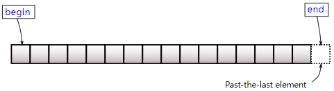 |
| end | $O(1)$ | iterator past the last element. 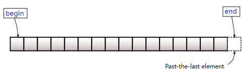 |
| rbegin | $O(1)$ | reverse iterator to first element from the back. 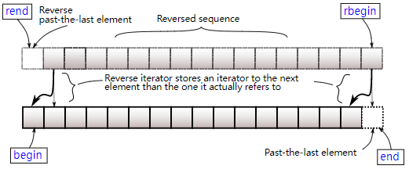 |
| rend | $O(1)$ | reverse iterator past end. 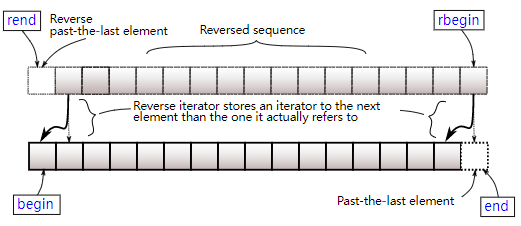 |
| cbegin | $O(1)$ | const begin |
| cend | $O(1)$ | const end |
| crbegin | $O(1)$ | const rbegin |
| crend | $O(1)$ | const rend |
| operator= | $O(1)$ | copy from same-type container or initializer list |
| size | $O(1)$ | number of elements |
| max_size | $O(1)$ | same as size() for fixed-size array |
| empty | $O(1)$ | empty check |
| front | $O(1)$ | reference to first element (UB if empty) |
| back | $O(1)$ | reference to last element (UB if empty) |
| operator[] | $O(1)$ | unchecked element access |
| at | $O(1)$ | checked element access |
| swap | $O(n)$ | swap elements with another equal-size array |
| data | $O(1)$ | pointer to underlying C array |

```c++
#include <iostream>
#include <array>
#include <experimental/array>

int main()
{
	std::array<int, 10> a1{1, 2, 3, 4, 5, 6, 7, 8, 9, 10};
    std::array<int, 10> a2; // 创建具有10个0的array
	std::array<int, 5>  a3 = std::experimental::make_array(1, 2, 3, 4, 5);

	std::array<int, 10>::iterator ret1 = a1.begin();   // *ret1: 1

	std::array<int, 10>::iterator ret2 = a1.end();     // *ret2: 未知变量

	std::array<int, 10>::reverse_iterator ret3 =       // *ret3: 10
        a1.rbegin();

	std::array<int, 10>::reverse_iterator ret4 =       // *ret4: 未知变量
        a1.rend();

	std::array<int, 10>::const_iterator ret5 =         // *ret5: 1
        a1.cbegin();

	std::array<int, 10>::const_iterator ret6 =         // *ret6: 未知变量
        a1.cend();

	std::array<int, 10>::const_reverse_iterator ret7 = // *ret7: 10
        a1.crbegin();

	std::array<int, 10>::const_reverse_iterator ret8 = // *ret8: 未知变量
        a1.crend();

	a2 = a1;                      // a2: [1,2,3,4,5,6,7,8,9,10]

	size_t ret9 = a1.size();      // ret9: 10

	size_t ret10 = a1.max_size(); // ret10: 10

	bool ret11 = a1.empty();      // ret11: false

	int ret12 = a1.front();       // ret12: 1

	int ret13 = a1.back();        // ret13: 10

	a1[0] = 2;                    // a1: [2,2,3,4,5,6,7,8,9,10]

	a1.at(1) = 3;                 // a1: [2,3,3,4,5,6,7,8,9,10]

	a1.swap(a2);                  // a1: [1,2,3,4,5,6,7,8,9,10]

	int* ret14 = a1.data();       // ret14: [1,2,3,4,5,6,7,8,9,10]
}
```

### vector

```c++
template <class _Tp, class _Alloc>
class _Vector_base {
...
protected:
  _Tp* _M_start;          // 头指针
  _Tp* _M_finish;         // 尾指针
  _Tp* _M_end_of_storage; // 分配的存储空间的尾部
}
```

Common member functions and complexities:

| Member | Complexity | Notes |
|---|---:|---|
| assign | $O(n)$ | replace elements |
| at | $O(1)$ | checked access |
| back | $O(1)$ | reference to last element |
| begin | $O(1)$ | iterator to first element 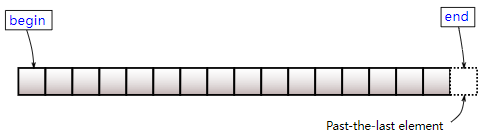 |
| capacity | $O(1)$ | current capacity |
| clear | $O(n)$ | erase all elements |
| emplace | $O(n)$ | construct and insert before position |
| emplace_back | amortized $O(1)$ | construct at end |
| empty | $O(1)$ | is empty |
| end | $O(1)$ | past-the-end iterator 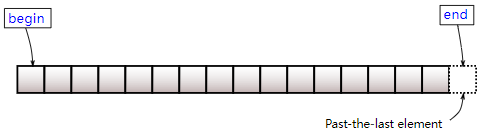 |
| erase | $O(n)$ | erase range (shifts elements) 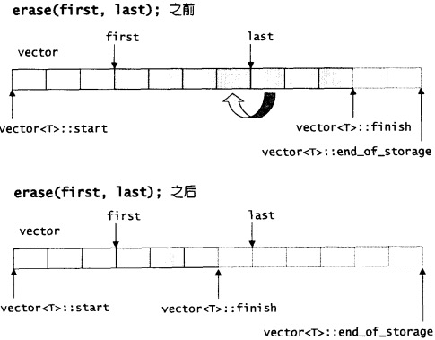 |
| front | $O(1)$ | first element |
| get_allocator | $O(1)$ | allocator |
| insert | $O(n)$ | Element insertion:<br/>+ `Spare capacity > number of new elements AND number of elements after insertion point > number of new elements`<br/>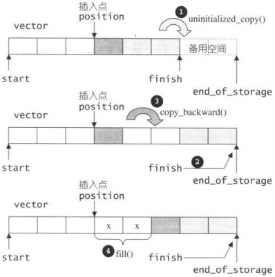<br/>+ `Spare capacity > number of new elements AND number of elements after insertion point ≤ number of new elements`<br/>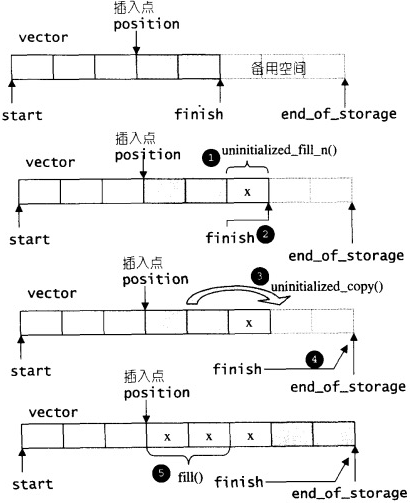<br/>+ `Spare capacity < number of new elements`<br/>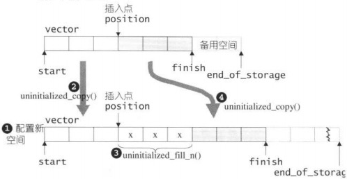 |
| max_size | $O(1)$ | max possible size |
| pop_back | $O(1)$ | remove last element |
| push_back | amortized $O(1)$ | append |
| rbegin | $O(1)$ | Returns a reverse iterator to the first element of the reversed `vector`. It corresponds to the last element of the non-reversed `vector`. If the `vector` is empty, the returned iterator is equal to `rend()`. <br/>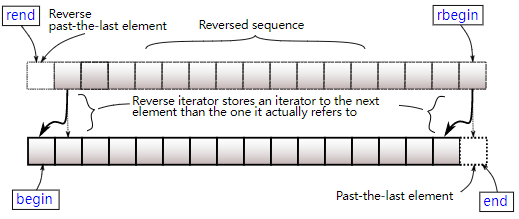 |
| rend | $O(1)$ | Returns a reverse iterator to the element following the last element of the reversed `vector`. It corresponds to the element preceding the first element of the non-reversed `vector`. This element acts as a placeholder; attempting to access it results in undefined behavior. <br/>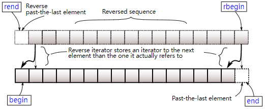 |
| reserve | $O(n)$ | Increases the container's capacity without changing the current number of elements. <br/>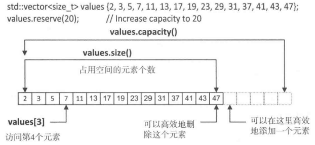 |
| resize | $O(n)$ | change size |
| shrink_to_fit | $O(n)$ | request to reduce capacity |
| size | $O(1)$ | number of elements |
| swap | $O(1)$ | swap internal pointers |

Example:

```c++
#include <iostream>
#include <vector>

int main()
{
	std::vector<int> v1(5);          // 初始化5个元素，其值为默认值
	std::vector<int> v2{ 5 };        // 初始化1个元素，其值为5
	std::vector<int> v3(5, 1);       // 初始化5个元素，其值都为1
	std::vector<int> v4{       
        std::begin(v3), 
        std::end(v3) 
	};                               // 复制一个容器的片段来初始化
	std::vector<int> v5(
		v1.get_allocator());         // 构造拥有给定分配器 alloc 的空容器
	std::vector<int> v6{
		std::begin(v3),
		std::end(v3),
		v3.get_allocator(),
	};                               // 复制一个容器的片段并提供分配器来初始化
	std::vector<int> v7{       
        std::make_move_iterator(std::begin(v4)),
        std::make_move_iterator(std::end(v4)) 
	};                               // 移动一个容器的片段来初始化
	std::vector<int> v8(v5);         // 用另一个容器来初始化
	std::vector<int> v9(v5, 
	    v6.get_allocator());         // 用另一个容器和分配器来初始化
	std::vector<int> v10({1, 2, 3}); // 用初始化列表来初始化
	std::vector<int> v11({1, 2, 3}, 
	    v6.get_allocator());         // 用初始化列表和分配器来初始化

	v1.assign({1, 2, 3, 4, 5});          // v1: [1,2,3,4,5]

	int ret1 = v1.at(0);                 // ret1: 1

	int ret2 = v1.back();                // ret2: 5

	std::vector<int>::iterator ret3 = 
        v1.begin();                      // *ret3: 1

	size_t ret4 = v1.capacity();         // ret4: 5

	v1.clear();                          // v1: []

	std::vector<int>::iterator ret5 = 
        v1.emplace(v1.end(), 11);        // v1: [11], *ret5: 11

	v1.emplace_back(12);                 // v1: [11,12]

	bool ret6 = v1.empty();              // ret6: false

	std::vector<int>::iterator ret7 = 
        v1.end();                        // *ret7: 3

	std::vector<int>::iterator ret8 =   // v1: [12], *ret8: 12
        v1.erase(v1.begin(), v1.begin() + 1);

	int ret9 = v1.front();              // ret9: 12

	std::vector<int>::allocator_type ret10 = 
        v1.get_allocator(); // ret10.max_size(): 4611686018427387903

	std::vector<int>::iterator ret11 = 
        v1.insert(++v1.begin(), 8);     // v1: [12,8], *ret11: 8
	std::vector<int>::iterator ret12 = 
        v1.insert(++v1.begin(), v2.begin(), 
                  v2.end());           // v1: [12,5,8], *ret12: 5
	std::vector<int>::iterator ret13 = // v1: [12,5,10,10,8], *ret13: 10
        v1.insert(v1.cend() - 1, 2, 10);
	std::vector<int>::iterator ret14 = // v1: [12,5,10,10,8,1,2,3], *ret14: 1
        v1.insert(v1.end(), { 1, 2, 3 });

	size_t ret15 = v1.max_size();      // ret15: 4611686018427387903

	v1.pop_back();                     // v1: [12,5,10,10,8,1,2]

	v1.push_back(1);                   // v1: [12,5,10,10,8,1,2,1]

	std::vector<int>::reverse_iterator ret16 = 
        v1.rbegin();                   // *ret16: 1

	std::vector<int>::reverse_iterator ret17 = 
        v1.rend();                     // *ret17: 0

	v1.reserve(10);                   // v1: [12,5,10,10,8,1,2,1]

	v1.resize(3);                     // v1: [12,5,10]

	v1.shrink_to_fit();               // 调用前, v1.capacity(): 10
                                      // 调用后: v1.capacity(): 3

	size_t ret18 = v1.size();         // ret18: 3

	v1.swap(v2);                      // v1: [5], v2:[12,5,10]
}
```

### list

```c++
// 双向链表节点
struct _List_node_base {
  _List_node_base* _M_next; // 指向下个节点
  _List_node_base* _M_prev;	// 指向上个节点
};
// list节点
template <class _Tp>
struct _List_node : public _List_node_base {
  _Tp _M_data;	// 节点存储的值
}
// list 基类
template <class _Tp, class _Alloc>
class _List_base
{
...
protected:
  // 只要一个指针，便可表示整个环状双向链表，空白节点  
  _List_node<_Tp>* _M_node;	
}
```

Member functions and complexities (selected):

| Member | Complexity | Notes |
|---|---:|---|
| assign | $O(n)$ | replace contents |
| back | $O(1)$ | last element reference |
| begin | $O(1)$ | iterator to first element 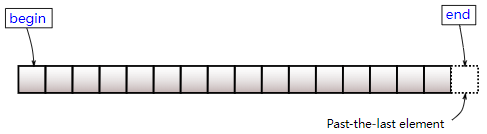 |
| clear | $O(n)$ | erase all |
| emplace / emplace_back / emplace_front | $O(1)$ | construct in-place |
| empty | $O(1)$ | empty check |
| end | $O(1)$ | past-the-end iterator 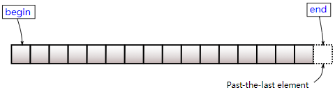 |
| erase | $O(n)$ | erase by iterator or range |
| front | $O(1)$ | first element reference |
| get_allocator | $O(1)$ | Returns the allocator associated with the container. |
| insert | $O(n)$ | Inserts an element at the specified position and returns an iterator to the inserted position.<br/>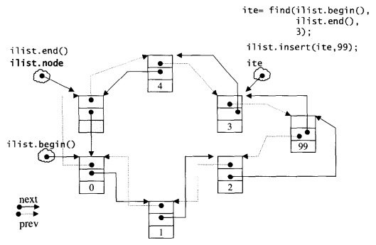 |
| max_size | $O(1)$ | Returns the maximum number of elements the container can hold, as limited by system or library implementation; for the largest container, this is `std::distance(begin(), end())`. |
| merge | $O(n)$ | merge two sorted lists; second becomes empty |
| pop_back                               |        $O(1)$ | Removes the last element of the container. Calling `pop_back` on an empty container results in undefined behavior. |
| pop_front                              |        $O(1)$ | Removes the first element of the container. If the container is empty, the behavior is undefined. |
| push_back                              |        $O(1)$ | Adds an element to the end of the container. |
| push_front                             |        $O(1)$ | Adds an element to the front of the container. |
| rbegin                                 |        $O(1)$ | Returns a reverse iterator to the first element of the reversed `list`. It corresponds to the last element of the non-reversed `list`. If the `list` is empty, the returned iterator is equal to `rend()`. <br>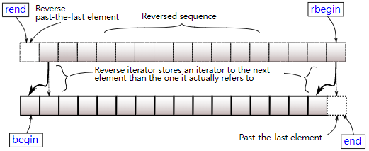 |
| remove                                 |        $O(n)$ | Removes all elements equal to the specified value. |
| remove_if                              |        $O(n)$ | Removes all elements that satisfy the specified condition. |
| rend                                   |        $O(1)$ | Returns a reverse iterator to the element following the last element of the reversed `list`. It corresponds to the element preceding the first element of the non-reversed `list`. This element acts as a placeholder; attempting to access it results in undefined behavior. <br>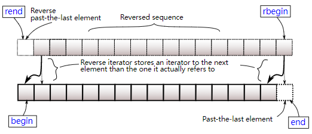 |
| resize                                 |        $O(n)$ | Resizes the container to contain `count` elements:<br>+ If the current size > `count`, the container is reduced to its first `count` elements;<br>+ If the current size < `count`, `(count - current size)` default-initialized or specified elements are inserted. |
| reverse | $O(n)$ | reverse list |
| size | $O(n)$ | note: some list implementations maintain size O(1), but standard requires O(n) for distance(begin,end()) |
| sort | $O(n \log n)$ | list::sort maintains relative order of equal elements |
| splice | $O(n)$ | move elements between lists without copying nodes |
| unique | $O(n)$ | remove consecutive duplicates |

Example:

```c++
#include <iostream>
#include <list>

int main()
{
	std::list<int> L1;                        // 创建空的容器
	std::list<int> L2{ 10 };                  // 构造包含1个元素(值为10)的容器
	std::list<int> L3(10, 1);                 // 构造包含10个元素(值为1)的容器
	std::list<int> L4{ L3 };                  // 创建L3的副本
    std::list<int> L5{ L3, 
                      L2.get_allocator() };   // 用另一个list和分配器来构造
	std::list<int> L6{ ++L3.cbegin(), 
                      --L3.cend() };          // 用一段元素来构造
    std::list<int> L7(L2.get_allocator());    // 提供分配器
    std::list<int> L8{ 
        std::make_move_iterator(L4.begin()), 
        std::make_move_iterator(L4.end())};   // 移动迭代器构造
    std::list<int> L9{
        std::make_move_iterator(L4.begin()), 
        std::make_move_iterator(L4.end()),
        L8.get_allocator()
    };                                        // 移动迭代器和提供分配器构造
    std::list<int> L10({1, 2, 3});            // 用初始化列表构造


	L1.assign(10, 1);                         // L1: [1,1,1,1,1,1,1,1,1,1]
	L1.assign(
        {1, 2, 3, 4, 5, 6, 7, 8, 9, 10});     // L1: [1,2,3,4,5,6,7,8,9,10]
	L1.assign(L3.cbegin(), L3.cend());        // L1: [1,1,1,1,1,1,1,1,1,1]

	int ret1 = L1.back();                     // ret1: 1

	std::list<int>::iterator ret2 = 
        L1.begin();                           // *ret2: 1

	L1.clear();                               // L1: []

	std::list<int>::iterator ret3 = 
        L1.emplace(L1.end(), 2);              // L1: [2], *ret3: 2

	L1.emplace_back(3);                       // L1: [2,3]

	L1.emplace_front(4);                      // L1: [4,2,3]

	bool ret4 = L1.empty();                   // ret4: false

	std::list<int>::iterator ret5 = L1.end(); // *ret5: 3

    std::list<int>::iterator ret6;
	ret6 = L1.erase(L1.begin());              // L1: [2,3], *ret6: 2
	ret6 = L1.erase(L1.begin(), L1.begin()++);// L1: [2,3], *ret6: 2

	int ret7 = L1.front();                    // ret7: 2

	std::list<int>::allocator_type ret8 = 
        L1.get_allocator();

	std::list<int>::iterator ret9;
    ret9 = L1.insert(L1.cbegin(), 1); // L1: [1,2,3], *ret9: 1
	ret9 = L1.insert(L1.cbegin(), 
                     2, 1);           // L1: [1,1,1,2,3], *ret9: 1
	ret9 = L1.insert(L1.cbegin(), 
                     { 2, 3 });       // L1: [2,3,1,1,1,2,3], *ret9: 2
	ret9 = L1.insert(L1.cbegin(), L2.begin(), 
        L2.end());                    // L1: [10,2,3,1,1,1,2,3], *ret9: 10

	size_t ret10 = L1.max_size();             // ret10: 76861433...

	L1.sort(); L2.sort(); L1.merge(L2);       // L1: [1,1,1,2,2,3,3,10,10]
                                              // L2: []

	L1.pop_back();                            // L1: [1,1,1,2,2,3,3,10]

	L1.pop_front();                           // L1: [1,1,2,2,3,3,10]

	L1.push_back(2);                          // L1: [1,1,2,2,3,3,10,2]

	L1.push_front(3);                         // L1: [3,1,1,2,2,3,3,10,2]

	std::list<int>::reverse_iterator ret11 = 
        L1.rbegin();                          // *ret10: 2

	L1.remove(1);                             // L1: [3,2,2,3,3,10,2]

	L1.remove_if([](int n) { 
        return n % 2 == 0; 
    });                                       // L1: [3,3,3]

	L1.resize(5);                             // L1: [3,3,3,0,0]
	L1.resize(7, 1);                          // L1: [3,3,3,0,0,1,1]

	L1.reverse();                             // L1: [1,1,0,0,3,3,3]

	size_t ret12 = L1.size();                 // ret12: 7

	L1.sort();                                // L1: [0,0,1,1,3,3,3]
	L1.sort(std::greater<int>());             // L1: [3,3,3,1,1,0,0]
    class my_greater { 
        public: 
        bool operator()(const int a, const int b) { return a > b; }; }; 
	L1.sort(my_greater());                    // L1: [3,3,3,1,1,0,0]

	L1.splice(L2.begin(), L1);                // L1: []
                                              // L2: [3,3,3,1,1,0,0]
	L1.splice(L1.begin(), L2, L2.begin());    // L1: [3]
                                              // L2: [3,3,1,1,0,0]        
	L1.splice(L1.begin()++, L2, L2.begin(), 
        L2.end());                            // L1: [3,3,1,1,0,0,3]
                                              // L2: []

	L1.swap(L2);                              // L1: []
                                              // L2: [3,3,1,1,0,0,3]

	L2.unique();                              // L2: [3,1,0,3]
	L2.unique(
        [](int x, int y) { 
            return x == y; 
        });                                   // L2: [3,1,0,3]
}
```

### deque

```c++
// deque迭代器
template <class _Tp, class _Ref, class _Ptr>
struct _Deque_iterator {
  typedef _Tp** _Map_pointer;

  _Tp* _M_curr;         // 指向节点的当前元素
  _Tp* _M_first;        // 指向节点的头
  _Tp* _M_last;         // 指向节点的尾部（含备用空间）
  _Map_pointer _M_node; // 指向所在的map
  ...
};

template <class _Tp, class _Alloc>
class _Deque_base {
...
protected:
  _Tp** _M_map;	        // map
  size_t _Map_map_size; // map的节点数量大小
  iterator _M_start;    // 指向第一个缓冲区的第一个元素
  iterator _M_finish;   // 指向最后一个缓冲区的最后一个元素
  ...
};
```

Member functions (selected):

| Member | Complexity | Notes |
|---|---:|---|
| assign | $O(n)$ | replace contents |
| at | $O(1)$ | checked access |
| back | $O(1)$ | last element |
| begin | $O(1)$ | iterator to first element  |
| cbegin        |     $O(1)$ | (C++11) Returns a const iterator to the first element.<br>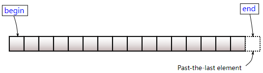 |
| clear         |     $O(n)$ | Erases all elements from the container. |
| crbegin       |     $O(1)$ | (C++11) Returns a const reverse iterator to the first element of the reversed `deque`.<br/>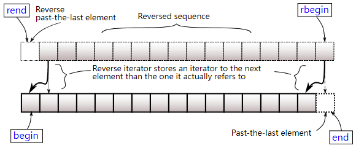 |
| crend         |     $O(1)$ | (C++11) Returns a const reverse iterator to the element following the last element of the reversed `deque`.<br>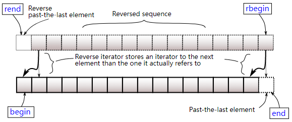 |
| emplace       |     $O(n)$ | (C++11) Constructs and inserts an element at the specified position (before the given iterator). |
| emplace_back  |     $O(1)$ | (C++11) Constructs and inserts an element at the end of the container. |
| emplace_front |     $O(1)$ | (C++11) Constructs and inserts an element at the beginning of the container. |
| empty | O(1) | Checks whether the container is empty. |
| end | O(1) | past-the-end iterator 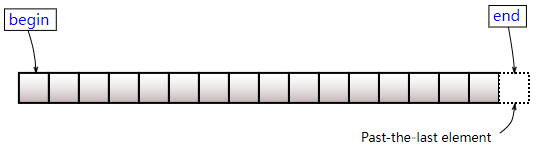 |
| cend | $O(1)$ | (C++11) Returns a const iterator to the element following the last element of the container.<br/>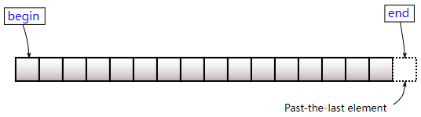 |
| erase | O(n) | erase by position |
| front | O(1) | first element |
| get_allocator |     $O(1)$ | Returns the allocator associated with the container. |
| insert        |     $O(n)$ | Inserts elements at the specified position in the container. |
| max_size      |     $O(1)$ | Returns the maximum number of elements the container can hold (depends on `std::numeric_limits<difference_type>::max()`). |
| pop_back      |     $O(1)$ | Removes the last element of the container. |
| pop_front     |     $O(1)$ | Removes the first element of the container. |
| push_back     |     $O(1)$ | Adds an element to the end of the container. |
| push_front    |     $O(1)$ | Adds an element to the beginning of the container. |
| rbegin        |     $O(1)$ | Returns a reverse iterator to the first element of the reversed `deque`.<br> |
| rend          |     $O(1)$ | Returns a reverse iterator to the element following the last element of the reversed `deque`.<br>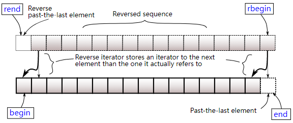 |
| resize        |     $O(n)$ | Resizes the container to contain the specified number of elements. |
| shrink_to_fit |     $O(n)$ | (C++11) Requests the removal of unused capacity (non-binding). |
| size          |     $O(1)$ | Returns the number of elements in the container. |
| swap          |     $O(1)$ | Swaps the contents with another container (no element movement, just swaps internal pointers). |

Example:

```c++
#include <iostream>
#include <deque>

int main()
{
    std::deque<int> d1;               // 构造空容器
    std::deque<int> d2(5);            // 构造带5个元素（默认值）的容器
    std::deque<int> d3(5, 1);         // 构造带5个元素（值为1）的容器
    std::deque<int> d4(5, 
        d2.get_allocator());          // 使用分配器构造带5个元素（默认值）的容器
    std::deque<int> d5(5, 1, 
        d3.get_allocator());          // 使用分配器构造带5个元素（值为1）的容器
    std::deque<int> d6{d3.begin(), 
        d3.end()};                    // 使用迭代器来构造容器
    std::deque<int> d7(d3);           // 使用容器的副本构造容器
    std::deque<int> d8(d3, 
        d2.get_allocator());          // 使用分配器和容器的副本构造容器
    std::deque<int> d9{1, 2, 3};      // 使用初始化列表构造容器
    std::deque<int> d10({1, 2, 3}, 
        d3.get_allocator());          // 使用初始化列表和分配器来构造容器

    d1.assign(5, 2);                  // d1: [2,2,2,2,2]
    d1.assign(d3.begin(), d3.end());  // d1: [1,1,1,1,1]
    d1.assign({1, 2, 3, 4, 5});       // d1: [1,2,3,4,5]

    int& ret1 = d1.at(1);             // ret1: 2

    int& ret2 = d1.back();            // ret2: 5

    std::deque<int>::iterator ret3 = 
        d1.begin();                   // *ret3: 1

    std::deque<int>::const_iterator ret4 = 
        d1.cbegin();                  // *ret4: 1

    d1.clear();                       // d1: []

    std::deque<int>::const_reverse_iterator ret5 = 
        d1.crbegin();                 // *ret5: 0

    std::deque<int>::const_reverse_iterator ret6 = 
        d1.crend();                   // *ret6: 0

    std::deque<int>::iterator ret7 = 
        d1.emplace(d1.begin(), 6);    // d1: [6], *ret7: 6

    d1.emplace_back(7);               // d1: [6,7]

    d1.emplace_front(8);              // d1: [8,6,7]

    bool ret8 = d1.empty();           // ret8: false

    std::deque<int>::iterator ret9 = 
        d1.end();                     // *ret9: 2

    std::deque<int>::const_iterator ret10 = 
        d1.cend();                    // *ret10: 2

    std::deque<int>::iterator ret11 = 
        d1.erase(d1.begin());         // d1: [6, 7], *ret11: 6

    int& ret12 = d1.front();          // ret12: 6

    std::deque<int>::allocator_type ret13 = d1.get_allocator();

    std::deque<int>::iterator ret14;
    ret14 = d1.insert(d1.begin(), 9); // d1: [9,6,7], *ret14: 9
    ret14 = d1.insert(d1.begin(), 2, 
        10);                          // d1: [10,10,9,6,7], *ret14: 10
    ret14 = d1.insert(d1.begin(), d3.begin(), 
        d3.begin() + 1);              // d1: [1,10,10,9,6,7], *ret14: 1 
    ret14 = d1.insert(d1.begin(), 
                      {1, 2});        // d1: [1,2,1,10,10,9,6,7], *ret14: 1

    size_t ret15 = d1.max_size();     // ret15: 4611686...

    d1.pop_back();                    // d1: [1,2,1,10,10,9,6]

    d1.pop_front();                   // d1: [2,1,10,10,9,6]

    d1.push_back(11);                 // d1: [2,1,10,10,9,6,11]

    d1.push_front(12);                // d1: [12,2,1,10,10,9,6,11]

    std::deque<int>::reverse_iterator ret16 = 
        d1.rbegin();                  // *ret16: 11

    std::deque<int>::reverse_iterator ret17 = 
        d1.rend();                    // *ret17: 0

    d1.resize(5);                     // d1: [12,2,1,10,10]
    d1.resize(7, 1);                  // d1: [12,2,1,10,10,1,1]

    d1.shrink_to_fit();               // d1: [12,2,1,10,10,1,1]

    size_t ret18 = d1.size();         // ret18: 7

    d1.swap(d3);                      // d1: [1,2,3,4,5]
                                      // d3: [12,2,1,10,10,1,1]
}
```

### set

`std::set` and `std::multiset` are typically implemented as red-black trees.

```c++
// set & multiset底层机制为RB-tree。
// RB-tree节点
struct _Rb_tree_node_base
{  
  ...
  _Color_type _M_color;	// 节点颜色，非红即黑
  _Base_ptr _M_parent;	// 父节点
  _Base_ptr _M_left;    // 左节点（小）
  _Base_ptr _M_right;   // 右节点（大）
};

// RB-tree迭代器
struct _Rb_tree_base_iterator
{
  ...
  typedef _Rb_tree_node_base::_Base_ptr _Base_ptr;
  _Base_ptr _M_node;
}

// RB-tree
template <class _Value>
struct _Rb_tree_node : public _Rb_tree_node_base
{
  _Value _M_value_field;          // 节点的值
};

template <class _Tp, class _Alloc>
struct _Rb_tree_base
{
protected:
  _Rb_tree_node<_Tp>* _M_header; // 头节点
  ...
}

template <class _Key, class _Value, class _KeyOfValue, class _Compare, class _Alloc = __STL_DEFAULT_ALLOCATOR(_Value) >
class _Rb_tree : protected _Rb_tree_base<_Value, _Alloc> {
protected:
  size_type _M_node_count; // 节点数量
  _Compare _M_key_compare; // 节点的键比较函数
  ...
}
```

Selected members and complexity:

| Member        | Complexity         | Notes                                                       |
| :------------ | :----------------- | ----------------------------------------------------------- |
| begin         | $O(1)$             | Returns an iterator to the first element.<br>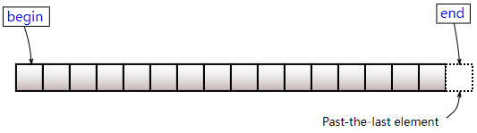 |
| cbegin        | $O(1)$             | (C++11) Returns a const iterator to the first element.<br/>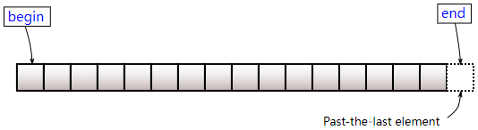 |
| cend          | $O(1)$             | (C++11) Returns a const iterator to the element following the last element of the container.<br/>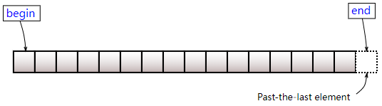 |
| clear         | $O(n)$             | Erases all elements from the container.                     |
| count         | $O(\log n)$        | Returns the number of elements matching a value (for set, only 0 or 1 is possible). |
| crbegin       | $O(1)$             | (C++11) Returns a const reverse iterator to the first element of the reversed container.<br>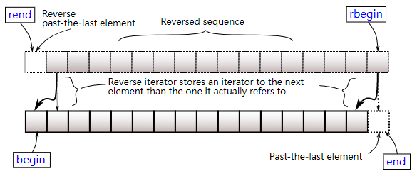 |
| crend         | $O(1)$             | (C++11) Returns a const reverse iterator to the element preceding the first element of the non-reversed container.<br>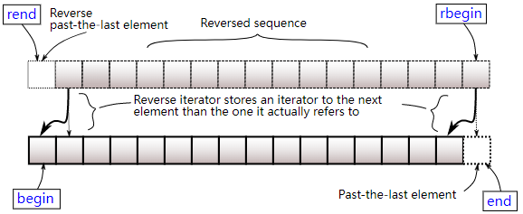 |
| emplace       | $O(\log n)$        | (C++11) Constructs and inserts an element into the container. |
| emplace_hint  | $O(\log n)$        | (C++11) Constructs and inserts an element, using a hint to position as close as possible. |
| empty         | $O(1)$             | Checks whether the container is empty.                      |
| end           | $O(1)$             | Returns an iterator to the element following the last element.<br>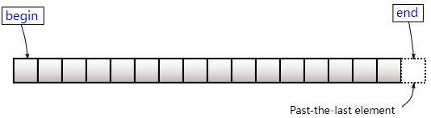 |
| equal_range   | $O(\log n)$        | Returns a range containing all elements with a given key.    |
| erase         | $O(\log n) + O(n)$ | Removes specified elements from the container.               |
| find          | $O(\log n)$        | Finds an element with key equivalent to the specified value. |
| get_allocator | $O(1)$             | Returns the allocator associated with the container.         |
| insert        | $O(\log n)$        | Inserts an element if it does not already exist, and returns an iterator to the inserted element. |
| lower_bound   | $O(\log n)$        | Returns an iterator to the first element not less than the given value. |
| key_comp      | $O(1)$             | Returns the function used to compare keys.                   |
| max_size      | $O(1)$             | Returns the maximum number of elements the container can hold, as limited by system or library implementation (calculated by `std::distance(begin(), end())`). |
| rbegin        | $O(1)$             | Returns a reverse iterator to the last element (i.e., the last element of the non-reversed container).<br>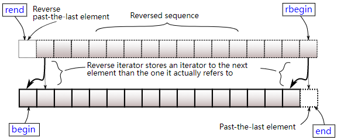 |
| rend          | $O(1)$             | Returns a reverse iterator to the element preceding the first element of the non-reversed container.<br>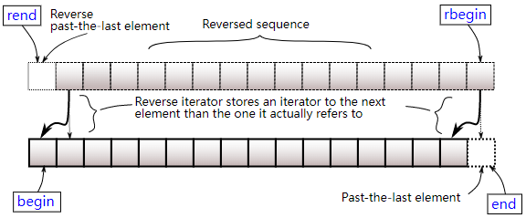 |
| size          | $O(1)$             | Returns the number of elements in the container.             |
| swap          | $O(1)$             | Swaps the contents of two containers (no element movement, just swaps internal pointers). |
| upper_bound   | $O(\log n)$        | Returns an iterator to the first element greater than the given value. |
| value_comp    | $O(1)$             | Returns the function used to compare values.                 |

Example:

```c++
#include <iostream>
#include <set>

int main()
{
    std::set<int> s1{1, 2, 3};              // 使用初始化列表构造
    std::set<int> s2({1, 2, 3});            // 通过初始化列表构造
    std::set<int> s3(s1.begin(), s1.end()); // 使用迭代器范围构造
    std::set<int> s4(s1.begin(), s1.end(), 
        s1.get_allocator());                // 使用迭代器范围和分配器构造
    std::set<int, std::greater<int> > s5{
        s1.begin(), s1.end() };             // 使用迭代器范围和函数对象构造
    std::set<int> s6(s1);                   // 使用另一个容器的副本构造
    std::set<int> s7(std::move(s6));        // 通过移动另一个容器来构造
    std::set<int> s8(s1.get_allocator());   // 使用分配器构造容器
    std::set<int> s9(s1, 
        s1.get_allocator());                // 使用另一个容器的副本和分配器构造
    std::set<int> s10({1, 2, 3}, 
        s2.get_allocator());                // 使用初始化列表和分配器构造

    std::set<int>::iterator ret1 = 
        s1.begin();               // s1:[1,2,3], *ret1:1

    std::set<int>::const_iterator ret2 = 
        s1.cbegin();              // s1:[1,2,3], *ret1:1

    std::set<int>::const_iterator ret3 = 
        s1.cend();                // s1:[1,2,3], *ret1:3

    s1.clear();                   // s1:[]

    s1 = s2; size_t ret4 = 
        s1.count(1);              // ret4:1

    std::set<int>::const_reverse_iterator ret5 = 
        s1.crbegin();             // *ret5:3 

    std::set<int>::const_reverse_iterator ret6 = 
        s1.crend();               // *ret6:3

    std::pair<std::set<int>::iterator, bool> ret7 = 
        s1.emplace(1);            // s1:[1,2,3]
                                  // <*ret7.first,ret7.second>:<1,false>

    std::set<int>::iterator ret8 = 
        s1.emplace_hint(
            s1.begin(), 2);       // s1:[1,2,3], *ret8:2

    bool ret9 = s1.empty();       // ret9:false

    std::set<int>::iterator ret10 = s1.end(); // *ret10: 3

    std::pair<std::set<int>::iterator, std::set<int>::iterator> ret11 = 
        s1.equal_range(1);        // <*ret11.first,*ret11.second>:<1,2>

    std::set<int>::iterator ret12;
    ret12 = s1.erase(
        s1.begin());              // s1:[2,3], *ret12:2
    ret12 = s1.erase(s1.begin(), 
        s1.end());                // s1:[], *ret12:0
    size_t ret12_1 = s2.erase(2); // s2:[1,3], ret12_1:1

    std::set<int>::iterator ret13 = 
        s1.find(1);               // *ret13:0

    std::set<int>::allocator_type ret14 = s1.get_allocator();

    std::pair<std::set<int>::iterator, bool> ret15 = 
        s1.insert(4);             // s1:[4]
                                  // <*ret15.first,ret15.second>:<4,1>
    std::set<int>::iterator ret15_1 = s1.insert(
        s1.begin(), 5);           // s1:[4,5], *ret15_1: 5
    s1.insert(s2.begin(), 
        s2.end());                // s1:[1,3,4,5]
    s1.insert({5, 6});            // s1:[1,3,4,5,6]

    std::set<int>::iterator ret16 = 
        s1.lower_bound(4);        // *ret16:4

    std::set<int>::key_compare ret17 = s1.key_comp();

    size_t ret18 = s1.max_size(); // ret18:461168...

    std::set<int>::reverse_iterator ret19 = 
        s1.rbegin();              // *ret19:6

    std::set<int>::reverse_iterator ret20 = 
        s1.rend();                // *ret20:5

    size_t ret21 = s1.size();     // ret21:5

    s1.swap(s2);                  // s1:[1,3]
                                  // s2:[1,3,4,5,6]

    std::set<int>::iterator ret22 = 
        s1.upper_bound(2);        // *ret22:3

    std::set<int>::value_compare ret22 = s1.value_comp();
}
```

### map

`std::map` is also typically backed by a red-black tree.

```c++
template <class _Key, class _Tp, class _Compare, class _Alloc>
class map {
private:
  typedef _Rb_tree<key_type, value_type, _Select1st<value_type>, key_compare, _Alloc> _Rep_type;
  _Rep_type _M_t;	// 底层实现为 RB-tree
  ...
}
```

Selected members and complexity:

| Member        | Complexity | Notes |
| :------------ | :--------- | ------------------------------------------------------------ |
| at            | $O(\log n)$ | Returns a reference to the value that is mapped to a key. If the key does not exist, throws `std::out_of_range`. |
| begin         | $O(1)$     | Returns an iterator to the first element. |
| clear         | $O(n)$     | Erases all elements from the container. |
| count         | $O(\log n)$ | Returns the number of elements matching a key (for map, only 0 or 1 is possible). |
| emplace       | $O(\log n)$ | (C++11) Constructs and inserts an element if the key does not exist; returns an iterator to the element and a bool indicating success (wrapped in std::pair). |
| emplace_hint  | $O(1)$     | (C++11) Constructs and inserts an element at the specified position; returns an iterator to the element. |
| empty         | $O(\log n)$ | Checks whether the container is empty. |
| end           | $O(1)$     | Returns an iterator to the element following the last element. Accessing the value returned by `end()` is undefined behavior. |
| equal_range   | $O(\log n)$ | Returns a pair of iterators: the first points to the first element that is not less than the given key, the second points to the first element greater than the key. |
| erase         | $O(\log n)$ | Erases elements by key or range and returns the number of elements removed. |
| find          | $O(\log n)$ | Finds an element with key equivalent to the specified value and returns an iterator to it. |
| get_allocator | $O(1)$     | Returns the allocator associated with the container. |
| insert        | $O(\log n)$ | Inserts an element and returns an iterator to the element and a bool indicating success (wrapped in std::pair). |
| key_comp      | $O(1)$     | Returns the function object used to compare keys. |
| lower_bound   | $O(\log n)$ | Returns an iterator to the first element whose key is not less than the given key. |
| max_size      | $O(1)$     | Returns the maximum number of elements the container can hold, as limited by system or library implementation (calculated by `std::distance(begin(), end())`). |
| operator[]    | $O(\log n)$ | Returns a reference to the value that is mapped to a key. If the key does not exist, inserts it and returns a reference to the new value. |
| rbegin        | $O(1)$     | Returns a reverse iterator to the last element. If the map is empty, the returned iterator is equal to `rend()`. |
| rend          | $O(1)$     | Returns a reverse iterator to the element preceding the first element. This element acts as a placeholder; accessing it results in undefined behavior. |
| size          | $O(1)$     | Returns the number of elements in the container. |
| swap          | $O(1)$     | Swaps the contents of two containers. |
| upper_bound   | $O(\log n)$ | Returns an iterator to the first element whose key is greater than the given key. |
| value_comp    | $O(1)$     | Returns the function object used to compare values. |

Example:

```c++
#include <iostream>
#include <map>
#include <string>

int main()
{
	std::map<int, std::string> m1{ {1, "one"}, 
                                  {2, "two"} };    // 根据初始化列表构造
	std::map<int, std::string> m2{ 
        std::make_pair(1, "one"), 
        std::make_pair(2, "two")};                 // 根据初始化列表构造
	std::map<int, std::string> m3{ m1 };           // 构造一个map的副本
	std::map<int, std::string> m4{ std::begin(m1), 
                                   std::end(m1) }; // 构造指定范围的map

	std::string ret1 = m1.at(1);// ret1: one

	std::map<int, std::string>::iterator ret2 = 
        m1.begin();             // {ret2->first, ret2->second}: {1, one}

	m3.clear();                 // m3: {}

	size_t ret3 = m1.count(1);  // ret3: 1

	std::pair<std::map<int, std::string>::iterator, bool> ret4 = 
     m1.emplace(3, "three");    // {
                                //   {
                                //     (ret4.first)->first, : 3
                                //     (ret4.first)->second : three
                                //   },
                                //   ret4.second : true
                                // }

	std::map<int, std::string>::iterator ret5 = m1.emplace_hint(
        m1.begin(), 4, "four"); // {ret5->first, ret5->second}: {4, four}

	bool ret6 = m3.empty();     // ret6: true

	std::map<int, std::string>::iterator ret7 = m1.end(); // ret7: NULL

	std::pair<std::map<int, std::string>::iterator, 
        std::map<int, std::string>::iterator> ret8 =
        m1.equal_range(1);       // {
                                 //   {ret8.first->first, 
                                 //    ret8.first->second},  : {1, one}
                                 //   {ret8.second->first, 
                                 //    ret8.second->second} : {2, two}
                                 // }

	size_t ret9 = m1.erase(4);   // ret9: 1

	std::map<int, std::string>::iterator ret10 = 
        m1.find(1);              // {ret10->first, ret10->second}: {1, one}
	
	auto ret11 = m1.get_allocator();
	
	std::pair<std::map<int, std::string>::iterator, bool> ret12 = 
        m1.insert(std::make_pair(4, "four")); // m1: {
                                              //       {1,one}, 
                                              //       {2,two}, 
                                              //       {3,three}, 
                                              //       {4,four}
                                              //     }
	m2.insert(std::begin(m1), std::end(m1)); // m2: {
                                              //       {1,one}, 
                                              //       {2,two}, 
                                              //       {3,three}, 
                                              //       {4,four}
                                              //     }

	std::map<int, std::string>::key_compare ret13 = 
        m1.key_comp();            // ret13(1, 2): true

	std::map<int, std::string>::iterator ret14 = 
        m1.lower_bound(2);        // {ret14->first, ret14->second}: {2, two}

	size_t ret15 = m1.max_size(); // ret15: 25620...

	std::string ret16 = m1[1];    // ret16: one

	std::map<int, std::string>::reverse_iterator ret17 = 
        m1.rbegin();              // {ret17->first, ret17->second}: {4, four}

	std::map<int, std::string>::reverse_iterator ret18 = 
        m1.rend();                // {ret18->first, ret18->second}: {4, }

	size_t n = m1.size();         // n: 4
	
	m1.swap(m2); // m1: {{1,one}, {2,two}, {3,three}, {4,four}}
                 // m2: {{1,one}, {2,two}, {3,three}, {4,four}}

	std::map<int, std::string>::iterator ret19 = 
        m1.upper_bound(3);        // {ret19->first, ret19->second}: {4, four}

	std::map<int, std::string>::value_compare ret20 = 
        m1.value_comp();          // ret20({1, "one" }, {2, "tow"}): true
}
```

### stack

Adapter exposing stack semantics.

| Member   | Complexity | Notes |
| :------- | :----- | ------------------------------- |
| emplace  | $O(1)$ | (C++11) Constructs and pushes an element onto the top of the stack. |
| empty    | $O(1)$ | Checks whether the container is empty. |
| pop      | $O(1)$ | Removes the top element. |
| push     | $O(1)$ | Pushes an element onto the top of the stack. |
| size     | $O(1)$ | Returns the number of elements in the container. |
| swap     | $O(1)$ | (C++11) Swaps the contents of two containers. |
| top      | $O(1)$ | Returns a reference to the top element. |

Example:

```c++
#include <iostream>
#include <stack>
#include <list>

int main()
{
    std::list<int> values{1, 2, 3};

    std::stack<int> s1;                          // 创建容器
    std::stack<int> s2(s1);                      // 使用另一个容器来初始化
    std::stack<int, std::list<int> > s3(values); // 指定底层容器，用来初始化
    std::stack<int, std::list<int> > s4{values}; // 指定底层容器，用初始化列表来初始化
    std::stack<int, std::list<int> > s5(values, 
                        values.get_allocator()); // 指定底层容器和内存分配器来初始化
    std::stack<int, std::list<int> > s6(s3, 
                        values.get_allocator()); // 指定容器和内存分配器来初始化

    s1.emplace(4);           // s1: [4]

    bool ret1 = s1.empty();  // ret1: false

    s1.pop();                // s1: []

    s1.push(5);              // s1: [5]

    size_t ret2 = s1.size(); // ret2: 1

    s1.swap(s2);             // s1: [], s2: [5]

    int& ret3 = s1.top();    // s1: [], ret3: 未定义值
}
```

### queue

Adapter providing FIFO queue semantics.

| Member   | Complexity | Notes |
| :------- | :----- | ------------------------------------------------------------ |
| back     | $O(1)$ | Returns a reference to the last element in the container. |
| emplace  | $O(1)$ | (C++11) Constructs and inserts an element at the end of the container. |
| empty    | $O(1)$ | Checks whether the container is empty. |
| front    | $O(1)$ | Returns a reference to the first element. |
| pop      | $O(1)$ | Removes the first element. |
| push     | $O(1)$ | Adds an element to the end of the container. |
| size     | $O(1)$ | Returns the number of elements in the container. |
| swap     | $O(1)$ | (C++11) Swaps the contents of two containers (no element movement, just swaps internal pointers). |

Example:

```c++
int main()
{
    int a[]{1, 2, 3};
    std::deque<int> values{1, 2, 3};
    std::queue<int> q1(values);                 // 使用构造容器初始化
    std::queue<int> q2(q1);                     // 复制构造初始化
    std::queue<int> q3(std::move(q2));          // 移动构造初始化
    std::queue<int> q4(values.get_allocator()); // 使用底层容器初始化
    std::queue<int> q5(values, 
        values.get_allocator());                // 使用指定的容器和内存分配器初始化
    std::queue<int> q6(std::move(values), 
        values.get_allocator());                // 移动指定的容器和内存分配器初始化
    std::queue<int> q7(q5, 
        values.get_allocator());                // 使用另一个容器和内存分配器初始化
    std::queue<int> q8(std::begin(a), 
        std::end(a));                           // 使用迭代器初始化
    std::queue<int> q9(std::begin(a), std::end(a), 
        values.get_allocator());                // 使用迭代器和内存分配器初始化
    

    int& ret1 = q1.back();  // ret1: 3

    q1.emplace(4);          // q1: [1,2,3,4]

    bool ret2 = q1.empty(); // ret2: false

    int& ret3 = q1.front(); // ret3: 1

    q1.pop();               // q1: [2,3,4]

    q1.push(5);             // q1: [2,3,4,5]

    size_t ret4 = q1.size();// ret4: 4

    q1.swap(q2);            // q1: [], q2: [2,3,4,5]
}
```

### priority_queue

Heap-based adaptor using underlying container (by default vector) and `make_heap` operations.

| Member   | Complexity  | Notes                                                |
| :------- | :---------- | ---------------------------------------------------- |
| emplace  | $O(\log n)$ | (C++11) Constructs and inserts a new element.        |
| empty    | $O(1)$      | Checks whether the container is empty.               |
| pop      | $O(\log n)$ | Removes the top element.                             |
| push     | $O(\log n)$ | Inserts a new element.                               |
| size     | $O(1)$      | Returns the number of elements in the container.     |
| swap     | $O(1)$      | (C++11) Swaps the contents of two containers.        |
| top      | $O(1)$      | Returns a reference to the top element.              |

Example:

```c++
#include <iostream>
#include <queue>
#include <vector>

int main()
{
    int values[]{1, 2, 3};
    std::priority_queue<int> p1{                 // 使用迭代器初始化
        std::begin(values), std::end(values)};
    std::priority_queue<int> p2{p1};             // 使用另一个容器初始化
    std::priority_queue<int, std::vector<int>, std::greater<int> > p3 { 
        std::begin(values), std::end(values)};   // 使用迭代器和指定底层容器及比较函数初始化

    p1.emplace(4);           // p1: [4,3,2,1]

    bool ret1 = p1.empty();  // ret1: false

    p1.pop();                // p1: [3,2,1]

    p1.push(5);              // p1: [5,3,2,1]

    size_t ret2 = p1.size(); // ret2: 4

    p1.swap(p2);             // p1: [3,2,1], p2: [5,3,2,1]

    int ret3 = p1.top();     // ret3: 3
}
```

### bitset

- `std::bitset<N>` is an efficient fixed-size representation of N bits with bitwise operators, `count()`, `test()`, `set()`, `reset()`. Use when N is known at compile time.


---


## Algorithms

High-level categories:
- Non-modifying sequence operations: find, count, any_of, all_of, none_of.
- Modifying sequence operations: copy, transform, replace, fill.
- Sorting and related: sort(), stable_sort(), partial_sort(), nth_element().
- Partitioning: partition(), stable_partition(), partition_point().
- Binary-search family (requires sorted range): lower_bound, upper_bound, binary_search.
- Heap operations: make_heap, push_heap, pop_heap, sort_heap.
- Numeric algorithms: accumulate, inner_product, partial_sum, iota.

Examples and complexity notes:
- binary_search — O(log n) on RandomAccessIterator and sorted data.
- sort — O(n log n) average; stable_sort preserves relative order of equal elements.
- nth_element — O(n) average; partitions so that the nth element is at its sorted position.

Use std::algorithm overloads with execution policies (C++17 parallel algorithms) only after measuring and verifying thread-safety of the supplied functions.

### Generate / Fill

| Algorithm           | Complexity | Notes / Illustration / Code                                                                                 |
| ------------------- | ---------- | --------------------------------------------------------------------------------------------------------- |
| fill                | $O(n)$     | Assigns the specified value to every element in the sequence.                                              |
| fill_n              | $O(n)$     | Assigns the specified value to the first n elements in the sequence.                                       |
| is_permutation      | $O(n^2)$   | Checks if one sequence is a permutation of another.                                                        |
| generate            | $O(n)$     | Assigns values generated by a function to every element in the sequence.                                   |
| generate_n          | $O(n)$     | Assigns values generated by a function to the first n elements in the sequence.                            |
| next_permutation    | $O(n)$     | Generates the next lexicographically greater permutation; returns true if it exists, otherwise resets to the first permutation and returns false.<br>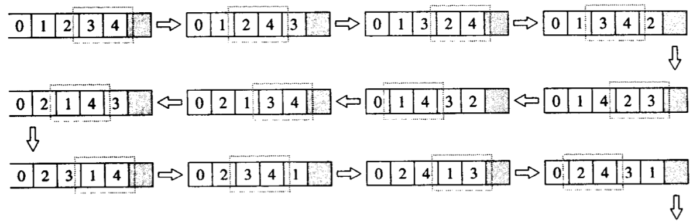 |
| prev_permutation    | $O(n)$     | Generates the previous lexicographically ordered permutation; returns true if it exists, otherwise resets to the last permutation and returns false. |

Example:

```c++
#include <iostream>
#include <queue>
#include <vector>

int main()
{
    int values[]{1, 2, 3};
    std::priority_queue<int> p1{                 // 使用迭代器初始化
        std::begin(values), std::end(values)};
    std::priority_queue<int> p2{p1};             // 使用另一个容器初始化
    std::priority_queue<int, std::vector<int>, std::greater<int> > p3 { 
        std::begin(values), std::end(values)};   // 使用迭代器和指定底层容器及比较函数初始化

    p1.emplace(4);           // p1: [4,3,2,1]

    bool ret1 = p1.empty();  // ret1: false

    p1.pop();                // p1: [3,2,1]

    p1.push(5);              // p1: [5,3,2,1]

    size_t ret2 = p1.size(); // ret2: 4

    p1.swap(p2);             // p1: [3,2,1], p2: [5,3,2,1]

    int ret3 = p1.top();     // ret3: 3
}
```

### Sorting

| Algorithm       | Complexity           | Notes / Illustration / Code                                                                                 |
| --------------- | -------------------- | ---------------------------------------------------------------------------------------------------------- |
| is_sorted       | $O(n)$               | Checks if the elements in the specified range are sorted in non-decreasing order.                           |
| is_sorted_until | $O(n)$               | Checks if the range is sorted and returns an iterator to the upper bound of the sorted sequence.            |
| nth_element     | $O(n)$               | Partially sorts the range so that the element at the nth position is the one that would be in that position in a sorted sequence; all elements before it are less than or equal, all after are greater or equal.<br>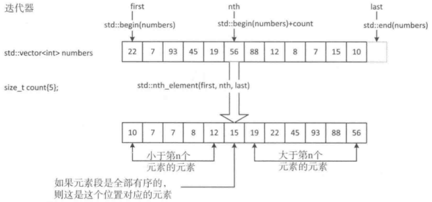 |
| partial_sort    | $O(n \times \log(m))$ | Partially sorts the range so that the first m elements are the smallest m elements in sorted order.<br>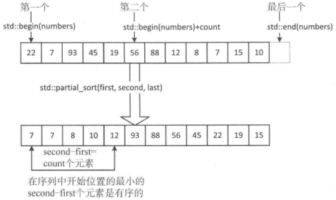 |
| sort            | $O(n \times \log(n))$ | Sorts the elements in non-decreasing order; does not guarantee the order of equal elements.                 |
| stable_sort     | $O(n \times \log(n))$ | Sorts the elements in non-decreasing order, preserving the relative order of equal elements.                |

Example:

```c++
#include <iostream>
#include <vector>
#include <algorithm>

int main()
{
    std::vector<int> is1{1, 2, 3, 3, 4};
    bool ret_is;
    ret_is = std::is_sorted(is1.begin(), is1.end()); // ret_is: true
    ret_is = std::is_sorted(is1.begin(), is1.end(), 
        std::greater<>());                           // ret_is: false
    ret_is = std::is_sorted(is1.begin(), is1.end(), 
        [](int n1, int n2){ 
            return n1 < n2; 
        });                                          // ret_is: true

    std::vector<int> isu1{1, 2, 3, 3, 6, 5, 4};
    std::vector<int>::iterator ret_isu;
    ret_isu = std::is_sorted_until(isu1.begin(), 
        isu1.end());                                 // *ret_isu: 5
    ret_isu = std::is_sorted_until(isu1.begin(), isu1.end(), 
        std::greater<>());                           // *ret_isu: 2
    ret_isu = std::is_sorted_until(isu1.begin(), isu1.end(), 
        [](int n1, int n2){ return n1 < n2; });      // *ret_isu: 5

    std::vector<int> ne{4, 3, 2, 1, 5, 7, 6, 8};
    std::nth_element(ne.begin(), ne.begin() + ne.size() / 2, 
        ne.end());                                   // ne: [3,1,2,4,5,7,6,8]
    std::nth_element(ne.begin(), ne.begin() + ne.size() / 2, ne.end(), 
        std::greater<>());                           // ne: [5,8,6,7,4,3,2,1]
    std::nth_element(ne.begin(), ne.begin() + ne.size() / 2, ne.end(), 
        [](int n1, int n2){ return n1 < n2; });      // ne: [4,1,2,3,5,6,7,8]

    std::vector<int> ps1{3, 4, 2, 1, 5};
    std::partial_sort(ps1.begin(), ps1.begin() + 3, 
        ps1.end());                                  // ps1: [1,2,3,4,5]
    std::partial_sort(ps1.begin(), ps1.begin() + 3, ps1.end(), 
        [](int n1, int n2){ 
            return n1 < n2; 
        });                                          // ps1: [1,2,3,4,5]

    std::vector<int> s1{3, 4, 2, 1, 5};
    std::vector<int> s2{s1};
    std::vector<int> s3{s1};
    std::sort(s1.begin(), s1.end());                 // s1: [1,2,3,4,5]
    std::sort(s2.begin(), s2.end(), 
        [](int n1, int n2){ 
            return n1 < n2 && n2 % 2 != 0; 
        });                                          // s2: [2,3,4,1,5]
    std::sort(s3.begin(), s3.end(), 
        std::greater<>());                           // s3: [5,4,3,2,1]

    std::vector<int> ss1{3, 4, 2, 1, 5};
    std::vector<int> ss2{ss1};
    std::vector<int> ss3{ss1};
    std::stable_sort(ss1.begin(), ss1.end());        // ss1: [1,2,3,4,5]
    std::stable_sort(ss2.begin(), ss2.end(), 
        [](int n1, int n2){ 
            return n2 % 2 == 0 && n1 < n2; 
        });                                         // ss2: [3,1,2,4,5]
    std::stable_sort(ss3.begin(), ss3.end(), 
        std::greater<>());                          // ss3: [5,4,3,2,1]
}
```

### Merge

| Algorithm | Complexity | Notes |
|---|---:|---|
| inplace_merge | $O(n \times \log(n))$ | merge two consecutive sorted ranges in-place<br>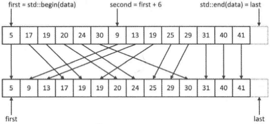 |
| merge | $O(n + m)$ | merge two sorted containers into one<br/>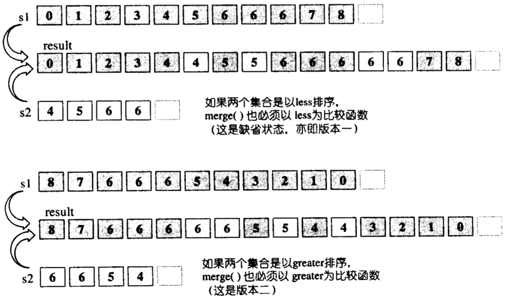 |

Example:

```c++
#include <iostream>
#include <vector>
#include <algorithm>

int main()
{
    std::vector<int> v1{1, 2, 3};
    std::vector<int> v2{7, 8, 9};

    std::merge(v1.begin(), v1.end(), v2.begin(), 
               v2.end(), v1.begin());                  // v1: [1, 2, 3]

    std::vector<int> v3(6);
    std::merge(v1.begin(), v1.end(), v2.begin(), 
               v2.end(), v3.begin());                  // v3: [1,2,3,7,8,9]

    std::vector<int> v4(6);
    std::merge(v1.begin(), v1.end(), v2.begin(), v2.end(), 
               v4.begin(), std::greater<>());          // v4: [7,8,9,1,2,3]

    std::vector<int> v5(6);
    std::merge(v1.begin(), v1.end(), v2.begin(), v2.end(), v5.begin(), 
               [](int n1, int n2){ return n1 < n2; }); // v5: [1,2,3,7,8,9]

    
    std::vector<int> v6{5, 17, 19, 20, 24, 30, 9, 13, 19, 25, 29, 31, 40, 41};
    std::inplace_merge(v6.begin(), v6.begin() + 6, 
        v6.end()); // v6: [5,9,13,17,19,19,20,24,25,29,30,31,40,41]

    std::vector<int> v7{5, 17, 19, 20, 24, 30, 9, 13, 19, 25, 29, 31, 40, 41};
    std::inplace_merge(v7.begin(), v7.begin() + 6, v7.end(),
        [](int n1, int n2){ 
            return n1 < n2; 
        });        // v7: [5,9,13,17,19,19,20,24,25,29,30,31,40,41]
}
```

### Search

| Algorithm        | Complexity                  | Notes / Illustration / Code                                                                                 |
| ---------------  | -------------------------- | ---------------------------------------------------------------------------------------------------------- |
| adjacent_find    | $O(n)$                     | Searches for two consecutive equal elements in the sequence.                                               |
| binary_search    | $O(\log_2{n})$            | Performs binary search for a value; returns true if found.<br>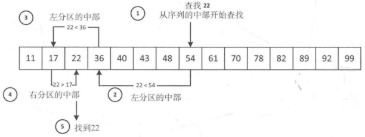 |
| find             | $O(n)$                     | Searches for a value in the specified range and returns an iterator to it.                                 |
| find_end         | $O(s \times (n - s + 1))$ | Searches for the last occurrence of a subsequence in the range.<br> |
| find_first_of    | $O(s \times n)$            | Searches for the first occurrence of any of the elements from another sequence.<br>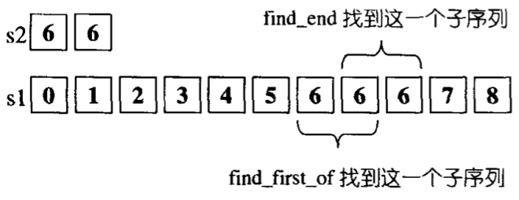 |
| find_if          | $O(n)$                     | Searches for the first element in the range that satisfies a condition.                                    |
| find_if_not      | $O(n)$                     | Searches for the first element in the range that does not satisfy a condition.                             |
| lower_bound      | $O(\log_2 n)$              | Searches for the first element not less than the specified value.<br>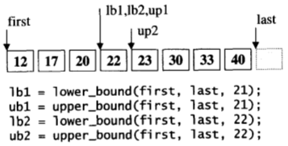 |
| search           | $O(s \times n)$            | Searches for the first occurrence of a subsequence in the range.                                           |
| search_n         | $O(n)$                     | Searches for n consecutive elements with the same value in the range.                                      |
| upper_bound      |                            |                                                                                                            |

For example:

```c++
#include <iostream>
#include <vector>
#include <algorithm>

int main()
{
    std::vector<int> af{1, 2, 3, 4, 5, 5, 6, 7, 8};
    std::vector<int>::iterator ret_af;
    ret_af = std::adjacent_find(af.begin(), af.end());    // *ret_af: 5
    ret_af = std::adjacent_find(af.begin(), af.end(),
        std::greater<int>());                             // *ret_af: 0
    ret_af = std::adjacent_find(af.begin(), af.end(), 
        [](int n1, int n2){ return n1 == n2; });          // *ret_af: 5

    std::vector<int> bs{1, 2, 3, 3, 4};
    bool ret_bs;
    ret_bs = std::binary_search(bs.begin(), bs.end(), 3); // ret_bs: true
    ret_bs = std::binary_search(bs.begin(), bs.end(), 3,
        [](int n1, int n2){ return n1 == n2; });          // ret_bs: true

    std::vector<int> f{1, 2, 3, 3, 4};
    std::vector<int>::iterator ret_f;
    ret_f = std::find(f.begin(), f.end(), 3);             // *ret_f: 3

    std::vector<int> fe1{1, 2, 3, 1, 2, 4};
    std::vector<int> fe2{1, 2};
    std::vector<int>::iterator ret_fe;
    ret_fe = std::find_end(fe1.begin(), fe1.end(), 
        fe2.begin(), fe2.end());                          // *ret_fe: 1
    ret_fe = std::find_end(fe1.begin(), fe1.end(), 
        fe2.begin(), fe2.end(), 
        [](int n1, int n2){ return n1 == n2; });          // *ret_fe: 1

    std::vector<int> ffo1{1, 2, 3, 4, 2, 3, 5};
    std::vector<int> ffo2{2, 3};
    std::vector<int>::iterator ret_ffo;
    ret_ffo = std::find_first_of(ffo1.begin(), ffo1.end(), 
        ffo2.begin(), ffo2.end());                        // *ret_ffo: 2
    ret_ffo = std::find_first_of(ffo1.begin(), ffo1.end(), 
        ffo2.begin(), ffo2.end(), 
        [](int n1, int n2){ return n1 == n2; });          // *ret_ffo: 2

    std::vector<int> fi{1, 2, 3, 4, 5};
    std::vector<int>::iterator ret_fi;
    ret_fi = std::find_if(fi.begin(), fi.end(), 
        [](int n){ return n % 2 == 0; });                 // *ret_fi: 2

    std::vector<int> fin{1, 2, 3, 4, 5};
    std::vector<int>::iterator ret_fin;
    ret_fin = std::find_if_not(fin.begin(), fin.end(),
        [](int n){ return n % 2 == 0; });                 // *ret_fin: 1

    std::vector<int> lb{1, 2, 3, 4, 5};
    std::vector<int>::iterator ret_lb;
    ret_lb = std::lower_bound(lb.begin(), lb.end(), 3);   // *ret_lb: 3
    ret_lb = std::lower_bound(lb.begin(), lb.end(), 3, 
        [](int n1, int n2){ return n1 < n2; });           // *ret_lb: 3

    std::vector<int> mm1{1, 2, 3, 4, 5};
    std::vector<int> mm2{1, 2, 4, 5};
    std::pair<std::vector<int>::iterator, std::vector<int>::iterator> ret_mm;
    ret_mm = std::mismatch(mm1.begin(), mm1.end(), 
        mm2.begin());   // <*(ret_mm.first), *(ret_mm.second)>: <3, 4>
    ret_mm = std::mismatch(mm1.begin(), mm1.end(), mm2.begin(), 
        [](int n1, int n2){ 
            return n1 == n2; 
        });             // <*(ret_mm.first), *(ret_mm.second)>: <3, 4> 
    ret_mm = std::mismatch(mm1.begin(), mm1.end(), mm2.begin(), 
        mm2.end());     // <*(ret_mm.first), *(ret_mm.second)>: <3, 4>
    ret_mm = std::mismatch(mm1.begin(), mm1.end(), mm2.begin(), mm2.end(), 
        [](int n1, int n2){ 
            return n1 == n2; 
        });             // <*(ret_mm.first), *(ret_mm.second)>: <3, 4>

    std::vector<int> s1{1, 2, 3, 4, 5};
    std::vector<int> s2{2, 3};
    std::vector<int>::iterator ret_s;
    ret_s = std::search(s1.begin(), s1.end(), 
        s2.begin(), s2.end());                            // *ret_s: 2
    ret_s = std::search(s1.begin(), s1.end(), 
        s2.begin(), s2.end(), 
        [](int n1, int n2){ return n1 < n2; });           // *ret_s: 1

    std::vector<int> sn1{1, 2, 3, 3, 4, 5};
    std::vector<int>::iterator ret_sn;
    ret_sn = std::search_n(sn1.begin(), sn1.end(), 2, 3); // *ret_sn: 3
    ret_sn = std::search_n(sn1.begin(), sn1.end(), 2, 3, 
        [](int n1, int n2){ return n1 == n2; });          // *ret_sn: 3
}
```

### Partitioning

| Algorithm | Complexity | Notes |
|---|---:|---|
| is_partitioned | $O(n)$ | test partitioned property |
| partition | $O(n \log n)$ | partition (unstable) — returns iterator to second partition start |
| partition_point | $O(n)$ | return end of first partition |
| stable_partition | $O(n \log n)$ | stable partition |

```c++
#include <vector>
#include <iostream>
#include <algorithm>

int main()
{
    std::vector<int> ip1{1, 4, 6, 4, 5, 3};
    bool ret_ip;
    ret_ip = std::is_partitioned(ip1.begin(), ip1.end(), 
        [](int n){ return n <= 4; }); // ret_ip: false

    std::vector<int> p1{1, 4, 6, 4, 5, 3};
    std::vector<int>::iterator ret_p;
    ret_p = std::partition(p1.begin(), p1.end(), 
        [](int n){ return n < 4; }); // *ret_p: 6, p1:[1,3,6,4,5,4]

    std::vector<int> pp1{1, 4, 6, 4, 5, 3};
    std::vector<int>::iterator ret_pp;
    ret_pp = std::partition_point(pp1.begin(), pp1.end(), 
        [](int n){ return n < 4; }); // *ret_pp:4 pp1:[1,4,6,4,5,3]

    std::vector<int> sp1{1, 4, 6, 4, 5, 3};
    std::vector<int>::iterator ret_sp;
    ret_sp = std::stable_partition(sp1.begin(), sp1.end(),
        [](int n){ return n < 4; }); // *ret_sp:4 sp1:[1,3,4,6,4,5]
}
```

### Comparison

| Algorithm                | Complexity         | Notes / Illustration / Code                                                                                 |
| ------------------------ | ------------------ | ---------------------------------------------------------------------------------------------------------- |
| equal                    | $O(\min(m, n))$   | Checks whether all elements in two sequences are equal.<br>**Not available for:**<br>- `std::unordered_set`<br>- `std::unordered_multiset`<br>- `std::unordered_map`<br>- `std::unordered_multimap` |
| equal_range              | $O(\log_2(n))$    | Finds the subrange of elements equal to a specified value.<br>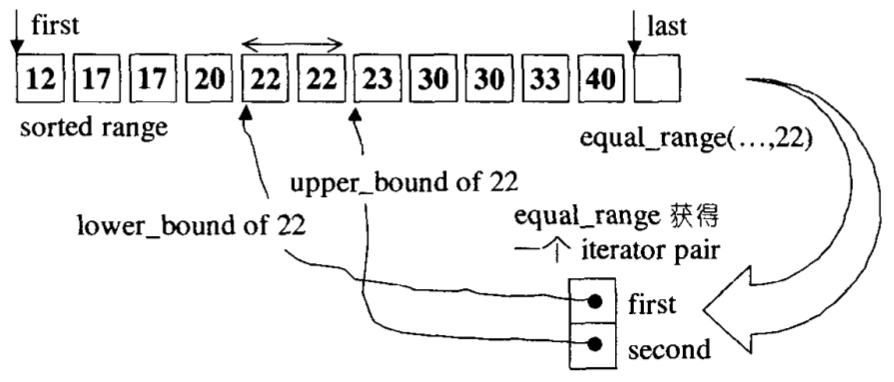 |
| lexicographical_compare  | $O(\min(m, n))$   | Checks if one sequence is lexicographically less than another.                                            |
| mismatch                 | $O(\min(m, n))$   | Finds the first position where two sequences differ and returns a pair of iterators to the mismatched elements.<br>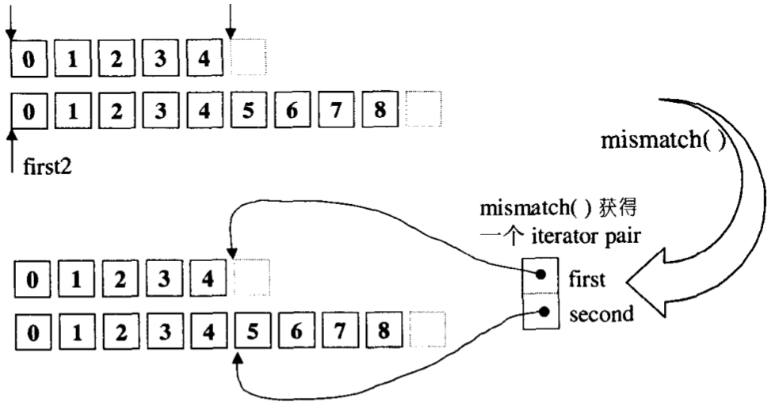 |

```c++
#include <iostream>
#include <vector>
#include <algorithm>

int main()
{
    std::vector<int> e1{1, 2, 3, 4, 5};
    std::vector<int> e2{1, 2, 3, 4};
    bool ret_e;
    ret_e = std::equal(e1.begin(), e1.end(), e2.begin());  // ret_e: false
    ret_e = std::equal(e1.begin(), e1.end(), e2.begin(), 
        [](int n1, int n2){ return n1 == n2; });           // ret_e: false
    ret_e = std::equal(e1.begin(), e1.end(), e2.begin(), 
        e2.end());                                         // ret_e: false
    ret_e = std::equal(e1.begin(), e1.end(), e2.begin(), 
        e2.end(), [](int n1, int n2){ return n1 == n2; }); // ret_e: false

    std::vector<int> er{1, 2, 3, 3, 5};
    std::pair<std::vector<int>::iterator, std::vector<int>::iterator> ret_er;
    ret_er = std::equal_range(er.begin(), 
        er.end(), 3);           // <*ret_er.first, *ret_er.second>: <3, 5>
    ret_er = std::equal_range(er.begin(), er.end(), 3, 
        [](int n1, int n2){ 
            return n1 == n2; 
        });                     // <*ret_er.first, *ret_er.second>: <5, 0>

    std::vector<int> lc1{1, 2, 3, 4};
    std::vector<int> lc2{2, 3, 4, 5};
    bool ret_lc;
    ret_lc = std::lexicographical_compare(lc1.begin(), lc1.end(), 
        lc2.begin(), lc2.end());                           // ret_lc: true
    ret_lc = std::lexicographical_compare(lc1.begin(), lc1.end(), lc2.begin(), 
        lc2.end(), [](int n1, int n2){ return n1 < n2; }); // ret_lc: true

    std::vector<int> mm1{1, 2, 3, 4, 5};
    std::vector<int> mm2{1, 2, 4, 5};
    std::pair<std::vector<int>::iterator, std::vector<int>::iterator> ret_mm;
    ret_mm = std::mismatch(mm1.begin(), mm1.end(), 
        mm2.begin());        // <*(ret_mm.first), *(ret_mm.second)>: <3, 4>
    ret_mm = std::mismatch(mm1.begin(), mm1.end(), mm2.begin(), 
        [](int n1, int n2){ 
            return n1 == n2; 
        });                  // <*(ret_mm.first), *(ret_mm.second)>: <3, 4> 
    ret_mm = std::mismatch(mm1.begin(), mm1.end(), mm2.begin(), 
        mm2.end());          // <*(ret_mm.first), *(ret_mm.second)>: <3, 4>
    ret_mm = std::mismatch(mm1.begin(), mm1.end(), mm2.begin(), mm2.end(), 
        [](int n1, int n2){ 
            return n1 == n2; 
        });                  // <*(ret_mm.first), *(ret_mm.second)>: <3, 4>
}
```

### Copying

| Algorithm         | Complexity | Notes / Illustration / Code                                                                                 |
| ----------------- | ---------- | ---------------------------------------------------------------------------------------------------------- |
| copy              | $O(n)$     | Copies elements in the specified range to another location; returns an iterator to the element past the last copied element.<br>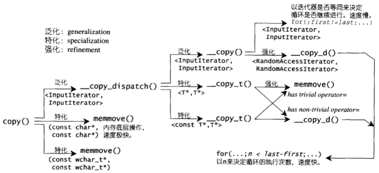 |
| copy_backward     | $O(n)$     | Copies elements to the end of another range; returns an iterator to the last copied element.<br>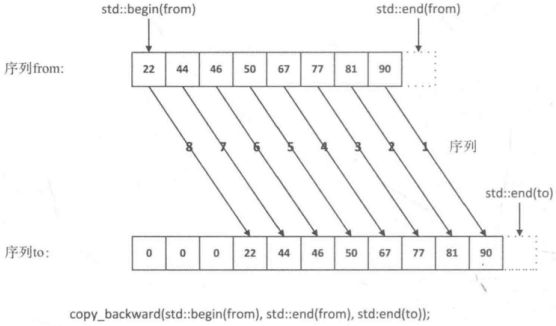 |
| copy_if           | $O(n)$     | Copies elements that satisfy a condition to another location; returns an iterator to the element past the last copied element. |
| copy_n            | $O(n)$     | Copies the first n elements from a range to another location; returns an iterator to the element past the last copied element. |
| partition_copy    | $O(n)$     | Copies the result of partitioning a range into two other ranges (original range is unchanged); returns a pair of iterators to the last copied elements. |
| remove_copy       | $O(n)$     | Copies elements to another location, skipping those equal to a specified value; returns an iterator to the last copied element. |
| remove_copy_if    | $O(n)$     | Copies elements to another location, skipping those that satisfy a condition; returns an iterator to the last copied element. |
| replace_copy      | $O(n)$     | Copies elements to another location, replacing those equal to a specified value with a new value; returns an iterator to the element past the last copied element. |
| replace_copy_if   | $O(n)$     | Copies elements to another location, replacing those that satisfy a condition with a new value; returns an iterator to the element past the last copied element. |
| reverse_copy      | $O(n)$     | Copies elements in reverse order to another location; returns an iterator to the element past the last copied element. |
| rotate_copy       | $O(n)$     | Rotates elements in a range and copies the result to another location; returns an iterator to the element past the last copied element. |
| unique_copy       | $O(n)$     | Copies elements to another location, omitting consecutive duplicates; returns an iterator to the element past the last copied element. |

For example:

```c++
#include <iostream>
#include <algorithm>
#include <vector>

int main()
{
    std::vector<int> c1{1, 2, 3, 4, 5};
    std::vector<int> c2(5);
    std::vector<int>::iterator ret_c;
    ret_c = std::copy(c1.begin(), c1.end(), 
        c2.begin());     // *ret_c: 0, c1:[1,2,3,4,5], c2:[1,2,3,4,5]

    std::vector<int> cb1{1, 2, 3, 4, 5};
    std::vector<int> cb2(5);
    std::vector<int>::iterator ret_cb;
    ret_cb = std::copy_backward(cb1.begin(), cb1.end(), 
        cb2.end());      // *ret_cb:1, cb1:[1,2,3,4,5], cb2:[1,2,3,4,5]

    std::vector<int> ci1{1, 2, 3, 4, 5};
    std::vector<int> ci2(2);
    std::vector<int>::iterator ret_ci;
    ret_ci = std::copy_if(ci1.begin(), ci1.end(), ci2.begin(), 
        [](int n){ return n % 2 == 0; }); 
                         // *ret_ci:0, ci1:[1,2,3,4,5], ci2:[2,4]

    std::vector<int> cn1{1, 2, 3, 4, 5};
    std::vector<int> cn2(2);
    std::vector<int>::iterator ret_cn;
    ret_cn = std::copy_n(cn1.begin(), 2, 
        cn2.begin());    // ret_cn:0, cn1:[1,2,3,4,5], cn2:[1,2]

    std::vector<int> pc1{1, 2, 3, 4, 5};
    std::vector<int> pc2(3);
    std::vector<int> pc3(3);
    std::pair<std::vector<int>::iterator, std::vector<int>::iterator> ret_pc;
    ret_pc = std::partition_copy(pc1.begin(), pc1.end(), pc2.begin(), pc3.begin(), 
        [](int n){ return n < 5; }); 
                         // <*ret_pc.first, *ret_pc.second>: <0, 0>
                         // pc2:[1,2,3,4,5], pc3:[1,2,3]

    std::vector<int> rc1{1, 2, 3, 4, 5};
    std::vector<int> rc2(4);
    std::vector<int>::iterator ret_rc;
    ret_rc = std::remove_copy(rc1.begin(), rc1.end(), 
        rc2.begin(), 3); // *ret_rc:0, rc1:[1,2,3,4,5], rc2:[1,2,4,5]

    std::vector<int> rci1{1, 2, 3, 4, 5};
    std::vector<int> rci2(4);
    std::vector<int>::iterator ret_rci;
    ret_rci = std::remove_copy_if(rci1.begin(), rci2.end(), rci2.begin(), 
        [](int n){ return n == 3; }); 
                         // *ret_rci:0, rci1:[1,2,3,4,5], rci2:[1,2,4,5]

    std::vector<int> rpc1{1, 2, 3, 4, 5};
    std::vector<int> rpc2{6, 7, 8};
    std::vector<int>::iterator ret_rpc;
    ret_rpc = std::replace_copy(rpc1.begin(), rpc1.end(), 
        rpc2.begin(), 2, 9); 
                         // *ret_rpc:0, rpc1:[1,2,3,4,5], rpc2:[1,9,3]

    std::vector<int> rpci1{1, 2, 3, 4, 5};
    std::vector<int> rpci2{6, 7, 8};
    std::vector<int>::iterator ret_rpci;
    ret_rpci = std::replace_copy_if(rpci1.begin(), rpci1.end(), rpci2.begin(), 
        [](int n){ return n == 2; }, 9); 
                         // *ret_rpci:0, rpci1:[1,2,3,4,5], rpci2:[1,9,3]

    std::vector<int> rvc1{1, 2, 3, 4, 5};
    std::vector<int> rvc2(5);
    std::vector<int>::iterator ret_rvc;
    ret_rvc = std::reverse_copy(rvc1.begin(), rvc1.end(), 
        rvc2.begin());   // *ret_rvc:0, rvc1:[1,2,3,4,5], rvc2:[5,4,3,2,1]

    std::vector<int> rtc1{1, 2, 3, 4, 5};
    std::vector<int> rtc2(5);
    std::vector<int>::iterator ret_rtc;
    ret_rtc = std::rotate_copy(rtc1.begin(), rtc1.begin() + 3, rtc1.end(), 
        rtc2.begin());   // *ret_rtc:0, rtc1:[1,2,3,4,5], rtc2:[4,5,1,2,3]

    std::vector<int> uc1{1, 2, 2, 3, 4, 5};
    std::vector<int> uc2(6);
    std::vector<int>::iterator ret_uc;
    ret_uc = std::unique_copy(uc1.begin(), uc1.end(), 
        uc2.begin());   // *ret_uc:0, uc1:[1,2,2,3,4,5], uc2:[1,2,3,4,5,0]
    ret_uc = std::unique_copy(uc1.begin(), uc1.end(), uc2.begin(), 
        [](int n1, int n2){ return n1 == n2; });
                        // *ret_uc:0, uc1:[1,2,2,3,4,5], uc2:[1,2,3,4,5,0]
}
```

### Move / Swap / Transform / Unique etc.

| Algorithm         | Complexity | Notes / Illustration / Code                                                                                 |
| ----------------- | ---------- | ---------------------------------------------------------------------------------------------------------- |
| iter_swap         | $O(1)$     | Swaps the elements pointed to by two iterators.                                                            |
| reverse           | $O(n/2)$   | Reverses the elements in the specified range.                                                              |
| remove            | $O(n)$     | Removes elements equal to a specified value from the range and returns an iterator to the new end.<br>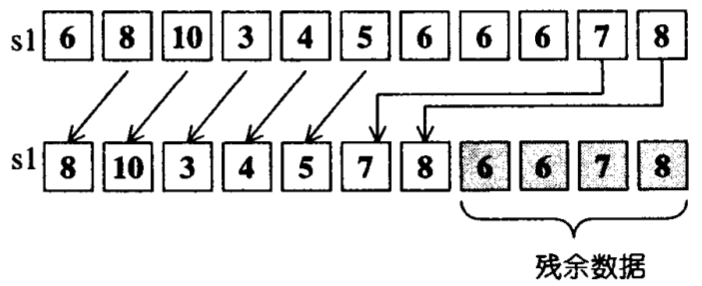 |
| remove_if         | $O(n)$     | Removes elements that satisfy a condition from the range and returns an iterator to the new end.            |
| replace           | $O(n)$     | Replaces elements equal to a specified value with a new value in the range.                                |
| replace_if        | $O(n)$     | Replaces elements that satisfy a condition with a new value in the range.                                  |
| rotate            | $O(n)$     | Rotates the elements in the range to the left; returns an iterator to the new first element.<br>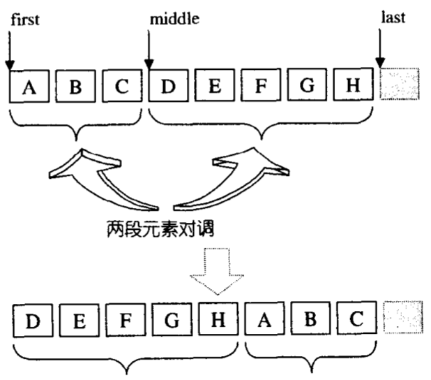 |
| move              | $O(n)$     | Moves elements from one range to another; returns an iterator to the element past the last moved element.   |
| move_backward     | $O(n)$     | Moves elements in reverse order to another range, preserving their original order; returns an iterator to the last moved element. |
| swap              | $O(n)$     | Swaps the contents of two sequences of equal length.                                                       |
| swap_ranges       | $O(n)$     | Swaps elements in the specified range with those in another range; returns an iterator to the element past the last swapped element in the second range. |
| transform         | $O(n)$     | Applies a function to each element in the range and stores the result in another location.                  |
| unique            | $O(n)$     | Removes consecutive duplicate elements in the range and returns an iterator to the new end.<br>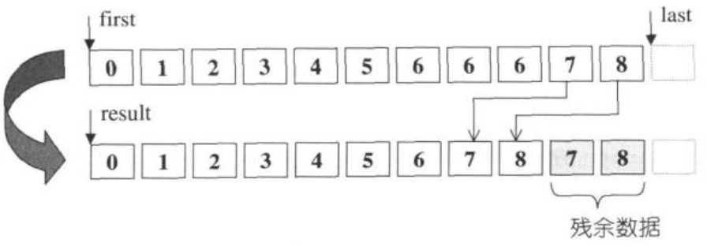 |

For example:

```c++
#include <iostream>
#include <vector>
#include <algorithm>

int main()
{
    std::vector<int> is1{1, 2, 3, 4, 5};
    std::iter_swap(is1.begin(), 
                   is1.end() - 1);             // is1: [5,2,3,4,1]

    std::vector<int> r1{1, 2, 3, 4, 5};
    std::reverse(r1.begin(), r1.end());        // r1:  [5,4,3,2,1]
    
    std::vector<int> rm1{1, 2, 3, 4, 5};
    std::vector<int>::iterator ret_rm;
    ret_rm = std::remove(rm1.begin(), rm1.end(), 
                         3);                   // *ret_rm: 5
                                               // rm1: [1,2,4,5,5]
    
    std::vector<int> rmi1{1, 2, 3, 4, 5};
    std::vector<int>::iterator ret_rmi;
    ret_rmi = std::remove_if(rmi1.begin(), rmi1.end(), 
        [](int n){ return n == 3; });         // *ret_rmi: 5
                                              // rmi1: [1,2,4,5,5]
    
    std::vector<int> rp1{1, 2, 3, 4, 5};
    std::replace(rp1.begin(), rp1.end(), 
                 3, 6);                       // rp1: [1,2,6,4,5]
    
    std::vector<int> rpi1{1, 2, 3, 4, 5};
    std::replace_if(rpi1.begin(), rpi1.end(), 
        [](int n){ return n == 3; }, 6);      // rpi1: [1,2,6,4,5]

    std::vector<int> rt1{1, 2, 3, 4, 5};
    std::vector<int>::iterator ret_rt;
    ret_rt = std::rotate(rt1.begin(), rt1.begin() + 3, 
                         rt1.end());          // *ret_rt:1
                                              // rt1: [4,5,1,2,3]
    
    std::vector<int> mv1{1, 2, 3, 4, 5};
    std::vector<int> mv2(5);
    std::vector<int>::iterator ret_mv;
    ret_mv = std::move(mv1.begin(), mv1.end(), 
                       mv2.begin());          // *ret_mv:0
                                              // mv1: [1,2,3,4,5]
                                              // mv2: [1,2,3,4,5]

    std::vector<int> mvb1{1, 2, 3, 4, 5};
    std::vector<int> mvb2(5);
    std::vector<int>::iterator ret_mvb;
    ret_mvb = std::move_backward(mvb1.begin(), mvb1.end(), 
                                 mvb2.end()); // *ret_mvb:1
                                              // mvb2: [1,2,3,4,5]

    std::vector<int> sw1{1, 2, 3, 4, 5};
    std::vector<int> sw2{6, 7, 8, 9, 10};
    std::swap(sw1, sw2);                      // sw1: [6,7,8,9,10]
                                              // sw2: [1,2,3,4,5]
    
    std::vector<int> swr1{1, 2, 3, 4, 5};
    std::vector<int> swr2{6, 7, 8, 9, 10};
    std::vector<int>::iterator ret_swr;
    ret_swr = std::swap_ranges(swr1.begin(), swr1.begin() + 2, 
                               swr2.begin()); // *ret_swr:8
                                              // swr1: [6,7,3,4,5]
                                              // swr2: [1,2,8,9,10]
    
    std::vector<int> tsf1{1, 2, 3, 4, 5};
    std::vector<int>::iterator ret_tsf;
    ret_tsf = std::transform(tsf1.begin(), tsf1.begin() + 2, tsf1.begin(),
                             [](int n){ 
                                 return ++n; 
                             });               // ret_tsf:3
                                               // tsf1: [2,3,3,4,5]

    std::vector<int> u1{1, 2, 2, 3};
    std::vector<int>::iterator ret_u;
    ret_u = std::unique(u1.begin(), u1.end()); // *ret_u:3
                                               // u1: [1,2,3,3]
}
```

### Heap operations

| Algorithm     | Complexity     | Notes / Illustration / Code                                                                   |
| ------------- | -------------- | -------------------------------------------------------------------------------------------- |
| is_heap       | $O(n)$         | Checks whether the elements in the range form a max-heap.                                     |
| is_heap_until | $O(n)$         | Finds the largest subrange that forms a max-heap and returns an iterator to the end of the heap. |
| make_heap     | $O(\log n)$   | Constructs a max-heap from the elements in the range.                                         |
| push_heap     | $O(\log n)$   | Adds an element to a max-heap.                                                                |
| pop_heap      | $O(2\log n)$  | Removes the largest element from a max-heap.                                                  |
| sort_heap     | $O(2\log n)$  | Converts a max-heap into a sorted range in ascending order.                                   |

Example (make_heap/push_heap/pop_heap):

```c++
#include <algorithm>
#include <vector>
#include <iostream>

int main() {
    std::vector<int> v{3,1,4,1,5,9,2};
    std::make_heap(v.begin(), v.end());
    std::cout << "heap top: " << v.front() << "\n"; // max-heap
    v.push_back(6);
    std::push_heap(v.begin(), v.end());
    std::cout << "after push, top: " << v.front() << "\n";
    std::pop_heap(v.begin(), v.end());
    v.pop_back();
    std::cout << "after pop, top: " << v.front() << "\n";
}
```

### Numerical Computation

| Algorithm            | Header    | Complexity        | Notes / Illustration / Code                                             |
| -------------------- | --------- | ----------------- | ------------------------------------------------------------ |
| accumulate           | numeric   | $O(n)$            | Computes the sum of elements in the specified range with an initial value and returns the result.         |
| adjacent_difference  | numeric   | $O(n)$            | Computes the difference between adjacent elements in the specified range, saves to the specified location, and returns an iterator to the element past the last written. |
| inner_product        | numeric   | ?                 | Computes the inner product of two sequences with an initial value and returns the result;<br>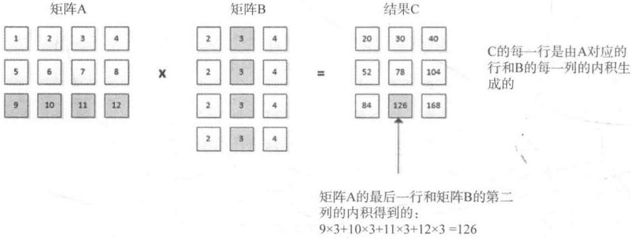 |
| iota                 | numeric   | $O(n)$            | Generates a sequentially increasing range of values starting from the given initial value and stores them at the specified location. |
| max                  | algorithm | $O(n)$            | Returns the maximum value among the given values.                                       |
| max_element          | algorithm | $O(n)$            | Returns an iterator to the maximum value among the given values.                        |
| min                  | algorithm | $O(n)$            | Returns the minimum value among the given values.                                       |
| min_element          | algorithm | $O(n)$            | Returns an iterator to the minimum value among the given values.                        |
| minmax               | algorithm | $O(\frac{3n}{2})$ | Returns a pair of the minimum and maximum values among the given values.                |
| minmax_element       | algorithm | $O(\frac{3n}{2})$ | Returns a pair of iterators to the minimum and maximum values among the given values.   |
| partial_sum          | numeric   | $O(n)$            | Computes the partial sums of elements in the specified range, saves the results to the specified location, and returns an iterator to the element past the last written. |

```c++
#include <iostream>
#include <vector>
#include <numeric>
#include <algorithm>

int main()
{
    std::vector<int> a1{1, 2, 3, 4};
    int ret_a = 0;
    ret_a = std::accumulate(a1.begin(), a1.end(), 
                            1);                 // ret_a: 11
    ret_a = std::accumulate(a1.begin(), a1.end(), 1, 
        [](int n1, int n2){ return n2 - n1; }); // ret_a: 3
    
    std::vector<int> ad1{1, 2, 3, 4};
    std::vector<int> ad2(2);
    std::vector<int>::iterator ret_ad;
    ret_ad = std::adjacent_difference(ad1.begin(), ad1.end(), 
        ad2.begin());                           // *ret_ad: 0, ad2: [1,1]
    ret_ad = std::adjacent_difference(ad1.begin(), ad1.end(), ad2.begin(), 
        [](int n1, int n2){ return n1 + n2; }); // *ret_ad: 0, ad2: [1,3]

    std::vector<int> ip1{0, 1, 2, 3, 4};
    std::vector<int> ip2{5, 4, 2, 3, 1};
    int ret_ip = 0;
    ret_ip = std::inner_product(ip1.begin(), ip1.end(), ip2.begin(), 
                                0);             // *ret_ip: 21
    ret_ip = std::inner_product(ip1.begin(), ip1.end(), ip2.begin(), 0, 
      std::plus<>(),
      std::equal_to<>());                       // *ret_ip: 2

    std::vector<int> i1(5);
    std::iota(i1.begin(), i1.end(), 2);         // i1: [2,3,4,5,6]
    
    int ret_max = 0;
    ret_max = std::max(1, 2);                   // ret_max: 2
    ret_max = std::max(1, 2, 
        [](int n1, int n2){ return n1 > n2; }); // ret_max: 1
    ret_max = std::max({1, 2, 3, 4, 5});        // ret_max: 5
    ret_max = std::max({1, 2, 3, 4, 5}, [](int n1, int n2){ 
        return n1 < n2 && n2 % 2 == 0; 
    });                                         // ret_max: 4
    
    std::vector<int> max_e1{1, 2, 3, 4, 5};
    std::vector<int>::iterator ret_max_e;
    ret_max_e = std::max_element(max_e1.begin(), 
                                 max_e1.end()); // *ret_max_e: 5
    ret_max_e = std::max_element(max_e1.begin(), max_e1.end(), 
                                 [](int n1, int n2){ 
                                     return n1 < n2; 
                                 });            // *ret_max_e: 5
    
    int ret_min = 0;
    ret_min = std::min(1, 2);                   // ret_min: 1
    ret_min = std::min(1, 2, [](int n1, int n2){ 
        return n1 > n2; 
    });                                         // ret_min: 2
    ret_min = std::min({5, 4, 3, 2, 1});        // ret_min: 1
    ret_min = std::min({5, 4, 3, 2, 1}, [](int n1, int n2){ 
        return n1 < n2 && n1 % 2 == 0; 
    });                                         // ret_min: 2

    std::vector<int> min_e1{1, 2, 3, 4, 5};
    std::vector<int>::iterator ret_min_e;
    ret_min_e = std::min_element(min_e1.begin(), 
                                 min_e1.end()); // *ret_min_e: 1
    ret_min_e = std::min_element(min_e1.begin(), min_e1.end(), 
                                 [](int n1, int n2){ 
                                     return n1 < n2; 
                                 });            // *ret_min_e: 1
    
    std::pair<int, int> ret_mm;
    ret_mm = std::minmax(1, 2); // <ret_mm.first, ret_mm.second>: <1, 2>
    ret_mm = std::minmax(1, 2, [](int n1, int n2){ 
        return n1 < n2; 
    });                         // <ret_mm.first, ret_mm.second>: <1, 2>
    ret_mm = std::minmax(
        {1, 2, 3, 4, 5}
    );                          // <ret_mm.first, ret_mm.second>: <1, 5>
    ret_mm = std::minmax({1, 2, 3, 4, 5}, [](int n1, int n2){ 
        return n1 < n2; 
    });                         // <ret_mm.first, ret_mm.second>: <1, 5>

    std::vector<int> mme1{1, 2, 3, 4, 5};
    std::pair<std::vector<int>::iterator, std::vector<int>::iterator> ret_mme;
    ret_mme = std::minmax_element(mme1.begin(), 
        mme1.end());           // <*ret_mme.first, *ret_mme.second>: <1, 5>
    ret_mme = std::minmax_element(mme1.begin(), mme1.end(), 
        [](int n1, int n2){ 
            return n1 < n2; 
        });                    // <*ret_mme.first, *ret_mme.second>: <1, 5>

    std::vector<int> ps1{1, 2, 3, 4, 5};
    std::vector<int> ps2(5);
    std::vector<int>::iterator ret_ps;
    ret_ps = std::partial_sum(ps1.begin(), ps1.end(), 
        ps2.begin());            // *ret_ps: 0, ps2: [1,3,6,10,15]
    ret_ps = std::partial_sum(ps1.begin(), ps1.end(), ps2.begin(), 
        std::multiplies<int>()); // *ret_ps: 0, ps2: [1,2,6,24,120]
}
```

### Function Objects

| Algorithm     | Header     | Notes / Illustration / Code |
| ------------- | ---------- | ---------------- |
| bit_and       | functional | `x & y`          |
| bit_not       | functional | `~x`             |
| bit_or        | functional | `x | y`          |
| bit_xor       | functional | `x ^ y`          |
| divides       | functional | `x / y`          |
| equal_to      | functional | `x == y`         |
| greater       | functional | `x > y`          |
| greater_equal | functional | `x >= y`         |
| less          | functional | `x < y`          |
| less_equal    | functional | `x <= y`         |
| logical_and   | functional | `x && y`         |
| logical_not   | functional | `!x`             |
| logical_or    | functional | `x || y`         |
| minus         | functional | `x - y`          |
| modulus       | functional | `x % y`          |
| multiplies    | functional | `x * y`          |
| negate        | functional | `-x`             |
| not_equal_to  | functional | `x != y`         |
| plus          | functional | `x + y`          |

```c++
#include <iostream>
#include <functional>
#include <vector>
#include <algorithm>

int main()
{
    std::vector<int> v1{0x1, 0x0, 0x0};
    std::vector<int> v2{0x1, 0x1, 0x1};
    std::vector<int> v3(3);
    
    std::fill(v3.begin(), v3.end(), 0);
    std::transform(std::begin(v1), std::end(v1), std::begin(v2), 
                   std::begin(v3), std::bit_and<int>());  // v3: [1,0,0]

    std::fill(v3.begin(), v3.end(), 0);
    std::transform(std::begin(v1), std::end(v1), std::begin(v3), 
                   std::bit_not<int>());                  // v3: [-2,-1,-1]

    std::fill(v3.begin(), v3.end(), 0);
    std::transform(std::begin(v1), std::end(v1), std::begin(v2), 
                   std::begin(v3), std::bit_or<int>());   // v3: [1,1,1]
    
    std::fill(v3.begin(), v3.end(), 0);
    std::transform(std::begin(v1), std::end(v1), std::begin(v2), 
                   std::begin(v3), std::bit_xor<int>());  // v3: [0,1,1]

    std::fill(v3.begin(), v3.end(), 0);
    std::transform(std::begin(v1), std::end(v1), std::begin(v2), 
                   std::begin(v3), std::divides<int>());  // v3: [1,0,0]

    std::fill(v3.begin(), v3.end(), 0);
    std::transform(std::begin(v1), std::end(v1), std::begin(v2), 
                   std::begin(v3), std::equal_to<int>()); // v3: [1,0,0]

    std::fill(v3.begin(), v3.end(), 0);
    std::transform(std::begin(v1), std::end(v1), std::begin(v2), 
                   std::begin(v3), std::greater<int>());  // v3: [0,0,0]

    std::fill(v3.begin(), v3.end(), 0);
    std::transform(std::begin(v1), std::end(v1), std::begin(v2), 
        std::begin(v3), std::greater_equal<int>());       // v3: [1,0,0]

    std::fill(v3.begin(), v3.end(), 0);
    std::transform(std::begin(v1), std::end(v1), std::begin(v2), 
                   std::begin(v3), std::less<int>());     // v3: [0,1,1]

    std::fill(v3.begin(), v3.end(), 0);
    std::transform(std::begin(v1), std::end(v1), std::begin(v2), 
        std::begin(v3), std::less_equal<int>());          // v3: [1,1,1]

    std::fill(v3.begin(), v3.end(), 0);
    std::transform(std::begin(v1), std::end(v1), std::begin(v2), 
        std::begin(v3), std::logical_and<int>());         // v3: [1,0,0]

    std::fill(v3.begin(), v3.end(), 0);
    std::transform(std::begin(v1), std::end(v1), std::begin(v3), 
                   std::logical_not<int>());              // v3: [0,1,1]

    std::fill(v3.begin(), v3.end(), 0);
    std::transform(std::begin(v1), std::end(v1), std::begin(v2), 
        std::begin(v3), std::logical_or<int>());          // v3: [1,1,1]

    std::fill(v3.begin(), v3.end(), 0);
    std::transform(std::begin(v1), std::end(v1), std::begin(v2), 
                   std::begin(v3), std::minus<int>());    // v3: [0,-1,-1]

    std::fill(v3.begin(), v3.end(), 0);
    std::transform(std::begin(v1), std::end(v1), std::begin(v2), 
                   std::begin(v3), std::modulus<int>());  // v3: [0,0,0]

    std::fill(v3.begin(), v3.end(), 0);
    std::transform(std::begin(v1), std::end(v1), std::begin(v2), 
        std::begin(v3), std::multiplies<int>());          // v3: [1,0,0]

    std::fill(v3.begin(), v3.end(), 0);
    std::transform(std::begin(v1), std::end(v1), std::begin(v3), 
                   std::negate<int>());                   // v3: [-1,0,0]

    std::fill(v3.begin(), v3.end(), 0);
    std::transform(std::begin(v1), std::end(v1), std::begin(v2), 
        std::begin(v3), std::not_equal_to<int>());        // v3: [0,1,1]

    std::fill(v3.begin(), v3.end(), 0);
    std::transform(std::begin(v1), std::end(v1), std::begin(v2), 
                   std::begin(v3), std::plus<int>());     // v3: [2,1,1]
}
```

### Other

| Algorithm | Complexity | Notes / Illustration / Code                               |
| --------- | ---------- | ---------------------------------------------- |
| for_each  | $O(n)$     | Applies a function to each element in the specified range.                 |
| count     | $O(n)$     | Counts the number of elements equal to a specified value in the range and returns the result. |
| count_if  | $O(n)$     | Counts the number of elements in the range that satisfy a condition and returns the result.       |

```c++
#include <iostream>
#include <vector>
#include <algorithm>

int main()
{
    std::vector<int> fe1{1, 2, 3, 4, 5};
    std::for_each(fe1.begin(), fe1.end(), 
                  [](int &n){ n++; }); // fe1: [2,3,4,5,6]
    
    std::vector<int> ct1{1, 2, 3, 4, 5};
    size_t ret_ct = std::count(ct1.begin(), ct1.end(), 
                               3);     // ret_ct: 1
    
    std::vector<int> cti1{1, 2, 3, 4, 5};
    size_t ret_cti = std::count_if(cti1.begin(), cti1.end(), 
                                   [](int n){ 
                                       return n % 2 == 0; 
                                   }); // ret_cti: 2
}
```

---


## I/O streams

- iostreams are the standard C++ I/O facility: std::istream/std::ostream and derived types (fstream, stringstream).
- ios_base contains format flags and locale management (flags(), precision(), width(), imbue()).
- Avoid mixing C stdio and C++ iostreams unless sync_with_stdio(false) is used carefully for performance.

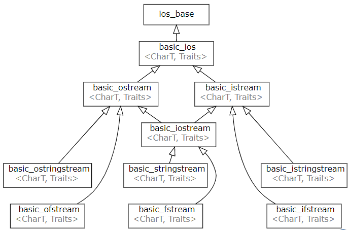

### ios_base

`std::ios_base` contains formatting flags and locale/format control.

Member functions and notes (selected):

| Member | Description |
|---|---|
| flags / setf / unsetf | set or modify formatting flags (dec, oct, hex, left/right/internal, scientific/fixed, boolalpha, showbase, showpoint, showpos, skipws, unitbuf, uppercase, etc.) |
| precision | set/return floating-point precision |
| width | set/return field width |
| sync_with_stdio | control interoperability with C stdio |
| imbue / getloc | locale management |
| iword / pword / xalloc | access per-stream custom storage |
| register_callback | register stream event callbacks (called in reverse order) |

### basic_ios

| Member Function | Description |
| --------------- | ------------------------------------------------------------ |
| good            | Checks if **no** error has occurred. |
| eof             | Checks if the end of file has been reached. |
| fail            | Checks if a recoverable error has occurred. |
| bad             | Checks if an unrecoverable error has occurred. |
| rdstate         | Returns the current error state. |
| setstate        | Sets error state flags; <br>  - `std::ios_base::goodbit`: no error;<br>  - `std::ios_base::badbit`: unrecoverable stream error;<br>  - `std::ios_base::failbit`: input/output operation failed (format or extraction error);<br>  - `std::ios_base::eofbit`: associated output sequence has reached end of file; |
| clear           | Modifies the state flags. |
| copyfmt         | Copies formatting information from another stream (everything except rdstate and rdbuf). |
| fill            | Sets the fill character and returns the previous fill character. |
| exceptions      | Gets and sets the stream's exception mask (see error state flags). |
| rdbuf           | Sets/returns the associated stream buffer. |
| tie             | Sets/returns the tied stream (output stream). |
| narrow          | Narrows a specified character (converts from `char_type` to `char`), returns the narrowed value if successful, otherwise returns the specified value. |
| widen           | Widens a character, converts a character to its equivalent in the current locale, and returns it. |
| set_rdbuf       | Replaces `rdbuf` without clearing its error state. |

### istream

| Member Function | Description |
| --------------- | ------------------------------------------------------------ |
| gcount          | Number of characters extracted by the last unformatted input operation. |
| get             | Reads and extracts one character from the stream. |
| getline         | Reads and extracts characters until a given character is found. |
| ignore          | Reads, extracts, and discards a specified number of characters, until a given value is found (default is eof). |
| read            | Reads and extracts a specified number of characters as a block. |
| readsome        | Reads and extracts a specified number of already available characters as a block. |
| peek            | Reads but does not extract one character. |
| putback         | Puts a character back into the input stream. |
| seekg           | Sets the input position indicator; <br>- `std::istream::beg`: beginning of the stream;<br>- `std::istream::end`: end of the stream;<br>- `std::istream::cur`: current position of the stream position indicator; |
| sync            | Synchronizes data to the underlying device. |
| tellg           | Returns the current input position indicator. |
| unget           | Undoes a get operation. |


```c++
#include <iostream>
#include <sstream>

void cb(std::ios_base::event evt, std::ios_base& str, int idx) {str.pword(idx);}

int main()
{
    std::istringstream ss1{
        "1234567\n"
        "abcdefg\n"
        "ABCDEFG"
    };
    std::istringstream ss2{"1234567"};
    std::istream i1{ss1.rdbuf()};         // i1: [
                                          //   1234567
                                          //   abcdefg
                                          //   ABCDEFG
                                          // ]
    std::istream i2{ss2.rdbuf()};         // i2: [1234567]

    bool ret_b = i1.bad();                // ret_b: false

    i1.clear();                           // i1: [
                                          //   1234567
                                          //   abcdefg
                                          //   ABCDEFG
                                          // ]

    i1.copyfmt(i2);                       // i1: [
                                          //   1234567
                                          //   abcdefg
                                          //   ABCDEFG
                                          // ]

    bool ret_eof = i1.eof();              // ret_eof: false

    std::ios_base::iostate ret_exp = 
        i1.exceptions();                  // ret_exp: NULL
    i1.exceptions(ret_exp);               // ret_exp: NULL

    bool ret_f = i1.fail();               // ret_f: false

    char ret_fill = i1.fill();            // ret_fill: 
    ret_fill = i1.fill('0');              // ret_fill: 
    
    std::ios_base::fmtflags ret_flg = 
        i1.flags();                       // ret_flg (binary): 1000000000010
    ret_flg = 
        i1.flags(std::ios_base::hex);     // ret_flg (binary): 1000000000010
    ret_flg = 
        i1.flags(std::ios_base::skipws);  // ret_flg (binary): 0000000001000

    std::streamsize ret_gc = i1.gcount(); // ret_gc: 0

    char ret_g1;
    char ret_g2[2];
    std::istringstream ret_g3{};
    i1.get(ret_g1);                       // i1: [
                                          //   234567
                                          //   abcdefg
                                          //   ABCDEFG
                                          // ]
    i1.get(ret_g2, 2);                    // i1: [
                                          //   34567
                                          //   abcdefg
                                          //   ABCDEFG
                                          // ]
    i1.get(ret_g2, 3, '5');               // i1: [
                                          //   567
                                          //   abcdefg
                                          //   ABCDEFG
                                          // ]
    i1.get(*ret_g3.rdbuf(), '6');         // i1: []
    i1.get(*ret_g3.rdbuf());              // i1: []

    char ret_gl[10];
    i2.getline(ret_gl, 10);               // i2: [], ret_gl: [123456]
    i2.getline(ret_gl, 10, 'C');          // i2: [], ret_gl: []

    std::locale ret_lc = i1.getloc();

    bool ret_g = i1.good();               // ret_g: false

    i1.ignore(1);                         // i1: []
    i1.ignore(2, 'E');                    // i1: []

    i1.imbue(ret_lc);

    long ret_iw = i1.iword(1);            // ret_iw: 0

    char ret_c = i1.narrow('G', 'N');     // ret_c: G

    char ret_r[7];
    i1.read(ret_r, 1);                    // ret_r: 

    char ret_rs[7];
    i1.readsome(ret_rs, 7);               // ret_rs: 

    i1.register_callback(cb, 1);

    std::streambuf *ret_rd;
    ret_rd = i1.rdbuf();
    ret_rd = i1.rdbuf(ret_g3.rdbuf());

    std::ios_base::iostate ret_rds = 
        i1.rdstate();                     // ret_rds: 0

    char ret_p = i1.peek();               // ret_p: 

    std::streamsize ret_pr = i1.precision();
    i1.precision(2);

    i1.putback('G');                      // i1: []

    void* ret_pw = i1.pword(1);

    i1.seekg(0);
    i1.seekg(1, std::istream::beg);

    i2.setf(std::ios_base::dec);
    i2.setf(std::ios_base::dec, std::ios_base::showpos);

    // i2.set_rdbuf(i1.rdbuf());

    i2.setstate(std::ios_base::goodbit);

    i1.sync();

    i1.sync_with_stdio(true);

    std::streampos ret_tg = i1.tellg();

    std::ostream *ret_tie;
    ret_tie = i1.tie();
    ret_tie = i1.tie(&std::cout);

    i1.unget();

    i1.unsetf(std::ios_base::dec);

    char ret_wd = i1.widen('c');

    std::streamsize ret_w;
    ret_w = i1.width();
    ret_w = i1.width(8);

    int ret_x = i1.xalloc();
}
```


### ostream

| Member Function | Description |
| --------------- | ------------------------ |
| flush           | Synchronize with the underlying storage device. |
| put             | Insert a character. |
| seekp           | Set the output position indicator. |
| tellp           | Return the current output position indicator. |
| write           | Insert a block of characters. |

```c++
#include <iostream>
#include <sstream>

void cb(std::ios_base::event evt, std::ios_base& str, int idx) {str.pword(idx);}

int main()
{
    std::istringstream ss1{
        "1234567\n"
        "abcdefg\n"
        "ABCDEFG"
    };
    std::ostream os1{ss1.rdbuf()};

    bool ret_b = os1.bad(); // ret_b:

    os1.clear(); // os1:

    os1.copyfmt(os1);

    bool ret_eof = os1.eof();

    std::ios_base::iostate ret_exp = os1.exceptions(); // ret_exp: NULL
    os1.exceptions(ret_exp);                           // ret_exp: NULL

    bool ret_f = os1.fail(); // ret_f:

    char ret_fill = os1.fill(); // ret_fill:
    ret_fill = os1.fill('0'); // ret_fill:

    std::ios_base::fmtflags ret_flg = os1.flags();
    ret_flg = os1.flags(std::ios_base::hex);
    ret_flg = os1.flags(std::ios_base::skipws);

    os1.flush();

    std::locale ret_lc = os1.getloc();

    bool ret_g = os1.good();

    os1.imbue(ret_lc);

    long ret_iw = os1.iword(1);

    char ret_n = os1.narrow('G', 'N'); // ret_n:

    std::streamsize ret_pr = os1.precision();
    os1.precision(2);

    void* ret_pw = os1.pword(1);

    os1.register_callback(cb, 1);

    std::streambuf *ret_rd;
    ret_rd = os1.rdbuf();
    ret_rd = os1.rdbuf(ss1.rdbuf());

    std::ios_base::iostate ret_rds = os1.rdstate(); // ret_rds:

    os1.seekp(1);
    os1.seekp(0, std::ios_base::beg);

    os1.setf(std::ios_base::dec);
    os1.setf(std::ios_base::dec, std::ios_base::showpos);

    // os1.set_rdbuf(os1.rdbuf());

    os1.setstate(std::ios_base::goodbit);

    os1.sync_with_stdio(true);

    std::streampos ret_tp = os1.tellp();

    std::ostream *ret_tie;
    ret_tie = os1.tie();
    ret_tie = os1.tie(&std::cout);

    os1.unsetf(std::ios_base::dec);

    char ret_wd = os1.widen('c');

    std::streamsize ret_w;
    ret_w = os1.width();
    ret_w = os1.width(8);

    char cs[5] = {'h', 'e', 'l', 'l', 'o'};
    os1.write(cs, 5);

    int ret_x = os1.xalloc();
}
```


### ifstream

| Member Function | Description |
| --------------- | ------------------------------------------------------------ |
| close           | Close the associated file. |
| is_open         | Check if the stream has an associated file. |
| open            | Open a file and associate it with the stream;<br>Open modes:<br>  - `std::ios::app`: seek to the end before each write;<br>  - `std::ios::binary`: open in binary mode;<br>  - `std::ios::in`: open for reading;<br>  - `std::ios::out`: open for writing;<br>  - `std::ios::trunc`: discard the contents when opening;<br>  - `std::ios::ate`: seek to the end immediately after opening; |

```c++
#include <fstream>
#include <iostream>

int main()
{
    std::ifstream f1;
    std::ifstream f2{std::move(f1)};

    f1.open("007.txt", std::ios_base::in);
    
    bool ret_iop = f1.is_open();

    f1.close();
}
```


### ofstream

| Member Function | Description |
| --------------- | -------------------------- |
| close           | Close the associated file. |
| is_open         | Check if the stream has an associated file. |
| open            | Open a file and associate it with the stream. |

```c++
#include <fstream>

int main()
{
    std::ofstream of1{};
    std::ofstream of2{std::move(of1)};

    of1.open("/mnt/c/Work/src/test/007.txt", std::ios::out);

    bool ret_iop = of1.is_open();

    of1.close();
}
```

---


## Time

### duration

| Member Function | Description |
| --------------- | -------------------------- |
| count           | Returns the count of ticks. |
| min             | Returns the duration with the lowest possible value. |
| max             | Returns the duration with the largest possible value. |
| zero            | (static) Returns a zero-length duration. |

```c++
#include <chrono>

std::chrono::hours operator"" _h(unsigned long long n) { 
    return std::chrono::hours(n); };
std::chrono::seconds operator"" _s(unsigned long long n) { 
    return std::chrono::seconds(n); };

int main()
{
    std::chrono::duration<int> d1{60};
    std::chrono::duration<int, std::milli> d2{1500};
    std::chrono::duration<double, std::ratio<60> > d3{60};
    std::chrono::duration<double, std::ratio<1, 30> > d4{3.5};
    std::chrono::milliseconds d5{1000}; 

    int ret_ct = d1.count();                            // ret_ct: 60

    std::chrono::duration<int, std::milli> ret_zero = 
        std::chrono::duration<int, std::milli>::zero(); // ret_zero.count: 0 

    std::chrono::duration<int, std::milli> ret_min = 
        d2.min();                                       // ret_min.count: -21474...

    std::chrono::duration<int, std::milli> ret_max = 
        d2.max();                                       // ret_max.count: 21474...

    std::chrono::seconds ret_sec = std::chrono::duration_cast<
        std::chrono::seconds>(d2);                      // ret_sec.count(): 1

    std::chrono::hours h = 5_h;                         // h.count(): 5
    std::chrono::seconds s = 30_s;                      // s.count(): 30
}
```


### time_point

- `system_clock`: The current real system clock time.
- `steady_clock`: A clock suitable for measuring intervals.
- `high_resolution_clock`: A clock with the smallest tick period available on the system.

| Member Function/Variable | Description |
| ------------------------ | ----------------------------------- |
| from_time_t              | (static) Converts a `std::time_t` to a time point. |
| max                      | Returns the time point with the largest possible duration. |
| min                      | Returns the time point with the smallest possible duration. |
| now                      | (static) Returns the current time point. |
| time_point_cast          | (static) Converts a time point. |
| time_sinc_epoch()        | Returns the time since the clock's epoch. |
| to_time_t                | (static) Converts a time point to `std::time_t`. |

```c++
#include <chrono>

using SysTimePoint = std::chrono::time_point<std::chrono::system_clock>;
using SteadyTimePoint = std::chrono::time_point<std::chrono::steady_clock>;
using HTimePoint = std::chrono::time_point<std::chrono::high_resolution_clock>;

int main()
{
    SysTimePoint tp1{std::chrono::minutes(1)};
    SysTimePoint tp2{std::chrono::duration<int>(20)};
    SteadyTimePoint tp3{std::chrono::minutes(1)};
    SteadyTimePoint tp4{std::chrono::duration<int>(20)};
    HTimePoint tp5{std::chrono::minutes(1)};
    HTimePoint tp6{std::chrono::duration<int>(20)};

    std::chrono::system_clock::duration ret_tse1 = tp1.time_since_epoch();
    std::chrono::steady_clock::duration ret_tse2 = tp3.time_since_epoch();
    std::chrono::high_resolution_clock::duration ret_tse3 = tp5.time_since_epoch();

    std::chrono::duration<double> ret_dc1 = 
        std::chrono::duration_cast<std::chrono::duration<double> >(
            std::chrono::duration<int>(20)
    );

    std::chrono::time_point<std::chrono::system_clock, std::chrono::seconds> tp_sec = 
        std::chrono::time_point_cast<std::chrono::seconds>(tp1);

    std::chrono::system_clock::time_point ret_now1 = 
        std::chrono::system_clock::now();
    std::chrono::steady_clock::time_point ret_now2 = 
        std::chrono::steady_clock::now();
    std::chrono::high_resolution_clock::time_point ret_now3 = 
        std::chrono::high_resolution_clock::now();

    std::time_t t1 = std::chrono::system_clock::to_time_t(std::chrono::system_clock::now());
    std::time_t t3 = std::chrono::high_resolution_clock::to_time_t(std::chrono::high_resolution_clock::now());

    tm *tm4 = std::localtime(&t1);
}
```

### put_time

TODO


---


## Others

### function, bind, and ref

(C++11) `std::function` is a callable object wrapper, which can wrap various callable entities in C++. With `std::bind`, you can bind parameters to a callable object to form a new callable object.

```c++
#include <iostream>
#include <functional>

int f1(int x, int &y, int z = 1) { 
    std::cout << "x:" << x << ",y:" << y << ",z:" << z << std::endl; };
struct Foo { 
    int f2(int x, int &y, int z = 1) { 
        std::cout << "x:" << x << ",y:" << y << ",z:" << z << std::endl; }; 
};
auto f3 = [](int x, int &y, int z = 1) { 
    std::cout << "x:" << x << ",y:" << y << ",z:" << z << std::endl; };

int main()
{
    int y = 2;
    // Bind a normal function
    auto fun1 = std::bind(f1, 
                          std::placeholders::_1,  // occupies the 1st parameter
                          std::ref(y),            // pass reference to the 2nd parameter
                          std::placeholders::_2); // occupies the 3rd parameter
    fun1(1, 3); // x:1,y:2,z:3

    // Bind a class member function
    Foo foo{};
    auto fun2 = std::bind(&Foo::f2, &foo, 
                          std::placeholders::_1, 
                          std::ref(y), 
                          std::placeholders::_2); 
    fun2(1, 3); // x:1,y:2,z:3

    // Bind a lambda
    auto fun3 = std::bind(f3, 
                          std::placeholders::_1, 
                          std::ref(y), 
                          std::placeholders::_2);
    fun3(1, 3); // x:1,y:2,z:3
}
```


### optional

(C++17) `std::optional` can hold an object or `nullopt` (which means empty).

There are several ways to create an optional:

- Directly create or assign with nullopt

    ```c++
    std::optional<int> empty;
    std::optional<int> opt = std::nullopt;
    ```

- Initialize with an object

    ```c++
    std::optional<int> opt = 1;
    Some s;
    std::optional<Some> opt = s;
    ```

- Construct with `std::make_optional` (like `std::make_shared`), can pass arguments

    ```c++
    optional<Some> opt = std::make_optional<Some>(1);
    ```

- Construct with `std::in_place`

    ```c++
    optional<Some> opt = std::in_place<Some>(1);
    ```

```c++
#include <iostream>
#include <optional>
using namespace std;

int main()
{
  std::optional<int> pp = 1;
    if (pp) { cout << *pp << endl; } // 1
    pp = nullopt;
    if (pp) { cout << *pp << endl; } // no output
}
```


### && and move

`&&` is called a universal reference (or reference collapsing). When an rvalue is passed through `&&`, it remains an rvalue.

(C++11) `std::move` performs an unconditional cast to an rvalue type; it transfers ownership of an object from one object to another, only transferring ownership without moving or copying memory.

C++ uses `std::move` to convert an lvalue to an rvalue, and with `&&` can efficiently pass parameters.

Use cases:

- Avoid the cost of copying data members when passing parameters;
- Conditionally perform forced type conversion.

```c++
#include <iostream>
#include <string>

int main()
{
    std::string x{"hello"};
    std::string y{};
    y = std::move(x);
    std::cout << "x:" << x << ", y:" << y << std::endl; // x:, y:hello
}
```


### enable_shared_from_this

If a class T inherits from `std::enable_shared_from_this<T>`, it provides the member function `shared_from_this`. When an object t of type T is managed by a `std::shared_ptr<T>` named pt, calling `T::shared_from_this` will return a new `std::shared_ptr<T>` that shares ownership of t with pt.

Example:

```c++
#include <memory>
#include <iostream>
struct Good : std::enable_shared_from_this<Good>
{
public:
    std::shared_ptr<Good> getptr() {
        return shared_from_this();
    }
    ~Good() { std::cout << "Good::~Good() called" << std::endl; }
};
int main()
{
    { // 限定作用域，确保智能指针在system("pause")之前析构
        std::shared_ptr<Good> gp1(new Good());
        std::shared_ptr<Good> gp2 = gp1->getptr();
        std::cout << gp1.use_count() << std::endl;
        std::cout << gp2.use_count() << std::endl;
    }
    system("pause");
}
```


---


## Best Practices

### 1. Choose the Right Algorithm

Sorting algorithms:

| Requirement                                                    | sort | stable_sort | partial | stable_partition | nth_element |
| -------------------------------------------------------------- | ---- | ----------- | ------- | ---------------- | ----------- |
| Need to fully sort elements in vector, string, deque, or array | *    | *           |         |                  |             |
| Only need to sort the first n equivalent elements              |      |             | *       |                  |             |
| Need to find the nth element or the first n equivalent elements without sorting them |      |             |         |                  | *           |
| Need to partition elements in a standard sequence container by a condition |      |             | *       | *                |             |
| Need to sort data in a list                                    |      |             | *       | *                |             |

[TOP](#STL)


### 2. Choose the Right Container

| Requirement                                                    | vector | list | deque | set<br>multiset | map<br>multimap | stack | queue<br>priority queues |
| -------------------------------------------------------------- | ------ | ---- | ----- | --------------- | --------------- | ----- | ------------------------ |
| Insert new elements at any position                            | *      | *    | *     |                 |                 |       |                          |
| Don't care about element order                                 |        |      |       |                 |                 |       |                          |
| Random access iterator                                         | *      |      | *     |                 |                 |       |                          |
| Avoid moving existing elements on insert/delete                |        | *    |       | *               | *               |       |                          |
| Data layout needs to be C-compatible                           | *      |      |       |                 |                 |       |                          |
| Sensitive to element lookup speed                              | *      |      |       | *               | *               |       |                          |
| Minimize invalidation of iterators, pointers, or references    |        | *    |       |                 |                 |       |                          |
| Use random access iterator, no delete, insert only at end      |        |      | *     |                 |                 |       |                          |

[TOP](#STL)


### 3. Prefer empty() over size()==0 for Checking Emptiness

- empty() is **constant time** for all standard containers and is often inlined, while size() can be **linear time** for some lists.

[TOP](#STL)


### 4. Prefer Range Member Functions over Single-Element Functions

- Using range member functions usually results in less code.
- Range member functions make code clearer and more direct.
- Single-element functions require more allocator calls, more frequent object copies, and redundant operations.
- Use assign instead of operator= when assigning a new set of values to a container.

Single-element insertion:

```c++
int data[numValues];
vector<int> v;
vector<int>::iterator insertLoc(v.begin());
for (int i = 0; i < numValues; ++i) {
        insertLoc = v.insert(insertLoc, data[i]);
        ++insertLoc;
}
```

Range insertion:

```c++
int data[numValues];
vector<int> v;
|max_size |$O(1)$ |返回容器能容纳的最大元素个数（取决于`std::numeric_limits<diference_type>::max()`的定义）。 |
```

[TOP](#STL)


### 5. Beware of C++'s Most Vexing Parse—Code May Be Interpreted as a Function Declaration

Incorrect:

```c++
list<int> data(istream_iterator<int>(dataFile), 
                                istream_iterator<int>()); // Interpreted as a pointer to a function returning istream_iterator<int>
```

Correct:

```c++
istream_iterator<int> dataBegin(dataFile);
istream_iterator<int> dataEnd;
list<int> data(dataBegin, dataEnd);
```

[TOP](#STL)


### 6. If a Container Holds Pointers Created with new, Delete Them Before the Container is Destroyed

- Pointer containers will destroy their elements, but not the objects pointed to (no delete is called).

    Incorrect:

    ```c++
    void doSomething()
    {
            vector<Widget*> vwp;
            for (int i = 0; i < SOME_MAGIC_NUMBER; ++i)
                    vwp.push_back(new Widget); // Created with new
    }
    ... // Memory leak! When vwp goes out of scope, the pointers are destroyed but not the objects.
    ```

    Correct:

    ```c++
    void doSomething()
    {
            vector<Widget*> vwp;
            for (int i = 0; i < SOME_MAGIC_NUMBER; ++i)
                    vwp.push_back(new Widget); // Created with new
    
            // Manually free
            for (vector<Widget*>::iterator i = vwp.begin(); i != vwp.end(); ++i)
                    delete *i;
    }
    ```

[TOP](#STL)


### 7. Do Not Create Containers of auto_ptr

- Containers of auto_ptr are not portable.
- Copying an auto_ptr changes its value (ownership transfer).

    ```c++
    auto_ptr<Widget> pw1(new Widget); // pw1 points to a Widget.
    auto_ptr<Widget> pw2(pw1);        // pw2 takes ownership, pw1 is set to NULL.
    pw1 = pw2;                        // pw1 takes ownership, pw2 is set to NULL.
    ```

[TOP](#STL)


### 8. STL Containers Are Not Thread-Safe

- **Multiple threads reading is safe**—multiple threads can read the same container simultaneously, but no writing is allowed during reads.
- **Multiple threads writing to different containers is safe**—multiple threads can write to different containers at the same time.
- Use RAII (Resource Acquisition Is Initialization) to manually control synchronization.

    ```c++
    TODO
    ```

[TOP](#STL)


### 9. Prefer vector and string over Dynamically Allocated Arrays

- In most cases, use vector and string instead of dynamically allocated arrays.
- In multithreaded environments, prefer built-in arrays over reference-counted strings, as string's reference counting can hurt performance.

[TOP](#STL)


### 10. Use reserve to Avoid Unnecessary Reallocation

- Use reserve early to set container capacity large enough to avoid reallocations.

    ```c++
    vector<int> v;
    v.reserve(1000); // Preallocate capacity to avoid resizing during push_back
    for (int i = 1; i <= 1000; ++i)
            v.push_back(i);
    ```

[TOP](#STL)


### 11. Avoid Using `vector<bool>`

- `vector<bool>` is a fake container; to save space, it uses a bitfield (e.g., 1 byte for 8 bools) instead of storing bools directly.

[TOP](#STL)


### 12. Specify Comparator for Associative Containers of Pointers

- Associative containers of pointers are sorted by pointer value, not by the pointed-to content.
- Always specify a comparator when creating associative containers of pointers.

    Example comparator template:

    ```c++
    struct DereferenceLess {
            template<typename PtrType>
            bool operator()(PtrType pT1, PtrType pT2) const 
            {
                    return *pT1 < *pT2;
            }
    };

    set<string*, DereferenceLess> ssp;

    // Print using normal method
    for (StringPtrSet::const_iterator i = ssp.begin(); i != ssp.end(); ++i)
            cout << i << endl;

    // Print using for_each
    void print(const string *ps)
    {
            cout << *ps << endl;
    }
    for_each(ssp.begin(), ssp.end(), print);
    ```

- `>=` is not a valid comparator for associative containers; equal values never have an order.

    ```c++
    set<int, less_equal<int> > s;
    s.insert(10);
    
    struct StringPtrGreater : public binary_function<const string*, const string*, bool> 
    {
            bool operator()(const string *ps1, const string *ps2) const
            {
                    return !(*ps1 < *ps2); // !(<) is equivalent to >=; not valid for associative containers
            }
    };
    ```

[TOP](#STL)


### 13. Never Modify Keys in set or multiset Directly

- For map and multimap, keys are const; modifying them breaks ordering and won't compile.

    ```c++
    map<int, string> m;
    m.begin()->first = 10; // Error: map keys cannot be modified

    multimap<int, string> mm;
    mm.begin()->first = 20; // Error: multimap keys cannot be modified
    ```

- For set and multiset, modifying element values is non-portable.

[TOP](#STL)


### 14. For Performance, Choose map::operator[] or map::insert Appropriately

- When adding elements, prefer insert over operator[].

    ```c++
    class Widget {
    public:
            Widget();
            Widget(double weight);
            Widget& operator=(double weight);
            ...
    };

    map<int, Widget> m;
    // Inefficient
    m[1] = 1.50; // Checks existence, updates if exists, inserts if not (inefficient for new keys)
    // Efficient
    m.insert(IntWidgetMap::value_type(1, 1.50)); // Direct insert, more efficient
    ```

- When updating existing elements, prefer operator[].

[TOP](#STL)


### 15. Avoid Mixing Iterator Types; Prefer iterator over Others

- Prefer iterator over const or reverse iterators for simplicity and to avoid potential issues:
    - Some insert/erase functions require iterator, not const/reverse.
    - Cannot implicitly convert const_iterator to iterator.
    - iterator from reverse_iterator may need adjustment before use.
- Avoid mixing iterator types.

    ```c++
    typedef deque<int> IntDeque;
    typedef IntDeque::iterator Iter;
    typedef IntDeque::const_iterator ConstIter;
    Iter i;
    ConstIter ci;
    ...
    if (i == ci) // Comparing iterator and const_iterator (iterator is implicitly converted)
            ...
    ```

[TOP](#STL)


### 16. For Character-by-Character Input, Use istreambuf_iterator

- istream_iterator does formatted input (object construction/destruction, stream flag checks, error checks), which is inefficient.

    ```c++
    ifstream inputFile("interestingData.txt");
    inputFile.unsetf(ios::skipws); // Don't skip whitespace
    string fileData((istream_iterator<char>(inputFile)), istream_iterator<char>()); // Read inputFile into fileData
    ```

- istreambuf_iterator reads one character at a time from the stream buffer, more efficient.

    ```c++
    ifstream inputFile("interestingData.txt");
    string fileData((istreambuf_iterator<char>(inputFile)), istreambuf_iterator<char>()); // Reads all characters, including whitespace
    ```

[TOP](#STL)


### 17. Prefer Encapsulation

- Use encapsulation to convert one container type to another.

    ```c++
    class Widget {...};
    typedef vector<Widget> WidgetContainer;
    typedef WidgetContainer::iterator WCIterator; // Encapsulation
    WidgetContainer cw;
    Widget bestWidget;
    ...
    WCIterator i = find(cw.begin(), cw.end(), bestWidget);
    ```

- Hide containers inside classes and minimize container-related info exposed via interfaces to reduce code changes when replacing container types.

    ```c++
    class CustomerList {
    private:
        typedef list<Customer> CustomerContainer;
        typedef CustumorContainer::iterator CCIterator;
    
        CustomerContainer customers; // Hide container, access via interface
    public:
        ...
    };
    ```

[TOP](#STL)


### 18. Use erase-remove Idiom to Completely Delete Elements

- remove doesn't actually delete elements; it moves them to the end, but the container size doesn't change.

    ```c++
    vector<int> v;
    v.reserve(10);
    for (int i = 1; i <= 10; ++i)
            v.push_back(i);

    cout << v.size();               // Outputs 10
    v[3] = v[5] = v[9] = 99;
    remove(v.begin(), v.end(), 99); // Moves all 99s to the end
    cout << v.size();               // Still outputs 10
    ```

- Avoid remove/remove_if/unique on containers of pointers to dynamically allocated objects, as this causes memory leaks.

    ```c++
    class Widget {
    public:
            bool isCertified() const;
    };
    vector<Widget*> v;
    v.push_back(new Widget);

    v.erase(remove_if(v.begin(), v.end(), fun(&Widget::isCertified)), v.end()); // Memory leak
    ```

- Use erase with remove (erase-remove idiom) to actually delete elements.

    ```c++
    vector<int> v;
    v.reserve(10);
    for (int i = 1; i <= 10; ++i)
            v.push_back(i);
    
    cout << v.size();                        // Outputs 10
    v[3] = v[5] = v[9] = 99;
    v.erase(remove(v.begin(), v.end(), 99)); // Actually deletes elements
    cout << v.size();                        // Outputs 7
    ```

[TOP](#STL)


### 19. Use Function Objects Instead of Functions as STL Algorithm Parameters

- Passing function objects (functors) to STL algorithms is often more efficient than passing actual functions.

    ```c++
    vector<double> v;

    sort(v.begin(), v.end(), greater<double>()); // Function object (efficient)

    inline bool doubleGreater(double d1, double d2) { return d1 > d2; }
    sort(v.begin(), v.end(), doubleGreater); // Function (less efficient)
    ```

- Sometimes using functions as parameters may not compile due to compiler/STL issues.

    ```c++
    set<string> s;

    // Using function as parameter may not compile
    transform(s.begin(), s.end(), ostream_iterator<string::size_type>(count, "\n"), mem_fun_ref(&string::size));

    // Using function object as parameter
    struct StringSize : public unary_function<string, string::size_type> {
            string::size_type operator()(const string& s) const
            {
                    return s.size();
            }
    };
    transform(s.begin(), s.end(), ostream_iterator<string::size_type>(count, "\n"), StringSize());
    ```

- Function objects help avoid some language limitations.

    Using a function as a parameter is syntactically fine, but STL may not support it in some cases:

    ```c++
    template<typename FPType>
    FPType average(FPType val1, FPType val2)
    {
            return (val1 + val2) / 2;
    }
    template<typename InputIter1, typename InputIter2>
    void writeAverages(InputIter1 begin1, InputIter1 end1, InputIter2 begin2, ostream& s)
    {
            transform(begin1, end1, begin2, 
                                ostream_iterator<typename iterator_traits<InputIter1>::value_type(s, "\n")>,
                                average<typename iterator_traits<InputIter1>::value_type>); // Not supported by STL due to ambiguity
    }
    ```

- Function pointers and function objects are passed by value between functions (except when wrapped in class/struct).

    ```c++
    // Wrapping a function in a class forces pass-by-reference
    class DoSomething : public unary_function<int, void> {
    public:
            void operator()(int x) {...}
    };
    
    typedef deque<int>::iterator DequeIntIter;
    deque<int> di;
    DoSomething d; // Create function object
    // Use DequeIntIter and DoSomething& to call for_each, forcing d to be passed by reference
    for_each<DequeIntIter, DoSomething&>(di.begin(), di.end(), d); 
    ```

[TOP](#STL)


### 20. Prefer Container Member Functions over Algorithms with the Same Name

- Member functions are usually faster.
- Member functions are more tightly integrated with containers (especially associative containers).

```c++
set<int> s;

set<int>::iterator i = s.find(727); // Member function, faster
if (i != s.end())
        ...

set<int>::iterator i = find(s.begin(), s.end(), 727); // Algorithm, slower
if (i != s.end())
        ...
```

[TOP](#STL)


### 21. Ensure Objects in Containers are Copied Correctly and Efficiently

- Filling containers with objects that are expensive to copy can be a performance bottleneck.
- Copying to a base class container strips derived class info (copying pointers avoids this).

    ```c++
    vector<Widget> vw;
    class SpecialWidget : public Widget{...};
    SpecialWidget sw;
    vw.push_back(sw); // Derived class info is lost on copy
    ```

- Avoid unnecessary copies.

    ```c++
    Widget w[n]; // Creates n Widget objects, each with default constructor (wasteful)
    vector<Widget> vw; // Creates empty vector, grows as needed (avoids copies)
    ```

---


## Expanded examples and details

Below are a few focused examples copied or adapted from the original source so you can run and observe behavior.

### Example 1 — vector reserve and reallocation

```c++
#include <iostream>
#include <vector>

int main() {
    std::vector<int> v;
    v.reserve(8);
    std::cout << "initial capacity=" << v.capacity() << "\n";
    for (int i = 0; i < 10; ++i) {
        v.push_back(i);
        std::cout << "i=" << i << " size=" << v.size() << " cap=" << v.capacity()
                  << " ptr=" << static_cast<const void*>(v.data()) << "\n";
    }
}
```

### Example 2 — heap operations (make_heap / push_heap / pop_heap)

```c++
#include <algorithm>
#include <vector>
#include <iostream>

int main() {
    std::vector<int> v{3,1,4,1,5,9,2};
    std::make_heap(v.begin(), v.end());
    std::cout << "heap top: " << v.front() << "\n"; // max-heap
    v.push_back(6);
    std::push_heap(v.begin(), v.end());
    std::cout << "after push, top: " << v.front() << "\n";
    std::pop_heap(v.begin(), v.end());
    v.pop_back();
    std::cout << "after pop, top: " << v.front() << "\n";
}
```

### Example 3 — shared_ptr aliasing constructor (useful for sub-objects)

```c++
#include <memory>
#include <iostream>

struct S { int x; };

int main() {
    auto p = std::make_shared<S>();
    p->x = 42;
    std::shared_ptr<int> sp2(p, &p->x); // aliasing: sp2 shares ownership with p but points to &p->x
    std::cout << "use_count=" << p.use_count() << " *sp2=" << *sp2 << "\n";
}
```

### string and string_view

- Prefer `std::string` for owning text. Use `std::string_view` to pass a read-only view without copying. Be careful with lifetimes: `string_view` does not own the data.

### Iterators: concrete advice

- If an algorithm requires `RandomAccessIterator` (e.g., `std::sort`, `std::binary_search`), use containers that provide it (`vector`, `deque`, `array`). If only forward/bidirectional iteration is needed, prefer lighter containers.
- When writing generic code, document the required iterator category.

### Algorithms: stability and complexity reminders

- `stable_sort` preserves relative order of equal elements and is stable; `sort` is typically faster but not stable.
- `nth_element` partitions such that the element at position `n` is the same as in a fully sorted sequence; elements before are <= it, after are >= it.

### I/O tips for performance

- For heavy formatted I/O in tight loops, consider writing to an `std::ostringstream` and flushing once, or use lower-level I/O.
- Disable synchronization with C stdio for speed: `std::ios::sync_with_stdio(false); std::cin.tie(nullptr);` — but avoid mixing C stdio and C++ iostreams after doing so unless you know the implications.


## References

[1] 侯捷.STL源码剖析.1th Edition

[2] [C++参考手册](https://zh.cppreference.com/w/%e9%a6%96%e9%a1%b5)

[3] [美]Scott Meyers.Effective STL.1th Edition

[4] [auto_ptr vs unique_ptr vs shared_ptr vs weak_ptr in C++](https://www.geeksforgeeks.org/cpp/auto_ptr-unique_ptr-shared_ptr-weak_ptr-in-cpp/)