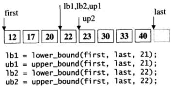

# STL

[TOC]


## 最佳实践

### 1.选择合适的算法

排序算法：

| 需求                                                         | sort | stable_sort | partial | stable_partition | nth_element |
| ------------------------------------------------------------ | ---- | ----------- | ------- | ---------------- | ----------- |
| 需要对vector，string，deque或者数组中的元素执行一次完全排序  | *    | *           |         |                  |             |
| 有一个vector，string，deque或者数组，并且只需对等价性最前面的n个元素进行排序 |      |             | *       |                  |             |
| 有一个vector，string，deque或者数组，并且需要找到第n个位置上的元素，或者，需要找到等价性最前面的n个元素但又不必对这n个元素进行排序 |      |             |         |                  | *           |
| 需要将一个标准序列容器中的元素按照是否满足某个特定的条件区分开来 |      |             | *       | *                |             |
| 需要对list中的数据排序                                       |      |             | *       | *                |             |

### 2.选择合适的容器

| 需求                                                         | vector | list | deque | set<br>multiset | map<br>multimap | stack | queue<br>priority queues |
| ------------------------------------------------------------ | ------ | ---- | ----- | --------------- | --------------- | ----- | ------------------------ |
| 在容器的任意位置插入新元素                                   | *      | *    | *     |                 |                 |       |                          |
| 不关心容器中的元素是如何排序的                               |        |      |       |                 |                 |       |                          |
| 随机访问迭代器                                               | *      |      | *     |                 |                 |       |                          |
| 当发生元素的插入或删除操作时，避免移动容器中原来的元素       |        | *    |       | *               | *               |       |                          |
| 数据的布局需要和C兼容                                        | *      |      |       |                 |                 |       |                          |
| 对元素的查找速度敏感                                         | *      |      |       | *               | *               |       |                          |
| 使迭代器，指针或引用变为无效的次数最少                       |        | *    |       |                 |                 |       |                          |
| 使用随机访问迭代器，没有删除操作，且插入操作只发生在容器尾部 |        |      | *     |                 |                 |       |                          |

### 3.尽量使用empty函数判空而不是检查size()==0

- empty对所有的标准容器的操作都是**常数时间**，且empty函数常常会被内联，而size对于一些list的操作是**线性时间**；

### 4.区间成员函数优先于与之对应的单元素成员函数

- 通过使用区间成员函数，通常可以少写一些代码；
- 使用区间成员函数通常会得到意图清晰和更加直接的代码；
- 使用单元素的成员函数比使用区间成员函数需要更多地调用内存分配子，更频繁地拷贝对象，且做了冗余操作；
- 当需要给容器一组全新的值时，使用assign而不是operator=；

使用单元素成员函数进行插入：

```c++
int data[numValues];
vector<int> v;
vector<int>::iterator insertLoc(v.begin());
for (int i = 0; i < numValues; ++i) {
    insertLoc = v.insert(insertLoc, data[i]);
    ++insertLoc;
}
```

使用区间成员函数进行插入：

```c++
int data[numValues];
vector<int> v;
v.insert(v.begin(), data, data + numValues); // 使用区间插入效率比单元素插入高得多
```

### 5.小心C++编译器的分析机制-尽可能地将代码解释为函数声明

错误的做法：

```c++
list<int> data(istream_iterator<int>(dataFile), 
               istream_iterator<int>()); // 参数没有名称，类型是指向不带参数的函数的指针，该函数返回一个istream_iterator<int>
```

正确的做法：

```c++
istream_iterator<int> dataBegin(dataFile);
istream_iterator<int> dataEnd;
list<int> data(dataBegin, dataEnd);
```

### 6.如果容器中包含了通过new操作创建的指针，切记在容器对象析构前将指针delete掉

- 指针容器在自己被析构时会析构所包含的每个元素，但对指针的析构函数不做处理，也不会调用delete；

  错误的做法：

  ```c++
  void doSomething()
  {
      vector<Widget*> vwp;
      for (int i = 0; i < SOME_MAGIC_NUMBER; ++i)
          vwp.push_back(new Widget); // 使用了new创建指针
  }
  ... // 发生内存泄漏！！！当vwp的作用域结束时，它的元素全部被析构，但是通过new创建的对象没有被删除；
  ```

  正确的做法：

  ```c++
  void doSomething()
  {
      vector<Widget*> vwp;
      for (int i = 0; i < SOME_MAGIC_NUMBER; ++i)
          vwp.push_back(new Widget); // 使用了new创建指针
      
      // 手动释放
      for (vector<Widget*>::iterator i = vwp.begin(); i != vwp.end(); ++i)
          delete *i;
  }
  ```

### 7.禁止创建包含auto_ptr的容器对象

- COAP（auto_ptr的容器）不可移植；

- 拷贝一个auto_ptr意味着改变它的值；

  ```c++
  auto_ptr<Widget> pw1(new Widget); // pw1指向一个Widget。
  auto_ptr<Widget> pw2(pw1);        // pw2指向pw1的Widget；pw1被置为NULL（Widget的所有权从pw1转移到了pw2）。
  pw1 = pw2;                        // pw1指向Widget，pw2被置为NULL。
  ```

### 8.STL容器的线程安全性不够

- **多个线程读是安全的**，多个线程可以同时读同一个容器的内容，并且保证是正确的；在读的过程中，不能对容器有任何写入操作；

- **多个线程对不同的容器做写入操作是安全的**，多个线程可以同时对不同的容器做写入操作；

- 建议使用RAII（Resource Acquisition Is Initialization）的方式来手动控制同步；

  ```c++
  TODO
  ```

### 9.推荐使用vector和string而不是动态分配的数组

- 大多数情况下，推荐使用vector和string替换动态分配的数组；
- 在多线程环境中，推荐使用内置数组代替含有引用计数的string；多线程下，为保证string的引用计数的安全性而采取的措施，会影响效率；

### 10.使用reserve来避免不必要的重新分配

- 尽早使用reserve，把容器的容量设置为足够大，以避免重新分配；

  ```c++
  vector<int> v;
  v.reserve(1000); // 预先分配容量，防止push_back的过程中进行扩容
  for (int i = 1; i <= 1000; ++i)
      v.push_back(i);
  ```

### 11.避免使用`vector<bool>`

- `vector<bool>`是一个假的容器，为了节省空间，它并不真的存储bool，而是使用类似1个字节存储8个bool的位域（bitfield）方式来存放；

### 12.包含指针的关联容器指定比较类型

- 当创建包含指针的关联容器时，容器会按照**指针的值**而不是**指针指向的内容**进行排序；

- 每当创建包含指针的关联容器时，同时也要指定容器的比较类型；

  创建比较函数通用模版：

  ```c++
  struct DereferenceLess // 定义一个比较函数的通用模板
  {
      template<typename PtrType>
      bool operator()(PtrType pT1, PtrType pT2) const 
      {
          return *pT1 < *pT2;
      }
  }
  
  set<string*, DereferenceLess> ssp;
  
  // 普通方法打印
  for (StringPtrSet::const_iterator i = ssp.begin(); i != ssp.end(); ++i)
      cout << i << endl;
  
  // 使用for_each算法打印
  void print(const string *ps)
  {
      cout << *ps << endl;
  }
  for_each(ssp.begin(), ssp.end(), print);
  ```

- `>=`对于关联容器来说不是一个合法的比较函数，相等的值从来不会有前后顺序关系；

  ```c++
  set<int, less_equal<int> > s;
  s.insert(10);
  
  struct StringPtrGreater : public binary_function<const string*, const string*, bool> 
  {
      bool operator()(const string *ps1, const string *ps2) const
      {
          return !(*ps1 < *ps2); // !(<)等价于>=；不能直接把比较结果取反来改变排列顺序，这对于关联容器不是一个合法的比较函数
      }
  };
  ```

### 13.禁止直接修改set或multiset中的键

- 对于map和multimap，键的类型是const，如果有程序试图修改容器中的键，会影响到容器的排序性，它将无法通过编译；

  ```c++
  map<int, string> m;
  m.begin()->first = 10; // 错误；map的键不能被修改
  
  multimap<int, string> mm;
  mm.begin()->first = 20; // 错误；multimap的键不能被修改
  ```

- 对于set和multiset，修改元素的值这一行为具有不可移植性；

### 14.当效率至关重要时，根据不同情况选择map::operator[]或map::insert

- 当向映射表中添加元素时，要优先选用insert，而不是operator[]；

  ```c++
  class Widget {
  public:
      Widget();
      Widget(double weight);
      Widget& operator=(double weight);
      ...
  };
  
  map<int, Widget> m;
  // 低效
  m[1] = 1.50; // 效率低，先判断存不存在，存在就更新，不存在就插入（空的map，键1肯定不存在）
  // 高效
  m.insert(IntWidgetMap::value_type(1, 1.50)); // 效率高，不判断直接插入
  ```

- 当更新已经在映射表中的元素的值时，要优先选择operator[]；

### 15.避免混用不同类型的迭代器，优先使用iterator而不是其它类型的迭代器

- 尽量使用iterator而不是const或reverse型的迭代器，可以使容器的使用更为简单而有效，并且可以避免潜在的问题，原因如下：

  - 有些版本的insert和erase函数要求使用iterator。如果你需要调用这些函数，那你就必须使用iterator。const和reverse型的迭代器不能满足这些函数的要求。
  - 要想隐式地将一个const_iterator转换成iterator是不可能的。
  - 从reverse_iterator转换而来的iterator在使用之前可能需要相应的调整。

- 避免混用不同类型的迭代器；

  ```c++
  typedef deque<int> IntDeque;
  typedef IntDeque::iterator Iter;
  typedef IntDeque::const_iterator ConstIter;
  Iter i;
  ConstIter ci;
  ...
  if (i == ci) // 比较一个iterator和一个const_iterator（iterator在比较前会被隐式转化为const_iterator）
      ...
  ```

### 16.对于逐个字符的输入考虑使用istreambuf_iterator

- istream_iterator内部执行了格式化输入（构造析构对象，流标志检查，错误检查，...），导致其效率不佳；

  ```c++
  ifstream inputFile("interestingData.txt");
  inputFile.unsetf(ios::skipws); // 禁止忽略空格
  string fileData((istream_iterator<char>(inputFile)), istream_iterator<char>()); // 将inputFile读入fileData
  ```

- istreambuf_iterator从流读取单个字符，从流的缓冲区读取下一个字符，效率更佳；

  ```c++
  ifstream inputFile("interestingData.txt");
  string fileData((istreambuf_iterator<char>(inputFile)), istreambuf_iterator<char>()); // istreambuf_iterator不会跳过任何字符（包括空格）
  ```

### 17.尽量使用封装技术

- 尽量使用封装（encapsulation）技术来将一种容器类型转换到另一种;

  ```c++
  class Widget {...};
  typedef vector<Widget> WidgetContainer;
  typedef WidgetContainer::iterator WCIterator; // 封装
  WidgetContainer cw;
  Widget bestWidget;
  ...
  WCIterator i = find(cw.begin(), cw.end(), bestWidget);
  ```

- 把容器隐藏在一个类中，并尽量减少那些通过类接口（而使外部）可见的，与容器相关的信息，来减少在替换容器类型时所需要修改的代码；

  ```c++
  class CustomerList {
  private:
    typedef list<Customer> CustomerContainer;
    typedef CustumorContainer::iterator CCIterator;
    
    CustomerContainer customers; // 隐藏容器，通过对外接口访问
  public:
    ...
  };
  ```

### 18.使用erase-remove方法完全删除元素

- remove不是真正意义上的删除，用remove删除元素，它只是移动被删除的元素到容器**尾部**，而容器中的元素数目并不会减少；

  ```c++
  vector<int> v;
  v.reserve(10);
  for (int i = 1; i <= 10; ++i)
      v.push_back(i);
  
  cout << v.size();               // 输出10
  v[3] = v[5] = v[9] = 99;
  remove(v.begin(), v.end(), 99); // 删除所有值等于99的元素
  cout << v.size();               // 依然输出10
  ```

- 当容器中存放的是指向动态分配的对象的指针的时候，应该避免使用remove和类似的算法（remove_if，unique），因为这样会造成内存泄漏；

  ```c++
  class Widget {
  public:
      bool isCertified() const;
  };
  vector<Widget*> v;
  v.push_back(new Widget);
  
  v.erase(remove_if(v.begin(), v.end(), fun(&Widget::isCertified)), v.end()); // 内存泄漏
  ```

- 推荐使用erase与remove合作（erase-remove）来真正删除元素；

  ```c++
  vector<int> v;
  v.reserve(10);
  for (int i = 1; i <= 10; ++i)
      v.push_back(i);
  
  cout << v.size();                        // 输出10
  v[3] = v[5] = v[9] = 99;
  v.erase(remove(v.begin(), v.end(), 99)); // 删除remove函数返回的迭代器所指向的元素
  cout << v.size();                        // 输出7
  ```

### 19.使用函数对象而不是函数作为STL算法的参数

- 将函数对象（即可以被伪装成函数的对象）传递给STL算法往往比传递实际的函数更加高效；

  ```c++
  vector<double> v;
  
  sort(v.begin(), v.end(), greater<double>()); // 使用函数对象做参数（高效）
  
  inline bool doubleGreater(double d1, double d2) { return d1 > d2; }
  sort(v.begin(), v.end(), doubleGreater); // 使用函数做参数（低效）
  ```

- 由于编译器或STL的问题，有时候用函数做参数可能会编译不过；

  ```c++
  set<string> s;
  
  // 用函数做参数，可能无法通过编译
  transform(s.begin(), s.end(), ostream_iterator<string::size_type>(count, "\n"), mem_fun_ref(&string::size));
  
  // 用函数对象做参数
  struct StringSize : public unary_function<string, string::size_type> {
      string::size_type operator()(const string& s) const
      {
          return s.size();
      }
  };
  transform(s.begin(), s.end(), ostream_iterator<string::size_type>(count, "\n"), StringSize());
  ```

- 使用函数对象做参数有助于避免一些语言本身的缺陷;

  用函数做参数在语法上没问题，但是有些情况下STL不支持：

  ```c++
  template<typename FPType>
  FPType average(FPType val1, FPType val2)
  {
      return (val1 + val2) / 2;
  }
  template<typename InputIter1, typename InputIter2>
  void writeAverages(InputIter1 begin1, InputIter1 end1, InputIter2 begin2, ostream& s)
  {
      transform(begin1, end1, begin2, 
                ostream_iterator<typename iterator_traits<InputIter1>::value_type(s, "\n")>,
                average<typename iterator_traits<InputIter1>::value_type>); // STL标准不支持，因为它觉得有二义性
  }
  ```

- 函数指针和函数对象在函数之间按值传递（用class/struct包裹的函数例外）；

  ```c++
  // 将函数用class包裹时，强制按引用传递
  class DoSomething : public unary_function<int, void> {
  public:
      void operator()(int x) {...}
  };
  
  typedef deque<int>::iterator DequeIntIter;
  deque<int> di;
  DoSomething d; // 创建一个函数对象
  // 用类型参数DequeIntIter和DoSomething&来调用for_each，这将强制d按引用传递并返回
  for_each<DequeIntIter, DoSomething&>(di.begin(), di.end(), d); 
  ```

### 20.容器的成员函数优先于同名的算法

- 成员函数往往速度快；
- 成员函数通常与容器（特别是关联容器）结合得更加紧密。

```c++
set<int> s;

set<int>::iterator i = s.find(727); // 使用find成员函数，速度更快
if (i != s.end())
    ...
    
set<int>::iterator i = find(s.begin(), s.end(), 727); // 使用find算法，速度慢
if (i != s.end())
    ...
```

### 21.确保容器中的对象拷贝正确而高效

- 向容器中填充对象，而对象的拷贝又很费时时，这一操作会成为程序的性能瓶颈；

- 当存在继承关系时，向基类容器的拷贝动作会剥离派生类的信息（拷贝指针时可以避免这个问题）；

  ```c++
  vector<Widget> vw;
  class SpecialWidget : public Widget{...};
  SpecialWidget sw;
  vw.push_back(sw); // 派生类特有的部分在拷贝时被丢弃了
  ```

- 尽量避免不必要的拷贝；

  ```c++
  Widget w[n]; // 创建有n个Widget对象的数组，每个对象都使用默认构造函数来创建（浪费）
  vector<Widget> vw; // 创建了包含0个Widget对象的vector，当需要时它会增长（避免了拷贝）
  ```

---


## 容器

### array

```c++
// GCC-4.4 /libstdc++-v3/include/tr1_impl/array
template<typename _Tp, std::size_t _Nm>
    struct array
    {
      typedef _Tp 	    			      value_type;
      // Support for zero-sized arrays mandatory.
      value_type _M_instance[_Nm ? _Nm : 1]; // array数组
    };
```

| 函数成员   | 复杂度 | 描述                                                         |
| :--------- | ------ | :----------------------------------------------------------- |
| begin      | $O(1)$ | 返回第一个元素的随机访问迭代器，若容器为空，则返回的迭代器等于end()。<br> |
| end        | $O(1)$ | 返回最后一个元素**下一个位置**的随机访问迭代器。<br> |
| rbegin     | $O(1)$ | 返回指向逆向 `array` 首元素的逆向迭代器。若容器为空，返回的迭代器等于`rend()`。<br> |
| rend       | $O(1)$ | 返回指向逆向 `array` 末元素后一元素的逆向迭代器。它对应非逆向 `array` 首元素的前一元素。此元素表现为占位符，试图访问它导致未定义行为。<br> |
| cbegin     | $O(1)$ | 类似于`begin`，不过返回的是const类型的迭代器。               |
| cend       | $O(1)$ | 类似于`end`，不过返回的是const类型的迭代器。                 |
| crbegin    | $O(1)$ | 类似于`rbegin`，不过返回的是const类型的迭代器。              |
| crend      | $O(1)$ | 类似于`rend`，不过返回的是const类型的迭代器。                |
| operator=  | $O(1)$ | 复制同类型容器的元素，或者用初始化列表替换现有内容。         |
| size       | $O(1)$ | 返回元素的实际数量。                                         |
| max_size   | $O(1)$ | 返回元素个数的最大值（因为array是固定大小，所以max_size()==size()）。 |
| empty      | $O(1)$ | 判断容器是否为空。                                           |
| front      | $O(1)$ | 返回第一个元素的引用，如果容器是空，其结果未定义。           |
| back       | $O(1)$ | 返回最后一个元素的引用，如果容器是空，其结果未定义。         |
| operator[] | $O(1)$ | 访问指定位置的元素（不进行边界检查）。                       |
| at         | $O(1)$ | 访问指定位置的元素（进行边界检查）。                         |
| swap       | $O(n)$ | 与另一个长度相同的容器交换元素。                             |
| data       | $O(1)$ | 返回包含元素的内部数组的指针。                               |

#### 示例

```c++
#include <iostream>
#include <array>

int main()
{
	std::array<int, 10> a1; // 创建具有10个int的array
	std::array<int, 10> a2{1, 2, 3, 4, 5, 6, 7, 8, 9, 10};

	std::array<int, 10>::iterator ret1 = a1.begin();

	std::array<int, 10>::iterator ret2 = a1.end();

	std::array<int, 10>::reverse_iterator ret3 = a1.rbegin();

	std::array<int, 10>::reverse_iterator ret4 = a1.rend();

	std::array<int, 10>::const_iterator ret5 = a1.cbegin();

	std::array<int, 10>::const_iterator ret6 = a1.cend();

	std::array<int, 10>::const_reverse_iterator ret7 = a1.crbegin();

	std::array<int, 10>::const_reverse_iterator ret8 = a1.crend();

	a1 = a2;

	size_t ret9 = a1.size();

	size_t ret10 = a1.max_size();

	bool ret11 = a1.empty();

	int ret12 = a1.front();

	int ret13 = a1.back();

	a1[0] = 2;

	a1.at(1) = 3;

	a1.swap(a2);

	int* ret14 = a1.data();
}
```

### vector

```c++
template <class _Tp, class _Alloc>
class _Vector_base {
...
protected:
  _Tp* _M_start;           // 头指针
  _Tp* _M_finish;		  // 尾指针
  _Tp* _M_end_of_storage;  // 分配的存储空间的尾部
}
```

|成员函数|复杂度|说明/示意图/代码|
|:--|---|---|
|assign |$O(n)$ | 对元素赋值。 |
|at |$O(1)$ | 返回指定位置的元素的引用（进行边界检查）。 |
|back |$O(1)$ | 返回最后一个元素的引用。 |
|begin |$O(1)$ | 返回一个指向第一个元素的迭代器。<br> |
|capacity |$O(1)$ | 返回vector所能容纳的元素数量（不重新分配内存的情况下）。 |
|clear |$O(n)$ | 擦除所有元素。 |
|emplace |$O(n)$ | （C++11）构造元素，并在指定位置之前插入。 |
|emplace_back |$O(1)$ | （C++11）构造元素，并添加到容器尾部。 |
|empty |$O(1)$ | 判断容器是否为空。 |
|end |$O(1)$ | 返回指向最后一个元素的下一个位置的迭代器。<br> |
|erase |$O(n)$ |擦除指定范围内的元素。<br> |
|front |$O(1)$ | 返回第一个元素的引用。 |
|get_allocator |$O(1)$ | 返回容器的内存分配器。 |
|insert |$O(n)$ |插入元素：<br>+ `备用空间 > 新增元素个数 且 插入点后方元素个数 > 新增元素个数`<br><br>+ `备用空间 > 新增元素个数 且 插入点后方元素个数 ≤ 新增元素个数`<br>+ `备用空间 < 新增元素个数` |
|max_size |$O(1)$ | 返回根据系统或库实现限制的容器可保有的元素最大数量（限制条件上限）。 |
|pop_back |$O(1)$ | 移除尾部元素。 |
|push_back |$O(1)$ | 向尾部添加元素。 |
|rbegin |$O(1)$ | 返回指向逆向`vector`首元素的逆向迭代器。它对应非逆向`vector`的末元素。若`vector`为空，则返回的迭代器等于`rend()`。<br> |
|rend |$O(1)$ | 返回指向逆向 `vector` 末元素后一元素的逆向迭代器。它对应非逆向 `vector` 首元素的前一元素。此元素表现为占位符，试图访问它导致未定义行为。<br> |
|reserve |$O(n)$ | 增加容器容量，不改变当前元素的个数。<br> |
|resize |$O(n)$ | 改变元素数量。 |
|shrink_to_fit |$O(n)$ | 建议（非强制性）移除未使用的容量。 |
|size |$O(1)$ | 返回元素数量。 |
|swap |$O(1)$ | 交换两个vector（其实就是交换迭代器，不会移动元素）。 |

#### 示例

```c++
#include <iostream>
#include <vector>

int main()
{
	std::vector<int> v1(10);                                      // 初始化10个元素，其值为默认值
	std::vector<int> v2{ 10 };                                    // 初始化1个元素，其值为10
	std::vector<int> v3(10, 1);                                   // 初始化10个元素，其值都为1
	std::vector<int> v4{ std::begin(v3), std::end(v3) };          // 复制一个容器的片段来初始化另一个容器
	std::vector<int> v5{ std::make_move_iterator(std::begin(v4)),
						 std::make_move_iterator(std::end(v4)) }; // 移动一个容器的片段来初始化另一个容器

	

	v1.assign({1, 2, 3, 4, 5, 6, 7, 8, 9, 10});

	int ret1 = v1.at(0);

	int ret2 = v1.back();

	std::vector<int>::iterator ret3 = v1.begin();

	size_t ret4 = v1.capacity();

	v1.clear();

	std::vector<int>::iterator ret5 = v1.emplace(v1.end(), 11);

	v1.emplace_back(12);

	bool ret6 = v1.empty();

	std::vector<int>::iterator ret7 = v1.end();

	std::vector<int>::iterator ret8 = v1.erase(v1.begin(), v1.begin() + 1);

	int ret9 = v1.front();

	std::vector<int>::allocator_type ret10 = v1.get_allocator();

	std::vector<int>::iterator ret11 = v1.insert(++v1.begin(), 8);
	std::vector<int>::iterator ret12 = v1.insert(++v1.begin(), v2.begin(), v2.end());
	std::vector<int>::iterator ret13 = v1.insert(v1.cend() - 1, 2, 100); // 插入2个100
	std::vector<int>::iterator ret14 = v1.insert(v1.end(), { 1, 2, 3 });

	size_t ret15 = v1.max_size();

	v1.pop_back();

	v1.push_back(1);

	std::vector<int>::reverse_iterator ret16 = v1.rbegin();

	std::vector<int>::reverse_iterator ret17 = v1.rend();

	v1.reserve(20);

	v1.resize(10);

	v1.shrink_to_fit();

	size_t ret18 = v1.size();

	v1.swap(v2);
}
```

### list

```c++
// 双向链表节点
struct _List_node_base {
  _List_node_base* _M_next; // 指向下个节点
  _List_node_base* _M_prev;	// 指向上个节点
};
// list节点
template <class _Tp>
struct _List_node : public _List_node_base {
  _Tp _M_data;	// 节点存储的值
}
// list 基类
template <class _Tp, class _Alloc>
class _List_base
{
...
protected:
  // 只要一个指针，便可表示整个环状双向链表，空白节点  
  _List_node<_Tp>* _M_node;	
}
```

|成员函数|复杂度|描述/示意图/代码|
|:--|:--|---|
|assign |$O(n)$ |替换容器的内容。 |
|back |$O(1)$ |返回容器中最后一个元素的引用。 |
|begin |$O(1)$ |返回指向 `list` 首元素的迭代器，若 `list` 为空，则返回的迭代器将等于`end()`。<br> |
|clear |$O(n)$ |从容器擦除所有元素。 |
|emplace |$O(1)$ |构造元素并在指定位置前插入。 |
|emplace_back |$O(1)$ |构造元素并在容器尾部插入。 |
|emplace_front |$O(1)$ |构造元素并在容器头部插入。 |
|empty |$O(1)$ |检查容器是否为空。 |
|end |$O(1)$ |返回指向 `list` 末元素后一元素的迭代器，此元素表现为占位符；试图访问它导致未定义行为。<br> |
|erase |$O(n)$ |从容器擦除指定的元素/区间。 |
|front |$O(1)$ |返回容器首元素的引用，在空容器上对 `front` 的调用是未定义的。 |
|get_allocator |$O(1)$ |返回与容器关联的分配器。 |
|insert |$O(n)$ |插入元素到指定位置，返回插入位置的迭代器。<br> |
|max_size |$O(1)$ |返回根据系统或库实现限制的容器可保有的元素最大数量，即对于最大容器的`std::distance(begin(), end())`。 |
|merge |$O(n)$ |归并二个已排序链表为一个，链表以升序排序，操作后，被合并的链表（即参数）变为空。 |
|pop_back |$O(1)$ |移除容器的末元素，在空容器上调用 `pop_back` 导致未定义行为。 |
|pop_front |$O(1)$ |移除容器首元素。若容器中无元素，则行为未定义。 |
|push_back |$O(1)$ |添加一个元素到容器尾。 |
|push_front |$O(1)$ |添加一个元素到容器头。 |
|rbegin |$O(1)$ |返回指向逆向 `list` 首元素的逆向迭代器。它对应非逆向 `list` 的末元素。若 `list` 为空，则返回的迭代器等于`rend()`。<br> |
|remove |$O(n)$ |移除所有等于指定值的元素。 |
|remove_if |$O(n)$ |移除所有满足指定条件的元素。 |
|rend |$O(1)$ |返回指向逆向 `list` 末元素后一元素的逆向迭代器。它对应非逆向 `list` 首元素的前一元素。此元素表现为占位符，试图访问它导致未定义行为。<br> |
|resize |$O(n)$ |重设容器大小以容纳 `count` 个元素：<br>+ 若当前大小 > `count` ，则减小容器为其首 `count` 个元素；<br>+ 若当前大小 <  `count` ，插入`(count - 当前大小)`个默认值/指定值的元素。 |
|reverse |$O(n)$ |翻转容器中的元素。 |
|size |$O(n)$ |容器中的元素数量。 |
|sort |$O(n log n)$ |使用list自己的sort算法排序（STL的sort算法只接受`RamdonAccessIterator`），升序排序元素，保持相等元素的顺序。 |
|splice |$O(n)$ |将一个容器中的元素拆分出来，放到另一个容器（不复制或移动元素，仅重定向链表节点的内部指针）。 |
|swap |$O(1)$ |交换2个容器的内容（不在单独的元素上调用任何移动、复制或交换操作）。 |
|unique |$O(n)$ |从容器移除所有*相继*的重复元素。只留下相等元素组中的第一个元素。若选择的比较器不建立等价关系则行为未定义。 |

#### 示例

```c++
#include <iostream>
#include <list>

int main()
{
	std::list<int> L1;                               // 创建空的容器
	std::list<int> L2{ 10 };                         // 创建带有10个默认元素的容器
	std::list<int> L3(10, 1);                        // 创建包含10个1的容器
	std::list<int> L4{ L3 };                         // 创建L3的副本
	std::list<int> L5{ ++L3.cbegin(), --L3.cend() }; // 用一段元素来初始化容器

	L1.assign(10, 1);
	L1.assign({1, 2, 3, 4, 5, 6, 7, 8, 9, 10});
	L1.assign(L3.cbegin(), L3.cend());

	int ret1 = L1.back();

	std::list<int>::iterator ret2 = L1.begin();

	L1.clear();

	std::list<int>::iterator ret13 = L1.emplace(L1.end(), 2);

	L1.emplace_back(2);

	L1.emplace_front(2);

	bool ret3 = L1.empty();

	std::list<int>::iterator ret4 = L1.end();

	L1.erase(L1.begin());
	L1.erase(L1.begin(), L1.begin()++);

	int ret5 = L1.front();

	std::list<int>::allocator_type ret6 = L1.get_allocator();

	std::list<int>::iterator ret7 = L1.insert(L1.cbegin(), 1);
	std::list<int>::iterator ret8 = L1.insert(L1.cbegin(), 5, 1);
	std::list<int>::iterator ret9 = L1.insert(L1.cbegin(), { 1, 2, 3 });
	std::list<int>::iterator ret10 = L1.insert(L1.cbegin(), L2.begin(), L2.end());

	size_t ret11 = L1.max_size();

	L1.sort(); L2.sort(); L1.merge(L2);

	L1.pop_back();

	L1.pop_front();

	L1.push_back(2);

	L1.push_front(3);

	std::list<int>::reverse_iterator ret12 = L1.rbegin();

	L1.remove(2);

	L1.remove_if([](int n) { return n % 2 == 0; });

	L1.resize(20);
	L1.resize(20, 1);

	L1.reverse();

	size_t ret13 = L1.size();

	L1.sort();
	L1.sort(std::greater<int>());
    class my_greater { public: bool operator()(const int a, const int b) { return a > b; }; }; 
	L1.sort(my_greater());

	L1.splice(L1.begin(), L2);
	L1.splice(L1.begin(), L2, L2.begin());
	L1.splice(L1.begin(), L2, L2.begin(), L2.end());

	L1.swap(L2);

	L1.unique();
	L1.unique([](int x, int y) { return (x % 2) && (y % 2); });
}
```

### deque

```c++
// deque迭代器
template <class _Tp, class _Ref, class _Ptr>
struct _Deque_iterator {
  typedef _Tp** _Map_pointer;

  _Tp* _M_curr;         // 指向节点的当前元素
  _Tp* _M_first;        // 指向节点的头
  _Tp* _M_last;         // 指向节点的尾部（含备用空间）
  _Map_pointer _M_node; // 指向所在的map
  ...
};

template <class _Tp, class _Alloc>
class _Deque_base {
...
protected:
  _Tp** _M_map;	        // map
  size_t _Map_map_size; // map的节点数量大小
  iterator _M_start;    // 指向第一个缓冲区的第一个元素
  iterator _M_finish;   // 指向最后一个缓冲区的最后一个元素
  ...
};
```

|成员函数|描述/示意图/代码|
|:--|:--|
|assign |设置双向队列的值 |
|at |返回指定的元素 |
|back |返回最后一个元素 |
|begin |返回指向第一个元素的迭代器 |
|clear |删除所有元素 |
|empty |双向队列是否为空 |
|end |返回指向尾部的迭代器 |
|erase |删除指定范围的元素 |
|front |返回第一个元素的引用 |
|get_allocator |返回配置器 |
|insert |插入元素 |
|max_size |返回双向队列能容纳的最大元素个数 |
|pop_back |移除尾部的元素 |
|pop_front |移除头部的元素 |
|push_back |在尾部加入元素 |
|push_front |在头部加入元素 |
|rbegin |返回指向尾部的逆向迭代器 |
|rend |返回指向头部的逆向迭代器 |
|resize |改变双向队列的大小 |
|size |返回双向队列中元素的个数 |
|swap |和另一个双向队列交换元素 |

### set

```c++
// set & multiset底层机制为RB-tree。
// RB-tree节点
struct _Rb_tree_node_base
{  
  ...
  _Color_type _M_color;	// 节点颜色，非红即黑
  _Base_ptr _M_parent;	// 父节点
  _Base_ptr _M_left;	  // 左节点（小）
  _Base_ptr _M_right;	  // 右节点（大）
};

// RB-tree迭代器
struct _Rb_tree_base_iterator
{
  ...
  typedef _Rb_tree_node_base::_Base_ptr _Base_ptr;
  _Base_ptr _M_node;
}

// RB-tree
template <class _Value>
struct _Rb_tree_node : public _Rb_tree_node_base
{
  _Value _M_value_field;					// 节点的值
};

template <class _Tp, class _Alloc>
struct _Rb_tree_base
{
protected:
  _Rb_tree_node<_Tp>* _M_header; 	// 头节点
  ...
}

template <class _Key, class _Value, class _KeyOfValue, class _Compare, class _Alloc = __STL_DEFAULT_ALLOCATOR(_Value) >
class _Rb_tree : protected _Rb_tree_base<_Value, _Alloc> {
protected:
  size_type _M_node_count; // 节点数量
  _Compare _M_key_compare; // 节点的键值比较函数
  ...
}
```

|成员函数|描述|
|:--|:--|
|begin |返回指向第一个元素的迭代器 |
|clear |清除所有元素 |
|count |返回某个值元素的个数 |
|empty |如果集合为空，返回true |
|end |返回指向最后一个元素的迭代器 |
|equal_range |返回第一个>=关键字的迭代器和>关键字的迭代器 |
|erase |删除集合中的元素 |
|find |返回一个指向被查找到元素的迭代器 |
|get_allocator |返回集合的分配器 |
|insert |插入元素 |
|lower_bound |返回指向大于或等于某个值的第一个元素的迭代器 |
|key_comp |返回一个用于元素间比较的函数 |
|max_size |返回集合能容纳的元素的最大数 |
|rbegin |返回指向集合中最后一个元素的方向迭代器 |
|rend |返回指向集合中第一个元素有的反向迭代器 |
|size |集合中元素的数目 |
|swap |交换两个集合变量 |
|upper_bound |返回大于某个值元素的迭代器 |
|value_comp |返回一个用于比较元素间的值的函数 |

### map

|成员函数|复杂度|说明/示意图/代码|
|:--|:--|---|
|at|$O(log n)$|返回拥有等于`key`的关键的元素被映射值的引用，若无这种元素，则抛出`std::out_of_range`类型异常。|
|begin | $O(1)$ |返回指向首元素的迭代器。 |
|clear | $O(n)$ |删除所有元素。 |
|count | $O(log n)$ |返回指定元素出现的次数（因为map不允许重复，所以返回值只可能为0或1）。 |
|emplace | $O(log n)$ |（C++11）构造元素，如果容器中不存在该键，插入之；并返回元素的迭代器和是否插入成功bool值（用std::pair包裹）。 |
|emplace_hint | $O(1)$ |（C++11）构造元素，并插入到指定位置；并返回元素的迭代器。 |
|empty | $O(log n)$ |判断容器是否为空。 |
|end | $O(1)$ |返回指向末元素**后一位置**的迭代器，试图访问`end()`返回的值会导致未定义行为。 |
|equal_range | $O(log n)$ |返回2个迭代器（包裹在std::pair中）；一个迭代器指向的值>=参数值，另一个迭代器指向的值>参数值。 |
|erase | $O(log n)$ |擦除指定值/范围的元素，并返回删除的元素个数。 |
|find | $O(log n)$ |查找键值与指定值相等/等价的元素，返回该元素的迭代器。 |
|get_allocator | $O(1)$ |返回容器的配置器。 |
|insert | $O(log n)$ |插入元素，并返回元素的迭代器和是否插入成功bool值（用std::pair包裹）。 |
|key_comp | $O(1)$ |返回容器用来对比key的函数对象。 |
|lower_bound | $O(log n)$ |返回首个键>=给定值的元素的迭代器。 |
|max_size | $O(1)$ |返回根据系统或库实现限制的容器可保有的元素最大数量，即对于最大容器的`std::distance(begin(), end())`。 |
|operator[] | $O(log n)$ | 返回键等于指定值的元素的引用，如果不存在，先插入，再返回。 |
|rbegin | $O(1)$ |返回指向逆向 `map` 首元素的逆向迭代器。它对应非逆向 `map` 的末元素。若 `map` 为空，则返回的迭代器等于`rend()`。 |
|rend | $O(1)$ |返回指向逆向 `map` 末元素后一元素的逆向迭代器。它对应非逆向 `map` 首元素的前一元素。此元素表现为占位符，试图访问它导致未定义行为。 |
|size | $O(1)$ |返回容器中元素的个数。 |
|swap | $O(1)$ |交换2个容器的内容。 |
|upper_bound | $O(log n)$ |返回首个键>给定值的元素的迭代器。 |
|value_comp | $O(1)$ |返回容器用来对比value的函数对象。 |

#### 示例

```c++
#include <iostream>
#include <map>
#include <string>

int main()
{
	std::map<int, std::string> m1{ {1, "one"}, {2, "two"} };
	std::map<int, std::string> m2{ std::make_pair(1, "one"), std::make_pair(2, "two")};
	std::map<int, std::string> m3{ m1 };
	std::map<int, std::string> m4{ std::begin(m1), std::end(m1) };

	std::string ret1 = m1.at(1);
	
	std::map<int, std::string>::iterator ret2 = m1.begin();

	m3.clear();

	size_t ret3 = m1.count(1);

	std::pair<std::map<int, std::string>::iterator, bool> ret4 = m1.emplace(3, "three");

	std::map<int, std::string>::iterator ret5 = m1.emplace_hint(m1.begin(), 4, "four");

	bool ret6 = m3.empty();
	
	std::map<int, std::string>::iterator ret7 = m1.end();

	std::pair<std::map<int, std::string>::iterator, std::map<int, std::string>::iterator> ret8 
        = m1.equal_range(1);
	
	size_t ret9 = m1.erase(4);

	std::map<int, std::string>::iterator ret10 = m1.find(1);
	
	auto ret11 = m1.get_allocator();
	
	std::pair<std::map<int, std::string>::iterator, bool> ret12 
        = m1.insert(std::make_pair(4, "four"));  // 插入单个元素，返回迭代器
	m2.insert(std::begin(m1), std::end(m1));     // 插入一段元素，无返回

	std::map<int, std::string>::key_compare ret13 = m1.key_comp(); // 返回用于比较的函数对象
	ret13(1, 2);

	std::map<int, std::string>::iterator ret14 = m1.lower_bound(2);

	size_t ret15 = m1.max_size();

	std::string ret16 = m1[1];

	std::map<int, std::string>::reverse_iterator ret17 = m1.rbegin();

	std::map<int, std::string>::reverse_iterator ret18 = m1.rend();
	
	size_t n = m1.size();
	
	m1.swap(m2);

	std::map<int, std::string>::iterator ret19 = m1.upper_bound(3);

	std::map<int, std::string>::value_compare cmp = m1.value_comp();
	cmp({ 1, "one" }, {2, "tow"});
}
```

### stack

|成员函数|复杂度|描述/示意图/代码|
|:--|:--|---|
|emplace|$O(1)$|（C++11）构造元素并推入到栈顶。|
|empty |$O(1)$ |检查容器是否为空。 |
|pop |$O(1)$ |从栈顶移除元素。 |
|push |$O(1)$ |推入元素到栈顶。 |
|size | |返回栈中元素数目 |
|swap | |（C++11） |
|top | |返回栈顶元素 |

#### 示例

```c++

```

### queue

|成员函数|描述|
|:--|:--|
|back |返回一个引用，指向最后一个元素 |
|empty |如果队列空则返回真 |
|front |返回第一个元素 |
|pop |删除第一个元素 |
|push |在末尾加入一个元素 |
|size |返回队列中元素的个数 |

### priority queues

|成员函数|描述|
|:--|:--|
|empty |判断优先队列是否为空 |
|pop |删除第一个元素 |
|push |加入一个元素 |
|size |返回优先队列中拥有的元素个数 |
|top |返回优先队列中有最高优先级的元素 |

---


## 算法

|算法|复杂度|所在头文件|描述/示意图/代码|
|:--|---|---|---|
|accumulate||stl_numeric|元素累计。|
|adjacent_difference||stl_numeric|计算相邻元素的差。|
|adjacent_find||stl_algo|查找相邻而重复（或符合某条件）的元素。|
|binary_search||stl_algo|在已排序的范围内二分查找元素。<br>|
|copy||stl_algobase|将输入区间`[first,last)`内的元素复制到输出区间`[result,result+(last-first))`内。<br>|
|copy_backward||stl_algobase|逆向复制|
|copy_n||stl_algobase|复制n个元素|
|count||stl_algo|计数|
|count_if||stl_algo|在特定条件下计数|
|equal||stl_algobase|判断两个区间相等与否|
|equal_range||stl_algo|试图在有序区间中寻找某值(返回一个上下限区间)|
|fill||stl_algobase|填充元素|
|fill_n||stl_algobase|填充元素，n次|
|find||stl_algo|循序查找|
|find_if||stl_algo|循序查找符合特定条件者|
|find_end||stl_algo|查找某个子序列的最后一次出现点|
|find_first_of||stl_algo|查找某些元素的首次出现点|
|for_each | |stl_algo |遍历并操作指定范围内的元素。<br> |
|generate | |stl_algo |以特定操作之运算结果填充特定区间内的元素 |
|generate_n | |stl_algo |以特定操作之运算结果填充特n个元素内容 |
|includes | |stl_algo |是否涵盖于某序列之中 |
|inner_product | |stl_numeric |计算内积 |
|inplace_merge | |stl_algo |合并并就地替换(覆写上去) |
|iota | |stl_numeric |在某区间填入某指定值的递增序列 |
|is_heap | | |判断某区间是否为一个heap |
|is_sorted | | |判断某区间是否已排序 |
|iter_swap | |stl_algobase |元素互换 |
|lexicographical_compare | |stl_numeric |以字典顺序进行比较 |
|lower_bound | |stl_algo |找到指定范围内的第一个不小于指定值的元素。<br> |
|make_heap | | | |
|max | |stl_algobase | 取两个对象中的较大值 |
|max_element | |stl_algo | 取最大值所在位置 |
|merge | |stl_algo | 合并两个序列 |
|min | |stl_algobase | 取两个对象中的较小值 |
|min_element | |stl_algo | 取最小值所在位置 |
|mismatch | |stl_algobase |平行比较两个序列，指出两者之间的第一个不匹配点，返回一对迭代器，分别指向两个序列中的不匹配点。<br> |
| merge          |           | stl_algo  | 将两个**有序**的集合合并起来，放置于另一段空间。<br> |
| next_permutation |  | std_algo | 获得的下一个排列组合 |
| nth_element |  | stl_algo | 重新安排序列中的第n个元素的左右两端 |
| partial_sort |  | stl_algo | 局部排序 |
| partial_sort_copy |  | stl_algo | 局部排序并复制到他处 |
| partial_sum |  | stl_numeric | 局部求和 |
| partition |  | stl_algo.h | 分割 |
| prev_permutation |  | stl_algo.h | 获得前一个排列组合 |
| pop_heap |  |  |  |
| power |  | stl_numeric | 幂次方 |
| push_heap |  |  |  |
| random_shuffle |  |  | 将指定范围内的元素次序随机重排 |
| random_sample |  |  |  |
| random_sample_n |  |  |  |
|remove | | |移除指定范围内所有与value相等的元素<br> |
|remove_copy | | | |
|remove_if | | | |
|remove_copy_if | | | |
|replace | | | 将指定范围内的所有old_value都以new_value取代 |
|replace_copy | | |  |
|replace_copy_if | | |  |
|replace_if | | |  |
|reverse | | | 将序列中的元素在原容器中翻转 |
|reverse_copy | | |  |
|rotate | | |将`[first,middle)`内的元素和`[middle,last)`内的元素互换。<br> |
|rotate_copy | | | |
|search | | | 在序列一中查找与序列二完全匹配的子序列 |
|search_n | | |在指定的序列区间中查找连续n个符合条件的元素形成的子序列，返回指向该子序列起始处的迭代器。<br> |
|set_difference | | | |
|set_intersection | | | |
|set_symmetric_difference | | | |
|set_union | | | |
|sort | | |排序；<br/>- 数据量大时采用Quick Sort，分段式递归排序；<br/>- 数据量小于某个门槛时，改用Insertion Sort；<br/>- 如果递归层次过深，还会改用Heap Sort。 |
|sort_heap | | | |
|stable_partition | | | |
|stable_sort | | | |
|swap | | | |
|swap_range | | | |
|transform | | | |
|unique | | |移除重复的元素<br> |
|unique_copy | | | |
|upper_bound | | | 二分查找(binary search)法的一个版本，“查找可插入value的最后一个合适位置” |
|make_heap | | |  |
|pop_heap | | |  |
|push_heap | | |  |
|sort_heap | | |  |


## 参考

[1] 侯捷.STL源码剖析.1ED

[2] [C++参考手册](https://zh.cppreference.com/w/%e9%a6%96%e9%a1%b5)

[3] [美]Scott Meyers.Effective STL.1ED
