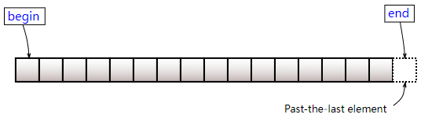
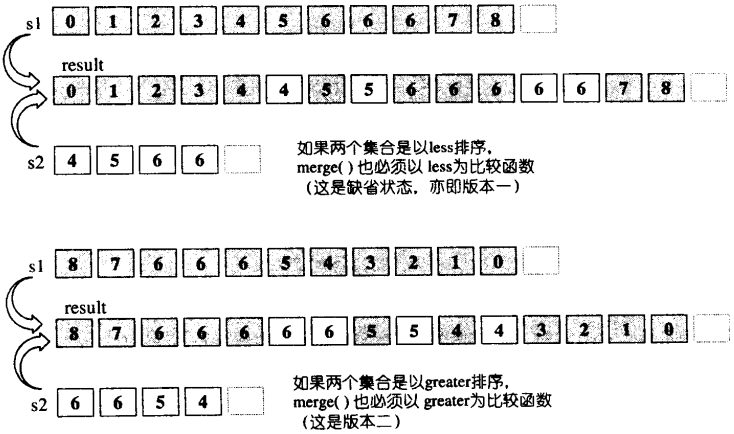
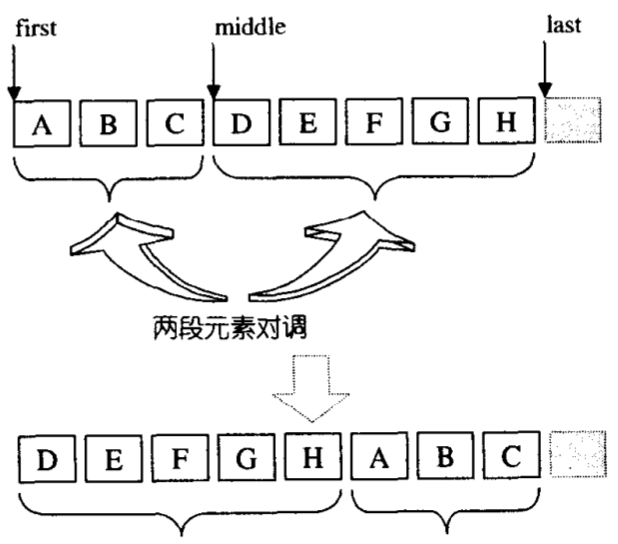
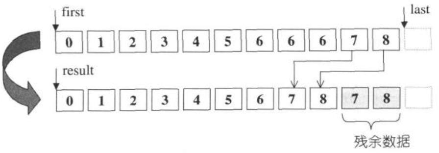

# STL

[TOC]


## 智能指针

TODO

---


## 容器

### array

```c++
// GCC-4.4 /libstdc++-v3/include/tr1_impl/array
template<typename _Tp, std::size_t _Nm>
    struct array
    {
      typedef _Tp 	    			      value_type;
      // Support for zero-sized arrays mandatory.
      value_type _M_instance[_Nm ? _Nm : 1]; // array数组
    };
```

| 函数成员   | 复杂度 | 描述                                                         |
| :--------- | ------ | :----------------------------------------------------------- |
| begin      | $O(1)$ | 返回第一个元素的随机访问迭代器，若容器为空，则返回的迭代器等于end()。<br> |
| end        | $O(1)$ | 返回最后一个元素**下一个位置**的随机访问迭代器。<br> |
| rbegin     | $O(1)$ | 返回指向逆向 `array` 首元素的逆向迭代器。若容器为空，返回的迭代器等于`rend()`。<br> |
| rend       | $O(1)$ | 返回指向逆向 `array` 末元素后一元素的逆向迭代器。它对应非逆向 `array` 首元素的前一元素。此元素表现为占位符，试图访问它导致未定义行为。<br> |
| cbegin     | $O(1)$ | 类似于`begin`，不过返回的是const类型的迭代器。               |
| cend       | $O(1)$ | 类似于`end`，不过返回的是const类型的迭代器。                 |
| crbegin    | $O(1)$ | 类似于`rbegin`，不过返回的是const类型的迭代器。              |
| crend      | $O(1)$ | 类似于`rend`，不过返回的是const类型的迭代器。                |
| operator=  | $O(1)$ | 复制同类型容器的元素，或者用初始化列表替换现有内容。         |
| size       | $O(1)$ | 返回元素的实际数量。                                         |
| max_size   | $O(1)$ | 返回元素个数的最大值（因为array是固定大小，所以max_size()==size()）。 |
| empty      | $O(1)$ | 判断容器是否为空。                                           |
| front      | $O(1)$ | 返回第一个元素的引用，如果容器是空，其结果未定义。           |
| back       | $O(1)$ | 返回最后一个元素的引用，如果容器是空，其结果未定义。         |
| operator[] | $O(1)$ | 访问指定位置的元素（不进行边界检查）。                       |
| at         | $O(1)$ | 访问指定位置的元素（进行边界检查）。                         |
| swap       | $O(n)$ | 与另一个长度相同的容器交换元素。                             |
| data       | $O(1)$ | 返回包含元素的内部数组的指针。                               |

```c++
#include <iostream>
#include <array>

int main()
{
	std::array<int, 10> a1{1, 2, 3, 4, 5, 6, 7, 8, 9, 10};
    std::array<int, 10> a2; // 创建具有10个0的array

	std::array<int, 10>::iterator ret1 = a1.begin();   // *ret1: 1

	std::array<int, 10>::iterator ret2 = a1.end();     // *ret2: 未知变量

	std::array<int, 10>::reverse_iterator ret3 =       // *ret3: 10
        a1.rbegin();

	std::array<int, 10>::reverse_iterator ret4 =       // *ret4: 未知变量
        a1.rend();

	std::array<int, 10>::const_iterator ret5 =         // *ret5: 1
        a1.cbegin();

	std::array<int, 10>::const_iterator ret6 =         // *ret6: 未知变量
        a1.cend();

	std::array<int, 10>::const_reverse_iterator ret7 = // *ret7: 10
        a1.crbegin();

	std::array<int, 10>::const_reverse_iterator ret8 = // *ret8: 未知变量
        a1.crend();

	a2 = a1;                      // a2: [1,2,3,4,5,6,7,8,9,10]

	size_t ret9 = a1.size();      // ret9: 10

	size_t ret10 = a1.max_size(); // ret10: 10

	bool ret11 = a1.empty();      // ret11: false

	int ret12 = a1.front();       // ret12: 1

	int ret13 = a1.back();        // ret13: 10

	a1[0] = 2;                    // a1: [2,2,3,4,5,6,7,8,9,10]

	a1.at(1) = 3;                 // a1: [2,3,3,4,5,6,7,8,9,10]

	a1.swap(a2);                  // a1: [1,2,3,4,5,6,7,8,9,10]

	int* ret14 = a1.data();       // ret14: [1,2,3,4,5,6,7,8,9,10]
}
```

### vector

```c++
template <class _Tp, class _Alloc>
class _Vector_base {
...
protected:
  _Tp* _M_start;          // 头指针
  _Tp* _M_finish;         // 尾指针
  _Tp* _M_end_of_storage; // 分配的存储空间的尾部
}
```

|成员函数|复杂度|说明/示意图/代码|
|:--|---|---|
|assign |$O(n)$ | 对元素赋值。 |
|at |$O(1)$ | 返回指定位置的元素的引用（进行边界检查）。 |
|back |$O(1)$ | 返回最后一个元素的引用。 |
|begin |$O(1)$ | 返回一个指向第一个元素的迭代器。<br> |
|capacity |$O(1)$ | 返回vector所能容纳的元素数量（不重新分配内存的情况下）。 |
|clear |$O(n)$ | 擦除所有元素。 |
|emplace |$O(n)$ | （C++11）构造元素，并在指定位置之前插入。 |
|emplace_back |$O(1)$ | （C++11）构造元素，并添加到容器尾部。 |
|empty |$O(1)$ | 判断容器是否为空。 |
|end |$O(1)$ | 返回指向最后一个元素的下一个位置的迭代器。<br> |
|erase |$O(n)$ |擦除指定范围内的元素。<br> |
|front |$O(1)$ | 返回第一个元素的引用。 |
|get_allocator |$O(1)$ | 返回容器的内存分配器。 |
|insert |$O(n)$ |插入元素：<br>+ `备用空间 > 新增元素个数 且 插入点后方元素个数 > 新增元素个数`<br><br>+ `备用空间 > 新增元素个数 且 插入点后方元素个数 ≤ 新增元素个数`<br>+ `备用空间 < 新增元素个数` |
|max_size |$O(1)$ | 返回根据系统或库实现限制的容器可保有的元素最大数量（限制条件上限）。 |
|pop_back |$O(1)$ | 移除尾部元素。 |
|push_back |$O(1)$ | 向尾部添加元素。 |
|rbegin |$O(1)$ | 返回指向逆向`vector`首元素的逆向迭代器。它对应非逆向`vector`的末元素。若`vector`为空，则返回的迭代器等于`rend()`。<br> |
|rend |$O(1)$ | 返回指向逆向 `vector` 末元素后一元素的逆向迭代器。它对应非逆向 `vector` 首元素的前一元素。此元素表现为占位符，试图访问它导致未定义行为。<br> |
|reserve |$O(n)$ | 增加容器容量，不改变当前元素的个数。<br> |
|resize |$O(n)$ | 改变元素数量。 |
|shrink_to_fit |$O(n)$ | 建议（非强制性）移除未使用的容量。 |
|size |$O(1)$ | 返回元素数量。 |
|swap |$O(1)$ | 交换两个vector（其实就是交换迭代器，不会移动元素）。 |

```c++
#include <iostream>
#include <vector>

int main()
{
	std::vector<int> v1(5);    // 初始化5个元素，其值为默认值
	std::vector<int> v2{ 5 };  // 初始化1个元素，其值为5
	std::vector<int> v3(5, 1); // 初始化5个元素，其值都为1
	std::vector<int> v4{       // 复制一个容器的片段来初始化另一个容器
        std::begin(v3), 
        std::end(v3) }; 
	std::vector<int> v5{       // 移动一个容器的片段来初始化另一个容器
        std::make_move_iterator(std::begin(v4)),
        std::make_move_iterator(std::end(v4)) }; 

	v1.assign({1, 2, 3, 4, 5});            // v1: [1,2,3,4,5]

	int ret1 = v1.at(0);                   // ret1: 1

	int ret2 = v1.back();                  // ret2: 5

	std::vector<int>::iterator ret3 = 
        v1.begin();                        // *ret3: 1

	size_t ret4 = v1.capacity();          // ret4: 5

	v1.clear();                           // v1: []

	std::vector<int>::iterator ret5 = 
        v1.emplace(v1.end(), 11);         // v1: [11], *ret5: 11

	v1.emplace_back(12);                 // v1: [11,12]

	bool ret6 = v1.empty();              // ret6: false

	std::vector<int>::iterator ret7 = 
        v1.end();                        // *ret7: 3

	std::vector<int>::iterator ret8 =   // v1: [12], *ret8: 12
        v1.erase(v1.begin(), v1.begin() + 1);

	int ret9 = v1.front();              // ret9: 12

	std::vector<int>::allocator_type ret10 = 
        v1.get_allocator();             // ret10.max_size(): 4611686018427387903

	std::vector<int>::iterator ret11 = // v1: [12,8], *ret11: 8
        v1.insert(++v1.begin(), 8);
	std::vector<int>::iterator ret12 = // v1: [12,5,8], *ret12: 5
        v1.insert(++v1.begin(), v2.begin(), 
                  v2.end());
	std::vector<int>::iterator ret13 = // v1: [12,5,10,10,8], *ret13: 10
        v1.insert(v1.cend() - 1, 2, 10);
	std::vector<int>::iterator ret14 = // v1: [12,5,10,10,8,1,2,3], *ret14: 1
        v1.insert(v1.end(), { 1, 2, 3 });

	size_t ret15 = v1.max_size();      // ret15: 4611686018427387903

	v1.pop_back();                     // v1: [12,5,10,10,8,1,2]

	v1.push_back(1);                   // v1: [12,5,10,10,8,1,2,1]

	std::vector<int>::reverse_iterator ret16 = 
        v1.rbegin();                   // *ret16: 1

	std::vector<int>::reverse_iterator ret17 = 
        v1.rend();                     // *ret17: 0

	v1.reserve(10);                   // v1: [12,5,10,10,8,1,2,1]

	v1.resize(3);                     // v1: [12,5,10]

	v1.shrink_to_fit();               // 调用前, v1.capacity(): 10, 调用后: v1.capacity(): 3

	size_t ret18 = v1.size();         // ret18: 3

	v1.swap(v2);                      // v1: [5], v2:[12,5,10]
}
```

### list

```c++
// 双向链表节点
struct _List_node_base {
  _List_node_base* _M_next; // 指向下个节点
  _List_node_base* _M_prev;	// 指向上个节点
};
// list节点
template <class _Tp>
struct _List_node : public _List_node_base {
  _Tp _M_data;	// 节点存储的值
}
// list 基类
template <class _Tp, class _Alloc>
class _List_base
{
...
protected:
  // 只要一个指针，便可表示整个环状双向链表，空白节点  
  _List_node<_Tp>* _M_node;	
}
```

|成员函数|复杂度|描述/示意图/代码|
|:--|:--|---|
|assign |$O(n)$ |替换容器的内容。 |
|back |$O(1)$ |返回容器中最后一个元素的引用。 |
|begin |$O(1)$ |返回指向 `list` 首元素的迭代器，若 `list` 为空，则返回的迭代器将等于`end()`。<br> |
|clear |$O(n)$ |从容器擦除所有元素。 |
|emplace |$O(1)$ |构造元素并在指定位置前插入。 |
|emplace_back |$O(1)$ |构造元素并在容器尾部插入。 |
|emplace_front |$O(1)$ |构造元素并在容器头部插入。 |
|empty |$O(1)$ |检查容器是否为空。 |
|end |$O(1)$ |返回指向 `list` 末元素后一元素的迭代器，此元素表现为占位符；试图访问它导致未定义行为。<br> |
|erase |$O(n)$ |从容器擦除指定的元素/区间。 |
|front |$O(1)$ |返回容器首元素的引用，在空容器上对 `front` 的调用是未定义的。 |
|get_allocator |$O(1)$ |返回与容器关联的分配器。 |
|insert |$O(n)$ |插入元素到指定位置，返回插入位置的迭代器。<br> |
|max_size |$O(1)$ |返回根据系统或库实现限制的容器可保有的元素最大数量，即对于最大容器的`std::distance(begin(), end())`。 |
|merge |$O(n)$ |归并二个已排序链表为一个，链表以升序排序，操作后，被合并的链表（即参数）变为空。 |
|pop_back |$O(1)$ |移除容器的末元素，在空容器上调用 `pop_back` 导致未定义行为。 |
|pop_front |$O(1)$ |移除容器首元素。若容器中无元素，则行为未定义。 |
|push_back |$O(1)$ |添加一个元素到容器尾。 |
|push_front |$O(1)$ |添加一个元素到容器头。 |
|rbegin |$O(1)$ |返回指向逆向 `list` 首元素的逆向迭代器。它对应非逆向 `list` 的末元素。若 `list` 为空，则返回的迭代器等于`rend()`。<br> |
|remove |$O(n)$ |移除所有等于指定值的元素。 |
|remove_if |$O(n)$ |移除所有满足指定条件的元素。 |
|rend |$O(1)$ |返回指向逆向 `list` 末元素后一元素的逆向迭代器。它对应非逆向 `list` 首元素的前一元素。此元素表现为占位符，试图访问它导致未定义行为。<br> |
|resize |$O(n)$ |重设容器大小以容纳 `count` 个元素：<br>+ 若当前大小 > `count` ，则减小容器为其首 `count` 个元素；<br>+ 若当前大小 <  `count` ，插入`(count - 当前大小)`个默认值/指定值的元素。 |
|reverse |$O(n)$ |翻转容器中的元素。 |
|size |$O(n)$ |容器中的元素数量。 |
|sort |$O(n\ log\ n)$ |使用list自己的sort算法排序（STL的sort算法只接受`RamdonAccessIterator`），升序排序元素，保持相等元素的顺序。 |
|splice |$O(n)$ |将一个容器中的元素拆分出来，放到另一个容器（不复制或移动元素，仅重定向链表节点的内部指针）。 |
|swap |$O(1)$ |交换2个容器的内容（不在单独的元素上调用任何移动、复制或交换操作）。 |
|unique |$O(n)$ |从容器移除所有*相继*的重复元素。只留下相等元素组中的第一个元素。若选择的比较器不建立等价关系则行为未定义。 |

```c++
#include <iostream>
#include <list>

int main()
{
	std::list<int> L1;                               // 创建空的容器
	std::list<int> L2{ 10 };                         // 创建带有10个默认元素的容器
	std::list<int> L3(10, 1);                        // 创建包含10个1的容器
	std::list<int> L4{ L3 };                         // 创建L3的副本
	std::list<int> L5{ ++L3.cbegin(), --L3.cend() }; // 用一段元素来初始化容器

	L1.assign(10, 1);
	L1.assign({1, 2, 3, 4, 5, 6, 7, 8, 9, 10});
	L1.assign(L3.cbegin(), L3.cend());

	int ret1 = L1.back();

	std::list<int>::iterator ret2 = L1.begin();

	L1.clear();

	std::list<int>::iterator ret13 = L1.emplace(L1.end(), 2);

	L1.emplace_back(2);

	L1.emplace_front(2);

	bool ret3 = L1.empty();

	std::list<int>::iterator ret4 = L1.end();

	L1.erase(L1.begin());
	L1.erase(L1.begin(), L1.begin()++);

	int ret5 = L1.front();

	std::list<int>::allocator_type ret6 = L1.get_allocator();

	std::list<int>::iterator ret7 = 
        L1.insert(L1.cbegin(), 1);
	std::list<int>::iterator ret8 = 
        L1.insert(L1.cbegin(), 5, 1);
	std::list<int>::iterator ret9 = 
        L1.insert(L1.cbegin(), { 1, 2, 3 });
	std::list<int>::iterator ret10 = 
        L1.insert(L1.cbegin(), L2.begin(), L2.end());

	size_t ret11 = L1.max_size();

	L1.sort(); L2.sort(); L1.merge(L2);

	L1.pop_back();

	L1.pop_front();

	L1.push_back(2);

	L1.push_front(3);

	std::list<int>::reverse_iterator ret12 = L1.rbegin();

	L1.remove(2);

	L1.remove_if([](int n) { return n % 2 == 0; });

	L1.resize(20);
	L1.resize(20, 1);

	L1.reverse();

	size_t ret13 = L1.size();

	L1.sort();
	L1.sort(std::greater<int>());
    class my_greater { 
        public: 
        bool operator()(const int a, const int b) { return a > b; }; }; 
	L1.sort(my_greater());

	L1.splice(L1.begin(), L2);
	L1.splice(L1.begin(), L2, L2.begin());
	L1.splice(L1.begin(), L2, L2.begin(), L2.end());

	L1.swap(L2);

	L1.unique();
	L1.unique(
        [](int x, int y) { return (x % 2) && (y % 2); });
}
```

### deque

```c++
// deque迭代器
template <class _Tp, class _Ref, class _Ptr>
struct _Deque_iterator {
  typedef _Tp** _Map_pointer;

  _Tp* _M_curr;         // 指向节点的当前元素
  _Tp* _M_first;        // 指向节点的头
  _Tp* _M_last;         // 指向节点的尾部（含备用空间）
  _Map_pointer _M_node; // 指向所在的map
  ...
};

template <class _Tp, class _Alloc>
class _Deque_base {
...
protected:
  _Tp** _M_map;	        // map
  size_t _Map_map_size; // map的节点数量大小
  iterator _M_start;    // 指向第一个缓冲区的第一个元素
  iterator _M_finish;   // 指向最后一个缓冲区的最后一个元素
  ...
};
```

|成员函数|复杂度|描述/示意图/代码|
|:--|:--|---|
|assign |$O(n)$ |替换容器的内容。 |
|at |$O(1)$ |返回位于指定位置的元素的**引用**（带边界检查）。 |
|back |$O(1)$ |容器中最后一个元素的引用。 |
|begin |$O(1)$ |返回指向第一个元素的迭代器。<br> |
|cbegin |$O(1)$ |（c++11）返回指向第一个元素的const类型迭代器。<br> |
|clear |$O(n)$ |从容器擦除所有元素。 |
|crbegin |$O(1)$ |（C++11）返回指向逆向 `deque` 首元素的const类型的逆向迭代器。<br/> |
|crend |$O(1)$ |（C++11）返回指向逆向 `deque` 末元素后一元素的const类型的逆向迭代器。<br> |
|emplace |$O(n)$ |（C++11）在容器的指定位置**前**，置入元素。 |
|emplace_back |$O(1)$ |（C++11）在容器尾部置入元素。 |
|emplace_front |$O(1)$ |（C++11）在容器的头部置入元素。 |
|empty |$O(1)$ |检查容器是否无元素。 |
|end |$O(1)$ |返回指向容器末元素后一元素的迭代器。<br> |
|cend |$O(1)$ |（C++11）返回指向容器末元素后一元素的const类型的迭代器。<br/> |
|erase |$O(n)$ |从容器擦除指定的元素。 |
|front |$O(1)$ |返回容器首元素的**引用**。 |
|get_allocator |$O(1)$ |返回与容器关联的内存分配器。 |
|insert |$O(n)$ |插入元素到容器中的指定位置。 |
|max_size |$O(1)$ |返回容器能容纳的最大元素个数（取决于`std::numeric_limits<diference_type>::max()`的定义）。 |
|pop_back |$O(1)$ |移除容器尾部的元素。 |
|pop_front |$O(1)$ |移除头部的元素。 |
|push_back |$O(1)$ |在容器尾部加入元素。 |
|push_front |$O(1)$ |在头部加入元素。 |
|rbegin |$O(1)$ |返回指向逆向 `deque` 首元素的逆向迭代器。<br> |
|rend |$O(1)$ |返回指向逆向 `deque` 末元素后一元素的逆向迭代器。<br> |
|resize |$O(n)$ |重设容器大小以容纳指定个元素。 |
|shrink_to_fit |$O(n)$ |（C++11）移除未使用的容量（非强制性）。 |
|size |$O(1)$ |返回容器中元素的实际个数。 |
|swap |$O(1)$ |和另一个容器交换元素（不做移动，直接交换存储元素的容器地址）。 |

```c++
#include <iostream>
#include <deque>

int main()
{
    std::deque<int> d1;                       // 生成不带元素的容器
    std::deque<int> d2(10);                   // 生成带10个默认值元素的容器
    std::deque<int> d3{1, 2, 3, 4, 5};        // 使用初始化列表生成deque容器
    std::deque<int> d4{d3};                   // 生成容器的副本
    std::deque<int> d5{d3.begin(), d3.end()}; // 使用迭代器来初始化容器

    d1.assign(5, 1);                 // d1: [1,1,1,1,1]
    d1.assign(d3.begin(), d3.end()); // d1: [1,2,3,4,5]
    d1.assign({1, 2, 3, 4, 5});      // d1: [1,2,3,4,5]

    int& ret1 = d1.at(1);  // ret1: 2

    int& ret2 = d1.back(); // ret2: 5

    std::deque<int>::iterator ret3 = d1.begin();        // ret3: 1

    std::deque<int>::const_iterator ret4 = d1.cbegin(); // ret4: 1

    d1.clear();                       // d1: []

    std::deque<int>::const_reverse_iterator ret5 = 
        d1.crbegin();                 // *ret5: 0

    std::deque<int>::const_reverse_iterator ret6 = 
        d1.crend();                   // *ret6: 0

    std::deque<int>::iterator ret7 =  // *ret7: 6
        d1.emplace(d1.begin(), 6);    // d1: [6]

    d1.emplace_back(7);               // d1: [6,7]

    d1.emplace_front(8);              // d1: [8,6,7]

    bool ret8 = d1.empty();           // ret8: false

    std::deque<int>::iterator ret9 =  // *ret9: 2
        d1.end();

    std::deque<int>::const_iterator ret10 = // *ret10: 2
        d1.cend();

    std::deque<int>::iterator ret11 = // d1: [6, 7], *ret11: 6
        d1.erase(d1.begin());

    int& ret12 = d1.front();          // ret12: 6

    std::deque<int>::allocator_type ret13 = 
        d1.get_allocator(); // ret13.max_size() = 4611686018427387903

    std::deque<int>::iterator ret14;
    ret14 = d1.insert(d1.begin(), 9);     // d1: [9,6,7], ret14: 9
    ret14 = d1.insert(d1.begin(), 2, 10); // d1: [10,10,9,6,7], ret14: 10
    ret14 =                               // d1: [1,10,10,9,6,7], ret14: 1 
        d1.insert(d1.begin(), d3.begin(), d3.begin() + 1);
    ret14 = d1.insert(d1.begin(), {1, 2});// d1: [1,2,1,10,10,9,6,7], ret14: 1

    size_t ret15 = d1.max_size(); // ret15: 4611686018427387903

    d1.pop_back();      // d1: [1,2,1,10,10,9,6]

    d1.pop_front();     // d1: [2,1,10,10,9,6]

    d1.push_back(11);   // d1: [2,1,10,10,9,6,11]

    d1.push_front(12);  // d1: [12,2,1,10,10,9,6,11]

    std::deque<int>::reverse_iterator ret16 = d1.rbegin(); // *ret16: 11

    std::deque<int>::reverse_iterator ret17 = d1.rend();   // *ret17: 0

    d1.resize(5);       // d1: [12,2,1,10,10]
    d1.resize(7, 1);    // d1: [12,2,1,10,10,1,1]

    d1.shrink_to_fit(); // d1: [12,2,1,10,10,1,1]

    size_t ret18 = d1.size(); // ret18: 7

    d1.swap(d3);        // d1: [1,2,3,4,5], d3: [12,2,1,10,10,1,1]
}
```

### set

```c++
// set & multiset底层机制为RB-tree。
// RB-tree节点
struct _Rb_tree_node_base
{  
  ...
  _Color_type _M_color;	// 节点颜色，非红即黑
  _Base_ptr _M_parent;	// 父节点
  _Base_ptr _M_left;    // 左节点（小）
  _Base_ptr _M_right;   // 右节点（大）
};

// RB-tree迭代器
struct _Rb_tree_base_iterator
{
  ...
  typedef _Rb_tree_node_base::_Base_ptr _Base_ptr;
  _Base_ptr _M_node;
}

// RB-tree
template <class _Value>
struct _Rb_tree_node : public _Rb_tree_node_base
{
  _Value _M_value_field;          // 节点的值
};

template <class _Tp, class _Alloc>
struct _Rb_tree_base
{
protected:
  _Rb_tree_node<_Tp>* _M_header; // 头节点
  ...
}

template <class _Key, class _Value, class _KeyOfValue, class _Compare, class _Alloc = __STL_DEFAULT_ALLOCATOR(_Value) >
class _Rb_tree : protected _Rb_tree_base<_Value, _Alloc> {
protected:
  size_type _M_node_count; // 节点数量
  _Compare _M_key_compare; // 节点的键比较函数
  ...
}
```

|成员函数|复杂度|描述|
|:--|:--|---|
|begin |$O(1)$ |返回指向第一个元素的迭代器。<br> |
|cbegin |$O(1)$ |（C++11）返回指向第一个元素的const类型的迭代器。<br/> |
|cend |$O(1)$ |（C++11）返回指向容器末元素后一元素的const类型的迭代器。<br/> |
|clear |$O(n)$ |从容器擦除所有元素。 |
|count |$O(log\ n)$ |返回某个值元素的个数（因为set不允许重复，所以返回值只可能为1或0）。 |
|crbegin |$O(1)$ |（C++11）返回指向逆向容器首元素的逆向迭代器。<br> |
|crend |$O(1)$ |（C++11）返回指向逆向容器末元素后一元素的逆向迭代器（即非逆向容器第一个元素的前一个位置）。<br> |
|emplace |$O(log\ n)$ |（C++11）置入元素到容器。 |
|emplace_hint |$O(log\ n)$ |（C++11）尽可能置入元素到指定位置之前。 |
|empty |$O(1)$ |如果容器是否为空。 |
|end |$O(1)$ |返回指向容器末元素后一元素的迭代器。<br> |
|equal_range |$O(log\ n)$ |返回容器中所有拥有给定范围的元素。 |
|erase |$O(log\ n) + O(n)$ |从容器移除指定的元素。 |
|find |$O(log\ n)$ |查找key与指定值相等的元素。 |
|get_allocator |$O(1)$ |返回与容器关联的分配器。 |
|insert |$O(log\ n)$ |如果容器中**不存在**该元素，则插入之，并返回插入元素的迭代器。 |
|lower_bound |$O(log\ n)$ |返回>=指定值的元素的迭代器。 |
|key_comp |$O(1)$ |返回用于比较元素key的函数。 |
|max_size |$O(1)$ |返回根据系统或库实现限制的容器可保有的元素最大数量（该值由`std::distance(begin(), end())`计算得出）。 |
|rbegin |$O(1)$ |返回指向逆向首元素的逆向迭代器（即，非逆向容器的最后一个元素）。<br> |
|rend |$O(1)$ |返回指向逆向容器末元素后一元素的逆向迭代器（即非逆向容器的第一个元素的前一位）。<br> |
|size |$O(1)$ |容器中的元素数量。 |
|swap |$O(1)$ |交换两个容器的所有元素（不移动元素，只交换存储元素的底层容器的指针）。 |
|upper_bound |$O(log\ n)$ |返回大于指定值的元素的迭代器。 |
|value_comp |$O(1)$ |返回用于比较元素value的函数。 |

```c++
#include <iostream>
#include <set>

int main()
{
    std::set<int> s1{1, 2, 3};              // 使用初始化列表创建容器
    std::set<int> s2{s1.begin(), s1.end()}; // 使用迭代器创建容器
    std::set<int, std::greater<int> > s3{   // 使用迭代器和降序排序创建容器
        s1.begin(), s1.end() }; 

    std::set<int>::iterator ret1 = s1.begin();

    std::set<int>::const_iterator ret2 = s1.cbegin();

    std::set<int>::const_iterator ret3 = s1.cend();

    s1.clear();

    size_t ret4 = s1.count(1);

    std::set<int>::const_reverse_iterator ret5 = s1.crbegin();

    std::set<int>::const_reverse_iterator ret6 = s1.crend();

    std::pair<std::set<int>::iterator, bool> ret7 = s1.emplace(1);

    std::set<int>::iterator ret8 = s1.emplace_hint(s1.begin(), 2);

    bool ret9 = s1.empty();

    std::set<int>::iterator ret10 = s1.end();

    std::pair<std::set<int>::iterator, 
                std::set<int>::iterator> ret11 = s1.equal_range(1);

    std::set<int>::iterator ret12 = s1.erase(s1.begin());
    ret12 = s1.erase(s1.begin(), s1.end());
    size_t ret12_1 = s1.erase(2);

    std::set<int>::iterator ret13 = s1.find(1);

    std::set<int>::allocator_type ret14 = s1.get_allocator();

    std::pair<std::set<int>::iterator, bool> ret15 = s1.insert(4);
    std::set<int>::iterator ret15_1 = s1.insert(s1.begin(), 5);
    s1.insert(s2.begin(), s2.end());

    std::set<int>::iterator ret16 = s1.lower_bound(4);

    std::set<int>::key_compare ret17 = s1.key_comp();

    size_t ret18 = s1.max_size();

    std::set<int>::reverse_iterator ret19 = s1.rbegin();

    std::set<int>::reverse_iterator ret20 = s1.rend();

    size_t ret21 = s1.size();

    s1.swap(s2);

    s1.upper_bound(2);

    std::set<int>::value_compare ret22 = s1.value_comp();
}
```

### map

|成员函数|复杂度|说明/示意图/代码|
|:--|:--|---|
|at|$O(log n)$|返回拥有等于`key`的关键的元素被映射值的引用，若无这种元素，则抛出`std::out_of_range`类型异常。|
|begin | $O(1)$ |返回指向首元素的迭代器。 |
|clear | $O(n)$ |删除所有元素。 |
|count | $O(log n)$ |返回指定元素出现的次数（因为map不允许重复，所以返回值只可能为0或1）。 |
|emplace | $O(log n)$ |（C++11）构造元素，如果容器中不存在该键，插入之；并返回元素的迭代器和是否插入成功bool值（用std::pair包裹）。 |
|emplace_hint | $O(1)$ |（C++11）构造元素，并插入到指定位置；并返回元素的迭代器。 |
|empty | $O(log n)$ |判断容器是否为空。 |
|end | $O(1)$ |返回指向末元素**后一位置**的迭代器，试图访问`end()`返回的值会导致未定义行为。 |
|equal_range | $O(log n)$ |返回2个迭代器（包裹在std::pair中）；一个迭代器指向的值>=参数值，另一个迭代器指向的值>参数值。 |
|erase | $O(log n)$ |擦除指定值/范围的元素，并返回删除的元素个数。 |
|find | $O(log n)$ |查找键值与指定值相等/等价的元素，返回该元素的迭代器。 |
|get_allocator | $O(1)$ |返回容器的配置器。 |
|insert | $O(log n)$ |插入元素，并返回元素的迭代器和是否插入成功bool值（用std::pair包裹）。 |
|key_comp | $O(1)$ |返回容器用来对比key的函数对象。 |
|lower_bound | $O(log n)$ |返回首个键>=给定值的元素的迭代器。 |
|max_size | $O(1)$ |返回根据系统或库实现限制的容器可保有的元素最大数量，即对于最大容器的`std::distance(begin(), end())`。 |
|operator[] | $O(log n)$ | 返回键等于指定值的元素的引用，如果不存在，先插入，再返回。 |
|rbegin | $O(1)$ |返回指向逆向 `map` 首元素的逆向迭代器。它对应非逆向 `map` 的末元素。若 `map` 为空，则返回的迭代器等于`rend()`。 |
|rend | $O(1)$ |返回指向逆向 `map` 末元素后一元素的逆向迭代器。它对应非逆向 `map` 首元素的前一元素。此元素表现为占位符，试图访问它导致未定义行为。 |
|size | $O(1)$ |返回容器中元素的个数。 |
|swap | $O(1)$ |交换2个容器的内容。 |
|upper_bound | $O(log n)$ |返回首个键>给定值的元素的迭代器。 |
|value_comp | $O(1)$ |返回容器用来对比value的函数对象。 |

```c++
#include <iostream>
#include <map>
#include <string>

int main()
{
	std::map<int, std::string> m1{ {1, "one"}, {2, "two"} };
	std::map<int, std::string> m2{ std::make_pair(1, "one"), std::make_pair(2, "two")};
	std::map<int, std::string> m3{ m1 };
	std::map<int, std::string> m4{ std::begin(m1), std::end(m1) };

	std::string ret1 = m1.at(1);
	
	std::map<int, std::string>::iterator ret2 = m1.begin();

	m3.clear();

	size_t ret3 = m1.count(1);

	std::pair<std::map<int, std::string>::iterator, bool> ret4 = m1.emplace(3, "three");

	std::map<int, std::string>::iterator ret5 = m1.emplace_hint(m1.begin(), 4, "four");

	bool ret6 = m3.empty();
	
	std::map<int, std::string>::iterator ret7 = m1.end();

	std::pair<std::map<int, std::string>::iterator, std::map<int, std::string>::iterator> ret8 
        = m1.equal_range(1);
	
	size_t ret9 = m1.erase(4);

	std::map<int, std::string>::iterator ret10 = m1.find(1);
	
	auto ret11 = m1.get_allocator();
	
	std::pair<std::map<int, std::string>::iterator, bool> ret12 
        = m1.insert(std::make_pair(4, "four"));
	m2.insert(std::begin(m1), std::end(m1));

	std::map<int, std::string>::key_compare ret13 = m1.key_comp(); 

	std::map<int, std::string>::iterator ret14 = m1.lower_bound(2);

	size_t ret15 = m1.max_size();

	std::string ret16 = m1[1];

	std::map<int, std::string>::reverse_iterator ret17 = m1.rbegin();

	std::map<int, std::string>::reverse_iterator ret18 = m1.rend();
	
	size_t n = m1.size();
	
	m1.swap(m2);

	std::map<int, std::string>::iterator ret19 = m1.upper_bound(3);

	std::map<int, std::string>::value_compare cmp = m1.value_comp();
	cmp({ 1, "one" }, {2, "tow"});
}
```

### stack

|成员函数|复杂度|描述/示意图/代码|
|:--|:--|---|
|emplace|$O(1)$|（C++11）构造元素并推入到栈顶。|
|empty |$O(1)$ |检查容器是否为空。 |
|pop |$O(1)$ |从栈顶移除元素。 |
|push |$O(1)$ |推入元素到栈顶。 |
|size | $O(1)$ |返回容器中元素数目。 |
|swap | $O(1)$ |（C++11）交换两个容器的内容。 |
|top | $O(1)$ |返回栈顶元素的引用。 |

```c++
#include <iostream>
#include <stack>
#include <list>

int main()
{
    std::list<int> values{1, 2, 3};

    std::stack<int> s1;                          // 创建容器
    std::stack<int> s2(s1);                      // 使用另一个容器来初始化
    std::stack<int, std::list<int> > s3(values); // 指定底层容器，用来初始化
    std::stack<int, std::list<int> > s4{values}; // 指定底层容器，用初始化列表来初始化
    std::stack<int, std::list<int> > s5(values, 
                        values.get_allocator()); // 指定底层容器和内存分配器来初始化
    std::stack<int, std::list<int> > s6(s3, 
                        values.get_allocator()); // 指定容器和内存分配器来初始化

    s1.emplace(4);           // s1: [4]

    bool ret1 = s1.empty();  // ret1: false

    s1.pop();                // s1: []

    s1.push(5);              // s1: [5]

    size_t ret2 = s1.size(); // ret2: 1

    s1.swap(s2);             // s1: [], s2: [5]

    int& ret3 = s1.top();    // s1: [], ret3: 未定义值
}
```

### queue

|成员函数|复杂度|描述|
|:--|:--|---|
|back |$O(1)$ |返回容器中最后一个元素的引用。 |
|emplace |$O(1)$ |（C++11）置入元素到容器尾部。 |
|empty |$O(1)$ |判断容器是否为空。 |
|front |$O(1)$ |返回第一个元素的引用。 |
|pop |$O(1)$ |移除第一个元素。 |
|push |$O(1)$ |添加元素到容器尾部。 |
|size |$O(1)$ |返回容器中元素的个数。 |
|swap |$O(1)$ |（C++11）交换两个容器的所有元素（不移动元素，只交换底层容器的指针）。 |

```c++
int main()
{
    int a[]{1, 2, 3};
    std::deque<int> values{1, 2, 3};
    std::queue<int> q1(values);                 // 使用构造容器初始化
    std::queue<int> q2(q1);                     // 复制构造初始化
    std::queue<int> q3(std::move(q2));          // 移动构造初始化
    std::queue<int> q4(values.get_allocator()); // 使用底层容器初始化
    std::queue<int> q5(values, 
        values.get_allocator());                // 使用指定的容器和内存分配器初始化
    std::queue<int> q6(std::move(values), 
        values.get_allocator());                // 移动指定的容器和内存分配器初始化
    std::queue<int> q7(q5, 
        values.get_allocator());                // 使用另一个容器和内存分配器初始化
    std::queue<int> q8(std::begin(a), 
        std::end(a));                           // 使用迭代器初始化
    std::queue<int> q9(std::begin(a), std::end(a), 
        values.get_allocator());                // 使用迭代器和内存分配器初始化
    

    int& ret1 = q1.back();  // ret1: 3

    q1.emplace(4);          // q1: [1,2,3,4]

    bool ret2 = q1.empty(); // ret2: false

    int& ret3 = q1.front(); // ret3: 1

    q1.pop();               // q1: [2,3,4]

    q1.push(5);             // q1: [2,3,4,5]

    size_t ret4 = q1.size();// ret4: 4

    q1.swap(q2);            // q1: [], q2: [2,3,4,5]
}
```

### priority queue

|成员函数|复杂度|描述|
|:--|:--|---|
|emplace|$O(log\ n)$|（C++11）置入新元素到容器。|
|empty |$O(1)$ |判断容器是否为空。 |
|pop |$O(log\ n)$ |移除第一个元素。 |
|push |$O(log\ n)$ |推入一个元素。 |
|size |$O(1)$ |返回容器中元素的个数。 |
|swap |$O(1)$ |（C++11）交换2个容器的元素。 |
|top |$O(1)$ |返回容器中第一个元素。 |

```c++
#include <iostream>
#include <queue>
#include <vector>

int main()
{
    int values[]{1, 2, 3};
    std::priority_queue<int> p1{                 // 使用迭代器初始化
        std::begin(values), std::end(values)};
    std::priority_queue<int> p2{p1};             // 使用另一个容器初始化
    std::priority_queue<int, std::vector<int>, std::greater<int> > p3 { 
        std::begin(values), std::end(values)};   // 使用迭代器和指定底层容器及比较函数初始化

    p1.emplace(4);           // p1: [4,3,2,1]

    bool ret1 = p1.empty();  // ret1: false

    p1.pop();                // p1: [3,2,1]

    p1.push(5);              // p1: [5,3,2,1]

    size_t ret2 = p1.size(); // ret2: 4

    p1.swap(p2);             // p1: [3,2,1], p2: [5,3,2,1]

    int ret3 = p1.top();     // ret3: 3
}
```

---


## 算法

### 生成/填充

| 算法             | 复杂度   | 描述/示意图/代码                                             |
| ---------------- | -------- | ------------------------------------------------------------ |
| fill             | $O(n)$   | 将指定值保存到序列中的每一个元素。                           |
| fill_n           | $O(n)$   | 将指定值保存到序列中的前n个元素。                            |
| is_permutation   | $O(n^2)$ | 判断一个序列是否是另一个序列的一个排列。                     |
| generate         | $O(n)$   | 将指定函数生成的值保存到序列中的每一个元素。                 |
| generate_n       | $O(n)$   | 将指定函数生成的值保存到序列中的前n个元素。                  |
| next_permutation | $O(n)$   | 按字典序的升序来生成元素的下一个排列，如果下一个排列存在，返回true；否则，元素被排为序列的第一排列，返回false；<br> |
| prev_permutation | $O(n)$   | 按字典序的升序来生成元素的前一个排列，如果前一个排列存在，返回true；否则，元素被排为序列中的最后一个排列，返回false。 |

```c++
#include <iostream>
#include <vector>
#include <algorithm>

int main()
{
    std::vector<int> f{1, 2, 3, 4, 5};
    std::fill(f.begin(), f.end(), 2);                     // f:  [2,2,2,2,2]

    std::vector<int> fn{1, 2, 3, 4, 5};
    std::fill_n(fn.begin(), 3, 2);                        // fn: [2,2,2,4,5]

    std::vector<int> ip1{1, 2, 3, 4, 5};
    std::vector<int> ip2{3, 5, 4, 1, 2};
    std::vector<int> ip3{3, 5, 4, 1, 1};
    bool ret_ip;
    ret_ip = std::is_permutation(ip1.begin(), ip1.end(), 
                                 ip2.begin());            // ret_ip: true
    ret_ip = std::is_permutation(ip1.begin(), ip2.end(), ip2.begin(), 
                                 ip2.begin() + 3);        // ret_ip: false
    ret_ip = std::is_permutation(ip1.begin(), ip1.end(), ip2.begin(), 
        [](int n1, int n2){ return n1 < n2; });           // ret_ip: false
    ret_ip = std::is_permutation(ip1.begin(), ip1.end(), ip2.begin(), 
        ip2.begin() + 3, 
        [](int n1, int n2){
            return n1 < n2; 
        });                                               // ret_ip: false
    ret_ip = std::is_permutation(ip1.begin(), ip1.end(), 
                                 ip3.begin());            // ret_ip: false

    std::vector<int> g1{1, 2, 3, 4, 5};
    int n = 1;
    std::generate(g1.begin(), g1.end(), 
                  [&n](){ return n * 2; });               // g1: [2,2,2,2,2]

    std::vector<int> gn1{1, 2, 3, 4, 5};
    std::generate_n(gn1.begin(), gn1.size() / 2, 
                    [&n](){ return ++n; });               // gn1: [2,3,3,4,5]

    std::vector<int> np{1, 2, 3, 3, 6, 5, 4};
    bool ret_np;
    ret_np = std::next_permutation(np.begin(), np.end()); // ret_np: true
    ret_np = std::next_permutation(np.begin(), np.end(), 
        [](int n1, int n2){ return n1 < n2; });           // ret_np: true

    std::vector<int> pp{1, 2, 3, 4, 6, 5, 4};
    bool ret_pp;
    ret_pp = std::prev_permutation(pp.begin(), pp.end()); // ret_pp: true
    ret_pp = std::prev_permutation(pp.begin(), pp.end(), 
        [](int n1, int n2){ return n1 < n2; });           // ret_pp: true
}
```

### 排序

| 算法            | 复杂度               | 描述/示意图/代码                                             |
| --------------- | -------------------- | ------------------------------------------------------------ |
| is_sorted       | $O(n)$               | 判断指定范围内的元素是否以不降序的方式排列。                 |
| is_sorted_until | $O(n)$               | 判断指定范围内的元素是否有序，并返回一个指向这段元素中升序序列上边界元素的迭代器。 |
| nth_element     | $O(n)$               | 提供指定值对指定范围的元素进行分区排序，并使得指定值左边的所有元素 <= 指定值右边的所有元素；<br> |
| partial_sort    | $O(n \times log(m))$ | 对指定范围内的元素进行部分排序；<br> |
| sort            | $O(n \times log(n))$ | 以不降序的方式排序指定范围内的元素，不保证维持相等元素的顺序。 |
| stable_sort     | $O(n \times log(n))$ | 以不降序的方式排序指定范围内的元素。                         |

```c++
#include <iostream>
#include <vector>
#include <algorithm>

int main()
{
    std::vector<int> is1{1, 2, 3, 3, 4};
    bool ret_is;
    ret_is = std::is_sorted(is1.begin(), is1.end()); // ret_is: true
    ret_is = std::is_sorted(is1.begin(), is1.end(), 
        std::greater<>());                           // ret_is: false
    ret_is = std::is_sorted(is1.begin(), is1.end(), 
        [](int n1, int n2){ 
            return n1 < n2; 
        });                                          // ret_is: true

    std::vector<int> isu1{1, 2, 3, 3, 6, 5, 4};
    std::vector<int>::iterator ret_isu;
    ret_isu = std::is_sorted_until(isu1.begin(), 
        isu1.end());                                 // *ret_isu: 5
    ret_isu = std::is_sorted_until(isu1.begin(), isu1.end(), 
        std::greater<>());                           // *ret_isu: 2
    ret_isu = std::is_sorted_until(isu1.begin(), isu1.end(), 
        [](int n1, int n2){ return n1 < n2; });      // *ret_isu: 5

    std::vector<int> ne{4, 3, 2, 1, 5, 7, 6, 8};
    std::nth_element(ne.begin(), ne.begin() + ne.size() / 2, 
        ne.end());                                   // ne: [3,1,2,4,5,7,6,8]
    std::nth_element(ne.begin(), ne.begin() + ne.size() / 2, ne.end(), 
        std::greater<>());                           // ne: [5,8,6,7,4,3,2,1]
    std::nth_element(ne.begin(), ne.begin() + ne.size() / 2, ne.end(), 
        [](int n1, int n2){ return n1 < n2; });      // ne: [4,1,2,3,5,6,7,8]

    std::vector<int> ps1{3, 4, 2, 1, 5};
    std::partial_sort(ps1.begin(), ps1.begin() + 3, 
        ps1.end());                                  // ps1: [1,2,3,4,5]
    std::partial_sort(ps1.begin(), ps1.begin() + 3, ps1.end(), 
        [](int n1, int n2){ 
            return n1 < n2; 
        });                                          // ps1: [1,2,3,4,5]

    std::vector<int> s1{3, 4, 2, 1, 5};
    std::vector<int> s2{s1};
    std::vector<int> s3{s1};
    std::sort(s1.begin(), s1.end());                 // s1: [1,2,3,4,5]
    std::sort(s2.begin(), s2.end(), 
        [](int n1, int n2){ 
            return n1 < n2 && n2 % 2 != 0; 
        });                                          // s2: [2,3,4,1,5]
    std::sort(s3.begin(), s3.end(), 
        std::greater<>());                           // s3: [5,4,3,2,1]

    std::vector<int> ss1{3, 4, 2, 1, 5};
    std::vector<int> ss2{ss1};
    std::vector<int> ss3{ss1};
    std::stable_sort(ss1.begin(), ss1.end());        // ss1: [1,2,3,4,5]
    std::stable_sort(ss2.begin(), ss2.end(), 
        [](int n1, int n2){ 
            return n2 % 2 == 0 && n1 < n2; 
        });                                         // ss2: [3,1,2,4,5]
    std::stable_sort(ss3.begin(), ss3.end(), 
        std::greater<>());                          // ss3: [5,4,3,2,1]
}
```

### 合并

| 算法          | 复杂度               | 描述/示意图/代码                                             |
| ------------- | -------------------- | ------------------------------------------------------------ |
| inplace_merge | $O(n \times log(n))$ | 合并同一个序列中两个**连续有序**的元素序列;<br> |
| merge         | $O(n + m)$           | 合并两个**有序**的容器到一个新的容器；<br> |

```c++
#include <iostream>
#include <vector>
#include <algorithm>

int main()
{
    std::vector<int> v1{1, 2, 3};
    std::vector<int> v2{7, 8, 9};

    std::merge(v1.begin(), v1.end(), v2.begin(), 
               v2.end(), v1.begin());                  // v1: [1, 2, 3]

    std::vector<int> v3(6);
    std::merge(v1.begin(), v1.end(), v2.begin(), 
               v2.end(), v3.begin());                  // v3: [1,2,3,7,8,9]

    std::vector<int> v4(6);
    std::merge(v1.begin(), v1.end(), v2.begin(), v2.end(), 
               v4.begin(), std::greater<>());          // v4: [7,8,9,1,2,3]

    std::vector<int> v5(6);
    std::merge(v1.begin(), v1.end(), v2.begin(), v2.end(), v5.begin(), 
               [](int n1, int n2){ return n1 < n2; }); // v5: [1,2,3,7,8,9]

    
    std::vector<int> v6{5, 17, 19, 20, 24, 30, 9, 13, 19, 25, 29, 31, 40, 41};
    std::inplace_merge(v6.begin(), v6.begin() + 6, 
        v6.end()); // v6: [5,9,13,17,19,19,20,24,25,29,30,31,40,41]

    std::vector<int> v7{5, 17, 19, 20, 24, 30, 9, 13, 19, 25, 29, 31, 40, 41};
    std::inplace_merge(v7.begin(), v7.begin() + 6, v7.end(),
        [](int n1, int n2){ 
            return n1 < n2; 
        });        // v7: [5,9,13,17,19,19,20,24,25,29,30,31,40,41]
}
```

### 搜索

| 算法          | 复杂度                    | 描述/示意图/代码                                             |
| ------------- | ------------------------- | ------------------------------------------------------------ |
| adjacent_find | $O(n)$                    | 搜索序列中两个连续相等的元素。                               |
| binary_search | $O(log_2{n})$             | 二分查找指定值，如果找到就返回true；<br> |
| find          | $O(n)$                    | 在指定范围内搜索指定值，并返回该值的迭代器。                 |
| find_end      | $O(s \times (n - s + 1))$ | 在指定范围内搜索最后一个和其他序列匹配的项；<br> |
| find_first_of | $O(s \times n)$           | 在指定范围内搜索第一个和其他序列匹配的项目；<br> |
| find_if       | $O(n)$                    | 在指定范围内搜索满足条件的元素。                             |
| find_if_not   | $O(n)$                    | 在指定范围内搜索**不满足**条件的元素。                       |
| lower_bound   | $O(log_2n)$               | 在指定范围内搜索>=指定值的元素；<br> |
| search        | $O(s \times n)$           | 在指定范围内搜索第一个和其他序列匹配的项目。                 |
| search_n      | $O(n)$                    | 在指定范围内搜索连续出现n次的序列。                          |
| upper_bound   |                           |                                                              |

```c++
#include <iostream>
#include <vector>
#include <algorithm>

int main()
{
    std::vector<int> af{1, 2, 3, 4, 5, 5, 6, 7, 8};
    std::vector<int>::iterator ret_af;
    ret_af = std::adjacent_find(af.begin(), af.end());    // *ret_af: 5
    ret_af = std::adjacent_find(af.begin(), af.end(),
        std::greater<int>());                             // *ret_af: 0
    ret_af = std::adjacent_find(af.begin(), af.end(), 
        [](int n1, int n2){ return n1 == n2; });          // *ret_af: 5

    std::vector<int> bs{1, 2, 3, 3, 4};
    bool ret_bs;
    ret_bs = std::binary_search(bs.begin(), bs.end(), 3); // ret_bs: true
    ret_bs = std::binary_search(bs.begin(), bs.end(), 3,
        [](int n1, int n2){ return n1 == n2; });          // ret_bs: true

    std::vector<int> f{1, 2, 3, 3, 4};
    std::vector<int>::iterator ret_f;
    ret_f = std::find(f.begin(), f.end(), 3);             // *ret_f: 3

    std::vector<int> fe1{1, 2, 3, 1, 2, 4};
    std::vector<int> fe2{1, 2};
    std::vector<int>::iterator ret_fe;
    ret_fe = std::find_end(fe1.begin(), fe1.end(), 
        fe2.begin(), fe2.end());                          // *ret_fe: 1
    ret_fe = std::find_end(fe1.begin(), fe1.end(), 
        fe2.begin(), fe2.end(), 
        [](int n1, int n2){ return n1 == n2; });          // *ret_fe: 1

    std::vector<int> ffo1{1, 2, 3, 4, 2, 3, 5};
    std::vector<int> ffo2{2, 3};
    std::vector<int>::iterator ret_ffo;
    ret_ffo = std::find_first_of(ffo1.begin(), ffo1.end(), 
        ffo2.begin(), ffo2.end());                        // *ret_ffo: 2
    ret_ffo = std::find_first_of(ffo1.begin(), ffo1.end(), 
        ffo2.begin(), ffo2.end(), 
        [](int n1, int n2){ return n1 == n2; });          // *ret_ffo: 2

    std::vector<int> fi{1, 2, 3, 4, 5};
    std::vector<int>::iterator ret_fi;
    ret_fi = std::find_if(fi.begin(), fi.end(), 
        [](int n){ return n % 2 == 0; });                 // *ret_fi: 2

    std::vector<int> fin{1, 2, 3, 4, 5};
    std::vector<int>::iterator ret_fin;
    ret_fin = std::find_if_not(fin.begin(), fin.end(),
        [](int n){ return n % 2 == 0; });                 // *ret_fin: 1

    std::vector<int> lb{1, 2, 3, 4, 5};
    std::vector<int>::iterator ret_lb;
    ret_lb = std::lower_bound(lb.begin(), lb.end(), 3);   // *ret_lb: 3
    ret_lb = std::lower_bound(lb.begin(), lb.end(), 3, 
        [](int n1, int n2){ return n1 < n2; });           // *ret_lb: 3

    std::vector<int> mm1{1, 2, 3, 4, 5};
    std::vector<int> mm2{1, 2, 4, 5};
    std::pair<std::vector<int>::iterator, std::vector<int>::iterator> ret_mm;
    ret_mm = std::mismatch(mm1.begin(), mm1.end(), 
        mm2.begin());   // <*(ret_mm.first), *(ret_mm.second)>: <3, 4>
    ret_mm = std::mismatch(mm1.begin(), mm1.end(), mm2.begin(), 
        [](int n1, int n2){ 
            return n1 == n2; 
        });             // <*(ret_mm.first), *(ret_mm.second)>: <3, 4> 
    ret_mm = std::mismatch(mm1.begin(), mm1.end(), mm2.begin(), 
        mm2.end());     // <*(ret_mm.first), *(ret_mm.second)>: <3, 4>
    ret_mm = std::mismatch(mm1.begin(), mm1.end(), mm2.begin(), mm2.end(), 
        [](int n1, int n2){ 
            return n1 == n2; 
        });             // <*(ret_mm.first), *(ret_mm.second)>: <3, 4>

    std::vector<int> s1{1, 2, 3, 4, 5};
    std::vector<int> s2{2, 3};
    std::vector<int>::iterator ret_s;
    ret_s = std::search(s1.begin(), s1.end(), 
        s2.begin(), s2.end());                            // *ret_s: 2
    ret_s = std::search(s1.begin(), s1.end(), 
        s2.begin(), s2.end(), 
        [](int n1, int n2){ return n1 < n2; });           // *ret_s: 1

    std::vector<int> sn1{1, 2, 3, 3, 4, 5};
    std::vector<int>::iterator ret_sn;
    ret_sn = std::search_n(sn1.begin(), sn1.end(), 2, 3); // *ret_sn: 3
    ret_sn = std::search_n(sn1.begin(), sn1.end(), 2, 3, 
        [](int n1, int n2){ return n1 == n2; });          // *ret_sn: 3
}
```

### 分区

| 算法             | 复杂度       | 描述/示意图/代码                                             |
| ---------------- | ------------ | ------------------------------------------------------------ |
| is_partitioned   | $O(n)$       | 判断序列是否分区完毕。                                       |
| partition        | $O(nlog(n))$ | 根据条件对序列进行分区（**不保证**原始元素序列的相对顺序），并返回**第二个分区的首元素迭代器**。 |
| partition_point  | $O(n)$       | 返回已分区序列中，**第一个分区的结束迭代器**。               |
| stable_partition | $O(nlog(n))$ | 根据条件对序列进行分区（**保证**原始元素序列的相对顺序），并返回**第二个分区的首元素迭代器**。 |

```c++
#include <vector>
#include <iostream>
#include <algorithm>

int main()
{
    std::vector<int> ip1{1, 4, 6, 4, 5, 3};
    bool ret_ip;
    ret_ip = std::is_partitioned(ip1.begin(), ip1.end(), 
        [](int n){ return n <= 4; }); // ret_ip: false

    std::vector<int> p1{1, 4, 6, 4, 5, 3};
    std::vector<int>::iterator ret_p;
    ret_p = std::partition(p1.begin(), p1.end(), 
        [](int n){ return n < 4; }); // *ret_p: 6, p1:[1,3,6,4,5,4]

    std::vector<int> pp1{1, 4, 6, 4, 5, 3};
    std::vector<int>::iterator ret_pp;
    ret_pp = std::partition_point(pp1.begin(), pp1.end(), 
        [](int n){ return n < 4; }); // *ret_pp:4 pp1:[1,4,6,4,5,3]

    std::vector<int> sp1{1, 4, 6, 4, 5, 3};
    std::vector<int>::iterator ret_sp;
    ret_sp = std::stable_partition(sp1.begin(), sp1.end(),
        [](int n){ return n < 4; }); // *ret_sp:4 sp1:[1,3,4,6,4,5]
}
```

### 比较

| 算法                    | 复杂度         | 描述/示意图/代码                                             |
| ----------------------- | -------------- | ------------------------------------------------------------ |
| equal                   | $O(min(m, n))$ | 判断两个序列的所有元素是否相等；<br>**此算法对于以下容器不可用：**<br>- `std::unordered_set`<br>- `std::unordered_multiset`<br>- `std::unordered_map`<br>- `std::unordered_multimap` |
| equal_range             | $O(log_2(n))$  | 查找序列中所有元素都与指定值相等的片段；<br> |
| lexicographical_compare | $O(min(m, n))$ | 判断一个序列是否按字典序小于第二个序列。                     |
| mismatch                | $O(min(m, n))$ | 搜索两个序列中，不匹配对出现的位置，并返回不匹配位置的迭代器对；<br> |

```c++
#include <iostream>
#include <vector>
#include <algorithm>

int main()
{
    std::vector<int> e1{1, 2, 3, 4, 5};
    std::vector<int> e2{1, 2, 3, 4};
    bool ret_e;
    ret_e = std::equal(e1.begin(), e1.end(), e2.begin());  // ret_e: false
    ret_e = std::equal(e1.begin(), e1.end(), e2.begin(), 
        [](int n1, int n2){ return n1 == n2; });           // ret_e: false
    ret_e = std::equal(e1.begin(), e1.end(), e2.begin(), 
        e2.end());                                         // ret_e: false
    ret_e = std::equal(e1.begin(), e1.end(), e2.begin(), 
        e2.end(), [](int n1, int n2){ return n1 == n2; }); // ret_e: false

    std::vector<int> er{1, 2, 3, 3, 5};
    std::pair<std::vector<int>::iterator, std::vector<int>::iterator> ret_er;
    ret_er = std::equal_range(er.begin(), 
        er.end(), 3);           // <*ret_er.first, *ret_er.second>: <3, 5>
    ret_er = std::equal_range(er.begin(), er.end(), 3, 
        [](int n1, int n2){ 
            return n1 == n2; 
        });                     // <*ret_er.first, *ret_er.second>: <5, 0>

    std::vector<int> lc1{1, 2, 3, 4};
    std::vector<int> lc2{2, 3, 4, 5};
    bool ret_lc;
    ret_lc = std::lexicographical_compare(lc1.begin(), lc1.end(), 
        lc2.begin(), lc2.end());                           // ret_lc: true
    ret_lc = std::lexicographical_compare(lc1.begin(), lc1.end(), lc2.begin(), 
        lc2.end(), [](int n1, int n2){ return n1 < n2; }); // ret_lc: true

    std::vector<int> mm1{1, 2, 3, 4, 5};
    std::vector<int> mm2{1, 2, 4, 5};
    std::pair<std::vector<int>::iterator, std::vector<int>::iterator> ret_mm;
    ret_mm = std::mismatch(mm1.begin(), mm1.end(), 
        mm2.begin());        // <*(ret_mm.first), *(ret_mm.second)>: <3, 4>
    ret_mm = std::mismatch(mm1.begin(), mm1.end(), mm2.begin(), 
        [](int n1, int n2){ 
            return n1 == n2; 
        });                  // <*(ret_mm.first), *(ret_mm.second)>: <3, 4> 
    ret_mm = std::mismatch(mm1.begin(), mm1.end(), mm2.begin(), 
        mm2.end());          // <*(ret_mm.first), *(ret_mm.second)>: <3, 4>
    ret_mm = std::mismatch(mm1.begin(), mm1.end(), mm2.begin(), mm2.end(), 
        [](int n1, int n2){ 
            return n1 == n2; 
        });                  // <*(ret_mm.first), *(ret_mm.second)>: <3, 4>
}
```

### 复制

| 算法            | 复杂度 | 描述/示意图/代码                                             |
| --------------- | ------ | ------------------------------------------------------------ |
| copy            | $O(n)$ | 将序列指定范围内元素复制到另一个序列的指定位置，返回最后复制元素的下一个位置；<br> |
| copy_backward   | $O(n)$ | 将序列复制到另一个序列的末尾，返回最后复制元素的迭代器；<br> |
| copy_if         | $O(n)$ | 将序列指定范围内符合条件的元素，复制到另一个序列的指定位置，返回最后复制元素的下一个位置的迭代器。 |
| copy_n          | $O(n)$ | 将指定范围内的元素，复制前n个元素到另一个序列的指定位置，返回最后复制元素的下一个位置的迭代器。 |
| partition_copy  | $O(n)$ | 将序列分区的结果复制到另两个序列（不改变原序列的内容），并返回这两个序列最后复制元素的迭代器pair。 |
| remove_copy     | $O(n)$ | 将指定范围内的元素复制到指定位置，并跳过等于指定值的元素，返回最后被复制元素的迭代器。 |
| remove_copy_if  | $O(n)$ | 将指定范围内的元素复制到指定位置，并跳过符合条件的元素，返回最后被复制元素的迭代器。 |
| replace_copy    | $O(n)$ | 将指定范围内的元素复制到指定位置，并用新元素替换等于指定值的旧元素，返回最后一个元素的下一个位置的迭代器。 |
| replace_copy_if | $O(n)$ | 将指定范围内的元素复制到指定位置，并用新元素替换符合条件的旧元素，返回最后一个元素的下一个位置的迭代器。 |
| reverse_copy    | $O(n)$ | 反向的将指定范围内的元素复制到指定位置，并返回指向被复制到目的位置的最后一个元素的下一个位置的迭代器。 |
| rotate_copy     | $O(n)$ | 将序列中指定范围的元素按照指定位置翻转，并将结果复制到指定位置，返回目的序列中的最后一个元素的下一个位置的迭代器。 |
| unique_copy     | $O(n)$ | 将指定范围内的元素复制到指定位置，忽略重复的元素，并返回被复制到目的位置的最后一个元素的下一个位置的迭代器。 |

```c++
#include <iostream>
#include <algorithm>
#include <vector>

int main()
{
    std::vector<int> c1{1, 2, 3, 4, 5};
    std::vector<int> c2(5);
    std::vector<int>::iterator ret_c;
    ret_c = std::copy(c1.begin(), c1.end(), 
        c2.begin());     // *ret_c: 0, c1:[1,2,3,4,5], c2:[1,2,3,4,5]

    std::vector<int> cb1{1, 2, 3, 4, 5};
    std::vector<int> cb2(5);
    std::vector<int>::iterator ret_cb;
    ret_cb = std::copy_backward(cb1.begin(), cb1.end(), 
        cb2.end());      // *ret_cb:1, cb1:[1,2,3,4,5], cb2:[1,2,3,4,5]

    std::vector<int> ci1{1, 2, 3, 4, 5};
    std::vector<int> ci2(2);
    std::vector<int>::iterator ret_ci;
    ret_ci = std::copy_if(ci1.begin(), ci1.end(), ci2.begin(), 
        [](int n){ return n % 2 == 0; }); 
                         // *ret_ci:0, ci1:[1,2,3,4,5], ci2:[2,4]

    std::vector<int> cn1{1, 2, 3, 4, 5};
    std::vector<int> cn2(2);
    std::vector<int>::iterator ret_cn;
    ret_cn = std::copy_n(cn1.begin(), 2, 
        cn2.begin());    // ret_cn:0, cn1:[1,2,3,4,5], cn2:[1,2]

    std::vector<int> pc1{1, 2, 3, 4, 5};
    std::vector<int> pc2(3);
    std::vector<int> pc3(3);
    std::pair<std::vector<int>::iterator, std::vector<int>::iterator> ret_pc;
    ret_pc = std::partition_copy(pc1.begin(), pc1.end(), pc2.begin(), pc3.begin(), 
        [](int n){ return n < 5; }); 
                         // <*ret_pc.first, *ret_pc.second>: <0, 0>
                         // pc2:[1,2,3,4,5], pc3:[1,2,3]

    std::vector<int> rc1{1, 2, 3, 4, 5};
    std::vector<int> rc2(4);
    std::vector<int>::iterator ret_rc;
    ret_rc = std::remove_copy(rc1.begin(), rc1.end(), 
        rc2.begin(), 3); // *ret_rc:0, rc1:[1,2,3,4,5], rc2:[1,2,4,5]

    std::vector<int> rci1{1, 2, 3, 4, 5};
    std::vector<int> rci2(4);
    std::vector<int>::iterator ret_rci;
    ret_rci = std::remove_copy_if(rci1.begin(), rci2.end(), rci2.begin(), 
        [](int n){ return n == 3; }); 
                         // *ret_rci:0, rci1:[1,2,3,4,5], rci2:[1,2,4,5]

    std::vector<int> rpc1{1, 2, 3, 4, 5};
    std::vector<int> rpc2{6, 7, 8};
    std::vector<int>::iterator ret_rpc;
    ret_rpc = std::replace_copy(rpc1.begin(), rpc1.end(), 
        rpc2.begin(), 2, 9); 
                         // *ret_rpc:0, rpc1:[1,2,3,4,5], rpc2:[1,9,3]

    std::vector<int> rpci1{1, 2, 3, 4, 5};
    std::vector<int> rpci2{6, 7, 8};
    std::vector<int>::iterator ret_rpci;
    ret_rpci = std::replace_copy_if(rpci1.begin(), rpci1.end(), rpci2.begin(), 
        [](int n){ return n == 2; }, 9); 
                         // *ret_rpci:0, rpci1:[1,2,3,4,5], rpci2:[1,9,3]

    std::vector<int> rvc1{1, 2, 3, 4, 5};
    std::vector<int> rvc2(5);
    std::vector<int>::iterator ret_rvc;
    ret_rvc = std::reverse_copy(rvc1.begin(), rvc1.end(), 
        rvc2.begin());   // *ret_rvc:0, rvc1:[1,2,3,4,5], rvc2:[5,4,3,2,1]

    std::vector<int> rtc1{1, 2, 3, 4, 5};
    std::vector<int> rtc2(5);
    std::vector<int>::iterator ret_rtc;
    ret_rtc = std::rotate_copy(rtc1.begin(), rtc1.begin() + 3, rtc1.end(), 
        rtc2.begin());   // *ret_rtc:0, rtc1:[1,2,3,4,5], rtc2:[4,5,1,2,3]

    std::vector<int> uc1{1, 2, 2, 3, 4, 5};
    std::vector<int> uc2(6);
    std::vector<int>::iterator ret_uc;
    ret_uc = std::unique_copy(uc1.begin(), uc1.end(), 
        uc2.begin());   // *ret_uc:0, uc1:[1,2,2,3,4,5], uc2:[1,2,3,4,5,0]
    ret_uc = std::unique_copy(uc1.begin(), uc1.end(), uc2.begin(), 
        [](int n1, int n2){ return n1 == n2; });
                        // *ret_uc:0, uc1:[1,2,2,3,4,5], uc2:[1,2,3,4,5,0]
}
```

### 交换/反转/删除/替换/旋转/移动/转换/去重

| 算法          | 复杂度   | 描述/示意图/代码                                             |
| ------------- | -------- | ------------------------------------------------------------ |
| iter_swap     | $O(1)$   | 交换两个迭代器指向的元素。                                   |
| reverse       | $O(n/2)$ | 逆转指定范围中的元素。                                       |
| remove        | $O(n)$   | 移除指定范围中，等于指定值的元素，并返回最后一个移除元素的下一个位置的迭代器；<br> |
| remove_if     | $O(n)$   | 移除指定范围中，符合指定条件的元素，并返回最后一个移除元素的下一个位置的迭代器。 |
| replace       | $O(n)$   | 用新元素替换指定范围中，等于指定值的元素。                   |
| replace_if    | $O(n)$   | 用新元素替换指定范围中，符合指定条件的元素。                 |
| rotate        | $O(n)$   | 按照逆时针方向旋转指定范围中的元素，并返回**原始序列**中首元素的迭代器；<br> |
| move          | $O(n)$   | 移动序列元素到指定位置，并返回最后移动元素的下一位置的迭代器。 |
| move_backward | $O(n)$   | 将序列元素以逆序移动（保持元素之间仍然保持原有的顺序）到另一个序列的尾部，并返回最后被移动元素的迭代器。 |
| swap          | $O(n)$   | 交换两个相同长度的序列。                                     |
| swap_ranges   | $O(n)$   | 将指定范围内的元素与另一个序列的指定位置开始的片段，进行交换，并返回第二个序列中最后被交换位置的下一位置的迭代器。 |
| transform     | $O(n)$   | 将指定范围内的元素传递给函数对象，并将操作结果保存到指定位置。 |
| unique        | $O(n)$   | 对指定范围内的元素去重，并返回去重后新范围的最后一个元素的迭代器；<br> |

```c++
#include <iostream>
#include <vector>
#include <algorithm>

int main()
{
    std::vector<int> is1{1, 2, 3, 4, 5};
    std::iter_swap(is1.begin(), 
                   is1.end() - 1);             // is1: [5,2,3,4,1]

    std::vector<int> r1{1, 2, 3, 4, 5};
    std::reverse(r1.begin(), r1.end());        // r1:  [5,4,3,2,1]
    
    std::vector<int> rm1{1, 2, 3, 4, 5};
    std::vector<int>::iterator ret_rm;
    ret_rm = std::remove(rm1.begin(), rm1.end(), 
                         3);                   // *ret_rm: 5
                                               // rm1: [1,2,4,5,5]
    
    std::vector<int> rmi1{1, 2, 3, 4, 5};
    std::vector<int>::iterator ret_rmi;
    ret_rmi = std::remove_if(rmi1.begin(), rmi1.end(), 
        [](int n){ return n == 3; });         // *ret_rmi: 5
                                              // rmi1: [1,2,4,5,5]
    
    std::vector<int> rp1{1, 2, 3, 4, 5};
    std::replace(rp1.begin(), rp1.end(), 
                 3, 6);                       // rp1: [1,2,6,4,5]
    
    std::vector<int> rpi1{1, 2, 3, 4, 5};
    std::replace_if(rpi1.begin(), rpi1.end(), 
        [](int n){ return n == 3; }, 6);      // rpi1: [1,2,6,4,5]

    std::vector<int> rt1{1, 2, 3, 4, 5};
    std::vector<int>::iterator ret_rt;
    ret_rt = std::rotate(rt1.begin(), rt1.begin() + 3, 
                         rt1.end());          // *ret_rt:1
                                              // rt1: [4,5,1,2,3]
    
    std::vector<int> mv1{1, 2, 3, 4, 5};
    std::vector<int> mv2(5);
    std::vector<int>::iterator ret_mv;
    ret_mv = std::move(mv1.begin(), mv1.end(), 
                       mv2.begin());          // *ret_mv:0
                                              // mv1: [1,2,3,4,5]
                                              // mv2: [1,2,3,4,5]

    std::vector<int> mvb1{1, 2, 3, 4, 5};
    std::vector<int> mvb2(5);
    std::vector<int>::iterator ret_mvb;
    ret_mvb = std::move_backward(mvb1.begin(), mvb1.end(), 
                                 mvb2.end()); // *ret_mvb:1
                                              // mvb2: [1,2,3,4,5]

    std::vector<int> sw1{1, 2, 3, 4, 5};
    std::vector<int> sw2{6, 7, 8, 9, 10};
    std::swap(sw1, sw2);                      // sw1: [6,7,8,9,10]
                                              // sw2: [1,2,3,4,5]
    
    std::vector<int> swr1{1, 2, 3, 4, 5};
    std::vector<int> swr2{6, 7, 8, 9, 10};
    std::vector<int>::iterator ret_swr;
    ret_swr = std::swap_ranges(swr1.begin(), swr1.begin() + 2, 
                               swr2.begin()); // *ret_swr:8
                                              // swr1: [6,7,3,4,5]
                                              // swr2: [1,2,8,9,10]
    
    std::vector<int> tsf1{1, 2, 3, 4, 5};
    std::vector<int>::iterator ret_tsf;
    ret_tsf = std::transform(tsf1.begin(), tsf1.begin() + 2, tsf1.begin(),
                             [](int n){ 
                                 return ++n; 
                             });               // ret_tsf:3
                                               // tsf1: [2,3,3,4,5]

    std::vector<int> u1{1, 2, 2, 3};
    std::vector<int>::iterator ret_u;
    ret_u = std::unique(u1.begin(), u1.end()); // *ret_u:3
                                               // u1: [1,2,3,3]
}
```

### 集合

| 算法                      | 复杂度 | 描述/示意图/代码 |
| ------------------------- | ------ | ---------------- |
| includes                  |        |                  |
| set_difference            |        |                  |
| set_intersection          |        |                  |
| set_symmetric_differrence |        |                  |
| set_union                 |        |                  |

```c++
TODO
```

### 堆操作

| 算法      | 复杂度 | 描述/示意图/代码 |
| --------- | ------ | ---------------- |
| is_heap   |        |                  |
| make_heap |        |                  |
| push_heap |        |                  |
| pop_heap  |        |                  |
| sort_heap |        |                  |

```c++
TODO
```

### 数值计算

| 算法                | 复杂度 | 描述/示意图/代码 |
| ------------------- | ------ | ---------------- |
| accumulate          |        |                  |
| adjacent_difference |        |                  |
| inner_product       |        |                  |
| iota                |        |                  |
| max                 |        |                  |
| max_element         |        |                  |
| min                 |        |                  |
| min_element         |        |                  |
| minmax              |        |                  |
| minmax_element      |        |                  |
| partial_sum         |        |                  |

```c++
TODO
```

### 其它

| 算法     | 复杂度 | 描述/示意图/代码                               |
| -------- | ------ | ---------------------------------------------- |
| for_each | $O(n)$ | 使用函数遍历指定范围内的元素。                 |
| count    | $O(n)$ | 统计指定范围内与指定值相等的元素的个数并返回。 |
| count_if | $O(n)$ | 统计指定范围内满足要求的元素个数并返回。       |

```c++
#include <iostream>
#include <vector>
#include <algorithm>

int main()
{
    std::vector<int> fe1{1, 2, 3, 4, 5};
    std::for_each(fe1.begin(), fe1.end(), 
                  [](int &n){ n++; }); // fe1: [2,3,4,5,6]
    
    std::vector<int> ct1{1, 2, 3, 4, 5};
    size_t ret_ct = std::count(ct1.begin(), ct1.end(), 
                               3);     // ret_ct: 1
    
    std::vector<int> cti1{1, 2, 3, 4, 5};
    size_t ret_cti = std::count_if(cti1.begin(), cti1.end(), 
                                   [](int n){ 
                                       return n % 2 == 0; 
                                   }); // ret_cti: 2
}
```


---


## 随机数

TODO

---


## I/O流

### 流迭代器


- `istream_iterator`输入流迭代器

  ```c++
  #include <iostream>
  #include <iterator>
  
  int main()
  {
      std::cout << "Enter some integers - enter Ctrl+Z to end.\n";
      std::istream_iterator<int> iter{std::cin};
      
      std::istream_iterator<int> copy_iter{iter};
      std::istream_iterator<int> end_iter;
      
      // Read some integers to sum
      int sum{};
      while (iter != end_iter)
      {
          sum += *iter++;
      }
      std::cout << "Total is " << sum << std::endl;
      
      std::cin.clear();
      std::cin.ignore();
      
      // Read integers using the copy of the iterator
      std::cout << "Enter some more integers - enter Ctrl+Z to end.\n";
      int product{1};
      while (true)
      {
          if (copy_iter == end_iter) break;
          product *= *copy_iter++;
      }
      std::cout << "product is " << product << std::endl;
  }
  ```

- `ostream_iterator` 输出迭代器

  ```c++
  #include <iostream>
  #include <iterator>
  #include <vector>
  #include <algorithm>
  #include <string>
  using std::string;
  
  int main()
  {
      std::vector<string> words{"The", "quick", "brown", "fox", 
                                "jumped", "over", "the", "lazy", "dog"};
      
      // Write the words container using conventional iterator notation
      std::ostream_iterator<string> out_iter1{std::cout};
      
      for (const auto& word : words)
      {
          *out_iter1++ = word;
          *out_iter1++ = " ";
      }
      *out_iter1++ = "\n";
      
      for (const auto& word : words)
      {
          (out_iter1 = word) = " ";
      }
      out_iter1 = "\n";
      
      // Write the words container using copy()
      std::ostream_iterator<string> out_iter2{std::cout, " "};
      std::copy(std::begin(words), std::end(words), out_iter2);
      out_iter2 = "\n";
  }
  ```

### 运算符重载

```c++
class Name
{
private:
    std::string first_name{};
    std::string second_name{};
public:
    Name() = default;
    Name(const std::string& first, const std::string& second) : 
        first_name{first}, second_name{second} {}
    friend std::istream& operator>>(std::istream& in, Name& name);
    friend std::ostream& operator<<(std::ostream& out, const Name& name);
};

inline std::istream& operator>>(std::istream& in, Name& name)
{ return in >> name.first_name >> name.second_name; }

inline std::ostream& operator<<(std::ostream& out, const Name& name)
{ return out << name.first_name << ' ' << name.second_name; }

// 使用运算符重载
std::vector<Name> names{std::istream_iterator<Name>{std:cin},
                        std::istream_iterator<Name>{}};
std::copy(std::begin(names), std::end(names), 
          std::ostream_iterator<Name>{std::cout, " "});
```

### 文件流

```c++
// 使用流迭代器对文件进行输入输出
#include <iostream>
#include <fstream>
#include <iterator>
#include <string>

int main()
{
    // 读
    string file_in{"007.txt"};
    std::ifstream in{file_in};
    if (!in)
    {
        std::cerr << file_in << " not open." << std::endl;
        exit(1);
    }
    auto end_iter = std::istream_iterator<string>{};

    string word;
    std::cin >> word;
    if (std::find(std::istream_iterator<string>(in), 
                  end_iter, word) != end_iter)
        std::cout << "Read: " << std::endl;
    words.clear();
    
    // 写
    string file_out{"007.txt"};
    std::ofstream out{file_out, std::ios_base::out | std::ios_base::trunc};
    std::copy(std::istream_iterator<string>{in}, std::istream_iterator<string>{},
              std::ostream_iterator<string>{out, " "});
    
    in.clear();
    in.close();
    out.close();
}
```

### 流缓冲迭代器

```c++
// 对文件流使用输出流缓冲区迭代器
#include <iostream>
#include <iterator>
#include <fstream>
#include <string>
using std::string;

int main()
{
    string file_name{"007.txt"};
    std::ifstream file_in{file_name};
    if (!file_in)
    {
        std::cerr << file_name << " not open." << std::endl;
        exit(1);
    }
    string file_copy("007.txt");
    std::ofstream file_out{file_copy, std::ios_base::out | std::ios_base::trunc};
    
    std::istreambuf_iterator<char> in{file_in};
    std::istreambuf_iterator<char> end_in;
    std::ostreambuf_iterator<char> out{file_out};
    while (in != end_in)
        out = *in++;
    
    std::cout << "File copy completed." << std::endl;
    
    file_in.close();
    file_out.close();
}
```

---


## 时间

TODO

---


## 多线程

TODO

---


## 参考

[1] 侯捷.STL源码剖析.1th Edition

[2] [C++参考手册](https://zh.cppreference.com/w/%e9%a6%96%e9%a1%b5)

[3] [美]Scott Meyers.Effective STL.1th Edition
