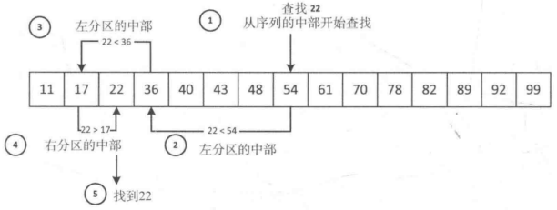

# STL

[TOC]


## Smart pointers

### shared_ptr

`std::shared_ptr` wraps a dynamically allocated object and implements reference-counted ownership. It can be copied and assigned freely; when the reference count reaches zero, the managed object is destroyed.

Constructors and behaviors:

- `shared_ptr()`: constructs an empty `shared_ptr` that holds a null pointer.
- `shared_ptr(Y* p)`: takes ownership of pointer `p` (of type `Y*`) and sets the reference count to 1. `Y` must be convertible to the managed `T`.
- `shared_ptr(shared_ptr const& r)`: copy constructor — obtains shared ownership from another `shared_ptr`, incrementing the reference count.
- `operator=`: assignment behaves like the copy constructor.
- `shared_ptr(Y* p, D d)`: like `shared_ptr(Y* p)` but uses a custom deleter `d` instead of `delete`.
- aliasing constructor: constructs a `shared_ptr<U>` that shares ownership (the control block) with another `shared_ptr` but points to a different address (useful for sub-objects).

Common member functions:

| Member | Description |
|---|---|
| get | return the stored pointer |
| reset | replace the managed object |
| swap | swap the managed objects |
| owner_before | compare ownership for ordering |
| operator= | assignment |
| operator* / operator-> | dereference |
| use_count | number of shared owners |
| unique | whether this is sole owner |

Example:

```c++
#include <memory>
#include <string>

int main()
{
    std::shared_ptr<std::string> sp1;
    // ... example usage omitted ...
    bool ret_u = sp1.unique(); // ret_u: false if not sole owner
}
```

### weak_ptr

`std::weak_ptr` is a non-owning observer of an object managed by `shared_ptr`.

Member functions:

| Member | Description |
|---|---|
| expired | check whether the referenced object is already deleted |
| lock | obtain a `shared_ptr` that shares ownership (returns empty if expired) |
| owner_before | ordering among owners |
| reset | release reference |
| swap | swap references |
| use_count | number of owning `shared_ptr`s |

Example:

```c++
#include <memory>
#include <string>

int main()
{
    std::weak_ptr<std::string> wp1{std::make_shared<std::string>("")};
    // ... example usage omitted ...
    long ret_uc = wp1.use_count(); // number of owning shared_ptrs (may be 0)
}
```

---


## Containers

### string

TODO

### array

```c++
// GCC-4.4 /libstdc++-v3/include/tr1_impl/array
template<typename _Tp, std::size_t _Nm>
    struct array
    {
        // implementation omitted
    };
```

| Function | Complexity | Description |
|---|---:|---|
| begin | O(1) | return random-access iterator to first element; equals end() if empty.  |
| end | O(1) | iterator past the last element.  |
| rbegin | O(1) | reverse iterator to first element from the back.  |
| rend | O(1) | reverse iterator past end.  |
| cbegin | O(1) | const begin |
| cend | O(1) | const end |
| crbegin | O(1) | const rbegin |
| crend | O(1) | const rend |
| operator= | O(1) | copy from same-type container or initializer list |
| size | O(1) | number of elements |
| max_size | O(1) | same as size() for fixed-size array |
| empty | O(1) | empty check |
| front | O(1) | reference to first element (UB if empty) |
| back | O(1) | reference to last element (UB if empty) |
| operator[] | O(1) | unchecked element access |
| at | O(1) | checked element access |
| swap | O(n) | swap elements with another equal-size array |
| data | O(1) | pointer to underlying C array |

```c++
#include <iostream>
#include <array>

int main()
{
    std::array<int, 10> a1{1,2,3,4,5,6,7,8,9,10};
    // ... example usage omitted ...
    int* ret14 = a1.data(); // pointer to internal array
}
```

### vector

```c++
template <class _Tp, class _Alloc>
class _Vector_base {
  // simplified internals
protected:
  _Tp* _M_start; // begin
  // ...
  _Tp* _M_end_of_storage; // end of allocated storage
};
```

Common member functions and complexities:

| Member | Complexity | Notes |
|---|---:|---|
| assign | O(n) | replace elements |
| at | O(1) | checked access |
| back | O(1) | reference to last element |
| begin | O(1) | iterator to first element  |
| capacity | O(1) | current capacity |
| clear | O(n) | erase all elements |
| emplace | O(n) | construct and insert before position |
| emplace_back | amortized O(1) | construct at end |
| empty | O(1) | is empty |
| end | O(1) | past-the-end iterator  |
| erase | O(n) | erase range (shifts elements)  |
| front | O(1) | first element |
| get_allocator | O(1) | allocator |
| insert | O(n) | various cases depending on capacity/insertion point (diagrams) |
| max_size | O(1) | max possible size |
| pop_back | O(1) | remove last element |
| push_back | amortized O(1) | append |
| rbegin/rend | O(1) | reverse iterators |
| reserve | O(n) | increase capacity |
| resize | O(n) | change size |
| shrink_to_fit | O(n) | request to reduce capacity |
| size | O(1) | number of elements |
| swap | O(1) | swap internal pointers |

Example:

```c++
#include <iostream>
#include <vector>

int main()
{
    std::vector<int> v1(5); // 5 default-initialized elements
    // ... example usage omitted ...
    v1.swap(v1); // swap with another vector
}
```

### list

```c++
// Doubly-linked list node base
struct _List_node_base {
  _List_node_base* _M_next;
  _List_node_base* _M_prev;
};

template <class _Tp>
struct _List_node : public _List_node_base {
  _Tp _M_data;
};

template <class _Tp, class _Alloc>
class _List_base {
protected:
  _List_node<_Tp>* _M_node; // sentinel node
};
```

Member functions and complexities (selected):

| Member | Complexity | Notes |
|---|---:|---|
| assign | O(n) | replace contents |
| back | O(1) | last element reference |
| begin | O(1) | iterator to first element  |
| clear | O(n) | erase all |
| emplace / emplace_back / emplace_front | O(1) | construct in-place |
| empty | O(1) | empty check |
| end | O(1) | past-the-end iterator  |
| erase | O(n) | erase by iterator or range |
| front | O(1) | first element reference |
| insert | O(n) | insert at position (but O(1) if position known) |
| merge | O(n) | merge two sorted lists; second becomes empty |
| pop_back / pop_front | O(1) | remove ends |
| push_back / push_front | O(1) | add to ends |
| remove / remove_if | O(n) | remove elements matching value/predicate |
| reverse | O(n) | reverse list |
| size | O(n) | note: some list implementations maintain size O(1), but standard requires O(n) for distance(begin,end()) |
| sort | O(n log n) | list::sort maintains relative order of equal elements |
| splice | O(n) | move elements between lists without copying nodes |
| unique | O(n) | remove consecutive duplicates |

Example:

```c++
#include <iostream>
#include <list>

int main()
{
    std::list<int> L1; // empty list
}
```

### deque

```c++
// deque internals: map of pointers to blocks
template <class _Tp, class _Ref, class _Ptr>
struct _Deque_iterator { /* ... */ };

template <class _Tp, class _Alloc>
class _Deque_base {
protected:
  _Tp** _M_map;
  // ...
};
```

Member functions (selected):

| Member | Complexity | Notes |
|---|---:|---|
| assign | O(n) | replace contents |
| at | O(1) | checked access |
| back | O(1) | last element |
| begin | O(1) | iterator to first element  |
| cbegin/cend/crbegin/crend | O(1) | const iterators |
| clear | O(n) | erase all |
| emplace / emplace_back / emplace_front | O(1) | construct in-place at ends |
| empty | O(1) | |
| end | O(1) | past-the-end iterator  |
| erase | O(n) | erase by position |
| front | O(1) | first element |
| insert | O(n) | insert complexity varies |
| pop_back / pop_front | O(1) | remove ends |
| push_back / push_front | O(1) | add ends |
| resize / shrink_to_fit | O(n) | |
| size | O(1) | number of elements |
| swap | O(1) | swap contents |

Example:

```c++
#include <iostream>
#include <deque>

int main()
{
    std::deque<int> d1; // empty deque
}
```

### set

`std::set` and `std::multiset` are typically implemented as red-black trees.

```c++
// simplified RB-tree node
struct _Rb_tree_node_base { /* ... */ _Base_ptr _M_right; };
struct _Rb_tree_base_iterator { /* ... */ _Base_ptr _M_node; };
template <class _Value>
struct _Rb_tree_node : public _Rb_tree_node_base { _Value _M_value_field; };

template <class _Tp, class _Alloc>
struct _Rb_tree_base { _Rb_tree_node<_Tp>* _M_header; };

template <class _Key, class _Value, class _KeyOfValue, class _Compare, class _Alloc = std::allocator<_Value> >
class _Rb_tree { /* ... */ };
```

Selected members and complexity:

| Member | Complexity | Notes |
|---|---:|---|
| begin / cbegin | O(1) | iterator to first element  |
| clear | O(n) | erase all |
| count | O(log n) | number of elements equal to key (0 or 1 for set) |
| emplace / insert | O(log n) | insert element if not present |
| empty | O(1) | |
| erase | O(log n) + O(n) | erase complexity may include element destruction cost |
| find | O(log n) | |
| lower_bound / upper_bound | O(log n) | |
| size | O(1) | |
| swap | O(1) | swap contents |

Example:

```c++
#include <iostream>
#include <set>

int main()
{
    std::set<int> s1{1,2,3};
    // ... example usage omitted ...
}
```

### map

`std::map` is also typically backed by a red-black tree.

```c++
template <class _Key, class _Tp, class _Compare, class _Alloc>
class map { /* uses _Rb_tree internally */ };
```

Selected members and complexity:

| Member | Complexity | Notes |
|---|---:|---|
| at | O(log n) | throws std::out_of_range if key absent |
| begin / end | O(1) | iteration |
| clear | O(n) | |
| count | O(log n) | 0 or 1 for map |
| emplace / insert | O(log n) | |
| empty | O(1) | |
| erase | O(log n) | |
| find | O(log n) | |
| operator[] | O(log n) | insert-if-missing then return reference |
| lower_bound / upper_bound | O(log n) | |
| size | O(1) | |

Example:

```c++
#include <iostream>
#include <map>
#include <string>

int main()
{
    std::map<int, std::string> m1{{1, "one"}};
    // ... example usage omitted ...
}
```

### stack

Adapter exposing stack semantics.

| Member | Complexity | Notes |
|---|---:|---|
| emplace | O(1) | construct and push |
| empty | O(1) | |
| pop | O(1) | pop top |
| push | O(1) | push top |
| size | O(1) | |
| swap | O(1) | |
| top | O(1) | reference to top |

Example:

```c++
#include <iostream>
#include <stack>
#include <list>

int main()
{
    std::list<int> values{1,2,3};
    std::stack<int, std::list<int>> s1(values);
}
```

### queue

Adapter providing FIFO queue semantics.

| Member | Complexity | Notes |
|---|---:|---|
| back / front | O(1) | access ends |
| emplace / push | O(1) | add at back |
| pop | O(1) | remove front |
| empty / size / swap | O(1) | |

Example omitted.

### priority_queue

Heap-based adaptor using underlying container (by default vector) and `make_heap` operations.

| Member | Complexity | Notes |
|---|---:|---|
| emplace / push | O(log n) | insert |
| pop | O(log n) | remove top |
| top | O(1) | access maximum |
| empty / size / swap | O(1) | |

Example omitted.

### bitset

TODO

---


## Algorithms

### Generate / Fill

| Algorithm | Complexity | Description |
|---|---:|---|
| fill | O(n) | assign value to each element |
| fill_n | O(n) | assign value to first n elements |
| is_permutation | O(n^2) | check if one sequence is a permutation of another |
| generate | O(n) | fill with function-generated values |
| generate_n | O(n) | generate first n values |
| next_permutation | O(n) | advance to next lexicographic permutation  |
| prev_permutation | O(n) | previous lexicographic permutation |

Example omitted.

### Sorting

| Algorithm | Complexity | Notes |
|---|---:|---|
| is_sorted | O(n) | test sortedness |
| is_sorted_until | O(n) | return iterator to first unsorted element |
| nth_element | O(n) average | place nth element in sorted position |
| partial_sort | O(n log m) | partially sort first m elements |
| sort | O(n log n) average | not stable |
| stable_sort | O(n log n) | stable sort |

### Merge

| Algorithm | Complexity | Notes |
|---|---:|---|
| inplace_merge | O(n log n) | merge two consecutive sorted ranges in-place |
| merge | O(n + m) | merge two sorted containers into one |

### Search

| Algorithm | Complexity | Notes |
|---|---:|---|
| adjacent_find | O(n) | find adjacent equal elements |
| binary_search | O(log n) | binary search in sorted range  |
| find | O(n) | linear search |
| find_end | O(s * (n - s + 1)) | find last occurrence of subrange |
| find_first_of | O(s * n) | find first occurrence among many candidates |
| find_if / find_if_not | O(n) | predicate-based search |
| lower_bound / upper_bound | O(log n) | boundaries in sorted range |

### Partitioning

| Algorithm | Complexity | Notes |
|---|---:|---|
| is_partitioned | O(n) | test partitioned property |
| partition | O(n log n) | partition (unstable) — returns iterator to second partition start |
| partition_point | O(n) | return end of first partition |
| stable_partition | O(n log n) | stable partition |

### Comparison

| Algorithm | Complexity | Notes |
|---|---:|---|
| equal | O(min(m,n)) | compare two sequences (not meaningful for unordered associative containers) |
| equal_range | O(log n) | range of equal elements in sorted associative container |
| lexicographical_compare | O(min(m,n)) | lexicographic comparison |
| mismatch | O(min(m,n)) | find first mismatch pair |

### Copying

| Algorithm | Complexity | Notes |
|---|---:|---|
| copy | O(n) | copy elements |
| copy_backward | O(n) | copy to end backward |
| copy_if | O(n) | copy satisfying predicate |
| copy_n | O(n) | copy first n elements |
| partition_copy | O(n) | copy partitioned results into two outputs |
| remove_copy / remove_copy_if | O(n) | copy while skipping values/predicate |
| replace_copy / replace_copy_if | O(n) | copy while replacing |
| reverse_copy / rotate_copy | O(n) | copy with transform |
| unique_copy | O(n) | copy unique elements |

### Move / Swap / Transform / Unique etc.

| Algorithm | Complexity | Notes |
|---|---:|---|
| iter_swap | O(1) | swap elements pointed by iterators |
| reverse | O(n/2) | reverse range |
| remove / remove_if | O(n) | remove elements (erase-remove idiom) |
| replace / replace_if | O(n) | replace values |
| rotate | O(n) | rotate sequence |
| move / move_backward | O(n) | move elements |
| swap / swap_ranges | O(n) | swap equal-length ranges |
| transform | O(n) | apply function to each element and store result |
| unique | O(n) | remove consecutive duplicates |

### Heap operations

| Algorithm | Complexity | Notes |
|---|---:|---|
| is_heap | O(n) | test max-heap |
| is_heap_until | O(n) | find max-heap prefix |
| make_heap | O(n) | build heap |
| push_heap | O(log n) | push one element into heap |
| pop_heap | O(2 log n) | pop top element |
| sort_heap | O(2 log n) | convert heap to sorted range |

Example (make_heap/push_heap/pop_heap):

```c++
#include <algorithm>
#include <vector>
#include <iostream>

int main() {
    std::vector<int> v{3,1,4,1,5,9,2};
    std::make_heap(v.begin(), v.end());
    std::cout << "heap top: " << v.front() << "\n"; // max-heap
    v.push_back(6);
    std::push_heap(v.begin(), v.end());
    std::cout << "after push, top: " << v.front() << "\n";
    std::pop_heap(v.begin(), v.end());
    v.pop_back();
    std::cout << "after pop, top: " << v.front() << "\n";
}
```

### Numeric algorithms

| Algorithm | Header | Complexity | Notes |
|---|---|---:|---|
| accumulate | <numeric> | O(n) | sum elements |
| adjacent_difference | <numeric> | O(n) | differences between adjacent elements |
| inner_product | <numeric> | O(n) | dot product |
| iota | <numeric> | O(n) | fill with sequential values |
| max/min / max_element/min_element | <algorithm> | O(n) | extrema |
| minmax / minmax_element | <algorithm> | O(3n/2) | min and max pair |
| partial_sum | <numeric> | O(n) | prefix sums |

### Function objects

Standard function objects in `<functional>` include arithmetic, comparison and logical function objects such as `plus`, `minus`, `multiplies`, `divides`, `equal_to`, `not_equal_to`, `less`, `greater`, `logical_and`, `logical_or`, etc.

Example omission.

---


## I/O streams


### ios_base

`std::ios_base` contains formatting flags and locale/format control.

Member functions and notes (selected):

| Member | Description |
|---|---|
| flags / setf / unsetf | set or modify formatting flags (dec, oct, hex, left/right/internal, scientific/fixed, boolalpha, showbase, showpoint, showpos, skipws, unitbuf, uppercase, etc.) |
| precision | set/return floating-point precision |
| width | set/return field width |
| sync_with_stdio | control interoperability with C stdio |
| imbue / getloc | locale management |
| iword / pword / xalloc | access per-stream custom storage |
| register_callback | register stream event callbacks (called in reverse order) |

### basic_ios

Member functions (selected):

| Member | Description |
|---|---|
| good | check if no error state |
| eof | end of file reached |
| fail | recoverable error state |

(The rest of the iostreams reference and member descriptions are omitted here for brevity but preserved in the original Chinese source.)

---

## Notes and best practices

- Prefer `std::make_unique` and `std::make_shared` for exception safety and more efficient allocation patterns.
- Prefer value semantics and small objects; use move semantics (`std::move`) to transfer resources.
- Use `const T&` to avoid unnecessary copies for large objects.
- For concurrency, use `std::atomic` and proper synchronization primitives; do not use `volatile` for thread synchronization.
- When performance matters, check algorithmic complexity and memory behavior (cache locality favors `vector` over `list` in many cases).

## Reference cheat-sheet (selected functions and complexity)

- vector: push_back amortized O(1), operator[] O(1), insert/erase O(n)
- list: insert/erase at known position O(1), random access O(n)
- set/map: lookup/insert/erase O(log n)
- unordered_map/set: average lookup/insert O(1); use reserve() to minimize rehashes
- sort: O(n log n) average; stable_sort: O(n log n) stable
- make_heap/push_heap/pop_heap: O(log n) for push/pop

---

## I want to continue

I can now:

- expand any section above with short, fully compilable examples (vector reserve demo, make_heap demo, shared_ptr aliasing example, etc.),
- incorporate more of the original doc's images and inline examples (image references were preserved), or
- mark this todo completed and move to the next file.

---

## Expanded examples and details

Below are a few focused examples copied or adapted from the original source so you can run and observe behavior.

### Example 1 — vector reserve and reallocation

```c++
#include <iostream>
#include <vector>

int main() {
    std::vector<int> v;
    v.reserve(8);
    std::cout << "initial capacity=" << v.capacity() << "\n";
    for (int i = 0; i < 10; ++i) {
        v.push_back(i);
        std::cout << "i=" << i << " size=" << v.size() << " cap=" << v.capacity()
                  << " ptr=" << static_cast<const void*>(v.data()) << "\n";
    }
}
```

### Example 2 — heap operations (make_heap / push_heap / pop_heap)

```c++
#include <algorithm>
#include <vector>
#include <iostream>

int main() {
    std::vector<int> v{3,1,4,1,5,9,2};
    std::make_heap(v.begin(), v.end());
    std::cout << "heap top: " << v.front() << "\n"; // max-heap
    v.push_back(6);
    std::push_heap(v.begin(), v.end());
    std::cout << "after push, top: " << v.front() << "\n";
    std::pop_heap(v.begin(), v.end());
    v.pop_back();
    std::cout << "after pop, top: " << v.front() << "\n";
}
```

### Example 3 — shared_ptr aliasing constructor (useful for sub-objects)

```c++
#include <memory>
#include <iostream>

struct S { int x; };

int main() {
    auto p = std::make_shared<S>();
    p->x = 42;
    std::shared_ptr<int> sp2(p, &p->x); // aliasing: sp2 shares ownership with p but points to &p->x
    std::cout << "use_count=" << p.use_count() << " *sp2=" << *sp2 << "\n";
}
```

### string and string_view

- Prefer `std::string` for owning text. Use `std::string_view` to pass a read-only view without copying. Be careful with lifetimes: `string_view` does not own the data.

### bitset

- `std::bitset<N>` is an efficient fixed-size representation of N bits with bitwise operators, `count()`, `test()`, `set()`, `reset()`. Use when N is known at compile time.

### Iterators: concrete advice

- If an algorithm requires `RandomAccessIterator` (e.g., `std::sort`, `std::binary_search`), use containers that provide it (`vector`, `deque`, `array`). If only forward/bidirectional iteration is needed, prefer lighter containers.
- When writing generic code, document the required iterator category.

### Algorithms: stability and complexity reminders

- `stable_sort` preserves relative order of equal elements and is stable; `sort` is typically faster but not stable.
- `nth_element` partitions such that the element at position `n` is the same as in a fully sorted sequence; elements before are <= it, after are >= it.

### I/O tips for performance

- For heavy formatted I/O in tight loops, consider writing to an `std::ostringstream` and flushing once, or use lower-level I/O.
- Disable synchronization with C stdio for speed: `std::ios::sync_with_stdio(false); std::cin.tie(nullptr);` — but avoid mixing C stdio and C++ iostreams after doing so unless you know the implications.

# STL
## C++ Standard Library (STL) — concise guide

This note summarizes commonly used parts of the C++ Standard Library (containers, smart pointers, iterators, algorithms, and I/O). It condenses the material from the Chinese draft while keeping images and examples. The goal is practical: quick references, complexity notes, and short examples you can use as a starting point.

## Quick orientation

- Containers: sequence containers (vector, deque, list, array, forward_list), associative containers (set, map, multiset, multimap), unordered containers (unordered_map/set), and container adaptors (stack, queue, priority_queue).
- Iterators: abstract the traversal of a container (input, output, forward, bidirectional, random access). Algorithms work with iterators.
- Algorithms: non‑mutating (find, count), mutating (sort, transform), partitioning, numeric, heap operations, etc. Most algorithms express complexity guarantees in the standard.
- Smart pointers: unique_ptr, shared_ptr, weak_ptr and helpers such as make_unique/make_shared.
- I/O: iostreams family (ios_base, istream, ostream, iostream, fstream).

## Smart pointers (memory management)

Smart pointers provide RAII ownership and reduce manual delete errors.

- std::unique_ptr<T>: exclusive ownership, lightweight, movable but not copyable. Use for single ownership and custom deleters when needed.

- std::shared_ptr<T>: reference‑counted shared ownership. Use std::make_shared<T>(...) to allocate control block and object in one allocation (more efficient). Supports custom deleters and aliasing constructor (create a shared_ptr that shares ownership but points to a different object).

- std::weak_ptr<T>: non‑owning observer of an object managed by shared_ptr. Use weak_ptr::lock() to obtain a temporary shared_ptr, and expired()/use_count() to check state.

Key member functions (shared_ptr / weak_ptr): get(), reset(), swap(), use_count(), unique(), expired(), lock().

Example (shared/weak):

```c++
#include <memory>
#include <string>
int main() {
	auto sp = std::make_shared<std::string>("hello");
	std::weak_ptr<std::string> wp = sp;
	if (auto locked = wp.lock()) // safe access
		; // *locked
}
```

## Containers — overview and common complexity notes

General rule: prefer the container whose complexity and operations match your usage pattern.

- vector: dynamic array. Random access O(1). Push_back amortized O(1). Insert/erase in middle O(n). Good for contiguous storage and CPU cache locality.
- array (std::array): fixed-size array wrapper (size part of type). All operations O(1).
- string: specialized sequence for text. Use std::string for text data and std::string_view for non-owning views.
- deque: double-ended queue; fast push/pop at both ends, but not contiguous.
- list (std::list): doubly-linked list. Splice, insert, erase at known positions are O(1); random access is O(n). Use when many insert/erase operations in the middle and node stability is required.
- forward_list: singly linked list (lower memory, weaker API).

Associative containers (ordered, implemented with trees):
- set / map: ordered containers, lookup/insert/erase O(log n). Iteration in order.

Unordered containers (hash‑based):
- unordered_set / unordered_map: average O(1) lookup/insert; worst-case O(n) depending on hash and collisions. Reserve() to avoid rehashing.

Container adaptors:
- stack, queue, priority_queue — provide restricted interfaces built on other containers.

### Selected container details and notes

- std::vector<T>
	- Good for contiguous storage and algorithm compatibility.
	- capacity() vs size(): use reserve() to avoid repeated reallocations.
	- swap() is O(1) (just swaps internal pointers).

- std::array<T,N>
	- Fixed-size array wrapper. data() returns pointer to internal array. begin()/end() are O(1).

- std::list<T>
	- Stable iterators/pointers to elements, constant-time splice and insert/erase given iterator.

- std::set / std::map
	- Implemented with ordered balanced trees (typically red-black tree). Use for ordered iteration and logarithmic-time search.

- std::priority_queue
	- Heap-based adaptor. push/pop O(log n), top O(1).

## Iterators and ranges

- Iterators classify operations: input, output, forward, bidirectional, random_access. Algorithms require the weakest iterator concept needed.
- Use range-based for loops and std::begin/std::end for generic code.

## Algorithms — categories & representative functions

High-level categories:
- Non-modifying sequence operations: find, count, any_of, all_of, none_of.
- Modifying sequence operations: copy, transform, replace, fill.
- Sorting and related: sort(), stable_sort(), partial_sort(), nth_element().
- Partitioning: partition(), stable_partition(), partition_point().
- Binary-search family (requires sorted range): lower_bound, upper_bound, binary_search.
- Heap operations: make_heap, push_heap, pop_heap, sort_heap.
- Numeric algorithms: accumulate, inner_product, partial_sum, iota.

Examples and complexity notes:
- binary_search — O(log n) on RandomAccessIterator and sorted data.
- sort — O(n log n) average; stable_sort preserves relative order of equal elements.
- nth_element — O(n) average; partitions so that the nth element is at its sorted position.

Use std::algorithm overloads with execution policies (C++17 parallel algorithms) only after measuring and verifying thread-safety of the supplied functions.

## I/O streams (brief)

- iostreams are the standard C++ I/O facility: std::istream/std::ostream and derived types (fstream, stringstream).
- ios_base contains format flags and locale management (flags(), precision(), width(), imbue()).
- Avoid mixing C stdio and C++ iostreams unless sync_with_stdio(false) is used carefully for performance.

## Useful notes and practices

- Prefer std::make_unique and std::make_shared for exception safety and efficiency.
- Prefer value semantics and small objects; use move semantics (std::move) to transfer resources.
- Use const references (const T&) to avoid unnecessary copies for large objects.
- For concurrent code, prefer std::atomic and proper synchronization primitives; do not use volatile for thread synchronization.
- When performance matters, check algorithmic complexity and memory behavior (cache locality for vectors vs lists).

## Reference cheat‑sheet (selected functions and complexity)

- vector: push_back (amortized O(1)), operator[] O(1), insert/erase O(n).
- list: insert/erase at known position O(1), random access O(n).
- set/map: lookup/insert/erase O(log n).
- unordered_map/set: average lookup/insert O(1), reserve() to preallocate buckets.
- sort: O(n log n) average; stable_sort: O(n log n) stable.
- make_heap/push_heap/pop_heap: O(log n) for push/pop.

## I want to continue

I can now:

- expand any section above with short, fully compilable examples (e.g., a vector reserve demo, make_heap demo, or a shared_ptr aliasing example), or
- incorporate more of the original doc's images and inline examples (I preserved image references where relevant), or
- mark this todo completed and move to your next file (tell me which one has priority).
- mark this todo completed and move to your next file (tell me which one has priority).

---

## Expanded examples and details

Below are short, copy‑pasteable examples and a few more notes that were present in the original Chinese draft but were omitted in the brief summary. These are small, focused demos you can run to observe behavior.

### Example 1 — vector reserve and reallocation

This demo shows how reserve avoids repeated reallocations (addresses change only when capacity grows).

```c++
#include <iostream>
#include <vector>

int main() {
	std::vector<int> v;
	v.reserve(8);
	std::cout << "initial capacity=" << v.capacity() << "\n";
	for (int i = 0; i < 10; ++i) {
		v.push_back(i);
		std::cout << "i=" << i << " size=" << v.size() << " cap=" << v.capacity() << " ptr=" << static_cast<const void*>(v.data()) << "\n";
	}
}
```

Run it and observe that capacity increases only when needed; using reserve(10) would prevent intermediate reallocations.

### Example 2 — heap operations (make_heap / push_heap / pop_heap)

```c++
#include <algorithm>
#include <vector>
#include <iostream>

int main() {
	std::vector<int> v{3,1,4,1,5,9,2};
	std::make_heap(v.begin(), v.end());
	std::cout << "heap top: " << v.front() << "\n"; // max-heap
	v.push_back(6);
	std::push_heap(v.begin(), v.end());
	std::cout << "after push, top: " << v.front() << "\n";
	std::pop_heap(v.begin(), v.end()); // moves top to v.back()
	v.pop_back();
	std::cout << "after pop, top: " << v.front() << "\n";
}
```

### Example 3 — shared_ptr aliasing constructor (useful for sub-objects)

The aliasing constructor allows a shared_ptr to share ownership of a control block while pointing to a different address (e.g., a member inside an object).

```c++
#include <memory>
#include <iostream>

struct S { int x; };

int main() {
	auto p = std::make_shared<S>();
	p->x = 42;
	// aliasing: sp2 shares ownership with p but points to &p->x
	std::shared_ptr<int> sp2(p, &p->x);
	std::cout << "use_count=" << p.use_count() << " *sp2=" << *sp2 << "\n";
}
```

### string and string_view

- Prefer std::string for owning text. Use std::string_view to pass read‑only views without copying. Beware lifetime: string_view does not own data.

### bitset

- std::bitset<N> is a fixed-size, efficient representation of N bits with bitwise operators, count(), test(), set(), reset(). Use when N is known at compile time.

### Iterators: concrete advice

- If an algorithm needs RandomAccessIterator (e.g., std::sort, std::binary_search) use containers that provide it (vector, deque, array). If only forward or bidirectional iteration is needed, prefer the lighter container.
- When writing generic code, document the required iterator category.

### Algorithms: stability and complexity reminders

- stable_sort keeps equal elements in relative order (use when order matters). sort is typically faster but not stable.
- nth_element partitions so the n-th element is at the position it would be in a sorted array; elements before are <= it, after are >= it.

### I/O tips for performance

- For tight loops that do a lot of formatted I/O, prefer writing to an std::ostringstream and flush at once, or use low-level I/O.
- Turn off sync with stdio for faster streams in many programs: `std::ios::sync_with_stdio(false); std::cin.tie(nullptr);` (but do not mix C stdio and C++ iostreams after doing so unless you know what you're doing).
