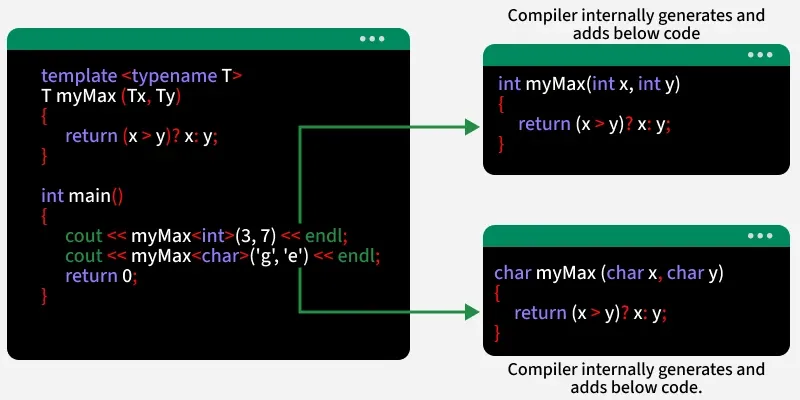

# C++ Templates

[TOC]


A C++ template is a tool for creating generic classes or functions. This allows us to write code that works for any data type without rewriting it for each type.



## Syntax

```c++
template <typename A, typename B, ...>
entity_definition
```

Templates can be used to define:

1. Function Templates
2. Class Templates
3. Variable Templates (C++14 onwards)


## Function templates

Function templates define families of functions parametrized by types (and sometimes values). Key points:

- Declare template parameters with `template<>`, e.g. `template<typename T>`.
- Template arguments are usually deduced from call arguments; you can also explicitly provide them (`f<int>(...)`).
- Function templates can be overloaded; non-template overloads are preferred when equally viable.

```c++
template <typename T>
T add(T x, T y) { return a + b; };

add<int>(1, 2);
```

**Notice**:

- Default template arguments are common for class templates; for function templates, template-argument deduction typically makes defaults unnecessary.
- Prefer `typename` for type template parameters in modern code for clarity.


## Class templates

Class templates parametrize classes by types or values. You instantiate them by supplying template arguments (`Stack<int>`).

```c++
template <typename T>
class Test
{
public:
  T val;
  Test(T x) : val{x} {};
};

Test<int> t;
```

**Notice**:

- Class templates **can** have virtual functions, but template functions cannot be virtual(virtual functions must be known at compile time for vtable layout)

  ```c++
  template <typename T>
  class Base
  {
  public:
    virtual void fun() { }; // ✅OK
  };
  
  class Norm
  {
  public:
    template<typename T>
    virtual void fun() {}; // ❌ERROR! Cannot be virtual
  }
  ```

- Class templates **may** have default template arguments.

- You can fully specialize a class template for a particular argument list: `template<> class Stack<std::string> { ... };` (specialized members must be provided).

- Partial specialization is allowed for class templates (not for function templates): `template<typename T> class MyClass<T*, T*> { ... };`.

- All three correspond to definitions of members of class templates:

  1. Definitions of member functions of class templates
  2. Definitions of nested class members of class templates
  3. Definitions of static data members of class templates
  
- Template parameters are placeholders for class templates. They are declared much like class templates, but the keywords `struct` and `union` cannot be used.


## Template Variables (Since C++ 14)

A template variable is a variable that can work with any type specified when the variable is used, similar to how we use templates for functions or classes.

```c++
template <typename T> constexpr T pi = T(3.14);

pi<double>; // 3.14
pi<float>;  // 3.14
```


## Template Parameters

### Multiple Template Parameters

```c++
template <typename T, typename U>
class Test
{
public:
  T first;
  U second;
  Test(T a, U b) : first{a}, second{b} {}
};

Test<int, float> t1{1, 0.5};
Test<int, std::string> t2{2, std::string("abc")};
```

### Default Template Parameters

Like normal parameters, we can also specify default type arguments to templates.

```c++
template <typename T1, typename T2 = double>
class A
{
public:
  T1 val1;
  T2 val2;
  A(T1 t1, T2 t2) : val1{t1}, val2{t2} {};
};

A<int, float> a1{1, 2.3};
A<int> a2{1, 2.3};
```

```c++
template <typename T1, int T2 = 100>
class B
{
public:
  T1 val1;
  int val2 = T2;
  B(T1 t1) : val1{t1} {};
};

B<int> b1{1}; 	 // val1: 1, val2: 100
B<int, 2> b2{1}; // val1: 1, val2: 2
```

### Template Non-Type Parameters

Templates can take non-type parameters (constant values, not types). These are used to fix values like size, max, or min for a template. Non-type parameters must be compile-time constants because the compiler generates the template code using those values at compile time.

```c++
template <class T, int INIT>
int add(T a)
{
  return a + INIT;
}

add<int, 100>(1); // 101
```

**Notice**:

1. Non-type parameters are typically integral values, pointers, references, or enums. Floating-point and class-type nontype parameters are not supported.

2. Nontype template arguments are the values substituted for nontype parameters. Such a value must be one of the following things:

   - Another nontype template parameter that has the right type
   - A compile-time constant value of integer(or enumeration) type. This is acceptable only if the corresponding parameter has a type that matches that of the value, or a type to which the value can be implicitly converted(for example, a `char` can be provided for an `int` parameter).
   - The name of an external variable or function preceded by the built-in unary `&` ("address of") operator. For functions and array variables, `&` can be left out. Such template arguments match nontype parameters of a pointer type.
   - The previous kind of argument, but without a leading `&` operator, is a valid argument for a non-type parameter of reference type.
   - A pointer-to-member constant; in other words, an expression of the form `&C::m` where `C` is a class type and `m` is a nonstatic member (data or function). This matches nontype parameters of a pointer-to-member type only.

3. Nontype template parameters are declared much like variables, but they cannot have nontype specifiers like `static`, `mutable`, and so forth. They can have `const` and `volatile` qualifiers, but if such a qualifier appears at the outermost level of the parameter type, it is simply ignored.

   ```c++
   template<int N> 							 struct A{}; // ✅
   template<const int N> 				 struct B{}; // ✅
   template<volatile int N> 			 struct C{}; // ✅
   template<const volatile int N> struct D{}; // ✅
   
   template<static int N> 			 struct E{}; // ❌
   template<mutable int N> 		 struct F{}; // ❌
   template<register int N> 		 struct G{}; // ❌
   template<thread_local int N> struct H{}; // ❌
   // ---------------------------------------------
     
   // const at outermost - ⚠️IGNORED (treats N as plain int)
   template<const int N> struct S1 {};
   // const in pointer target - ✅NOT ignored (different type!)
   template<const int* P> struct S2 {};
   // const reference - ✅NOT ignored
   template<const int& R> struct S3 {};
   // volatile pointer - ✅NOT ignored
   template<volatile int* P> struct S4 {};
   // ---------------------------------------------
   
   // These are considered different templates
   template<int* P> struct T1 {};
   template<const int* P> struct T2 {};  // ⚠️Different from T1!
   
   int global = 42;
   const int const_global = 100;
   T1<&global> t1;         // ✅OK: int*
   T1<&const_global>   		// ❌ERROR: const int* cannot convert to int*
   T2<&const_global> t2;   // ✅OK: const int*
   T2<&global> t3;         // ✅OK: int* converts to const int*
   
   ```

4. Non-type parameters are always rvalues (Their address cannot be taken, and they cannot be assigned to).

   ```c++
   template<int N>
   struct Test
   {
     void fun()
     {
       N = N + 1;            // ❌ERROR: N is not a modifiable lvalue
       N++;          			  // ❌ERROR: same issue
       N += 5;       				// ❌ERROR: assignment of read-only parameter
       int* ptr = &N; 				// ❌ERROR: lvalue required as unary '&' operand
       const int* cptr = &N; // ❌ERROR: lvalue required as unary '&' operand
       auto& ref = N; 				// ❌ERROR: cannot bind rvalue to lvalue reference
       
       int copy = N;   					// ✅OK: N is an rvalue, but can be copied
       const int& const_ref = N; // ✅OK: const lvalue reference binds to rvalue
       int&& rvalue_ref = N;     // ✅OK: binding rvalue reference to rvalue
     }
     
     // ✅OK:  can be passed by value (copy)
     static void by_value(int x) {};
     // ❌ERROR: Cannot pass N by lvalue reference
     static void by_lvalue_ref(int& x) {};
     // ✅OK: Can pass by const lvalue reference
     static void by_const_lvalue_ref(const int& x) {};
     // ✅OK: an pass by rvalue reference
     static void by_rvalue_ref(int&& x) {};
     void test_static()
     {
       by_value(N);
       by_lvalue_ref(N);
       by_const_lvalue_ref(N);
       by_rvalue_ref(static_cast<int&&>(N));
     };
   };
   ```

### Template Arguments Deduction

Template argument deduction automatically deduces the data type of the argument passed to the templates. This allows us to instantiate the template without explicitly specifying the data type. (The template argument deduction for classes is only available since C++17.)

#### Function Template Arguments Deduction(FTAD)

Function template argument deduction has been part of C++ since the C++98 standard. We can skip declaring the type of arguments we want to pass to the function template, and the compiler will automatically deduce the type using the arguments we passed in the function call.

```c++
template<typename T>
T mul(T first, T second) { return first * sceond; }

mul(3, 4); // auto deduce to mul<int>(3, 4)
```

#### Class Template Arguments Deduction(CTAD)

The class template argument deduction was added in C++17 and has since been part of the language. It allows us to create the class template instances without explicitly defining the types, just like function templates.

```c++
// build with: g++ -std=c++17 -o xx xx.cpp 
template<typename T>
class Test
{
public:
  T val;
  Test(T x) : val{x} {}
  void print() { std::cout << val << std::endl; }
};

Test t1{1};   // deduce to Test<int>
Test t2{1.2}; // deduce to Test<double>
t1.print();
```

### Notice

1. Template type arguments are the "values" specified for template type parameters. Most commonly used types can be used as template arguments, but there are two exceptions:

   - Local classes and enumerations(in other words, types declared in a function definition) cannot be involved in template type arguments.
   - Types that involve unnamed class types or unnamed enumeration types cannot be template type arguments(unnamed classes or enumerations that are given a name through a typedef declaration are OK).

   ```c++
   TODO
   ```

2. Two sets of template arguments are equivalent when the values of the arguments are identical one-for-one.

3. Template argument deduction applies exclusively to function and member function templates. In particular, the arguments for a class template are not deduced from the arguments to a call of one of its constructors. For example:

   ```c++
   template<typename T>
   class S 
   {
       public:
       	S(T b) : a(b) {}
       private:
       	T a;
   };
   
   S x(12); // error
   ```

4. Even when a default call argument is not dependent, it cannot be used to deduce template arguments. This means that the following is invalid C++:

   ```c++
   template<typename T>
   void f(T x = 42){...}
   
   f<int>(); // correct；T=int
   f();      // error
   ```


## Template Metaprogramming

In C++, template metaprogramming refers to templates performing computation at compile time rather than runtime. To perform computation at compile time, template metaprogramming involves recursive template structures where templates call other templates during compilation.

```c++
template<int N>
struct Factorial
{
	static const int value = N * Factorial<N - 1>::value;
};

template<>
struct Factorial<0>
{
  static const int value = 1;
};

Factorial<5>::value; // 120 (5 * 4 * 3 * 2 * 1)
```

### Notice

1. Template arguments for a function template can be specified explicitly or deduced from the way the template is used.

   ```c++
   template <typename Func, typename T>
   void apply(Func f, T x) {
       f(x);
   }
   
   template <typename T> void multi(T t) {
       cout << 1 << ": " << t << endl;
   }
   
   template <typename T> void multi(T *t) {
       cout << 2 << ": " << *t << endl;
   }
   
   int i = 3;
   apply(&multi<int>, i); // SFINAE
   ```
   
   This "substitution-failure-is-not-an-error"(SFINAE) principle is clearly an important ingredient to make the overloading of function templates practical. However, it also enables remarkable compile-time techniques.
   
1. Deduction rules in brief:

   - Arrays and functions decay to pointers during deduction.
   - Top-level `const`/`volatile` qualifiers are ignored.
   - Qualified type names and certain non-type expressions are not deduced.

   (If deduction fails, provide explicit template arguments or use overloads. SFINAE enables graceful exclusion of templates during overload resolution.)


## Template Specialization

Template specialization means: We write a special/custom version of a template for a specific data type or condition.

### Full Specialization

provide an alternative implementation for specific template arguments: `template<> class Foo<int> { ... };`.

```c++
template <typename T>
class Storage
{
  T data;
public:
  Storage(T value) : data(value) {}
};

template <>
class Storage<bool>
{
  bool data;
public:
  Storage(bool value) : data(value) {}
};
```

### Partial Specialization

Adjust class-template behavior for a range of argument patterns.

```c++
template <typename T, typename U>
class MyClass {};

// Partial specialization: both types are the same
template <typename T>
class MyClass<T, T> {};

// Partial specilization: second type is int
template <typename T>
class MyClass<T, int> {};
```

### Function Template Specialization

Function Template Specialization allows you to define a custom version of a function template for a specific data type, enabling different behavior while keeping the same function name and structure.

```c++
template <typename T>
void fun(T x) {}; // generic function template

template <>
void fun<int>(int x) {}; // spcialized version for int

fun(1.2); // call the generic function template
fun(1); // call the spcialized version for int
```

## Template Instantiation

Instantiation substitutes template arguments to produce concrete code. Two-phase lookup means:

1. First phase: parse template and perform non-dependent name lookup.
2. Second phase: at instantiation, resolve dependent names.

This separation can cause surprising lookup behaviour; use explicit qualification, `this->`, or `typename`/`template` to resolve ambiguities.


## Polymorphic Templates

Dynamic and static polymorphism provide support for different C++ programming idioms:

- Polymorphism implemented via inheritance is bounded and dynamic:
  - Bounded means that the interfaces of the types participating in the polymorphic behavior are predetermined by the design of the common base class (other terms for this concept are invasive)。
  - Dynamic means that the binding of the interfaces is done at run time (dynamically).
- Polymorphism implemented via templates is unbounded and static:
  - Unbounded means that the interfaces of the types participating in the polymorphic behavior are not predetermined (other terms for this concept are noninvasive or nonintrusive).
  - Static means that the binding of the interfaces is done at compile time (statically).

Dynamic polymorphism in C++ exhibits the following strengths:

- Heterogeneous collections are handled elegantly.
- The executable code size is potentially smaller (because only one polymorphic function is needed, whereas distinct template instances must be generated to handle different types).
- Code can be entirely compiled; hence, no implementation source must be published (distributing template libraries usually requires distribution of the source code of the template implementations).

In contrast, the following can be said about static polymorphism in C++:

- Collections of built-in types are easily implemented. More generally, the interface commonality need not be expressed through a common base class.
- Generated code is potentially faster (because no indirection through pointers is needed a priori, and non-virtual functions can be inlined much more often).
- Concrete types that provide only partial interfaces can still be used if only that part ends up being exercised by the application.

Generic programming is a subdiscipline of computer science that deals with finding abstract representations of efficient algorithms, data structures, and other software concepts, and with their systematic organization... Generic programming focuses on representing families of domain concepts.


## Templates and Inheritance

The designers of C++ had various reasons to avoid zero-size classes.

However, even though there are no zero-size types in C++, the C++ standard does specify that when an empty class is used as a base class, no space needs to be allocated for it, provided that it does not cause it to be allocated to the same address as another object or subobject of the same type.

empty base class optimization (or EBCO) means in practice:

```c++
class Empty{
    typedef int Int;
};

class EmptyToo : public Empty {
};

class EmptyThree : public EmptyToo {
};
```

*Curiously Recurring Template Pattern (CRTP)*: This oddly named pattern refers to a general class of techniques that consists of passing a derived class as a template argument to one of its own base classes. In it's simplest form, C++ code for such a pattern looks as follows:

```c++
template <typename Derived>
class CuriousBase {
    ...
};

class Curious : public CuriousBase<Curious> {
    ...
};
```

C++ allows us to parameterize directly three kinds of entities through templates: types, constants("nontypes"), and templates. However, indirectly, it also allows us to parameterize other attributes such as the virtuality of a member function.


## Type Classification

It is sometimes useful to be able to know whether a template parameter is a built-in type, a pointer type, or a class type, and so forth. 

The problem with function types is that, because of the arbitrary number of parameters, there isn't a finite syntactic construct using template parameters that describes them all:

- provide partial specializations for functions with a template argument list that is shorter than a chosen limit

  ```c++
  template<typename R>
  class Compoud<R()>{...}
  
  template<typename R, typename P1>
  class Compoud<R(P1, ...)>{...}
  ```

- uses the SFINAE(substitution-failure-is-not-an-error) principle: An overloaded function template can be followed by explicit template arguments that are invalid for some of the templates:

  ```c++
  template<typename U> static char test(...);
  template<typename U> static int test(U(*)[1]);
  enum {Yes = sizeof(test<T>(0) == 1)};s
  ```


## Summary

### Function Template vs Class Template

| Feature                    | Function Template                     | Class Template                                               |
| :------------------------- | :------------------------------------ | :----------------------------------------------------------- |
| **Argument Deduction**     | Usually automatic from call arguments | Must be explicit (until C++17's CTAD)                        |
| **Default Arguments**      | Not allowed (or unusual)              | Allowed and common                                           |
| **Partial Specialization** | Not allowed (use overloading)         | Allowed                                                      |
| **Primary Use Case**       | Algorithms (e.g., `sort`, `find`)     | Containers (e.g., `vector`, `map`), and type wrappers        |
| **Member Functions**       | N/A (it *is* a function)              | Defined inside or outside, but the class template parameter scope applies |

### Best Practices

1. Keep template definitions in headers (They need to be visible to all translation units).

2. Use `typename` instead of `class` (More descriptive for type parameters).

3. Minimize template bloat (Factor non-type-dependent code into base classes).

4. Use `static_assert` for constraints

   ```c++
   // < C++20
   template <typename T>
   class A { static_assert(std::is_arithmetic_v<T>, "xxx"); };
                          
   // >= C++20
   template <std::integral T>
   class B {};
   ```

5. This has two important consequences for class members:

   1. A function generated from a member function template never overrides a virtual function.
   2. A constructor generated from a constructor template is never a default copy constructor. (Similarly, an assignment generated from an assignment template is never a copy-assignment operator. However, this is less prone to problems because, unlike copy constructors, assignment operators are never called implicitly.)

### Tricky Basics

The keyword `typename` was introduced during the standardization of C++ to clarify that an identifier inside a template is a type. Consider the following example:

```c++
template <typename T>
class MyClass{
    typename T::SubType *ptr;
    ...
};
```

Here, the second `typename` is used to clarify that `SubType` is a type defined within class  `T`. Thus, `ptr` is a pointer to the type `T::SubType`.

Without a `typename`, `SubType` would be considered a static member. Thus, it would be a concrete variable or object. As a result, the expression 

`T::SubType *ptr` 

would be a multiplication of the static `SubType` member of class `T` with `ptr`.

A very similar problem was discovered after the introduction of `typename`. Consider the following example using the standard `bitset` type:

```c++
template <int N>
void printBitset(std::bitset<N> const& bs)
{
    std::cout << bs.template to_string<char, char_traits<char>, allocator<char> >();
}
```

In conclusion, the `.template` notation (and similar notations such as `->template`) should be used only inside templates and only if they follow something that depends on a template parameter.

For class templates with base classes, using a name `x` by itself is not always equivalent to `this->x`, even though a member `x` is inherited.

```c++
template <typename T>
class Derived : public Base<T> {...}
```

Class members can also be templates. This is possible for both nested classes and member functions.

```c++
template <typename T>
class Stack {
    template<typename T2>
    Stack<T>& operator=(Stack<T2> const& );
};

template <typename T>
template <typename T2>
Stack<T>& Stack<T>::operator=(Stack<T2> const& op2) {
    ...
}
```

Template template parameters examples:

```c++
template <typename T, 
    template<typeanme ELEM, 
    typename ALLOC = std::allocator<ELEM>>
    class CONT> // class only
class Stack{
    public:
        Stack(){}
        Stack(Stack<T, CONT> const &);
        ~Stack(){}
        Stack<T, CONT> operator=(Stack<T, CONT> const &);
    private:
        CONT<T> elems;
};
```

For fundamental types such as `int`, `double`, or pointer types, there is no default constructor that initializes them with a useful default value. Instead, any non-initialized local variable has an undefined value:

```c++
template <typename T>
void foo()
{
    T x = T();
}

```

The explanation for this behavior is that during argument deduction, array-to-pointer conversion(often called decay) occurs only if the parameter does not have a reference type. This is demonstrated by the following program:

```c++
template <typename T>
inline T const& max(T const& a, T const& b) {
    return a < b ? b : a;
}

std::string s;
::max("apple", "peach");  // OK
::max("apple", "tomato"); // ERROR
::max("apple", s);        // ERROR

```

- Use non-references instead of references (however, this can lead to unnecessary copying)

- overload using both reference and nonreference parameters(however, this might lead to ambiguities)

- overload with concrete types(such as `std::string`)

- overload with array types types, for example:

  ```c++
  template<typename T, int N, int M>
  T const* max(T const (&a)[N], T const (&b)[M])
  {
      return a < b ? b : a;
  } 
  ```

- force application programmers to use explicit conversions


## Reference

[1] C++ Templates: The Complete Guide. David Vandevoorde, Nicolai M. Josuttis . 2004

[2] [Templates in C++](https://www.geeksforgeeks.org/cpp/templates-cpp/)

[3] [Template Specialization in C++](https://www.geeksforgeeks.org/cpp/template-specialization-c/)
