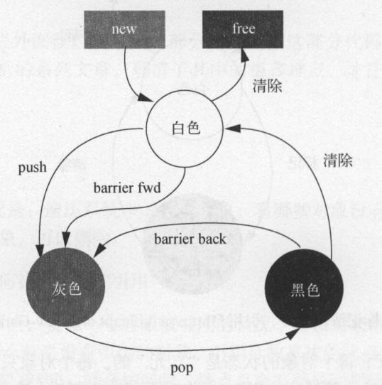

# Lua源码分析-GC


<!-- vim-markdown-toc GFM -->

* [原理](#原理)
    - [三色增量标记清除算法](#三色增量标记清除算法)
* [数据结构](#数据结构)
    - [可回收对象](#可回收对象)
    - [颜色定义](#颜色定义)
* [流程](#流程)
* [触发](#触发)
* [优化](#优化)
    - [测试](#测试)
* [参考](#参考)

<!-- vim-markdown-toc -->


## 原理

### 三色增量标记清除算法

三色增量标记清除算法(Tri-Color Incremental Mark and Sweep)，将内存元素分为三种颜色：



- 白色

  - `当前白色(CurrentWhite)` 当前扫描到的对象（防止刚创建还没使用就被GC掉）。
  - `非当前白色(OtherWhite)` 以前创建的对象。

  当前对象为待访问状态，表示对象还没有被GC标记过。

- 灰色

  当前对象为待扫描状态，表示对象已经被GC访问过，但是该对象引用的其他对象还没有被访问到。

- 黑色

  当前对象为已扫描状态，表示对象已经被GC访问过，并且该对象引用的其他对象也被访问过了。


## 数据结构

### 可回收对象

```c
/**
 * @brief 宏定义需要GC的类型
 * @param next 指向下一个GC链表的成员 @param tt 数据的类型 @param marked GC标记颜色
 */
#define CommonHeader	GCObject *next; lu_byte tt; lu_byte marked

/**
 * @brief 需要进行GC的数据类型 
 */
struct GCObject {
  CommonHeader;
};
```

### 颜色定义

```c
#define WHITE0BIT	0  			/* 0型白色 */
#define WHITE1BIT	1  			/* 1型白色 */
#define BLACKBIT	2  			/* 黑色 */
#define FINALIZEDBIT	3  	/* 没有被引用需要回收的udata */
```


## 流程

Lua的GC过程是步进式的，中间可以被打断；每次单独进入GC时，会进入函数`singlestep`，把GC过程分为多个阶段，从而根据当前GC所处阶段来进行不同的处理。

GC包含以下阶段（源码版本 Lua 5.3.6）：

- `GCSpause`

  GC开始阶段，初始化一些属性，将一些根节点（主线程对象，主线程环境对象，全局对象等）push到灰色链表中。

- `GCSpropagate`

  分布进行扫描，每次从灰色链表pop一个对象，遍历该对象的子对象。

- `GCSatomic`

  原子操作，在GCSpropagate过程中可能会有新的对象创建，这时候为了防止遍历被打断的，执行原子操作（原子操作不可被打断）。

- `GCSswpallgc`

- `GCSswpfinobj`

- `GCSswptobefnz`

- `GCSswpend`

- `GCScallfin`


## 触发

Lua有两种触发内存回收方式：

- 自动回收

  在每次调用内存分配相关的操作时，使用`luaC_checkGC`来检查是否满足触发条件；

  当满足触发条件：`GC时间到了&&待回收内存 > 0`时触发回收；

  `luaC_checkGC`的源码如下：

  ```c
  #define luaC_condGC(L,pre,pos) \
  	{ if (G(L)->GCdebt > 0) { pre; luaC_step(L); pos;}; \
  	  condchangemem(L,pre,pos); }
  
  /* more often than not, 'pre'/'pos' are empty */
  #define luaC_checkGC(L)		luaC_condGC(L,(void)0,(void)0
  ```

- 手动调用API触发回收

  `lua_gc`

  TODO


## 优化

1. 云风的issue里面说他们的实验[“时间驱动GC”优于“内存分配驱动GC”](http://lua-users.org/lists/lua-l/2020-12/msg00175.html)（待确认）。
2. ~~可以通过将`GCthreshold`(GC阀值)设置为一个非常大的值来关闭自动GC。~~

### 测试

TODO


## 参考

[1] Roberto Ierusalimschy.Garbage Collection in Lua

[2] [Lua GC 的工作原理](https://blog.codingnow.com/2018/10/lua_gc.html)

[3] [云风的issue-Hybird GC issues in lua 5.4](http://lua-users.org/lists/lua-l/2020-12/msg00175.html)

[4] [Lua GC机制](https://www.cnblogs.com/gangtie/p/12724295.html)

