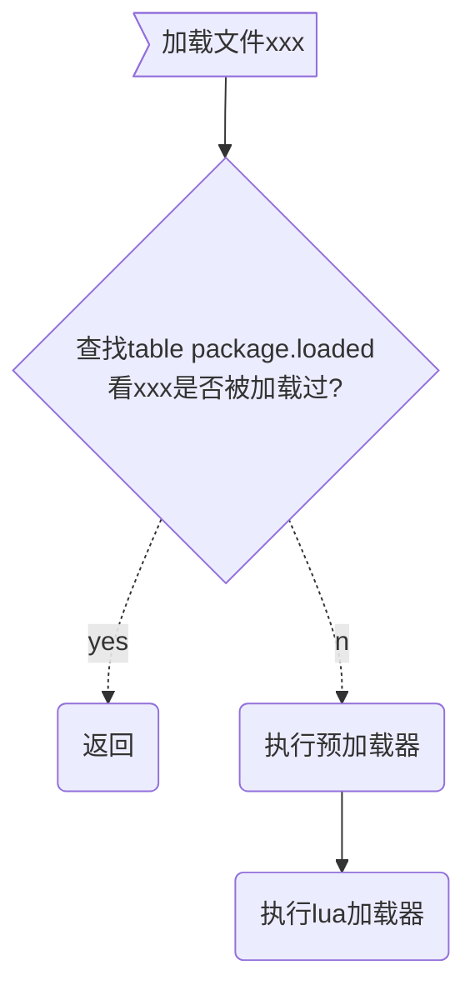

# LUA模块

<!-- vim-markdown-toc GFM -->

* [require机制](#require机制)
    - [加载策略](#加载策略)
* [参考](#参考)

<!-- vim-markdown-toc -->

## require机制

### 加载策略

1. 查找`package.loaded`表，检测是否被加载过；如果被加载过，require返回保存的值。
2. 如果没有加载过，按照以下顺序运行加载器执行加载：
   - `预加载器`，执行package.preload[modname]，一些特殊模块会有预加载器
   - `lua加载器`，查找前面介绍的package.path
   - `c加载器`，查找package.cpath
   - `一体化加载器`

TODO

## 参考

- [lua require机制](https://blog.csdn.net/zxm342698145/article/details/80607072)
- [Lua模块与require机制的理解](https://www.jianshu.com/p/d727825816ee)

