# markdown手册


<!-- vim-markdown-toc GFM -->

    * [标题](#标题)
+ [一级标题](#一级标题)
    * [二级标题](#二级标题)
        - [三级标题](#三级标题)
            + [四级标题](#四级标题)
                * [五级标题](#五级标题)
                    - [六级标题](#六级标题)
    * [段落](#段落)
    * [字体](#字体)
    * [分割线](#分割线)
    * [删除线](#删除线)
    * [下划线](#下划线)
    * [列表](#列表)
    * [区块](#区块)
    * [代码](#代码)
+ [inclue <iostream>](#inclue-iostream)
    * [链接](#链接)
    * [图片](#图片)
    * [锚定](#锚定)
    * [脚注](#脚注)
    * [表格](#表格)
    * [html语法样式](#html语法样式)
        - [颜色](#颜色)
        - [代码块](#代码块)
+ [include <iostream>](#include-iostream)
        - [单元格](#单元格)
    * [公式](#公式)
        - [一些常用的数学公式](#一些常用的数学公式)
        - [矩阵](#矩阵)
        - [分类表达式](#分类表达式)
        - [多行表达式](#多行表达式)
        - [方程组](#方程组)
        - [表格](#表格-1)
        - [交换图表](#交换图表)
    * [绘制流程图](#绘制流程图)
        - [样式流程图](#样式流程图)
    * [绘制时序图](#绘制时序图)
        - [标准时序图](#标准时序图)
    * [绘制甘特图](#绘制甘特图)
    * [参考](#参考)

<!-- vim-markdown-toc -->


## 标题

```markdown
# 一级标题
## 二级标题
### 三级标题
#### 四级标题
##### 五级标题
###### 六级标题
```

# 一级标题

## 二级标题

### 三级标题

#### 四级标题

##### 五级标题

###### 六级标题


## 段落

```markdown
a  

b
```

a  

b


## 字体

``` markdown
*斜体*
_斜体_
**粗体**
__粗体__
___粗斜体___
```

*斜体*
_斜体_
**粗体**
__粗体__
___粗斜体___


## 分割线

```markdown
***
* * *
******
- - -
----------
```

***

* * *

******

- - -

----------


## 删除线

``` markdown
~~删除线~~ 
```

~~删除线~~ 


## 下划线

``` markdown
<u>下划线</u>
```

<u>下划线</u>


## 列表

```markdown
* 无序列表1

+ 无序列表2

- 无序列表3

1. 有序列表

1. 列表嵌套
   -  嵌套
```

* 无序列表1

+ 无序列表2

- 无序列表3

1. 有序列表

1. 列表嵌套
   -  嵌套


## 区块

```markdown
> 普通区块

> 嵌套区块1层
>
> > 嵌套区块2层
```

> 普通区块

> 嵌套区块1层
>
> > 嵌套区块2层


## 代码

````markdown
```c++
#inclue <iostream>
int main(void) {
	std::cout << "hello world" << std::endl;
}
```
````

```c++
#inclue <iostream>
int main(void) {
	std::cout << "hello world" << std::endl;
}
```


## 链接

```markdown
这个链接用 1 作为网址变量 [Google][1]

这个链接用 runoob 作为网址变量 [Runoob][runoob]

[1]: http://www.google.com/
[runoob]: http://www.runoob.com/
```

这个链接用 1 作为网址变量 [Google][1]

这个链接用 runoob 作为网址变量 [Runoob][runoob]

[1]: http://www.google.com/
[runoob]: http://www.runoob.com/


## 图片

```markdown

```


## 锚定

```markdown
这是正文,在这里引用锚点[<sup>[1]</sup>](#refer-anchor-1)

<div id="refer-anchor-1">[1] 作者. 文献名. 页码 起始-结束. 年份</div>
```

这是正文,在这里引用锚点[<sup>[1]</sup>](#refer-anchor-1)

<div id="refer-anchor-1">[1] 作者. 文献名. 页码 起始-结束. 年份</div>


## 脚注

**注意：非标准语法，但typora支持**

```markdown
这里添加脚注[^1]

[^1]: 这里是脚注说明
```

这里添加脚注[^1]

[^1]: 这里是脚注说明


## 表格

**无对齐方式:**

```markdown
|  表头  |  表头  |
|--------|--------|
| 单元格 | 单元格 |
| 单元格 | 单元格 |
```

| 表头   | 表头   |
| ------ | ------ |
| 单元格 | 单元格 |
| 单元格 | 单元格 |

**对齐方式:**

```markdown
| 左对齐 |  居中  | 右对齐 |
| :----- | :----: | -----: |
| 单元格 | 单元格 | 单元格 |
| 单元格 | 单元格 | 单元格 |
```

| 左对齐 |  居中  | 右对齐 |
| :----- | :----: | -----: |
| 单元格 | 单元格 | 单元格 |
| 单元格 | 单元格 | 单元格 |


## html语法样式

### 颜色

```markdown
<span style='background-color:yellow'>黄色</span>
```

<span style='background-color:yellow'>黄色</span>

### 代码块

```markdown
<pre>
#include <iostream>
int main
</pre>
```

<pre>
#include <iostream>
int main
</pre>

### 单元格

```markdown
<table>
    <caption> 标题 </caption>
    <tr align = "left">
        <th> 表头1 </th>
        <th> 表头2 </th>
    </tr>
    <tr align = "left">
        <td rowspan = "2"> 单元格1 </td>
        <td align = "left"> 单元格2 </td>
    </tr>
    <tr>
        <td align = "center"> 单元格3 </td>
    </tr>
    <tr align = "right">
        <td colspan = "2"> 单元格4 </td>
    </tr>
</table>
```

<table>
    <caption> 标题 </caption>
    <tr align = "left">
        <th> 表头1 </th>
        <th> 表头2 </th>
    </tr>
    <tr align = "left">
        <td rowspan = "2"> 单元格1 </td>
        <td align = "left"> 单元格2 </td>
    </tr>
    <tr>
        <td align = "center"> 单元格3 </td>
    </tr>
    <tr align = "right">
        <td colspan = "2"> 单元格4 </td>
    </tr>
</table>


## 公式

### 一些常用的数学公式

| 效果                                                         | 源码                                                         |
| :----------------------------------------------------------- | ------------------------------------------------------------ |
| $\alpha$, $\beta$, $\gamma$, $\delta$, $\epsilon$, $\omega$, $\lambda$, $\pi$, $\tau$,  $\varphi$, $\phi$, $\zeta$, $\Omega$, $\mu$, $\sigma$, $\theta$, $\nu$, $\xi$ | `$\alpha$, $\beta$, $\gamma$, $\delta$, $\epsilon$, $\omega$, $\lambda$, $\pi$, $\tau$,  $\varphi$, $\phi$, $\zeta$, $\Omega$, $\mu$, $\sigma$, $\theta$, $\nu$, $\xi$` |
| $\infty$, $\nabla$, $\Delta$, $\Gamma$, $\Theta$, $\Lambda$, $\Sigma$, $\Upsilon$, $\Phi$ | `$\infty$, $\nabla$, $\Delta$, $\Gamma$, $\Theta$, $\Lambda$, $\Sigma$, $\Upsilon$, $\Phi$` |
| $\oplus$, $\ominus$, $\diamond$, $\odot$, $\oslash$, $\uplus$, $\otimes$, $\bigcirc$, $\amalg$, $\bigtriangleup$, $\bigtriangledown$, $\dagger$, $\lhd$, $\rhd$, $\ddagger$, $\unlhd$, $\unrhd$, $\wr$ | `$\oplus$, $\ominus$, $\diamond$, $\odot$, $\oslash$, $\uplus$, $\otimes$, $\bigcirc$, $\amalg$, $\bigtriangleup$, $\bigtriangledown$, $\dagger$, $\lhd$, $\rhd$, $\ddagger$, $\unlhd$, $\unrhd$, $\wr$` |
| $\forall$, $\exists$, $\because$, $\therefore$, $\neg$       | `$\forall$, $\exists$, $\because$, $\therefore$, $\neg$`     |
| $x \in y$, $x \notin y$, $x \subset y$, $x \not\subset y$, $x \subseteq y$, $x \subsetneq y$ | `$x \in y$, $x \notin y$, $x \subset y$, $x \not\subset y$, $x \subseteq y$, $x \subsetneq y$` |
| $x \cup y$, $x \cap y$, $x \bigcup y$, $x \bigcap y$, $x \setminus y$, $x \bigvee y$, $x \bigwedge y$ | `$x \cup y$, $x \cap y$, $x \bigcup y$, $x \bigcap y$, $x \setminus y$, $x \bigvee y$, $x \bigwedge y$` |
| $\mathbb{ABCdef}$                                            | `$\mathbb{ABCdef}$`                                          |
| Ⅰ, Ⅱ, Ⅲ, Ⅳ, Ⅴ, Ⅵ, Ⅶ, Ⅷ, Ⅸ, Ⅹ, Ⅺ, Ⅻ, ⅩⅢ, ⅩⅣ, ⅩⅤ, ⅩⅥ, ⅩⅦ, ⅩⅧ, ⅩⅨ, ⅩⅩ, ⅩⅩⅩ, ⅩⅬ, Ⅼ, ⅬⅩ, ⅬⅩⅩ, ⅬⅩⅩⅩ, ⅩⅭ, ⅩⅭⅨ | `Ⅰ, Ⅱ, Ⅲ, Ⅳ, Ⅴ, Ⅵ, Ⅶ, Ⅷ, Ⅸ, Ⅹ, Ⅺ, Ⅻ, ⅩⅢ, ⅩⅣ, ⅩⅤ, ⅩⅥ, ⅩⅦ, ⅩⅧ, ⅩⅨ, ⅩⅩ, ⅩⅩⅩ, ⅩⅬ, Ⅼ, ⅬⅩ, ⅬⅩⅩ, ⅬⅩⅩⅩ, ⅩⅭ, ⅩⅭⅨ` |
| $x \pm y$, $x \mp y$, $x \times y$, $x \cdot y$, $x \ast y$, $x \div y$, $x/y$, $x \quad y$ | `$x \pm y$, $x \mp y$, $x \times y$, $x \cdot y$, $x \ast y$, $x \div y$, $x/y$, $x \quad y$` |
| $x \geq y$, $x \leq y$, $x \neq y$, $x \approx y$, $x \equiv y$, $x \leqslant y$, $x \geqslant y$, $x < y$, $x > y$, $x \ll y$, $x \gg y$ | `$x \geq y$, $x \leq y$, $x \neq y$, $x \approx y$, $x \equiv y$, $x \leqslant y$, $x \geqslant y$, $x < y$, $x > y$, $x \ll y$, $x \gg y$` |
| $\leftarrow$, $\Leftarrow$, $\rightarrow$, $\Rightarrow, \mapsto$ | `$\leftarrow$, $\Leftarrow$, $\rightarrow$, $\Rightarrow, \mapsto$` |
| $\lfloor x \rfloor$，$\lceil x \rceil$                       | `$\lfloor x \rfloor$，$\lceil x \rceil$`                     |
| $\dot x$, $\ddot x$, $\dot {\dot x}$, $\hat x$, $\widehat {xy}$, $\overline x$, $\vec x$, $\overrightarrow {xy}$, $\overleftarrow {xy}$, $\overleftrightarrow{xy}$, $\vec{x} \cdot \vec{y}=0$ | `$\dot x$, $\ddot x$, $\dot {\dot x}$, $\hat x$, $\widehat {xy}$, $\overline x$, $\vec x$, $\overrightarrow {xy}$, $\overleftarrow {xy}$, $\overleftrightarrow{xy}$, $\vec{x} \cdot \vec{y}=0$` |
| $\underleftrightarrow{a+b}$, $\underrightarrow{a+b}$, $\underleftarrow{a+b}$, $\overline{a+b}$, $\underline{a+b}$, $\overbrace{a+\underbrace{b+c}_{1.0}+d}^{2.0}$, $\underbrace{a\cdot a\cdots a}_{b\text{ times}}$ | `$\underleftrightarrow{a+b}$, $\underrightarrow{a+b}$, $\underleftarrow{a+b}$, $\overline{a+b}$, $\underline{a+b}$, $\overbrace{a+\underbrace{b+c}_{1.0}+d}^{2.0}$, $\underbrace{a\cdot a\cdots a}_{b\text{ times}}$` |
| $\frac{7x+5}{1+y^2}$, $\frac{\partial x}{\partial y}$, $\boxed{E=mc^2}$ | `$\frac{7x+5}{1+y^2}$, $\frac{\partial x}{\partial y}$, $\boxed{E=mc^2}$` |
| $x=a_0 + \cfrac {1^2}{a_1 + \cfrac {2^2}{a_2 + \cfrac {3^2}{a_3 + \cfrac {4^2}{a_4 + ...}}}}$ | `$x=a_0 + \cfrac {1^2}{a_1 + \cfrac {2^2}{a_2 + \cfrac {3^2}{a_3 + \cfrac {4^2}{a_4 + ...}}}}$` |
| $\overset{a,b}{f(1)}$, $\underset{ab}{f(1)}$                 | `$\overset{a,b}{f(1)}$, $\underset{ab}{f(1)}$`               |
| $\ln15$, $\log_2 10$, $\lg7$                                 | `$\ln15$, $\log_2 10$, $\lg7$`                               |
| $a^b$, $z=z_l$, $\cdots$, $\vdots$, $\sqrt{2}+\sqrt[n]{3}$   | `$a^b$, $z=z_l$, $\cdots$, $\vdots$, $\sqrt{2}+\sqrt[n]{3}$` |
| $\sum \frac{1}{i^2}$, $\sum_{r=1}^n$, $\sum_{i=0}^{n}i^2$, $\sum_{k_0,k_1,\ldots>0 \atop k_0+k_1+\cdots=n}A_{k_0}A_{k_1}\cdots$ | `$\sum \frac{1}{i^2}$, $\sum_{r=1}^n$, $\sum_{i=0}^{n}i^2$, $\sum_{k_0,k_1,\ldots>0 \atop k_0+k_1+\cdots=n}A_{k_0}A_{k_1}\cdots$` |
| $\prod \frac{1}{i^2}$,  $\prod_{i=1}^{K}$                    | `$\prod \frac{1}{i^2}$,  $\prod_{i=1}^{K}$`                  |
| $\lim^{x \to \infty}_{y \to 0} {\frac{x}{y}}$                | `$\lim^{x \to \infty}_{y \to 0} {\frac{x}{y}}$`              |
| $\int^{\infty}_{0}{xdx}$, $\iint$, $\iiint$, $\oint$         | `$\int^{\infty}_{0}{xdx}$, $\iint$, $\iiint$, $\oint$`       |
| ${n+1 \choose k}={n \choose k}+{n \choose k-1}$              | `${n+1 \choose k}={n \choose k}+{n \choose k-1}$`            |
| $ f\left(    \left[       \frac{        1+\left\{x,y\right\}      }{        \left(           \frac xy + \frac yx        \right)        (u+1)      }+a    \right]^{3/2} \right) \tag {行标} $ | `$ f\left(    \left[       \frac{        1+\left\{x,y\right\}      }{        \left(           \frac xy + \frac yx        \right)        (u+1)      }+a    \right]^{3/2} \right) \tag {行标} $` |

### 矩阵

**矩阵(matrix)的表示:**

```markdown
$$
\begin{matrix}
x_{_{11} } & x_{_{12} } & \dots & x_{_{1n} } \\
x_{_{21} } & x_{_{22} } & \dots & x_{_{2n} } \\
\vdots & \vdots & \ddots  & \vdots  \\
x_{_{m1} } & x_{_{m2} } & \dots & x_{_{mn} } \\
\end{matrix}
$$
```

$$
\begin{matrix}
x_{_{11} } & x_{_{12} } & \dots & x_{_{1n} } \\
x_{_{21} } & x_{_{22} } & \dots & x_{_{2n} } \\
\vdots & \vdots & \ddots  & \vdots  \\
x_{_{m1} } & x_{_{m2} } & \dots & x_{_{mn} } \\
\end{matrix}
$$

**矩阵(bmatrix)的表示:**

```markdown
$$ \begin{bmatrix}
1 & 2 & 3 \\
4 & 5 & 6 \\
7 & 8 & 9
\end{bmatrix} $$
```

$$ \begin{bmatrix}
1 & 2 & 3 \\
4 & 5 & 6 \\
7 & 8 & 9
\end{bmatrix} $$

**矩阵(Bmatrix)的表示:**

```markdown
$$ \begin{Bmatrix}
1 & 2 & 3 \\
4 & 5 & 6 \\
7 & 8 & 9
\end{Bmatrix} $$
```

$$ \begin{Bmatrix}
1 & 2 & 3 \\
4 & 5 & 6 \\
7 & 8 & 9
\end{Bmatrix} $$

**矩阵(pmatrix)的表示:**

```markdown
$\begin{pmatrix}1 & 2 \\ 3 & 4\\ \end{pmatrix}$
```

$\begin{pmatrix}1 & 2 \\ 3 & 4\\ \end{pmatrix}$

**矩阵(vmatrix)的表示:**

```markdown
$\begin{vmatrix}1 & 2 \\ 3 & 4\\ \end{vmatrix}$
```

$\begin{vmatrix}1 & 2 \\ 3 & 4\\ \end{vmatrix}$

**矩阵(Vmatrix)的表示:**

```markdown
$\begin{Vmatrix}1 & 2 \\ 3 & 4\\ \end{Vmatrix}$
```

$\begin{Vmatrix}1 & 2 \\ 3 & 4\\ \end{Vmatrix}$

### 分类表达式

**分类表达式1:**

```markdown
$$
f(n)
\begin{cases}
\cfrac n2, &if\ n\ is\ even\\
3n + 1, &if\  n\ is\ odd
\end{cases}
\qquad (1)
$$
```

$$
f(n)
\begin{cases}
\cfrac n2, &if\ n\ is\ even\\
3n + 1, &if\  n\ is\ odd
\end{cases}
\qquad (1)
$$

**分类表达式2:**

```markdown
$$
L(Y,f(X)) =
\begin{cases}
0, & \text{Y = f(X)}  \\
1, & \text{Y $\neq$ f(X)}
\end{cases}
$$
```

$$
L(Y,f(X)) =
\begin{cases}
0, & \text{Y = f(X)}  \\
1, & \text{Y $\neq$ f(X)}
\end{cases}
$$

### 多行表达式

```markdown
$$
\begin{equation}\begin{split} 
a&=b+c-d \\ 
&\quad +e-f\\ 
&=g+h\\ 
& =i 
\end{split}\end{equation}
\qquad (1)
$$
```

$$
\begin{equation}\begin{split} 
a&=b+c-d \\ 
&\quad +e-f\\ 
&=g+h\\ 
& =i 
\end{split}\end{equation}
\qquad (1)
$$

### 方程组

```markdown
$$
\left \{ 
\begin{array}{c}
a_1x+b_1y+c_1z=d_1 \\ 
a_2x+b_2y+c_2z=d_2 \\ 
a_3x+b_3y+c_3z=d_3
\end{array}
\right.
$$
```

$$
\left \{ 
\begin{array}{c}
a_1x+b_1y+c_1z=d_1 \\ 
a_2x+b_2y+c_2z=d_2 \\ 
a_3x+b_3y+c_3z=d_3
\end{array}
\right.
$$

### 表格

```markdown
$$
\begin{array}{c|lcr}
n & \text{左对齐} & \text{居中对齐} & \text{右对齐} \\
\hline
1 & 0.24 & 1 & 125 \\
2 & -1 & 189 & -8 \\
3 & -20 & 2000 & 1+10i \\
\end{array}
$$
```

$$
\begin{array}{c|lcr}
n & \text{左对齐} & \text{居中对齐} & \text{右对齐} \\
\hline
1 & 0.24 & 1 & 125 \\
2 & -1 & 189 & -8 \\
3 & -20 & 2000 & 1+10i \\
\end{array}
$$

### 交换图表

**交换图表1:**

```markdown
$\require{AMScd}$
$$
\begin{CD}
    A @>a>> B\\
    @V b V V\# @VV c V\\
    C @>>d> D
\end{CD}
$$
```

$$
\begin{CD}
    A @>a>> B\\
    @V b V V\# @VV c V\\
    C @>>d> D
\end{CD}
$$

**交换图表2:**

```markdown
$$
\begin{CD}
    A @>>> B @>{\text{very long label}}>> C \\
    @. @AAA @| \\
    D @= E @<<< F
\end{CD}
$$
```

$$
\begin{CD}
    A @>>> B @>{\text{very long label}}>> C \\
    @. @AAA @| \\
    D @= E @<<< F
\end{CD}
$$


## 绘制流程图

### 样式流程图

基本语法:

- graph 指定流程图方向：

  - `graph LR` 从左到右(left right)
  - `graph TD` 从上到下(top bottom)
  - `graph RL` 从右到左(right left)
  - `graph BT` 从下到上(bottom top)

- 元素的形状定义

  - `id[描述]` 以直角矩形绘制
  - `id(描述)` 以圆角矩形绘制
  - `id{描述}` 以菱形绘制
  - `id>描述]` 以不对称矩形绘制
  - `id((描述))` 以圆形绘制

- 线条定义

  - `A-->B` 带箭头指向
  - `A---B` 不带箭头连接
  - `A-.-B` 虚线连接
  - `A-.->B` 虚线指向
  - `A==>B` 加粗箭头指向
  - `A--描述---B` 不带箭头指向并在线段中间添加描述
  - `A--描述-->B` 带描述的箭头指向
  - `A-.描述.->B` 带描述的虚线连指向
  - `A==描述==>B` 带描述的加粗箭头指向

- 子流程图定义

  ```sh
  subgraph title
  	graph direction
  end
  ```

例:

```markdown
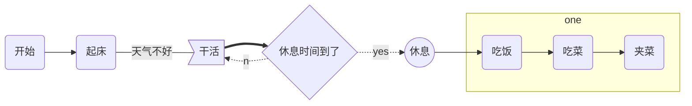


### 标准流程图

基本语法：

- 定义模块 
  `id=>关键字: 描述 （“描述”的前面必须有空格，“=>” 两端不能有空格）`

- 关键字：
  - start 流程开始，以圆角矩形绘制
  - opearation 操作，以直角矩形绘制
  - condition 判断，以菱形绘制
  - subroutine 子流程，以左右带空白框的矩形绘制
  - inputoutput 输入输出，以平行四边形绘制
  - end 流程结束，以圆角矩形绘制

- 定义模块间的流向：

  - `模块1 id->模块2 id` ：一般的箭头指向

  - `条件模块id (描述)->模块id(direction) `：条件模块跳转到对应的执行模块，并指定对应分支的布局方向

例:

```markdown
```flow
st=>start: 开始框
op=>operation: 处理框
cond=>condition: 判断框（是或否?）
sub1=>subroutine: 子流程
io=>inputoutput: 输入输出框
e=>end: 结束框

st->op->cond
cond(yes)->io->e
cond(no)->sub1(right)->op
```


```flow
st=>start: 开始框
op=>operation: 处理框
cond=>condition: 判断框（是或否?）
sub1=>subroutine: 子流程
io=>inputoutput: 输入输出框
e=>end: 结束框

st->op->cond
cond(yes)->io->e
cond(no)->sub1(right)->op
```


## 绘制时序图

### 标准时序图

基本语法:

- `Title:标题`：指定时序图的标题

- `Note direction of 对象:描述`：在对象的某一侧添加描述，`direction` 可以为 `right/left/over` ， `对象` 可以是多个对象，以 `,` 作为分隔符

- `participant 对象` ：创建一个对象

- ~~`loop...end` ：创建一个循环体~~

- `对象A->对象B:描述` ： 绘制A与B之间的对话，以实线连接

  线条：

  - `->` 实线实心箭头指向
  - `-->` 虚线实心箭头指向
  - `->>` 实线小箭头指向
  - `-->>` 虚线小箭头指向

例：

```markdown
```sequence
Title:时序图示例
客户端->服务端: 我想找你拿下数据 SYN
服务端-->客户端: 我收到你的请求啦 ACK+SYN
客户端->>服务端: 我收到你的确认啦，我们开始通信吧 ACK
Note right of 服务端: 我是一个服务端
Note left of 客户端: 我是一个客户端
Note over 服务端,客户端: TCP 三次握手
participant 观察者
```

```sequence
Title:时序图示例
客户端->服务端: 我想找你拿下数据 SYN
服务端-->客户端: 我收到你的请求啦 ACK+SYN
客户端->>服务端: 我收到你的确认啦，我们开始通信吧 ACK
Note right of 服务端: 我是一个服务端
Note left of 客户端: 我是一个客户端
Note over 服务端,客户端: TCP 三次握手
participant 观察者
```

### 带样式时序图

基本语法同标准时序图，不同的是

- 需要使用 `mermaid` 解析，并在开头使用关键字 `sequenceDiagram` 指明

- 线段的样式遵循 

  ```
  mermaid
  ```

   的解析方式

  - `->` ： 实线连接
  - `-->` ：虚线连接
  - `->>` ：实线箭头指向
  - `-->>` ：虚线箭头指向

例：

~~~markdown
```mermaid
sequenceDiagram
对象A->对象B:中午吃什么？
对象B->>对象A: 随便
loop 思考
    对象A->对象A: 努力搜索
end
alt 选择1
	对象A->>对象B: 选择1
else 选择2
	对象A->>对象C: 选择2
end
opt 可选
	对象A->>对象C: 可选项
end
par 并发
	对象A->>对象A: 并发1
and
	对象A->>对象B: 并发2
end
对象A-->>对象B: 火锅？
对象B->>对象A: 可以
Note left of 对象A: 我是一个对象A
Note right of 对象B: 我是一个对象B
participant 对象C
Note over 对象A,对象C: 汇总
~~~

```mermaid
sequenceDiagram
对象A->对象B:中午吃什么？
对象B->>对象A: 随便
loop 思考
    对象A->对象A: 努力搜索
end
alt 选择1
	对象A->>对象B: 选择1
else 选择2
	对象A->>对象C: 选择2
end
opt 可选
	对象A->>对象C: 可选项
end
par 并发
	对象A->>对象A: 并发1
and
	对象A->>对象B: 并发2
end
对象A-->>对象B: 火锅？
对象B->>对象A: 可以
Note left of 对象A: 我是一个对象A
Note right of 对象B: 我是一个对象B
participant 对象C
Note over 对象A,对象C: 汇总
```


## 绘制甘特图

基本语法：

- 使用 `mermaid` 解析语言，在开头使用关键字 `gantt` 指明

- `deteFormat 格式` 指明日期的显示格式

- `title 标题` 设置图标的标题

- `section 描述` 定义纵向上的一个环节

- 定义步骤：每个步骤有两种状态`done`（已完成）/`active`（执行中）

  - `描述: 状态,id,开始日期,结束日期/持续时间`
  - `描述: 状态[,id],after id2,持续时间`
  - `crit` ：可用于标记该步骤需要被修正，将高亮显示
  - 如果不指定具体的开始时间或在某个步骤之后，将默认依次顺序排列

例：

~~~markdown
```mermaid
gantt
        dateFormat  YYYY-MM-DD

        title 软件开发甘特图

        section 设计
        需求:done,des1, 2019-01-06,2019-01-08
        原型:active,des2, 2019-01-09, 3d
        UI设计:des3, after des2, 5d
        未来任务:des4, after des3, 5d

        section 开发
        学习准备理解需求:crit, done, 2019-01-06,24h
        设计框架:crit, done, after des2, 2d
        开发:crit, active, 3d
        未来任务:crit, 5d
        休息时间:2d

        section 测试
        功能测试:active, a1, after des3, 3d
        压力测试:after a1, 20h
        测试报告: 48h
~~~

```mermaid
gantt
        dateFormat  YYYY-MM-DD

        title 软件开发甘特图

        section 设计
        需求:done,des1, 2019-01-06,2019-01-08
        原型:active,des2, 2019-01-09, 3d
        UI设计:des3, after des2, 5d
        未来任务:des4, after des3, 5d

        section 开发
        学习准备理解需求:crit, done, 2019-01-06,24h
        设计框架:crit, done, after des2, 2d
        开发:crit, active, 3d
        未来任务:crit, 5d
        休息时间:2d

        section 测试
        功能测试:active, a1, after des3, 3d
        压力测试:after a1, 20h
        测试报告: 48h
```


## 绘制UML图

### 类图

- `<|--` 继承

- `*__` 组合

- `o--` 聚合

- `-->` 关联

- `--` 连接（实线）

- `..>` 依赖

- `..|>` 实现

- `..` 链接（虚线）

- `<<interface>>` 接口

- `<<abstract>>` 抽象类

- `<<service>>` 服务类

- `<<enumeration>>` 枚举

- `class` 普通类

- `+` public

- `-` private

- `#` protected

- `$` 静态

- 不带符号表示 default

- `～` 包/内部类

- 类图的画法
  1. 抽象类的类名以及抽象方法的名字都用斜体字表示
  2. 接口在类图中的第一层顶端用构造型 `<<interface>>`表示，下面是接口的名字，第二层是方法

```markdown
classDiagram
	父类 <|-- 具体类

	class 父类{
		+public_func() bool
	}
	
	class 具体类{
		~ package ~
		+bool public_value
		#int protected_value
		-string private_value
		+public_func() bool
		#protected_func(num) int
		-private_func(str) string
	}
```

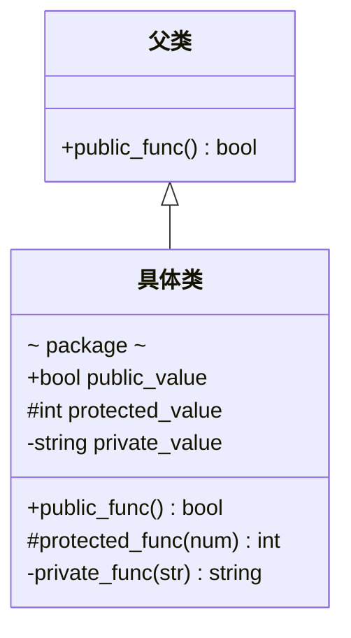

```markdown
classDiagram
	class 抽象类{
		<<abstract>>
		~ package ~
		+bool public_value
		#int protected_value
		-string private_value
		+public_func() bool
		#protected_func(num) int
		-private_func(str) string
	}
```

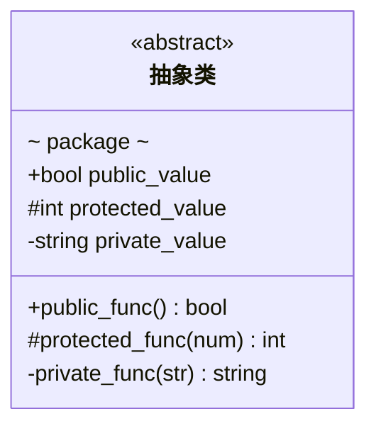

```markdown
classDiagram
	class 接口{
		<<interface>>
		~ package ~
		+public_func() bool
		#protected_func(num) int
		-private_func(str) string
	}
```

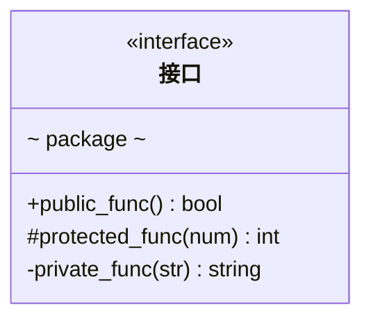

```markdown
classDiagram
	class 枚举{
		<<enumeration>>
		ELEM1
		ELEM2
		ELEM3
	}
```

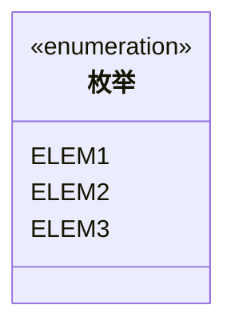

```markdown
classDiagram
	class 模版类~T~{
		+List~T~ public_value
	}
	模版类 : -List~T~ private_value
	模版类 : +public_func(List~T~ messages)
```

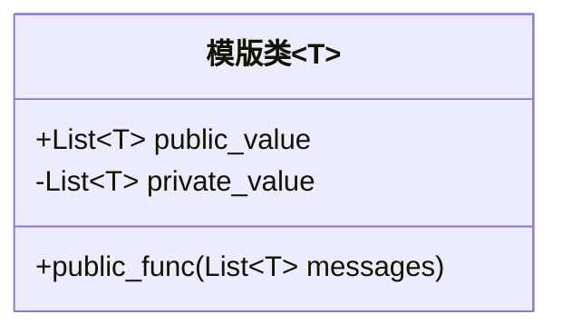

```markdown
classDiagram
classA --|> classB : Inheritance
classA1 o--|> classB1
classC --* classD : Composition
classE --o classF : Aggregation
classG --> classH : Association
classI -- classJ : Link(Solid)
classK ..> classL : Dependency
classM ..|> classN : Realization
classO .. classP : Link(Dashed)

```

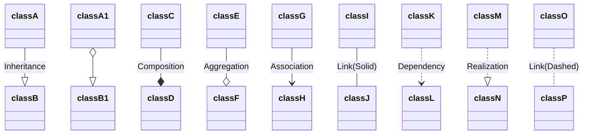

```markdown
classDiagram
    Customer "1" --> "*" Ticket
    Student "1" --> "1..*" Course
    Galaxy --> "many" Star : Contains
```

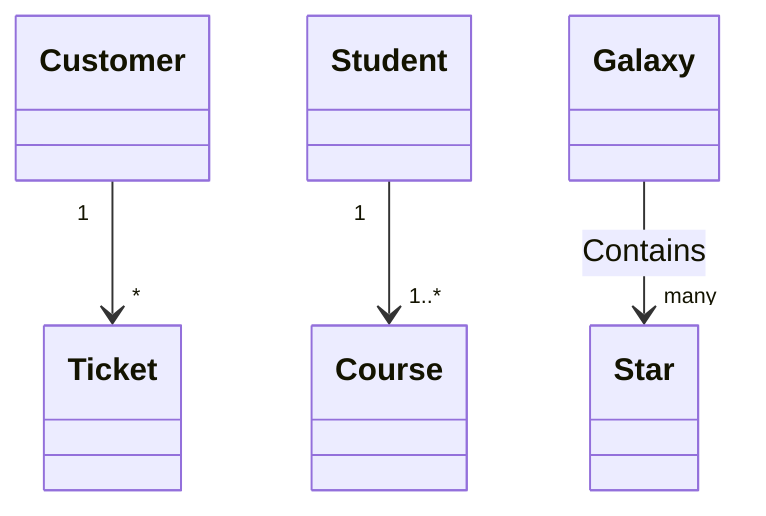

```markdown
classDiagram
class Shape
<<interface>> Shape
```

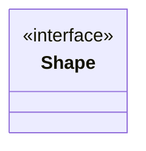


## 绘制饼图

```markdown
pie
    title Key elements in Product X
    "Calcium" : 42.96
    "Potassium" : 50.05
    "Magnesium" : 10.01
    "Iron" :  5
```

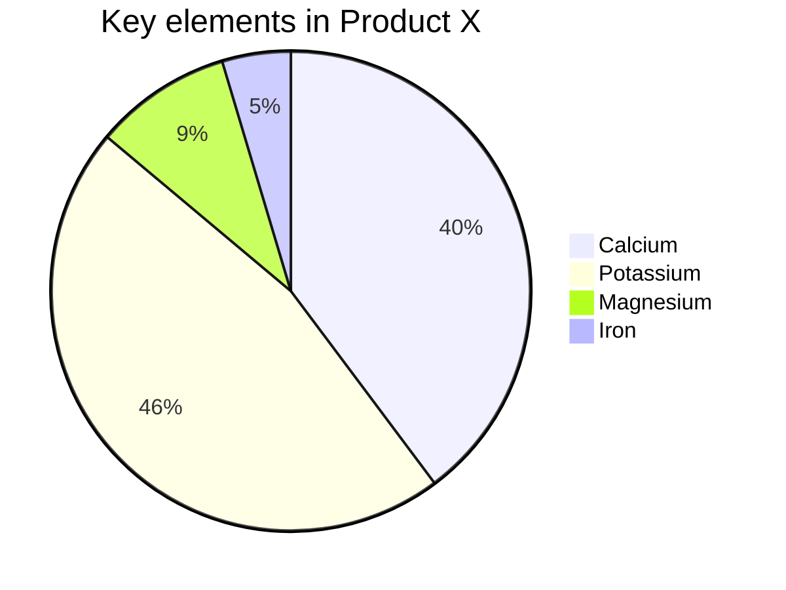


## 绘制折线图

(需要安装vidtor)

```echarts
{

 "title" : {  
 "text": "简单的折线图",  
 "subtext": "纯属虚构"  
 },  
 "tooltip" : {  
 "trigger": "axis"  
 },  
 "toolbox": {  
 "show" : true,  
 "feature" : {  
 "mark" : {"show": true},  
 "dataView" : {"show": true, "readOnly": false},  
 "magicType" : {"show": true, "type": ["line", "bar"]},  
 "restore" : {"show": true},  
 "saveAsImage" : {"show": true}  
 }  
 },  
 "calculable" : true,  
    "xAxis": {
        "type": "category",
            "data": ["Mon", "Tue", "Wed", "Thu", "Fri", "Sat", "Sun"]
    },
    "yAxis": {
        "type": "value"
    },
    "series": [{
        "data": [820, 932, 901, 934, 1290, 1330, 1320],
        "type": "line"
    }]
}
```


## 绘制状态图

```markdown
stateDiagram-v2
%% 注释

%% 状态
s1: 状态
s1 --> s2: 状态转换

%% 状态转换
[*] --> s3: 初始状态转换到其它

%% 合成状态
合成状态1 --> 合成状态2
合成状态1 --> 合成状态3
state 合成状态1 {
	[*] --> fir
	fir --> [*]
}
state 合成状态2 {
	[*] --> sec
	sec --> [*]
}
state 合成状态3 {
	[*] --> thi
	thi --> [*]
}

%% 分支与组合
state 分支状态 <<fork>>
分支状态 --> stat2: 分支
分支状态 --> stat3: 分支
state 组合状态 <<join>>
stat2 --> 组合状态: 组合
stat3 --> 组合状态: 组合

%% 标记状态
stat5: 状态标记
note left of stat5: 标记在左边

%% 并发
state 多线程 {
	[*] --> unlock1
	unlock1 --> lock1
	lock1 --> unlock1
	--
	[*] --> unlock2
	unlock2 --> lock2
	lock2 --> unlock2
	--
	[*] --> unlock3
	unlock3 --> lock3
	lock3 --> unlock3
}
```

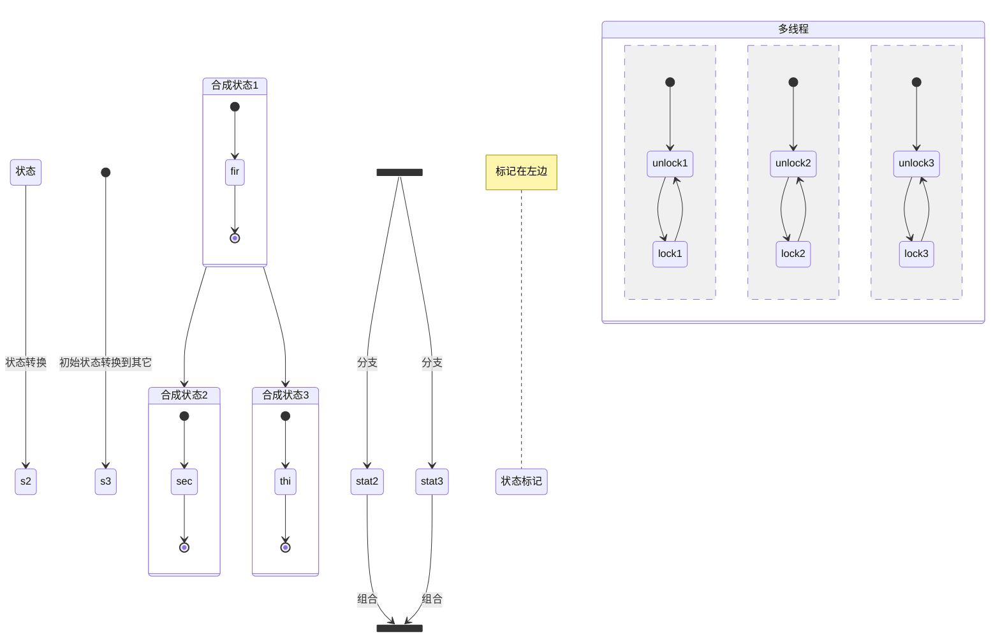

   

## 绘制树状图

(typora等其他不支持graphviz的工具，可以使用这个网站：https://g.gravizo.com/svg 作为图床)

```markdown

```


（如果工具如vnote等，支持graphviz，直接使用dot语法）

​	digraph demo {
​    	bgcolor="beige"
​    	node [shape="record", height=.1]
​    	node0[label="<f0> | <f1> G | <f2>"]
​    	node1[label="<f0> | <f1> E | <f2>"]
​    	node2[label="<f0> | <f1> B | <f2>"]
​    	node0:f0 -> node1:f1
​    	node0:f2 -> node2:f1
​    	a [label="{a | b | c}"]
​    }


## 参考

- [markdown 绘制流程图、时序图、甘特图](https://www.jianshu.com/p/6dbcc3aff98b)
- [使用 Typora 画图（类图、流程图、时序图）](https://zhuanlan.zhihu.com/p/172635547)
- [Class diagrams](https://mermaid-js.github.io/mermaid/#/classDiagram?id=class-diagrams)
- [markdown 由简入繁，上手跟我做（十）echarts 图表 - 折线（面积）图](https://qiankunpingtai.cn/article/1566371244169)
- [Markdown 中 LaTex 数学公式命令](https://www.jianshu.com/p/0ea47ae02262)
- [Cmd Markdown 公式指导手册](https://www.zybuluo.com/codeep/note/163962)
- [Markdown 文件中绘制甘特图](https://www.marapython.com/posts/gantt-chart/#%E9%87%8D%E8%A6%81%E4%BA%8B%E4%BB%B6%E8%8A%82%E7%82%B9Milestone)

