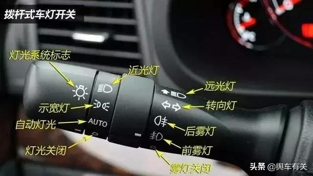
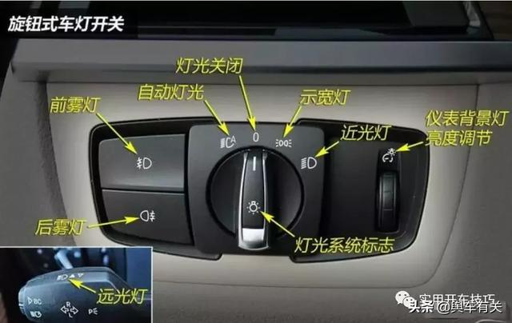
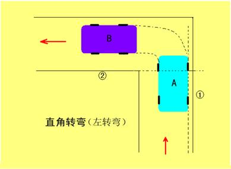
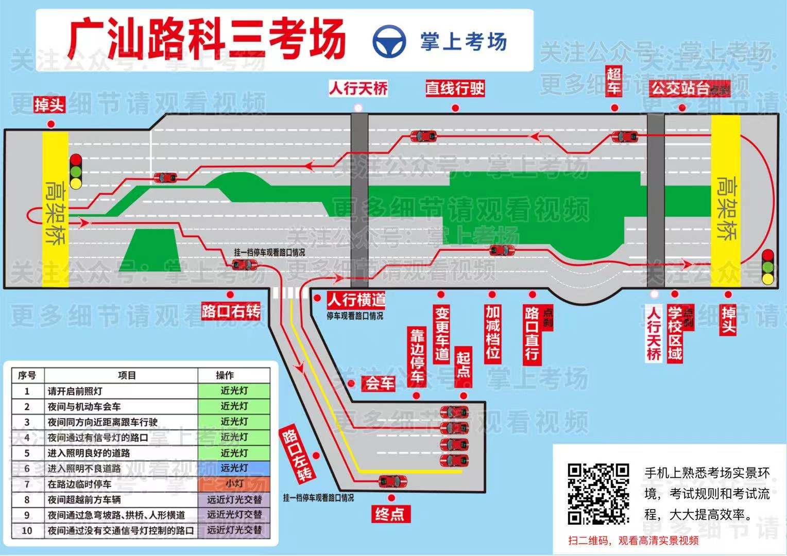

[TOC]

# 学车笔记

(以下笔记仅适用于广州市天河区岑村考场，其它地区未经测试)

## 灯光

### 拨杆式灯光开关

- `远光灯，近光灯交替` 向驾驶座方向拨动拔杆
- `远光灯` 反方向推拨杆

### 旋钮式车灯开关

## 科目二

### s型点位

1. 保持路边线到引擎盖中间
2. 引擎盖角碰到边线时打1圈+1/4圈调整

### 直角点位

1. 保持边线1在车子引擎盖靠右1/3处
2. 当左侧后视镜遮住边线2时，方向盘打死

### 上坡定点点位

1. 保持车身距离右侧边线30cm以内
2. 当路标杆对准引擎盖直角时踩刹车
3. 拉手刹，踩脚刹，放手刹
4. 慢慢松离合（踩住脚刹）到车身中等震动时，快速松开脚刹

### 侧方位停车点位

1. 车辆靠近右侧行驶至断头线与方向盘平齐时刹车
2. 挂倒档
3. 待后视镜遮住断头线长度超过10cm时，向右打一圈方向盘
4. 待车身对准侧方位内侧的直角时，摆正车身
5. 待车后轮压到虚线时，方向盘向左打死，直到车身与虚线平行
6. 打左灯，挂1档离开

### 倒车入库点位

1. 保持车身与边界横线距离1.3m~1.5m，向前行驶至方向盘与起始线平齐
2. 挂倒档至右后视镜完全遮住启始线时，向右打死方向盘
3. 当车身对准左前角时，回1/2圈方向盘
4. 当车身对准左侧库边线与库底线的相交点时，回正车身并做微调
5. 待左后视镜完全遮住左前角横线时踩刹车
6. 挂1档至肩膀与左前角横线平齐时向左打1圈+1/4圈，保持方向直至方向盘与水平线平齐，然后踩刹车
7. 挂倒档至车后轮压到左侧库边线的延长线（虚拟，并不存在）时，向左打死方向盘
8. 观测到右侧车身对准库底线与右侧库边线的相交点时，回正车声并微调（哪边窄就举哪边的手）
9. 待左后视镜完全遮住左前角横线时踩刹车
10. 挂1档至引擎盖碰到边界横线时向右打死方向盘，摆正车身
11. 待方向盘与起始线平齐时，踩刹车，挂空挡，松离合

## 科目三（以下步骤按先后顺序）

小技巧：

1. 踩刹车时最好同时踩下离合，防止熄火
2. 可以提前开启左转向灯
3. 遇到红灯时，停车换1档；绿灯时直接通过
4. 转向灯回位可以立即补打转向灯
5. 不要同时变多条道，每次变一条道，摆正车身后再次变道

需要踩刹车的位置：

1. `通过人行横道线` 听到语音后点踩刹车
2. `直行通过路口` 在“让”字路牌处点踩刹车
3. `通过学校区域` 通过路牌“通过学校区域”点踩刹车
4. `通过公共汽车站` 通过路牌“通过公共”附近的人行天桥下点踩刹车
5. `路口右转` 在黄线前踩刹车
6. `路口左转` 听到“前方路口左转”语音时，在栏杆前（门口电线杆）点踩刹车

### 上车准备

1. 检查灯光系统等是否正常
2. **逆时针**绕车检查，按车身上四周的按钮
3. 上车调整后视镜，座椅
4. 检查档位，手刹，灯光有没有复位

### 夜间行驶

| 语音指令                             | 开启灯光               |
| ------------------------------------ | ---------------------- |
| `请打开前照灯`                       | 近光灯                 |
| `夜间与机动车会车`                   | 近光灯                 |
| `夜间同方向近距离跟车行驶`           | 近光灯                 |
| `夜间通过有信号灯路口`               | 近光灯                 |
| `进入照明良好道路`                   | 近光灯                 |
| `进入照明不良道路`                   | 远光灯                 |
| `夜间在路边临时停车`                 | 开启示宽灯             |
| `夜间超越前方车辆`                   | 远近交替光灯           |
| `夜间通过无信号灯路`                 | 远近交替光灯           |
| `夜间通过急弯，坡路，拱桥，人行横道` | 远近交替光灯           |
| `模拟夜间考试完成，请关闭所有灯光`   | 关闭灯光，在五秒内关完 |

### 起步

1. 打左灯
2. 按喇叭2下
3. 踩离合踩刹车挂1档
4. 观察左中后视镜情况
5. 松手刹，松离合，起步

### 靠边停车

1. 打右转向灯，等3秒
2. 观察右侧后视镜，保持车身与路边线小于30cm（引擎盖1/3处与路边线重合）
3. 停车拉手刹，挂空档
4. 再次起步，打左灯按喇叭
5. 下踩离合踩刹车挂1档
6. 观察左中后视镜情况
7. 松手刹，松离合，起步

### 会车

1. 用1档行驶，听到会车指令直接驶过，车速30以内不用踩刹车

### 通过人行横道线

1. 听到语音点踩刹车减速
2. 打开右转向灯
3. 挂1档（此时可以根据路况决定是否停车，注意不要熄火）
4. 观察路况，无车阻拦时，上坡右转
5. 上坡后观察最右侧车道是否有阻挡，有阻挡驶入右侧第二条车道，无阻挡驶入右侧第一条车道，摆正车身
6. （如果在右侧第一条车道）打左转向灯，等3秒后向左变更一条车道
7. 加到2档

### 变更车道

1. 打左转向灯
2. 观察左侧交通状况，3秒后向左变更车道，有车阻挡可以减速，安全时再进行变道
3. 保持2档

### 加减档

1. 如果速度过快，可以预先踩点刹车，把速度降下来
2. 听到“减到一档”时，踩离合挂1档，松离合，踩油门提速
3. 听到“加到二档”时，踩离合挂2档，送离合，踩油门将速度提到20左右

### 直行通过路口

1. 听到“直行路口”时，在“让”字路牌处点踩刹车减速（如遇到行人，提前停车让行）

### 通过学校区域

**注意：此项目无语音提示**

1. 通过路牌“通过学校区域”附近的人行天桥下时，点踩刹车减速

### 掉头

**注意：此项目无语音提示**

1. 前方高架桥下掉头
2. 打左转向灯
3. 减速挂1档
4. 保持左转（注意观察右侧车辆，拥堵时先踩离合再踩刹车，防止熄火）
5. 出桥底后，加油门提速，挂到2档

### 通过公共汽车站

**注意：此项目无语音提示**

1. 前方通过路牌“通过公共”时，在路牌旁边的人行天桥下点踩刹车
2. 听到“前方请从右侧4车道进入超车项目”时**不用理会**
3. （如果你在最左边的车道，向右变一条道）

### 超车

1. 听到超车语音后，向左打转向灯，等3秒
2. 观察左侧后视镜，确认安全后向左超车（有车阻挡时可以停车等待），摆正车身
3. 听到“请返回原车道”后，向右打转向灯，等3秒
4. 观察右侧后视镜，确认安全后向右返回原车道（有车阻挡时可以停车等待），摆正车身

### 直线行驶

1. 目视前方，不要压线，直走
2. 听到“直线行驶完成”语音后，打左转向灯，等待3秒
3. 观察左后视镜，确认安全后向左变更一条车道，摆正车身
4. 行驶一段距离，再向左变一条车道，进入左二车道行驶
5. 遇到红灯时，停车换1档；绿灯时直接通过

### 掉头

1. 听到“掉头”语音，打左转向灯，向左变更车道，摆正车身（2个车道都可以掉头）
2. 减到1档
3. 走右侧第二车道，提前开启右转向灯

### 路口右转

1. 在**黄线前**踩刹车
2. 打右转向灯
3. 减速，右转（右侧2条车道都可以右转）

### 路口左转

1. 听到“前方路口左转”语音时，在栏杆前（门口电线杆）点踩刹车减速
2. 打左转向灯
3. 左转进入考场终点
4. 拉手刹，下车

## 参考

- [汽车车灯作用及操作方法图解，一分钟掌握灯光的正确使用方法](https://www.sohu.com/a/320767966_120047391)

