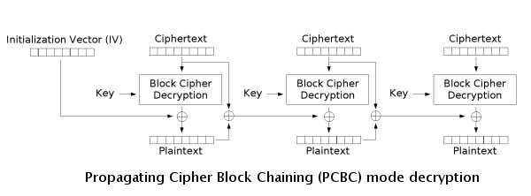

# DES加密算法

[TOC]

数据加密标准(Data Encryption Standard, DES)是一个分组加密算法，以64位为分组对数据加密，DES密钥的有效长度为任意的56位数，但通常表示为64位的数（每个第8位用作奇偶校验，可以忽略）。


## 算法描述


- $IP$ [初始置换](#初始置换)；

- $IP^{-1}$ 末置换（又叫做$FP$），与$IP$互为反函数；

- $\oplus$ 异或(XOR)操作；

- $f$ 费斯妥函数，运行16次；

  

  - [密钥置换](#密钥置换)

    从56位密钥产生不同的48位子密钥(subkey)；

    - $移位$ 根据轮数左移1位或2位；
    - $压缩置换$ 也叫做置换选择，从移动后的56位选出48位。
  
  - [扩展置换](#扩展置换)
  
    又叫做`E盒(E-box)`，将数据的右半部分$R_i$从32位扩展到了48位。
  
  - [S盒代替](#S盒代替)
  
    将压缩后的密钥与扩展置换后的分组进行XOR后，得到的**48位**结果；然后由8个`S盒(S-box)`进行代替操作，得到**32位**输出。

  - [P盒置换](#P盒置换)

    也叫做`直接置换(straight permutation)`，将S盒运算后的32位输出按照`P盒(P-box)`进行置换。该置换把每输入位映射到输出位，任1位不能映射两次，也不能被略去。

  16轮迭代过程的数学描述：

  $L_i = R_{i-1}$

  $R_i = L_{i-1} \oplus f(R_{i-1}, K_i)$

  - $L_i$ 第$i$次迭代结果的左半部分；

  - $R_i$ 第$i$次迭代结果的右半部分；

  - $K_i$ 第$i$轮的48位密钥；

  - $\oplus$ 异或(XOR)操作；


### 初始置换

将原始明文经过IP置换表处理；如图所示：


*置换过程*

IP置换表中的数据指的是位置，例如58：将M的58位放置第1位。

例：

1. 64位的明文M经过IP置换后变为64位的密文M':

   ```sh
   0110001101101111011011010111000001110101011101000110010101110010
   ```

   $F_{IP置换}()$

   ```sh
   58,50,42,34,26,18,10,02,
   60,52,44,36,28,20,12,04,
   62,54,46,38,30,22,14,06,
   64,56,48,40,32,24,16,08,
   57,49,41,33,25,17,09,01,
   59,51,43,35,27,19,11,03,
   61,53,45,37,29,21,13,05,
   63,55,47,39,31,23,15,07,
   ```

   = 

   ```sh
   1111111110111000011101100101011100000000111111110000011010000011
   ```

2. 取M'的前32位作为$L_0$：

   ```sh
   11111111101110000111011001010111
   ```

3. 取M'的后32位作为$R_0$：

   ```sh
   00000000111111110000011010000011
   ```

### 密钥置换


例：

- 第1轮置换

   1. 64位密钥K经PC-1表置换后变为56位数据K'：

      ```sh
      0001001100110100010101110111100110011011101111001101111111110001
      ```

      $F_{置换}()$

      ```sh
      57,49,41,33,25,17,09
      01,58,50,42,34,26,18
      10,02,59,51,43,35,27
      19,11,03,60,52,44,36
      63,55,47,39,31,23,15
      07,62,54,46,38,30,22
      14,06,61,53,45,37,29
      21,13,05,28,20,12,04
      ```

      = 

      ```sh
      11110000110011001010101011110101010101100110011110001111
      ```

   2. 取K'的前28位作为C0：

      ```sh
      1111000011001100101010101111
      ```

   3. 取K'的后28位作为D0：

      ```sh
      0101010101100110011110001111
      ```

   4. 查找"循环左移查表"，对C0左移1位得到C1：

      ```sh
      1111000011001100101010101111
      ```

      <<1

      =

      ```sh
      1110000110011001010101011111
      ```

   5. 查找循环左移查表，对D0左移1位得到D1：

      ```sh
      0101010101100110011110001111
      ```

      <<1

      =

      ```sh
      1010101011001100111100011110
      ```

   6. 合并C1和D1得到子密钥K1：

      ```sh
      1110000110011001010101011111
      ```

      $F_{合并}$

      ```sh
      1010101011001100111100011110
      ```

      =

      ```sh
      01010101011001100111100011111010101011001100111100011110
      ```

   7. 将K1与PC-2表置换，并去除第9，18，22，25，35，38，43，54得到48位的密钥K1：

      ```sh
      01010101011001100111100011111010101011001100111100011110
      ```

      $F_{置换}$

      ```sh
      14,17,11,24,01,05,
      03,28,15,06,21,10,
      23,19,12,04,26,08,
      16,07,27,20,13,02,
      41,52,31,37,47,55,
      30,40,51,45,33,48,
      44,49,39,56,34,53,
      46,42,50,36,29,32
      ```

      =

      ```sh
      000110110000001011101111111111000111000001110010
      ```

- 第2轮置换

   同上。

   ...

- 第16轮置换

  同上。

### 扩展置换

右半部分$R_i$的位数为32位，而密钥$K_i$长度为48位，为了能够保证$R_i$与$K_i$可以进行异或运算需要对Ri位数进行扩展。

例：

1. 32位的$R_0$经过扩展置换后变为48位数据$E(R_0)$：

   ```sh
   00000000111111110000011010000011
   ```

   $F_{扩展置换}$

   ```sh
   32,01,02,03,04,05,
   04,05,06,07,08,09,
   08,09,10,11,12,13,
   12,13,14,15,16,17,
   16,17,18,19,20,21,
   20,21,22,23,24,25,
   24,25,26,27,28,29,
   28,29,30,31,32,01
   ```

   =

   ```sh
   100000000001011111111110100000001101010000000110
   ```

2. 将$E(R_0)$与密钥$K_i$做异或运算

   ```sh
   100000000001011111111110100000001101010000000110
   ```

   XOR

   ```sh
   000110110000001011101111111111000111000001110010
   ```

   =

   ```sh
   100110110001010100010001011111001010010001110100
   ```

### S盒代替

代替运算由8个不同的代替盒（S盒）完成。每个S盒有6位输入，4位输出。代替运算流程如下：


S盒运算规则：

- 将输入的第1位与最后1位组合成二进制数，并转化为十进制，此即为行数(从0开始)；

  例：`110111` -> `11` -> 3行。

- 将除第1位于最后1位以外的二进制数转化为十进制，此即列数(从0开始)；

  例：`110111` -> `1011` -> 11列。

- 查找S-Box得到指定行列元素的指，并转化为二进制输出。

  例：`S-Box1[3][11]` -> 14 -> `1110`。

例：

1. 将48位的密钥$K_1$与8个S-Box做代替运算，得到32位的输出：

   ```sh
   100110110001010100010001011111001010010001110100
   ```

   $F_{替代运算}(S-Box1)$

   ```sh
   14,04,13,01,02,15,11,08,03,10,06,12,05,09,00,07,
   00,15,07,04,14,02,13,01,10,06,12,11,09,05,03,08,
   04,01,14,08,13,06,02,11,15,12,09,07,03,10,05,00,
   15,12,08,02,04,09,01,07,05,11,03,14,10,00,06,13
   ```

   $F_{替代运算}(S-Box2)$

   ```sh
   15,01,08,14,06,11,03,04,09,07,02,13,12,00,05,10,
   03,13,04,07,15,02,08,14,12,00,01,10,06,09,11,05,
   00,14,07,11,10,04,13,01,05,08,12,06,09,03,02,15,
   13,08,10,01,03,15,04,02,11,06,07,12,00,05,14,09,
   ```

   $F_{替代运算}S-Box3)$

   ```sh
   10,00,09,14,06,03,15,05,01,13,12,07,11,04,02,08,
   13,07,00,09,03,04,06,10,02,08,05,14,12,11,15,01,
   13,06,04,09,08,15,03,00,11,01,02,12,05,10,14,07,
   01,10,13,00,06,09,08,07,04,15,14,03,11,05,02,12,
   ```

   $F_{替代运算}(S-Box4)$

   ```sh
   07,13,14,03,00,06,09,10,01,02,08,05,11,12,04,15,
   13,08,11,05,06,15,00,03,04,07,02,12,01,10,14,09,
   10,06,09,00,12,11,07,13,15,01,03,14,05,02,08,04,
   03,15,00,06,10,01,13,08,09,04,05,11,12,07,02,14,
   ```

   $F_{替代运算}(S-Box5)$

   ```sh
   02,12,04,01,07,10,11,06,08,05,03,15,13,00,14,09,
   14,11,02,12,04,07,13,01,05,00,15,10,03,09,08,06,
   04,02,01,11,10,13,07,08,15,09,12,05,06,03,00,14,
   11,08,12,07,01,14,02,13,06,15,00,09,10,04,05,03,
   ```

   $F_{替代运算}(S-Box6)$

   ```sh
   12,01,10,15,09,02,06,08,00,13,03,04,14,07,05,11,
   10,15,04,02,07,12,09,05,06,01,13,14,00,11,03,08,
   09,14,15,05,02,08,12,03,07,00,04,10,01,13,11,06,
   04,03,02,12,09,05,15,10,11,14,01,07,06,00,08,13,
   ```

   $F_{替代运算}(S-Box7)$

   ```sh
   04,11,02,14,15,00,08,13,03,12,09,07,05,10,06,01,
   13,00,11,07,04,09,01,10,14,03,05,12,02,15,08,06,
   01,04,11,13,12,03,07,14,10,15,06,08,00,05,09,02,
   06,11,13,08,01,04,10,07,09,05,00,15,14,02,03,12,
   ```

   $F_{替代运算}(S-Box8)$

   ```sh
   13,02,08,04,06,15,11,01,10,09,03,14,05,00,12,07,
   01,15,13,08,10,03,07,04,12,05,06,11,00,14,09,02,
   07,11,04,01,09,12,14,02,00,06,10,13,15,03,05,08,
   02,01,14,07,04,10,08,13,15,12,09,00,03,05,06,11,
   ```

   = 

   ```sh
   10001011110001000110001011101010
   ```

### P盒置换

将S盒替代输出的结果作为P盒的输入，进行置换运算。

例：

```sh
10001011110001000110001011101010
```

$F_{置换运算}()$

```sh
16,07,20,21,29,12,28,17,01,15,23,26,05,18,31,10,
02,08,24,14,32,27,03,09,19,13,30,06,22,11,04,25,
```

=

```sh
01001000101111110101010110000001
```

### 末置换


## 工作模式

### ECB

`电子密码本(Electronic Code Book, ECB)`将需要加密的消息按照块密码的块大小被分为数个块，并对每个块进行独立加密。


### CBC

`密码分组链接(Cipher Block Chaining, CBC)`每个明文块先与前一个密文块进行异或后，再进行加密。每个密文块都依赖于它前面的所有明文块。


数学描述：

$C_i = E_K(P_i \oplus C_{i-1}),$

$C_0 = Ⅳ$


数学描述：

$P_i = D_K(C_i) \oplus C_{i-1},$

$C_0 = Ⅳ$

### PCBC

`填充密码块链接(Propagating Cipher Block Chaining)或明文密码块链接(Plaintext Cipher Block Chaining)` 是一种可以使密文中的微小更改在解密时导致明文大部分错误的模式，并在加密的时候也具有同样的特性。




加解密算法的数学描述：

$C_i = E_K(P_i \oplus P_{i-1} \oplus C_{i-1}), P_0 \oplus C_0 = Ⅳ$

$P_i = D_K(C_i) \oplus P_{i-1} \oplus C_{i-1}, P_0 \oplus C_0 = Ⅳ$

### CFB

`密文反馈(Cipher Feedback, CFB)` 模式类似于CBC，可以将块密码变为自同步的流密码；工作过程亦非常相似，CFB的解密过程几乎就是颠倒的CBC的加密过程。


$C_i = head(E_K(S_{i-1}), x) \oplus P_i$

$P_i = head(E_K(S_{i-1}), x) \oplus C_i$

$S_i = ((S_{i-1} <<  x) + C_i) mod\ 2^n$

$S_0 = Ⅳ$

### OFB

`输出反馈模式(Output Feedback, OFB)` 将块密码变成同步的流密码，它产生密钥流的块，然后将其与明文块进行异或得到密文。


数学描述：

$C_i = P_i \oplus O_i$

$P_i = C_i \oplus O_i$

$O_i = E_K(O_{i-1})$

$O_0 = Ⅳ$

### CTR

`计数器模式(Counter Mode, CTR)\整数计数模式(Integer Counter Mode, ICM)\整数段模式(Segmented Integer Counter, SIC)` 与OFB相似，将块密码变为流密码；通过递增一个加密计数器以产生连续的密钥流。


### 优缺点

| 模式 | 优点                                                         | 缺点                                                         |
| ---- | ------------------------------------------------------------ | ------------------------------------------------------------ |
| ECB  | - 逻辑简单，容易实现。                                       | - 同样的明文块会被加密成相同的密文块（即对称），保密性不佳。<br>- 极易受到"重放攻击"。 |
| CBC  | - 可以避免重放攻击（前面明文的微小变化会导致后面全部密文发生改变）；<br>- 解密过程允许并行（从两个邻接的密文块中即可获得一个明文块）。 | - 加密过程是串行的（后一个加密依赖于前面的明文块），无法并行化； |
| PCBC |                                                              |                                                              |
| CFB  | - 支持流密码；<br>- 解密过程允许并行；<br>- 无需进行填充。   | - 加密过程无法并行；<br>- 错误增长。                         |
| OFB  | - 支持流密码。                                               | - 无法做并行处理（因为每个使用OFB的输出块与其前面所有的输出块相关）； |
| CTR  | - 支持流密码；<br>- 加解密过程允许并行；<br>- 解密时允许随机存取。 | - 初始化向量不能重用。                                       |


## DES变种

### 多重DES


### 使用独立子密钥的DES

每一轮都适用不同的子密钥，而不是由单个的56位密钥来产生。

独立子密码对线性密码分析不敏感，但对差分分析很敏感，而且可以用$2^{61}$个选择明文破译。这表明对密码编排的改动并不能使DES变得更安全。

### DESX

DESX采用一种称为随机化的技术来掩盖DES的输入和输出；除了DES原有的56位密钥外，还附加一个64位的随机密钥。这64位随机密钥在DES的第一轮之前与明文异或。附加的64位密钥通过一个单向函数合称为120位的DES密钥，并与最后一轮输出的密文异或。

### CRYPT(3)

CRYPT(3)是应用在UNIX系统上的DES变型，主要用作对口令的单向函数。

### GDES

GDES（通用DES）是为了提高DES的速度及算法的强度而设计的；总的分组长度增加了，但总的计算量保持不变。


### 更换S盒的DES

DES的S盒抗线性分析不是最优的；可能存在比DES的S盒抗线性分析性能更好的S盒。

### RDES

RDES是在每一轮结束时用相关密钥交换取代左，右两部分交换地一种变型。这种交换是固定的，只依赖于密钥。

RDES-1，在每一轮的开始，对16位地字进行相关数据交换；

RDES-2，在每一轮开始，经过类似RDES-1中16位地字相关数据交换后，在进行字节交换；

...

RDES-4。

### 使用相关密钥S盒的DES

无论线性分析或差分分析都仅在已知S盒结构的情况下有效。如果S盒与密钥相关，且是通过强密码方法选择构成的，那么线性分析或差分分析将更困难。随机产生的S盒的差分及线性特征都很弱，即使S盒是保密的。


## Openssl相关源码分析

TODO


## 安全性

### 暴力破解

依次尝试所有可能的密钥。

### 差分密码分析

`差分密码分析(differential cryptanalysis)` 用于进行选择明文攻击；通过考查哪些明文有特定差分（"差分"在DES中定义为异或运算，不同的算法定义不同）的密文对，当明文使用相同的密钥加密时，分析其在通过DES的轮扩散时差分的演变。

### 相关密钥密码分析

`相关密钥密码分析(related-key cryptanalysis)`类似于差分分析：密码分析者选择的是密钥对间的关系，而不是密钥本身。数据由两个密钥加密。在已知明文的相关密钥攻击中，密码分析者知道明文和用这种密钥加密的密文；在选择明文的相关密钥攻击中，密码分析者选择明文，并用这两个密钥加密。

### 线性密码分析

`线性密码分析(linear cryptanalysis)` 使用线性近似值来描述分组密码的操作；将明文的一些位，密文的一些位分别进行异或运算，然后再将这两个结果异或，得到一个结果，该结果为概率为$p$的线性近似值。如果$p \neq 1/2$，那么就可以使用该偏差，用得到的明文盒对应的密文来猜测密钥的位值。得到的数据越多，猜测越可靠。偏差越大，用同样数据量的成功率越高。

**线性分析极大地依赖于S盒的结构，而DES的S盒对线性分析来说不是最合适的。**


## 参考

[1] Bruce Schneier . 应用密码学-协议,算法与c源程序 . 2ED

[2] [维基百科-资料加密标准](https://zh.wikipedia.org/wiki/%E8%B3%87%E6%96%99%E5%8A%A0%E5%AF%86%E6%A8%99%E6%BA%96)

[3] [算法科普：神秘的 DES 加密算法](https://www.cxyxiaowu.com/1478.html)

[4] [维基百科-分组密码工作模式](https://zh.wikipedia.org/wiki/%E5%88%86%E7%BB%84%E5%AF%86%E7%A0%81%E5%B7%A5%E4%BD%9C%E6%A8%A1%E5%BC%8F)

[5] [维基百科-流密码](https://zh.wikipedia.org/wiki/%E6%B5%81%E5%AF%86%E7%A0%81)

