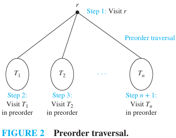
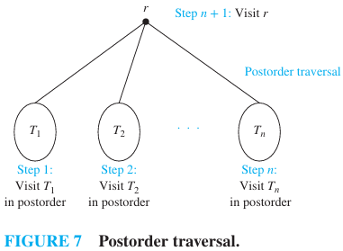
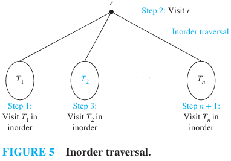

# Trees

[TOC]

## Introduction

This note summarizes the basic definitions and properties of trees as used in discrete mathematics and algorithms. It covers free (unrooted) trees, rooted trees, m-ary and binary trees, tree traversals, spanning trees and minimum spanning trees, and a few standard combinatorial facts and theorems.

## Definitions

- Tree (undirected): A tree is a connected undirected graph that contains no cycles (simple circuits). Equivalently, any two vertices are connected by exactly one simple path.

- Rooted tree: A tree in which one vertex is designated as the root; edges are usually regarded as directed away from (or toward) the root to indicate parentchild relations.

- Parent, child, leaf, internal vertex: In a rooted tree, the parent of a vertex v is the neighbor on the unique path from v to the root; children are the vertices for which v is the parent. A leaf is a vertex with no children; an internal vertex has at least one child.

- m-ary tree: A rooted tree in which each internal vertex has at most m children. A full (or proper) m-ary tree is one in which every internal vertex has exactly m children. The special case m=2 is the binary tree.

## Tree traversals (ordered rooted trees)

When a rooted tree is ordered (an order is specified on the children of each vertex), standard depth-first traversals are defined as follows:

- Preorder: Visit the root, then traverse each child subtree from left to right in preorder.

- Postorder: Traverse each child subtree from left to right in postorder, then visit the root.

- Inorder: The usual inorder traversal is defined for binary trees: traverse the left subtree in inorder, visit the root, then traverse the right subtree in inorder. For general ordered trees there are multiple "inorder" generalizations; the binary-case definition is the standard one.

## Spanning trees and minimum spanning trees

- Spanning tree: For a simple connected graph G, a spanning tree is a subgraph that is a tree and contains every vertex of G.

- Minimum spanning tree (MST): In a connected weighted graph, an MST is a spanning tree with minimum total edge weight. Standard algorithms: Kruskal's and Prim's algorithms.

## Basic enumerative and structural facts

- Edges and vertices: A tree with n vertices has exactly n-1 edges. Conversely, a connected graph with n vertices and n-1 edges is a tree.

- Unique path characterization: A graph is a tree iff between every pair of vertices there is exactly one simple path.

- Full m-ary trees: In a full m-ary tree with i internal vertices, the total number of vertices is n = mi + 1, and the number of leaves is l = (m-1)i + 1. Rearranging gives i = (n-1)/m and l = [(m-1)n + 1]/m when needed.

- Leaf bound: An m-ary tree of height h has at most m^h leaves (height measured as the maximum number of edges on a root-to-leaf path).

## Applications and algorithmic lower bounds

- Comparison sorting lower bound: Any comparison-based sorting algorithm can be modeled by a binary decision tree with n! leaves (one leaf per possible permutation). Hence the worst-case number of comparisons is at least \lceil \log_2 n! \rceil = \Omega(n \log n). This also yields the average-case \Omega(n \log n) bound under reasonable assumptions.

- Game trees and minimax: In perfect-information two-player zero-sum games represented by a finite game tree, the minimax value of the root (computed recursively using min and max alternation) gives the payoff to the first player assuming optimal play.

## Theorems (concise)

- A graph is a tree iff it is connected and has n-1 edges (n = |V|).
- A simple connected graph has a spanning tree.
- SchroederBernstein and other counting results for trees appear in combinatorics; use standard references for enumerative formulas.

## Examples

- Full binary tree with height 2: has 1 + 2 + 4 = 7 vertices and 4 leaves.
- Spanning tree example: take any connected graph and remove edges until the remainder is acyclic while keeping connectivity.

## Remarks and references

- For algorithmic details see chapters on trees and graph algorithms in Rosen's "Discrete Mathematics and Its Applications" and standard algorithm texts (CLRS) for MST and graph traversals.

## References

1. Kenneth H. Rosen, Discrete Mathematics and Its Applications, 8th ed.
2. Thomas H. Cormen, Charles E. Leiserson, Ronald L. Rivest, and Clifford Stein, Introduction to Algorithms (CLRS).
