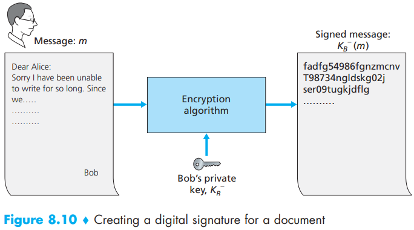
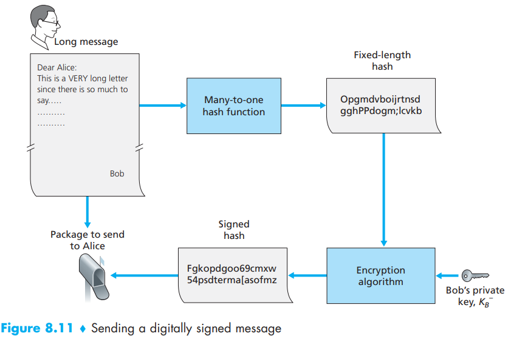
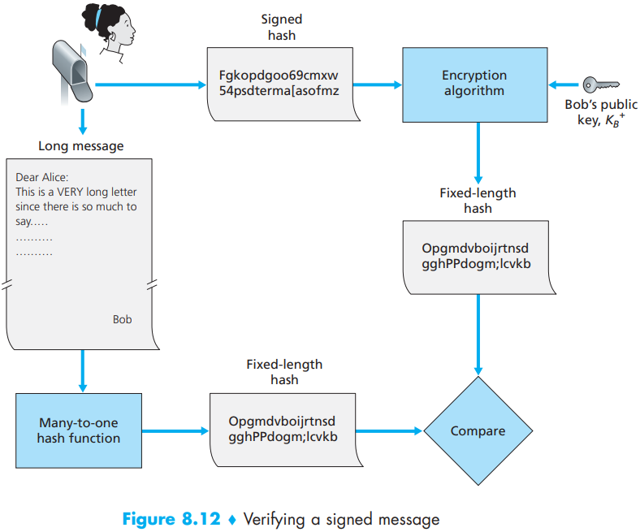
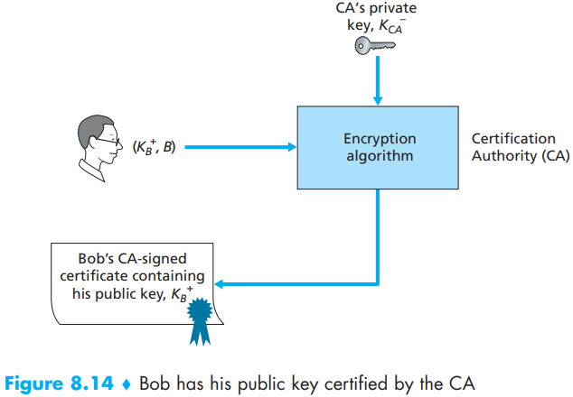

[中文版](rsa_zh.md) | English

# RSA

[TOC]

`RAS algorithm` has become almost synonymous with public key cryptography. There are two interrelated components of RSA:

- The choice of the public key and the private key.
- The encryption and decryption algorithm.

Under RSA encryption, a message (uniquely represented by an integer), $m$, is exponentiated to the power $e$ using modulo-$n$ arithmetic, that is,
$$
c = m^e\ mod\ n
$$
Decryption is performed by raising this value to the power $d$, again using modulo-$n$ arithmetic. The result of an encryption step followed by a decryption step is thus $(m^e\ mod\ n)^d\ mod\ n$. Let’s now see what we can say about this quantity. As mentioned earlier, one important property of modulo arithmetic is $(a\ mod\ n)^d\ mod\ n = a^d\ mod\ n$ for any values $a$, $n$, and $d$. Thus, using $a = m^e$ in this property, we have
$$
(m^e\ mod\ n)^d\ mod\ n = m^{ed}\ mod\ n
$$
It therefore remains to show that $m^{ed}\ mod\ n = m$. Although we’re trying to remove some of the magic about why RSA works, to establish this, we’ll need to use a rather magical result from number theory here. Specifically, we’ll need the result that says if $p$ and $q$ are prime, $n = pq$, and $z = (p - 1)(q - 1)$, then $x^y\ mod\ n$ is the same as $x^{y\ mod\ z}\ mod\ n$ [Kaufman 1995]. Applying this result with $x = m$ and $y = ed$ we have
$$
m^{ed}\ mod\ n = m^{(ed\ mod\ z)} mod\ n
$$
But remember that we have chosen $e$ and $d$ such that $ed\ mod\ z = 1$. This gives us
$$
m^{ed}\ mod\ n = m^1\ mod\ n = m
$$
The security of RSA relies on the fact that there are no known algorithms for quickly factoring a number, in this case the public value $n$, into the primes $p$ and $q$. If one knew $p$ and $q$, then given the public value $e$, one could easily compute the secret key, $d$. On the other hand, it is not known whether or not there exist fast algorithms for factoring a number, and in this sense, the security of RSA is not guaranteed.

## Digital Signature

A `digital signature` is a cryptographic technique for achieving these goals in a digital world.

## Public Key

An important application of digital signatures is `public key certification`, that is, certifying that a public key belongs to a specific entity

Binding a public key to a particular entity is typically done by a `Certification Authority (CA)`, whose job is to validate identities and issue certificates. A CA has the following roles:

1. A CA verifies that an entity (a person, a router, and so on) is who it says it is. There are no mandated procedures for how certification is done. When dealing with a CA, one must trust the CA to have performed a suitably rigorous identity verification.

2. Once the CA verifies the identity of the entity, the CA creates a certificate that binds the public key of the entity to the identity. The certificate contains the public key and globally unique identifying information about the owner of the public key (for example, a human name or an IP address). The certificate is digitally signed by the CA. 

   

## Reference

[1] James F. Kurose, Keith W. Ross . Computer Networking: A Top-Down Approach . 6ED
