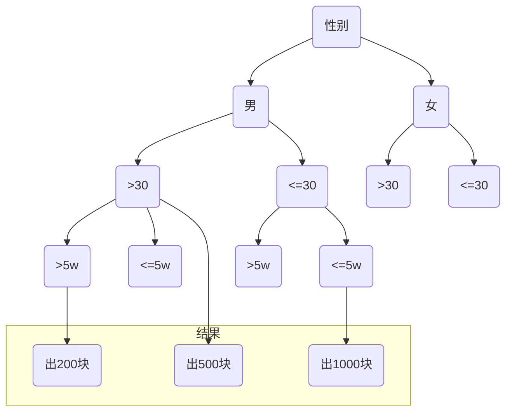

# 决策表

决策表又称为判断表，是用表格形式表示一组相关联的输入和输出表达式；使用决策表和表层次结构在表现决策逻辑时有较好效果；

## 专业术语

- 条件桩：列出问题的所有条件；
- 条件项：针对条件桩给出的条件列出所有可能的取值；
- 动作桩：列出问题规定的可能采取的操作；
- 动作项：指出在条件项的各组取值情况下应该采取的动作；
- 规则    ：任何一个条件组合的特定取值及其相应要执行的操作称为规则，在判定表中贯穿条件项和动作项的一列就是一条规则。

## 适用范围

| &nbsp;     | 场景                                                         |
| ---------- | ------------------------------------------------------------ |
| 适合场景   | - 决策表特别适合于针对不同逻辑条件的组合，测试对象需要执行不同操作的场景 |
| 不适合场景 | - 输入和输出不明确，或输入与输出的因果关系不明确的情况； - 被分析的特点和功能点过于复杂，输入项目很多的情况下。输入项过多，会造成决策表非常庞大，没有工具辅助的情况下，难以操作； - 系统输入之间相互约束少，不需要做大范围的组合测试时，不宜用本工程方法，不然会产生大量用例冗余； - 系统输入之间存在顺序先后的可变性。例如，两个输入之间可以交换顺序，且交换顺序后，他们的输出是不一样的。判定表的输入是无法排序的； |

## 格式

### 决策表结构

| 条件桩     | $b_1$    | ...  | $b_n$    |
| ---------- | -------- | ---- | -------- |
| $c_1$      | $x_{11}$ | ...  | $x_{1n}$ |
| ...        | ...      | ...  | ...      |
| $c_m$      | $x_{m1}$ | ...  | $x_{mn}$ |
| **动作桩** | ↓        | ↓    | ↓        |
| $a_1$      | $y_{11}$ | ...  | $y_{1n}$ |
| ...        | ...      | ...  | ...      |
| $a_m$      | $y_{m1}$ | ...  | $y_{mn}$ |

- $c_m$  ：条件
- $b_n$   ：决策路径
- $x_{mn}$：单个决策
- $a_m$  ：动作

## 示例

### 1 俱乐部收费

一个俱乐部收费标准：

1. 一般男士收费为 1000
2. 一般女士收费为 800
3. 大于30岁的人士收费为 500
4. 月收入超过5w的男士收取 200

根据上面的信息我们可以抽取出如下条件：

| 变量 | 区间                |
| ---- | ------------------- |
| 性别 | - `男` - `女`    |
| 年龄 | - `>30` - `<=30` |
| 收入 | - `>5w` - `<=5w` |

建立了决策表步骤：

1. 确定规则个数；
2. 列出所有的条件桩和动作桩；
3. 填入条件项；
4. 填入动作桩和动作项，得到初始决策表；
5. 化简，合并相似规则；
6. 生成决策表。

| **条件桩** | 情况1 | 情况2 | 情况3 |
| ---------- | ----- | ----- | ----- |
| 男         | 1     | 1     |       |
| 女         |       |       | 1     |
| >30        | 1     |       | 1     |
| <=30       |       | 1     |       |
| >5w        | 1     |       | 1     |
| **动作桩** | ↓     | ↓     | ↓     |
| 1000       |       | 1     |       |
| 800        |       |       |       |
| 500        |       |       | 1     |
| 200        | 1     |       |       |

根据决策表生成决策树：

### 2 判断三角形类型

三角形类型的判断标准：

1. 不等边三角形：三条边都不相等的三角形
2. 等腰三角形    ：至少有两边相等的三角形
3. 等边三角形    ：三边都相等的三角形

建立了决策表步骤：

1. 确定规则个数；
2. 列出所有的条件桩和动作桩；
3. 填入条件项；
4. 填入动作桩和动作项，得到初始决策表；
5. 化简，合并相似规则；
6. 生成决策表。

| **条件桩**   | 1    | 2    | 3    | 4    | 5    | 6    | 7    | 8    | 9    | 10   | 11   |
| ------------ | ---- | ---- | ---- | ---- | ---- | ---- | ---- | ---- | ---- | ---- | ---- |
| $a<b+c$      |      | √    | √    | √    | √    | √    | √    | √    | √    | √    | √    |
| $b<a+c$      |      |      | √    | √    | √    | √    | √    | √    | √    | √    | √    |
| $c<a+b$      |      |      |      | √    | √    | √    | √    | √    | √    | √    | √    |
| $a = b$      |      |      |      | √    | √    | √    |      |      |      |      |      |
| $a = c$      |      |      |      | √    | √    |      |      | √    | √    |      |      |
| $b = c$      |      |      |      | √    |      | √    |      | √    |      | √    |      |
| **动作桩**   | ↓    | ↓    | ↓    | ↓    | ↓    | ↓    | ↓    | ↓    | ↓    | ↓    | ↓    |
| 非三角形     | √    | √    | √    |      |      |      |      |      |      |      |      |
| 不等边三角形 |      |      |      |      |      |      |      |      |      |      | √    |
| 等腰三角形   |      |      |      |      |      |      | √    |      | √    | √    |      |
| 等边三角形   |      |      |      | √    |      |      |      |      |      |      |      |
| 不可能       |      |      |      |      | √    | √    |      | √    |      |      |      |

根据决策表生成决策树：

略

## 参考

- [百度百科-决策表](https://baike.baidu.com/item/%E5%86%B3%E7%AD%96%E8%A1%A8/667332?fr=aladdin)

- [【测试分析】决策表、决策树](https://www.cnblogs.com/by-dream/p/5336918.html)

