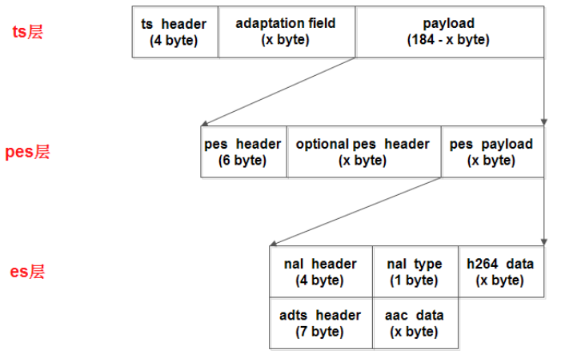
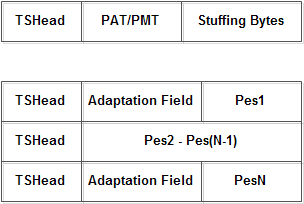

#  HLS(HTTP Live Streaming)协议

## 参考
* [HLS协议解析](https://www.cnblogs.com/jimodetiantang/p/9133564.html)
* [ HTTP Live Streaming draft-pantos-http-live-streaming-18](https://tools.ietf.org/html/draft-pantos-http-live-streaming-18)
* [hls之m3u8、ts流格式详解](https://my.oschina.net/u/727148/blog/666824)

## 组成
* 传输协议: HTTP
* 索引文件: M3U8
* 音视频数据容器: TS

## 编码要求
* 视频: H264
* 音频: AAC, MP3, AC-3
* 音视频数据容器: ts
* 索引文件: m3u3

## 播放
### 苹果: 使用Safari 浏览器直接就能打开 m3u8 地址，如:
```
http://demo.srs.com/live/livestream.m3u8
```

### 安卓: 需要使用 html5 的 video 标签，然后在浏览器中打开这个页面
```
<!-- livestream.html -->
<video width="640" height="360"
        autoplay controls autobuffer 
        src="http://demo.srs.com/live/livestream.m3u8"
        type="application/vnd.apple.mpegurl">
</video>
```

## m3u8
以 utf-8 编码的 m3u 文件，这个文件本身不能播放，只是存放了播放信息的文本文件,结构如下
1. #EXTM3U	
	> 每个 m3u8 文件第一行必须是这个 tag

2. #EXTINF 
	> 指定每个媒体段（ts）的时长(受gop影响)，这个仅对其后面的 URI 有效，每两个媒体段 URI 间被这个 tag 分隔开其格式为：
	```
	#EXTINF:<duration>,<title>

	duration：表示持续的时间（秒）
	```
	
3. #EXT-X-BYTERANGE
	> 表示媒体段是一个媒体 URI 资源中的一段，只对其后的 media URI 有效，格式为：
	```
	#EXT-X-BYTERANGE:<n>[@o]

	n：表示这个区间的大小
	o：表示在 URI 中的 offset
	```

4. #EXT-X-TARGETDURATION：
	> 指定当前视频流中的单个切片（即 ts）文件的最大时长（秒）。所以 #EXTINF 中指定的时间长度必须小于或是等于这个最大值。这个 tag 在整个 Playlist 文件中只能出现一次（在嵌套的情况下，一般有真正
	ts url 的 m3u8 才会出现该 tag）。格式为：
	```
	#EXT-X-TARGETDURATION:<s>

	s：表示最大的秒数
	```

5. #EXT-X-MEDIA-SEQUENCE：
	> 每一个 media URI 在 Playlist 中只有唯一的序号，相邻之间序号 +1。格式为：
	```
	#EXT-X-MEDIA-SEQUENCE:<number>

	一个 media URI 并不是必须要包含的，如果没有，默认为 0.
	```

6. #EXT-X-KEY：
	> 表示怎么对 media segments 进行解码。其作用范围是下次该 tag 出现前的所有 media URI。格式为：
	```
	#EXT-X-KEY:<attribute-list>

	如果为:NONE，则 URI 以及 IV 属性必须不存在，如果是 AES-128(Advanced Encryption Standard)，则 URI 必须存在，IV 可以不存在。

	对于 AES-128 的情况，keytag 和 URI 属性共同表示了一个 key 文件，通过 URI 可以获得这个 key，如果没有 IV（Initialization Vector），则使用序列号作为 IV 进行编解码，将序列号的高位赋到 16 个字节的 buffer 中，左边补 0；如果有 IV，则将该值当成 16 个字节的 16 进制数。
	```

7. #EXT-X-PROGRAM-DATE-TIME:
	> 将一个绝对时间或是日期和一个媒体段中的第一个 sample 相关联，只对下一个 media URI 有效，格式如下：
	```
	#EXT-X-PROGRAM-DATE-TIME:<YYYY-MM-DDThh:mm:ssZ>
	
	例：#EXT-X-PROGRAM-DATE-TIME:2010-02-19T14:54:23.031+08:00
	```

8. #EXT-X-ALLOW-CACHE：
	> 是否允许做 cache，这个可以在 Playlist 文件中任意地方出现，并且最多只出现一次，作用效果是所有的媒体段。格式如下：
	```
	#EXT-X-ALLOW-CACHE:<YES|NO>
	```

9. #EXT-X-PLAYLIST-TYPE：
	> 提供关于 Playlist 的可变性的信息，这个对整个 Playlist 文件有效，是可选的，格式如下：
	```
	#EXT-X-PLAYLIST-TYPE:<EVENT|VOD>

	VOD，即为点播视频，服务器不能改变 Playlist 文件，换句话说就是该视频全部的 ts 文件已经被生成好了

	EVENT，就是实时生成 m3u8 和 ts 文件。服务器不能改变或是删除 Playlist 文件中的任何部分，但是可以向该文件中增加新的一行内容。它的索引文件一直处于动态变化中，播放的时候需要不断下载二级 index 文件
	```

10. #EXT-X-ENDLIST：
	> 表示 m3u8 文件的结束，live m3u8 没有该 tag。它可以在 Playlist 中任意位置出现，但是只能出现一个

11. #EXT-X-MEDIA:
	> 被用来在 Playlist 中表示相同内容的不同语种/译文的版本，比如可以通过使用 3 个这种 tag 表示 3 种不同语音的音频，或者用 2 个这个 tag 表示不同角度的 video。在 Playlist 中，这个标签是独立存在的，其格式如下:
	```
	#EXT-X-MEDIA:<attribute-list>

	该属性列表中包含：URI、TYPE、GROUP-ID、LANGUAGE、NAME、DEFAULT、AUTOSELECT。

	URI：如果没有，则表示这个 tag 描述的可选择版本在主 PlayList 的 EXT-X-STREAM-INF 中存在

	TYPE：AUDIO and VIDEO
	
	GROUP-ID：具有相同 ID 的 MEDIAtag，组成一组样式
	
	LANGUAGE：identifies the primary language used in the rendition
	
	NAME：The value is a quoted-string containing a human-readable description of the rendition. If the LANGUAGE attribute is present then this description SHOULD be in that language
	
	DEFAULT：YES 或是 NO，默认是 No，如果是 YES，则客户端会以这种选项来播放，除非用户自己进行选择
	
	AUTOSELECT：YES 或是 NO，默认是 No，如果是 YES，则客户端会根据当前播放环境来进行选择（用户没有根据自己偏好进行选择的前提下）
	
	The EXT-X-MEDIA tag appeared in version 4 of the protocol。
	```

12. #EXT-X-STREAM-INF：
	> 指定一个包含多媒体信息的 media URI 作为 Playlist，一般做 m3u8 的嵌套使用，它只对紧跟后面的 URI 有效，格式如下：
	```
	#EXT-X-STREAM-INF:<attribute-list> 常用的属性如下：
	
	BANDWIDTH：带宽，必须有
	
	PROGRAM-ID：该值是一个十进制整数，唯一地标识一个在 Playlist 文件范围内的特定的描述。一个 Playlist 文件中可能包含多个有相同 ID 的此 tag
	
	CODECS：指定流的编码类型，不是必须的
	
	RESOLUTION：分辨率
	
	AUDIO：这个值必须和 AUDIO 类别的 "EXT-X-MEDIA" 标签中 "GROUP-ID" 属性值相匹配
	
	VIDEO：同上
	```

13. #EXT-X-DISCONTINUITY：
	> 当遇到该 tag 的时候说明以下属性发生了变化：
	```
	file format
	number and type of tracks
	encoding parameters
	encoding sequence
	timestamp sequence
	```

14. #ZEN-TOTAL-DURATION：
	> 表示这个 m3u8 所含 ts 的总时间长度

### m3u8多码率支持
```
二级m3u8文件:
#EXTM3U
#EXT-X-VERSION:3
#EXT-X-ALLOW-CACHE:YES
#EXT-X-MEDIA-SEQUENCE:2
#EXT-X-TARGETDURATION:16
#EXTINF:14.357, no desc
livestream-2.ts
#EXTINF:15.617, no desc
livestream-3.ts
#EXTINF:14.358, no desc
livestream-4.ts
#EXTINF:15.618, no desc
livestream-5.ts
#EXTINF:11.130, no desc
livestream-6.ts

顶级m3u8文件:
#EXTM3U
#EXT-X-STREAM-INF:PROGRAM-ID=1,BANDWIDTH=1280000
http://example.com/low.m3u8
#EXT-X-STREAM-INF:PROGRAM-ID=1,BANDWIDTH=2560000
http://example.com/mid.m3u8
#EXT-X-STREAM-INF:PROGRAM-ID=1,BANDWIDTH=7680000
http://example.com/hi.m3u8
#EXT-X-STREAM-INF:PROGRAM-ID=1,BANDWIDTH=65000,CODECS="mp4a.40.5"
http://example.com/audio-only.m3u8
```

## Ts
ts为传输流文件，视频编码主要格式为H264/MPEG4, 音频为AAC/MP3; ts文件分为3层:
* ts 层：Transport Stream，是在 pes 层的基础上加入数据流的识别和传输必须的信息。
* pes 层：Packet Elemental Stream，是在音视频数据上加了时间戳等对数据帧的说明信息。
* es 层：Elementary Stream，即音视频数据



### Ts层
ts 包大小固定为 188 字节，ts 层分为三个部分：ts header、adaptation field、payload。ts header 固定 4 个字节；adaptation field 可能存在也可能不存在，主要作用是给不足 188 字节的数据做填充；payload 是 pes 数据。

#### ts header
|条目|长度(单位:bit)|描述|
|:--|:--|:--|
|sync_byte|8b|同步字节，固定为0x47|
|transport_error_indicator|1b|传输错误指示符，表明在ts头的adapt域后由一个无用字节，通常都为0，这个字节算在adapt域长度内|
|payload_unit_start_indicator|1b|负载单元起始标示符，一个完整的数据包开始时标记为1|
|transport_priority|1b|传输优先级，0为低优先级，1为高优先级，通常取0|
|pid|13b|pid值|
|transport_scrambling_control|2b|传输加扰控制，00表示未加密|
|adaptation_field_control|2b|是否包含自适应区，‘00’保留；‘01’为无自适应域，仅含有效负载；‘10’为仅含自适应域，无有效负载；‘11’为同时带有自适应域和有效负载。|
|continuity_counter|4b|递增计数器，从0-f，起始值不一定取0，但必须是连续的|

ts层的内容是通过PID值来标识的，主要内容包括：PAT表、PMT表、音频流、视频流。解析ts流要先找到PAT表，只要找到PAT就可以找到PMT，然后就可以找到音视频流了。PAT表的PID值固定为0。PAT表和PMT表需要定期插入ts流，因为用户随时可能加入ts流，这个间隔比较小，通常每隔几个视频帧就要加入PAT和PMT。PAT和PMT表是必须的，还可以加入其它表如SDT（业务描述表）等，不过hls流只要有PAT和PMT就可以播放了。

* PAT表：他主要的作用就是指明了PMT表的PID值。
* PMT表：他主要的作用就是指明了音视频流的PID值。
* 音频流/视频流：承载音视频内容。

#### adaption
|条目|长度|描述|
|:--|:--|:--|
|adaptation_field_length|1B|自适应域长度，后面的字节数|
|flag|1B|取0x50表示包含PCR或0x40表示不包含PCR|
|PCR|5B|Program Clock Reference，节目时钟参考，用于恢复出与编码端一致的系统时序时钟STC（System Time Clock）。|
|stuffing_bytes|xB|填充字节，取值0xff|

自适应区的长度要包含传输错误指示符标识的一个字节。pcr是节目时钟参考，pcr、dts、pts都是对同一个系统时钟的采样值，pcr是递增的，因此可以将其设置为dts值，音频数据不需要pcr。如果没有字段，ipad是可以播放的，但vlc无法播放。打包ts流时PAT和PMT表是没有adaptation field的，不够的长度直接补0xff即可。视频流和音频流都需要加adaptation field，通常加在一个帧的第一个ts包和最后一个ts包里，中间的ts包不加。



**PAT格式**
|条目|长度|描述|
|:--|:--|:--|
|table_id|8b|PAT表固定为0x00|
|section_syntax_indicator|1b|固定为1|
|zero|1b|固定为0|
|reserved|2b|固定为11|
|section_length|12b|后面数据的长度|
|transport_stream_id|16b|传输流ID，固定为0x0001|
|reserved|2b|固定为11|
|version_number|5b|版本号，固定为00000，如果PAT有变化则版本号加1|
|current_next_indicator|1b|固定为1，表示这个PAT表可以用，如果为0则要等待下一个PAT表|
|section_number|8b|固定为0x00|
|last_section_number|8b|固定为0x00|
|开始循环|
|program_number|16b|节目号为0x0000时表示这是NIT，节目号为0x0001时,表示这是PMT|
|reserved|3b|固定为111|
|PID|13b|节目号对应内容的PID值|
|结束循环|
|CRC32|32b|前面数据的CRC32校验码|

**PMT格式**
|条目|长度|描述|
|:--|:--|:--|
|table_id|8b|PMT表取值随意，0x02|
|section_syntax_indicator|1b|固定为1|
|zero|1b|固定为0|
|reserved|2b|固定为11|
|section_length|12b|后面数据的长度|
|program_number|16b|频道号码，表示当前的PMT关联到的频道，取值0x0001|
|reserved|2b|固定为11|
|version_number|5b|版本号，固定为00000，如果PAT有变化则版本号加1|
|current_next_indicator|1b|固定为1|
|section_number|8b|固定为0x00|
|last_section_number|8b|固定为0x00|
|reserved|3b|固定为111|
|PCR_PID|13b|PCR(节目参考时钟)所在TS分组的PID，指定为视频PID|
|reserved|4b|固定为1111|
|program_info_length|12b|节目描述信息，指定为0x000表示没有|
|开始循环|
|stream_type|8b|流类型，标志是Video还是Audio还是其他数据，h.264编码对应0x1b，aac编码对应0x0f，mp3编码对应0x03|
|reserved|3b|固定为111|
|elementary_PID|13b|与stream_type对应的PID|
|reserved|4b|固定为1111|
|ES_info_length|12b|描述信息，指定为0x000表示没有|
|结束循环|
|CRC32|32b|前面数据的CRC32校验码|

### pes层
pes层是在每一个视频/音频帧上加入了时间戳等信息，pes包内容很多，我们只留下最常用的。

Pes Header (6B) + Optional Pes Header (3B~259B) + Payload (最大65526B)

|条目|长度|描述|
|:--|:--|:--|
|pes start code|3B|开始码，固定为0x000001|
|stream id|1B|音频取值（0xc0-0xdf），通常为0xc0；视频取值（0xe0-0xef），通常为0xe0|
|pes packet length|2B|后面pes数据的长度，0表示长度不限制，只有视频数据长度会超过0xffff|
|flag|1B|通常取值0x80，表示数据不加密、无优先级、备份的数据|
|flag|1B|取值0x80表示只含有pts，取值0xc0表示含有pts和dts|
|pes data length|1B|后面数据的长度，取值5或10|
|pts|5B|33bit值|
|dts|5B|33bit值|

pts是显示时间戳、dts是解码时间戳，视频数据两种时间戳都需要，音频数据的pts和dts相同，所以只需要pts。

有pts和dts两种时间戳是B帧引起的，I帧和P帧的pts等于dts。如果一个视频没有B帧，则pts永远和dts相同。

从文件中顺序读取视频帧，取出的帧顺序和dts顺序相同。

dts算法比较简单，初始值 + 增量即可，pts计算比较复杂，需要在dts的基础上加偏移量。

音频的pes中只有pts（同dts），视频的I、P帧两种时间戳都要有，视频B帧只要pts（同dts）。

打包pts和dts就需要知道视频帧类型，但是通过容器格式我们是无法判断帧类型的，必须解析h.264内容才可以获取帧类型。

举例说明：
||I|P|B|B|B|P|
|:--|:--|:--|:--|:--|:--|:--|
|读取顺序|1|2|3|4|5|6|
|dts顺序|1|2|3|4|5|6|
|pts顺序|1|5|3|2|4|6|

**点播视频dts算法：**

dts = 初始值 + 90000 / video_frame_rate，初始值可以随便指定，但是最好不要取0，video_frame_rate就是帧率，比如23、30。

pts和dts是以timescale为单位的，1s = 90000 time scale , 一帧就应该是90000/video_frame_rate 个timescale。

用一帧的timescale除以采样频率就可以转换为一帧的播放时长

**点播音频dts算法：**
dts = 初始值 + (90000 * audio_samples_per_frame) / audio_sample_rate

audio_samples_per_frame这个值与编解码相关，aac取值1024，mp3取值1158

audio_sample_rate是采样率，比如24000、41000。AAC一帧解码出来是每声道1024个sample，也就是说一帧的时长为1024/sample_rate秒。所以每一帧时间戳依次0，1024/sample_rate，...，1024*n/sample_rate秒。

直播视频的dts和pts应该直接用直播数据流中的时间，不应该按公式计算。

### es层
#### h.264视频
打包h.264数据我们必须给视频数据加上一个nalu（Network Abstraction Layer unit），

nalu包括nalu header和nalu type，nalu header固定为0x00000001（帧开始）或0x000001（帧中）。

h.264的数据是由slice组成的，slice的内容包括：视频、sps、pps等。nalu type决定了后面的h.264数据内容。

```
0 1 2 3 4 5 6 7 
+-+-+-+-+-+-+-+-+
|F|NRI|  TYPE   |  
+-+-+-+-+-+-+-+-+
```
* F    1b forbidden_zero_bit，h.264规定必须取0
* NRI  2b nal_ref_idc，取值0~3，指示这个nalu的重要性，I帧、sps、pps通常取3，P帧通常取2，B帧通常取0
* Type 5b 参考下表

|nal_unit_type|说明|
|:--|:--|
|0|未使用|
|1|非IDR图像片，IDR指关键帧|
|2|片分区A|
|3|片分区B|
|4|片分区C|
|5|IDR图像片，即关键帧|
|6|补充增强信息单元(SEI)|
|7|SPS序列参数集|
|8|PPS图像参数集|
|9|分解符|
|10|序列结束|
|11|码流结束|
|12|填充|
|13~23|保留|
|24~31|未使用|

打包es层数据时pes头和es数据之间要加入一个type=9的nalu，关键帧slice前必须要加入type=7和type=8的nalu，而且是紧邻。

