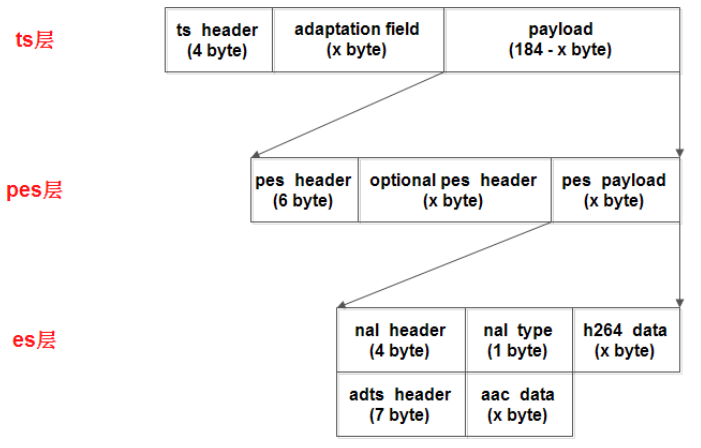
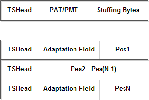
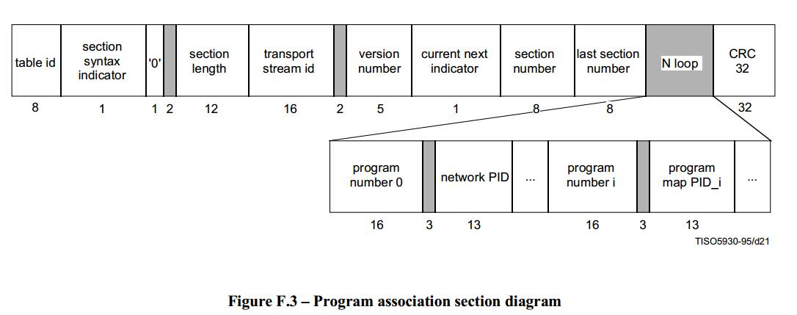
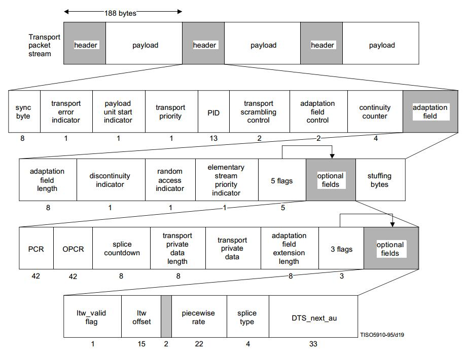

# Ts
ts为传输流文件，视频编码主要格式为H264/MPEG4, 音频为AAC/MP3; ts文件分为3层:

- ts 层：Transport Stream，是在 pes 层的基础上加入数据流的识别和传输必须的信息。
- pes 层：Packet Elemental Stream，是在音视频数据上加了时间戳等对数据帧的说明信息。
- es 层：Elementary Stream，即音视频数据



ts 包大小固定为 188 字节，ts 层分为三个部分：ts header、adaptation field、payload。ts header 固定 4 个字节；adaptation field 可能存在也可能不存在，主要作用是给不足 188 字节的数据做填充；payload 是 pes 数据。

## Ts层
### ts header(ts包头)
|条目|长度(单位:bit)|描述|
|:--|:--|:--|
|sync_byte|8b|同步字节,用来分包,固定为0x47|
|transport_error_indicator|1b|传输错误指示符，表明在ts头的adapt域后由一个无用字节，通常都为0，这个字节算在adapt域长度内;1 表示在相关的传输包中至少有一个不可纠正的错误位。当被置1后，在错误被纠正之前不能重置为0|
|payload_unit_start_indicator|1b|负载单元起始标示符，一个完整的数据包开始时标记为1;为1时，表示当前TS包的有效载荷中包含PES或者PSI的起始位置；在前4个字节之后会有一个调整字节，其的数值为后面调整字段的长度length。因此有效载荷开始的位置应再偏移1+[length]个字节|
|transport_priority|1b|传输优先级，0为低优先级，1为高优先级，通常取0|
|pid|13b|PID(packet ID)值|
|transport_scrambling_control|2b|传输加扰控制，表示TS流分组有效负载的加密模式, 00表示未加密|
|adaptation_field_control|2b|适配域控制标志, 是否包含自适应区;‘00’保留;‘01’为无自适应域,仅含有效负载;‘10’为仅含自适应域，无有效负载；‘11’为同时带有自适应域和有效负载|
|continuity_counter|4b|包递增计数器，随着每一个具有相同PID的TS流分组而增加，当它达到最大值后又回复到0。范围为0~15|

ts层的内容是通过PID值来标识的，主要内容包括：PAT表、PMT表、音频流、视频流。解析ts流要先找到PAT表，只要找到PAT就可以找到PMT，然后就可以找到音视频流了。PAT表的PID值固定为0。PAT表和PMT表需要定期插入ts流，因为用户随时可能加入ts流，这个间隔比较小，通常每隔几个视频帧就要加入PAT和PMT。PAT和PMT表是必须的，还可以加入其它表如SDT（业务描述表）等，不过hls流只要有PAT和PMT就可以播放了。
- PAT表：他主要的作用就是指明了PMT表的PID值。
- PMT表：他主要的作用就是指明了音视频流的PID值。
- 音频流/视频流：承载音视频内容。

PID值0x0000—0x000F保留。其中0x0000为PAT保留；0x0001为CAT保留；0x1fff为分组保留，即空包。标准中定义的PID分配见下表：

|PID值|描述|
|:--|:--|
|0x0000|PAT(Program Association Table)|
|0x0001|CAT(Conditional Access Table)|
|0x0002|TSDT|
|3-0xF|Reserved|
|0x10-0x1FFE|自定义PID，可用于PMT的pid、network的pid或者其他目标|
|0x1FFF|空包|
|-|注意PCR的PID可以选择0、1或者0x10-0x1FFE的任意值|

### adaption(填充区)
|条目|长度|描述|
|:--|:--|:--|
|adaptation_field_length|1B|填充区长度|
|flag|1B|取0x50表示包含PCR或0x40表示不包含PCR|
|PCR|5B|Program Clock Reference，节目时钟参考，用于恢复出与编码端一致的系统时序时钟STC（System Time Clock）|
|stuffing_bytes|xB|填充字节，取值0xff|

自适应区的长度要包含传输错误指示符标识的一个字节。pcr是节目时钟参考，pcr、dts、pts都是对同一个系统时钟的采样值，pcr是递增的，因此可以将其设置为dts值，音频数据不需要pcr。如果没有字段，ipad是可以播放的，但vlc无法播放。打包ts流时PAT和PMT表是没有adaptation field的，不够的长度直接补0xff即可。视频流和音频流都需要加adaptation field，通常加在一个帧的第一个ts包和最后一个ts包里，中间的ts包不加。



#### PAT表(Program Association Table 节目关联表) 0x0000
TS流中会定期出现PAT表，PAT表提供了节目号和对应PMT表格的PID的对应关系；结构如下:



|条目|长度|描述|
|:--|:--|:--|
|table_id|8b|PAT表固定为0x00; 0x00:program_association_section; 0x01:conditional_access_section (CA_section); 0x02:TS_program_map_section; 0x03:	TS_description_section; 0x04:ISO_IEC_14496_scene_description_section; 0x05:ISO_IEC_14496_object_descriptor_section; 0x06-0x37: ITU-T Rec. H.222.0 / ISO/IEC 13818-1 reserved; 0x38-0x3F: Defined in ISO/IEC 13818-6|
|section_syntax_indicator|1b|固定为1|
|zero|1b|固定为0|
|reserved|2b|保留位，固定为11|
|section_length|12b|高2位应为00，表明此字段之后的整个分段的字节数，包含CRC32|
|transport_stream_id|16b|传输流ID，用来在一个网络中从其他的多路复用中识别此传送流，其值由用户自定义|
|reserved|2b|保留位，固定为11|
|version_number|5b|PAT版本号，固定为00000，如果PAT有变化则版本号加1|
|current_next_indicator|1b|固定为1，表示这个PAT表可以用，如果为0则要等待下一个PAT表|
|section_number|8b|当前PAT分段号码，PAT第一分段号码固定为0x00|
|last_section_number|8b|PAT最后分段号码，固定为0x00|
|开始循环|
|program_number|16b|节目号，为0x0000时表示这是NIT，为0x0001时,表示这是PMT|
|reserved|3b|保留位，固定为111|
|PID|13b|节目号对应内容的PID值|
|结束循环|
|CRC32|32b|前面数据的CRC32校验码|

#### PMT表(Program Map Tables 节目映射表)
PMT在传送流中用于指示组成某一套节目的视频、音频和数据在传送流中的位置，即对应的TS包的PID值，以及每路节目的节目时钟参考（PCR）字段的位置; 结构如下:


|条目|长度|描述|
|:--|:--|:--|
|table_id|8b|PMT表取值随意，0x02|
|section_syntax_indicator|1b|固定为1|
|zero|1b|固定为0|
|reserved|2b|固定为11|
|section_length|12b|后面数据的长度|
|program_number|16b|频道号码，表示当前的PMT关联到的频道，取值0x0001|
|reserved|2b|固定为11|
|version_number|5b|版本号，固定为00000，如果PAT有变化则版本号加1|
|current_next_indicator|1b|固定为1|
|section_number|8b|固定为0x00|
|last_section_number|8b|固定为0x00|
|reserved|3b|固定为111|
|PCR_PID|13b|PCR(节目参考时钟)所在TS分组的PID，指定为视频PID|
|reserved|4b|固定为1111|
|program_info_length|12b|节目描述信息，指定为0x000表示没有|
|开始循环|
|stream_type|8b|流类型，标志是Video还是Audio还是其他数据，h.264编码对应0x1b，aac编码对应0x0f，mp3编码对应0x03|
|reserved|3b|固定为111|
|elementary_PID|13b|与stream_type对应的PID|
|reserved|4b|固定为1111|
|ES_info_length|12b|描述信息，指定为0x000表示没有|
|结束循环|
|CRC32|32b|前面数据的CRC32校验码|


## pes层
pes层是在每一个视频/音频帧上加入了时间戳等信息,结构如下

Pes Header (6B) + Optional Pes Header (3B~259B) + Payload (最大65526B)

|条目|长度|描述|
|:--|:--|:--|
|pes start code|3B|开始码，固定为0x000001|
|stream id|1B|音频取值（0xc0-0xdf），通常为0xc0；视频取值（0xe0-0xef），通常为0xe0|
|pes packet length|2B|后面pes数据的长度，0表示长度不限制，只有视频数据长度会超过0xffff|
|flag|1B|通常取值0x80，表示数据不加密、无优先级、备份的数据|
|flag|1B|取值0x80表示只含有pts，取值0xc0表示含有pts和dts|
|pes data length|1B|后面数据的长度，取值5或10|
|pts|5B|33bit值|
|dts|5B|33bit值|

pts是显示时间戳、dts是解码时间戳，视频数据两种时间戳都需要，音频数据的pts和dts相同，所以只需要pts。

有pts和dts两种时间戳是B帧引起的，I帧和P帧的pts等于dts。如果一个视频没有B帧，则pts永远和dts相同。

从文件中顺序读取视频帧，取出的帧顺序和dts顺序相同。

dts算法比较简单，初始值 + 增量即可，pts计算比较复杂，需要在dts的基础上加偏移量。

音频的pes中只有pts（同dts），视频的I、P帧两种时间戳都要有，视频B帧只要pts（同dts）。

打包pts和dts就需要知道视频帧类型，但是通过容器格式我们是无法判断帧类型的，必须解析h.264内容才可以获取帧类型。

举例说明：
||I|P|B|B|B|P|
|:--|:--|:--|:--|:--|:--|:--|
|读取顺序|1|2|3|4|5|6|
|dts顺序|1|2|3|4|5|6|
|pts顺序|1|5|3|2|4|6|

**点播视频dts算法：**

dts = 初始值 + 90000 / video_frame_rate，初始值可以随便指定，但是最好不要取0，video_frame_rate就是帧率，比如23、30。

pts和dts是以timescale为单位的，1s = 90000 time scale , 一帧就应该是90000/video_frame_rate 个timescale。

用一帧的timescale除以采样频率就可以转换为一帧的播放时长

**点播音频dts算法：**
dts = 初始值 + (90000 * audio_samples_per_frame) / audio_sample_rate

audio_samples_per_frame这个值与编解码相关，aac取值1024，mp3取值1158

audio_sample_rate是采样率，比如24000、41000。AAC一帧解码出来是每声道1024个sample，也就是说一帧的时长为1024/sample_rate秒。所以每一帧时间戳依次0，1024/sample_rate，...，1024*n/sample_rate秒。

直播视频的dts和pts应该直接用直播数据流中的时间，不应该按公式计算。

## es层
### h.264视频
打包h.264数据我们必须给视频数据加上一个nalu（Network Abstraction Layer unit），

nalu包括nalu header和nalu type，nalu header固定为0x00000001（帧开始）或0x000001（帧中）。

h.264的数据是由slice组成的，slice的内容包括：视频、sps、pps等。nalu type决定了后面的h.264数据内容。

```
0 1 2 3 4 5 6 7 
+-+-+-+-+-+-+-+-+
|F|NRI|  TYPE   |  
+-+-+-+-+-+-+-+-+
```
* F    1b forbidden_zero_bit，h.264规定必须取0
* NRI  2b nal_ref_idc，取值0~3，指示这个nalu的重要性，I帧、sps、pps通常取3，P帧通常取2，B帧通常取0
* Type 5b 参考下表

|nal_unit_type|说明|
|:--|:--|
|0|未使用|
|1|非IDR图像片，IDR指关键帧|
|2|片分区A|
|3|片分区B|
|4|片分区C|
|5|IDR图像片，即关键帧|
|6|补充增强信息单元(SEI)|
|7|SPS序列参数集|
|8|PPS图像参数集|
|9|分解符|
|10|序列结束|
|11|码流结束|
|12|填充|
|13~23|保留|
|24~31|未使用|

打包es层数据时pes头和es数据之间要加入一个type=9的nalu，关键帧slice前必须要加入type=7和type=8的nalu，而且是紧邻。


## 总结



## 链接

- [hls之m3u8、ts流格式详解](https://my.oschina.net/u/727148/blog/666824)
- [多媒体文件格式之TS](https://www.cnblogs.com/tocy/p/media_container_6-mpegts.html)
- [TS流PAT/PMT详解](https://www.cnblogs.com/shakin/p/3714848.html)
- [TS协议解析第一部分](https://blog.csdn.net/u013354805/article/details/51578457)
- [TS协议解析第二部分（PMT）](https://blog.csdn.net/u013354805/article/details/51586086)

