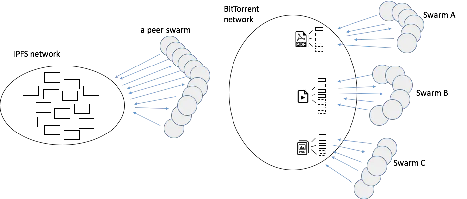

English | [中文版](bitswap_zh.md)

# BitSwap Protocol (Block Exchange Protocol)

[TOC]

## Summary

**BitSwap** is the protocol that defines block exchange in the IPFS network. In IPFS, both request and response messages use the same type of message packet. Since all peers in the IPFS network are equal nodes and there is no tracker server like in BitTorrent, the communication method is simpler.

The BitSwap protocol also defines strategies for how to request data, how to send data, and to whom to send data. Each node can have its own strategy. As the core module for data exchange, BitSwap uses some predefined incentive mechanisms to promote data flow in the network, achieving reciprocity through a ledger of peer-to-peer transfer records.

The data blocks in the Bitswap protocol are cross-file, which is the biggest difference from BitTorrent. In BitTorrent, block requests are file-based, and a peer swarm is always transferring data for the same file (or directory). In IPFS, since data requests are block-based, any type of data block can be used as long as its hash matches. A peer swarm corresponds to the entire IPFS network's data, so all blocks can be used, enabling true cross-file data exchange. This not only greatly reduces data redundancy but also greatly improves block retrieval efficiency. Clearly, BitSwap is more efficient than BitTorrent. Comparison between bitswap and bittorrent:

## Message Protocol

By default, IPFS uses the protobuf protocol for message encoding/decoding, and also supports Multicodec (adaptive encoding protocol), allowing the use of json and other encoding protocols.

Messages between peers are divided into two types,

## References

[1] [IPFS: BitSwap Protocol (Block Exchange)](https://zhuanlan.zhihu.com/p/33148036)

[2] [BitSwap Protocol in IPFS](https://www.jianshu.com/p/f51b9c235ef0)

[3] [Technical Analysis of IPFS Data Exchange Module Bitswap Architecture and Mechanism](https://www.chainnews.com/articles/544591093534.htm)

[4] ["IPFS Principles and Practice" — 3.4 Exchange Layer](https://bbs.huaweicloud.com/blogs/133425)

[5] [IPFS Official Bitswap Protocol](https://docs.ipfs.io/concepts/bitswap/)
