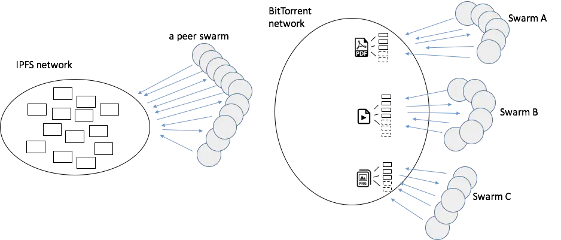

# BitSwap协议(数据块交换协议)

[TOC]

## 摘要

**BitSwap**是IPFS网络中定义数据块交换方式的协议，在 IPFS 中，请求和响应的消息都使用同一类型的消息包。由于在 IPFS 网络中，所有的 Peers 都是对等节点，不存在 BitTorrent 中那样的 Tracker 服务器，所以通信方式更加简单。

BitSwap 协议还定义了如何请求数据、如何发送数据以及向谁发送数据等策略，每个节点都可以有自己的策略，作为数据交换的核心模块，BitSwap 使用一些预定义的激励机制来促进网络中数据的流动，通过一个点对点之间的传输记录账本来达到互惠的目的。

Bitswap 协议的数据块是跨文件的，这个是跟 BitTorrent 最大的区别所在，因为在 BitTorrent 中，块请求都是基于文件的，一个 Peer Swarm 都是对同一个文件（目录）进行数据传输。而在 IPFS 中，由于数据请求是基于块的，任何类型的数据块，只要其哈希值一样，都可以拿为己用，一个 Peer Swarm 对应的是整个 IPFS 网络中的数据，因此所有的数据块都可以被用来使用，实现真正的跨文件数据交换。这不仅大大减少了数据的冗余，还大大提高的块检索的效率。显然，BitSwap 的效率比 BitTorrent 更高。bitswap与bittorrent的对比:

## 消息协议

ipfs默认使用protobuf协议来对消息编解码，同时也支持Multicodec(自适应编码协议)，允许使用json等其它编解码协议；

Peer之间通信的消息分为两种,

## 参考

[1] [IPFS: BitSwap协议(数据块交换)](https://zhuanlan.zhihu.com/p/33148036)

[2] [IPFS 中的 BitSwap 协议](https://www.jianshu.com/p/f51b9c235ef0)

[3] [技术解析 IPFS 数据交换模块 Bitswap 架构与工作机制](https://www.chainnews.com/articles/544591093534.htm)

[4] [《IPFS原理与实践》 —3.4　交换层（Exchange）](https://bbs.huaweicloud.com/blogs/133425)

[5] [ipfs官网Bitswap协议](https://docs.ipfs.io/concepts/bitswap/)
