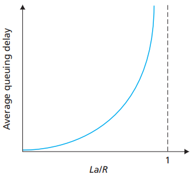

# Network Delay

[TOC]

This note summarizes the main sources of delay experienced by packets in a network, explains how delays accumulate end-to-end, and highlights practical points for measuring and reducing latency. The content is adapted and condensed from Kurose & Ross (A Top‑Down Approach) and reorganized to focus on the key ideas.

## High-level view

When a packet travels from a sender to a receiver it experiences delays at each node and on each link along the path. For a simple path with N links (and N−1 intermediate routers), sending a packet of size L bits over links of transmission rate R (bits/s) yields the following idealized transmission contribution to the end‑to‑end delay:

$$
d_{end\text{-}to\text{-}end}^{\;transmission} = N\cdot\frac{L}{R} \quad(\text{seconds})
$$

This expression counts the transmission time on each link; additional components (propagation, processing, queuing) add to the total experienced latency.

## Components of nodal delay

At each router or host a packet generally encounters four delay components. The nodal (per‑node) delay is commonly written as the sum:

$$
d_{nodal} = d_{proc} + d_{queue} + d_{trans} + d_{prop}
$$

- d_{proc} (processing delay): time to examine packet headers, perform routing table lookups, checksum verification, and other per‑packet processing. Typically on the order of microseconds to milliseconds depending on device and load.
- d_{trans} (transmission delay): L/R, the time to push all packet bits onto the link.
- d_{prop} (propagation delay): the physical propagation time across the medium, distance / propagation speed (speed of light in medium). Propagation delay depends on link length and is independent of packet size.
- d_{queue} (queuing delay): time the packet spends waiting in output buffers before transmission. This is the most variable component and depends on instantaneous traffic load and buffer management.

The relative importance of these components varies by technology: on local links transmission and processing may dominate; on long‑haul links propagation delay can be significant.

## Queuing delay and traffic intensity

Queuing delay is inherently variable and sensitive to congestion. A simple queueing model (M/M/1) gives intuition: let λ be the average packet arrival rate (packets/sec) and μ be the service rate (packets/sec) where μ ≈ R/L for fixed‑size packets. Define the traffic intensity ρ = λ/μ. When ρ approaches 1, queuing delay grows rapidly.

For an M/M/1 queue the average queuing delay (waiting time in queue) is:

$$
E[d_{queue}] = \frac{\rho}{\mu(1-\rho)}
$$

which shows the sharp increase in delay as utilization ρ → 1. Real networks are more complex (variable packet sizes, multiple queues, scheduling disciplines), but the qualitative lesson holds: operating network elements near saturation produces large, unpredictable queuing delays.

Figure: dependence of average queuing delay on traffic intensity (illustrative).

Practical implications:

- Keep utilization below high thresholds (the safe threshold depends on required latency and workload variability).
- Use active queue management (AQM) like RED or CoDel and appropriate scheduling to control queue growth and reduce latency spikes.

## Round‑trip time (RTT)

Round‑trip time (RTT) is the time for a small packet to travel from a sender to a receiver and for the acknowledgment to come back. RTT includes propagation, transmission (for small packets often negligible), processing, and queuing delays in both directions. RTT is fundamental for protocols that rely on acknowledgements (TCP) and for measuring path latency.

RTT ~= 2\cdot (one‑way propagation) + queuing + processing + small transmission components

When measuring RTT, remember that the forward and reverse paths may be asymmetric and queuing may vary over time; use statistical summaries (min, median, percentiles) rather than a single sample.

## Total end‑to‑end delay and examples

Combining per‑node and per‑link contributions, the total delay for a packet across a path is the sum of nodal delays and per‑link transmission times. In many simple analyses we approximate:

$$
d_{end\text{-}to\text{-}end} \approx \sum_{i=1}^{N} \left(d_{proc,i} + d_{queue,i} + d_{prop,i} + \frac{L}{R_i}\right)
$$

Example: for paths with many short links, transmission delays add up; for long‑distance paths, propagation can dominate. For interactive applications (VoIP, gaming) keeping per‑packet latency low and bounded is essential; for bulk transfer (large file copies) throughput matters more than a single‑packet latency.

## Measurement and engineering tips

- Measure latency using percentiles (p50, p95, p99) rather than only averages; tail latency often dominates user experience.
- Avoid operating links/queues at very high utilization if low latency is required. Aim to provision headroom for traffic bursts.
- Consider techniques that reduce queue buildup: small buffers with AQM, prioritization for latency‑sensitive flows, offloading on hardware (e.g., NIC features) for processing speed.
- For wide‑area links, use protocols and congestion control tuned for high‑bandwidth delay product links (e.g., BBR, tuned TCP variants).

## References

[1] James F. Kurose and Keith W. Ross. Computer Networking: A Top‑Down Approach. 6th ed.
