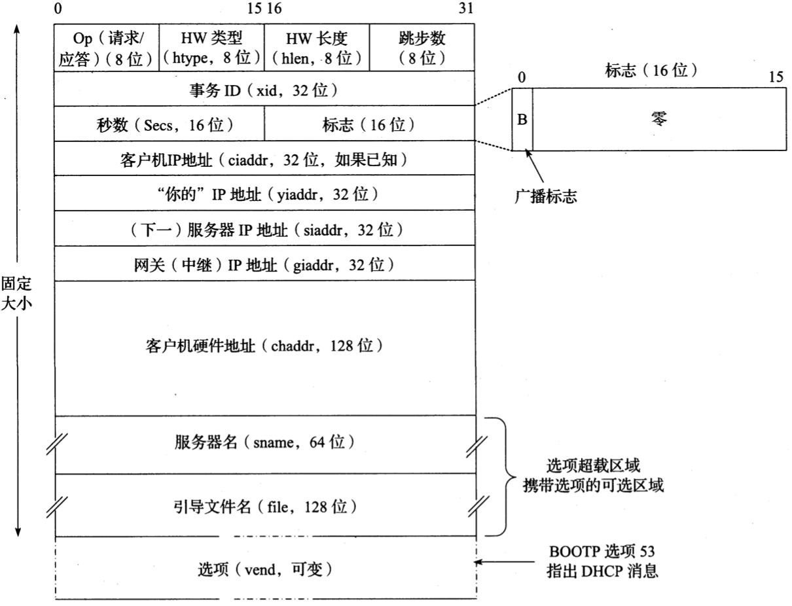
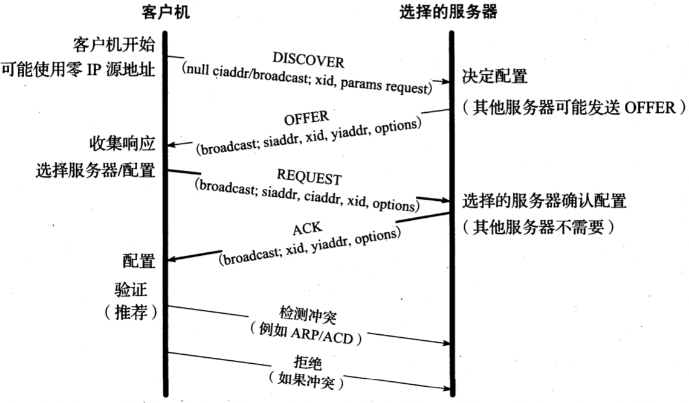
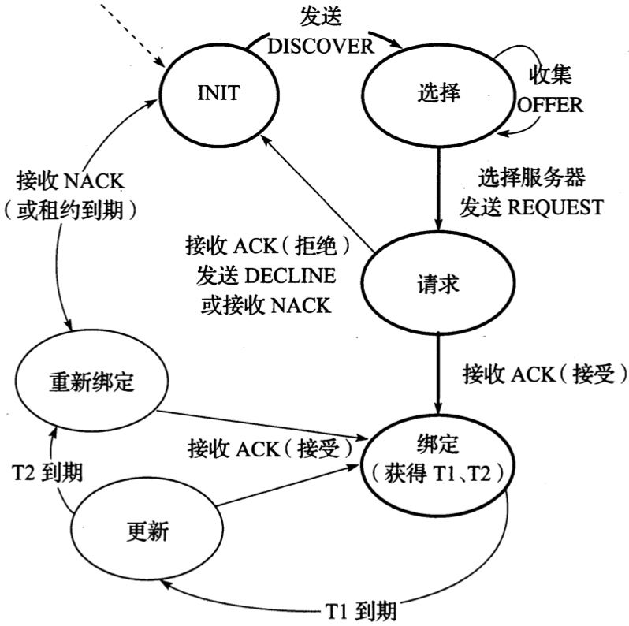
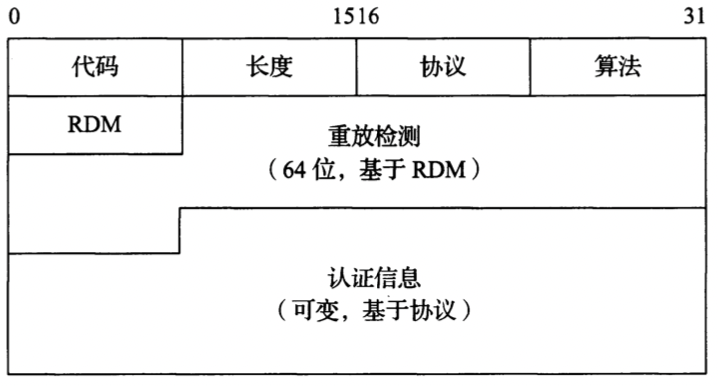
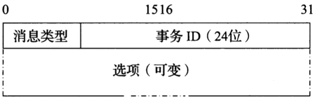
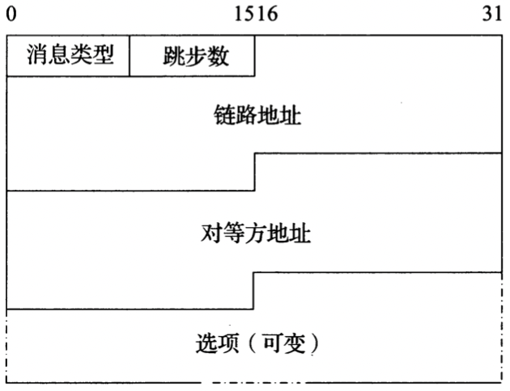
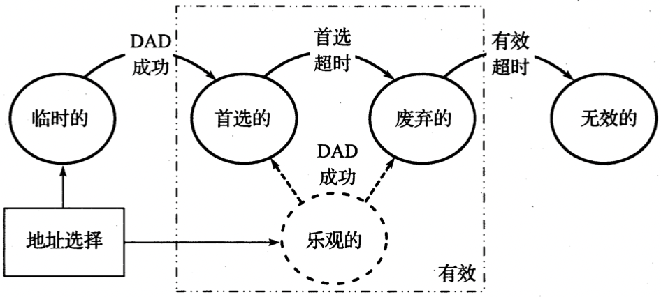
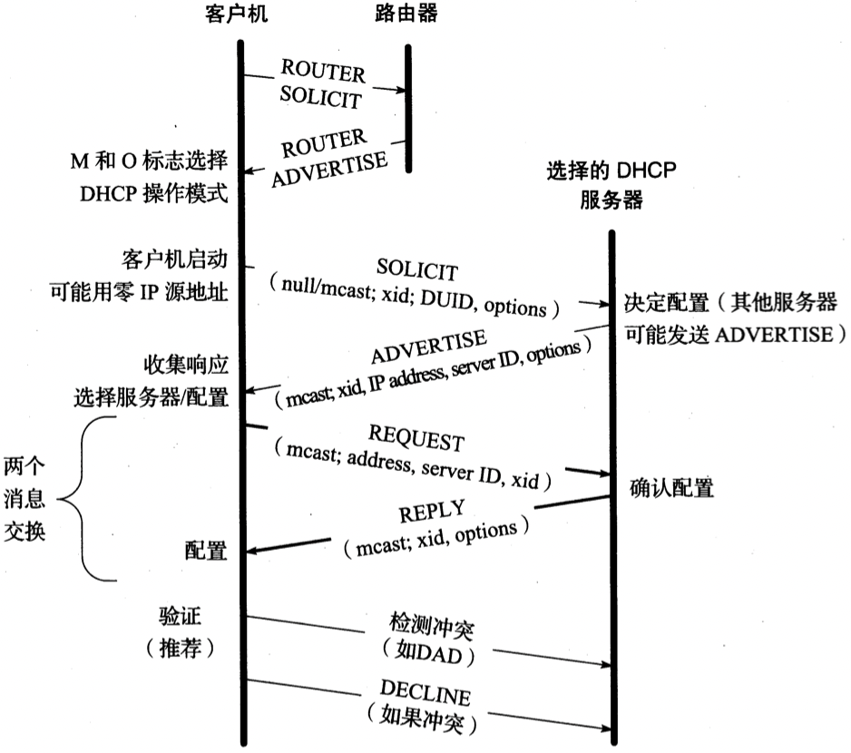
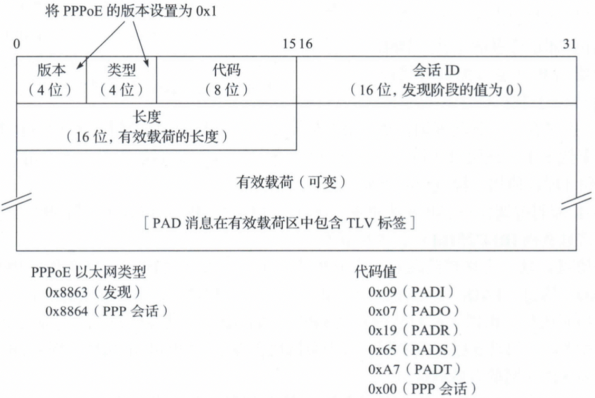
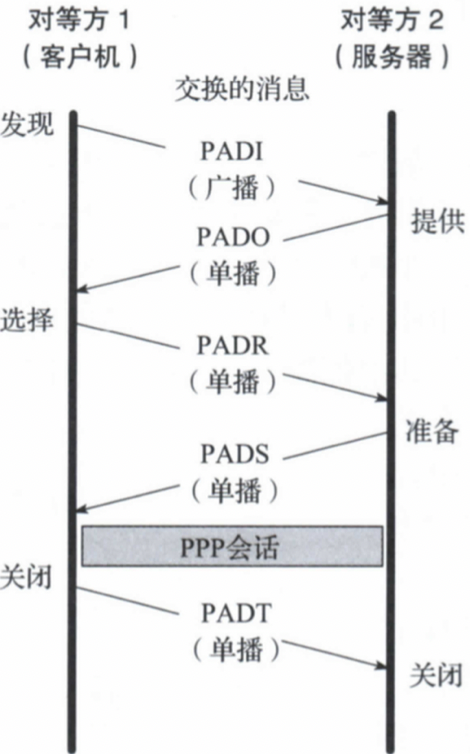

# DHCP协议

[TOC]


`DHCP[RFC2131]`是一种流行的客户机/服务器协议，它用于为主机（或路由器）指定配置信息。


## 消息格式

DHCP扩展了BOOTP，DHCP消息格式的定义采用扩展BOOTP的方式，以保持两种协议之间的兼容性。



- `Op` 标识消息是请求(1)/应答(2)
- `htype` 基于ARP使用的值分配
- `hlen` 存放硬件(MAC)地址(默认6)
- `跳步数` 消息传输过程中的中继次数，每次中继时递增
- `xid` 客户机选择的随机数，用于应答与请求匹配
- `Secs` 第1次尝试申请或重新申请地址经过的秒数（由客户机设置）
- `标志` 当前只包含一个经过定义的位：广播标志
- `ciaddr` 客户机IP地址
- `yiaddr` 服务器IP地址
- `siaddr` 下一个服务器的地址（用于引导）
- `giaddr` 网关中继IP地址
- `chaddr` 客户机硬件地址(MAC地址)
- `sname` 服务器名
- `file` 引导文件名
- `vend` 可选项，供应商扩展字段


## 协议操作



*一次典型的DHCP交换。客户机通过广播消息发现一组服务器和可提供的地址，它请求自己想获得的地址，并接收到选定服务器的确认。交易ID(xid)用于将请求和响应匹配，服务器ID（一个选项）指出那台服务器提供地址，并承诺将它与客户机绑定。如果客户机知道它想获得的地址，该协议可简化为仅使用`REQUEST`和`ACK`消息。*

### 释放DHCP获得的数据

```sh
# Windows
ipconfig /release
```

### 获取新的DHCP地址分配

```sh
# Windows
ipconfig /renew
```

### 通过禁用APIPA防止系统自己分配IP地址

- windows

  设置`HKLM\SYSTEM\CurrentControlSet\Services\Tcpip\Parameters\ |PAutoconfigurationEnabled`中`REG_DWORD`的值为0

- linux

  修改`/etc/sysconfig/network`中`NOZEROCONF=yes`

### 通过禁用SLAAC防止获取一个全局IPv6地址可能会导致潜在的安全问题

- `Linux`

  ```sh
  sysctl -w net.ipv6.conf.all.autoconf=0
  ```

- `MacOS/FreeBSD`

  ```sh
  sysctl -w net.inet6.ip6.auto_linklocal=0
  ```

- `Windows`

  ```sh
  netsh
  interface ipv6
  set interface {ifname} managedaddress=disabled
  ```


## 状态机



*DHCP客户机的状态机。粗体的状态和转换通常涉及客户机首次获得租用地址。虚线和INIT状态表示协议开始。*

1. 客户机开始于`INIT`状态，这时没有消息，广播`DISCOVER`消息
2. 进入选择状态，循环接收`OFFER`消息，直到决定使用哪个地址和服务器
3. 发送`REQUEST`消息进入请求状态，并接收`ACK`消息
   - `如果没有发现需要需要的地址` 发送一个`DECLINE`消息，转换到`INIT`状态
   - `收到一个需要的地址ACK消息` 接受它，获得超时值`T1`和`T2`，进入`绑定`状态
4. 计时器`T1`到期，进入`更新状态`并尝试重新建立租约
   - `成功` 重新绑定，进入`绑定`状态
   - `失败` 等待计时器`T2`到期，从服务器重新获得一个地址
5. 租用期最终到期，客户机放弃所租用的地址，如果没有可用的地址，断开连接


## 认证



*DHCP认证选项包括重放检测，可使用不同方法进行认证。认证选项的目的是确定DHCP消息是否来自一个授权的发送方。*


## DHCPv6

### 消息格式

- 客户机/服务器消息格式

  

- 中继代理消息格式

  

### 生命周期



*IPv6地址的生命周期。临时地址仅用于DAD，直至被验证为唯一。此后，它们成为首选地址，并可无限制地使用，直至超时将其状态更改为废弃。废弃地址不能用于初始化新连接，并且可能在有效超时期满后不能使用。*

### 唯一标识符

`DHCP唯一标识符(DUID)` 用于标识一台DHCPv6客户机或服务器，并被设计为可持续一段时间。服务器用它标识所选地址（作为IA的一部分）对应的客户机和配置信息，客户机用它标识感兴趣的服务器。

[RFC3315]定义了3中可能的DUID类型：

1. `DUID-LLT` 基于链路层地址和时间的DUID。
2. `DUID-EN` 基于企业编号和供应商分配的DUID。
3. `DUID-LL` 仅基于链路层地址的DUID。

### 协议操作



*DHCPv6的基本操作。客户机通过ICMPv6路由器通告中的信息决定是否使用DHCPv6。如果使用，DHCPv6操作与DHCPv4相似，但在细节上有显著不同*


## PPPoE

`以太网上的PPP（PPPoE）` 在以太网中携带PPP，用于广域网连接设备。



*PPPoE消息携带在以太网帧的有效载荷区。以太网类型字段在发现阶段设置为`0x8863`，而设置为`0x8864`表示携带PPP会话数据。对于PAD消息，采用TLV方式携带配置信息，这类似于DHCP选项。服务器选择一个PPPoE会话ID，并在PADS消息中传输。*

- `版本`
- `类型`
- `代码`
- `会话ID`
- `有效载荷`

### 消息交换



*PPPoE消息交换开始于发现阶段及建立PPP会话阶段。每个消息是一个PAD消息。PADI请求来自PPPoE服务器的响应。PADO提供连接。PADR表示客户机可以从多个可能的服务器中做出选择。PADS从选中的服务器想客户机提供一个确认。经过PAD交换，一次PPP会话开始。PPP会话可由任何一方发送PADT消息来终止，或在低层链路出现故障时关闭。*

