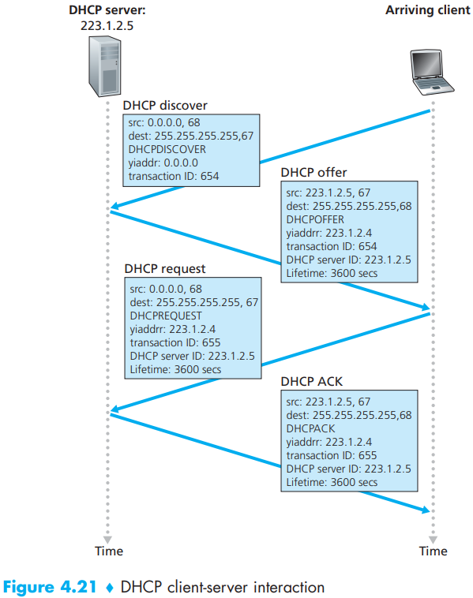

# DHCP Protocol

[TOC]

The `Dynamic Host Configuration Protocol (DHCP)` allows a host to obtain (be allocated) an IP address automatically.

*DHCP client-server interaction*

1. `DHCP server discovery`. The first task of a newly arriving host is to find a DHCP server with which to interact. This is done using a `DHCP discover message`, which a client sends within a UDP packet to port 67.
2. `DHCP server offer(s)`. A DHCP server receiving a DHCP discover message responds to the client with a `DHCP offer message` that is broadcast to all nodes on the subnet, again using the IP broadcast address of 255.255.255.255.
3. `DHCP request`. The newly arriving client will choose from among one or more server offers and  respond to its selected offer with a `DHCP request message`, echoing back the configuration parameters.
4. `DHCP ACK`. The server responds to the DHCP request message with a `DHCP ACK message`, confirming the requested parameters.

## Reference

[1] James F. Kurose, Keith W. Ross . Computer Networking: A Top-Down Approach . 6ED
