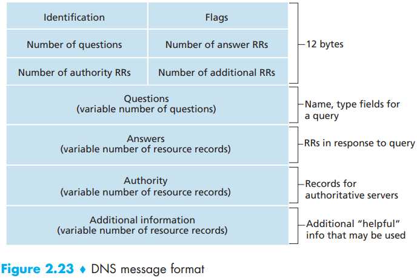
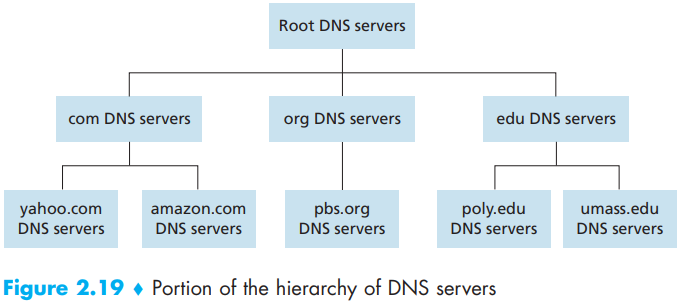

# DNS Protocol

[TOC]

The Domain Name System (DNS)` is :

1. A distributed database implemented in a hierarchy of `DNS servers`
2. An application-layer protocol that allows hosts to query the distributed database.

The DNS's main task is to provide a directory service that translates hostnames to IP addresses and performs other tasks:

- Host aliasing.
- Mail server aliasing.
- Load distribution.

## Message

- The first 12 bytes is the `header section`, which has a number of fields. The first field is a 16-bit number that identifies the query. This identifier is copied into the reply message to a query, allowing the client to match received replies with sent queries. There are a number of flags in the flag field. A 1-bit query/reply flag indicates whether the message is a query (0) or a reply (1). A 1-bit authoritative flag is set in a reply message when a DNS server is an authoritative server for a queried name. A 1-bit recursion-desired flag is set when a client (host or DNS server) desires that the DNS server perform recursion when it doesn't have the record A 1-bit recursion available field is set in a reply if the DNS server supports recursion. In the header, there are also four number-of fields. These fields indicate the number of occurrences of the four types of data sections that follow the header.
- The `question section` contains information about the query that is being made. This section includes:
  1. a name field that contains the name that is being queried.
  2. a type field that indicates the type of question being asked about the name.
- In a reply from a DNS server, the `answer section` contains the resource records for the name that was originally queried. Recall that in each resource record, there is the Type, the Value, and the TTL. A reply can return multiple RRs in the answer, since a hostname can have multiple IP addresses.
- The `authority section` contains records of other authoritative servers.
- The `additional section` contains other helpful records.

## DNS Serves

In order to deal with the issue of scale, the DNS uses a large number of servers, organized in a hierarchical fashion and distributed around the world. No single DNS server has all of the mappings for all of the hosts on the Internet. Instead, the mappings are distributed across the DNS servers. To a first approximation, there are three classes of DNS servers:

- Root DNS servers.
- Top-level domain (TLD) servers.
- Authoritative DNS servers.