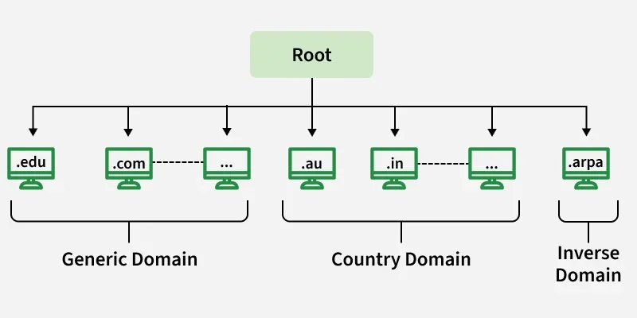
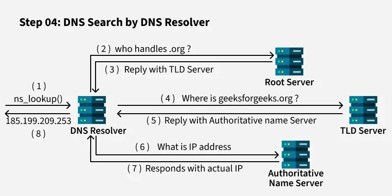
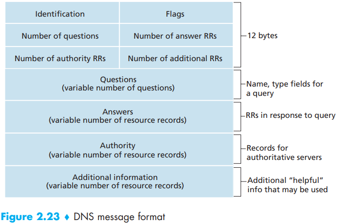
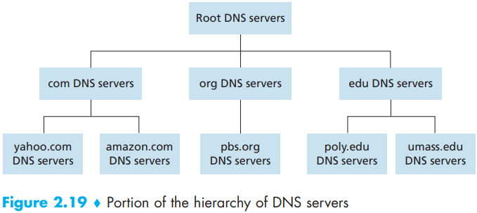

English | [中文版](dns_zh.md)

# Domain Name System (DNS)

[TOC]

## Intro

DNS is a distributed, hierarchical database and an application‑layer protocol that maps human‑friendly names (hostnames) to resource records (most commonly IP addresses). Beyond address resolution, DNS supports services such as mail exchanger records (MX), service discovery (SRV), and other name‑dependent configuration via resource records.

Key uses:

- Hostname → IP address (A/AAAA records).
- Service discovery and load distribution (SRV, multiple A records).
- Delegation of name space across administrators (zones).

## Types of Domain

### Generic Domains (gTLDs)

Thes domains are used for general purposes and are not tied to any country.

### Country Code Domains (ccTLDs)

These domains represent specific countries or geographic regions.

### Reverse DNS

These domains are used to map IP addresses back to domain names.

## Workflow

The DNS process can be broken down into several steps, ensuring that users can access websites by simply typing a domain name into their browser.

### DNS Resolver

Starts the DNS lookup process and acts as an intermediary between client and DNS server.

### Recursive Resolver

TODO

### Root Server

TODO

### TLD Server

TODO

### Authoritative Name Server

TODO

## DNS Queries

DNS queries are request mechanisms used during DNS lookup to obtain domain-related information from a DNS server.

### Recursive Query

The client expects a complete answer, and the resolver handles full lookup.

### Iterative Query

The server gives the best possible answer or a referral to another server.

### Non-Recursive Query

The server already has the required data and responds immediately.

## Message format and sections

DNS messages (queries and responses) have a fixed header followed by four sections: Question, Answer, Authority, and Additional. Important header fields:

- `ID (16 bits)`: query identifier used to match responses to queries.
- `Flags`: QR (query/response), Opcode, AA (authoritative answer), TC (truncated), RD (recursion desired), RA (recursion available), RCODE (response code).
- `Counts`: QDCOUNT, ANCOUNT, NSCOUNT, ARCOUNT indicate the number of entries in each section.

Sections:

- `Question section`: queried name, type (A, AAAA, MX, NS, CNAME, etc.), and class (IN for Internet).
- `Answer section`: resource records (RRs) that answer the question. Each RR contains (NAME, TYPE, CLASS, TTL, RDATA).
- `Authority section`: RRs pointing to authoritative name servers for the zone (NS records, SOA).
- `Additional section`: helpful RRs (e.g., A records for name servers listed in Authority) to reduce extra lookups.

Notes:

- A reply may contain multiple answers (e.g., multiple A records for load balancing).
- Truncation (TC) indicates the UDP response was too large; the client may retry over TCP.

## DNS Record Types

| **Record Type** | **Purpose**                         | **Example**                                                  |
| :-------------- | :---------------------------------- | :----------------------------------------------------------- |
| **A**           | IPv4 address                        | `example.com. 3600 IN A 93.184.216.34`                       |
| **AAAA**        | IPv6 address                        | `example.com. 3600 IN AAAA 2606:2800:220:1:248:1893:25c8:1946` |
| **CNAME**       | Canonical Name (alias)              | `www.example.com. IN CNAME example.com.`                     |
| **MX**          | Mail Exchange (email routing)       | `example.com. IN MX 10 mail.example.com.`                    |
| **TXT**         | Text data (SPF, verification)       | `example.com. IN TXT "v=spf1 include:_spf.google.com ~all"`  |
| **NS**          | Nameserver (authoritative servers)  | `example.com. IN NS ns1.example.com.`                        |
| **PTR**         | Reverse DNS (IP → domain)           | `34.216.184.93.in-addr.arpa. IN PTR example.com.`            |
| **SOA**         | Start of Authority (zone metadata)  | `example.com. IN SOA ns1.example.com. admin.example.com. ...` |
| **SRV**         | Service locator                     | `_sip._tcp.example.com. IN SRV 10 60 5060 sipserver.example.com.` |
| **CAA**         | Certificate Authority Authorization | `example.com. IN CAA 0 issue "letsencrypt.org"`              |

## Resolution process

There are two common resolution behaviors:

- Recursive resolution (usual for stub resolvers)

  the client asks a local resolver (often provided by the OS or ISP) to resolve a name; the resolver performs the necessary queries on behalf of the client until a final answer is found.

- Iterative (or non‑recursive) resolution

  a DNS server may reply with a referral to other name servers (e.g., root returns TLD servers), and the requester repeats queries toward those servers.

Typical flow for a resolver starting from the root:

1. Query root servers → get referral to TLD servers.
2. Query TLD servers → get referral to authoritative servers for the domain.
3. Query authoritative server → receive final answer (or referral / NXDOMAIN).

Caching at each step (with TTLs) reduces load and latency for repeated queries.

## Hierarchy, delegation, and servers

Server roles:

- Root servers: the global entry points for the DNS hierarchy; return referrals to TLD servers.
- TLD servers: manage top‑level domains (.com, .org, .cn, etc.) and delegate subdomains to authoritative servers.
- Authoritative servers: provide definitive answers for zones they host (primary/master and secondary/slave servers used for redundancy).

Delegation is performed using NS records at the parent zone and glue records (A/AAAA) when the name server's name is inside the delegated zone.

## DNS Caching and TTL(Time-to-Live)

Resolvers and authoritative servers cache records according to the TTL present in RRs. Lower TTLs reduce cache staleness but increase query load; higher TTLs reduce load but delay propagation of changes. Zone administrators choose TTLs based on update frequency and performance tradeoffs.

DNS uses caching at every level to reduce load and speed up responses:

| **Cache Level**            | **Duration**       | **Scope**           | **Controlled by**    |
| :------------------------- | :----------------- | :------------------ | :------------------- |
| **Browser**                | Seconds to minutes | Single browser      | Browser settings     |
| **OS**                     | Minutes to hours   | Entire machine      | OS, TTL from DNS     |
| **Router**                 | Variable           | Home/office network | Router configuration |
| **ISP Recursive Resolver** | Minutes to days    | All ISP customers   | ISP, DNS TTL         |
| **Root/TLD servers**       | Hours to days      | Global              | DNS protocol         |

## DNS Security and Attacks

### DNSSEC (DNS Security Extensions)

DNSSEC adds origin authentication and integrity for DNS data using digital signatures (RRSIG) and public keys (DNSKEY). DNSSEC prevents certain attacks such as cache poisoning by allowing resolvers to validate that records are authentic and unmodified. DNSSEC does not provide confidentiality.

### DNS Tunneling

DNS Tunneling is a type of Cyber Attack that encrypts data from other programs or protocols in DNS queries and responses.

## Operational notes and common issues

- UDP vs TCP: DNS primarily uses UDP for queries; large responses or zone transfers use TCP.
- Message size and EDNS(0): EDNS extends UDP payload size and adds features; large DNSSEC responses often require EDNS/TCP fallback.
- Glue records: required when an authoritative name server's name is inside the delegated child zone.
- Reverse DNS: PTR records map IP → name; usually managed separately by IP block owners.

Troubleshooting tips:

- Use dig or nslookup to query specific servers and inspect flags, answer/authority/additional sections, and TTLs.
- Check serial numbers in SOA to confirm zone propagation between master and slaves.
- Verify glue records when delegation causes resolution failures.
- Monitor for unusual NXDOMAIN or SERVFAIL responses and check DNSSEC validation errors when DNSSEC is enabled.

## References

[1] James F. Kurose and Keith W. Ross. Computer Networking: A Top‑Down Approach. 6th ed.

[2] [Domain Name System (DNS)](https://www.geeksforgeeks.org/computer-networks/domain-name-system-dns-in-application-layer/)

[3] [DNS Tunneling](https://www.geeksforgeeks.org/computer-networks/dns-tunneling/)
