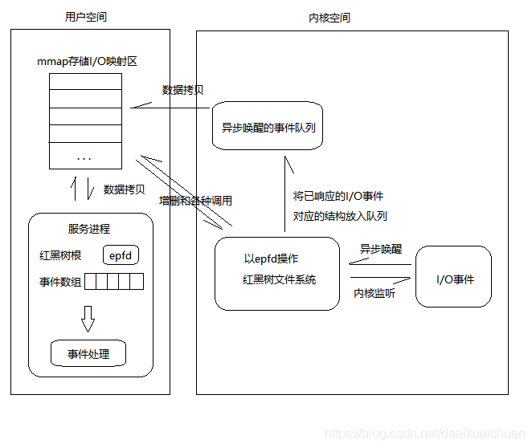

[TOC]

# epoll


## 定义

epoll相关函数的定义如下：

```c
int epoll_create(int size); // 创建epoll对象
int epoll_ctl(int epfd, int op, int fd, struct epoll_event *event); // 添加套接字
int epoll_wait(int epfd, struct epoll_event *events, int maxevents, int timeout); // 收集发生事件的连接
```


## 原理

### epoll_create

`epoll_create`的执行流程如下：

1. 在内核cache里建立了一个红黑树用于存储`epoll_ctl`传来的`socket`
2. 在内核cache建立一个`rdllist`双向链表（就序列表），用于存储准备就绪的事件

### epoll_wait

`epoll_wait`的执行流程如下：

1. 检测`rdllist`里面有没有数据，有数据就返回，没有数据就sleep，等到timeout时间到后即使链表没有数据也返回




## 触发模式

epoll触发模式

- LT（水平触发，默认模式）

  **只要有数据都会触发**，缓冲区剩余未读尽的数据会导致epoll_wait返回。

- ET（边缘触发，高速模式）

  **只有数据到来才触发**，**不管缓存区中是否还有数据**，缓冲区剩余未读尽的数据不会导致epoll_wait返回

