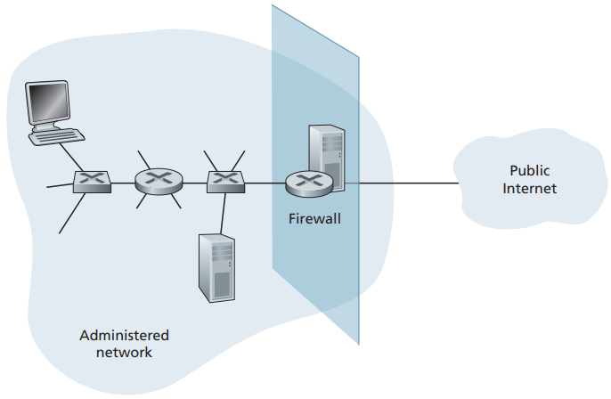
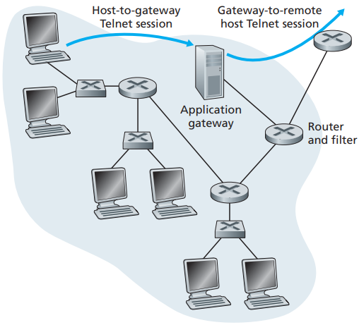

# Firewall

[TOC]

A firewall is a combination of hardware and software that isolates an organization’s internal network from the Internet at large, allowing some packets to pass and blocking others. A firewall allows a network administrator to control access between the outside world and resources within the administered network by managing the traffic flow to and from these resources. A firewall has three goals:

- All traffic from outside to inside, and vice versa, passes through the firewall.
- Only authorized traffic, as defined by the local security policy, will be allowed to pass.
- The firewall itself is immune to penetration.

*Firewall placement between the administered network and the outside world.*

*Firewall consisting of an application gateway and a filter*

## Category

Firewalls can be classified into three categories:

- traditional packet filters.

  Filtering decisions are typically based on:

  - IP source or destination address.
  - Protocol type in IP datagram field: TCP, UDP, ICMP, OSPF, and so on.
  - TCP or UDP source and destination port.
  - TCP flag bits: SYN, ACK, and so on.
  - ICMP message type.
  - Different rules for datagrams leaving and entering the network.
  - Different rules for the different router interfaces.

- stateful filters.

- application gateways.

## Reference

[1] James F. Kurose, Keith W. Ross . Computer Networking: A Top-Down Approach . 6ED