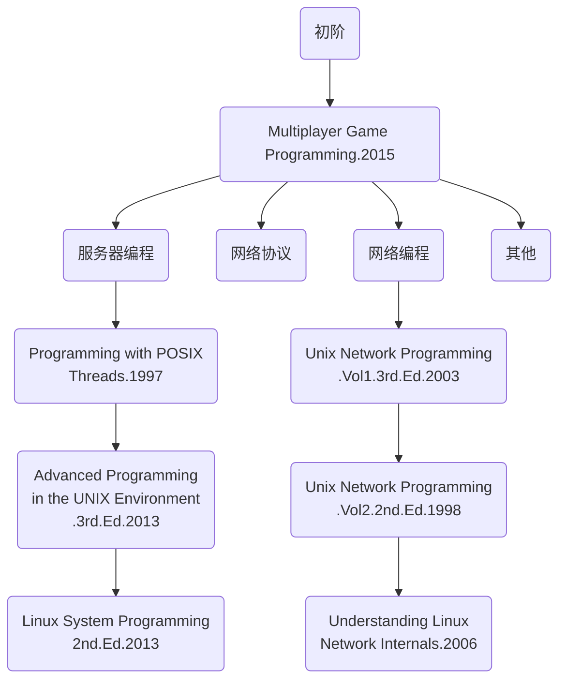

# 游戏服务器学习路线

```mermaid
graph TD
	A(初阶)
	A_1(Multiplayer Game Programming.2015)
	B(服务器编程)
	B_1(Programming with POSIX <br>Threads.1997)
	B_1_1(Advanced Programming <br>in the UNIX Environment<br>.3rd.Ed.2013)
	B_1_1_1(Linux System Programming <br>2nd.Ed.2013)
	C(网络协议)
	D(网络编程)
	D_1(Unix Network Programming<br>.Vol1.3rd.Ed.2003)
	D_1_1(Unix Network Programming<br>.Vol2.2nd.Ed.1998)
	D_1_1_1(Understanding Linux <br>Network Internals.2006)
	E(其他)
	
	A-->A_1
	A_1-->B-->B_1-->B_1_1-->B_1_1_1
	A_1-->C
	A_1-->D
	D-->D_1-->D_1_1-->D_1_1_1
	A_1-->E
```

## 参考

- [miloyip/game-programmer](https://github.com/miloyip/game-programmer)