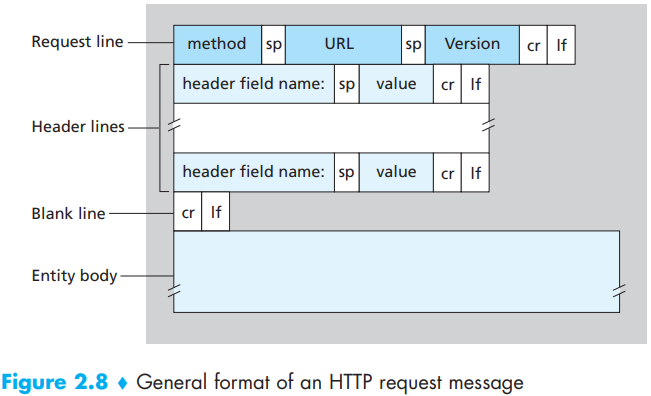
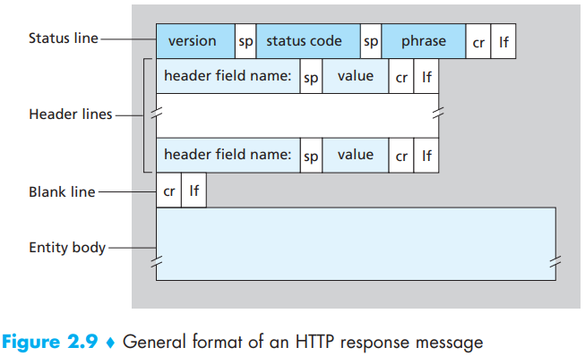
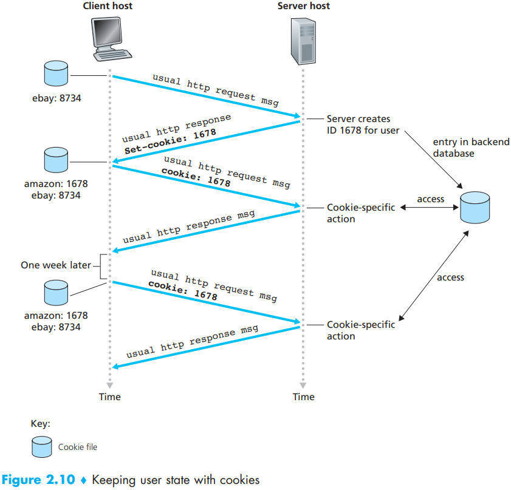

# HTTP / HTTPS

[TOC]

This note summarizes the HTTP protocol and its secure variant HTTPS: message formats, typical request/response fields, connection models (non‑persistent, persistent, pipelining, multiplexing), cookies and state, caching basics, common performance tradeoffs, and an overview of HTTPS/TLS. The content is adapted from Kurose & Ross (A Top‑Down Approach) and organized for practical clarity.

## HTTP message format

HTTP uses a simple textual message format transported over TCP (or TLS over TCP for HTTPS). Each message is either a request (from client to server) or a response (from server to client). A message has a start‑line, header fields, a blank line, and an optional message body.

### Request message

Start line: Method SP Request‑URI SP HTTP‑Version CRLF

Example (request):



```http
GET /hello.txt HTTP/1.1
Host: www.example.com
User-Agent: curl/7.16.3
Accept-Language: en,mi
Connection: keep-alive
...
```

Common methods: GET, POST, PUT, DELETE, HEAD, OPTIONS, PATCH. Use semantics correctly: GET for safe retrieval, POST for state changes, PUT for idempotent updates.

### Response message

Start line: HTTP‑Version SP Status‑Code SP Reason‑Phrase CRLF

Example (response):



```http
HTTP/1.1 200 OK
Date: Mon, 27 Jul 2009 12:28:53 GMT
Server: Apache
Last-Modified: Wed, 22 Jul 2009 19:15:56 GMT
ETag: "34aa387-d-1568eb00"
Accept-Ranges: bytes
Content-Length: 51
Content-Type: text/plain
...
```

Status codes are grouped by class: 1xx (informational), 2xx (success), 3xx (redirection), 4xx (client error), 5xx (server error). Use appropriate codes (e.g., 200 OK, 301/302 redirect, 404 Not Found, 500 Internal Server Error).

## Connections and performance

HTTP runs over TCP. How connections are used dramatically affects performance:

- Non‑persistent HTTP/1.0 (one TCP connection per object): simple but inefficient. Each object requires a TCP handshake (1 RTT) and teardown.
- Persistent connections (HTTP/1.1 default): a single TCP connection can carry multiple requests/responses, avoiding repeated handshakes and improving latency.
- Pipelining (HTTP/1.1): client can send multiple requests without waiting for responses, but responses must be returned in order; pipelining had limited adoption due to head‑of‑line blocking and implementation issues.
- Multiplexing (HTTP/2+): uses a single connection with multiple concurrent, interleaved streams, eliminating head‑of‑line blocking at the HTTP layer and enabling more efficient use of TCP.

Practical tips:

- Use persistent connections and connection pooling in clients.
- Prefer HTTP/2 or HTTP/3 (QUIC) for multiplexed transfers and lower latency on lossy links.
- Optimize number and size of objects (combine assets, use HTTP caching headers) to reduce round trips.

## Cookies and state management

HTTP itself is stateless. Cookies are the common mechanism to maintain state across requests. Key points:

- Server sets a cookie via the `Set-Cookie` header in responses. Browser sends cookie back in subsequent requests for matching domain/path.
- Cookie attributes: `Domain`, `Path`, `Expires`/`Max-Age`, `Secure` (only over HTTPS), `HttpOnly` (not accessible to JavaScript), `SameSite` (Lax/Strict/None) to mitigate CSRF.
- Implement session management carefully: store minimal sensitive state in cookies; use signed or encrypted session tokens; set `Secure` and `HttpOnly` for session cookies.



## Caching basics

HTTP caching reduces latency and server load. Important headers and concepts:

- `Cache-Control` (max-age, no-cache, no-store, public/private).
- `Expires` (legacy absolute expiry time).
- `ETag` and `If-None-Match` — entity tagging for conditional requests (304 Not Modified).
- `Last-Modified` and `If-Modified-Since` — simple conditional validation.

Design rules:

- Cache responses when safe (idempotent GET responses); avoid caching responses to authenticated requests unless explicitly safe.
- Use appropriate cache lifetimes and vary headers for content negotiation.

## Security: HTTPS and TLS (overview)

HTTPS is HTTP over TLS. TLS provides server authentication (via certificates), confidentiality, and integrity.

Essentials:

- TLS handshake establishes encrypted keys and authenticates the server. Clients validate server certificates against a trust store (CA roots).
- Use modern TLS versions (TLS 1.2+; prefer TLS 1.3) and strong cipher suites. Disable old versions (SSLv3, TLS 1.0/1.1).
- HSTS (HTTP Strict Transport Security) instructs browsers to always use HTTPS for a site.
- Secure cookie flags (`Secure`, `HttpOnly`, `SameSite`) reduce cookie-related attack surface.

Certificate management:

- Obtain certificates from trusted CAs (Let's Encrypt is common for automation).
- Monitor certificate expiration and use automation for renewal.

## Additional considerations

- Content negotiation: `Accept`, `Accept-Language`, `Accept-Encoding` headers let servers tailor responses (e.g., gzip compression).
- Range requests (`Range` header) support partial content for large objects and resume functionality (206 Partial Content).
- Redirects and canonical URLs: use 301/302 appropriately and serve consistent canonical URLs to improve caching and SEO.

## Modern evolutions: HTTP/2 and HTTP/3

- HTTP/2: binary framing, header compression (HPACK), multiplexed streams over one TCP connection — reduces latency and improves throughput.
- HTTP/3: runs over QUIC (UDP‑based transport) with integrated TLS and improved loss recovery and connection migration support.

## Common pitfalls and troubleshooting

- Mismatched host header or virtual host configuration can route requests to the wrong site; check `Host` header and server virtual host settings.
- Connection issues: check keep‑alive timeouts and connection pool exhaustion.
- Caching surprises: verify `Cache-Control`, `ETag`, and `Vary` headers when stale content is returned.
- TLS problems: use `openssl s_client` or `curl -v --tlsv1.3` to inspect handshake and certificates.

## References

- [1] James F. Kurose and Keith W. Ross. Computer Networking: A Top‑Down Approach. 6th ed.