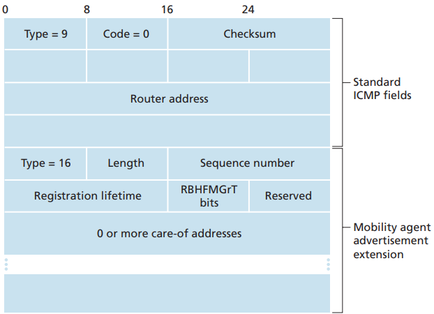

# ICMP

[TOC]

*ICMP router discovery message with mobility agent advertisement extension*

- `Home agent bit (H)`. Indicates that the agent is a home agent for the network in which it resides.
- `Foreign agent bit (F)`. Indicates that the agent is a foreign agent for the network in which it resides.
- `Registration required bit (R)`. Indicates that a mobile user in this network must register with a foreign agent. In particular, a mobile user cannot obtain a care-of address in the foreign network (for example, using DHCP) and assume the functionality of the foreign agent for itself, without registering with the foreign agent.
- `M, G encapsulation bits`. Indicate whether a form of encapsulation other than IP-in-IP encapsulation will be used.
- `Care-of address (COA) fields`. A list of one or more care-of addresses provided by the foreign agent. In our example below, the COA will be associated with the foreign agent, who will receive datagrams sent to the COA and then forward them to the appropriate mobile node. The mobile user will select one of these addresses as its COA when registering with its home agent.

## Reference

[1] James F. Kurose, Keith W. Ross . Computer Networking: A Top-Down Approach . 6ED