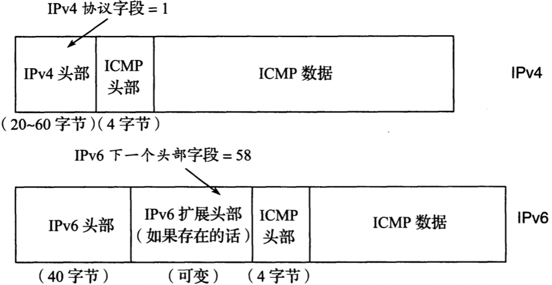
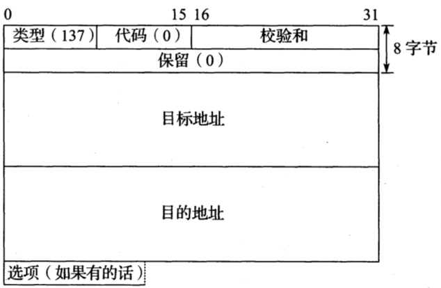
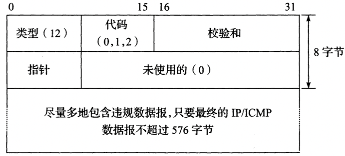
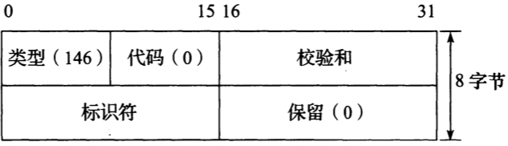
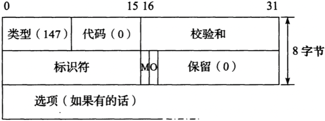
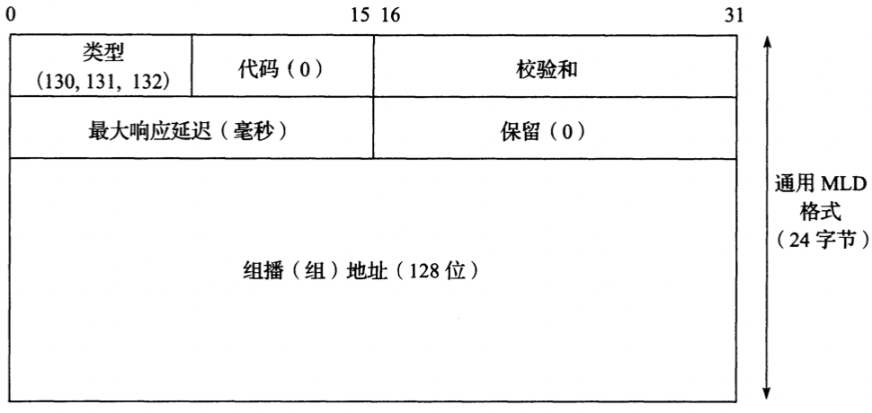
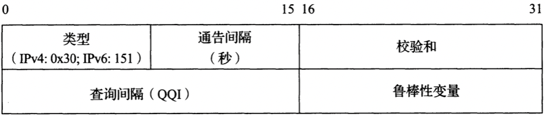

# Internet控制报文协议

<!-- vim-markdown-toc GFM -->

* [术语](#术语)
* [分类](#分类)
* [封装IP](#封装ip)
* [ICMP报文](#icmp报文)
* [扩展ICMP报文](#扩展icmp报文)
    - [目的不可达报文](#目的不可达报文)
    - [端口不可达报文](#端口不可达报文)
    - [包太大报文(PTB)](#包太大报文ptb)
    - [重定向报文](#重定向报文)
    - [ICMP超时报文](#icmp超时报文)
    - [参数问题报文](#参数问题报文)
    - [回显请求/应答报文](#回显请求应答报文)
    - [路由器发现报文](#路由器发现报文)
    - [移动前缀请求/通告报文](#移动前缀请求通告报文)
    - [移动IPv6快速切换报文](#移动ipv6快速切换报文)
    - [组播侦听查询/报告/完成](#组播侦听查询报告完成)
    - [版本2组播侦听发现报文](#版本2组播侦听发现报文)
    - [组播路由器发现报文](#组播路由器发现报文)
* [IPv6中的邻居发现](#ipv6中的邻居发现)
* [参考](#参考)

<!-- vim-markdown-toc -->

`Internet控制报文协议（Internet Control Message Protocol，ICMP）` 用于提供与IP协议层配置和IP数据包处理相关的诊断和控制信息。

## 术语

- 多协议标签交换（Multiprotocol Label Switching，MPLS）
- 路由器发现（Router Discovery）
- 最大响应时间（Maximum Response Time）
- 最大响应代码（Maximum Response Code）
- 查询器鲁棒性变量(Querier Robustness Variable，QRV)
- 查询器查询间隔代码(Querier's Query Interval Code，QQIC)

## 分类

ICMP报文可分为两大类：

- 有关IP数据报传递的ICMP报文（称为差错报文（error message））
- 有关信息采集和配置的ICMP报文（称为查询（query）或者信息类报文（informational message））

## 封装IP

## ICMP报文

- `类型`

  ICMPv4：

  | 类型       | 正式名称   | 参考      | E/I  | 用途/注释                  |
  | ---------- | ---------- | --------- | ---- | -------------------------- |
  | `0(*)`     | 回显应答   | [RFC0792] | I    | 回显（ping）应答，返回数据 |
  | `3(*)(+)`  | 目的不可达 | [RFC0792] | E    | 不可达的主机/协议          |
  | `4`        | 源端抑制   | [RFC0792] | E    | 标识拥塞（弃用）           |
  | `5(*)`     | 重定向     | [RFC0792] | E    | 标识应该被使用的可选路由器 |
  | `8(*)`     | 回显       | [RFC0792] | I    | 回显（ping）请求           |
  | `9`        | 路由器通告 | [RFC1256] | I    | 指示路由器地址/优先级      |
  | `10`       | 路由器请求 | [RFC1256] | I    | 请求路由器通告             |
  | `11(*)(+)` | 超时       | [RFC0792] | E    | 资源耗尽（例如IPv4 TTL）   |
  | `12(*)(+)` | 参数问题   | [RFC0792] | E    | 有问题的数据包或者头部     |

  ICMPv6：

  | 类型 | 代码 | 名称                   | 用途/注释                             |
  | ---- | ---- | ---------------------- | ------------------------------------- |
  | 1    | 0    | 没有目的地的路由       | 路由不存在                            |
  | 1    | 1    | 管理禁止               | 策略（例如防火墙）禁止                |
  | 1    | 2    | 超时源地址范围         | 目的范围超出源地址的范围              |
  | 1    | 3    | 地址不可达             | 当代码0~2并不合适时使用               |
  | 1    | 4    | 端口不可达             | 没有传输层实体在端口监听              |
  | 1    | 5    | 源地址失败策略         | 违反进/出策略                         |
  | 1    | 6    | 拒绝到目的地的路由     | 特定的拒绝到目的地的路由              |
  | 3    | 0    | 在传输中超过了跳数限制 | 跳数限制（Hop Limit）字段递减为0      |
  | 3    | 1    | 重组时间超时           | 在有限的时间内无法重组                |
  | 4    | 0    | 找到错误的头部字段     | 一般的头部处理错误                    |
  | 4    | 1    | 无法识别的下一个头部   | 未知的下一个头部（Next Header）字段值 |
  | 4    | 2    | 无法识别的IPv6选项     | 未知的“逐跳”或者“目的地”选项          |

- `代码`

  ICMPv4：

  | 类型    | 代码 | 正式名称                                | 用途/注释                                             |
  | ------- | ---- | --------------------------------------- | ----------------------------------------------------- |
  | `3`     | 0    | 网络不可达                              | （完全）没有路由到目的地                              |
  | `3(*)`  | 1    | 主机不可达                              | 已知但不可达的主机                                    |
  | `3`     | 2    | 协议不可达                              | 未知的（传输）协议                                    |
  | `3(*)`  | 3    | 端口不可达                              | 未知的/不用的（传输）端口                             |
  | `3(*)`  | 4    | 需要进行分片但设置了不分片位（PTB报文） | 需要设置分片但被DF位禁止了，被PMTUD[RFC1191]采用      |
  | `3`     | 5    | 源路由失败                              | 中间跳不可达                                          |
  | `3`     | 6    | 未知的目的网络                          | 弃用[RFC1812]                                         |
  | `3`     | 7    | 未知的目的主机                          | 目的不存在                                            |
  | `3`     | 8    | 源主机隔离                              | 弃用[RFC1812]                                         |
  | `3`     | 9    | 管理上禁止和目的网络                    | 弃用[RFC1812]                                         |
  | `3`     | 10   | 管理上禁止和目的主机通信                | 弃用[RFC1812]                                         |
  | `3`     | 11   | 目的网络不可达的服务类型                | 不可用的服务类型（网络）                              |
  | `3`     | 12   | 目的主机不可达的服务类型                | 不可用的服务类型（主机）                              |
  | `3`     | 13   | 管理禁止通信                            | 被过滤策略禁止的通信                                  |
  | `3`     | 14   | 违反主机优先级                          | src/dest/port不准许的优先级                           |
  | `3`     | 15   | 优先级终止生效                          | 在最小ToS之下[RFC1812]                                |
  | `5`     | 0    | 网络（或者子网）重定向数据报            | 指示一个可选的路由器                                  |
  | `5(*)`  | 1    | 主机重定向数据报                        | 指示一个可选的路由器（主机）                          |
  | `5`     | 2    | 服务类型和网络重定向数据报              | 指示一个可选的路由器（ToS/网络）                      |
  | `5`     | 3    | 服务类型和主机重定向数据报              | 指示一个可选的路由器（ToS/主机）                      |
  | `9`     | 0    | 正常路由器通告                          | 路由器的地址和配置信息                                |
  | `9`     | 16   | 不路由常见流量                          | 和移动IP[RFC5944]一起使用时，路由器不会路由普通数据包 |
  | `11(*)` | 0    | 在传输期间生存时间超时                  | 跳数限制/TTL超时                                      |
  | `11`    | 1    | 分片重组时间超时                        | 在重组计时器超时之前，并不是所有的数据报分片都到达了  |
  | `12(*)` | 0    | 指针指示差错                            | 字节偏移量（指针）指示第一个问题字段                  |
  | `12`    | 1    | 缺少一个必需的选项                      | 弃用/已成为历史                                       |
  | `12`    | 2    | 错误的长度                              | 数据包有无效的总长度（Total Length）字段              |

  ICMPv6：

  | 类型 | 代码 | 名称                   | 用途/注释                             |
  | ---- | ---- | ---------------------- | ------------------------------------- |
  | 1    | 0    | 没有目的地的路由       | 路由不存在                            |
  | 1    | 1    | 管理禁止               | 策略（例如防火墙）禁止                |
  | 1    | 2    | 超时源地址范围         | 目的范围超出源地址的范围              |
  | 1    | 3    | 地址不可达             | 当代码0~2并不合适时使用               |
  | 1    | 4    | 端口不可达             | 没有传输层实体在端口监听              |
  | 1    | 5    | 源地址失败策略         | 违反进/出策略                         |
  | 1    | 6    | 拒绝到目的地的路由     | 特定的拒绝到目的地的路由              |
  | 3    | 0    | 在传输中超过了跳数限制 | 跳数限制（Hop Limit）字段递减为0      |
  | 3    | 1    | 重组时间超时           | 在有限的时间内无法重组                |
  | 4    | 0    | 找到错误的头部字段     | 一般的头部处理错误                    |
  | 4    | 1    | 无法识别的下一个头部   | 未知的下一个头部（Next Header）字段值 |
  | 4    | 2    | 无法识别的IPv6选项     | 未知的“逐跳”或者“目的地”选项          |

- `校验和`

## 扩展ICMP报文

- `类型`

- `代码`

- `校验和`

- `有效载荷`

  为了兼容性，ICMP主要有效载荷区至少有128个字节。

### 目的不可达报文

*ICMPv4（左）和ICMPv6（右）的ICMP目的不可达报文*

### 端口不可达报文

*一个ICMPv4目的不可达-端口不可达差错报文，包含尽可能多的违规IPv4数据报，但总的IPv4数据报长度不能超过576字节。在这个例子中，有足够的空间包括整个TFTP请求报文*

### 包太大报文(PTB)

*ICMPv6的数据包太大报文（类型2）像ICMPv4的目的不可达报文一样工作。ICMPv6变体包含32比特用于保存下一跳的MTU*

### 重定向报文

*ICMPv4重定向报文在其有效负载部分中包含了数据报下一跳正确路由器的IPv4地址。一个主机通过检查到来的重定向报文的源IPv4地址来验证它是否来自当前正使用的默认路由器*

*ICMPv6重定向报文。目标地址字段指出了针对目的地址节点而言一个更好的下一跳路由器的IPv6地址。这个报文也能够用于指出目的地址和发出报文进而导致差错报文的节点是在同一个链路上的。在这种情况下，目的地址和目标地址是一样的*

### ICMP超时报文

*ICMPv4和ICMPv6的ICMP超时报文格式。当TTL或者跳数超出（代码0）或者分片重组的时间超过预先配置的阈值（代码1）时，便会产生该报文*

### 参数问题报文

*当没有其它报文可应用时便采用ICMPv4参数问题报文。指针字段指示了出错的IPv4头部中出问题的值的字节索引。代码0是为最常见的。代码1以前用于指示缺失了一个必需的选项，但现在已成为历史了。代码2指示出错的IPv4数据报存在一个错误的IHL或总长度（Total Length）字段*

*ICMPv6参数问题报文。指针字段给出了相对于发生错误的原始数据报的字节偏移。代码0表示一个出错的头部字段。代码1表示一个未识别的下一个头部类型，代码2表示出现了一个未知的IPv6选项*

### 回显请求/应答报文

*ICMPv4和ICMPv6回显请求和回显应答报文格式。请求中的任何可选数据都必须包含在应答中。NAT使用其中的标识符字段来匹配请求和应答*

### 路由器发现报文

*ICMPv4路由器通告报文包含了一个IPv4地址列表可用作下一跳的默认路由。优先水平允许网络操作人员为这个列表安排不同的的优先级（越高优先级越大）。移动IPv4[RFC5944]通过扩展增强了RA报文，目的是为了通告MIPv4移动代理以及被通告的路由器地址的前缀长度*

- `地址数（Number of Address）` 报文中路由地址块的个数
- `优先水平（preference level）` 
- `地址条目大小（Address Entry Size）` 每个块的32位字数
- `生命周期（Lifetime）` 地址列表被认为是有效的秒数

### 移动前缀请求/通告报文

*当一个移动节点离开去请求一个本地代理提供一个移动前缀通告时，便发送MIPv6移动前缀请求报文*

*MIPv6移动前缀通告报文。标识符字段值和请求中对应字段的值一致。M标志指示地址是由一个有状态配置机制提供的。O标志表示除了地址之外的其它信息是由有状态的机制提供的*

### 移动IPv6快速切换报文

*用于FMIPv6报文的通用ICMPv6报文类型。代码（Code）和子类型（Subtupe）字段给出了更深入的信息。请求报文使用代码0和子类型2，可能包含发送者的链路层地址和首选的下一个接入点链路层地址（如果知道的话）作为选项。通告使用代码0～5和子类型3。不同的代码值表示存在不同的选项，通告是否被请求了，前缀和路由消息是否已经改变，DHCP是否需要处理*

### 组播侦听查询/报告/完成

*ICMPv6 MLD版本1报文都是这种形式。查询（类型130）都是通用或者特定组播地址的。一般查询要求主机报告它们正在使用哪个组播地址，特定于地址的查询用于确定一个特定的地址是否（仍然）在使用。最大的响应时间是主机可能延迟发送响应查询报文的最大毫秒数。对于一般的查询和针对特定报告查询的组播地址，其目的组播地址为0。对于报告（类型131）和完成报文（类型132），它将分别包含和报告相关的地址或者不再感兴趣的地址*

### 版本2组播侦听发现报文

*MLDv2查询报文格式，它与MLD版本1报文通用格式兼容，最大的区别是能够从主机感兴趣列表中限制或者剔除特定的组播源*

### 组播路由器发现报文

*MRD的通告报文（ICMPv6类型151；IGMP类型48）包含说明多长时间发送主动通告的通告时间间隔（秒），发送者的查询间隔（QQI）和MLD定义的鲁棒性变量。发送者的IP地址就是用来指示接收者能够转发组播流量的路由器。该报文被发送到所有侦听者的组播地址（IPv4,224.0.0.106;IPv6,ff02::6a）*

*ICMPv6 MRD请求（ICMPv6类型152；IGMP类型49）和终止（ICMPv6类型153；IGMP类型50）报文使用相同的格式。MRD报文将IPv6跳数限制字段或者IPv4TTL字段值设置为1，并包含路由器警告选项。请求被发送到所有路由器的组播地址（IPv4, 224.0.0.2; IPv6, ff02::2）*

## IPv6中的邻居发现

TODO

## 参考

[1] [美] Kevin R. Fall, [美] W. Richard Stevens.Tcp/ip详解.3ED
