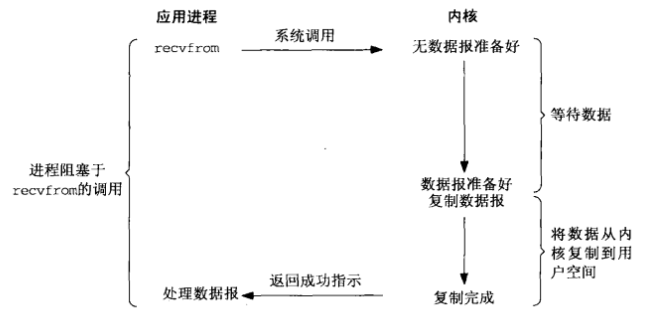
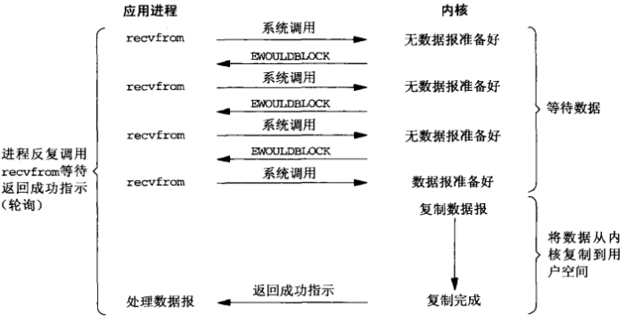
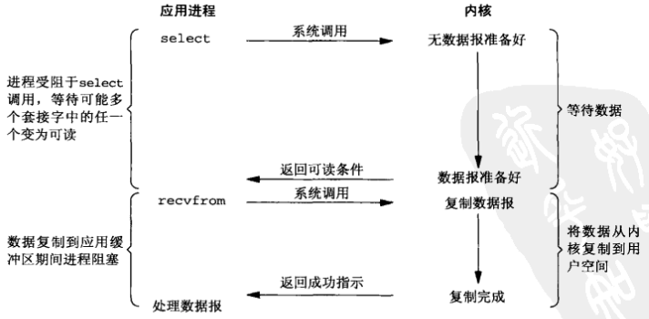
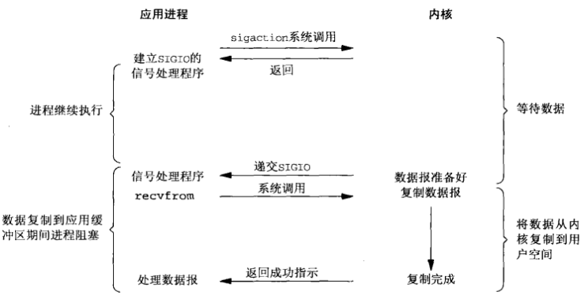
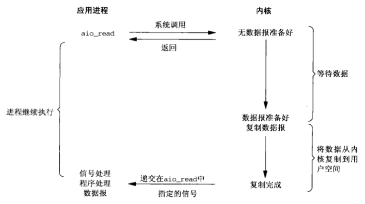
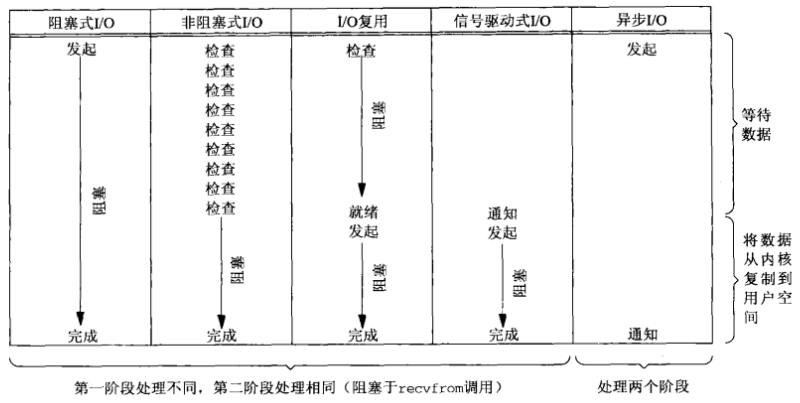
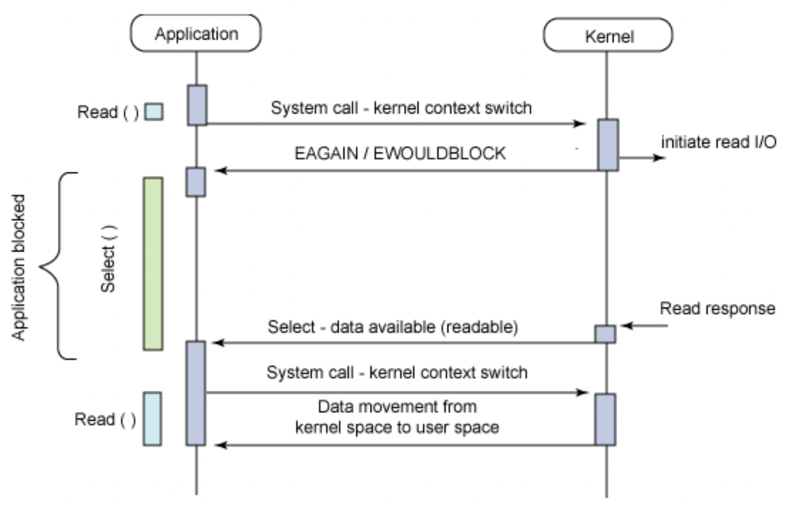

# 网络I/O

[TOC]


## I/O模型

### 阻塞式I/O

`阻塞式I/O（blocking I/O）`在I/O执行的两个阶段都被阻塞了



### 非阻塞式I/O

`非阻塞式I/O（nonblocking I/O）`用户进程不断的主动询问kernel数据是否准备好



### I/O复用

`I/O复用（I/O multiplexing，select和poll）`内核一旦发现进程指定的一个或者多个IO条件准备读取，它就通知该进程。



### 信号驱动式I/O

`信号驱动式I/O（signal driven I/O，SIGIO）`信号驱动用户进程读写，不需要用户不断轮询kernel。



### 异步I/O

`异步I/O（asynchronous I/O）`



前4种模型的主要区别在于第一阶段，因为他们的第二阶段是一样的：在数据从内核复制到调用者的缓冲区期间，进程阻塞于recvfrom调用。相反，异步`I/O`模型在这两个阶段都要处理，从而不同于其他4种模型。

### 同步I/O和异步I/O对比

- 同步`I/O`操作（synchronous I/O opetation）导致请求进程阻塞，直到`I/O`操作完成。
- 异步`I/O`操作（asynchronous I/O opetation）不导致请求进程阻塞。



### I/O模型对比

TODO

---


## 多路复用

### select

```c
#include <sys/select.h>
int select(int maxfdp1, fd_set *readset, fd_set *writeset, fd_set *exceptset, const struct timeval *timeout)
```

- `maxfdp1`指定待测试的描述符最大值+1
- `readset` 让内核测试读描述符
- `writeset`让内核测试写描述符
- `exceptset`让内核测试异常描述符
- `timeout`：超时时间（精确度10ms左右）
  
  `空` 永远等待下去
  
  `非空`等待一段固定时间
  
  `0` 根本不等待
- `返回值`
  
  描述符数量：有就绪描述符
  
  0：超时
  
  -1：出错

允许进程指示内核等待多个事件中的任何一个发生，并只在有一个或多个时间发生或经历一段指定的时间后才唤醒它。

目前支持的异常条件只有两个：

- 某个套接字的带外数据的到达
- 某个已置为分组模式的伪终端存在可从其主端读取的控制状态信息

设置fd的常用函数：

```c
void FD_ZERO(fd_set *fdset);
void FD_SET(int fd, fd_set *fdset);
void FD_CLR(int fd, fd_set *fdset);
int	 FD_ISSET(int fd, fd_set *fdset);
```

#### 描述符就绪条件

套接字准备好读的条件（满足其一即可）：

- 接收缓冲区中的数据字节数大于等于套接字接收缓冲区低水位标记的当前大小
- 连接的读半部关闭（也就是接收了FIN的TCP连接）。对这样的套接字的读操作将不阻塞并返回0（也就是返回EOF）
- 是一个监听套接字且已完成的连接数不为0
- 其上有一个套接字错误待处理

套接字准备好写的条件（满足其一即可）：

- 发送缓冲区中的可用空间字节数大于等于发送缓冲区低水位标记的当前大小，并且或者该套接字已连接，或者该套接字不需要连接（如UDP套接字）
- 该连接的写半部关闭
- 使用非阻塞connect的套接字已建立连接，或者connect已经以失败告终
- 其上有一个套接字错误待处理

如果一个套接字春在带外数据或者仍处于带外标记，那么它有异常条件待处理。

**注意：当某个套接字上发生错误时，它将由select标记为即可读又可写。**

任何UDP套接字只要其发送低水位标记小于等于发送缓冲区大小（默认应该总是这种关系）就总是可写的，这是因为UDP套接字不需要连接。

select返回某个套接字就绪的条件：

| 条件                                                       | 可读？      | 可写？ | 异常？ |
| ---------------------------------------------------------- | ----------- | ------ | ------ |
| 有数据可读<br>关闭连接的读一半<br>给监听套接口准备好新连接 | Y<br>Y<br>Y |        |        |
| 有可用于写的空间<br>关闭连接的写一半                       |             | Y<br>Y |        |
| 待处理错误                                                 | Y           | Y      |        |
| TCP带外数据                                                |             |        | Y      |

#### select的最大描述符数

select的最大描述符数定义在`<sys/types.h>`或`<sys/select.h>`中:

```c
#ifndef FD_SETSIZE
#define FD_SETSIZE 256
#endif
```

#### 运行机制



#### 缺点

- 每次调用`select`都需要把`fd_set`从用户态拷贝到内核，开销大
- 同时每次调用`select`都需要在内核遍历传递进来的所有`fd_set`，开销大
- select支持的文件描述符数量太小了


### poll

```c
#include <poll.h>
int poll(struct pollfd *fdarray, unsigned long nfds, int timeout)
```

- `fdarray`指向一个pollfd数组

  ```c
  struct pollfd {
  	int 		fd;
  	short 	events;		// 要测试的描述符
  	short 	revents;	// 返回的描述符的状态
  }
  ```


  poll函数的输入events和返回revents：

  | 常值                                          | 作为events的输入吗？ | 作为revents的结果吗？ | 说明                                                         |
  | --------------------------------------------- | -------------------- | --------------------- | ------------------------------------------------------------ |
  | POLLIN<br>POLLRDNORM<br>POLLRDBAND<br>POLLPRI | Y<br>Y<br>Y<br>Y     | Y<br>Y<br>Y<br>Y      | 普通或优先级带数据可读<br>普通数据可读<br>优先级带数据可读<br>高优先级数据可读 |
  | POLLOUT<br>POLLWRNORM<br>POLLWRBAND           | Y<br>Y<br>Y          | Y<br>Y<br>Y           | 普通数据可写<br>普通数据可写<br>优先级带数据可写             |
  | POLLERR<br>POLLHUP<br>POLLNVAL                |                      | Y<br>Y<br>Y           | 发生错误<br>发生挂起<br>描述符不是一个打开的文件             |

- `nfds`

- `timeout`
  - `INFTIM` 永远等待（POSIX规范要求在头文件`<poll.h>`中定义INFTIM，不过许多系统仍然把它定义在头文件`<sys/stropts.h>`中）
  - `0` 立即返回，不阻塞进程
  - `>0` 等待指定数目的毫秒数

- 返回值

  - `-1` 发生错误
  - `0` 定时器到时之前没有任何描述符就绪
  - `就绪描述符个数` 成功

poll的机制与select类似，与select在本质上没有多大差别，管理多个描述符也是进行轮询，根据描述符的状态进行处理，但是poll没有最大文件描述符数量的限制。

poll改变了文件描述符集合的描述方式，使用了`pollfd`结构而不是select的`fd_set`结构，使得poll支持的文件描述符集合限制远大于select的1024

就TCP和UDP套接字而言，以下条件引起poll返回特定的revent:

- 所有正规TCP数据和所有UDP数据都被认为是普通数据
- TCP的带外数据被认为是优先级带数据
- 当TCP连接的读半部关闭时，也被认为是普通数据，随后的读操作将返回0
- TCP连接存在错误即可认为是普通数据，也可认为是错误（POLLERR）。无论哪种情况，随后的读操作将返回-1，并把errno设置成合适的值。这可用于处理诸如接收到RST或发生超时等条件。
- 在监听套接字上有新的连接可用即可认为是普通数据，也可认为是优先级数据。大多数实现视之为普通数据。
- 非阻塞式connect的完成被认为是使相应套接字可写。

#### 缺点

- 每次调用`pool`都需要把`pollfd`从用户态拷贝到内核，开销大
- 同时每次调用`pool`都需要在内核遍历传递进来的所有`pollfd`，开销大


### epoll

epoll是linux内核的可扩展`I/O`事件通知机制，于linux 2.5.44首次登场，基于**事件驱动的I/O方式**，是之前的`select`和`poll`的增强版本。

#### epoll_create

```c
#include <sys/epoll.h>
int epoll_create(int size);
```

- size 无意义，兼容以前的代码

创建epoll对象，流程如下：

1. 在内核cache里建立了一个红黑树用于存储`epoll_ctl`传来的`socket`；
2. 在内核cache建立一个`rdllist`双向链表（就序列表），用于存储准备就绪的事件。

#### poll_ctl

```c
#include <sys/epoll.h>
int epoll_ctl(int epfd, int op, int fd, struct epoll_event *event);
```

- `epfd` epoll句柄

- `op` 操作

  - `EPOLL_CTL_ADD` 添加事件
  - `EPOLL_CTL_MOD` 修改监听的事件
  - `EPOLL_CTL_DEL` 删除监听的事件

- `fd` 套接字

- `event` 事件

  | 事件         | 说明                                          |
  | ------------ | --------------------------------------------- |
  | EPOLLIN      | 描述符处于可读状态                            |
  | EPOLLOUT     | 描述符处于可写状态                            |
  | EPOLLET      | 将`epoll event`通知模式设置成`edge triggered` |
  | EPOLLONESHOT | 第一次进行通知，之后不在监测                  |
  | EPOLLHUP     | 本段描述符产生一个挂断事件，默认监测事件      |
  | EPOLLRDHUP   | 对端描述符产生一个挂断事件                    |
  | EPOLLPRI     | 由带外数据触发                                |
  | EPOLLERR     | 描述符产生错误时触发，默认监测事件            |

向epfd对应的内核`epoll`实例添加，修改或删除对fd上事件event的监听。

#### epoll_wait

```c++
#include <sys/epoll.h>
int epoll_wait(int epfd, struct epoll_event *events, int maxevents, int timeout);
```

- `epfd` epoll句柄
- `events` 用来记录被触发的events，其大小应该和maxevents一致
- `maxevents` 返回的events的最大个数
- `timeout` 超时时间（ms）
  - `0`  立即返回
  - `-1` 一直阻塞到已注册的事件变为就绪
  - `>0` 阻塞直到时间结束或已注册的时间变为就绪

检测有没有数据，有数据就返回，没有数据就`sleep`，等到`timeout`时间到后返回，示意图如下：


| 触发模式 | 说明                                                         |
| -------- | ------------------------------------------------------------ |
| LT       | `（Level Triggered，水平触发）`默认模式，**只要有数据都会触发**，缓冲区剩余未读尽的数据会导致epoll_wait返回。 |
| ET       | `（Edge Triggered，边缘触发）` 高速模式，**只有数据到来才触发**，**不管缓存区中是否还有数据**，缓冲区剩余未读尽的数据不会导致epoll_wait返回。Nginx用的ET，在以下情况推荐使用ET：<br>  1.`read`或`write`系统调用返回`EAGAIN`<br>  2.非阻塞的文件描述符 |

相对于`select`和`poll`来说，`epoll`没有描述符限制。`epoll`使用一个文件描述符管理多个描述符，将用户关系的文件描述符的事件存放到内核的一个事件表中，这样在用户空间和内核空间的copy只需一次。

#### 用例

服务端：

```c
#include <stdio.h>
#include <unistd.h>
#include <stdlib.h>
#include <string.h>
#include <sys/types.h>
#include <errno.h>
#include <sys/socket.h>
#include <netinet/in.h>
#include <sys/epoll.h>
#include <fcntl.h>
#include <sys/resource.h>

#define MAXEPOLL 10000
#define MAXLINE  1024
#define PORT 		 6000
#define MAXBACK  1000

int setnonblocking(int fd)
{
  if(fcntl(fd, F_SETFL, fcntl(fd, F_GETFD, 0)|O_NONBLOCK) == -1)
  {
    printf("Set blocking error:%d\n", errno);
    return -1;
  }
  return 0;
}

int main(int argc, char** argv)
{
  int listen_fd;
  int conn_fd;
  int epoll_fd;
  int nread;
  int cur_fds;
  int wait_fds;
  int i;
  struct sockaddr_in servaddr;
  struct sockaddr_in cliaddr;
  struct epoll_event ev; 						// 注意这里
  struct epoll_event evs[MAXEPOLL]; // 注意注意
  struct rlimit rlt; 								// 设置连接数
  char buf[MAXLINE];
  socklen_t len = sizeof(struct sockaddr_in);
  
  // 设置每个进程允许打开的最大文件数
  rlt.rlim_max = rlt.rlim_cur = MAXEPOLL;
  if(setrlimit(RLIMIT_NOFILE, &rlt) == -1)
  {
    printf("Setrlimit Error : %d\n", errno);
    exit(EXIT_FAILURE);
  }
  
  // 建立套接字
  bzero(&servaddr, sizeof(servaddr));
  servaddr.sin_family = AF_INET;
  servaddr.sin_addr.s_addr = htonl(INADDR_ANY);
  servaddr.sin_port = htons(PORT);
  if((listen_fd = socket(AF_INET, SOCK_STREAM, 0)) == -1)
  {
    printf("Socket Error...\n", errno);
    exit(EXIT_FAILURE);
  }
  
  // 设置非阻塞模式
  if(setnonblocking(listen_fd) == -1)
  {
    printf("Setnonblocking Error:%d\n", errno);
    exit(EXIT_FAILURE);
  }
  
  // 绑定
  if(bind(listen_fd, (struct sockaddr*)&servaddr, sizeof(struct sockaddr)) == -1)
  {
    printf("Bind Error : %d\n", errno);
    exit(EXIT_FAILURE);
  }
  
  // 监听
  if(listen(listen_fd, MAXBACK) == -1)
  {
    printf("Listen Error : %d\n", errno);
    exit(EXIT_FAILURE);
  }
  
  // epoll操作（重点！！！）
  epoll_fd = epoll_create(MAXEPOLL);
  ev.events = EPOLLIN | EPOLLET;
  ev.data.fd = listen_fd; // 加入listen_fd
  if(epoll_ctl(epoll_fd, EPOLL_CTL_ADD, listen_fd, &ev) < 0)
  {
    printf("Epoll Error : %d\n", errno);
    exit(EXIT_FAILURE);
  }
  cur_fds = 1;
  
  // 监听epoll事件
  while(1)
  {
    if((wait_fds = epoll_wait(epoll_fd, evs, cur_fds, -1)) == -1)
    {
      printf("Epoll Wait Error : %d\n", errno);
      exit(EXIT_FAILURE);
    }
    for(i = 0; i < wait_fds; i++)
    {
      if(evs[i].data.fd == listen_fd && cur_fds < MAXEPOLL)
      {
        if((conn_fd = accept(listen_fd, (struct sockaddr *)&cliaddr, &len)) == -1)
        {
          printf("Accept Error : %d\n", errno);
          exit(EXIT_FAILURE);
        }
        printf("Server get from client!\n");
        
        ev.events = EPOLLIN | EPOLLET; // 边缘触发，高速模式
        ev.data.fd = conn_fd; 				 // 放入连接描述符
        if(epoll_ctl(epoll_fd, EPOLL_CTL_ADD, conn_fd, &ev) < 0) // 添加事件
        {
          printf("Epoll Error : %d\n", errno);
          exit(EXIT_FAILURE);
        }
        ++cur_fds; // 文件描述符数+1
        continue;
      }
      // 读数据
      nread = read(evs[i].data.fd, buf, sizeof(buf));
      if(nread <= 0)
      {
        close(evs[i].data.fd);
        epoll_ctl(epoll_fd, EPOLL_CTL_DEL, evs[i].data.fd, &ev); // 读取失败，删除事件
        --cur_fds;
        continue;
      }
      // 写数据
      write(evs[i].data.fd, buf, nread);
    }
  }
  close(listen_fd); // 关闭监听
  return 0;
}
```

客户端：

```c
#include <stdio.h>
#include <unistd.h>
#include <stdlib.h>
#include <string.h>
#include <errno.h>
#include <netinet/in.h>
#include <sys/types.h>
#include <sys/socket.h>
#include <arpa/inet.h>
#include <sys/select.h>

#define MAXLINE 	1024
#define SERV_PORT 6000

void send_and_recv(int connfd)
{
  FILE* fp = stdin;
  int lens;
  char send[MAXLINE];
  char recv[MAXLINE];
  fd_set rset;
  FD_ZERO(&rset);
  int maxfd = (fileno(fp) > connfd ? fileno(fp) : connfd + 1);
  int n;
  
  while(1)
  {
    FD_SET(fileno(fp), &rset);
    FD_SET(connfd, &rset);
    if(select(maxfd, &rset, NULL, NULL, NULL) == -1)
    {
      printf("Client Select Error..\n");
      exit(EXIT_FAILURE);
    }
    
    // 连接端口有信息
    if(FD_ISSET(connfd, &rset))
    {
      printf("client get from server...\n");
      memset(recv, 0, sizeof(recv));
      n = read(connfd, recv, MAXLINE);
      if(n == 0)
      {
        printf("Recv ok...\n");
        break;
      }
      else if(n == -1)
      {
        printf("Recv error...\n");
        break;
      }
      else
      {
        lens = strlen(recv);
        recv[lens] = '\0';
        write(STDOUT_FILENO, recv, MAXLINE);
        printf("\n");
      }
    }
    
    if(FD_ISSET(fileno(fp), &rset))
    {
      memset(send, 0, sizeof(send));
      if(fgets(send, MAXLINE, fp) == NULL)
      {
        printf("End...\n");
        exit(EXIT_FAILURE);
      }
      else
      {
        lens = strlen(send);
        send[lens-1] = '\0'; // 不要回车字符
        if(strcmp(send, "q") == 0)
        {
          printf("Bye..\n");
          return;
        }
        printf("Client send : %s\n", send);
        write(connfd, send, strlen(send));
      }
    }
  }
}

int main(int argc, char** argv)
{
  char buf[MAXLINE];
  int connfd;
  struct sockaddr_in servaddr;
  
  if(argc != 2)
  {
    printf("Input server ip!\n");
    exit(EXIT_FAILURE);
  }
  
  // 建立套接字
  if((connfd = socket(AF_INET, SOCK_STREAM, 0)) == -1)
  {
    printf("Socket Error...\n", errno);
    exit(EXIT_FAILURE);
  }
  
  // 套接字信息
  bzero(&servaddr, sizeof(servaddr));
  servaddr.sin_family = AF_INET;
  servaddr.sin_port = htons(SERV_PORT);
  inet_pton(AF_INET, argv[1], &servaddr.sin_addr);
  
  // 链接server
  if(connect(connfd, (struct sockaddr*)&servaddr, sizeof(servaddr)) < 0)
  {
    printf("Connect error..\n");
    exit(EXIT_FAILURE);
  }
  
  send_and_recv(connfd);
  close(connfd);
  printf("Exit\n");
  return 0;
}
```

---


## 总结

### 多路复用对比

|            |                       select                       |                       poll                       |                            epoll                             |
| :--------- | :------------------------------------------------: | :----------------------------------------------: | :----------------------------------------------------------: |
| 操作方式   |                        遍历                        |                       遍历                       |                             回调                             |
| 底层实现   |                        数组                        |                       链表                       |                            红黑树                            |
| IO效率     |      每次调用都进行线性遍历，时间复杂度为O(n)      |     每次调用都进行线性遍历，时间复杂度为O(n)     | 事件通知方式，每当fd就绪，系统注册的回调函数就会被调用，将就绪fd放到readyList里面，时间复杂度O(1) |
| 最大连接数 |              1024（x86）或2048（x64）              |                      无上限                      |                            无上限                            |
| fd拷贝     | 每次调用select，都需要把fd集合从用户态拷贝到内核态 | 每次调用poll，都需要把fd集合从用户态拷贝到内核态 |  调用epoll_ctl时拷贝进内核并保存，之后每次epoll_wait不拷贝   |

---


## 参考

- [维基百科-epoll](https://zh.wikipedia.org/wiki/Epoll)
- [select、poll、epoll之间的区别总结[整理]](https://www.cnblogs.com/Anker/p/3265058.html)
- [IO多路复用的三种机制Select，Poll，Epoll](https://www.jianshu.com/p/397449cadc9a)
- [作为C++程序员，应该彻底搞懂epoll高效运行的原理](https://zhuanlan.zhihu.com/p/159135478)
- [IO多路复用到底是不是异步的？](https://www.zhihu.com/question/59975081/answer/1932776593?utm_source=wechat_session&utm_medium=social&utm_oi=974639756117843968&utm_content=group3_Answer&utm_campaign=shareopn)

