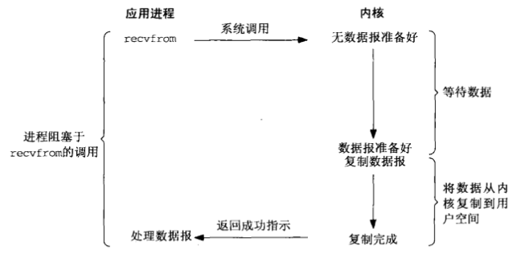
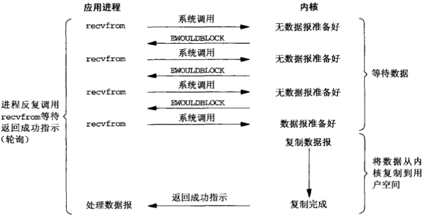
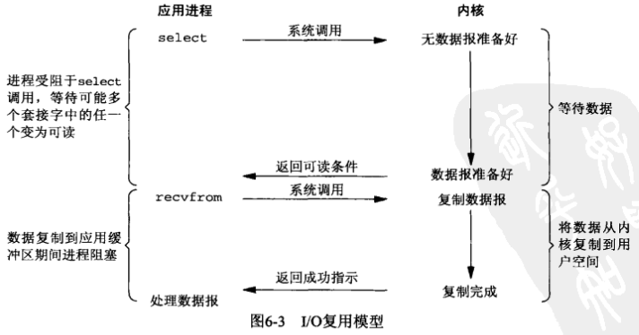
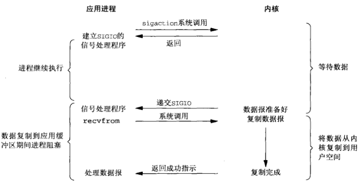
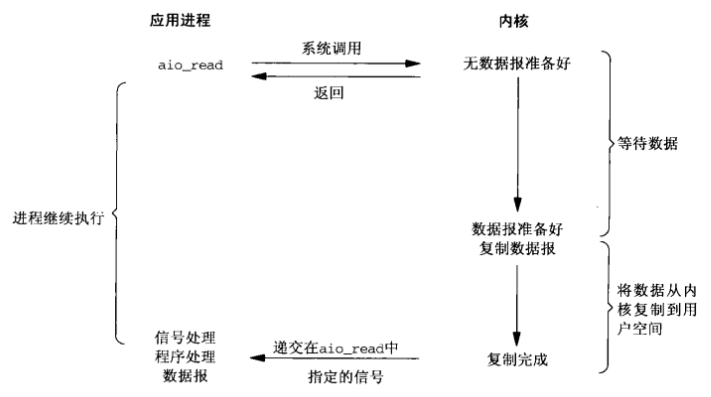
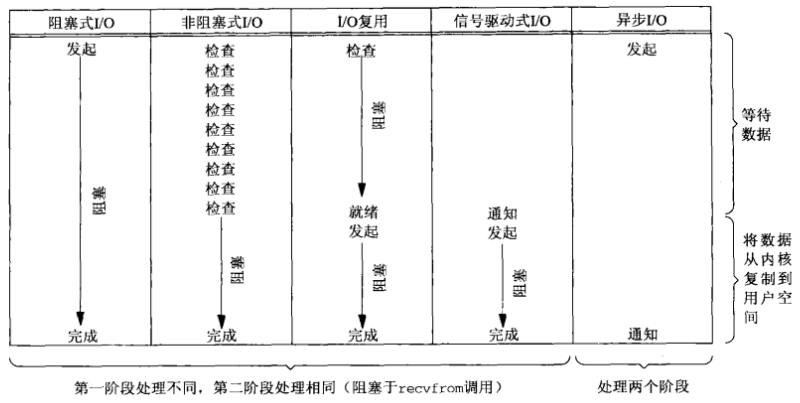

# IO

## I/O模型

Unix下可用的5种I/O模型：

- 阻塞式I/O

    blocking I/O，在I/O执行的两个阶段都被阻塞了

    

- 非阻塞式I/O

    nonblocking I/O，用户进程不断的主动询问kernel数据是否准备好

    

- I/O复用（select和poll）

    I/O multiplexing，内核一旦发现进程指定的一个或者多个IO条件准备读取，它就通知该进程。

    

- 信号驱动式I/O（SIGIO）

    signal driven I/O，信号驱动用户进程读写，不需要用户不断轮询kernel。

    

- 异步I/O

    asynchronous I/O，
    
    

前4种模型的主要区别在于第一阶段，因为他们的第二阶段是一样的：在数据从内核复制到调用者的缓冲区期间，进程阻塞于recvfrom调用。相反，异步`I/O`模型在这两个阶段都要处理，从而不同于其他4种模型。

### 同步I/O和异步I/O对比

- 同步`I/O`操作（synchronous I/O opetation）导致请求进程阻塞，直到`I/O`操作完成。
- 异步`I/O`操作（asynchronous I/O opetation）不导致请求进程阻塞。

## select

select的最大描述符数定义在`<sys/types.h>`或`<sys/select.h>`中，一般为1024。

### 运行机制

### 缺点

- 每次调用`select`都需要把`fd_set`从用户态拷贝到内核，开销大
- 同时每次调用`select`都需要在内核遍历传递进来的所有`fd_set`，开销大
- select支持的文件描述符数量太小了

## poll

poll的机制与select类似，与select在本质上没有多大差别，管理多个描述符也是进行轮询，根据描述符的状态进行处理，但是poll没有最大文件描述符数量的限制。

poll改变了文件描述符集合的描述方式，使用了`pollfd`结构而不是select的`fd_set`结构，使得poll支持的文件描述符集合限制远大于select的1024

### 缺点

- 每次调用`pool`都需要把`pollfd`从用户态拷贝到内核，开销大
- 同时每次调用`pool`都需要在内核遍历传递进来的所有`pollfd`，开销大

## epoll

`epoll`是在2.6内核中提出的，基于**事件驱动的I/O方式**，是之前的`select`和`poll`的增强版本。

相对于`select`和`poll`来说，`epoll`没有描述符限制。`epoll`使用一个文件描述符管理多个描述符，将用户关系的文件描述符的事件存放到内核的一个事件表中，这样在用户空间和内核空间的copy只需一次。

## 总结

|            |                       select                       |                       poll                       |                            epoll                             |
| :--------- | :------------------------------------------------: | :----------------------------------------------: | :----------------------------------------------------------: |
| 操作方式   |                        遍历                        |                       遍历                       |                             回调                             |
| 底层实现   |                        数组                        |                       链表                       |                            红黑树                            |
| IO效率     |      每次调用都进行线性遍历，时间复杂度为O(n)      |     每次调用都进行线性遍历，时间复杂度为O(n)     | 事件通知方式，每当fd就绪，系统注册的回调函数就会被调用，将就绪fd放到readyList里面，时间复杂度O(1) |
| 最大连接数 |              1024（x86）或2048（x64）              |                      无上限                      |                            无上限                            |
| fd拷贝     | 每次调用select，都需要把fd集合从用户态拷贝到内核态 | 每次调用poll，都需要把fd集合从用户态拷贝到内核态 |  调用epoll_ctl时拷贝进内核并保存，之后每次epoll_wait不拷贝   |

## 参考

- [select、poll、epoll之间的区别总结[整理]](https://www.cnblogs.com/Anker/p/3265058.html)
- [IO多路复用的三种机制Select，Poll，Epoll](https://www.jianshu.com/p/397449cadc9a)

