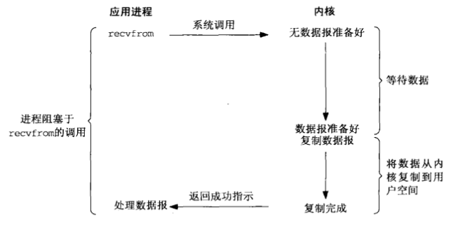
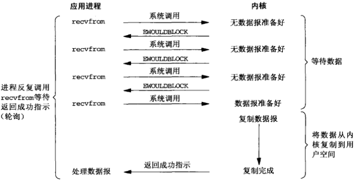
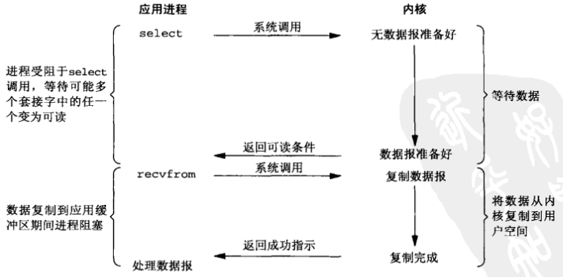
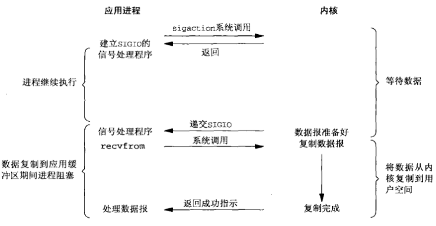
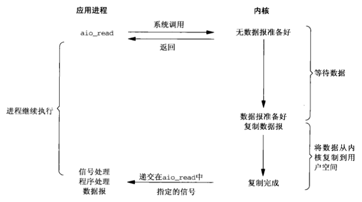
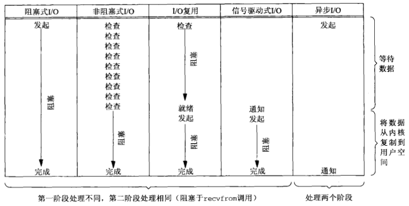
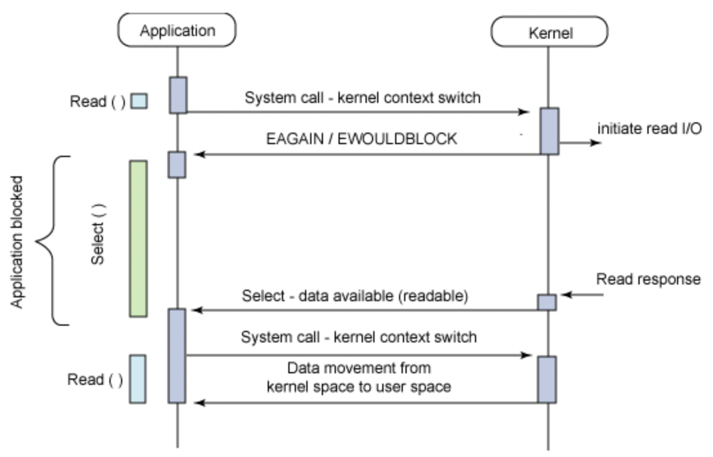
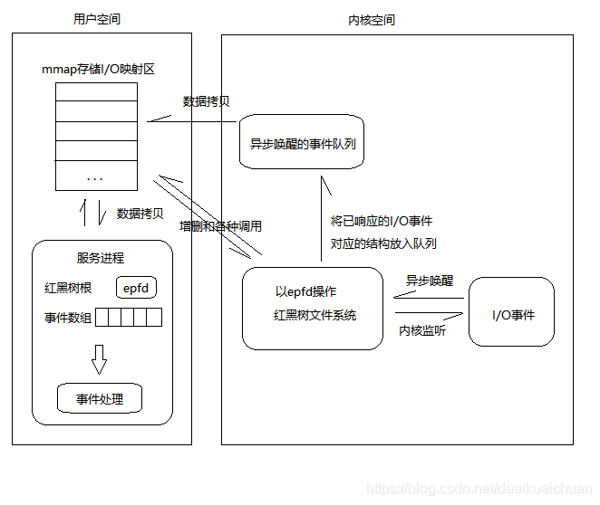

English | [中文版](io_zh.md)

# Network I/O

[TOC]


## I/O Models

### Blocking I/O
`Blocking I/O` is blocked in both phases of I/O execution.


### Non-blocking I/O
`Non-blocking I/O` means the user process keeps actively polling the kernel to check if data is ready.


### I/O Multiplexing
`I/O multiplexing (select and poll)` notifies the process once the kernel finds that one or more of the specified I/O conditions are ready for reading.


### Signal-driven I/O
`Signal-driven I/O (SIGIO)` uses signals to drive user process reads/writes, so the user does not need to keep polling the kernel.


### Asynchronous I/O
`Asynchronous I/O`


The main difference among the first four models is in the first phase, as their second phase is the same: during the data copy from the kernel to the caller's buffer, the process is blocked on the recvfrom call. In contrast, the asynchronous I/O model handles both phases, making it different from the other four models.

### Synchronous vs Asynchronous I/O
- Synchronous I/O operations cause the requesting process to block until the I/O operation completes.
- Asynchronous I/O operations do not cause the requesting process to block.


### I/O Model Comparison
TODO

---


## Multiplexing

### select
```c
#include <sys/select.h>
int select(int maxfdp1, fd_set *readset, fd_set *writeset, fd_set *exceptset, const struct timeval *timeout)
```
- `maxfdp1` specifies the maximum descriptor value to be tested + 1
- `readset` lets the kernel test read descriptors
- `writeset` lets the kernel test write descriptors
- `exceptset` lets the kernel test exception descriptors
- `timeout`: timeout (precision about 10ms)
	- `NULL` wait forever
	- `non-NULL` wait for a fixed time
	- `0` do not wait at all
- `return value`
	number of descriptors: number of ready descriptors
	0: timeout
	-1: error

*Multiplexing* (allows a process to instruct the kernel to wait for any of multiple events, and only wakes it up when one or more events occur or after a specified period).

select supports the following exceptional conditions:
- Arrival of out-of-band data on a socket
- Control status information available for reading from the master side of a pseudo-terminal set to packet mode

#### Descriptor Ready Conditions
Socket is ready to read if any of the following are true:
- Number of bytes in the receive buffer is greater than or equal to the current size of the socket's receive low-water mark
- The read half of the connection is closed (i.e., received FIN on a TCP connection). Reads on such a socket will not block and will return 0 (EOF)
- It is a listening socket and the number of completed connections is not zero
- There is a socket error pending

Socket is ready to write if any of the following are true:
- Number of bytes of available space in the send buffer is greater than or equal to the current size of the send low-water mark, and either the socket is connected or does not require a connection (e.g., UDP socket)
- The write half of the connection is closed
- A non-blocking connect socket has established a connection, or connect has failed
- There is a socket error pending

**Note: When an error occurs on a socket, select marks it as both readable and writable.**

Any UDP socket is always writable as long as its send low-water mark is less than or equal to the size of the send buffer (which should always be the case by default), because UDP sockets do not require a connection.

select returns a socket as ready under the following conditions:
| Condition                                                    | Readable? | Writable? | Exception? |
| ------------------------------------------------------------ | --------- | --------- | ---------- |
| Data available<br>Read half closed<br>New connection ready   | Y<br>Y<br>Y |           |            |
| Space available for writing<br>Write half closed             |           | Y<br>Y     |            |
| Error pending                                                | Y         | Y         |            |
| TCP out-of-band data                                         |           |           | Y          |

#### Maximum Number of Descriptors for select
The maximum number of descriptors for select is defined in `<sys/types.h>` or `<sys/select.h>`:
```c
#ifndef FD_SETSIZE
#define FD_SETSIZE 256
#endif
```

#### Operation Mechanism


#### Disadvantages of select
- Each call to `select` requires copying the `fd_set` from user space to kernel space, which is costly
- Each call to `select` requires the kernel to traverse all the `fd_set` passed in, which is costly
- The number of file descriptors supported by select is too small

### pselect
```c++
#include <sys/select.h>
#include <signal.h>
#include <time.h>
int pselect(int maxfdp1, fd_set *readset, fd_set *writeset, fd_set *exceptset, const struct timespec *timeout, const sigset_t *sigmask);
```
- `maxfdp1` maximum descriptor + 1
- `readset` readable descriptors
- `writeset` writable descriptors
- `exceptset` exception descriptors
- `timeout` timeout
	pselect uses the timespec structure instead of timeval.
	```c
	struct timespec {
			time_t   tv_sec;
			long     tv_nsec;
	}
	```
- `sigmask` pointer to a signal mask, used to handle signals during select blocking
- `return value`
	descriptors ready: n
	timeout: 0
	failure: -1

*Multiplexing (allows disabling certain signals)*

### kqueue
```c++
#include <sys/types.h>
#include <sys/event.h>
#include <sys/time.h>
int kqueue(void);
int kevent(int kq, const struct kevent *changelist, int nchanges,
					 struct kevent *evenlist, int nevents,
					 const struct timespec *timeout);
void EV_SET(struct kevent *kev, uintptr_t ident, short filter,
						u_short flags, u_int fflags, intptr_t data, void *udata);

struct kevent {
		uintptr_t ident;
		short     filter;
		u_short   flags;
		u_int     fflags;
		intptr_t  data;
		void     *udata;
};
```
| flags                                                        | Description                                                  | Change | Return |
| ------------------------------------------------------------ | ------------------------------------------------------------ | ------ | ------ |
| EV_ADD<br>EV_CLEAR<br>EV_DELETE<br>EV_DISABLE<br>EV_ENABLE<br>EV_ONESHOT | Add event; auto-enable unless EV_DISABLE<br>Reset event state after user gets it<br>Delete event<br>Disable event but do not delete<br>Re-enable previously disabled event<br>Delete event after one trigger | Y<br>Y<br>Y<br>Y<br>Y<br>Y |        |
| EV_EOF<br>EV_ERROR                                           | EOF condition<br>Error occurred: errno value in data member  |        | Y<br>Y |

| filter        | Description                |
| ------------- | ------------------------- |
| EVFILT_AIO    | Asynchronous I/O event    |
| EVFILT_PROC   | Process exit, fork, exec  |
| EVFILT_READ   | Descriptor readable       |
| EVFILT_SIGNAL | Signal received           |
| EVFILT_TIMER  | Periodic or one-shot timer|
| EVFILT_VNODE  | File modification/deletion|
| EVFILT_WRITE  | Descriptor writable       |

### poll
poll works similarly to select; there is not much difference in essence. It also manages multiple descriptors by polling and processing them based on their state, but poll does not have the file descriptor number limit of select.
poll changes the way the descriptor set is described, using the `pollfd` structure instead of select's `fd_set`, so the limit on the number of descriptors supported by poll is much higher than select's 1024.
```c++
#include <poll.h>
int poll(struct pollfd *fdarray, unsigned long nfds, int timeout);
```
- `fdarray` pollfd array
	```c
	struct pollfd {
			int     fd;
			short   events;     // events to test
			short   revents;    // returned descriptor state
	}
	```
	poll input events and return revents:
	| Constant                                      | Description                                                  |
	| --------------------------------------------- | ------------------------------------------------------------ |
	| POLLIN<br>POLLRDNORM<br>POLLRDBAND<br>POLLPRI | Normal or priority data readable<br>Normal data readable<br>Priority data readable<br>High-priority data readable |
	| POLLOUT<br>POLLWRNORM<br>POLLWRBAND           | Normal data writable<br>Normal data writable<br>Priority data writable |
	| POLLERR<br>POLLHUP<br>POLLNVAL                | Error occurred<br>Hang up<br>Descriptor is not an open file |
- `nfds` length of pollfd array
- `timeout` timeout duration
	| Timeout value | Description                                                  |
	| ------------ | ----------------------------------------------------------- |
	| INFTIM       | Wait forever (POSIX requires INFTIM to be defined in `<poll.h>`, but many systems still define it in `<sys/stropts.h>`). |
	| 0            | Return immediately, do not block.                           |
	| >0           | Wait for the specified number of milliseconds.              |
- `return value`
	success: number of ready descriptors
	no descriptors ready before timer expires: 0
	failure: -1

*Multiplexing*

#### Trigger Conditions
For TCP and UDP sockets, the following conditions cause poll to return specific revents:
- All normal TCP data and all UDP data are considered normal data
- TCP out-of-band data is considered priority data
- When the read half of a TCP connection is closed, it is also considered normal data; subsequent reads will return 0
- TCP connection errors can be considered normal data or errors (POLLERR). In either case, subsequent reads will return -1 and set errno appropriately. This can be used to handle conditions such as receiving RST or timeouts.
- A new connection available on a listening socket is considered normal data or priority data. Most implementations treat it as normal data.
- Completion of a non-blocking connect is considered to make the corresponding socket writable.

#### Disadvantages
- Each call to `poll` requires copying the `pollfd` from user space to kernel space, which is costly
- Each call to `poll` requires the kernel to traverse all the `pollfd` passed in, which is costly

### epoll
epoll is a scalable I/O event notification mechanism in the Linux kernel, introduced in Linux 2.5.44. It is based on **event-driven I/O** and is an enhanced version of `select` and `poll`.
Compared to `select` and `poll`, `epoll` has no descriptor limit. `epoll` uses a file descriptor to manage multiple descriptors, storing the events of user-related file descriptors in an event table in the kernel, so only one copy is needed between user and kernel space.
#### epoll_create
```c
#include <sys/epoll.h>
int epoll_create(int size);
```
- `size` meaningless, for compatibility
- `return value` epoll handle
*Create epoll handle*; process:
1. Creates a red-black tree in the kernel cache to store sockets passed by `epoll_ctl`;
2. Creates a `rdllist` doubly linked list in the kernel cache (ready list) to store ready events.
#### epoll_ctl
```c
#include <sys/epoll.h>
int epoll_ctl(int epfd, int op, int fd, struct epoll_event *event);
```
- `epfd` epoll handle
- `op` operation
	| op value       | Description         |
	| -------------- | ------------------ |
	| EPOLL_CTL_ADD  | Add event          |
	| EPOLL_CTL_MOD  | Modify event       |
	| EPOLL_CTL_DEL  | Delete event       |
- `fd` socket
- `event` event
	| Event         | Description                                         |
	| ------------- | -------------------------------------------------- |
	| EPOLLIN       | Descriptor is readable                             |
	| EPOLLOUT      | Descriptor is writable                             |
	| EPOLLET       | Set epoll event notification mode to edge-triggered|
	| EPOLLONESHOT  | Notify once, then stop monitoring                  |
	| EPOLLHUP      | Hang-up event on this descriptor, default event    |
	| EPOLLRDHUP    | Hang-up event on peer descriptor                   |
	| EPOLLPRI      | Triggered by out-of-band data                      |
	| EPOLLERR      | Triggered on error, default event                  |
- `return value`
	success: 0
	failure: -1
	*Add, modify, or delete event monitoring for fd on the kernel epoll instance corresponding to epfd.*
#### epoll_wait
```c++
#include <sys/epoll.h>
int epoll_wait(int epfd, struct epoll_event *events, int maxevents, int timeout);
```
- `epfd` epoll handle
- `events` used to record triggered events, should be the same size as maxevents
- `maxevents` maximum number of returned events
- `timeout` timeout (ms)
	| timeout value | Description                                    |
	| ------------- | ---------------------------------------------- |
	| 0             | Return immediately.                            |
	| -1            | Block until a registered event is ready.       |
	| >0            | Block until time expires or a registered event is ready. |
	*Checks for data, returns if data is available, otherwise sleeps until timeout expires; diagram below:*
	
| Trigger Mode | Description                                                                                                   |
| ------------ | ------------------------------------------------------------------------------------------------------------- |
| LT           | (Level Triggered) default mode, **triggers as long as there is data**, unread data in the buffer causes epoll_wait to return. |
| ET           | (Edge Triggered) high-speed mode, **triggers only when data arrives**, **regardless of whether there is unread data in the buffer**, unread data in the buffer does not cause epoll_wait to return. Nginx uses ET. Recommended in the following cases:<br>  1. `read` or `write` system call returns `EAGAIN`<br>  2. Non-blocking file descriptors |
#### Example
Server:
```c
#include <stdio.h>
#include <unistd.h>
#include <stdlib.h>
#include <string.h>
#include <sys/types.h>
#include <errno.h>
#include <sys/socket.h>
#include <netinet/in.h>
#include <sys/epoll.h>
#include <fcntl.h>
#include <sys/resource.h>
#define MAXEPOLL 10000
#define MAXLINE  1024
#define PORT     6000
#define MAXBACK  1000
int setnonblocking(int fd)
{
	if(fcntl(fd, F_SETFL, fcntl(fd, F_GETFD, 0)|O_NONBLOCK) == -1)
	{
		printf("Set blocking error:%d\n", errno);
		return -1;
	}
	return 0;
}
int main(int argc, char** argv)
{
	int listen_fd;
	int conn_fd;
	int epoll_fd;
	int nread;
	int cur_fds;
	int wait_fds;
	int i;
	struct sockaddr_in servaddr;
	struct sockaddr_in cliaddr;
	struct epoll_event ev;
	struct epoll_event evs[MAXEPOLL];
	struct rlimit rlt;
	char buf[MAXLINE];
	socklen_t len = sizeof(struct sockaddr_in);
	rlt.rlim_max = rlt.rlim_cur = MAXEPOLL;
	if(setrlimit(RLIMIT_NOFILE, &rlt) == -1)
	{
		printf("Setrlimit Error : %d\n", errno);
		exit(EXIT_FAILURE);
	}
	bzero(&servaddr, sizeof(servaddr));
	servaddr.sin_family = AF_INET;
	servaddr.sin_addr.s_addr = htonl(INADDR_ANY);
	servaddr.sin_port = htons(PORT);
	if((listen_fd = socket(AF_INET, SOCK_STREAM, 0)) == -1)
	{
		printf("Socket Error...\n", errno);
		exit(EXIT_FAILURE);
	}
	if(setnonblocking(listen_fd) == -1)
	{
		printf("Setnonblocking Error:%d\n", errno);
		exit(EXIT_FAILURE);
	}
	if(bind(listen_fd, (struct sockaddr*)&servaddr, sizeof(struct sockaddr)) == -1)
	{
		printf("Bind Error : %d\n", errno);
		exit(EXIT_FAILURE);
	}
	if(listen(listen_fd, MAXBACK) == -1)
	{
		printf("Listen Error : %d\n", errno);
		exit(EXIT_FAILURE);
	}
	epoll_fd = epoll_create(MAXEPOLL);
	ev.events = EPOLLIN | EPOLLET;
	ev.data.fd = listen_fd;
	if(epoll_ctl(epoll_fd, EPOLL_CTL_ADD, listen_fd, &ev) < 0)
	{
		printf("Epoll Error : %d\n", errno);
		exit(EXIT_FAILURE);
	}
	cur_fds = 1;
	while(1)
	{
		if((wait_fds = epoll_wait(epoll_fd, evs, cur_fds, -1)) == -1)
		{
			printf("Epoll Wait Error : %d\n", errno);
			exit(EXIT_FAILURE);
		}
		for(i = 0; i < wait_fds; i++)
		{
			if(evs[i].data.fd == listen_fd && cur_fds < MAXEPOLL)
			{
				if((conn_fd = accept(listen_fd, (struct sockaddr *)&cliaddr, &len)) == -1)
				{
					printf("Accept Error : %d\n", errno);
					exit(EXIT_FAILURE);
				}
				printf("Server get from client!\n");
				ev.events = EPOLLIN | EPOLLET;
				ev.data.fd = conn_fd;
				if(epoll_ctl(epoll_fd, EPOLL_CTL_ADD, conn_fd, &ev) < 0)
				{
					printf("Epoll Error : %d\n", errno);
					exit(EXIT_FAILURE);
				}
				++cur_fds;
				continue;
			}
			nread = read(evs[i].data.fd, buf, sizeof(buf));
			if(nread <= 0)
			{
				close(evs[i].data.fd);
				epoll_ctl(epoll_fd, EPOLL_CTL_DEL, evs[i].data.fd, &ev);
				--cur_fds;
				continue;
			}
			write(evs[i].data.fd, buf, nread);
		}
	}
	close(listen_fd);
	return 0;
}
```
Client:
```c
#include <stdio.h>
#include <unistd.h>
#include <stdlib.h>
#include <string.h>
#include <errno.h>
#include <netinet/in.h>
#include <sys/types.h>
#include <sys/socket.h>
#include <arpa/inet.h>
#include <sys/select.h>
#define MAXLINE   1024
#define SERV_PORT 6000
void send_and_recv(int connfd)
{
	FILE* fp = stdin;
	int lens;
	char send[MAXLINE];
	char recv[MAXLINE];
	fd_set rset;
	FD_ZERO(&rset);
	int maxfd = (fileno(fp) > connfd ? fileno(fp) : connfd + 1);
	int n;
	while(1)
	{
		FD_SET(fileno(fp), &rset);
		FD_SET(connfd, &rset);
		if(select(maxfd, &rset, NULL, NULL, NULL) == -1)
		{
			printf("Client Select Error..\n");
			exit(EXIT_FAILURE);
		}
		if(FD_ISSET(connfd, &rset))
		{
			printf("client get from server...\n");
			memset(recv, 0, sizeof(recv));
			n = read(connfd, recv, MAXLINE);
			if(n == 0)
			{
				printf("Recv ok...\n");
				break;
			}
			else if(n == -1)
			{
				printf("Recv error...\n");
				break;
			}
			else
			{
				lens = strlen(recv);
				recv[lens] = '\0';
				write(STDOUT_FILENO, recv, MAXLINE);
				printf("\n");
			}
		}
		if(FD_ISSET(fileno(fp), &rset))
		{
			memset(send, 0, sizeof(send));
			if(fgets(send, MAXLINE, fp) == NULL)
			{
				printf("End...\n");
				exit(EXIT_FAILURE);
			}
			else
			{
				lens = strlen(send);
				send[lens-1] = '\0';
				if(strcmp(send, "q") == 0)
				{
					printf("Bye..\n");
					return;
				}
				printf("Client send : %s\n", send);
				write(connfd, send, strlen(send));
			}
		}
	}
}
int main(int argc, char** argv)
{
	char buf[MAXLINE];
	int connfd;
	struct sockaddr_in servaddr;
	if(argc != 2)
	{
		printf("Input server ip!\n");
		exit(EXIT_FAILURE);
	}
	if((connfd = socket(AF_INET, SOCK_STREAM, 0)) == -1)
	{
		printf("Socket Error...\n", errno);
		exit(EXIT_FAILURE);
	}
	bzero(&servaddr, sizeof(servaddr));
	servaddr.sin_family = AF_INET;
	servaddr.sin_port = htons(SERV_PORT);
	inet_pton(AF_INET, argv[1], &servaddr.sin_addr);
	if(connect(connfd, (struct sockaddr*)&servaddr, sizeof(servaddr)) < 0)
	{
		printf("Connect error..\n");
		exit(EXIT_FAILURE);
	}
	send_and_recv(connfd);
	close(connfd);
	printf("Exit\n");
	return 0;
}
```
---


## Stream Operations

### recv/send
```c++
#include <sys/socket.h>
ssize_t recv(int sockfd, void *buff, size_t nbytes, int flags);
ssize_t send(int sockfd, const void *buff, size_t nbytes, int flags);
```
- `sockfd` socket
- `buff` buffer
- `nbytes` number of bytes
- `flags`
	| flags         | Description           | recv | send |
	| ------------- | -------------------- | ---- | ---- |
	| MSG_DONTROUTE | Bypass routing table  |      | Y    |
	| MSG_DONTWAIT  | Non-blocking for op   | Y    | Y    |
	| MSG_OOB       | Out-of-band data      | Y    | Y    |
	| MSG_PEEK      | Peek at incoming data | Y    |      |
	| MSG_WAITALL   | Wait for all data     | Y    |      |
	- `MSG_DONTROUTE` tells the kernel the destination host is on a directly connected local network, so no routing table lookup is needed.
	- `MSG_DONTWAIT` temporarily sets the operation as non-blocking without setting the socket's non-blocking flag.
	- `MSG_OOB` for send, indicates sending out-of-band data; for recv, indicates reading out-of-band data instead of normal data.
	- `MSG_PEEK` for recv and recvfrom, allows viewing data that can be read without discarding it after the call returns.
	- `MSG_WAITALL` tells the kernel not to return from a read operation until the requested number of bytes have been read. If the system supports this flag, you can replace the readn function with a macro:
		```c++
		#define readn(fd, ptr, n) recv(fd, ptr, n, MSG_WAITALL)
		```
		Even with MSG_WAITALL, if any of the following occur:
		1. A signal is caught;
		2. The connection is terminated;
		3. A socket error occurs, the read function may still return less data than requested.
- `return value`
	success: number of bytes read/written
	failure: -1
	*Read/write socket*
### readv/writev
```c++
#include <sys/uio.h>
ssize_t readv(int filedes, const struct iovec *iov, int iovcnt);
ssize_t writev(int filedes, const struct iovec *iov, int iovcnt);
```
- `filedes` file descriptor
- `iov` pointer to an array of iovec structures
	POSIX requires the constant IOV_MAX to be defined in `<sys/uio.h>` to indicate the array's capacity, at least 16; actual value depends on implementation: 4.3BSD and Linux allow up to 1024, HP-UX up to 2100.
	iovec definition:
	```c++
	struct iovec {
			void *iov_base;
			size_t iov_len;
	}
	```
- `iovcnt` number of elements in the iovec array
- `return value`
	- success: number of bytes read/written
	- failure: -1
	*Read/write one or more buffers, called `scatter read` and `gather write` respectively, because input data from a read is scattered into multiple application buffers, and output data from multiple application buffers is gathered for a single write operation.*
### recvmsg/sendmsg
```c++
#include <sys/socket.h>
ssize_t recvmsg(int sockfd, struct msghdr *msg, int flags);
ssize_t sendmsg(int sockfd, struct msghdr *msg, int flags);
```
- `sockfd` socket
- `msg` message structure
	```c++
	struct msghdr {
			void         *msg_name;       // protocol address of receiver/sender
			socklen_t     msg_namelen;    // length of protocol address
			struct iovec *msg_iov;        // input/output buffer array
			int           msg_iovlen;     // length of buffer array
			void         *msg_control;    // location of ancillary data (optional)
			socklen_t     msg_controllen; // size of ancillary data (optional)
			int           msg_flags;      // message flags
	};
	```
- `flags`
	| Flag                                                        | Checked by kernel for send, sendto, or sendmsg | Checked by kernel for recv, recvfrom, or recvmsg | Returned by kernel via msg_flags in recvmsg      |
	| ----------------------------------------------------------- | ----------------------------------------------- | ------------------------------------------------ | ----------------------------------------------- |
	| MSG_DONTROUTE<br>MSG_DONTWAIT<br>MSG_PEEK<br>MSG_WAITALL    | Y<br>Y                                          | <br>Y<br>Y<br>Y                                 |                                                 |
	| MSG_EOR<br>MSG_OOB                                          | Y<br>Y                                          | <br>Y                                           | Y<br>Y                                          |
	| MSG_BCAST<br>MSG_MCAST<br>MSG_TRUNC<br>MSG_CTRUNC<br>MSG_NOTIFICATION |                                               |                                                  | Y<br>Y<br>Y<br>Y<br>Y                                 |
- `return value`
	success: number of bytes read/written
	failure: -1
	*Read/write socket*
---


## Summary

### Multiplexing Comparison
|            |           select           |            poll            |                        epoll                        |
| :--------- | :-----------------------: | :------------------------: | :--------------------------------------------------: |
| Operation  |         Traversal         |         Traversal          |                        Callback                      |
| Impl       |          Array            |           List             |                      Red-black tree                  |
| IO Perf    | O(n) linear traversal per call | O(n) linear traversal per call | Event notification, callback on ready fd, O(1) time |
| Max Conns  | 1024 (x86) or 2048 (x64)  |        No limit            |                      No limit                        |
| fd copy    | Each call copies fd set from user to kernel | Each call copies fd set from user to kernel | Copied into kernel and saved on epoll_ctl, not on epoll_wait |
### I/O Operation Function Comparison
| Function         | Any descriptor | Socket only | Single buffer | Scatter/gather | Optional flags | Optional peer addr | Optional control info |
| ---------------- | -------------- | ----------- | ------------- | -------------- | -------------- | ------------------ | -------------------- |
| read/write       | Y              |             | Y             |                |                |                    |                      |
| readv/writev     | Y              |             |               | Y              |                |                    |                      |
| recv/send        |                | Y           | Y             |                | Y              |                    |                      |
| recvfrom/sendto  |                | Y           | Y             |                | Y              | Y                  |                      |
| recvmsg/sendmsg  |                | Y           |               | Y              | Y              | Y                  | Y                    |
---


## References

- [Wikipedia - epoll](https://en.wikipedia.org/wiki/Epoll)
- [Summary of differences between select, poll, and epoll [整理]](https://www.cnblogs.com/Anker/p/3265058.html)
- [Three mechanisms of IO multiplexing: Select, Poll, Epoll](https://www.jianshu.com/p/397449cadc9a)
- [As a C++ programmer, you should thoroughly understand the principle of efficient epoll operation](https://zhuanlan.zhihu.com/p/159135478)
- [Is IO multiplexing really asynchronous?](https://www.zhihu.com/question/59975081/answer/1932776593?utm_source=wechat_session&utm_medium=social&utm_oi=974639756117843968&utm_content=group3_Answer&utm_campaign=shareopn)
