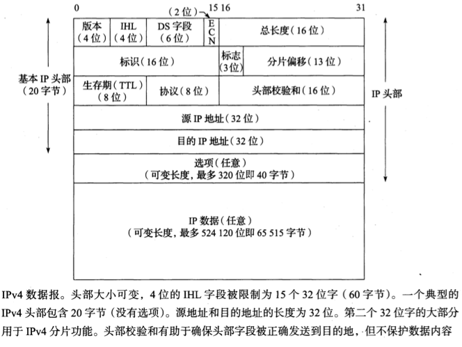
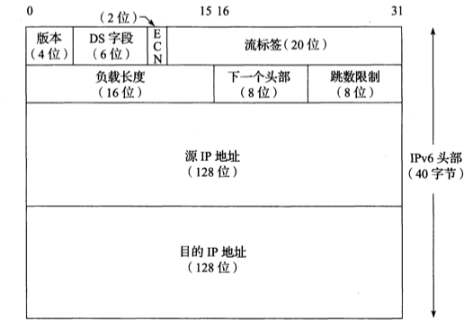
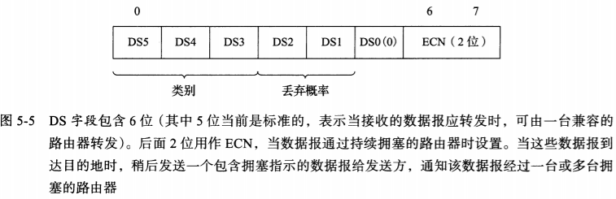
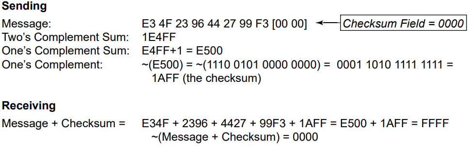
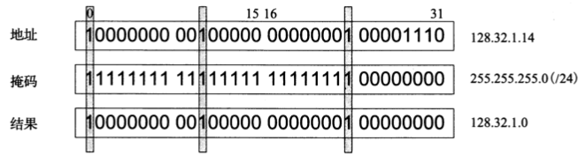
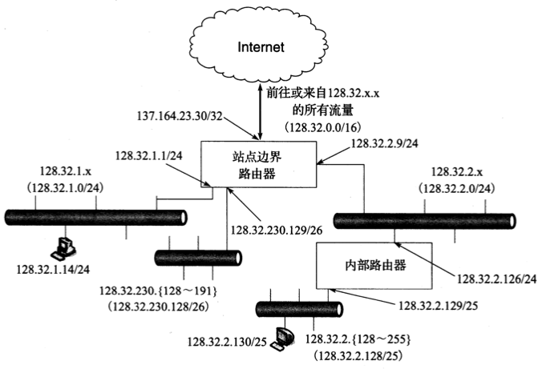

# IP

[TOC]

IP(Intern)是TCP/IP协议族中的核心协议。所有TCP，UDP，ICMP和IGMP数据都通过IP数据报传输，但是不保证IP数据报能成功到达目的地。

## 分类寻址

- A类
  | 1bit | 7bit              | 24bit       |
  | ---- | ----------------- | ----------- |
  | 0    | 网络号-Net Number | 主机号-Host |
- B类
  | 1bit | 1bit | 14bit             | 16bit       |
  | ---- | ---- | ----------------- | ----------- |
  | 1    | 0    | 网络号-Net Number | 主机号-Host |
- C类
  | 1bit | 1bit | 1bit | 21bit             | 8bit        |
  | ---- | ---- | ---- | ----------------- | ----------- |
  | 1    | 1    | 0    | 网络号-Net Number | 主机号-Host |
- D类
  | 1bit | 1bit | 1bit | 1bit | 28bit                      |
  | ---- | ---- | ---- | ---- | -------------------------- |
  | 1    | 1    | 1    | 0    | 多播组号-Multicast Address |
- E类
  | 1bit | 1bit | 1bit | 1bit | 1bit | 28bit         |
  | ---- | ---- | ---- | ---- | ---- | ------------- |
  | 1    | 1    | 1    | 1    | 0    | 保留-Reserved |

A, B, C类用于单播

## IPv4

ipv4地址长32bit，通常采用 `Dotted decimal notation(点分十进制)`的方法表示。

### 协议头

- `版本`（4bit）

  IP协议版本，值为4；
- `IHL` （4bit）

  Internet头部长度，描述32位字的数量，Internet最多$32*15=480$位，即60字；
- `DS字段`（6bit）

  服务字段，详情见[DS字段](#DS字段)
- `ECN`（2bit）

  显式拥塞通知，标记网络拥堵情况，用于滑动窗口；
- `总长度`（16bit）

  IPv4数据报的总长度（单位：字节），最大$2^{16}=65535$字节；
- `标识`（16bit）

  标记数据报ID，自增
- `标志`（3bit）？
- `分片偏移`（13bit）？
- `生存期`（8bit，TTL）

  可经过的路由器数量的上限，每过一台路由器就减1，到0就丢弃；一般初始化为64或128或255
- `协议`（8bit）？
- `头部校验和`（16bit）

  校验数据报头是否完整，详情见[Internet校验和](#Internet校验和)
- `源IP地址`（32bit）？
- `目的IP地址`（32bit）？
- `选项`（变长）

  如果选项存在，它在IPv4分组中紧跟在基本IPv4头部之后。选项由一个8位的类型字段标识。这个字段被细分为3个子字段：复制（1位），类别（2位）和编号（5位）。选项0和1的长度是1字节，多数的其他选项的长度可变。可变选项包括1字节的类型标识符，1字节的长度以及选项自身

  | 名称           | 编号       | 值             | 长度 | 描述                                                                                                                                     | 参考文献                       | 注释             |
  | -------------- | ---------- | -------------- | ---- | ---------------------------------------------------------------------------------------------------------------------------------------- | ------------------------------ | ---------------- |
  | 列表结尾       | 0          | 0              | 1    | 表示没有更多选项                                                                                                                         | `[RFC0791]`                  | 如果需要         |
  | 没有操作       | 1          | 1              | 1    | 表示没有操作执行（用于填充）                                                                                                             | `[RFC0791]`                  | 如果需要         |
  | 源路由         | 3` `9 | 131` `137 | 可变 | 发送方列出分组转发时遍历的路由器“航点”。松散意味着其他路由器可以包含在航点（3，131）中。严格意味着（9，137）中的所有航点都要按顺序遍历 | `[RFC0791]`                  | 很少，经常被过滤 |
  | 安全和处理标签 | 2` `5 | 130` `133 | 11   | 在美国军事环境下如何为IP数据报指定安全标签和处理限制                                                                                     | `[RFC1108]`                  | 历史的           |
  | 记录路由       | 7          | 7              | 可变 | 在分组的头部中记录经过的路由器                                                                                                           | `[RFC0791]`                  | 很少             |
  | 时间戳         | 4          | 68             | 可变 | 在分组的源和目的地记录日期和时间                                                                                                         | `[RFC0791]`                  | 很少             |
  | 流ID           | 8          | 136            | 4    | 携带16位的SATNET流标识符                                                                                                                 | `[RFC0791]`                  | 历史的           |
  | EIP            | 17         | 145            | 可变 | 扩展Internet协议                                                                                                                         | `[RFC1385]`                  | 历史的           |
  | 跟踪           | 18         | 82             | 可变 | 增加一个路由跟踪选项和ICMP报文                                                                                                           | `[RFC1393]`                  | 历史的           |
  | 路由器警告     | 20         | 148            | 4    | 表示一个路由器需要解释数据报的内容                                                                                                       | `[RFC2113] ``[RFC5350]` | 偶然             |
  | 快速启动       | 25         | 25             | 8    | 表示启动快速传输协议（实验性的）                                                                                                         | `[RFC4782]`                  | 很少             |

### ipv4空间划分

| 类 | 地址范围                  | High-Order Bits | Use             | Fraction of Total | Number of Nets | Number of Hosts |
| -- | ------------------------- | --------------- | --------------- | ----------------- | -------------- | --------------- |
| A  | 0.0.0.0~127.255.255.255   | 0               | Unicast/special | 1/2               | 128            | 16,777,216      |
| B  | 128.0.0.0~191.255.255.255 | 10              | Unicast/special | 1/4               | 16,384         | 65536           |
| C  | 192.0.0.0~223.255.255.255 | 110             | Unicast/special | 1/8               | 2,097,152      | 256             |
| D  | 224.0.0.0~239.255.255.255 | 1110            | Multicast       | 1/16              | N/A            | N/A             |
| E  | 240.0.0.0~255.255.255.255 | 1111            | Reserved        | 1/16              | N/A            | N/A             |

## IPv6

### 协议头

- `版本`

  （4bit）IP协议版本，值为6；
- `DS字段`

  （6bit）服务字段，详情见[DS字段](#DS字段)；
- `ECN`

  （2bit）显式拥塞通知，标记网络拥堵情况，用于滑动窗口；
- `流标签`

  （20bit）
- `负载长度`

  （16bit）
- `下一个头部`

  （8bit）
- `跳数限制`

  （8bit）
- `源IP地址`

  （128bit）
- `目的IP地址`

  （128bit）

## DS字段

### 结构

- `优先级`

  （3bit）低优先级可以被高优先级抢占，不同优先级有不同的被丢弃概率。共8级：

  | 值  | 优先级   |
  | --- | -------- |
  | 000 | 常规     |
  | 001 | 优先     |
  | 010 | 立即     |
  | 011 | 瞬间     |
  | 100 | 瞬间覆盖 |
  | 101 | 严重     |
  | 110 | 网间控制 |
  | 111 | 网络控制 |
- `D`

  （1bit）延时
- `T`

  （1bit）吞吐量
- `R`

  （1bit）可靠性
- `保留`

  （2bit）默认0

## Internet校验和

Internet校验和是一个被校验数据（如果被计算的字节数为奇数，用0填充）的16位反码和的反码。如果被计算数据包括一个校验和字段，该字段在进行校验和运算之前被设置为0，然后将计算出的校验和填充到该字段。为了检查一个包含校验和字段（头部，有效载荷等）的数据输入是否有效，需要对整个数据块（包括检验和字段）同样计算校验和。由于校验和字段本质上是其余数据校验和的反码，对正确接收的数据计算校验和应产生一个值0；例：

## 子网掩码

由一台主机或路由器实用的分配位，以确定如何从一台主机对应IP地址中获得网络和子网信息。

例，一个IP地址与子网掩码按位与操作：

### 可变长度子网掩码

可变长度子网掩码(VLSM)

例，使用VLSM分割一个网络号，使每个子网支持不同数量的:

- `/24`: 允许 `32-24=8`位（256台主机）
- `/25`: 允许 `32-25=7位`（128台主机）
- `/26`: 允许 `32-26=6`位（64台主机）

## 参考

- TCP/IP详解.卷一.第五章
