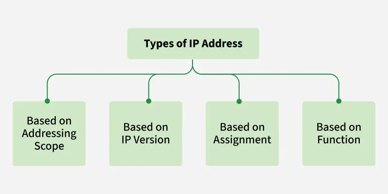
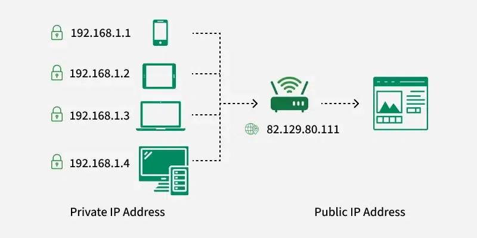
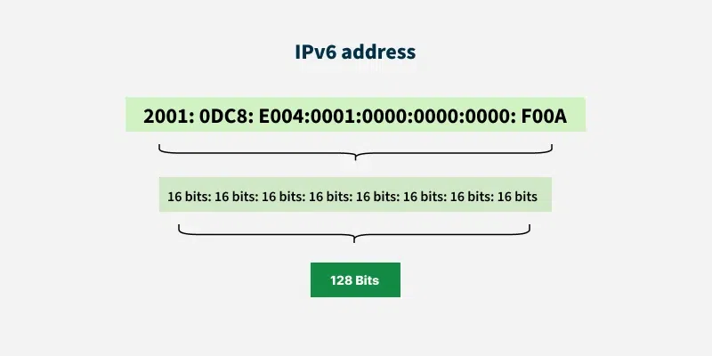
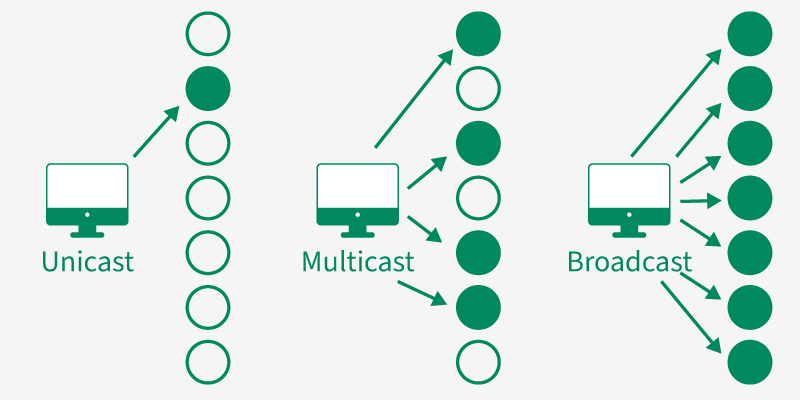
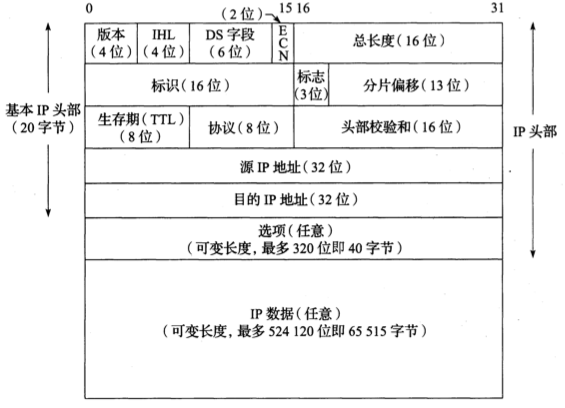
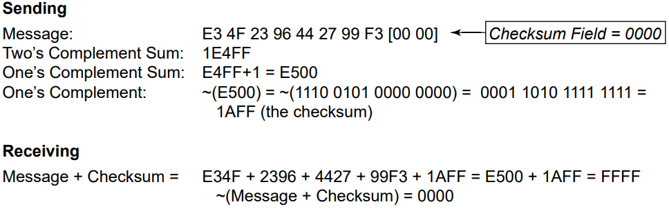
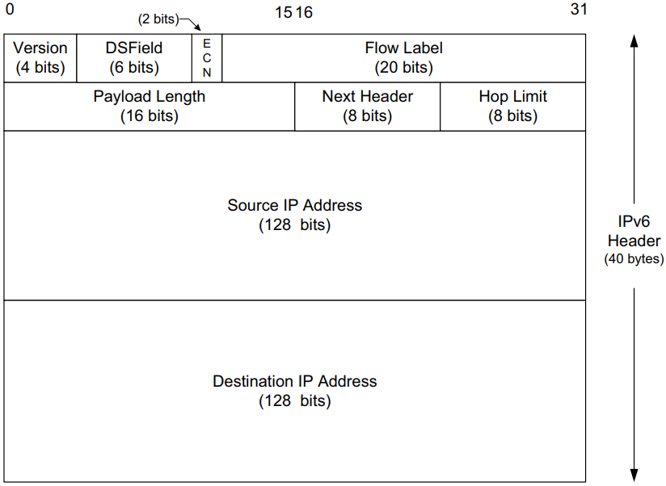

English | [中文版](ip_zh.md)

# Internet Protocol (IP)

[TOC]

IP is the network‑layer workhorse of the Internet protocol suite. It provides a best‑effort, connectionless datagram service that carries transport protocols (TCP, UDP) and control protocols (ICMP, IGMP). IP does not guarantee delivery, ordering, or duplicate suppression — those are handled by higher layers when needed.

## Types

IP addresses can be classified in several ways based on their structure, purpose, and the type of network they are used in.

### Based On Addressing Scope

#### Public IP Addresses

A public IP address is assigned to every device that directly accesses the internet. This address is unique across the entire internet.

#### Private IP Addresses

Private IP addresses are used within private networks and are not routable on the Internet. It enables devices to exchange data internally.

The Three Private Ranges:

| **Class**   | **Range**                     | **CIDR**       | **Number of Addresses** | **Typical Use**               |
| :---------- | :---------------------------- | :------------- | :---------------------- | :---------------------------- |
| **Class A** | 10.0.0.0 – 10.255.255.255     | 10.0.0.0/8     | 16,777,216              | Large enterprises, cloud VPCs |
| **Class B** | 172.16.0.0 – 172.31.255.255   | 172.16.0.0/12  | 1,048,576               | Medium-sized organizations    |
| **Class C** | 192.168.0.0 – 192.168.255.255 | 192.168.0.0/16 | 65,536                  | Home networks, small offices  |

### Based on IP Version

#### IPv4

IPv4 is the most common form IP Address. It consists of four sets of numbers(octets) separated by dots. Each octet represents eight bits, or a byte, and can take a value from 0 to 255.

#### IPv6

IPv6 addresses were created to deal with the shortage of IPv4 addresses. They use 128 bits instead of 32, offering a vastly greater number of possible addresses. These addresses are expressed as eight groups of four hexadecimal digits, each group representing 16 bits. The groups are separated by colons.

### Based on Assignment

#### Static IP Addresses

Static IP Addresses are permanently assigned to a device, typically important for servers or devices that need a constant address.

#### Dynamic IP Addresses

Dynamic IP Addresses are temporarily assigned from a pool of available addresses by the Dynamic Host Configuration Protocol (DHCP).

### Based on Function

#### Unicast Address

In unicast, data is sent from one sender to one specific receiver identified by a unique IP address.

#### Broadcast Address

In broadcast, a message is sent from one device to all devices in the same network segment. Every device in the network receives and processes the broadcast message. Its purpose is one-to-all communication within a network.

#### Multicast Address

In multicast, data is sent from one source to multiple selected receivers that are part of a multicast group. Only devices that have joined the group will receive the data, making it more efficient than broadcasting. Its purpose is one-to-many (selected group) communication.

#### Anycast Address

In anycast, data is sent from one sender to the nearest receiver (in terms of network distance) among a group of devices sharing the same IP address. Routers determine the closest destination dynamically. Its purpose is one-to-nearest communication (based on routing distance).

### Special IP Addresses

There are also some special-purpose IP addresses that don't follow the usual structure:

| Address Range   | CIDR                          | Purpose                                                      | RFC      |
| :-------------- | :---------------------------- | :----------------------------------------------------------- | :------- |
| 0.0.0.0/8       | 0.0.0.0 – 0.255.255.255       | "This host on this network" (used during boot, default route) | RFC 1122 |
| 127.0.0.0/8     | 127.0.0.0 – 127.255.255.255   | **Loopback** – localhost (127.0.0.1 most common)             | RFC 1122 |
| 169.254.0.0/16  | 169.254.0.0 – 169.254.255.255 | **Link-local** (APIPA) – when DHCP fails, self-assigned      | RFC 3927 |
| 224.0.0.0/4     | 224.0.0.0 – 239.255.255.255   | **Multicast** – one-to-many communication                    | RFC 5771 |
| 240.0.0.0/4     | 240.0.0.0 – 255.255.255.254   | **Reserved** (formerly "Class E") – future use               | RFC 1112 |
| 255.255.255.255 | Single address                | **Limited broadcast** – sends to all on local network        | RFC 919  |

## IPv4 header

Key IPv4 header fields:

- `Version (4 bits)`: protocol version (4 for IPv4).
- `IHL (Internet Header Length, 4 bits)`: header length in 32‑bit words (min 5, i.e., 20 bytes without options).
- `DSField / TOS (8 bits)`: Differentiated Services / Type of Service for QoS markings.
- `ECN (2 bits)`: Explicit Congestion Notification bits.
- `Total Length (16 bits)`: entire datagram size in bytes (header + data).
- `Identification (16 bits)`: identifies fragments of the same original datagram.
- `Flags (3 bits)`: control fragmentation (DF = don't fragment, MF = more fragments).
- `Fragment Offset (13 bits)`: location of this fragment's data relative to original datagram (in 8‑byte units).
- `TTL (Time‑to‑Live, 8 bits)`: maximum number of hops (routers) the datagram may traverse; decremented by each router.
- `Protocol (8 bits)`: indicates the encapsulated transport protocol (e.g., TCP=6, UDP=17, ICMP=1).
- `Header Checksum (16 bits)`: covers the IPv4 header only; recomputed at each hop if header fields change.
- `Source / Destination IP addresses (32 bits each)`.
- `Options (variable)`: rarely used; extend header functionality (security, routing, timestamps).

Notes:

- The maximum IPv4 datagram size is 65,535 bytes (Total Length field). Larger data must be fragmented at the IP layer or at the sender's transport layer.
- Fragmentation/reassembly imposes performance and reliability costs; avoid fragmentation when possible (Path MTU Discovery).

### Fragmentation and reassembly

- When an IPv4 datagram exceeds a link's MTU, a router (or sender) may fragment it into smaller datagrams. Each fragment carries the same Identification value and appropriate Fragment Offset and MF flag.
- The destination reassembles fragments using Identification and offsets. If fragments are lost, the entire original datagram cannot be reassembled and must be retransmitted by transport (if reliable) or lost.
- The DF (Don't Fragment) flag prevents fragmentation; if set and the MTU is too small, the router drops the packet and sends an ICMP "Fragmentation Needed" message (used by PMTUD).

### Internet checksum (IPv4)

IPv4 uses a 16‑bit one's complement checksum computed over the header. The checksum helps detect header corruption; it does not protect the payload. Routers must recompute the checksum if they modify header fields (for example, decrementing TTL).

Example verification (diagram):

Note: IPv6 removes the header checksum to avoid per‑hop recomputation and improve performance.

## IPv6 header

Key IPv6 header fields:

- Version (4 bits): 6 for IPv6.
- DSField (8 bits) and ECN: QoS fields similar to IPv4.
- Flow Label (20 bits): optional label to identify flows for special handling.
- Payload Length (16 bits): length of payload after the 40‑byte fixed header.
- Next Header (8 bits): identifies the type of the first header after the IPv6 header (transport protocol or extension header).
- Hop Limit (8 bits): like IPv4 TTL; decremented by each router.
- Source / Destination Addresses (128 bits each).

Notable differences from IPv4:

- Fixed 40‑byte IPv6 header (no header checksum, fewer variable fields), which simplifies and speeds up forwarding.
- Fragmentation is only performed by the source host (intermediate routers do not fragment in IPv6). Hosts use Path MTU Discovery to avoid fragmentation.
- Extension headers (Hop-by-Hop, Routing, Fragment, Destination Options, Authentication, Encapsulation) are chained after the main header when needed.

### Why IPv6?

IPv6 was designed to address IPv4 limitations: vastly larger address space (128‑bit), simpler header processing, improved support for extension headers, and built‑in features for autoconfiguration and mobility.

## Mobile IP (brief)

Mobile IP provides mobility support by allowing a mobile node to receive packets at a care‑of address while maintaining a permanent home address. Mobile IP involves home agents, foreign agents, and tunneling (IP‑in‑IP or other encapsulation). Modern mobility solutions increasingly rely on higher‑layer or network‑based mechanisms, but Mobile IP remains a canonical example in protocol literature.

## Summary

### Public IP vs Private IP

|           Private IP Address           |            Public IP Address             |
| :------------------------------------: | :--------------------------------------: |
| Used within a local or private network | Used for communication over the internet |
|  Not routable on the public internet   |     Routable on the public internet      |
| Scope is limited to the local network  |             Scope is global              |
|   Assigned by router or DHCP server    |             Assigned by ISP              |
|     Unique within a local network      |             Globally unique              |
|    Requires NAT for internet access    |           Does not require NAT           |
|     Hidden from external networks      |         Visible on the internet          |
|    Uses reserved private IP ranges     |     Uses globally assigned IP ranges     |
|     Freely usable inside networks      |     May involve additional ISP cost      |

### Addressing and basic subnetting

- IPv4 addresses are 32 bits, commonly expressed in dotted decimal (a.b.c.d). Subnetting uses network prefixes (e.g., /24) to divide address space.
- IPv6 addresses are 128 bits, expressed in hex colon notation and compressed forms (e.g., 2001:db8::/32). IPv6 strongly encourages subnetting by /64 links for SLAAC.

Practical notes:

- Use CIDR (classless inter-domain routing) to allocate and route IPv4 prefixes efficiently.
- For IPv6, prefer stable addressing policies and avoid relying on temporary addresses for long‑term services.

### Path MTU Discovery (PMTUD)

- PMTUD lets endpoints discover the minimum MTU along a path to avoid fragmentation. In IPv4, the sender probes with DF set; routers that cannot forward send ICMP "Fragmentation Needed" messages with the next‑hop MTU.
- In IPv6, fragmentation must be handled by the source, so PMTUD is essential. ICMPv6 carries the "Packet Too Big" message for this purpose.

### IPv4 vs IPv6

|                           **IPv4**                           |                           **IPv6**                           |
| :----------------------------------------------------------: | :----------------------------------------------------------: |
|                  Uses a 32-bit IP address.                   |                  Uses a 128-bit IP address.                  |
|  Uses decimal dot-separated notation (e.g., `192.168.0.1`).  | Uses hexadecimal colon-separated notation (e.g., `2001:db8::1`). |
| Provides a limited address space of about 4.3 billion addresses. | Provides an extremely large address space for future growth. |
|           Supports manual configuration and DHCP.            |      Supports SLAAC, DHCPv6, and manual configuration.       |
|    End-to-end connectivity is often affected due to NAT.     |       End-to-end connectivity is restored without NAT.       |
|                  IPsec support is optional.                  |       IPsec support is built into the protocol design.       |
| Fragmentation is performed by both the sender and the routers. |        Fragmentation is performed only by the sender.        |
|      Does not support flow-based packet identification.      |   Uses a Flow Label field for packet flow identification.    |
|                 Includes a header checksum.                  |             Does not include a header checksum.              |
|              Supports broadcast communication.               |       Uses multicast and anycast instead of broadcast.       |
|            Header size is variable (20–60 bytes).            |              Header size is fixed at 40 bytes.               |
|          Uses address classes (A, B, C, D, and E).           |                Does not use address classes.                 |
|       Supports Variable Length Subnet Masking (VLSM).        |                Uses prefix-based addressing.                 |

## References

[1] James F. Kurose and Keith W. Ross. COMPUTER NETWORKING: A Top-Down Approach. 6th ed.

[2] RFC 791 — Internet Protocol (IPv4)

[3] RFC 8200 — Internet Protocol, Version 6 (IPv6) Specification

[4] [What is an IP Address?](https://www.geeksforgeeks.org/computer-science-fundamentals/what-is-an-ip-address/)

[5] [Public and Private IP addresses](https://www.geeksforgeeks.org/computer-networks/difference-between-private-and-public-ip-addresses/)

[6] [Reserved IP Addresses](https://www.geeksforgeeks.org/computer-networks/reserved-ip-addresses/)

[7] [Difference Between IPv4 and IPv6](https://www.geeksforgeeks.org/computer-networks/differences-between-ipv4-and-ipv6/)

