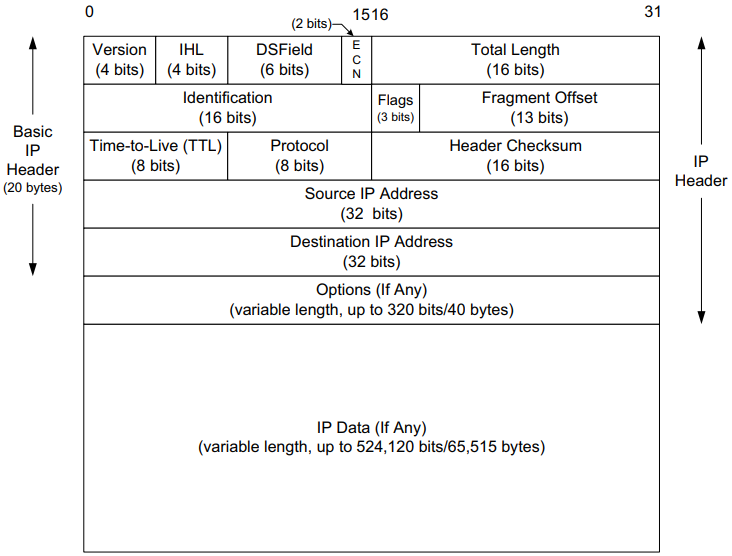

# The Internet Protocol

IP is the workhorse protocol of the TCP/IP protocol suite. All TCP, UDP, ICMP, and IGMP data gets transmitted as IP datagrams. IP provides a best-effort, connection-less datagram delivery service.

## IPv4

- `Version`, it contains the version number of the IP datagram: 4 for IPv4 and 6 for IPv6.
- `Internet Header Length (IHL)`, is the number of 32-bit words in the IPv4 header, including any options.
- `Differentiated Services Field (DSField)`
- `Explicit Congestion Notification (ECN)`
- `Total Length` is the total length of the IPv4 datagram in bytes.
- `Identification` helps identify each datagram sent by an IPv4 host.
- `Flags` 
- `Fragment Offset`
- `Time-to-Live(TTL)` sets an upper limit on the number of routers through which a datagram can pass.
- `Protocol` field in the IPv4 header contains a number indicating the type of data found in the payload portion of the datagram.
- `Header Checksum` field is calculated over the IPv4 header only.
- `Source IP Address` of the sender of the datagram.
- `Destination IP Address` of where the datagram is destined.
- `Options(If Any)` 
- `IP Data(If Any)`

## IPv6

### Headers

- `Version`
- `DSField`
- `ECN`
- `Flow Label`
- `Payload Length`
- `Next Header`
- `Hop Limit`
- `Source IP Address`
- `Destination IP Address`

## Internet Checksum

The Internet checksum is a 16-bit mathematical sum used to determine, with reasonably high probability, whether a received message or portion of a message matches the one sent. Note that the Internet checksum algorithm is not the same as the common `cyclic redundancy check (CRC)`[PB61], which offers stronger protection.

When an IPv4 datagram is received, a checksum is computed across the whole header, including the value of the `Checksum` field itself. Assuming there are no errors, the computed checksum value is always 0 (a one's complement  of the value `FFFF`).

For example:

## Mobile IP

TODO

## Reference

