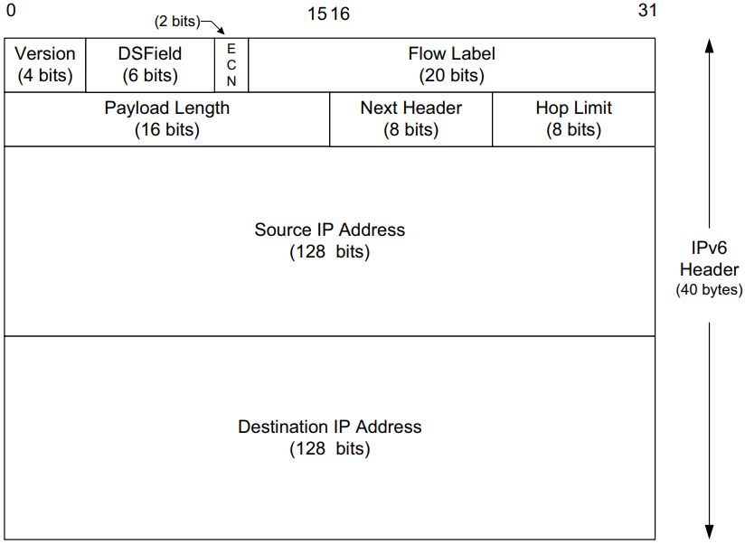

# Internet Protocol (IP)

[TOC]

This note summarizes the Internet Protocol (IPv4 and IPv6): header formats and key fields, fragmentation and reassembly, addressing and basic subnetting, the internet checksum, important operational behaviors (TTL/Hop Limit, PMTUD), and brief Mobile IP remarks. Diagrams are preserved from Kurose & Ross for reference.

## Role of IP

IP is the network‑layer workhorse of the Internet protocol suite. It provides a best‑effort, connectionless datagram service that carries transport protocols (TCP, UDP) and control protocols (ICMP, IGMP). IP does not guarantee delivery, ordering, or duplicate suppression — those are handled by higher layers when needed.

## IPv4 header (overview)

Key IPv4 header fields:

- Version (4 bits): protocol version (4 for IPv4).
- IHL (Internet Header Length, 4 bits): header length in 32‑bit words (min 5, i.e., 20 bytes without options).
- DSField / TOS (8 bits): Differentiated Services / Type of Service for QoS markings.
- ECN (2 bits): Explicit Congestion Notification bits.
- Total Length (16 bits): entire datagram size in bytes (header + data).
- Identification (16 bits): identifies fragments of the same original datagram.
- Flags (3 bits): control fragmentation (DF = don't fragment, MF = more fragments).
- Fragment Offset (13 bits): location of this fragment's data relative to original datagram (in 8‑byte units).
- TTL (Time‑to‑Live, 8 bits): maximum number of hops (routers) the datagram may traverse; decremented by each router.
- Protocol (8 bits): indicates the encapsulated transport protocol (e.g., TCP=6, UDP=17, ICMP=1).
- Header Checksum (16 bits): covers the IPv4 header only; recomputed at each hop if header fields change.
- Source / Destination IP addresses (32 bits each).
- Options (variable): rarely used; extend header functionality (security, routing, timestamps).

Notes:

- Maximum IPv4 datagram size is 65,535 bytes (Total Length field). Larger data must be fragmented at the IP layer or at the sender's transport layer.
- Fragmentation/reassembly imposes performance and reliability costs; avoid fragmentation when possible (Path MTU Discovery).

## Fragmentation and reassembly

- When an IPv4 datagram exceeds a link's MTU, a router (or sender) may fragment it into smaller datagrams. Each fragment carries the same Identification value and appropriate Fragment Offset and MF flag.
- The destination reassembles fragments using Identification and offsets. If fragments are lost, the entire original datagram cannot be reassembled and must be retransmitted by transport (if reliable) or lost.
- The DF (Don't Fragment) flag prevents fragmentation; if set and the MTU is too small, the router drops the packet and sends an ICMP "Fragmentation Needed" message (used by PMTUD).

## Internet checksum (IPv4)

IPv4 uses a 16‑bit one's complement checksum computed over the header. The checksum helps detect header corruption; it does not protect the payload. Routers must recompute the checksum if they modify header fields (for example, decrementing TTL).

Example verification (diagram):

Note: IPv6 removes the header checksum to avoid per‑hop recomputation and improve performance.

## IPv6 differences and header

### Why IPv6?

IPv6 was designed to address IPv4 limitations: vastly larger address space (128‑bit), simpler header processing, improved support for extension headers, and built‑in features for autoconfiguration and mobility.

Key IPv6 header fields:

- Version (4 bits): 6 for IPv6.
- DSField (8 bits) and ECN: QoS fields similar to IPv4.
- Flow Label (20 bits): optional label to identify flows for special handling.
- Payload Length (16 bits): length of payload after the 40‑byte fixed header.
- Next Header (8 bits): identifies the type of the first header after the IPv6 header (transport protocol or extension header).
- Hop Limit (8 bits): like IPv4 TTL; decremented by each router.
- Source / Destination Addresses (128 bits each).

Notable differences from IPv4:

- Fixed 40‑byte IPv6 header (no header checksum, fewer variable fields), which simplifies and speeds up forwarding.
- Fragmentation is only performed by the source host (intermediate routers do not fragment in IPv6). Hosts use Path MTU Discovery to avoid fragmentation.
- Extension headers (Hop-by-Hop, Routing, Fragment, Destination Options, Authentication, Encapsulation) are chained after the main header when needed.

## Addressing and basic subnetting

- IPv4 addresses are 32 bits, commonly expressed in dotted decimal (a.b.c.d). Subnetting uses network prefixes (e.g., /24) to divide address space.
- IPv6 addresses are 128 bits, expressed in hex colon notation and compressed forms (e.g., 2001:db8::/32). IPv6 strongly encourages subnetting by /64 links for SLAAC.

Practical notes:

- Use CIDR (classless inter-domain routing) to allocate and route IPv4 prefixes efficiently.
- For IPv6, prefer stable addressing policies and avoid relying on temporary addresses for long‑term services.

## Path MTU Discovery (PMTUD)

- PMTUD lets endpoints discover the minimum MTU along a path to avoid fragmentation. In IPv4, the sender probes with DF set; routers that cannot forward send ICMP "Fragmentation Needed" messages with the next‑hop MTU.
- In IPv6, fragmentation must be handled by the source, so PMTUD is essential. ICMPv6 carries the "Packet Too Big" message for this purpose.

## Mobile IP (brief)

Mobile IP provides mobility support by allowing a mobile node to receive packets at a care‑of address while maintaining a permanent home address. Mobile IP involves home agents, foreign agents, and tunneling (IP‑in‑IP or other encapsulation). Modern mobility solutions increasingly rely on higher‑layer or network‑based mechanisms, but Mobile IP remains a canonical example in protocols literature.

## References

[1] James F. Kurose and Keith W. Ross. COMPUTER NETWORKING: A Top-Down Approach. 6th ed.
[2] RFC 791 — Internet Protocol (IPv4)
[3] RFC 8200 — Internet Protocol, Version 6 (IPv6) Specification

