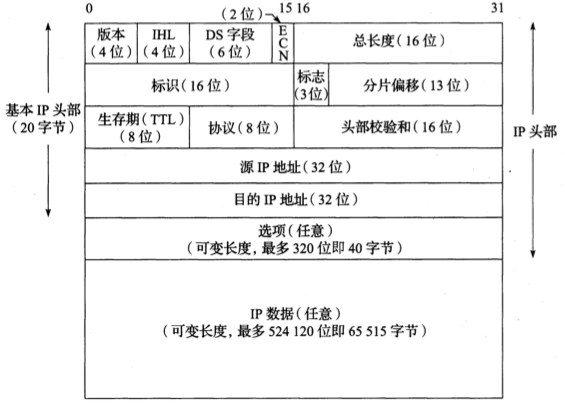
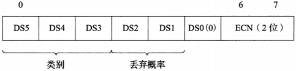

[TOC]

# Internet协议

## IPv4

### 协议头

- 版本（4位）

  - IPv4: 4
  
- IHL（Internet头部长度，仅限IPv4，4位）

  描述32位字的数量，Internet最多$32*15=480$位，即60字
  
- DS字段（服务字段，6位）

- ECN（显式拥塞通知，2位）：标记网络拥堵情况，用于滑动窗口。

- 总长度（16位）：IPv4数据报的总长度（单位：字节），最大$2^{16}=65535$字节

- 标识（16位）：标记数据报ID，自增

- 标志（3位）：

- 分片偏移（13位）：

- 生存期（TTL，8位）：可经过的路由器数量的上限，每过一台路由器就减1，到0就丢弃；一般初始化为64或128或255

- 协议（8位）：

- 头部校验和（Internet校验和，16位）：校验数据报头是否完整

- 源IP地址（32位）

- 目的IP地址（32位）

## IPv6

### 协议头

- 版本（4位）

  - IPv6: 6
- DS字段
- 流标签（20位）
- 负载长度（16位）
- 下一个头部（8位）
- 跳数限制（8位）
- 源IP地址（128位）
- 目的IP地址（128位）

## DS字段

### 结构

- 优先级（3位）：低优先级可以被高优先级抢占，不同优先级有不同的被丢弃概率。共8级

  | 值   | 优先级   |
  | ---- | -------- |
  | 000  | 常规     |
  | 001  | 优先     |
  | 010  | 立即     |
  | 011  | 瞬间     |
  | 100  | 瞬间覆盖 |
  | 101  | 严重     |
  | 110  | 网间控制 |
  | 111  | 网络控制 |

- D（1位）：延时

- T（1位）：吞吐量

- R（1位）：可靠性

## Internet校验和

## 参考

- <<TCP/IP详解>>.卷一.第五章