# IP

[TOC]


`IP(Internet Protocol)`是TCP/IP协议族中的核心协议。所有TCP，UDP，ICMP和IGMP数据都通过IP数据报传输，但是不保证IP数据报能成功到达目的地。

## IPv4

ipv4地址长32bit，通常采用 `Dotted decimal notation(点分十进制)`的方法表示。

### 协议头

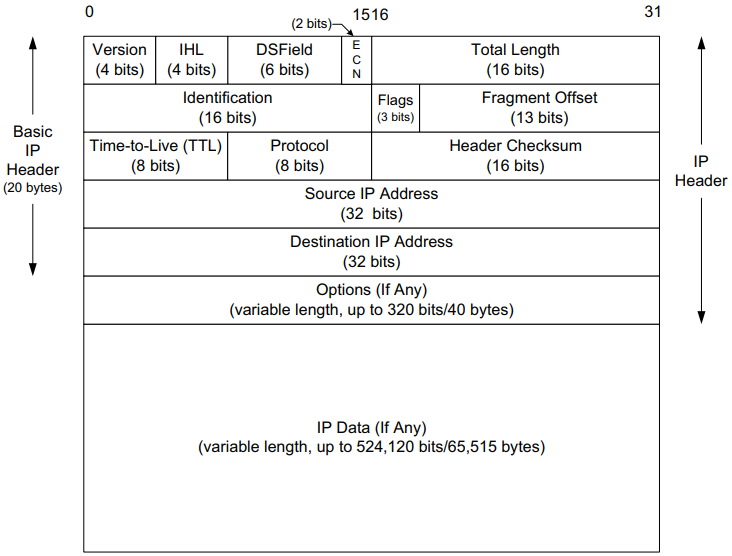

- `版本` IP协议版本，值为4；

- `IHL（Internet头部长度）` 描述32位字的数量，Internet最多$32*15=480$位，即60字；

- `DS字段` 服务字段，详情见[DS字段](#DS字段)

- `ECN（显式拥塞通知）` 标记网络拥堵情况，用于滑动窗口。

- `总长度` IPv4数据报的总长度（单位：字节），最大$2^{16}=65535$字节；

- `标识` 标记数据报ID，自增

- `标志`

- `分片偏移`

- `生存期（TTL）` 可经过的路由器数量的上限，每过一台路由器就减1，到0就丢弃；一般初始化为64或128或255

- `协议`

- `头部校验和` 校验数据报头是否完整，详情见[Internet校验和](#Internet校验和)

- `源IP地址`

- `目的IP地址`

- `选项`

  如果选项存在，它在IPv4分组中紧跟在基本IPv4头部之后。选项由一个8位的类型字段标识。这个字段被细分为3个子字段：复制（1位），类别（2位）和编号（5位）。选项0和1的长度是1字节，多数的其他选项的长度可变。可变选项包括1字节的类型标识符，1字节的长度以及选项自身

  | 名称           | 编号       | 值             | 长度 | 描述                                                                                                                                     | 参考文献                       | 注释             |
  | -------------- | ---------- | -------------- | ---- | ---------------------------------------------------------------------------------------------------------------------------------------- | ------------------------------ | ---------------- |
  | 列表结尾       | 0          | 0              | 1    | 表示没有更多选项                                                                                                                         | `[RFC0791]`                  | 如果需要         |
  | 没有操作       | 1          | 1              | 1    | 表示没有操作执行（用于填充）                                                                                                             | `[RFC0791]`                  | 如果需要         |
  | 源路由         | 3`<br>`9 | 131`<br>`137 | 可变 | 发送方列出分组转发时遍历的路由器“航点”。松散意味着其他路由器可以包含在航点（3，131）中。严格意味着（9，137）中的所有航点都要按顺序遍历 | `[RFC0791]`                  | 很少，经常被过滤 |
  | 安全和处理标签 | 2`<br>`5 | 130`<br>`133 | 11   | 在美国军事环境下如何为IP数据报指定安全标签和处理限制                                                                                     | `[RFC1108]`                  | 历史的           |
  | 记录路由       | 7          | 7              | 可变 | 在分组的头部中记录经过的路由器                                                                                                           | `[RFC0791]`                  | 很少             |
  | 时间戳         | 4          | 68             | 可变 | 在分组的源和目的地记录日期和时间                                                                                                         | `[RFC0791]`                  | 很少             |
  | 流ID           | 8          | 136            | 4    | 携带16位的SATNET流标识符                                                                                                                 | `[RFC0791]`                  | 历史的           |
  | EIP            | 17         | 145            | 可变 | 扩展Internet协议                                                                                                                         | `[RFC1385]`                  | 历史的           |
  | 跟踪           | 18         | 82             | 可变 | 增加一个路由跟踪选项和ICMP报文                                                                                                           | `[RFC1393]`                  | 历史的           |
  | 路由器警告     | 20         | 148            | 4    | 表示一个路由器需要解释数据报的内容                                                                                                       | `[RFC2113]<br>``[RFC5350]` | 偶然             |
  | 快速启动       | 25         | 25             | 8    | 表示启动快速传输协议（实验性的）                                                                                                         | `[RFC4782]`                  | 很少             |

### 空间划分

| 类 | 地址范围                  | High-Order Bits | Use             | Fraction of Total | Number of Nets | Number of Hosts |
| -- | ------------------------- | --------------- | --------------- | ----------------- | -------------- | --------------- |
| A  | 0.0.0.0~127.255.255.255   | 0               | Unicast/special | 1/2               | 128            | 16,777,216      |
| B  | 128.0.0.0~191.255.255.255 | 10              | Unicast/special | 1/4               | 16,384         | 65536           |
| C  | 192.0.0.0~223.255.255.255 | 110             | Unicast/special | 1/8               | 2,097,152      | 256             |
| D  | 224.0.0.0~239.255.255.255 | 1110            | Multicast       | 1/16              | N/A            | N/A             |
| E  | 240.0.0.0~255.255.255.255 | 1111            | Reserved        | 1/16              | N/A            | N/A             |


## IPv6

ipv6地址长128bit，传统表示方法是采用称为块或字段的4个16进制数，以及冒号分隔。

ipv6的简化表示方法标准：

1. 一个块中前导的零不必书写
2. 全零的块可以省略
3. 在ipv6格式中潜入ipv4地址可使用混合符号形式，紧接着ipv4部分的地址块的值`ffff`，地址的其余部分使用点分四组格式
4. ipv6地址的低32位通常采用点分四组表示法。

### 协议头

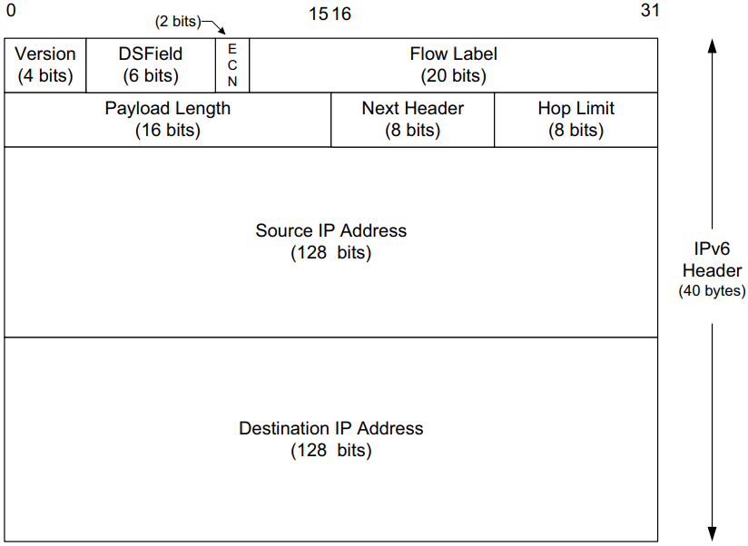

- `版本` IP协议版本，值为6；
- `DS字段` 服务字段，详情见[DS字段](#DS字段)；
- `ECN` 显式拥塞通知，标记网络拥堵情况，用于滑动窗口；

- `流标签`
- `负载长度`
- `下一个头部`
- `跳数限制`
- `源IP地址`
- `目的IP地址`

### 扩展头部

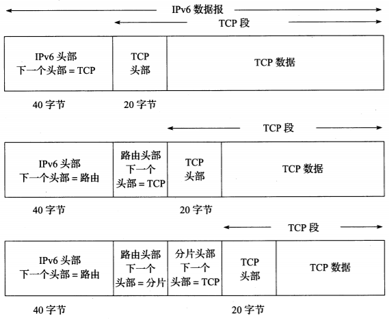

`扩展头部(extension header)`用`下一个头部`字段形成一个链。链中的头部可以是IPv6扩展头部或传输层头部。IPv6头部出现在数据报的开头，并且长度始终为40字节

IPv6下一个头部字段值可能表示扩展头部或其他协议头部。在适当的情况下，它与IPv4协议字段使用相同值

| 头部类型               | 顺序 | 值   |
| ---------------------- | ---- | ---- |
| IPv6头部               | 1    | 41   |
| 逐跳选项（HOPOPT）     | 2    | 0    |
| 目的地选项             | 3，8 | 60   |
| 路由                   | 4    | 43   |
| 分片                   | 5    | 44   |
| 封装安全载荷（ESP）    | 7    | 50   |
| 认证（AH）             | 6    | 51   |
| 移动（MIPv6）          | 9    | 135  |
| （无--没有下一个头部） | 最后 | 59   |
| ICMPv6                 | 最后 | 58   |
| UDP                    | 最后 | 17   |
| TCP                    | 最后 | 6    |
| 各种其他高层协议       | 最后 | -    |

### 选项

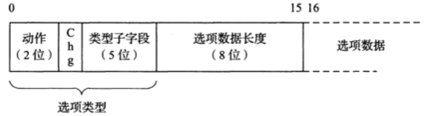

*逐跳选项和目的地址项编码为TLV集合（`类型-长度-值`）。第一字节给出了选项类型，包括一些子字段，在选项没被识别时指示一个IPv6节点如何动作，以及在数据报转发时选项数据是否改变。`选项数据长度`字段给出了选项数据的字节长度*

一个IPv6的TLV选项类型的2个高序位，表示如果这个选项没有被识别，一个IPv6节点是转发还是丢弃该数据报，以及是否向发送方返回一个消息，提示这个数据报的处理结果

| 值   | 动作                                                       |
| ---- | ---------------------------------------------------------- |
| 00   | 跳过选项，继续处理                                         |
| 01   | 丢弃这个数据报（沉默）                                     |
| 10   | 丢弃这个数据报，并向源地址发送一个“ICMPv6参数问题”消息     |
| 11   | 与10相同，但仅在分组的目的地不是组播时，发送这个ICMPv6消息 |

IPv6选项携带在逐跳（H）选项或目的地（D）选项扩展头部中。选项类型字段包含来自“类型”列以及动作和改变子字段中的二进制值。

| 选项名       | 头部 | 动作 | 改变 | 类型 | 长度 | 参考文献    |
| ------------ | ---- | ---- | ---- | ---- | ---- | ----------- |
| 填充1        | HD   | 00   | 0    | 0    | N/A  | `[RFC2460]` |
| 填充N        | HD   | 00   | 0    | 1    | 可变 | `[RFC2460]` |
| 超大有效载荷 | H    | 11   | 0    | 194  | 4    | `[RFC2675]` |
| 隧道封装限制 | D    | 00   | 0    | 4    | 4    | `[RFC2473]` |
| 路由器警告   | H    | 00   | 0    | 5    | 4    | `[RFC2711]` |
| 快速启动     | H    | 00   | 1    | 6    | 8    | `[RFC4782]` |
| CALIPSO      | H    | 00   | 0    | 7    | 8+   | `[RFC5570]` |
| 家乡地址     | D    | 11   | 0    | 201  | 16   | `[RFC6275]` |

- 填充1和填充N

  由于IPv6选项需要与8字节的偏移量对齐，因此较小的选项用0填充到长度为8字节，有以下2个填充选项：

  - 填充1（类型0）：唯一缺少长度字段和值字段的选项；仅有1字节长，取值为0。
  - 填充N（类型1）：向头部的选项区域填充2字节或更多字节；对于n个填充字节，选项数据长度字段包含的值为(n-2)。

- 超大有效载荷

  `超大报文`:指定一种有效载荷大于65535字节的IPv6数据报。

- 隧道封装限制：是否限制隧道封装

  `隧道`:将一个协议封装在另一个协议中，隧道可以嵌套。

- 路由器警告: 指出数据报包含需要路由器处理的信息。

- 快速启动（QS）

- CALIPSO：用于在某些专用网络中支持**通用体系结构标签IPv6安全选项**，提供了一种为数据报做标记的方法，包括一个安全级别标识符和一些额外的信息。

- 家乡地址

### 路由头部

IPv6数据报控制机制，以控制（至少部分控制）数据报通过网络的路径。有2个版本：

- ~~类型0（RH0）~~
- 类型2（RH2）

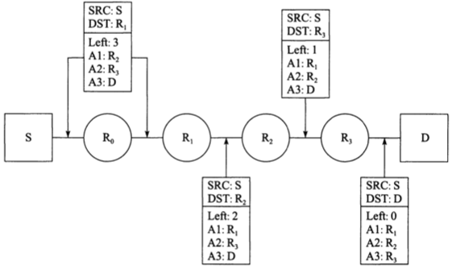

*通过一个IPv6路由头部（RH0），发送方（S）可指定数据报经过中间节点$R_2$和$R_3$。经过的其他节点由正常IPv6路由来确定。注意，在经过路由头部指定的每个跳步时，IPv6头部中的目的地址将会更新*

#### inet6_rth_space

```c++
#include <netinet/in.h>
socklen_t inet6_rth_space(int type, int segments);
```

- `type`类型

- `segments`网段总数

- `返回值`

  成功：字节数（正数）

  失败：0

返回容纳一个指定类型和网段总数的路由首部所需的字节数。

#### inet6_rth_init

```c++
#include <netinet/in.h>
void *inet6_rth_init(void *rthbuf, socklen_t rthlen, 
                     int type, int segments);
```

- `rthbuf`缓冲区

- `rthlen`缓冲区长度

- `type`类型

- `segments`网段总数

- `返回值`

  成功：指向缓冲区的指针

  失败：NULL

初始化指定的缓冲区，以容纳一个类型为type值且网段总数为segments值的路由首部。

#### inet6_rth_add

```c++
#include <netinet/in.h>
int inet6_rth_add(void *rthbuf, const struct in6_addr *addr);
```

- `rthbuf`缓冲区

- `addr`地址

- `返回值`

  成功：0

  失败：-1

把由addr指向的IPv6地址加到构建中的路由首部的末尾。

#### inet6_rth_reverse

```c++
#include <netinet/in.h>
int inet6_rth_reverse(const void *in, void *out);
```

- `in`传入缓冲区

- `out`返回缓冲区

- `返回值`

  成功：0

  失败：-1

根据in中存放的接收路由首部创建一个新的路由首部，并放入out中（in和out可以为同一个缓冲区）。

#### inet6_rth_seqments

```c++
#include <netinet/in.h>
int inet6_rth_seqments(const void *rthbuf);
```

- `rthbuf`存放路由首部的缓冲区

- `返回值`

  成功：网段数目

  失败：-1

返回路由首部中的网段数目。

#### inet6_rth_getaddr

```c++
#include <netinet/in.h>
struct in6_addr *inet6_rth_getaddr(const void *rthbuf, int index);
```

- `rthbuf`缓冲区

- `index`索引

- `返回值`

  成功：指向IPv6地址的指针

  失败：NULL

返回由rthbuf所指路由首部中索引号为index的那个IPv6地址。

### 分片头部

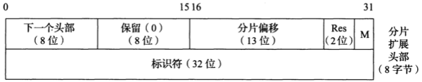

*IPv6分片头部包含一个32位的`标识符`字段（它是IPv4中`标识符`字段的两倍）。M位字段表明该分片是否为原始数据报的最后一个分片。与IPv4一样，`分片偏移`字段给出了有效载荷在原始数据报中以8字节为单位的偏移量*

- `分片偏移` 表明数据以8字节为单位的偏移量放置在分片头部之后。
- `Res`
- `M`
  - 1 表示在数据报中包含更多分片
  - 0 表示该分片是原始数据报的最后一个分片
- `标识符`


## DS字段

### 结构


*DS字段包含6位（其中5位当前是标准的，表示当接收的数据报应转发时，可由一台兼容的路由器转发）。后面2位用作ECN，当数据报通过持续拥塞的路由器时设置。当这些数据报到达目的地时，稍后发送一个包含拥塞指示的数据报给发送方，通知改数据报经过一台或多台拥塞的路由器*

- `优先级` 低优先级可以被高优先级抢占，不同优先级有不同的被丢弃概率。共8级：

  | 值  | 优先级   |
  | --- | -------- |
  | 000 | 常规     |
  | 001 | 优先     |
  | 010 | 立即     |
  | 011 | 瞬间     |
  | 100 | 瞬间覆盖 |
  | 101 | 严重     |
  | 110 | 网间控制 |
  | 111 | 网络控制 |
  
- `D` 延时

- `T` 吞吐量

- `R` 可靠性

- `保留（0）`

  如果选项存在，它在IPv4分组中紧跟在基本IPv4头部之后。选项由一个8位的类型字段标识。这个字段被细分为3个子字段：复制(1位)，类别(2位)和编号(5位)。选项0和1的长度是1字节，多数的其他选项的长度可变。可变选项包括1字节的类型标识符，1字节的长度以及选项自身

  | 名 称          | 编号   | 值         | 长度 | 描述                                                         | 参考文献                   | 注释             |
  | -------------- | ------ | ---------- | ---- | ------------------------------------------------------------ | -------------------------- | ---------------- |
  | 列表结尾       | 0      | 0          | 1    | 表示没有更多选项                                             | `[RFC0791]`                | 如果需要         |
  | 没有操作       | 1      | 1          | 1    | 标识没有操作执行（用于填充）                                 | `[RFC0791]`                | 如果需要         |
  | 源路由         | 3<br>9 | 131<br>137 | 可变 | 发送方列出分组转发时遍历的路由器“航点”。松散意味着其他路由器可以包含在航点（3，131）中。严格意味着（9，137）中的所有航点都要按顺序遍历 | `[RFC0791]`                | 很少，经常被过滤 |
  | 安全和处理标签 | 2<br>5 | 130<br>133 | 11   | 在美国军事环境下如何为IP数据报指定安全标签和处理限制         | `[RFC1108]`                | 历史的           |
  | 记录路由       | 7      | 7          | 可变 | 在分组的头部中记录经过的路由器                               | `[RFC0791]`                | 很少             |
  | 时间戳         | 4      | 68         | 可变 | 在分组的源和目的地记录日期和时间                             | `[RFC0791]`                | 很少             |
  | 流ID           | 8      | 136        | 4    | 携带16位的SATNET流标识符                                     | `[RFC0791]`                | 历史的           |
  | EIP            | 17     | 145        | 可变 | 扩展Internet协议（20世纪90年代早期的一个实验）               | `[RFC1385]`                | 历史的           |
  | 跟踪           | 18     | 82         | 可变 | 增加一个路由跟踪选项和ICMP报文（20世纪90年代早期的一个实验） | `[RFC1393]`                | 历史的           |
  | 路由器警告     | 20     | 148        | 4    | 标识一个路由器需要解释数据报的内容                           | `[RFC2113]`<br>`[RFC5350]` | 偶然             |
  | 快速启动       | 25     | 25         | 8    | 标识启动快速传输协议（实验性的）                             | `[RFC4782]`                | 很少             |

服务代码点（DSCP）值被分成3个池：

| 池   | 代码点前缀 | 策略        |
| ---- | ---------- | ----------- |
| 1    | `xxxxx0`   | 标准的      |
| 2    | `xxxx11`   | `EXP/LU`    |
| 3    | `xxxx01`   | `EXP/LU(*)` |

DS字段值设计为兼容服务类型和IPv6流量类别字段中指定的IP优先级子字段。AF和EF提供比简单的“尽力而为”更好的服务

| 名称        | 值     | 参考文献    | 描述                                   |
| ----------- | ------ | ----------- | -------------------------------------- |
| CS0         | 000000 | `[RFC2474]` | 类别选择（尽力而为/常规）              |
| CS1         | 001000 | `[RFC2474]` | 类别选择（优先）                       |
| CS2         | 010000 | `[RFC2474]` | 类别选择（立即）                       |
| CS3         | 011000 | `[RFC2474]` | 类别选择（瞬间）                       |
| CS4         | 100000 | `[RFC2474]` | 类别选择（瞬间覆盖）                   |
| CS5         | 101000 | `[RFC2474]` | 类别选择（CRITIC/ECP）                 |
| CS6         | 110000 | `[RFC2474]` | 类别选择（网间控制）                   |
| CS7         | 111000 | `[RFC2474]` | 类别选择（控制）                       |
| AF11        | 001010 | `[RFC2597]` | 保证转发（1，1）                       |
| AF12        | 000000 | `[RFC2597]` | 保证转发（1，2）                       |
| AF13        | 001100 | `[RFC2597]` | 保证转发（1，3）                       |
| AF21        | 010010 | `[RFC2597]` | 保证转发（2，1）                       |
| AF22        | 010100 | `[RFC2597]` | 保证转发（2，2）                       |
| AF23        | 010110 | `[RFC2597]` | 保证转发（2，3）                       |
| AF31        | 011010 | `[RFC2597]` | 保证转发（3，1）                       |
| AF32        | 011100 | `[RFC2597]` | 保证转发（3，2）                       |
| AF33        | 011110 | `[RFC2597]` | 保证转发（3，3）                       |
| AF41        | 100010 | `[RFC2597]` | 保证转发（4，1）                       |
| AF42        | 100100 | `[RFC2597]` | 保证转发（4，2）                       |
| AF43        | 100110 | `[RFC2597]` | 保证转发（4，3）                       |
| EF PHB      | 101110 | `[RFC3246]` | 加速转发，应享受较低的延时，抖动和丢包 |
| VOICE-ADMIT | 101100 | `[RFC5865]` | 容量许可的流量                         |

**(i,j)表示中,i,j分别表示流量类别和丢弃优先级**


## Internet校验和

Internet校验和是一个被校验数据（如果被计算的字节数为奇数，用0填充）的16位反码和的反码。如果被计算数据包括一个校验和字段，该字段在进行校验和运算之前被设置为0，然后将计算出的校验和填充到该字段。为了检查一个包含校验和字段（头部，有效载荷等）的数据输入是否有效，需要对整个数据块（包括检验和字段）同样计算校验和。由于校验和字段本质上是其余数据校验和的反码，对正确接收的数据计算校验和应产生一个值0；例：


## 分类寻址

- A类

  | 1bit | 7bit              | 24bit       |
  | ---- | ----------------- | ----------- |
  | 0    | 网络号-Net Number | 主机号-Host |

- B类

  | 1bit | 1bit | 14bit             | 16bit       |
  | ---- | ---- | ----------------- | ----------- |
  | 1    | 0    | 网络号-Net Number | 主机号-Host |

- C类

  | 1bit | 1bit | 1bit | 21bit             | 8bit        |
  | ---- | ---- | ---- | ----------------- | ----------- |
  | 1    | 1    | 0    | 网络号-Net Number | 主机号-Host |

- D类

  | 1bit | 1bit | 1bit | 1bit | 28bit                      |
  | ---- | ---- | ---- | ---- | -------------------------- |
  | 1    | 1    | 1    | 0    | 多播组号-Multicast Address |

- E类

  | 1bit | 1bit | 1bit | 1bit | 1bit | 28bit         |
  | ---- | ---- | ---- | ---- | ---- | ------------- |
  | 1    | 1    | 1    | 1    | 0    | 保留-Reserved |

A, B, C类用于单播


## 子网掩码

由一台主机或路由器实用的分配位，以确定如何从一台主机对应IP地址中获得网络和子网信息。

例，一个IP地址与子网掩码按位与操作：


### 可变长度子网掩码

可变长度子网掩码(VLSM)，可用于分割一个网络号，使每个子网支持不同数量的主机。每个路由器和主机除了IP地址，还需要配置一个子网掩码。大多数软件支持VLSM，除了一些旧的路由协议（例如RIP版本1）。

例，使用VLSM分割一个网络号，使每个子网支持不同数量的:


- `/24`: 允许 `32-24=8`位（256台主机）
- `/25`: 允许 `32-25=7位`（128台主机）
- `/26`: 允许 `32-26=6`位（64台主机）

### 广播地址

先将子网掩码取反，然后与ipv4进行或运算得到子网广播地址；

例：

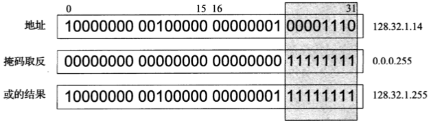

*子网广播地址由子网掩码首先取反，然后与IPv4地址进行或运算构建而成。在这种情况下，一个/24的子网掩码，剩余的32-24=8位设置为1，得到一个十进制255和子网广播地址128.32.1.255*

**注意:上面的广播叫做定向广播，目前在Internet中被禁用，其根本不会被路由器转发。**

### 组播地址

- IPv4

  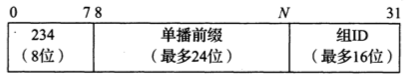

  *IPv4的`UBM(基于单播前缀的组播寻址)`地址格式。为单播地址分配/24或更短的前缀，关联的组播地址分配基于前缀234/8，分配的单播前缀和组播组ID的串联。因此，较短的单播前缀分配包含更多单播和组播地址。*

  | 范围（包含）                                               | 特殊用途                            | 参考文献                 |
  | ---------------------------------------------------------- | ----------------------------------- | ------------------------ |
  | `224.0.0.0~224.0.0.255`                                    | 本地网络控制；不转发                | [RFC5771]                |
  | `224.0.1.0~224.0.1.255`                                    | 互联网络孔子；正常转发              | [RFC5771]                |
  | `224.0.2.0~224.0.255.255`                                  | Ad hoc块1                           | [RFC5771]                |
  | `224.1.0.0~224.1.255.255`                                  | 保留                                | [RFC5771]                |
  | `224.2.0.0~224.2.255.255`                                  | SDP/SAP                             | [RFC4566]                |
  | `224.3.0.0~224.4.255.255`                                  | Ad hoc 块2                          | [RFC5771]                |
  | `224.5.0.0~224.255.255.255`                                | 保留                                | [IP4MA]                  |
  | `225.0.0.0~231.255.255.255`                                | 保留                                | [IP4MA]                  |
  | `232.0.0.0~233.255.255.255`                                | 源特定组播(SSM)                     | `[RFC4607][RFC4608]`     |
  | `233.0.0.0~233.251.255.255`                                | GLOP                                | [RFC3180]                |
  | `233.252.0.0~233.255.255.255`                              | Ad hoc块3(233.252.0.0/24为文档保留) | [RFC5771]                |
  | `234.0.0.0~234.255.255.255`<br>`235.0.0.0~238.255.255.255` | 基于单播前缀的IPv4组播地址保留      | `[RFC6034]`<br>`[IP4MA]` |
  | `239.0.0.0~239.255.255.255`                                | 管理范围                            | [RFC2365]                |

- IPv6

  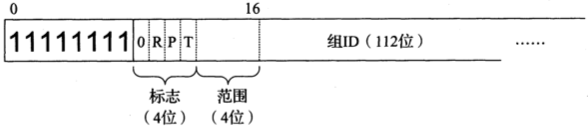

  *基本的IPv6组播地址格式包括4个标志位（0，保留：R，包含会合点；P，使用单播前缀；T，是临时的）。4位范围值表示组播的范围（全球，本地等）。组ID编码在低序的112位中。如果P或R位被设置，则使用一种代替格式*

  IPv6范围字段的值：

  | 值    | 范围          |
  | ----- | ------------- |
  | 0     | 保留          |
  | 1     | 接口/机器本地 |
  | 2     | 链路/子网本地 |
  | 3     | 保留          |
  | 4     | 管理          |
  | 5     | 站点本地      |
  | `6~7` | 未分配        |
  | 8     | 组织本地      |
  | `9~d` | 未分配        |
  | e     | 全球          |
  | f     | 保留          |

  IPv6组播地址标志：

  | 位字段（标志） | 含义                                         | 参考文献  |
  | -------------- | -------------------------------------------- | --------- |
  | R              | 会合点（RP）标志（0，常规的；1.包括RP地址）  | [RFC3956] |
  | P              | 前缀标志（0，常规的；1，基于单播前缀的地址） | [RFC3306] |
  | T              | 临时标志（0，永久分配的；1，临时的）         | [RFC4291] |

  IPv6组播地址空间中的保留地址

  | 地址              | 范围       | 特殊用途                | 参考文献  |
  | ----------------- | ---------- | ----------------------- | --------- |
  | ff01::1           | 节点       | 所有节点                | [RFC4291] |
  | ff01::2           | 节点       | 所有路由器              | [RFC4291] |
  | ff01::fb          | 节点       | mDNSv6                  | [IDChes]  |
  | ff02::1           | 链路       | 所有节点                | [RFC4291] |
  | ff02::2           | 链路       | 所有路由器              | [RFC4291] |
  | ff02::4           | 链路       | DVMRP路由器             | [RFC1075] |
  | ff02::5           | 链路       | OSPFIGP                 | [RFC2328] |
  | ff02::6           | 链路       | 基于OSPFIGP设计的路由器 | [RFC2328] |
  | ff02::9           | 链路       | RIPng路由器             | [RFC2080] |
  | ff02::a           | 链路       | EIGRP路由器             | [EIGRP]   |
  | ff02::d           | 链路       | PIM路由器               | [RFC5059] |
  | ff02::16          | 链路       | 支持MLDv2的路由器       | [RFC3810] |
  | ff02::6a          | 链路       | 所有探测器              | [RFC4286] |
  | ff02::6d          | 链路       | LL-MANET路由器          | [RFC5498] |
  | ff02::fb          | 链路       | mDNSv6                  | [IDChes]  |
  | ff02::1:2         | 链路       | 所有DHCP代理            | [RFC3315] |
  | ff02::1:3         | 链路       | LLMNR                   | [RFC4795] |
  | ff02::1:ffxx:xxxx | 链路       | 请求节点地址范围        | [RFC4291] |
  | ff05::2           | 站点       | 所有路由器              | [RFC4291] |
  | ff05::fb          | 站点       | mDNSv6                  | [IDChes]  |
  | ff05::1:3         | 站点       | 所有DHCP服务器          | [RFC3315] |
  | ff0x::            | 可变的     | 保留                    | [RFC4291] |
  | ff0x::fb          | 可变的     | mDNSv6                  | [IDChes]  |
  | ff0x::101         | 可变的     | NTP                     | [RFC5905] |
  | ff0x::133         | 可变的     | 聚合服务器访问协议      | [RFC5352] |
  | ff0x::18c         | 可变的     | 所有AC的地址（CAPWAP）  | [RFC5415] |
  | ff3x::/32         | （特殊的） | SSM块                   | [RFC4607] |


## 地址转换

### IPv4与IPv6地址转换

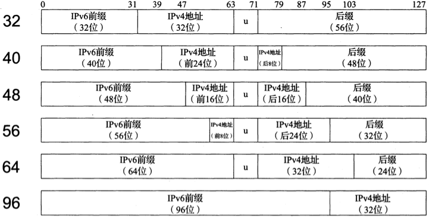

*IPv4地址可以嵌入IPv6地址中，形成一个嵌入IPv4的IPv6地址。有6种不同的格式可用，这取决于使用的IPv6前缀长度。众所周知的前缀64:ff9b::/96可用于IPv4和IPv6单播地址之间的自动转换。*

### gethostbyname 根据域名查找主机地址

```c++
#include <netdb.h>
struct hostend *gethostbyname(const char *hostname);
```

- `hostname`域名

- `返回值`

  成功：返回hostent指针

  ```c++
  struct hostent {
      char  *h_name;
      char **h_aliases;
      int    h_addrtype;
      int    h_length;
      char **h_addr_list;
  }
  ```

  失败：返回NULL，并设置`<netdb.h>`中的全局变量`h_errno`为以下值之一：

  - HOST_NOT_FOUND；
  - TRY_AGAIN；
  - NO_RECOVERY；
  - NO_DATA。

根据域名查找主机地址，它执行的是对A记录的查询，所以只能返回IPv4地址。

### gethostbyaddr 根据二进制IP地址查询主机名

```c++
#include <netdb.h>
struct hostent *gethostbyaddr(const char *addr, socklen_t len, int family);
```

- `addr`指向存放IPv4地址的某个in_addr结构的指针

- `len`结构的大小

- `family`地址类型，IPv4：AF_INET

- `返回值`

  成功：非空指针

  失败：NULL

根据二进制IP地址查询主机名。

### getservbyname 根据名字查找服务

```c++
#include <netdb.h>
struct servent *getservbyname(const char *servname, const char *protoname);
```

- `servname`服务名

- `protoname`协议名

- `返回值`

  成功：

  ```c++
  struct servent {
      char  *s_name;
      char **s_aliases;
      int    s_port;
      char  *s_proto;
  };
  ```

  失败：NULL

根据给定名字查找相应服务。

### getservbyport 根据端口号和可选协议查找服务

```c++
#include <netdb.h>
struct servent *getservbyport(int port, const char *protoname);
```

- `port`端口号

- `protoname`协议名

- `返回值`

  成功：非空指针；

  失败：NULL。

根据给定端口号和可选协议查找相应服务。

### getaddrinfo  根据主机名和端口查找地址信息

```c++
#include <netdb.h>
int getaddrinfo(const char *hostname, const char *service, 
                const struct addrinfo *hints, struct addrinfo **result);
```

- `hostname`主机名或地址串（IPv4：点分十进制；IPv6：十六进制数串）

- `service`服务名或十进制端口数串

- `hints` 指向addrinfo结构的指针（可选），结构体中的以下成员可以被设置：

  - `ai_flags`

    | ai_flags值     | 含义                                                         |
    | -------------- | ------------------------------------------------------------ |
    | AI_PASSIVE     | 套接字将用于被动打开。                                       |
    | AI_CANONNAME   | 告知getaddrinfo函数返回主机的规范名字。                      |
    | AI_NUMERICHOST | 防止任何类型的名字到地址映射，hostname参数必须是一个地址串。 |
    | AI_NUMERICSERV | 防止任何类型的名字到服务映射，service参数必须是一个十进制端口号数串。 |
    | AI_V4MAPPED    | 如果同时指定ai_family成员的值为AF_INET6，那么如果没有可用的`AAAA`记录，就返回与`A`记录对应的IPv4映射的IPv6地址。 |
    | AI_ALL         | 如果同时指定AI_V4MAPPED标志，那么除了返回与AAAA记录对应的IPv6地址外，还返回与A记录对应的IPv4映射的IPv6地址。 |
    | AI_ADDRCONFIG  | 按照所在主机的配置选择返回地址类型，也就是只查找与所在主机回馈接口以外的网络接口配置的IP地址版本一致的地址。 |

  - `ai_family`

  - `ai_socktype`

  - `ai_protocol`

- `result` 指向成员为addrinfo的链表，在以下情况下，该链表的成员个数大于1个：

  - 如果与`hostname`参数关联的地址有多个，那么适用于所请求地址族（可通过hints结构的ai_family成员设置）的每个地址都返回一个对应的结构；
  - 如果`service`参数指定的服务支持多个套接字类型，那么每个套接字类型都可能返回一个对应的结构，具体取决于`hints`结构的`ai_socktype`成员。

- `返回值`

  - 成功：0
  - 失败：非0

根据主机名和端口返回一个指向addrinfo结构链表的指针。

### gai_strerror 查找非0错误的字符串描述符

```c++
#include <netdb.h>
const char *gai_strerror(int error);
```

- `error`错误ID

- `返回值`错误消息字符串描述符

  | 常值         | 说明                                        |
  | ------------ | ------------------------------------------- |
  | EAI_AGAIN    | 名字解析中临时失败                          |
  | EAI_BADFLAGS | ai_flags的值无效                            |
  | EAI_FAIL     | 名字解析中不可恢复地失败                    |
  | EAI_FAMILY   | 不支持ai_family                             |
  | EAI_MEMORY   | 内存分配失败                                |
  | EAI_NONAME   | hostname或service未提供，或者不可知         |
  | EAI_OVERFLOW | 用户参数缓冲区溢出（仅限getnameinfo()函数） |
  | EAI_SERVICE  | 不支持ai_socktype类型的service              |
  | EAI_SOCKTYPE | 不支持ai_socktype                           |
  | EAI_SYSTEM   | 在errno变量中由系统错误返回                 |

返回非0错误的字符串描述符。

### freeaddrinfo 释放地址空间

```c++
#include <netdb.h>
void freeaddrinfo(struct addrinfo *ai);
```

- `ai`一个指向addrinfo链表的指针

释放由getaddrinfo返回的存储空间。

### getnameinfo 查找主机和服务

```c++
#include <netdb.h>
int getnameinfo(const struct sockaddr *sockaddr, socklen_t addrlen,
                char *host, socklen_t hostlen,
                char *serv, socklen_t servlen, int flags);
```

- `sockaddr`套接字地址

- `addrlen`套接字地址长度

- `host`用于返回的主机字符串

- `hostlen`主机字符串长度

- `serv`用于返回的服务字符串

- `servlen`服务字符串长度

- `flags`标志信息

  | 标志            | 说明                             |
  | --------------- | -------------------------------- |
  | NI_DGRAM        | 数据报服务                       |
  | NI_NAMEREQD     | 若不能从地址解析出名字则返回错误 |
  | NI_NOFQDN       | 只返回FQDN的主机名部分           |
  | NI_NUMERICHOST  | 以数串格式返回主机字符串         |
  | NI_NUMERICSCOPE | 以数串格式返回范围标识字符串     |
  | NI_NUMERICSERV  | 以数串格式返回服务字符串         |

- `返回值`

  成功：0

  失败：非0

返回套接字地址的主机（字符串）和服务（字符串）。


## IP选项

### IPv4选项

`源路径（source route）`是由IP数据报的发送者指定的一个IP地址列表。

IPv4源路径称为`源和记录路径（source and record routes，SSR，其中LSSR表示宽松的选项，SSRR表示严格的选项）`。

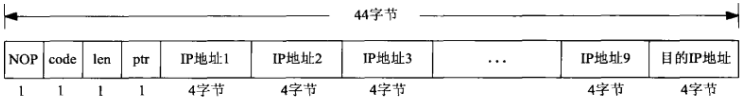

*向内核传递的源路径*

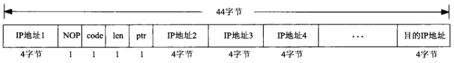

*getsockopt返回的源路径选项格式*

### IPv6选项

IPv6首部可以后跟如下几种可选的扩展首部（extention header）：

- 步跳选项（hop_by_hop options）
- 目的地选项（destination options）
- 路径首部（routing header）
- 分片首部（fragmentation header）
- 认证首部（authentication header, AH）
- 安全净荷封装（encapsulating security payload, ESP）

#### 步跳选项

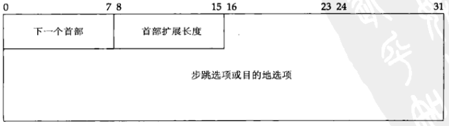

*步跳选项和目的地选项的格式*

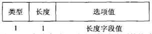

*个体步跳选项或目的地选项的格式*

- `类型（type）` 8bit，用于指定选项值类型

  | 高序前2位                                                    | 高序第3位                                                  | 低序5位                                 |
  | ------------------------------------------------------------ | ---------------------------------------------------------- | --------------------------------------- |
  | - 00 跳过本选项，继续处理本首部。<br>- 01 丢弃本分组。<br>- 00 丢弃本分组，并且不论本分组的目的地址是否为一个多播地址，均发送一个ICMP参数问题类型2错误给发送者。<br>- 00 丢弃本分组，并且只在本分组的目的地址不是一个多播地址的前期下，发送一个ICMP参数问题类型2错误给发送者 | - 0 选项数据在途中无变化。<br>- 1 选项数据在途中可能变化。 | 指定选项本身，需要与高序前3位共同标识。 |

- `长度（length）`指定选项值的长度（不包括`类型`和`长度`字段长）

- `选项值（value）`

  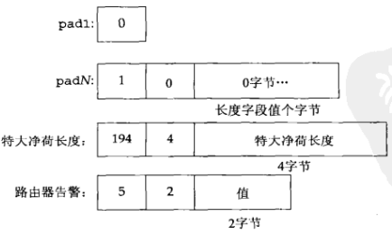

#### inet6_opt_init

```c++
#include <netinet/in.h>
int inet6_opt_init(void *extbuf, socklen_t extlen);
```

- `extbuf`扩展缓冲区

- `extlen`扩展缓冲区长（8的倍数）

- `返回值`

  成功：容纳一个空扩展首部所需的字节数

  失败：-1

*返回容纳一个空扩展首部所需的字节数*

#### inet6_opt_append

```c++
#include <netinet/in.h>
int inet6_opt_append(void *extbuf, socklen_t extlen, 
                     int offset, uint8_t type, socklen_t len,
                     uint8_t align, void **databufp);
```

- `extbuf`扩展缓冲区

- `extlen`扩展缓冲区长（8的倍数）

- `offset`缓冲区偏移量，必须是某个inet6_opt_init或inet6_opt_append调用的返回值

- `type`选项类型

- `len`选项长度

- `align`对齐要求（不需要显式指定）

- `databufp`用于返回指向所添加选项值的填写位置的一个指针

- `返回值`

  成功：添加指定的个体选项后更新的扩展首部总长度

  失败：-1

*返回添加指定的个体选项后更新的扩展首部总长度*

#### inet6_opt_finish

```c++
#include <netinet/in.h>
int inet6_opt_finish(void *extbuf, socklen_t extlen, int offset);
```

- `extbuf`扩展缓冲区

- `extlen`扩展缓冲区长（8的倍数）

- `offset`缓冲区偏移量，必须是某个inet6_opt_init或inet6_opt_append调用的返回值

- `返回值`

  成功：完成设置后更新的扩展首部总长度

  失败：-1

*结束一个扩展首部的设置，添加填充使得总长度为8的倍数*

#### inet6_opt_set_val

```c++
#include <netinet/in.h>
int inet6_opt_set_val(void *databuf, int offset,
                      const void *val, socklen_t vallen);
```

- `databuf` 缓冲区
- `offset`缓冲区偏移量，必须是某个inet6_opt_init或inet6_opt_append调用的返回值
- `val`复制到选项值缓冲区中的值
- `vallen`复制到选项值缓冲区中的值长度
- `返回值` date_buf中新的偏移

*把给定的选项值复制到由inet6_opt_append返回的数据缓冲区中*

#### inet6_opt_next

```c++
#include <netinet/in.h>
int inet6_opt_next(const void *extbuf, socklen_t extlen, int offset,
                   uint8_t *typep, socklen_t *lenp, void **databuf);
```

- `extbuf`缓冲区

- `extlen`缓冲区长度

- `offset`缓冲区的偏移量

- `typep`游动选项的类型

- `lenp`游动选项的长度

- `databuf`游动选项的值

- `返回值`

  成功：选项偏移量

  失败：-1

*处理缓冲区中的下一个选项*

#### inet6_opt_find

```c++
#include <netinet/in.h>
int inet6_opt_find(const void *extbuf, socklen_t extlen, int offset,
                   uint8_t type, socklen_t *lenp, void **databufp);
```

- `extbuf`缓冲区

- `extlen`缓冲区长度

- `offset`缓冲区的偏移量

- `typep`游动选项的类型

- `lenp`游动选项的长度

- `databuf`游动选项的值

- `返回值`

  成功：选项偏移量

  失败：-1

*处理缓冲区中的指定的选项*

#### inet6_opt_get_val

```c++
#include <netinet/in.h>
int inet6_opt_get_val(const void *databuf, int offset, 
                      void *val, socklen_t vallen);
```

- `databuf`游动选项的值

- `offset`缓冲区的偏移量

- `val`复制到选项值缓冲区中的值

- `vallen`复制到选项值缓冲区中的值长度

- `返回值`

  成功：databuf中新的偏移

  失败：-1

*从选项值中抽取数据*

  

## IP转发

### 转发表

IP转发逐跳进行，路由或转发表中的每个条目包含以下字段信息：

- 目的地`(32位/128位)`：用于与一个掩码操作结果相匹配
- 掩码`(32位/128位)`：用作数据报目的IP地址按位与操作
- 下一跳：下一个IP实体，数据报将发送给它
- 接口：包含一个由IP层使用的标识符，以确定将数据报发送到下一跳的网络接口

### 最长前缀匹配算法

1. 在表中搜索具有以下属性的所有条目：$(D^{m_j})=d_j$，其中$m_j$是索引为`j`的转发条目$e_j$的掩码字段值，$d_j$是转发条目$e_j$的目的地字段值。这意味着目的IP地址D与每个转发表条目中的掩码$(m_j)$执行按位与，并将该结果与同一转发条目中的目的地$(d_j)$比较。如果满足这个属性，该条目（这里为$e_j$）与目的IP地址相“匹配”。当进行匹配时，该算法查看这个条目的索引（这里为j），以及在掩码$m_j$中有多少位设置为1.设置为1的位数越多，说明匹配得“越好”。
2. 选择最匹配的条目$e_k$（即掩码$m_k$中最多位为1得条目），并将其下一跳字段$n_k$作为转发数据报的下一跳IP地址。

如果在转发表中没有发现匹配的条目，这个数据报无法交付，返回一个“主机不可达”错误。


## 移动IP

TODO


## 参考

- [美] Kevin R. Fall, [美] W. Richard Stevens. TCP/IP详解-卷一 . 3th Edition 
