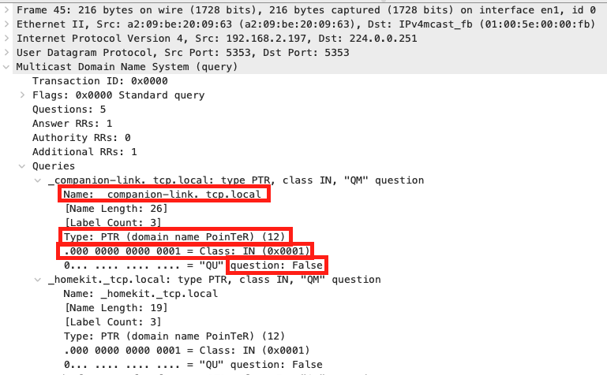
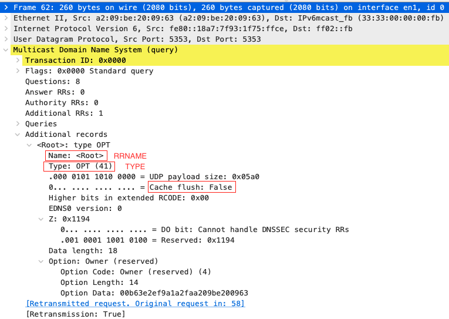

# mdns

## 参考

- [开源项目 avahi](https://github.com/lathiat/avahi)
- [开源项目 zeroconf](https://github.com/grandcat/zeroconf)
- [hashicorp/mdns 介绍与源代码分析](https://blog.csdn.net/u013272009/article/details/97546884)
- [mdns协议官方文档-rfc6762](res/rfc6762.txt)
- [网络协议之mDNS20170217](https://www.cnblogs.com/yuweifeng/p/6409182.html)
- [mdns 百度百科](https://baike.baidu.com/item/mdns)
- [利用 mDNS 协议来定位局域网主机](https://blog.beanbang.cn/2019/08/07/locate-hosts-using-mdns/)
- [(原创)Bonjour协议分析](https://liuweiqiang.win/2016/09/16/Bonjour%E5%8D%8F%E8%AE%AE%E5%88%86%E6%9E%90/)

## 概述

mdns用于本地网络服务和主机发现，基于UDP协议，域名以`.loacal`结尾，使用组播：IPv4地址`224.0.0.251`或IPv6地址`ff02::fb`，端口5353。

每个进入局域网的主机，如果开启了mDNS服务的话，都会向局域网内的所有主机组播一个包含域名和ip的消息，然后其他有mdns服务的主机就会响应。

当然设备需要服务时，使用mdns 查询域名对对应的ip地址，对应的设备收到该报文后同样通过组播方式应答；此时其他主机设备也是可以收到该应答报文，其他主机也会记录域名和ip 以及ttl 等，更新缓存。

## dns协议

参考：

- [名称解析和域名系统](https://github.com/hanjingo/doc/blob/master/NOTE/TCP_IP_ILLUSTRATED_V1/chapter11.md)

dns协议结构：

## mdns协议

mdns基于dns，协议结构与dns一致；

### 问题

mDNS问题部分字段：

| 领域     | 描述                                     | 长度（位） |
| -------- | ---------------------------------------- | ---------- |
| Name     | 查询所属的节点的名称                     | 变长       |
| Type     | 查询的类型，即应在响应中返回的RR类型     | 16         |
| question | 单播响应，布尔标志，指示是否需要单播响应 | 1          |
| Class    | 类代码，1代表互联网，“IN”代表IP网络      | 15         |

例：

### 记录

mDNS资源记录字段：

| 领域        | 描述                                             | 长度（位） |
| ----------- | ------------------------------------------------ | ---------- |
| Name        | 记录所属节点的名称                               | 变长       |
| Type        | 资源记录的类型                                   | 16         |
| Cache flush | 缓存刷新，布尔标志，指示是否应清除过时的缓存记录 | 1          |
| CLASS       | 类代码，1代表互联网和IP网络的“IN”                | 15         |
| TTL         | 应缓存RR的时间间隔（以秒为单位）                 | 32         |
| RDLENGTH    | 标识RDATA字段长度（以八字节为单位）的整数        | 16         |
| RDATA       | 资源数据；内部结构因RRTYPE而异                   | 变长       |

例：

## mdns流程

