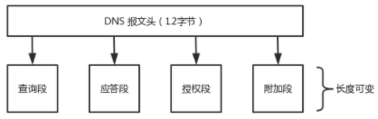
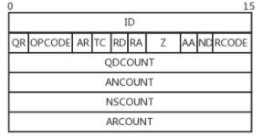
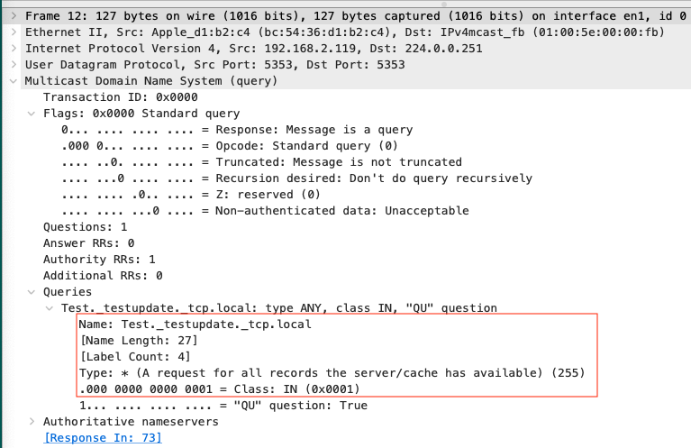
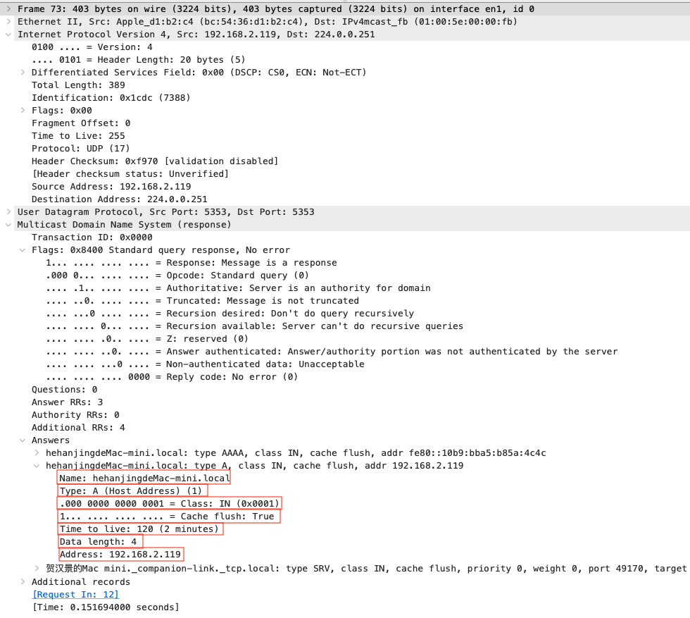
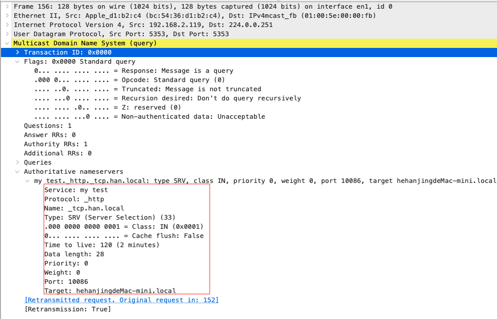
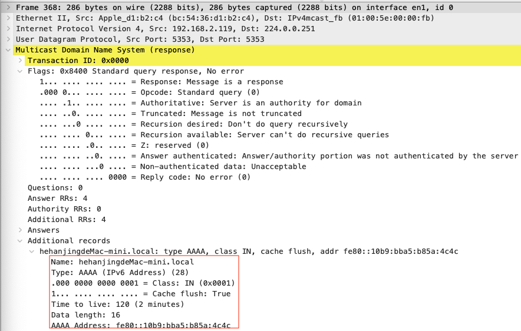

English | [中文版](mdns_zh.md)

# MDNS Protocol

[TOC]

## Overview

MDNS is used for local network service and host discovery. It is based on UDP, with domain names ending in `.local`, using multicast: IPv4 address `224.0.0.251` or IPv6 address `ff02::fb`, port 5353.

Every host that joins the LAN, if mDNS service is enabled, will multicast a message containing its domain name and IP to all hosts in the LAN. Other hosts with mDNS service will respond.

When a device needs a service, it uses mDNS to query the IP address corresponding to a domain name. The device receiving the query will also respond via multicast; other hosts can also receive this response, and will record the domain name, IP, TTL, etc., updating their cache.

### RR Types

| Value | RR Type | Reference                | Description and Purpose                                                                 |
| ----- | ------- | ----------------------- | -------------------------------------------------------------------------------------- |
| 1     | A       | [RFC1035]               | IPv4 address record (32-bit IPv4 address)                                              |
| 2     | NS      | [RFC1035]               | Name server; provides the name of an authoritative name server for the zone            |
| 5     | CNAME   | [RFC1035]               | Canonical name; maps one name to another (provides a form of alias)                    |
| 6     | SOA     | [RFC1035]               | Start of authority; provides authoritative info for the zone (name server, contact email, serial, timers) |
| 12    | PTR     | [RFC1035]               | Pointer; provides address-to-(canonical) name mapping; used for reverse lookups in `in-addr.arpa` and `ip6.arpa` domains for IPv4 and IPv6 |
| 15    | MX      | [RFC1035]               | Mail exchanger; provides the name of a mail host for a domain                          |
| 16    | TXT     | [RFC1035]<br>[RFC1464]  | Text; provides various info (e.g., used with SPF to identify authorized mail servers)  |
| 28    | AAAA    | [RFC3596]               | IPv6 address record (128-bit IPv6 address)                                             |
| 33    | SRV     | [RFC2782]               | Server selection; transport endpoint for generic services                              |
| 35    | NAPTR   | [RFC3403]               | Naming authority pointer; supports alternate namespaces                                |
| 41    | OPT     | [RFC2671]               | Pseudo-RR; supports larger datagrams, labels, return codes in ENDS0                    |
| 251   | IXFR    | [RFC1995]               | Incremental zone transfer                                                              |
| 252   | AXFR    | [RFC1035]<br>[RFC5936]  | Full zone transfer; carried over TCP                                                  |
| 255   | (ANY)   | [RFC1035]               | Request any record                                                                     |

### Structure

mDNS is based on DNS, and the protocol structure includes two parts: `header` and `message`;



- Header

	

	The header is 12 bytes long. Each field is explained below:
	- ID: Identifier, 16 bits
	- QR: Query/Response flag, 1 bit
		- 0: Query
		- 1: Response
	- OPCODE: Query type, 4 bits
		- 0: Standard query
		- 1: Inverse query
		- 2: Status query
		- 3: Reserved
		- 4: Notify
		- 5: Update
		- `6~15`: Reserved
	- AR: Set to 1 only in responses, 1 bit
	- TC: Truncation flag, 1 bit
	- RD: Optional, recursion desired, 1 bit
	- RA: Recursion available, 1 bit
	- Z: Reserved, must be 0, 3 bits
	- AD: Authentic data, 1 bit
	- CD: Checking disabled, 1 bit
	- RCODE: Set only in DNS responses, 4 bits
		- 0: No error
		- 1: Format error
		- 2: Server failure
		- 3: Name error
		- 4: Not implemented
		- 5: Refused
		- `6~15`: Reserved
	- QDCOUNT: Number of questions, 16 bits
	- ANCOUNT: Number of answers, 16 bits
	- NSCOUNT: Number of authority records, 16 bits
	- ARCOUNT: Number of additional records, 16 bits

- Message
	- Question section

| Variable | Description                | Length (bits) |
| -------- | ------------------------- | ------------- |
| QNAME    | Queried domain name        | variable      |
| QTYPE    | Query resource record type | 16            |
| QCLASS   | Query class (1=IN, etc.)   | 16            |

**Example:**



	- Answer section

| Variable            | Description                | Length (bits) |
| ------------------- | ------------------------- | ------------- |
| Name                | Queried domain name        | variable      |
| Type                | Resource record type (RR)  | 16            |
| Class               | Query class (1=IN, etc.)   | 16            |
| Time to live (TTL)  | RR cache time in seconds   | 32            |
| RDLength            | Length of DATA field       | 16            |
| RDATA<br>  Address  | Data field<br>  Address    | variable      |

**Example:**



	- Authority section

| Variable                                               | Description                                         | Length (bits)                |
| ------------------------------------------------------ | --------------------------------------------------- | ---------------------------- |
| Name                                                   | Domain:<br>  Service<br>  Protocol<br>  Name        | variable                     |
| Type                                                   | Resource record type (RR)                           | 16                           |
| Class                                                  | Query class (1=IN, etc.)                            | 16                           |
| Time to live (TTL)                                     | RR cache time in seconds                            | 32                           |
| Data length                                            | Length of DATA field                                | 16                           |
| Data:<br>  Priority<br>  Weight<br>  Port<br>  Target  | DATA field:<br>  Priority<br>  Weight<br>  Port<br>  Target | variable<br> 16<br> 16<br> 16<br> variable |



- Additional section

Structure is the same as the answer section.



## MDNS Process

- Name discovery:

```sequence
Querying host->Group 224.0.0.251: Send mDNS multicast message, providing its own name
Group 224.0.0.251->Queried host: Multicast message
Queried host->Querying host: Send mDNS response, including its domain name
```

- Name query:

```sequence
Querying host->Group 224.0.0.251: Send mDNS multicast query for domain ending with .local
Group 224.0.0.251->Queried host: Multicast message
Queried host->Group 224.0.0.251: Send mDNS response, including its hostname and IP address
Group 224.0.0.251->Querying host: Receive result
```

- Register (announce) service:

### Related Commands

#### dns-sd

- `-A`
	Test multicast DNS registration service, and test adding, updating, and deleting DNS records using multicast DNS.
- `-U`
	Test multicast DNS registration service, and test updating DNS TXT records for services registered with multicast DNS.
- `-N`
	Test adding large NULL records for services registered with multicast DNS.
- `-T`
	Test adding large TXT records for services registered with multicast DNS.
- `-M`
	Test creating registrations with multiple TXT records.
- `-I`
	Test registration and immediate TXT record update.
- `-R`
	Register (announce) a service with the given name and type in the specified domain, listening on the specified port of the current machine.
	Format: `dns-sd -R name type domain port <TXT>...`
	- name: Service name, valid unicode string (including dots, spaces, slashes, colons, etc.), max length 63 UTF-8 bytes.
	- type: Must be in the format `application-protocol._tcp` or `application-protocol._udp`.
	- domain: Domain to register the service in, ending with `.local`
	- port: Port number the service listens on
	- <TXT>: Text content, key-value type
	Example:
	```sh
	dns-sd -R "my test" _http._tcp han.local 10086 path=/main.html
	```
- `-B`
	Browse for instances of type services in the domain.
	Example:
	```sh
	dns-sd -B _http.tcp
	```
- ...

## References

- [Open source project mDNSResponder](https://blog.csdn.net/wirelessdisplay/article/details/78088992)
- [Open source project avahi](https://github.com/lathiat/avahi)
- [Open source project zeroconf](https://github.com/grandcat/zeroconf)
- [hashicorp/mdns introduction and source code analysis](https://blog.csdn.net/u013272009/article/details/97546884)
- [mdns protocol official doc - rfc6762](res/rfc6762.txt)
- [Network protocol mDNS20170217](https://www.cnblogs.com/yuweifeng/p/6409182.html)
- [mdns Baidu Encyclopedia](https://baike.baidu.com/item/mdns)
- [Locate LAN hosts using mDNS protocol](https://blog.beanbang.cn/2019/08/07/locate-hosts-using-mdns/)
- [(Original) Bonjour protocol analysis](https://liuweiqiang.win/2016/09/16/Bonjour%E5%8D%8F%E8%AE%AE%E5%88%86%E6%9E%90/)
- [Manual page section 1M: System management command dns-sd](https://docs.oracle.com/cd/E56344_01/html/E54077/dns-sd-1m.html)
- [mDNSResponder introduction and porting](https://blog.csdn.net/yuangc/article/details/101676976?utm_medium=distribute.pc_relevant.none-task-blog-2%7Edefault%7EBlogCommendFromMachineLearnPai2%7Edefault-4.control&dist_request_id=1332036.8429.16191622781102443&depth_1-utm_source=distribute.pc_relevant.none-task-blog-2%7Edefault%7EBlogCommendFromMachineLearnPai2%7Edefault-4.control)
- [avahi official introduction](https://www.avahi.org/)
