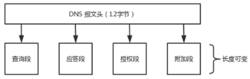
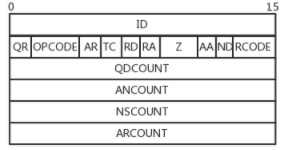
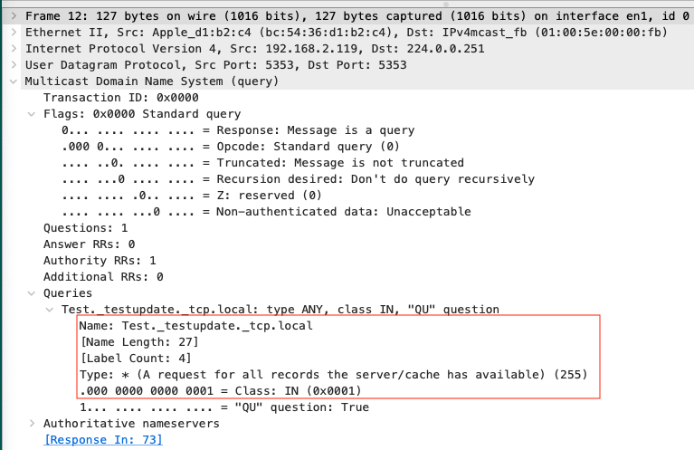
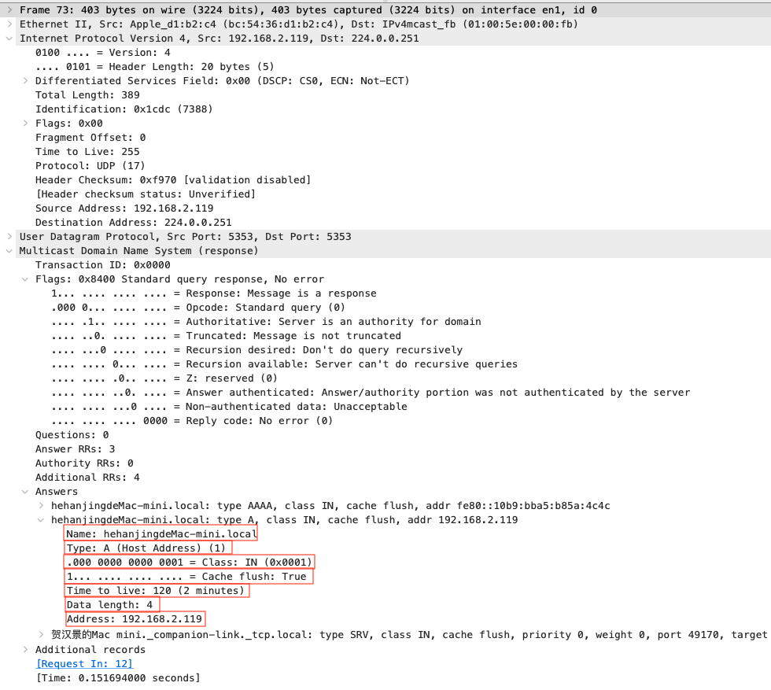
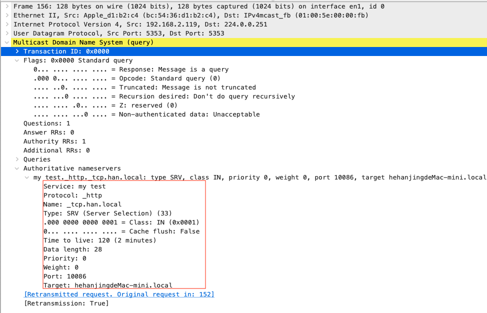
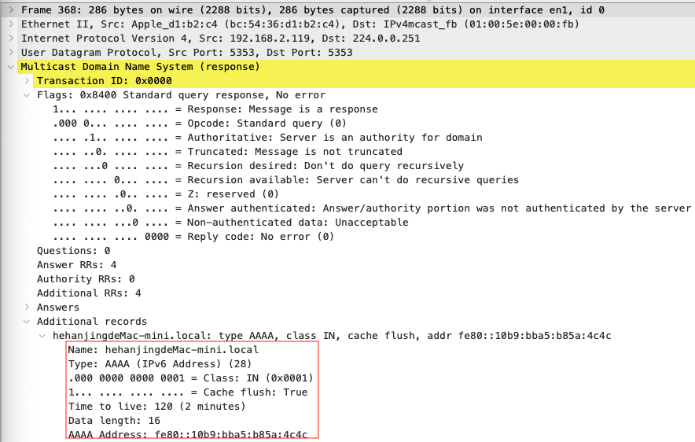

[TOC]

# MDNS协议


## 概述

MDNS用于本地网络服务和主机发现，基于UDP协议，域名以`.local`结尾，使用组播：IPv4地址`224.0.0.251`或IPv6地址`ff02::fb`，端口5353。

每个进入局域网的主机，如果开启了mDNS服务的话，都会向局域网内的所有主机组播一个包含域名和ip的消息，然后其他有mdns服务的主机就会响应。

当然设备需要服务时，使用mdns 查询域名对对应的ip地址，对应的设备收到该报文后同样通过组播方式应答；此时其他主机设备也是可以收到该应答报文，其他主机也会记录域名和ip 以及ttl 等，更新缓存。


## MDNS协议

#### RR类型

| 值   | RR类型 | 参考                   | 描述和目的                                                   |
| ---- | ------ | ---------------------- | ------------------------------------------------------------ |
| 1    | A      | [RFC1035]              | IPv4地址记录（32位IPv4地址）                                 |
| 2    | NS     | [RFC1035]              | 名称服务器；提供区域授权名称服务器的名称                     |
| 5    | CNAME  | [RFC1035]              | 规范名称；讲一个名称映射为另一个（提供一种形式的名称别名）   |
| 6    | SOA    | [RFC1035]              | 授权开始；为区域提供授权信息（名称服务器，联系的电子邮件地址，序列号，区域传输计时器） |
| 12   | PTR    | [RFC1035]              | 指针；提供地址到（规范）名称的映射；在`in-addr.arpa`和`ip6.arpa`域中用于IPv4和IPv6的逆向查询 |
| 15   | MX     | [RFC1035]              | 邮件交换器；为一个域提供电子邮件处理主机的名称               |
| 16   | TXT    | [RFC1035]<br>[RFC1464] | 文本；提供各种信息（如，与SPF发垃圾邮件方案一起使用以识别授权电子邮件服务器） |
| 28   | AAAA   | [RFC3596]              | IPv6地址记录（128位IPv6地址）                                |
| 33   | SRV    | [RFC2782]              | 服务器选择；通用服务的传输终点                               |
| 35   | NAPTR  | [RFC3403]              | 名称授权指针；支持交替的名称空间                             |
| 41   | OPT    | [RFC2671]              | 伪RR；支持更大的数据报，标签，ENDS0中的返回码                |
| 251  | IXFR   | [RFC1995]              | 增量区域传输                                                 |
| 252  | AXFR   | [RFC1035]<br>[RFC5936] | 完全区域传输；通过TCP运载                                    |
| 255  | (ANY)  | [RFC1035]              | 请求任意记录                                                 |

### 结构

mdns基于dns，协议结构包含`报头`和`报文`2部分；



- 报头

  

  报文头长12字节，以下是每个字段解释：

  - ID: 标识符，16bit
  - QR: 请求/应答标识符，1bit
    - 0: 请求
    - 1: 响应
  - OPCODE: 查询类型，4bit
    - 0: 标准查询
    - 1: 逆向查询
    - 2: 查询服务状态
    - 3: 保留
    - 4: 通知
    - 5: 更新
    - `6~15`: 保留baob
  - AR: 仅应答才设置为1，1bit
  - TC: 截断标志，1bit
  - RD: 可选项，标识要求递归与否，1bit
  - RA: 表示应答服务器可以执行递归查询，1bit
  - Z: 保留，必须为0，3bit
  - AD: 真实数据，1bit
  - CD: 禁止校验，1bit
  - RCODE: 仅在DNS应答时才设置，4bit
    - 0: 无错误
    - 1: 格式错误
    - 2: 严重失败
    - 3: 名字错误
    - 4: 没有实现
    - 5: 拒绝
    - `6~15`: 保留
  - QDCOUNT: 查询段数量，16bit
  - ANCOUNT: 回答段数量，16bit
  - NSCOUNT: 授权段数量，16bit
  - ARCOUNT: 附加段数量，16bit

- 报文

  - 查询段


| 变量名 | 描述                   | 长度（bit） |
| ------ | ---------------------- | ----------- |
| QNAME  | 查询的域名             | 变长        |
| QTYPE  | 查询资源记录类型（RR） | 16          |
| QCLASS | 查询类 1.表示互联网... | 16          |

**例：**



  - 应答段


| 变量名             | 描述                   | 长度（bit）    |
| ------------------ | ---------------------- | -------------- |
| Name               | 查询的域名             | 变长           |
| Type               | 查询资源记录类型（RR） | 16             |
| Class              | 查询类 1.表示互联网... | 16             |
| Time to live (TTL) | RR可以被缓存的秒数     | 32             |
| RDLength           | DATA字段的字节数       | 16             |
| RDATA<br>  Address | 数据字段<br>  地址     | 变长<br>  变长 |

**例：**


		
  - 授权段


| 变量名                                                | 描述                                                | 长度（bit）                             |
| ----------------------------------------------------- | --------------------------------------------------- | --------------------------------------- |
| Name                                                  | 域名:<br>  Service<br>  Protocol<br>  Name          | 变长                                    |
| Type                                                  | 查询资源记录类型（RR）                              | 16                                      |
| Class                                                 | 查询类 1.表示互联网...                              | 16                                      |
| Time to live (TTL)                                    | RR可以被缓存的秒数                                  | 32                                      |
| Data length                                           | DATA字段的字节数                                    | 16                                      |
| Data:<br>  Priority<br>  Weight<br>  Port<br>  Target | DATA字段:<br>  优先级<br>  权重<br>  端口<br>  目标 | 变长:<br>  16<br>  16<br>  16<br>  变长 |


	
- 附加段

结构同应答段一致。
	



## MDNS流程

- 域名发现:

```sequence
发起查询的主机->组224.0.0.251: 发送 mDNS 组播报文,提供自己的name
组224.0.0.251->被查询的主机: 组播消息
被查询的主机->发起查询的主机: 发送回应 mDNS 报文，内容包括自己的域名
```

- 域名查询：

```sequence
发起查询的主机->组224.0.0.251: 发送 mDNS 组播报文查询带.local后缀的域名
组224.0.0.251->被查询的主机: 组播消息
被查询的主机->组224.0.0.251: 发送回应 mDNS 报文，内容包括自己的主机名和 IP 地址
组224.0.0.251->发起查询的主机: 得到结果
```

- 注册（通告）服务：


### 相关命令

#### dns-sd

- `-A`

  测试使用多播 DNS 注册服务，并测试使用多播 DNS 的 DNS 记录的添加、更新和删除操作。
  
- `-U`

  测试使用多播 DNS 注册服务，并测试为使用多播 DNS 注册的服务更新 DNS TXT 记录。

- `-N`

  测试为使用多播 DNS 注册的服务添加大型 NULL 记录。

- `-T`

  测试为使用多播 DNS 注册的服务添加大型 TXT 记录。

- `-M`

  测试创建具有多个 TXT 记录的注册。

- `-I`

  测试注册并立即更新 TXT 记录。

- `-R`

  在给定name和type的指定域中注册（通告）服务，在当前计算机的指定port上侦听。

  格式：`dns-sd -R name type domain port <TXT>...`

  - name

    服务名，合法 `unicode 字符串（包括没有任何限制的点、空格、斜杠、冒号等）`，其最大长度是 63 个 UTF-8 字节。

  - type

    格式必须为 `应用程序协议名称._tcp` 或 `应用程序协议名称._udp`类型。

  - domain

    要注册服务的域名，以`.local`结尾

  - port

    服务侦听的端口号

  - <TXT>

    文本内容，key-value类型

  例：

  ```sh
  dns-sd -R "my test" _http._tcp han.local 10086 path=/main.html
  ```

- `-B`

  浏览 domain 中 type 服务的实例。

  例：

  ```sh
  dns-sd -B _http.tcp
  ```

- ...


## 参考

- [开源项目 mDNSResponder](https://blog.csdn.net/wirelessdisplay/article/details/78088992)
- [开源项目 avahi](https://github.com/lathiat/avahi)
- [开源项目 zeroconf](https://github.com/grandcat/zeroconf)
- [hashicorp/mdns 介绍与源代码分析](https://blog.csdn.net/u013272009/article/details/97546884)
- [mdns协议官方文档-rfc6762](res/rfc6762.txt)
- [网络协议之mDNS20170217](https://www.cnblogs.com/yuweifeng/p/6409182.html)
- [mdns 百度百科](https://baike.baidu.com/item/mdns)
- [利用 mDNS 协议来定位局域网主机](https://blog.beanbang.cn/2019/08/07/locate-hosts-using-mdns/)
- [(原创)Bonjour协议分析](https://liuweiqiang.win/2016/09/16/Bonjour%E5%8D%8F%E8%AE%AE%E5%88%86%E6%9E%90/)
- [手册页部分 1M： 系统管理命令 dns-sd](https://docs.oracle.com/cd/E56344_01/html/E54077/dns-sd-1m.html)
- [mDNSResponder介绍与移植](https://blog.csdn.net/yuangc/article/details/101676976?utm_medium=distribute.pc_relevant.none-task-blog-2%7Edefault%7EBlogCommendFromMachineLearnPai2%7Edefault-4.control&dist_request_id=1332036.8429.16191622781102443&depth_1-utm_source=distribute.pc_relevant.none-task-blog-2%7Edefault%7EBlogCommendFromMachineLearnPai2%7Edefault-4.control)
- [avahi官网介绍](https://www.avahi.org/)

